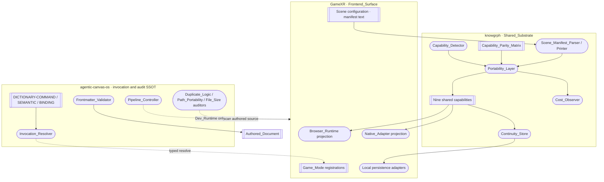
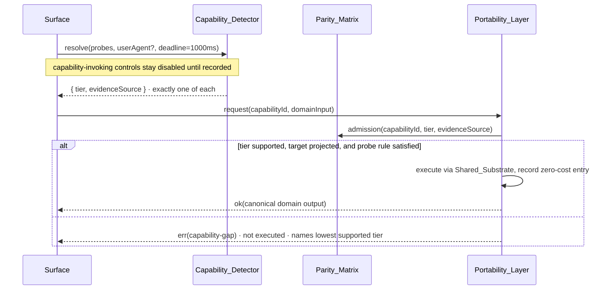
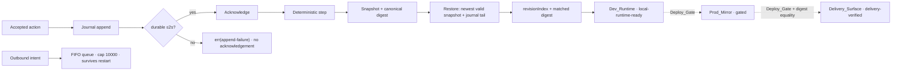

# Design Document

<!-- Responsibility: Define the single-owner architecture and evidence model for the Agentic Game OS Apple visionOS contract; Exports: none -->

## Design authority and scope

`requirements.md` in this directory is normative. This design assigns every
value in its closed Readiness_Subject enumeration to exactly one owning module
with one declared responsibility, and it extends the architecture that already
exists rather than opening a parallel one.

Read-only architectural inputs this design extends rather than duplicates:
`agentic-canvas-os/docs/START-WORKFLOW.md` and its three invocation dictionaries
(engineering contract, lane boundaries, deploy gates, `$GITHUB_ROOT` path rule);
`GameXR/docs/APPLE-COMPATIBILITY.md` (Apple baseline, runtime split, native
parity boundary, proof commands); `GameXR/docs/KNOWGRPH-HARMONIZATION.md`
(consumer pin record, ownership boundary);
`knowgrph/docs/documents/knowgrph-ar-vr-xr-prd-tad-adr.md` (the four-tier
capability enumeration, extended here rather than replaced); and the
`knowgrph-city-building-sim` and `geospatial-mode-enhancement` designs, whose
City Builder and Geo owners are reused unchanged.

Non-goals: a second renderer, scene graph, map, invocation registry, cost
schema, or continuity substrate; any provisioned service; and any ungated,
unrecorded, or digest-mismatched Prod_Mirror or Cloudflare mutation. Pipeline
delivery verification requires the same protected Composite_Candidate to pass
Dev_Runtime, Prod_Mirror, and Delivery_Surface in order (Requirement 10.3);
production readiness additionally requires the complete Requirement 14 receipt.

## Overview

**From one authored Scene_Manifest to the highest experience a device supports**:
Invocation_Resolver → Capability_Detector → Capability_Parity_Matrix →
Portability_Layer → Shared_Substrate capability → Browser_Runtime or
Native_Adapter projection → Continuity_Store → Pipeline_Controller at
Dev_Runtime, with Prod_Mirror and Delivery_Surface behind an explicit
Deploy_Gate.

Deliverable A splits across three repositories on the boundary that already
exists: `agentic-canvas-os` owns invocation and audit authority, `knowgrph` owns
every shared capability and backend utility, and `GameXR` owns visual projection,
interaction presentation, scene configuration, and local persistence adapters
only. Deliverable B is one authored document validated by those same auditors, so
document conformance is executable rather than reviewed by eye.

Three decisions carry most of the weight. **The domain contract is data, not
code**: Scene_Manifest text and the Capability_Parity_Matrix are schema-validated
documents both runtimes decode from the same bytes, which makes cross-runtime
equality testable (6.8, 8.9). **Detection resolves a tier; the parity matrix
resolves admission**, so the never-elevating user-agent rule (6.12) lives in one
place. **Continuity is a journal plus a lease plus an intent queue**, device-local,
with every acknowledgement ordered behind a durable append, so offline play and
restore are the same code path.

## Architecture

### Repository boundary



Every arrow crossing a repository boundary is a pinned package or product
resolution (Requirement 4.3), never a source copy. `GameXR` holds zero
implementations of a shared capability (Requirement 4.4).

### Capability admission path



### Continuity and pipeline path



## Components and Interfaces

### Readiness subject owner map

Every value in the closed Readiness_Subject enumeration maps to exactly one
owning module with one declared responsibility. Paths resolve from
`$GITHUB_ROOT`; broad repository subjects aggregate the lowest rung of their
listed executable children rather than creating a second implementation.

| Component | Owning module | Declared responsibility | Must not own |
|---|---|---|---|
| Shared_Substrate | `knowgrph/grph-shared/src/portability/index.ts` | Export the pinned shared capability, manifest, continuity, and cost contracts owned by knowgrph | Frontend rendering, deployment, consumer aliases |
| Frontend_Surface | `GameXR/src/main.ts` | Compose GameXR presentation adapters and the registered game-mode set over pinned Shared_Substrate contracts | Shared domain logic, codecs, continuity semantics |
| Game_Mode | `GameXR/src/runtime/GameRegistry.ts` | Register stable mode identities and perform atomic activation; its aggregate rung is the lowest rung of all registered modes | Capability implementations, rendering engines, persistence semantics |
| Portability_Layer | `knowgrph/grph-shared/src/portability/portabilityLayer.ts` | Admit or reject one capability request against the parity matrix, then dispatch to the owning shared capability | Tier resolution, renderer objects, persistence |
| Capability_Detector | `knowgrph/grph-shared/src/portability/capabilityDetector.ts`; Swift peer `KnowgrphSpatialCore/CapabilityDetector.swift` | Resolve exactly one Capability_Tier plus exactly one evidence source within 1000 ms | Admission decisions, capability execution |
| Capability_Parity_Matrix | `knowgrph/contracts/capability-parity-matrix.json` with schema `knowgrph/schemas/capability-parity-matrix.schema.json` | Declare the tier enumeration, its total order, and per-capability supported tiers and projection statuses as data | Any executable branch, any runtime default |
| Scene_Manifest | `knowgrph/schemas/scene-manifest.schema.json` (schema); manifest **values** authored in `GameXR/src/config/` | Declare category shape, identifier and bound rules, schema version | Runtime fallback values |
| Scene_Manifest_Parser | `knowgrph/packages/scene-manifest/src/parse.ts`; Swift peer `KnowgrphSceneManifest/Parse.swift` | Validate text into a canonical object or one typed validation error naming every violated field | Printing, persistence, rendering |
| Scene_Manifest_Printer | `knowgrph/packages/scene-manifest/src/print.ts`; Swift peer `KnowgrphSceneManifest/Print.swift` | Format a validated object into canonical text, byte-identical for canonically equal objects | Validation, persistence |
| Continuity_Store | `knowgrph/packages/continuity-store/src/` (journal, snapshot, lease, intent queue); Swift peer `KnowgrphContinuity` | Durable append-before-acknowledge, restore, lease arbitration, FIFO intent queue, fail-closed reads | Storage backend specifics, scene values |
| Pipeline_Controller | `agentic-canvas-os/scripts/pipeline-controller.mjs` | Sequence Dev_Runtime → Prod_Mirror → Delivery_Surface, consume Deploy_Gate authorizations, append one audit entry per outcome | Building artifacts, capability logic |
| Invocation_Resolver | `agentic-canvas-os/scripts/invocation-resolve.mjs` | Resolve one prefixed token against exactly one dictionary in the Invocation_SSOT | Aliases, mirrors, nearest-match substitution |
| Frontmatter_Validator | `agentic-canvas-os/scripts/audit/frontmatter-validator.mjs` | Validate the eleven-field frontmatter block, rung enumeration and rank ordering, and required document parts | File writes, line counting |
| Sibling_Preservation_Auditor | `agentic-canvas-os/scripts/audit/sibling-preservation-auditor.mjs` | Record and recheck source revision, byte length, and digest for every Sibling_Document before and after the sole authored-document write | Editing, normalizing, or replacing sibling bytes |
| Duplicate_Logic_Auditor | `agentic-canvas-os/scripts/audit/duplicate-logic-auditor.mjs` | Validate the closed ownership manifest; resolve the complete static call graph; apply declared selectors; report exact duplicate functions or audit-incomplete | Deleting code, capability execution |
| Path_Portability_Auditor | `agentic-canvas-os/scripts/audit/path-portability-auditor.mjs` | Report filesystem-root path literals and operating-system account names in authored source | Rewriting sources |
| File_Size_Auditor | `agentic-canvas-os/scripts/audit/file-size-auditor.mjs` | Report every authored file exceeding 600 lines | Splitting files automatically, symbol ownership |
| Hardcode_Auditor | `agentic-canvas-os/scripts/audit/hardcode-auditor.mjs` with policy `agentic-canvas-os/contracts/agentic-game-os-runtime-literal-policy.json` | Classify only policy-selected AST literals and require each value to come from its one declared allowed source | Rewriting source, guessing secret patterns, supplying runtime values |
| Single_Responsibility_Auditor | `agentic-canvas-os/scripts/audit/single-responsibility-auditor.mjs` | Enforce one normalized responsibility/export record and exact equality with statically discovered exports | Inferring ownership from filenames, accepting dynamic exports, splitting files automatically |
| Cost_Observer | `knowgrph/grph-shared/src/cost/costObserver.ts` with record schema `knowgrph/schemas/cost-record.schema.json` | Record exactly one cost entry per step or invocation | Budget enforcement, model calls |
| Native_Adapter | `GameXR/native/Sources/GameXRNative/` over `KnowgrphSpatialCore`, `KnowgrphRealityKitFlight`, `KnowgrphSceneManifest`, `KnowgrphContinuity` | RealityKit/SwiftUI projection and Core Motion lifecycle only | Domain math, codecs, continuity engine |
| Browser_Runtime | `GameXR/src/runtime/`, `GameXR/src/ui/`, `GameXR/src/storage/` over `@knowgrph/*` packages | Three.js projection, pointer/permission UI lifecycle, IndexedDB adapter | Domain math, codecs, continuity engine |

### Shared capability owners reused unchanged

The nine capabilities of Requirement 4.1 keep their existing knowgrph owners.
This design adds no new capability module and renames none.

| Capability | Existing knowgrph owner | Frontend projection |
|---|---|---|
| Immersive Input | `packages/apple-spatial-input` (TS) and `KnowgrphAppleSpatialInput` (Swift) | Pointer/touch and RealityView input adapters |
| Motion Control | `packages/apple-spatial-input` device-orientation profile; `KnowgrphSpatialCore` Core Motion contract | `DeviceOrientationController.ts`, `GameXRDeviceMotionController.swift` |
| Flight Sim | deterministic flight model in `packages/apple-spatial-input`; `KnowgrphRealityKitFlight` | `FlightSimulation.ts`, `GameXRRealityView.swift` |
| Camera | follow/chase target resolver in `packages/apple-spatial-input` | Three.js chase camera projection |
| Animation | `knowgrph/ecs` animation owner | `AnimationController.ts` |
| Media | `knowgrph/canvas/src/lib/render/richMediaSsot.ts` surface-mode resolution | Media figure/caption projection |
| Game Mode | `knowgrph/canvas/src/lib/canvas/canvas3dMode.ts` surface-mode arbitration | `GameRuntime.ts` registry entry point |
| City Builder | `CitySimRuntime`, `citySimEconomy`, `citySimCodec` per the city-building-sim design | City Builder panel and overlay projection |
| Geo | `knowgrph/gympgrph/src/` geospatial owners per the geospatial-mode design | Geo overlay projection |

FloatingPanel remains the existing knowgrph panel-projection host; it presents
capability state and owns no capability behavior.

### Root-source consolidations this design requires

These are root-source fixes at the owning module, not downstream shims
(Requirement 11.1, 11.2). Each removes duplication rather than adding a layer.

| Current state | Consolidation | Requirement |
|---|---|---|
| `GameXR/native/Sources/GameXRNative/GameXRSceneManifest.swift` decodes the manifest locally | Becomes a thin adapter over `KnowgrphSceneManifest`; the codec moves to the Shared_Substrate | 4.2, 8.9 |
| `GameXR/src/storage/LocalDatabase.ts` holds store semantics | Retains the IndexedDB adapter only; journal, lease, and intent-queue semantics move to `knowgrph/packages/continuity-store` | 4.2, 5.1, 9.3 |
| Capability tiers exist as prose in the AR/VR/XR document | Become the schema-validated `capability-parity-matrix.json` the AR/VR/XR document's Capability Detector reads | 6.5 |

### Typed interfaces

```ts
// knowgrph/grph-shared/src/portability/types.ts — single responsibility: contract types.
export type Result<T, E> = { ok: true; value: T } | { ok: false; error: E };
export type CapabilityTier = 'flat-fallback' | 'pseudo-ar-depth-parallax'
  | 'webxr-vr' | 'webxr-ar' | 'native-spatial';
export type EvidenceSource = 'feature-detection' | 'user-agent' | 'fallback';
export type ProjectionStatus = 'projected' | 'validated-not-projected';
export type ProbeOutcome = { determinate: true; value: boolean } | { determinate: false };
export type Unresolved = { readonly unresolved: true; readonly field: string };
export interface TierResolution {                  // exactly one tier + one source
  readonly tier: CapabilityTier; readonly evidenceSource: EvidenceSource;
  readonly resolvedAtMs: number;                   // ≤ 1000
  readonly probeResults: ReadonlyMap<string, ProbeOutcome>;
}
export interface EvidenceSourceError {
  readonly code: 'evidence-source'; readonly observed: readonly unknown[];
  readonly fallback: TierResolution;
}
export interface CapabilityDetector {
  resolve(i: { probes: ReadonlyMap<string, () => Promise<ProbeOutcome>>; userAgent: string | null;
    deadlineMs: 1000 }): Promise<Result<TierResolution, EvidenceSourceError>>;
}
export interface PortabilityLayer {
  request<I, O>(id: CapabilityId, target: 'browser' | 'native', r: TierResolution, input: I): Result<O, CapabilityGapError>;
  status(): Result<PortabilityStatus, never>;      // read-only, never mutates
  control(op: ControlOperation): Promise<Result<ControlOutcome, ControlRejection>>;
}
export type ControlOperation =
  | { id: 'apply-scene-manifest'; manifestId: string; canonicalText: string }
  | { id: 'activate-game-mode'; gameModeId: string }
  | { id: 'reset-continuity-world'; worldId: string; expectedUnreadableDigest: string; confirmation: 'reset-unreadable-world' }
  | { id: 'advance-pipeline-stage'; stage: 'prod-mirror' | 'delivery-surface'; candidateManifestDigest: string; authorizationId: string };
export type ControlOutcome = { operationId: ControlOperation['id']; scope: 'dev-runtime' | 'prod-mirror' | 'delivery-surface'; effectDigest: string };
export type ControlRejection = { code: 'control-rejected' | 'busy' | 'out-of-scope'; operationId: string; reason: string };
export interface PortabilityStatus {               // all five fields always present
  readonly tier: CapabilityTier | Unresolved;
  readonly parityMatrix: ParityMatrixState | Unresolved;
  readonly gameModes: readonly GameModeId[];       // 0..32
  readonly restoredRevisionIndex: number | Unresolved;
  readonly deployGate: DeployGateState | Unresolved;
}
```

The Swift peers mirror these as `Result`-returning `Codable` value types in
`KnowgrphSpatialCore`; no Swift type introduces a field absent from the shared
schema, which is what makes decode agreement checkable.
The first three control IDs have `dev-runtime` scope; `advance-pipeline-stage`
has its named stage scope. Reset additionally requires the live unreadable
digest and exact confirmation. The control schema rejects extra keys before the
single-operation lock and returns outcome or rejection with operation ID/scope.

## Data Models

### Capability tier enumeration and total order

The enumeration extends the four browser tiers already declared in the
knowgrph AR/VR/XR document with one native member. It is closed, totally
ordered, and has exactly one lowest member (Requirement 6.5).

| Rank | Tier | Determinate probe that admits it | Lowest member |
|---:|---|---|---|
| 1 | `flat-fallback` | none required | yes |
| 2 | `pseudo-ar-depth-parallax` | `webgl2` context creation succeeds | no |
| 3 | `webxr-vr` | `xr.isSessionSupported('immersive-vr')` returns true | no |
| 4 | `webxr-ar` | `xr.isSessionSupported('immersive-ar')` returns true | no |
| 5 | `native-spatial` | RealityKit availability on the Native_Adapter | no |

Ordering rationale: each rank strictly adds a presentation capability the rank
below cannot express. `native-spatial` ranks highest because it is the only tier
with owned spatial scene lifecycle rather than a browser-mediated session.

Resolution rules, all in `capabilityDetector.ts`:

- At least one determinate probe and at least one true admitting probe → highest
  admitted tier; all determinate values false → `flat-fallback`; both use
  evidence source `feature-detection` (6.2).
- No determinate probe, user-agent present → `flat-fallback`, evidence source
  `user-agent` (6.3); every capability
  requiring a determinate probe remains absent and no counterfactual probe
  result is inferred (6.12).
- No determinate probe and no user-agent, or the 1000 ms deadline elapses, or
  every source raises → `flat-fallback`, evidence source `fallback` (6.4).
- Zero, two, or out-of-enumeration evidence sources → typed
  `evidence-source` error plus `flat-fallback` (6.11).

### Capability parity matrix

```jsonc
// knowgrph/contracts/capability-parity-matrix.json (shape)
{ "schemaVersion": "knowgrph-capability-parity-matrix/v1",
  "tiers": [ { "id": "flat-fallback", "rank": 1 }, /* … rank 5 */ ],
  "capabilities": [ { "id": "motion-control",
    "supportedTiers": ["pseudo-ar-depth-parallax", "webxr-vr", "webxr-ar", "native-spatial"],
    "requiredProbes": [
      { "target": "browser", "probeId": "browser-motion-control", "requiredValue": true },
      { "target": "native", "probeId": "native-motion-control", "requiredValue": true } ],
    "browserProjection": "projected", "nativeProjection": "projected",
    "canonicalFields": ["normalizedPitch", "normalizedRoll", "normalizedYaw", "settled"] } ] }
```

Each target probe is true only after that adapter's runtime feature check proves the capability usable; physical matrices prove its device-specific touch, motion, or hand mechanism, and user-agent text never synthesizes it.
Projection statuses come from `GameXR/docs/APPLE-COMPATIBILITY.md`, not re-derived here.

| Capability | Supported tiers | Required target probes | Browser | Native |
|---|---|---|---|---|
| Immersive Input | ranks 1–5 | browser `browser-immersive-input=true`; native `native-immersive-input=true` | `projected` | `projected` |
| Motion Control | ranks 2–5 | browser `browser-motion-control=true`; native `native-motion-control=true` | `projected` | `projected` |
| Flight Sim | ranks 1–5 | none | `projected` | `projected` |
| Game Mode | ranks 1–5 | none | `projected` | `projected` |
| Animation | ranks 1–5 | none | `projected` | `validated-not-projected` |
| Camera | ranks 1–5 | none | `projected` | `validated-not-projected` |
| Media | ranks 1–4 | none | `projected` | `validated-not-projected` |
| City Builder | ranks 1–4 | none | `projected` | `validated-not-projected` |
| Geo | ranks 1–4 | none | `projected` | `validated-not-projected` |

A `validated-not-projected` target decodes and validates the capability's
canonical fields but is excluded from the cross-target equality check
(Requirement 6.9).

### Scene_Manifest schema shape

```jsonc
{
  "schemaVersion": "knowgrph-scene-manifest/v1",   // required, exactly one
  "gameModeId": "flight-simulator",                 // 1..64 chars
  "scenes":     [ /* 0..1000 entries, unique id within category */ ],
  "assets":     [ /* 0..1000 */ ],
  "motions":    [ /* 0..1000 */ ],
  "animations": [ /* 0..1000 */ ],
  "cameras":    [ /* 0..1000 */ ],
  "controls":   [ /* 0..1000 */ ]
}
```

Entry shape, identical in every category:

| Field | Rule |
|---|---|
| `id` | 1–64 characters, unique within its category, stable across revisions |
| `kind` | closed per-category enumeration |
| `numbers` | map of name → `{ value, min, max }`; every numeric value carries declared bounds (Requirement 8.1) |
| `refs` | identifiers of entries in other categories; must resolve within the same manifest |

Canonical bytes use RFC 8785 JSON Canonicalization Scheme after rejecting
non-NFC strings and non-finite numbers: object keys take RFC-8785 order, numbers
take its shortest representation, every schema array preserves authored order,
strings use JSON escaping, and the result is UTF-8 with no insignificant
whitespace. Collection membership and array order are canonical fields
(Requirements 8.6–8.9); TypeScript and Swift replay the same byte vectors.

Bounds: text 1 byte to 4 MiB, parse within 2 s, at most 1000 entries per
category. Violations produce one typed validation error naming every violated
field with its expected type, and no object (Requirement 8.5).

### Continuity_Store model

```ts
interface WorldRecord {          // one per world identity
  worldId: string; schemaVersion: 'knowgrph-continuity/v1';
  seed: string; revisionIndex: number; canonicalDigest: string; byteLength: number;
}
interface JournalEntry {         // append-only, durable before acknowledgement
  worldId: string; sequence: number; actionId: string;
  payloadCanonicalBytes: Uint8Array; payloadDigest: string;
  previousDigest: string | null; appendedAtMs: number; digest: string;
}
interface SnapshotRecord {
  worldId: string; revisionIndex: number; tick: number;
  canonicalBytes: Uint8Array; digest: string; byteLength: number;
}
interface ManifestRevision {     // Scene_Manifest history
  manifestId: string; revisionIndex: number; canonicalText: string; digest: string;
}
interface WriteLease {
  worldId: string; sessionId: string; epoch: number;
  acquiredAtMs: number; renewedAtMs: number; ttlSeconds: 30;
}
interface IntentQueue {
  worldId: string; capacity: 10000;              // FIFO, order preserved
  entries: readonly { sequence: number; payloadCanonicalBytes: Uint8Array;
    payloadDigest: string; enqueuedAtMs: number }[];
}
```

Invariants the store enforces:

- **Append before acknowledge**: an append is confirmed durable before the
  surface acknowledges, independent of acknowledgement delivery (9.3); failure
  or a >2 s confirmation returns `append-failure` and withholds it (9.9).
- **Monotone revisions**: a persisted `revisionIndex` is exactly one greater
  than the highest persisted index for that manifest (8.10).
- **Fail-closed reads**: schema failure, digest mismatch, or truncation returns
  `unreadable-record`, leaves every stored byte of that world and every other
  world byte-identical, and exposes an explicit reset action (9.5).
- **Lease exclusivity with expiry**: an unexpired lease makes a second writer
  fail with `write-lease-conflict` (9.6); a lease unrenewed for 30 s expires and
  the next request is admitted (9.10).
- **Bounded FIFO queue**: at capacity the newest intent is rejected with
  `queue-full`, every queued intent and its order are retained (9.11), and order
  survives restarts (9.8).
- **Replay determinism**: one seed plus one ordered sequence of 1–10,000 actions
  replayed in two fresh runtimes reports equal canonical digests (9.7).

World state, action payloads, snapshots, manifests, and queued intents use the
Scene_Manifest canonical-byte algorithm. Every digest is lowercase SHA-256 of
those bytes; a journal digest hashes canonical `{worldId, sequence, actionId,
payloadDigest, previousDigest, appendedAtMs}`, making the chain independently
replayable in both runtimes.

### Consumer pin, cost record, and deploy-gate records

```ts
interface ConsumerPin { identifier: string; revision: string; digest: string } // exactly one each
type DeliveryRouteId = 'airvio.co' | 'airvio.co/knowgrph' | 'airvio.co/gamexr';
interface DeliveryArtifactRecord { routeId: DeliveryRouteId; artifactDigest: string }
interface NativeArtifactRecord {
  productId: string; target: 'ios' | 'ipados' | 'visionos'; artifactDigest: string;
}
interface CompositeCandidateCore {
  schema: 'agentic-game-os-composite-candidate/v1';
  repositories: Readonly<Record<'agentic-canvas-os' | 'knowgrph' | 'GameXR' | 'huijoohwee.github.io', string>>;
  sharedPins: readonly ConsumerPin[]; deliveryArtifacts: readonly DeliveryArtifactRecord[];
  nativeArtifacts: readonly NativeArtifactRecord[];
}
interface SealedCompositeCandidate {
  schema: 'agentic-game-os-composite-candidate-envelope/v1';
  candidate: CompositeCandidateCore; manifestDigest: string;
  aggregateDeliveryArtifactDigest: string;
}
interface CostRecord {
  modelIdentity: string | null; promptTokens: number; completionTokens: number;
  cacheHitRate: number; /* 0..1 */ estimatedCost: number; currencyUnit: string;
}
interface DeployGateAuthorization {
  authorizationId: string; operatorIdentity: string;
  targetStage: 'prod-mirror' | 'delivery-surface';
  candidateManifestDigest: string; deliveryArtifactDigest: string;
  issuedAtMs: number;            // consumed once, valid 60 minutes
}
interface PhysicalDeviceMatrix {
  candidateManifestDigest: string; device: 'iphone' | 'ipad' | 'apple-vision-pro';
  model: string; operatingSystemVersion: string; runDate: string;
  entries: readonly { id: string; procedureId: string; expected: unknown;
    observed: unknown; exitStatus: number; evidenceDigest: string; passed: boolean }[];
}
```

The matrix schema fixes each entry's procedure and pass predicate; record bytes
cannot redefine `expected`, and the verifier recomputes `passed` from `observed`.

Composite-candidate normalization requires unique shared-pin identifiers sorted
ascending, exactly one delivery record for each closed DeliveryRouteId sorted by
`routeId`, and exactly three `GameXRNative` records, one per target, sorted by the UTF-8 key
`productId + "\u0000" + target`. After rejecting non-NFC strings and non-finite
numbers, RFC 8785 canonical JSON preserves those normalized array orders and
excludes both envelope digest fields. `manifestDigest` is the
lowercase SHA-256 of the canonical candidate-core bytes;
`aggregateDeliveryArtifactDigest` is the lowercase SHA-256 of the canonical
`deliveryArtifacts` array bytes. Every constituent digest is lowercase
64-character SHA-256, so either aggregate is independently recomputable.

A pin mismatch marks the artifact `pin-mismatched`, retains every build output,
and exits completed so the operator decides (4.7); a Deploy_Gate request for a
`pin-mismatched` artifact is rejected before any target-stage mutation (4.8).

## Authored_Document validation (Deliverable B)

The document is validated by executable checks, not review prose. All checks run
locally at zero cost.

| Check | Owner | Pass condition | Requirement |
|---|---|---|---|
| Frontmatter schema and presence | Frontmatter_Validator | First line opens one `---` block declaring exactly the eleven fields, each once, each with ≥1 non-whitespace character, completing ≤5 s; an absent document returns `document-missing` and creates no file | 1.2, 1.3, 1.5, 1.10 |
| Rung enumeration, rank, and gap matrix | Frontmatter_Validator | Rungs ∈ {`undocumented`:1, `spec-complete`:2, `runtime-ready`:3}, `rank(delivered) ≤ rank(local)`, one rung and one gap-matrix row per closed Readiness_Subject value, `runtime-ready` only with command + revision + observed output and exit status + satisfied criterion identifiers | 1.7, 14.1–14.4, 14.8 |
| Document parts and sibling citation | Frontmatter_Validator | One PRD, one TAD, and one ADR part as distinct top-level sections citing Requirements 2–14 by number; each of the three source-owned siblings cited by a resolvable `$GITHUB_ROOT`-relative path with no machine-specific prefix | 1.4, 2.4 |
| Line cap | File_Size_Auditor | ≤600 newline-separated lines including frontmatter | 1.8, 1.11 |
| Reference-implementation placement | Frontmatter_Validator placement rule | Every concrete stack, platform version, or workspace-relative module path sits under a heading whose text contains `reference implementation` | 1.9, 1.12 |
| Sibling preservation and sole write target | Sibling_Preservation_Auditor | Protected source revision, byte length, and digest of the three siblings equal their recorded baseline, evaluated from the baseline rather than version-control state and including untracked siblings; count of other files touched under the documents directory is zero | 2.2, 2.3, 2.6, 2.8 |
| Invocation register | Invocation_Resolver | Every listed `/`, `#`, `@` token resolves to exactly one Invocation_SSOT entry | 3.5 |
| Exact change-set hygiene | Path_Portability_Auditor, Hardcode_Auditor, Single_Responsibility_Auditor | Every feature-authored or modified text file has portable references, every policy-selected literal comes from its declared source, and exactly one normalized responsibility/export record equals the discovered static export set; unchanged preservation inputs are outside this scan | 11.3, 11.4, 11.6, 11.8, 11.9, 11.11 |
| Validation coverage | Frontmatter_Validator | Every acceptance criterion identifier appears in at least one checklist entry | 14.5, 14.6 |

Because no runtime evidence reference is surfaced at authoring time, the
document declares `local_rung: spec-complete` and `delivered_rung: undocumented`
(Requirement 1.6), and every Readiness_Subject rung follows from evidence
absence rather than opinion.

## Correctness Properties

*A property is a characteristic or behavior that should hold true across all
valid executions of a system — essentially, a formal statement about what the
system should do. Properties serve as the bridge between human-readable
specifications and machine-verifiable correctness guarantees.*

The 35 candidates in the requirements Appendix consolidate to **41 numbered
properties**, each a universally quantified statement with a named property class
and a named generator. They are stated in full in
`design-correctness-properties.md` — split out only to keep every authored file
under 600 lines, as the engineering contract requires. That file is part of this
design and is normative.

Class coverage, and what each class is doing here:

| Class | Properties | What it proves |
|---|---|---|
| Round trip | 1, 2, 21 | Manifest parse/print in both directions and world close/reopen restore |
| Model based | 4 | TypeScript and Swift decoders agree on acceptance and canonical fields |
| Metamorphic | 13 | Browser and native canonical output equality at shared tiers |
| Idempotence | 6 | Applying a scene edit twice equals applying it once |
| Invariant | 3, 8, 10, 11, 12, 14, 16, 17, 18, 19, 20, 22, 24, 25, 27, 28, 29, 30, 31, 32, 33, 35, 36, 37, 39, 40, 41 | Totality, monotonicity, exclusivity, ordering, partition, and bound rules |
| Error condition | 5, 7, 9, 15, 23, 26, 34, 38 | Typed, complete, byte-preserving, fail-closed failure paths |

### Property-based testing library per runtime

| Runtime | Library | Licence | Cost | Invocation |
|---|---|---|---|---|
| Browser / TypeScript | `fast-check`, exact pinned version | MIT | $0, local, no egress | `npm run test:properties` |
| Swift | `SwiftCheck`, exact pinned version, resolved offline into `Package.resolved` | MIT | $0, local, no egress | `swift test --package-path native` |

Both are FOSS, run entirely on the operator's device, and add no provisioned
resource. No property test is implemented from scratch in either runtime. If
`SwiftCheck` cannot build under the declared Swift 6.3 strict-concurrency
baseline, the fallback is the mechanism `APPLE-COMPATIBILITY.md` already uses: a
repository-owned deterministic Swift runner replays the TypeScript-exported
vector corpus, keeping one generator source of truth rather than two generators
that agree only with themselves.

Every property test runs a minimum of 100 iterations and carries the tag comment
`Feature: agentic-game-os-apple-vision-os, Property {number}: {property text}`.

## Error Handling

Every fallible operation returns `Result<T, E>`; no code path throws across a
module boundary, and no error is repaired downstream (Requirement 11.2). Each
error carries a stable `code`, the named subject, and — where the requirement
demands it — the *complete* set of failures in one response rather than the
first one found.

| Error family | Codes | Guarantees on the error path |
|---|---|---|
| Document | `document-missing`, `document-invalid`, `rung-combination`, `placement-violation`, `file-size` | Document bytes unchanged; no file created |
| Sibling preservation | `missing-sibling`, `sibling-drift` | Zero writes under the documents directory; completion report withheld |
| Invocation | `malformed-token`, `unresolved`, `ambiguous-entry`, `duplicate-prefix`, `competing-source` | Dictionary bytes unchanged; zero substitutions; malformed tokens read no dictionary |
| Ownership | `duplicate-logic`, `audit-incomplete`, `pin-mismatch`, `missing-capability`, `divergence-violation` | Build outputs retained; artifact marked, not discarded; incomplete ≠ clean |
| Registry | `duplicate-identity`, `invalid-registration`, `unknown-identity`, `exit-failure`, `entry-failure`, `activation-recovery-failure` | Exit failure retains incumbent; requested-entry failure cleans once and restores incumbent once, or leaves zero overlays if recovery fails; no rejected mode becomes active |
| Portability | `capability-gap`, `evidence-source` | Capability not executed; lowest tier resolved on evidence error |
| Manifest | `manifest-validation`, `change-rejected`, `persistence-failure` | No object returned; live scene restored to last persisted revision; store records unchanged |
| Continuity | `unreadable-record`, `append-failure`, `write-lease-conflict`, `queue-full` | Every stored byte of every world byte-identical; acknowledgement withheld; queue order retained; reset action exposed |
| Pipeline | `unclean-worktree`, `authorization-missing`, `digest-mismatch` | Rejection before target-stage mutation; exactly one immutable outcome audit entry; zero retries; no forbidden process started |
| Hygiene | `root-source`, `hardcode`, `path-portability`, `single-responsibility` | Authored files byte-identical to their pre-review state; admission withheld |
| Cost and bounds | `cost-accounting`, `iteration-limit`, `infrastructure-violation` | Records committed before the limit retained; completion claim withheld |
| Agent surface | `control-rejected`, `busy`, `out-of-scope` | Zero effects applied; in-progress operation completes unchanged; records byte-identical |
| Readiness | `coverage-gap`, `evidence-invalid` | Component rung lowered to `spec-complete` or `undocumented` |

Unresolved status fields are never omitted and never fail the response: each is
returned as `{ unresolved: true, field }` alongside every other field
(Requirement 13.7).

## Testing Strategy

Unit, property, and local integration tests run locally at zero cost with no
egress. Authorized mirror/delivery smoke checks necessarily use network egress;
each is separately gated and no test class substitutes for another.

**Property tests** implement the 41 properties, one property-based test each,
minimum 100 iterations, tagged with the design property number. `fast-check`
covers the TypeScript surface; `SwiftCheck` covers the Swift surface; the shared
JSON vector corpus is the only bridge between them, which is what makes
Properties 4 and 13 meaningful rather than two independent implementations
agreeing with themselves.

**Unit tests** cover the example-classified criteria and nothing more: the
authored document's three parts and requirement citations (1.4), its existence
and sibling citations (2.1, 2.4), the invocation register resolving end to end
(3.5), the three named Game_Modes and registry capacity (5.2), the declared
Apple baseline values and their citations (7.1, 7.9), the no-world-data boundary
statement (10.9), and the TCO, FOSS-alternative, and time-to-value declarations
(12.5, 12.6, 12.7). Deliberately few — the properties already cover input
variation.

**Integration tests** cover the Apple toolchain, reusing the commands
`APPLE-COMPATIBILITY.md` already owns rather than adding new ones:
`npm run native:check` (Xcode/Swift/SDK/RealityKit identity, Swift tests, iOS and iPadOS Simulator destinations, native
visionOS cross-compile gate, and native Vision Pro tests only when a true native
destination exists) and `npm run test:webkit` (mobile WebKit lifecycle,
exact Safari identity, permission ordering, cached-byte integrity, offline navigation). These validate
7.4, 7.5, 7.6, 7.11 and Dev_Runtime reachability with 1–3 examples each; they are
not run 100 times.

**Smoke checks** run once: the infrastructure inventory comparison for 12.4 and
12.10; the Dev_Runtime start from a clean canonical worktree; and, only after an
exact candidate receives a valid Deploy_Gate authorization, the protected
Prod_Mirror and Delivery_Surface promotion. Production proof binds the sealed
Composite_Candidate manifest digest, all four protected repository revisions,
aggregate delivery artifact digest, mirror digest, every route digest, and live
readiness record for all three declared routes.

**Promotion gates that automated testing cannot close**: physical iPhone, iPad,
and Apple Vision Pro matrices, real Safari permission prompts, Core Motion
sensor quality, haptics, audio routing, installed-PWA behavior, and thermal
behavior. Each stays `pending` in the readiness gap matrix until a recorded
device run names the device model, OS version, run date, and a pass result for
every matrix entry (Requirement 7.8). A pending physical-device row permits a
`spec-complete` or `local-runtime-ready` report but withholds
`production-runtime-ready`. Simulator and headless-browser evidence is never
promoted into a physical-device claim.
