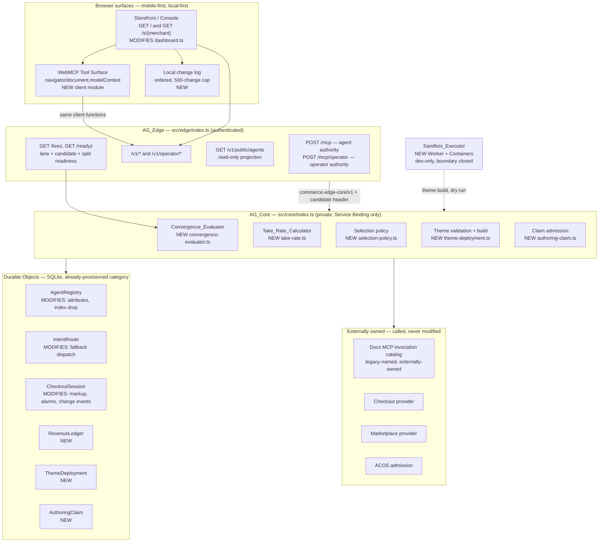
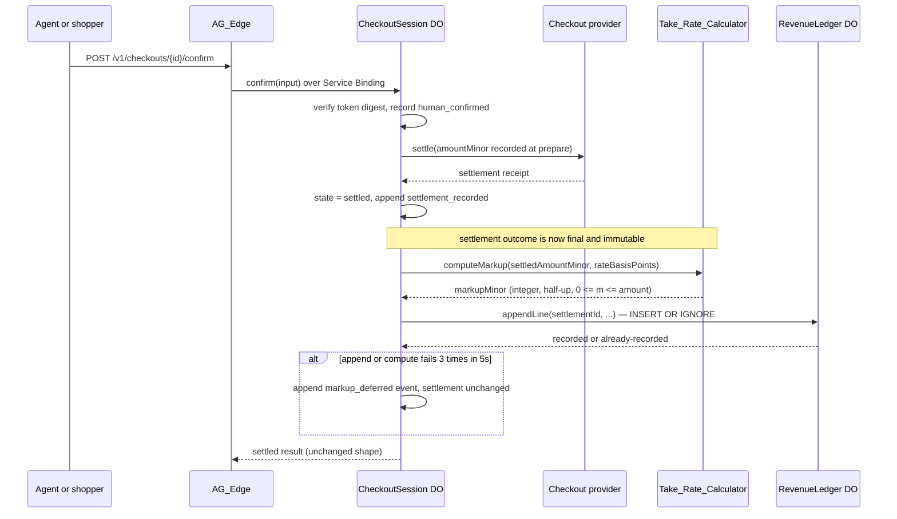
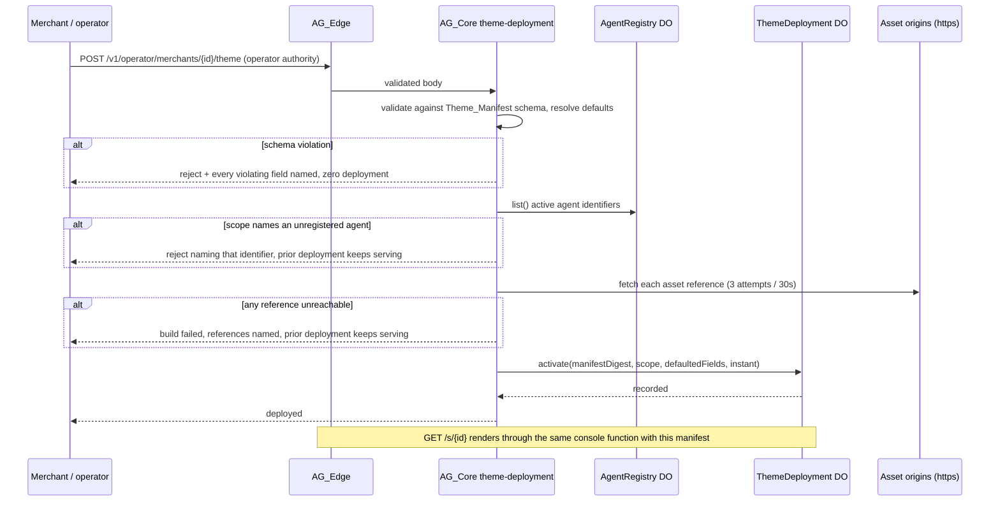

# Design Document

## Overview

This design realizes 13 requirements over a runtime that already exists. The predecessor design at `.kiro/specs/knowgrph-agentic-commerce-platform/design.md` proposed three new units (`agent-registry.ts`, `definition-validator.ts`, `registry-canvas.ts`); the baseline built that shape and more, so this design **starts from the built code and states, per element, whether it EXTENDS, MODIFIES, or is NEW**. Requirements 1 and 2 are deliberately the smallest edits in the increment: Requirement 1 changes zero `src/` values and Requirement 2 changes one comparison rule inside one 135-line file.

Baseline proximity, verified by reading the files rather than inferred:

| Requirement | What already exists at the baseline | What this design adds |
|---|---|---|
| 1 Terminology | 23 raw legacy matches in 6 files; **21 real, 2 false positives inside `package-lock.json` integrity hashes**; all 21 name upstream-owned targets or prose | A register, a boundary-aware checker, prose renames. Zero `src/` value change |
| 2 Convergence | `verifyUpstreamRuntimeEvidence` with exact key-set, exact check-set, exact `prdRevision` equality | Required-set satisfaction, surplus tolerance, major/minor `prdRevision` rule, typed verdict |
| 3 Take-rate | `CheckoutSession` DO with `settlement_recorded` evidence event and one settlement call | Pure calculator, one `RevenueLedger` DO, one ledger append after settlement |
| 4 Template Pack | `dashboard.ts` — script-free, inline-CSS, mobile breakpoint at 720px | Theme manifest, defaults, per-merchant scope, one renderer for both surfaces |
| 5 Environment chain | `dev` script only; Production `routes: []`; `/livez` already reports lane and candidate | `dev:apex`, one declared route, release controller, split readiness fields |
| 6 Invocation surface | Pinned catalog returning revision, digest, and three per-sigil counts; 3 required tokens; 8 MCP tools | Capability→token map, per-capability MCP coverage, register-derived bounds |
| 7 WebMCP | Console has no client script and CSP `default-src 'none'` | Browser tool surface over shared client actions, tool-set digest, drift refusal |
| 8 Routing | Deterministic exclusive router that **refuses** ambiguity; SQLite unique index forbidding two active agents per category | Selection policy, fallback dispatch, public projection — and dropping that index |
| 9 Local-first | Server-rendered read-only console; no client state | Local change log, ordered replay, order-independent merge, claim admission |
| 10 Offer change | Append-only `checkout_event` log per session | Alarm-driven observation, typed change events, confirmation invalidation |
| 11 Sandbox | None | Isolated executor for merchant builds and pre-registration dry runs |
| 12 Merge agent | None | Bounded Node automation over one lane, zero deployment authority |
| 13 Evidence | Three verification lanes (`node --test`, Vitest, `workerd`) plus `npm run check` | Named checks, bounds schema, evidence emitter, file-size and secret scans |

### Design goals, framed by the operating constraints

- **Extend, do not add categories.** Every stateful addition is a SQLite Durable Object, the category already provisioned in `wrangler.core.jsonc`. Requirements 4.11 and 9.10 are satisfied structurally, not by promise. The single exception is Requirement 11, which adopts Cloudflare Containers under ADR-13 — isolated in its own Worker so no Requirement 4 or 9 criterion depends on it.
- **Model-free by construction.** Routing, selection, convergence, take-rate, theme validation, merge, and observation are deterministic. The only model call in the path is the upstream Intent Parser, unchanged. This increment adds **zero token cost**.
- **One invocation authority.** No second token registry. New capabilities extend the declared required-token set and the capability→token map; the three `/`, `#`, `@` dictionaries remain upstream-owned.
- **Mobile-first, local-first.** The console is already script-free and server-rendered; Requirement 9 adds a bounded client state layer, not a framework.
- **File discipline.** Every authored file ≤600 lines (Requirement 13.7). This design document obeys its own rule, which is why the 128-criterion map and the typed contracts are annexes rather than truncation, and why the contracts annex is itself split along the boundary between edits to built files (A1) and new surfaces (A2).

### Honest gaps this design does not close

1. **Requirement 1.5 is only partially satisfiable.** The endpoint address and tool name the platform *calls* are owned by the upstream Agentic Canvas OS docs MCP service and still carry the legacy form. Requirement 1.10 anticipates this; the design records them `externally-owned` and introduces **zero alias layer**. Criterion 1.5 is therefore satisfied for repository-owned identity only, and Annex B records it as partial.
2. **Requirement 1.6's rejection table is empty at first build.** No baseline endpoint or tool identity carries a legacy form, so the guard is a mechanism whose table is register-derived. CP-1 tests the mechanism over generated register entries; the runtime table starts empty and that is stated, not hidden.
3. **A public storefront needs a shopper authority the baseline lacks — now approved and specified.** `/v1/*` is bearer-protected today. Requirement 7 needs the page to call checkout routes. `POST /v1/session` issues a short-lived, origin-bound, HttpOnly, `SameSite=Strict`, `Secure` first-party storefront session scoped to storefront read and checkout-preparation actions only (Design Decision 14, operator-approved). Human confirmation through the visual surface stays mandatory before every settlement; the session never substitutes for it. No unauthenticated payment-adjacent route is introduced.
4. **Requirement 3.11's principal identity is the registered agent, not an external payer.** The ledger can count distinct agent identifiers with two or more settlements; it cannot yet distinguish an external principal from the operator. Reported as a gap, not as demand evidence.
5. **Requirement 3.7 has no start hook.** Workers have no startup phase. The design maps "refuse to start" onto fail-closed-at-first-request plus a readiness check, recorded as Design Decision 6.
6. **Browser measurement needs a new dev dependency — approved.** Requirements 4.6 and 9.1/9.5/9.6 need a real engine. Playwright is adopted dev-only, exact-pinned (Design Decision 15, operator-approved), so `npm run check:browser` is a real lane and those criteria carry automated browser evidence rather than operator-run `demo.md` measurement.

## Architecture

Two Workers, one private service binding, four Durable Object classes at baseline growing to seven, one isolated container layer. Nothing else.



### Settled-markup flow (Requirement 3)

Order is the safety property: settlement is recorded before any markup exists, so no markup failure can change a settlement outcome, and the amount sent to the provider is fixed before the calculator runs.



### Merchant deployment flow (Requirement 4)

No per-merchant deploy. One Worker, one renderer, one manifest per merchant — which is what keeps Requirement 4.11 true.



### Concurrency and lane model (Requirement 9.7–9.9, Requirement 12.8)

`START-WORKFLOW.md` supplies the vocabulary: one active writer per lane, a claim binding actor, device, session, worktree, branch, semantic scope, lease epoch, and fence revision. The design lifts exactly that shape into `AuthoringClaim`, a SQLite DO holding one row per semantic scope. Admission predicate, enforced in one place and reused by every operator mutation route and by Merge_Agent:

```
admit(mutation, claim, now, fence) =
     claim.scope == mutation.scope
  && claim.leaseExpiresAt > now
  && claim.fenceRevision == fence
  && disjoint(claim.declaredWriteSet, everyOtherCurrentClaim.declaredWriteSet)
```

A refused mutation writes zero bytes and returns the holder's claim identity, lease epoch, and fence revision. The claim record is authority-bearing; local projections are diagnostics, never grounds for transfer.

## Components and Interfaces

Full typed contracts live in Annex A1 (`design-interfaces-baseline-edits.md`, Requirements 1–6) and Annex A2 (`design-interfaces-new-surfaces.md`, Requirements 7–13). This section states the disposition, the file, the single responsibility, and the criteria each element carries.

| # | Element | Disposition | File | Single responsibility | Criteria |
|---|---|---|---|---|---|
| 1 | Terminology_Register | NEW | `config/terminology-register.json` | One disposition per legacy occurrence | 1.1–1.4, 1.7, 1.10 |
| 2 | Terminology checker | NEW | `scripts/validate-terminology-register.ts` | Boundary-aware scan, per-occurrence naming | 1.9, 1.4 |
| 3 | Terminology guard | NEW | `src/shared/terminology-guard.ts` | Reject a legacy identity form, name the superseding form | 1.6 |
| 4 | Invocation constants | MODIFIES (values unchanged) | `src/invocation/catalog.ts` | Single endpoint and tool identity | 1.5 |
| 5 | Runtime prose | MODIFIES | `README.md`, `docs/production-runtime.md` | Superseding platform name and PRD reference | 1.1, 1.4 |
| 6 | Convergence_Evaluator | NEW | `src/core/convergence-evaluator.ts` | One verdict from advertised evidence and declared requirements | 2.1–2.3, 2.5–2.8, 2.10 |
| 7 | Upstream evidence adapter | MODIFIES | `src/core/upstream-evidence.ts` | Pin reading, required check sets, thin adapter to the verdict | 2.1–2.8 |
| 8 | Readiness composition | MODIFIES | `src/core/index.ts`, `src/edge/index.ts` | One verdict per provider, split source and live fields | 2.4, 2.9, 2.11, 5.10 |
| 9 | Take_Rate_Calculator | NEW | `src/core/take-rate.ts` | Integer half-up markup from amount and basis points | 3.1, 3.3, 3.4 |
| 10 | RevenueLedger DO | NEW | `src/core/revenue-ledger.ts` | Append-only settled markup lines and period reads | 3.2, 3.5, 3.9, 3.10, 3.11 |
| 11 | CheckoutSession markup hook | MODIFIES | `src/core/checkout-session.ts` | Post-settlement markup append and deferral event | 3.1, 3.2, 3.6, 3.8 |
| 12 | Take-rate configuration gate | MODIFIES | `src/core/index.ts` | Fail-closed on an invalid rate | 3.7 |
| 13 | Theme_Manifest schema | NEW | `src/shared/theme-manifest.ts` | Parse, validate, resolve defaults, digest | 4.1, 4.2, 4.4 |
| 14 | Theme deployment | NEW | `src/core/theme-deployment.ts` | Scope check, asset build, activation record | 4.3, 4.9, 4.10 |
| 15 | ThemeDeployment DO | NEW | `src/core/theme-deployment-store.ts` | One current manifest per merchant | 4.3, 4.9, 4.10 |
| 16 | Console renderer | MODIFIES | `src/edge/dashboard.ts` | One render function for operator and merchant surfaces | 4.1, 4.5–4.8, 9.1, 9.6 |
| 17 | Merchant catalog projection | NEW | `src/core/merchant-catalog.ts` | Scope-filtered listing projection | 4.5, 4.8 |
| 18 | Dev lane entry points | MODIFIES | `package.json` | `dev` and `dev:apex` only | 5.1, 5.2 |
| 19 | Delivery route declaration | MODIFIES | `wrangler.edge.jsonc` | Exactly one Production route | 5.3 |
| 20 | Release_Controller | NEW | `scripts/release-controller.ts` | Sole advancing mechanism, authorization and retirement | 5.4–5.8 |
| 21 | Capability→token map | NEW | `config/capability-token-map.json` | One `/`, ≥1 `#`, ≥1 `@` per capability action | 6.2, 6.7 |
| 22 | Invocation bounds | MODIFIES | `src/core/index.ts`, `src/core/agent-registry.ts` | Register-declared token count instead of the fixed 3 and 12 | 6.2, 6.3 |
| 23 | Operator MCP mount | MODIFIES | `src/edge/index.ts` | Every capability reachable by `/` command token | 6.7 |
| 24 | Storefront actions | NEW | `src/edge/client/storefront-actions.ts` | The one client function set both surfaces call | 7.2, 7.4 |
| 25 | WebMCP registration | NEW | `src/edge/client/webmcp-tools.ts` | Register tools, compute and verify the tool-set digest | 7.1, 7.3, 7.5–7.7 |
| 26 | Selection policy | NEW | `src/domain/selection-policy.ts` | Score eligible agents, tie by ascending identifier | 8.1, 8.2, 8.7 |
| 27 | Router | MODIFIES | `src/domain/exclusive-category-router.ts` | Select one of many instead of refusing ambiguity | 8.1, 8.3, 8.6 |
| 28 | Registry attributes and index | MODIFIES | `src/core/agent-registry.ts` | Declared price, quality, latency; drop the one-per-category index | 8.1, 8.2, 8.8 |
| 29 | Fallback dispatch | MODIFIES | `src/core/intent-route.ts` | At most one fallback, typed exhaustion | 8.4, 8.5 |
| 30 | Public_Catalog_View | NEW | `src/core/public-catalog.ts` | Unauthenticated read-only active-agent projection | 8.8–8.10 |
| 31 | Local change log | NEW | `src/edge/client/local-store.ts` | Ordered offline retention and replay | 9.1–9.3, 9.5 |
| 32 | Sync merge | NEW | `src/core/sync-merge.ts` | Order-independent convergence | 9.4 |
| 33 | AuthoringClaim DO | NEW | `src/core/authoring-claim.ts` | One active writer per semantic scope | 9.7–9.9, 12.8 |
| 34 | Offer_Change_Listener | NEW | `src/core/offer-watch.ts` | Observe held-offer attributes, emit typed change events | 10.1, 10.2, 10.5–10.8 |
| 35 | Session alarm and gate | MODIFIES | `src/core/checkout-session.ts` | Alarm scheduling, confirmation invalidation, settlement refusal | 10.1, 10.3, 10.4 |
| 36 | Sandbox_Executor | NEW | `src/sandbox/executor.ts` + `wrangler.sandbox.jsonc` | Isolated build and dry-run execution with recorded limits | 11.1–11.8 |
| 37 | Merge_Agent | NEW | `scripts/merge-agent/*.ts` | Bounded review, repair, and conflict work on one lane | 12.1–12.9 |
| 38 | Evidence emitter | NEW | `scripts/evidence-reference.ts` | One reference per satisfied condition | 13.3–13.6, 13.11 |
| 39 | Authored-file scans | NEW | `scripts/validate-authored-limits.ts` | 600-line ceiling, path, credential, account scans | 13.7, 13.8 |
| 40 | Task bounds schema | NEW | `config/task-bounds.schema.json` | Five bounds plus a circuit-breaker signal per task | 13.1, 13.2 |

### The five load-bearing contracts

```ts
// 6 — src/core/convergence-evaluator.ts (NEW)
export type ConvergenceVerdict = Readonly<{
  provider: string
  state: 'converged' | 'converged-with-surplus' | 'blocked'
  reason: string | null
  requiredSatisfied: readonly string[]
  requiredAbsentOrFailing: readonly string[]   // 2.3
  surplusChecks: readonly string[]             // 2.2
  unnamedEnvelopeFieldCount: number            // 2.7
  declaredContractRevision: string
  advertisedContractRevision: string | null    // 2.6 records both
  identityFailures: readonly string[]          // 2.8
}>
export function evaluateConvergence(
  advertised: unknown, declared: DeclaredRequirements,
): Promise<ConvergenceVerdict>   // deterministic, one SHA-256, no I/O
```

```ts
// 9 — src/core/take-rate.ts (NEW). Pure, integer-only, no I/O, no model call.
export function computeMarkupMinor(
  settledAmountMinor: number, rateBasisPoints: number,
): number   // half-up: (a*bp + 5000) / 10000 floored; 0 <= result <= a for bp <= 10000
export function readRateBasisPoints(value: unknown): number | null  // AG_ key, 1..1000
```

```ts
// 13 — src/shared/theme-manifest.ts (NEW)
export type ThemeManifestVerdict =
  | Readonly<{ ok: true; manifest: ThemeManifest; defaultedFields: readonly string[]; digest: string }>
  | Readonly<{ ok: false; violations: readonly Readonly<{ field: string; reason: string }>[] }>
export function validateThemeManifest(value: unknown): Promise<ThemeManifestVerdict>
```

```ts
// 26 — src/domain/selection-policy.ts (NEW). Externalized weights, no model call.
export type DeclaredAttributes = Readonly<{ priceMinor: number; qualityScore: number; latencyMs: number }>
export function selectAgent(
  eligible: readonly Readonly<{ agentId: string; attributes: DeclaredAttributes }>[],
  policy: SelectionPolicy,
): Readonly<{ selectedAgentId: string; score: number; consideredAgentIds: readonly string[] }> | null
// ties in score resolve by ascending agentId (8.1)
```

```ts
// 33 — src/core/authoring-claim.ts (NEW)
export type ClaimAdmission =
  | Readonly<{ ok: true; claimId: string; leaseEpoch: number; fenceRevision: string }>
  | Readonly<{ ok: false; code: 'scope_held' | 'lease_expired' | 'write_set_overlap' | 'fence_stale'
      holdingClaimId: string | null; holdingLeaseEpoch: number | null; holdingFenceRevision: string | null }>
```

## Data Models

Every new table is SQLite inside a Durable Object. Adding DO classes and DDL obliges a `wrangler.core.jsonc` migration tag (`v2`) **and** an update to `docs/do-storage-compatibility.json`, which `scripts/validate-do-storage-compatibility.ts` already enforces in the `test:domain` lane — a real baseline constraint, not an optional step.

### Terminology_Register — `agentic-graph-terminology-register/v1`

```jsonc
{
  "schema": "agentic-graph-terminology-register/v1",
  "fileScope": {
    "include": ["tracked repository-authored files"],
    "exclude": ["node_modules/**", "package-lock.json", "src/generated/**", ".recovery/**"]
  },
  "matcher": {
    "boundaryAware": true,
    "caseSensitiveTerms": ["KG_", "kgc"],
    "caseInsensitiveTerms": ["knowgrph", "knowledgegraph", "knowledge-graph"]
  },
  "occurrences": [{
    "path": "src/invocation/catalog.ts", "line": 2, "legacyIdentifier": "knowgrph",
    "supersedingIdentifier": "agentic-graph", "disposition": "externally-owned",
    "owningSystem": "Agentic Canvas OS docs MCP service (Cloudflare-hosted)",
    "reason": "Upstream owns this address path; renaming it here would create an alias layer AGENTS.md forbids",
    "readOnly": true
  }]
}
```

Disposition is exactly one of `renamed`, `externally-owned`, `historical-record`. `externally-owned` requires `owningSystem` and `reason` (1.2). `historical-record` requires `preservingArtifact` and `readOnly: true` (1.3). Baseline dispositions: 2 in `src/invocation/catalog.ts` and 6 in `wrangler.core.jsonc` and 1 test fixture → `externally-owned`; 1 in `README.md` and 11 in `docs/production-runtime.md` → `renamed`, except the two lines recording the baseline PRD revision → `historical-record`; the 2 `package-lock.json` matches are excluded by file scope and eliminated by boundary-aware matching, which is why the matcher is part of the schema.

### Revenue_Ledger — `RevenueLedger` DO, SQLite

```sql
CREATE TABLE IF NOT EXISTS revenue_line (
  settlement_id      TEXT PRIMARY KEY,          -- 3.5 one line per settlement
  agent_id           TEXT NOT NULL,
  settled_amount_minor INTEGER NOT NULL CHECK (settled_amount_minor >= 0),
  currency           TEXT NOT NULL,             -- ISO-4217, ^[A-Z]{3}$
  applied_rate_bp    INTEGER NOT NULL CHECK (applied_rate_bp BETWEEN 1 AND 1000),
  markup_minor       INTEGER NOT NULL CHECK (markup_minor >= 0),
  recorded_at_ms     INTEGER NOT NULL,          -- UTC ms, 3.9
  recorded_at        TEXT NOT NULL              -- ISO-8601 ms, 3.9
);
CREATE INDEX IF NOT EXISTS revenue_line_period ON revenue_line (recorded_at_ms, settlement_id);
```

Period read (3.10): `WHERE recorded_at_ms >= :startInclusive AND recorded_at_ms < :endExclusive ORDER BY recorded_at_ms ASC, settlement_id ASC`. The returned sum is recomputed by folding the returned rows, never read from a maintained total — that is what makes CP-7 meaningful.

### Theme_Manifest — `agentic-graph-theme-manifest/v1`

| Field | Type | Bound | Default |
|---|---|---|---|
| `merchantId` | string | identifier pattern, ≤128 | required |
| `palette.{ink,muted,line,panel,accent,background}` | string | `^#[0-9a-f]{6}$` | baseline console palette |
| `logo` | object | `{ href: https URL ≤2048, alt: ≤280 }` | wordmark, no image |
| `copy.{brand,headline,subhead,footer}` | string | ≤280 chars (4.2) | baseline console copy |
| `catalogScope` | string[] | 1..500 agent identifiers (4.2) | required |
| `locale` | string | BCP-47 ≤35 | `en-US` |
| whole manifest | — | ≤65536 bytes (4.2) | — |

Unknown keys reject. Every omitted optional field is resolved to the declared default and its name recorded (4.4), which is what CP-8 round-trips.

### Convergence_Verdict and Readiness_Report

`Readiness_Report` carries `sourceReadiness` and `liveReleaseReadiness` as two named fields (2.11, 5.10), plus one `ConvergenceVerdict` per declared provider. `ok` is true only when every verdict reads `converged` or `converged-with-surplus` **and** `liveReleaseReadiness.ok` is true. In the Dev lane `liveReleaseReadiness` reads `{ ok: false, reason: 'delivery_route_unauthorized_in_dev' }` without issuing a request, keeping Requirement 5.2 true.

### Evidence_Event — one shape, three producers

```ts
export type EvidenceEvent = Readonly<{
  sequence: number                // append-only, monotonic per session
  eventType: string               // e.g. 'settlement_recorded' | 'markup_deferred' | 'offer_changed'
  evidence: unknown               // canonical JSON, digest-stable
  createdAt: string               // UTC ISO-8601 ms
}>
```

Producers: `CheckoutSession` (baseline `checkout_event` table, reused unchanged in shape), `Offer_Change_Listener` (writes into that same table — Requirement 10 adds event types, not a table), and `AgentRegistry` (`registry_event`, unchanged). New event types this increment: `markup_recorded`, `markup_deferred`, `offer_changed`, `offer_agent_inactive`, `offer_observation_failed`, `offer_observation_suspended`, `webmcp_registration_drift`, `webmcp_surface_unavailable`.

## Correctness Properties

*A property is a characteristic or behavior that should hold true across all valid executions of a system — essentially, a formal statement about what the system should do. Properties serve as the bridge between human-readable specifications and machine-verifiable correctness guarantees.*

The requirements baseline fixes the property set at CP-1..CP-24; the prework confirmed that set is already non-redundant, so no property is added or removed. Each is stated compactly to keep this file inside its own 600-line ceiling; class, generators, and iteration counts appear in Testing Strategy.

### Property 1: CP-1 — Legacy identity rejection parity
(metamorphic). *For all* requests exercising a renamed endpoint or tool identity, substituting the superseding identifier for the legacy identifier while holding request content fixed leaves the response body and status unchanged, and the legacy form yields a typed rejection naming the superseding form. **Validates: Requirements 1.5, 1.6, 1.8**
### Property 2: CP-2 — Surplus never blocks, deficit always blocks
(invariant). *For all* advertised check sets, adding a passing check outside the Required_Check_Set never turns `converged` into `blocked`, and removing any Required_Check_Set member always yields `blocked` naming that member. **Validates: Requirements 2.1, 2.2, 2.3, 2.7**
### Property 3: CP-3 — Verdict determinism
(invariant). *For all* advertised evidence envelopes and declared requirement sets, two evaluations of the same pair yield the identical Convergence_Verdict including identical recorded reasons in identical order. **Validates: Requirements 2.10**
### Property 4: CP-4 — Forward-compatible revision and identity blocking
(error condition). *For all* advertised envelopes and declared revisions, a convergent verdict is returned only where the advertised major component equals the declared major component and the advertised minor component is no lower than the declared minor component; otherwise `blocked` is returned naming every absent or failing required member, every violated identity or integrity field, and both revision values. **Validates: Requirements 2.3, 2.5, 2.6, 2.8**
### Property 5: CP-5 — Markup arithmetic and non-interference
(invariant). *For all* settled amount and rate pairs, the markup is an integer in minor units no less than 0 and no greater than the settled amount, equals half-up rounding of the basis-point rate applied to the settled amount, and the provider-requested amount equals the amount recorded before the computation. **Validates: Requirements 3.1, 3.4, 3.6**
### Property 6: CP-6 — Ledger idempotence
(idempotence). *For all* settlement identifiers, recording the same settlement twice yields the identical Revenue_Ledger state as recording it once, with exactly one line and an unchanged markup amount and applied rate. **Validates: Requirements 3.2, 3.5**
### Property 7: CP-7 — Period read-back and aggregation
(invariant). *For all* settlement sequences and period bounds, the returned line set equals the stored lines whose recording instant falls in that period in the declared order, the summed markup equals the sum recomputed from those returned lines, and every returned line carries a complete field set. **Validates: Requirements 3.9, 3.10**
### Property 8: CP-8 — Theme manifest round trip
(round trip). *For all* valid Theme_Manifest values, serialize-parse-serialize yields an equivalent manifest, the validation verdict is identical across both representations, and the defaulted-field set is identical. **Validates: Requirements 4.1, 4.2, 4.4**
### Property 9: CP-9 — Catalog scope containment
(invariant). *For all* Theme_Manifest and Agent_Registry pairs, every listing a Template_Pack deployment returns lies inside that merchant's declared catalog scope, and a manifest naming an absent agent identifier yields a reject result and zero deployment. **Validates: Requirements 4.3, 4.5**
### Property 10: CP-10 — Resolution totality
(invariant). *For all* token strings, AG_Core returns either exactly one resolved entry carrying catalog revision, digest, and per-sigil counts, or exactly one typed unresolved result naming the token, invoking zero downstream capability in the unresolved case. **Validates: Requirements 6.1, 6.3, 6.4, 6.6**
### Property 11: CP-11 — Resolution idempotence across revisions
(idempotence). *For all* tokens, resolving the same token twice against the same catalog revision yields the identical result including identical digest and counts. **Validates: Requirements 6.6, 6.8**
### Property 12: CP-12 — Dual-path guardrail parity
(metamorphic). *For all* checkout actions, invoking through the WebMCP tool surface and invoking the equivalent visual-surface action produce identical guardrail and confirmation event ordering, and neither payload carries a credential-shaped field. **Validates: Requirements 7.4, 7.7**
### Property 13: CP-13 — Registration drift refusal
(error condition). *For all* tool-set mutations after registration, an invocation whose current tool-set digest differs from the registration digest is refused, records a registration-drift event, and issues zero payment-adjacent call. **Validates: Requirements 7.5, 7.6**
### Property 14: CP-14 — Dispatch count totality
(invariant). *For all* typed intents and registration states, dispatch count is exactly one when an agent is eligible and no fallback fires, exactly two when one declared fallback fires, and exactly zero when no agent is eligible, and an exhausted or unmatched outcome yields exactly one typed result. **Validates: Requirements 8.1, 8.3, 8.4, 8.5, 8.6**
### Property 15: CP-15 — Selection determinism and tie rule
(invariant). *For all* eligible-agent attribute sets, two selections over identical attributes and identical policy yield the identical selected agent identifier and identical recorded attribute values, and equal policy scores resolve to the lowest agent identifier in ascending order. **Validates: Requirements 8.1, 8.2, 8.7**
### Property 16: CP-16 — Public projection fidelity
(invariant). *For all* Agent_Registry states, the identifier set Public_Catalog_View projects equals the active identifier set for the same read revision, and the projection carries zero operator-only, credential, or internal binding field. **Validates: Requirements 8.8, 8.10**
### Property 17: CP-17 — Merge confluence
(confluence). *For all* pairs of concurrent synchronization sequences over the same state, applying the pair in either order yields identical converged state. **Validates: Requirements 9.4**
### Property 18: CP-18 — Offline order preservation
(invariant). *For all* sequences of changes recorded while offline, the submission order on reconnection equals the recorded order and zero recorded change is dropped. **Validates: Requirements 9.2, 9.3**
### Property 19: CP-19 — Claim admission and byte preservation
(invariant). *For all* pairs of Concurrent_Author claims, a mutation is admitted only where declared write sets are disjoint and the acting author holds a current claim, and a refused mutation leaves the holding author's recorded bytes unchanged. **Validates: Requirements 9.7, 9.8, 9.9**
### Property 20: CP-20 — Change-event idempotence
(idempotence). *For all* observation sequences over a Held_Offer, repeating an unchanged observation appends zero further change Evidence_Event, and each distinct attribute difference appends exactly one. **Validates: Requirements 10.2, 10.7**
### Property 21: CP-21 — Settlement blocking after change
(invariant). *For all* Checkout_Session event sequences, zero settlement call is preceded by an unresolved change Evidence_Event for that offer, and zero settlement call exists for an offer whose originating agent is inactive. **Validates: Requirements 10.3, 10.4**
### Property 22: CP-22 — Isolation and allowlist enforcement
(invariant). *For all* agent definitions and attempted call sequences, every call executed inside an isolated instance is a member of the submitted declared allowlist, any out-of-allowlist attempt yields a reject result, and zero payment credential or settlement binding is reachable from the instance. **Validates: Requirements 11.2, 11.3, 11.6**
### Property 23: CP-23 — Resource-limit termination
(error condition). *For all* workloads exceeding a configured wall-clock or resource limit, the isolated instance terminates, the exceeded limit is recorded, and a complete instance record is written. **Validates: Requirements 11.4, 11.5**
### Property 24: CP-24 — Bounded merge mutation
(invariant). *For all* conflict states, every byte the Merge_Agent changes lies inside the declared write set, every byte outside that write set is unchanged, and zero canonical write, force update, history rewrite, or deployment occurs. **Validates: Requirements 12.3, 12.7, 12.8**

## Error Handling

Every `IF … THEN` criterion maps to exactly one typed failure path. No path throws to a generic handler; the baseline's `reject(code)` / `rejected(code)` discipline is reused so shapes stay uniform.

| Criterion | Trigger | Typed code | Effect | Surface |
|---|---|---|---|---|
| 1.6 | Legacy endpoint or tool identity presented | `legacy_identifier_rejected` | Zero resolution, state unchanged, superseding form named | Edge 400 |
| 2.3 | Required check absent or failing | verdict `blocked`, `required_check_unsatisfied` | Readiness not-ready, members named | `/readyz` 503 |
| 2.4 | Evidence unretrievable or incomplete at 5 s | verdict `blocked`, `provider_evidence_unavailable` | Provider and reason recorded | `/readyz` 503 |
| 2.6 | Major mismatch or lower minor | verdict `blocked`, `contract_revision_incompatible` | Both revision values recorded | `/readyz` 503 |
| 2.8 | Identity field absent, malformed, or integrity binding fails | verdict `blocked`, `evidence_identity_invalid` | Each field named with reason | `/readyz` 503 |
| 3.7 | Rate absent, non-numeric, negative, zero, or > 1000 bp | `take_rate_configuration_invalid` | Fail closed on every request, zero ledger lines, key and condition reported | Core 503 |
| 3.8 | 3 consecutive compute or append failures in 5 s | event `markup_deferred` | Settlement stays settled and unchanged | Session event log |
| 4.3 | Scope names an unregistered agent | `theme_scope_agent_not_registered` | Zero deployment, prior deployment keeps serving | Edge 409 |
| 4.9 | Asset unreachable after 3 attempts in 30 s | `theme_asset_unreachable` | Build fails, references named, prior deployment preserved | Edge 502 |
| 5.6 | Authorization element missing or older than 24 h | `release_authorization_incomplete` | Refuse, targets unchanged, missing element recorded | Controller exit ≠ 0 |
| 5.7 | Candidate retired by frontier advance | `release_candidate_retired` | Refuse, new seal required | Controller exit ≠ 0 |
| 5.8 | No rollback disposition recorded | `release_rollback_disposition_required` | Refuse before proceeding | Controller exit ≠ 0 |
| 6.4 | Unknown token or wrong leading sigil | `invocation_token_unresolved` | Zero downstream capability, state unchanged | Core 404 |
| 6.5 | Catalog hydration fails | `invocation_catalog_unavailable` | Not-ready, pinned source named, every token unavailable | Core 503 |
| 7.3 | No model-context registration API | event `webmcp_surface_unavailable` | Every visual control still rendered and operable, no shopper notice | Client event log |
| 7.6 | Tool-set digest drift | `webmcp_registration_drift` | Refuse, event recorded, zero payment call, session unchanged | Tool refusal payload |
| 8.4 | Selected agent silent at 30 s | `dispatch_timeout` + fallback record | At most one fallback, zero re-dispatch | Route record |
| 8.5 | Fallback silent or absent | `dispatch_exhausted` | Zero further dispatch | Core 503 |
| 8.6 | Zero eligible agents | `intent_unmatched` | Zero dispatch | Core 422 |
| 9.9 | Lease past declared duration | `lease_expired` | Zero bytes written, new claim required | Core 409 |
| 10.4 | Originating agent inactive | event `offer_agent_inactive` | Settlement refused, offer values retained | Session event log |
| 10.6 | Observation attempt fails | `offer_observation_failed` → `offer_observation_suspended` | Last values retained, ≤3 retries then suspension | Session event log |
| 11.3 | Call outside declared allowlist | `sandbox_call_not_allowlisted` | Call refused, attempt recorded, registration rejected | Sandbox result |
| 11.8 | Instance fails to provision or execute | `sandbox_blocked` | Dependent build blocked, shared state unchanged, rung `dev-proven` | Sandbox result |
| 12.4 | Two identical approaches leave the check failing | `repair_approach_exhausted` | Root cause recorded, one different approach or escalation, run ends | Merge agent record |
| 12.6 | Behavior absent from requirements | `scope-gap` | Run ends with zero mutation, gap returned to requirements | Merge agent record |
| 13.4 | Verdict derived from unsurfaced output | `self_graded_verdict` | Verdict rejected, finding recorded, zero rung advance | Evidence record |

Non-`IF` fail-closed paths carried unchanged from the baseline: `core_contract_required`, `release_candidate_mismatch`, `origin_forbidden`, `unauthorized`, `runtime_configuration_invalid`, `guardrail_provider_unavailable`, `settlement_provider_result_unknown` → `reconciliation_required`.

## Testing Strategy

Dual approach. Property tests carry the universals; example, integration, static, browser, and process checks carry everything that does not vary meaningfully with input. Library: **fast-check** (MIT), dev-only, pinned exact. Property-based testing is not implemented from scratch. Shrinking stays enabled; the seed is recorded per run; `numRuns` never falls below 100. Every payment-path property runs against the existing fake providers in `test/workers/fake-services.ts`, so no property test issues a real payment call.

Each property test carries the tag comment: `Feature: agentic-graph-commerce-platform, Property {n}: {property text}`.

### The three existing lanes, extended — not a fourth lane

| Lane | Command (exact) | Runtime | Properties placed here |
|---|---|---|---|
| Domain | `npm run test:domain` (`node --test test/domain/*.test.ts`) | Node, pure modules | CP-2, CP-3, CP-4, CP-5, CP-8, CP-9, CP-10, CP-11, CP-15, CP-17, CP-18 |
| Unit | `npm run test:unit` (`vitest run --config vitest.config.ts`) | Node + Vitest | CP-1, CP-12, CP-13, CP-22, CP-23, CP-24 |
| Workers | `npm run test:workers` (`vitest run --config vitest.worker.config.ts`) | Real `workerd` + DO SQLite | CP-6, CP-7, CP-14, CP-16, CP-19, CP-20, CP-21 |
| Browser (new) | `npm run check:browser` | Playwright, dev-only | No properties — 4.6, 4.7, 7.1, 7.3, 9.1, 9.5, 9.6 measurements |

`npm run check` remains the aggregate gate and gains `check:terminology`, `check:authored-limits`, and `check:properties`. Requirement 13.5 is satisfied by requiring `npm run check` **and** the task's own named check before any completion claim.

### Property configuration

| Property | Generators | numRuns | Shrinking note |
|---|---|---|---|
| CP-1 | `arbRegisterEntry` (renamed pairs, adversarial casing, boundary-adjacent tokens) × `arbRequest` | 200 | Minimal rejecting identity is the useful report |
| CP-2 | `arbCheckSet` (required set × 0..8 surplus × arbitrary omission subset × failing-flag subset) | 500 | Highest count: this is the criterion that unblocks release |
| CP-3 | `arbEvidenceEnvelope` × `arbDeclaredRequirements`, two evaluations per case | 300 | — |
| CP-4 | `arbRevisionPair` (major/minor/patch across boundaries) × `arbIdentityMutation` (subset of 4 identity fields + digest tamper) | 400 | Minimal blocking element |
| CP-5 | `arbAmountMinor` (0..2^40) × `arbRateBasisPoints` (1..1000) with .5-boundary amounts forced | 500 | Half-up boundary shrinks to the smallest failing amount |
| CP-6 | `arbSettlementSequence` with duplicate identifiers and interleaved distinct settlements | 300 | — |
| CP-7 | `arbLineSet` (0..500 lines, colliding instants) × `arbPeriodBounds` (inclusive start, exclusive end) | 300 | — |
| CP-8 | `arbThemeManifest` (valid arm, unicode copy, 280-char boundary, optional-field omission subsets) | 300 | Round trip is mandatory for a serializer |
| CP-9 | `arbRegistryState` (0..500 agents, mixed states) × `arbCatalogScope` (in/out-of-scope members) | 300 | — |
| CP-10 | `arbTokenString` (valid catalog tokens, wrong sigils, empty, 129+ chars, unicode) | 400 | Totality: every string gets exactly one outcome |
| CP-11 | `arbToken` × `arbCatalogRevisionTransition` | 200 | — |
| CP-12 | `arbCheckoutAction` × path ∈ {visual, webmcp} × `arbCredentialShapedKey` | 300 | Ordering diff is the report |
| CP-13 | `arbToolSet` (1..16 tools) × `arbPostRegistrationMutation` (add, remove, schema edit, rename) | 300 | — |
| CP-14 | `arbTypedIntent` × `arbRegistryState` × `arbTimeoutArm` (none, selected, selected+fallback) with injected clock | 500 | Highest count: dispatch count is the money-adjacent invariant |
| CP-15 | `arbEligibleSet` with forced score ties and permuted input order | 300 | — |
| CP-16 | `arbRegistryState` including all-inactive and 500-agent arms | 300 | — |
| CP-17 | `arbSyncSequencePair` (1..10 ops each, overlapping keys) | 300 | Divergent minimal pair |
| CP-18 | `arbLocalChangeSequence` (1..600 changes crossing the 500 cap, disconnect/reconnect interleavings) | 300 | — |
| CP-19 | `arbClaimPair` (overlapping and disjoint write sets, expiry offsets around the lease boundary, fence drift) | 300 | — |
| CP-20 | `arbObservationSequence` (repeated identical values, per-attribute deltas) | 300 | — |
| CP-21 | `arbSessionEventSequence` (change/confirm/settle permutations, deactivation points) | 500 | Highest count: stale-price safety |
| CP-22 | `arbAgentDefinition` × `arbAttemptedCallSequence` (allowlist members and non-members) | 400 | — |
| CP-23 | `arbWorkload` (wall-clock and memory overshoot arms) | 200 | — |
| CP-24 | `arbConflictState` × `arbDeclaredWriteSet` × `arbActionStream` (bound-breach and lease-invalidation points) | 300 | Minimal out-of-scope byte |

### Named check per requirement

| Requirement | Named check (exact invocation) |
|---|---|
| 1 | `npm run check:terminology` |
| 2 | `npm run check:convergence` |
| 3 | `npm run check:take-rate` |
| 4 | `npm run check:template-pack` |
| 5 | `npm run check:deploy-boundary` |
| 6 | `npm run check:invocation-surface` |
| 7 | `npm run check:webmcp` |
| 8 | `npm run check:routing` |
| 9 | `npm run check:local-first` |
| 10 | `npm run check:offer-watch` |
| 11 | `npm run check:sandbox` |
| 12 | `npm run check:merge-agent` |
| 13 | `npm run check:evidence` |

Each check exits non-zero on failure and prints its recorded counts, so its return is itself the Evidence Reference surface. Annex B states the check kind, iteration count, and rationale for every non-property criterion.

## Design Decisions and Rationale

1. **Requirement 1 changes zero `src/` values.** Reading the baseline showed all 8 code and configuration occurrences name upstream-owned targets: the docs MCP address path, the docs MCP tool name, three Production and three Staging Cloudflare service names. Renaming them would create exactly the alias-and-remap layer `AGENTS.md` forbids and would break live bindings. They are dispositioned `externally-owned`; only prose renames. Rejected: repo-local aliases (forbidden); rejected: renaming service bindings ahead of upstream (breaks Production).

2. **The terminology matcher is boundary-aware, not substring.** A naive case-insensitive scan flags two base64 integrity hashes in `package-lock.json`. Encoding the matcher in the register schema makes the checker's verdict reproducible and its false-positive behavior reviewable, which is what Requirement 1.9's determinism clause actually requires.

3. **Requirement 2.5's major/minor rule maps onto `prdRevision`, not `sourceRevision`.** The baseline compares four upstream fields: `sourceRevision` (40-hex SHA), `receiptDigest` (SHA-256), `storageCompatibilityRevision` (opaque), `providerVersionId` (opaque) — none of which has a major/minor structure — and `prdRevision`, currently `'0.3.0'` compared by exact equality. `prdRevision` is the only advertised *contract revision*, so it takes the tolerant rule: accept when major is equal and minor is greater than or equal. The four identity fields keep exact equality under Requirement 2.8, because an identity binding that tolerates drift is not an identity binding. Concretely, in `verifyUpstreamRuntimeEvidence` this replaces one `evidence.prdRevision === COMMERCE_PRD_REVISION` comparison and the `exactChecks` set-equality expression; the receipt digest keeps its existing fixed six-field input, so envelope surplus fields cannot break the integrity binding.

4. **Revenue_Ledger is a Durable Object, not D1 — a recorded departure from ADR-8.** ADR-8 names D1. D1 is not provisioned in any lane at the baseline, so adopting it would add an infrastructure service category, which Requirements 4.11 and 9.10 forbid for their own criteria and which the minimal-TCO constraint disfavours for a single append-only table. DO SQLite satisfies 3.9's field set and 3.10's ordered period read and recomputed sum. ADR-8's migration trigger is retained verbatim: when `customers`, `subscriptions`, `invoices`, and `dunning_retries` arrive with cross-entity relational queries, the ledger migrates. Recorded as a departure, not an amendment.

5. **Markup is computed after settlement is recorded.** Requirement 3.6 forbids changing the provider-requested amount. Computing before would put a new arithmetic step upstream of a payment call. Computing after makes non-interference structural: the settlement row is terminal before the calculator exists, and 3.8's deferral path cannot alter it.

6. **"Refuse to start" (3.7) maps to fail-closed-at-first-request plus a readiness check.** Cloudflare Workers have no start phase to refuse. The design gates every request behind the take-rate configuration check and adds a `take_rate_configuration` readiness check, so an invalid rate cannot reach a ledger append. Named as an interpretation because a literal reading is not implementable on this runtime.

7. **The `one_active_admission_per_category` unique index must be dropped.** Requirement 8.1 presumes two or more eligible agents per category; the baseline SQLite index makes that state unreachable and `health()` requires exactly one verified active agent per required category. Both change, with a `wrangler.core.jsonc` migration tag and a `docs/do-storage-compatibility.json` update. This is the single largest behavioral edit in the increment and it is visible rather than incidental.

8. **Ambiguity now selects instead of refusing.** The baseline returns `no-dispatch: ambiguous-category`, which the predecessor design defended as fail-closed. Requirement 8.1 supersedes that: a scored selection with a deterministic tie rule (ascending agent identifier) is stateable as a property, which is why the tie rule is in the criterion rather than left to registration order.

9. **Requirement 6.7 needs a second MCP mount, not a second registry.** `docs/runtime-api.md` deliberately keeps operator mutations off `/mcp` so tool discovery cannot be mistaken for mutation authority, and the two bearer authorities are distinct by design. Requirement 6.7 forbids HTTP-only capability actions. Resolution: `POST /mcp/operator`, authenticated by `OPERATOR_BEARER_TOKEN`, sharing the one invocation catalog. Requirement 6.1 forbids a second *token registry*, not a second transport mount. Recorded as a departure from the baseline posture with the reason stated.

10. **Requirement 9.4 is satisfied by a bounded deterministic merge, not Yjs — a recorded departure from ADR-3.** ADR-3 reuses Yjs as an additional consumer. Nothing in this increment's state is collaborative text: checkout drafts, operator notes, and theme drafts are records with independent fields. A per-field last-writer-wins merge over a monotonic origin ordering plus an append-only event log is order-independent (CP-17) with zero new runtime dependency and zero bundle cost on a mobile-first surface. If collaborative text arrives, ADR-3's answer stands and this decision reverses.

11. **Sandbox_Executor is a separate Worker so Requirement 4 does not depend on Containers.** ADR-13 adopts the Cloudflare Sandbox SDK, a genuinely new infrastructure category and beta-stage. Requirement 4.11 forbids new categories for the Template Pack. Therefore the theme build path runs in-Worker with a bounded fetch-and-digest step, and Sandbox_Executor is an *additional* isolation layer for Requirements 7.8, 11.1, and 11.2 with its own config and its own closed delivery boundary. Neither requirement's criteria depend on the other's substrate.

12. **The WebMCP surface introduces the first client script on a previously script-free console.** `dashboard.ts` ships `default-src 'none'; style-src 'unsafe-inline'` and no script. Requirement 7 requires client registration. The design serves one same-origin module under a per-response nonce, keeps zero third-party origin, and forbids credential material in tool schemas or refusal payloads (7.7). The CSP relaxation and the storefront session in Design Decision 14 are the two security-relevant changes in this increment; both were surfaced for operator decision rather than absorbed, and both are now approved.

13. **Requirement 12's Merge_Agent runs as a Node script, not in the runtime.** It needs Git and provider APIs and must hold zero deployment authority (12.7). Placing it in `scripts/` keeps the Worker's blast radius unchanged and makes its bounds a file (`config/merge-agent-bounds.json`) rather than code.

14. **Storefront session authority is a first-party `POST /v1/session` — operator-approved, formerly Open Design Question 8.** The public storefront must reach `/v1/checkouts/*`, which is bearer-protected. Approved shape: a short-lived, origin-bound, HttpOnly, `SameSite=Strict`, `Secure` first-party session scoped to storefront read and checkout-preparation actions only. It grants no settlement authority: human confirmation through the visual surface remains mandatory before every settlement (7.4), so the session never substitutes for it. Rejected alternative: an unauthenticated payment-adjacent route. This and Design Decision 12's CSP relaxation are the two security-relevant changes in the increment.

15. **Playwright is adopted dev-only and exact-pinned — operator-approved, formerly Open Design Question 9.** Requirements 4.6, 4.7, 7.1, 7.3, 9.1, 9.5, and 9.6 need a real engine. One dev-only dependency buys automated evidence through `npm run check:browser`; the rejected alternative degraded those seven criteria to operator-run `demo.md` measurement, which Requirement 13.4 would then have to accept as self-graded. Zero production dependency and zero bundle cost.

## Deploy Boundary Register

Dev-only. Every acceptance criterion in the requirements baseline is satisfiable inside the Dev lane at `GitHub/agentic-commerce-os` through `npm run dev` and `npm run dev:apex`.

| Boundary | From | To | State this increment | Design consequence |
|---|---|---|---|---|
| Sandbox-to-Mirror | Authoring | Mirror | `pending-protected-integration` | Reaches `main` only through the protected path; direct writes refused |
| Mirror-to-Delivery | Mirror | Delivery | `closed` | `GitHub/huijoohwee/content/agentic-commerce-os` and `airvio.co/agentic-commerce-os` are gated targets; zero mutation absent a recorded exact-candidate human authorization within 24 h (5.6) |
| Agent Registration: declared → routable | Authoring | Mirror | `closed` | An agent becomes routable only on a recorded admission receipt bound to that exact entry; reversal is deregistration, which moves no funds |
| WebMCP Tool Surface → Delivery | Authoring | Delivery | `closed` (7.8) | Opens only when the drift refusal in 7.6 is recorded passing under Sandbox_Executor and the browser support set is recorded by name and minimum version |
| Sandbox_Executor → Delivery | Authoring | Delivery | `closed` | Beta-stage SDK; rung reported `dev-proven` rather than delivered (11.8) |
| Take-rate live billing | Dev | Delivery | `closed` | Live-mode payment providers are never called from Dev (5.2); Stream 1 stays capability until an external principal settles twice (3.11) |

Requirement 5.3 declares the Production route so the surface *can* ship; declaring it does not open any boundary. Release_Controller is the only mechanism permitted to advance either target, and `deploy:production:*` becomes controller-only.

## Open Design Questions

Carried forward from the requirements baseline (1–7), plus one raised by this design (8). The two other questions this design raised are resolved: storefront session authority and the Playwright browser lane are both operator-approved and recorded as Design Decisions 14 and 15.

1. **Does routing need a model-based classifier, or is declared-attribute selection sufficient?** Requirement 8.7 mandates deterministic, model-free selection, so a classifier would invalidate this design's zero-token claim and must return to the requirements phase.
2. **Where does the trust and verification boundary enforce** — inside the registered agent, in the router before dispatch, or via external attestation? Requirement 11 gives isolated dry-run enforcement only.
3. **Does each registered agent need its own funding source**, or do all draw from one operator-controlled wallet? Fund segregation is a Non-Goal, so the design assumes one operator-controlled source.
4. **Will any Agent Builder pay a listing fee?** Stream 2 stays a Non-Goal until answered.
5. **How far does browser support for the model-context standard extend by ship time?** Requirement 7.8 keeps the boundary closed until the supported set is recorded.
6. **Does the registration-overwrite exposure need more than the digest check in 7.5?** The design implements the digest check; the broader disposition is open.
7. **Probe for browser-native tools first, or configure per-merchant routing explicitly?** Requirement 8 requires explicit configuration; runtime probing is a scope decision.
8. **Requirement 1.7's prefix reading.** The design reads it as: zero repository-authored `KG_` keys, and `AG_` is the sole prefix for keys this increment authors. Pre-baseline keys (`DEPLOY_LANE`, `REGISTRY_ID`, `ACOS_*`, `*_EVIDENCE_PIN_JSON`) are not legacy-identifier occurrences and are left unchanged; renaming them would be a large mechanical edit with no criterion demanding it. Confirmation requested, since a literal reading would require renaming every existing key.

## Criterion Coverage

All 128 acceptance criteria are mapped to design elements in Annex B, `design-criterion-coverage.md`, together with the check kind and iteration count for every non-property criterion. Annex B also records the three criteria this design covers only partially (1.5, 3.11, and 13.9's live-release distinction) with the reason, rather than asserting coverage that was not derived.
