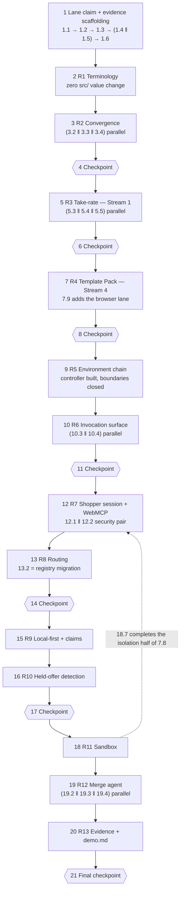

# Implementation Plan: AgenticGraph Commerce Platform

## Overview

100 leaf tasks in 14 requirement groups with 7 checkpoints, over one existing repository, ordered by the requirements baseline's own ranking: Requirement 1 changes zero `src/` values, Requirement 2 changes one comparison rule, and each later group adds progressively more new surface. Every task is executable given only the tasks before it.

Language is TypeScript throughout — the design is TypeScript-native and states typed contracts per element, so no implementation-language question arises.

What was confirmed by reading the target repository rather than assumed:

- `package.json` today has `dev`, `dev:offline`, `types`, `types:check`, `typecheck`, `test`, `test:domain`, `test:unit`, `test:workers`, five `deploy:*` scripts, and `check`. **None of the 13 named checks in the design exists yet**, and `dev:apex` does not exist. Tasks 1.2, 1.3, 7.9, 9.1, and 20.1 are the only tasks that edit `package.json`; every other named check is implemented by editing its own `scripts/checks/<name>.ts` file.
- `check` = `types:check && typecheck && test && test:workers && deploy:dev:dry && deploy:production:dry`. It does **not** yet include any new check; task 20.1 wires the aggregate.
- `test:domain` is a literal glob, `node --test test/domain/*.test.ts`. Every domain-lane property test must land in `test/domain/` to be collected.
- `scripts/validate-do-storage-compatibility.ts`, `test/domain/do-storage-compatibility.test.ts`, and `docs/do-storage-compatibility.json` all exist. Every task that adds a Durable Object class or changes DDL must update that JSON and add a `wrangler.core.jsonc` migration tag in the same task, or `test:domain` fails.
- Test tree is `test/domain`, `test/invocation`, `test/shared`, `test/workers`. Fake providers live in `test/workers/fake-services.ts`.

Deploy boundaries stay closed. No task advances Prod_Mirror or Delivery_Route. Task 9.2 *declares* the Production route and task 9.3 builds the controller that would refuse an unauthorized advance; declaring and building open nothing.

## Conventions

**Bounds.** Every task states six values conforming to `config/task-bounds.schema.json` (design element 40, created by task 1.2): `namedCheck` in exact invocation form, `tokenCeiling`, `iterationCeiling`, `wallClockMinutes`, `contextCeiling`, `circuitBreaker` as an observable halting signal. Read `_Bounds:_` as `check · tokens · iterations · wall-clock minutes · context · breaker`.

**Dual gate (Requirement 13.5).** A task's completion claim requires `npm run check` **and** that task's own named check to record a pass. Until task 20.1 wires the aggregate, a task whose named check is a stub verifies against the stub's fail-closed exit and its own lane command; that is stated per task rather than implied.

**`*` marking.** `*` marks a verification sub-task. It does **not** make its criteria optional: skipping a `*` task leaves the criteria listed on it unverified. The increment's 128-criterion coverage is complete only when every `*` task has run. Nothing else is marked optional.

**Migration discipline.** Four tasks add or alter Durable Object storage: 5.2 (`RevenueLedger`, tag `v2`), 7.4 (`ThemeDeployment`, tag `v3`), 13.2 (index drop, tag `v4`), 15.5 (`AuthoringClaim`, tag `v5`). Each updates `docs/do-storage-compatibility.json` in the same task. Tags are sequential because `wrangler.core.jsonc` is a single contended file.

**Property tests.** fast-check, MIT, dev-only, exact-pinned; shrinking enabled; seed recorded per run; `numRuns` per the design's property configuration table. Every payment-path property runs against `test/workers/fake-services.ts`. Each property file carries the tag comment `Feature: agentic-graph-commerce-platform, Property {n}: {property text}`.

## Tasks

- [ ] 1. Lane authority and execution-evidence scaffolding
  - [ ] 1.1 Complete the START-WORKFLOW claim, lease, fence, and runtime-identity stages
    - The requirements Session Start Declaration records `writer_lease_claimed: false`, `ledger_claim_recorded: false`, `runtime_identity_verified: false`; complete the `claim` and `activate` stages for semantic scope `agentic-graph-commerce-platform` in a registered task worktree detached at fetched `origin/main`, then record actor, device, session, worktree, branch, scope, lease epoch, expiry, and fencing SHA
    - _Requirements: 9.7, 9.8, 12.8 (lane authority the later code-bearing tasks consume) · Design elements: none (process prerequisite)_
    - _Bounds: check `npm --prefix "$AGENTIC_CANVAS_OS_ROOT" run worktree:lifecycle:check` · tokens 30000 · iterations 2 · wall-clock 20 · context 60000 · breaker: an overlapping current ledger claim on the same scope — stop, do not open a recovery lane_
  - [ ] 1.2 Create the task-bounds schema and its validator
    - `config/task-bounds.schema.json` (element 40) with the seven required fields; `scripts/validate-task-bounds.ts` parsing this document's `_Bounds:_` lines; register `check:task-bounds` in `package.json` taking `-- --tasks=<path>` so no absolute developer path is persisted (13.8)
    - _Requirements: 13.1, 13.2, 13.8 · Design elements: 40_
    - _Bounds: check `npm run check:task-bounds -- --tasks=.kiro/specs/agentic-graph-commerce-platform/tasks.md` · tokens 45000 · iterations 3 · wall-clock 25 · context 70000 · breaker: same schema violation reported twice_
  - [ ] 1.3 Register the 15 named checks as fail-closed stubs
    - Add `check:terminology`, `check:convergence`, `check:take-rate`, `check:template-pack`, `check:deploy-boundary`, `check:invocation-surface`, `check:webmcp`, `check:routing`, `check:local-first`, `check:offer-watch`, `check:sandbox`, `check:merge-agent`, `check:evidence`, `check:authored-limits`, `check:browser` to `package.json`, each `node scripts/checks/<name>.ts`; every stub exits non-zero with `{ ok: false, code: 'not_implemented' }` until its owning task replaces the body. Not yet wired into `check` — task 20.1 does that
    - _Requirements: 13.1, 13.5 · Design elements: 38, 40_
    - _Bounds: check `npm run check:task-bounds -- --tasks=.kiro/specs/agentic-graph-commerce-platform/tasks.md` · tokens 40000 · iterations 2 · wall-clock 20 · context 60000 · breaker: any stub exiting zero_
  - [ ] 1.4 Implement the evidence emitter
    - `scripts/evidence-reference.ts` (element 38): `emitReferences` emitting exactly the ran-and-passed subset, `deriveRung` as a pure function blocked by any open finding, `VerdictRecord` carrying distinct performing and verdict-issuing mechanism identities; implement `scripts/checks/evidence.ts`
    - _Requirements: 13.3, 13.4, 13.6, 13.11 · Design elements: 38_
    - _Bounds: check `npm run check:evidence-contract` · tokens 60000 · iterations 3 · wall-clock 30 · context 90000 · breaker: same failing assertion count on two consecutive iterations_
  - [ ] 1.5 Implement the authored-limits scanner
    - `scripts/validate-authored-limits.ts` (element 39): 600-line ceiling, absolute-developer-path, credential-value, and account-identifier findings over the authored file set, detail strings naming the key or pattern and never echoing a secret value; implement `scripts/checks/authored-limits.ts`
    - _Requirements: 13.7, 13.8 · Design elements: 39_
    - _Bounds: check `npm run check:authored-limits` · tokens 50000 · iterations 3 · wall-clock 25 · context 80000 · breaker: a finding whose detail string echoes a matched value_
  - [ ]* 1.6 Write generative tests for the evidence emitter
    - **Non-CP generative property** (`test/shared/evidence-reference.test.ts`, numRuns 200, shrinking on): over generated check-result sets the emitted reference set equals the ran-and-passed subset exactly, and `deriveRung` advances no rung while any finding is open. Annex B calls 13.6 and 13.11 properties but assigns them no CP identifier — recorded as a gap, not silently renumbered
    - **Validates: Requirements 13.6, 13.11** · Design elements: 38
    - _Bounds: check `npm run test:unit` · tokens 40000 · iterations 3 · wall-clock 20 · context 60000 · breaker: shrinker returns the same counterexample twice_

- [ ] 2. Requirement 1 — terminology supersession (rank 1: identifier-only, zero `src/` value change)
  - [ ] 2.1 Author the Terminology_Register and its reader
    - `config/terminology-register.json` + `src/shared/terminology-register.ts` (element 1): boundary-aware matcher in the schema, file scope excluding `node_modules/**`, `package-lock.json`, `src/generated/**`, `.recovery/**`; one disposition per occurrence with `owningSystem`+`reason` for `externally-owned` and `preservingArtifact`+`readOnly` for `historical-record`; record the `AG_` prefix declaration and every upstream Cloudflare target as `externally-owned`
    - _Requirements: 1.1, 1.2, 1.3, 1.7, 1.10 · Design elements: 1_
    - _Bounds: check `npm run check:terminology` · tokens 70000 · iterations 3 · wall-clock 35 · context 110000 · breaker: an occurrence that cannot be dispositioned without inventing an owning system_
  - [ ] 2.2 Implement the terminology checker
    - `scripts/validate-terminology-register.ts` (element 2) modeled on `scripts/validate-do-storage-compatibility.ts`: deterministic, no model call, no paid call, per-occurrence `file:line:column` naming, non-zero exit on `undispositioned`, `renamed-occurrence-remains`, or `disposition-fields-missing`; implement `scripts/checks/terminology.ts`
    - _Requirements: 1.4, 1.9 · Design elements: 2_
    - _Bounds: check `npm run check:terminology` · tokens 55000 · iterations 3 · wall-clock 25 · context 80000 · breaker: two consecutive runs disagreeing on identical repository content_
  - [ ] 2.3 Implement the legacy-identity guard
    - `src/shared/terminology-guard.ts` (element 3): `rejectLegacyIdentity` returning `{ ok: false, code: 'legacy_identifier_rejected', presented, supersedingIdentifier }`, table derived from `renamed` register entries of kind endpoint or tool; called from edge route resolution and from core before token resolution. The runtime table is empty at first build because no baseline endpoint or tool identity carries a legacy form — stated, not hidden
    - _Requirements: 1.6 · Design elements: 3_
    - _Bounds: check `npm run check:terminology` · tokens 45000 · iterations 3 · wall-clock 20 · context 70000 · breaker: any request resolving to a legacy target_
  - [ ]* 2.4 Write property test for legacy identity rejection parity
    - **Property 1: CP-1 — Legacy identity rejection parity** (metamorphic, `test/shared/terminology-guard.property.test.ts`, numRuns 200, shrinking on), generators `arbRegisterEntry` × `arbRequest` including adversarial casing and boundary-adjacent tokens; includes the 1.9 determinism arm and an injected-occurrence arm
    - **Validates: Requirements 1.5 (partial), 1.6, 1.8, 1.9** · Design elements: 2, 3
    - _Bounds: check `npm run test:unit` · tokens 50000 · iterations 3 · wall-clock 25 · context 80000 · breaker: shrinker returns the same counterexample twice_
  - [ ] 2.5 Rename prose and annotate the externally-owned code occurrences
    - `README.md` and `docs/production-runtime.md`: `Knowgrph` → `AgenticGraph`, PRD filename → `agentic-graph-commerce-platform-prd-tad-adr.md`, except the two lines recording the baseline PRD revision which stay `historical-record`; add `// externally-owned per terminology-register.json` at the two `src/invocation/catalog.ts` occurrences with **zero value change** (element 4, 5). **Partial disposition on 1.5**: singularity of endpoint and tool identity is satisfied and verified; the superseding-form half is blocked on an upstream rename of the Agentic Canvas OS docs MCP service and is recorded `externally-owned`, with zero alias layer introduced
    - _Requirements: 1.1, 1.4, 1.5 (PARTIAL) · Design elements: 4, 5_
    - _Bounds: check `npm run check:terminology` · tokens 40000 · iterations 2 · wall-clock 20 · context 60000 · breaker: a rename that would change a live service binding or endpoint value_
  - [ ]* 2.6 Record the baseline passing-check set and assert no behavior drift
    - Capture the passing check names at the implementation baseline into `docs/verification-baseline.json`, then assert the post-migration `npm run check` reports the identical set with zero behavior-bearing assertion changed
    - **Validates: Requirements 1.8** · Design elements: 1, 2, 5
    - _Bounds: check `npm run check:implementation` · tokens 35000 · iterations 2 · wall-clock 25 · context 60000 · breaker: any assertion text change required to make the lane pass_

- [ ] 3. Requirement 2 — tolerant upstream convergence (rank 2: one comparison rule)
  - [ ] 3.1 Implement Convergence_Evaluator
    - `src/core/convergence-evaluator.ts` (element 6): `parseContractRevision`, `revisionForwardCompatible` (major equal, minor greater-or-equal), `evaluateConvergence` returning the typed verdict with `requiredSatisfied`, `requiredAbsentOrFailing`, `surplusChecks`, `unnamedEnvelopeFieldCount`, both revision values, and `identityFailures`; pure, one SHA-256, no I/O, no model call, ≤200 ms
    - _Requirements: 2.1, 2.2, 2.3, 2.5, 2.6, 2.7, 2.8, 2.10 · Design elements: 6_
    - _Bounds: check `npm run check:convergence` · tokens 80000 · iterations 3 · wall-clock 35 · context 120000 · breaker: same failing assertion count on two consecutive iterations_
  - [ ]* 3.2 Write property test for surplus tolerance and deficit blocking
    - **Property 2: CP-2 — Surplus never blocks, deficit always blocks** (invariant, `test/domain/convergence-surplus.property.test.ts`, numRuns 500, shrinking on), generator `arbCheckSet` = required set × 0..8 surplus × omission subset × failing-flag subset; asserts recorded surplus names and the unnamed-field count
    - **Validates: Requirements 2.1, 2.2, 2.3, 2.7** · Design elements: 6
    - _Bounds: check `npm run test:domain` · tokens 55000 · iterations 3 · wall-clock 25 · context 85000 · breaker: shrinker returns the same counterexample twice_
  - [ ]* 3.3 Write property test for verdict determinism
    - **Property 3: CP-3 — Verdict determinism** (invariant, `test/domain/convergence-determinism.property.test.ts`, numRuns 300, shrinking on): two evaluations of the same envelope and declared-requirement pair yield identical verdicts including identical reasons in identical order; carries the ≤200 ms recorded median
    - **Validates: Requirements 2.10** · Design elements: 6
    - _Bounds: check `npm run test:domain` · tokens 45000 · iterations 3 · wall-clock 20 · context 70000 · breaker: a recorded median above 200 ms on two consecutive runs_
  - [ ]* 3.4 Write property test for revision and identity blocking
    - **Property 4: CP-4 — Forward-compatible revision and identity blocking** (error condition, `test/domain/convergence-revision.property.test.ts`, numRuns 400, shrinking on), generators `arbRevisionPair` × `arbIdentityMutation` over the four identity fields plus a digest tamper arm
    - **Validates: Requirements 2.3, 2.5, 2.6, 2.8** · Design elements: 6
    - _Bounds: check `npm run test:domain` · tokens 55000 · iterations 3 · wall-clock 25 · context 85000 · breaker: shrinker returns the same counterexample twice_
  - [ ] 3.5 Convert the upstream evidence verifier into a thin adapter
    - `src/core/upstream-evidence.ts` (element 7): replace the envelope key-set equality with required-key presence plus an unnamed-field count, `exactChecks` set-equality with required-set satisfaction plus a surplus list, and `evidence.prdRevision === COMMERCE_PRD_REVISION` with the major/minor rule; keep exported names, the pin reader, `digestUpstreamRuntimeEvidence`, and every caller's result shape unchanged
    - _Requirements: 2.1, 2.2, 2.3, 2.5, 2.6, 2.7, 2.8 · Design elements: 7_
    - _Bounds: check `npm run check:convergence` · tokens 65000 · iterations 3 · wall-clock 30 · context 100000 · breaker: any change to the digest's fixed six-field input_
  - [ ] 3.6 Compose the split Readiness_Report
    - `src/core/index.ts` and `src/edge/index.ts` (element 8): `contract: 'commerce.core-readiness/v2'`, one verdict per declared provider, `sourceReadiness` and `liveReleaseReadiness` as separate named fields, Dev lane returning `delivery_route_unauthorized_in_dev` with zero request issued; implement `scripts/checks/convergence.ts`
    - _Requirements: 2.4, 2.9, 2.11, 5.2, 5.10 · Design elements: 8_
    - _Bounds: check `npm run check:convergence` · tokens 70000 · iterations 3 · wall-clock 35 · context 110000 · breaker: any readiness path issuing a Delivery_Route request from Dev_
  - [ ]* 3.7 Write integration examples for provider evidence retrieval and readiness composition
    - `test/workers/readiness-convergence.test.ts`: one unretrievable and one incomplete provider example at the 5 s bound (2.4), one example per verdict combination (2.9), one per field-presence case (2.11)
    - **Validates: Requirements 2.4, 2.9, 2.11** · Design elements: 8
    - _Bounds: check `npm run test:workers` · tokens 55000 · iterations 3 · wall-clock 30 · context 90000 · breaker: a flake reproducing under a fixed clock_

- [ ] 4. Checkpoint — terminology and convergence
  - Ensure all tests pass, ask the user if questions arise. Confirm `npm run check` reports the baseline passing-check set (1.8) and that Requirement 1 changed zero `src/` values.

- [ ] 5. Requirement 3 — first settled markup on the confirmed-checkout path (rank 3: Stream 1, first dollar)
  - [ ] 5.1 Implement Take_Rate_Calculator
    - `src/core/take-rate.ts` (element 9): `computeMarkupMinor` as `Math.floor((amount * bp + 5_000) / 10_000)` on minor units, `readRateBasisPoints` accepting integers 1..1000 and returning null for absent, non-numeric, negative, zero, or above-ceiling; pure, integer-only, no I/O, zero hardcoded rate literal
    - _Requirements: 3.1, 3.3, 3.4 · Design elements: 9_
    - _Bounds: check `npm run check:take-rate` · tokens 45000 · iterations 3 · wall-clock 20 · context 70000 · breaker: any floating-point arithmetic in the markup path_
  - [ ] 5.2 Create the RevenueLedger Durable Object with its migration
    - `src/core/revenue-ledger.ts` (element 10): `revenue_line` DDL with `settlement_id` primary key, the `revenue_line_period` index, `appendLine` using `ON CONFLICT DO NOTHING`, `readPeriod` ordering by `recorded_at_ms` then `settlement_id` with the sum folded from returned rows, `demandEvidence` reporting the count as capability. Add the `wrangler.core.jsonc` migration tag `v2` with `new_sqlite_classes: ["RevenueLedger"]` and update `docs/do-storage-compatibility.json` in this same task. Recorded departure from ADR-8 (D1) with the migration trigger retained
    - _Requirements: 3.2, 3.5, 3.9, 3.10, 3.11 (PARTIAL) · Design elements: 10_
    - _Bounds: check `npm run test:domain` · tokens 90000 · iterations 3 · wall-clock 40 · context 130000 · breaker: `do-storage-compatibility` failing twice on the same field_
  - [ ]* 5.3 Write property test for markup arithmetic and non-interference
    - **Property 5: CP-5 — Markup arithmetic and non-interference** (invariant, `test/domain/take-rate.property.test.ts`, numRuns 500, shrinking on), generators `arbAmountMinor` (0..2^40) × `arbRateBasisPoints` (1..1000) with half-boundary amounts forced; includes the arm asserting the provider-requested amount equals the amount recorded before computation
    - **Validates: Requirements 3.1, 3.4, 3.6** · Design elements: 9, 11
    - _Bounds: check `npm run test:domain` · tokens 55000 · iterations 3 · wall-clock 25 · context 85000 · breaker: shrinker returns the same counterexample twice_
  - [ ]* 5.4 Write property test for ledger idempotence
    - **Property 6: CP-6 — Ledger idempotence** (idempotence, `test/workers/revenue-ledger-idempotence.property.test.ts`, numRuns 300, shrinking on), generator `arbSettlementSequence` with duplicate identifiers and interleaved distinct settlements
    - **Validates: Requirements 3.2, 3.5** · Design elements: 10
    - _Bounds: check `npm run test:workers` · tokens 55000 · iterations 3 · wall-clock 30 · context 85000 · breaker: shrinker returns the same counterexample twice_
  - [ ]* 5.5 Write property test for period read-back and aggregation
    - **Property 7: CP-7 — Period read-back and aggregation** (invariant, `test/workers/revenue-ledger-period.property.test.ts`, numRuns 300, shrinking on), generators `arbLineSet` (0..500 lines, colliding instants) × `arbPeriodBounds` (inclusive start, exclusive end); asserts the returned sum is recomputed from returned rows and every line carries the complete field set
    - **Validates: Requirements 3.9, 3.10** · Design elements: 10
    - _Bounds: check `npm run test:workers` · tokens 55000 · iterations 3 · wall-clock 30 · context 85000 · breaker: a maintained total appearing anywhere in the read path_
  - [ ] 5.6 Add the post-settlement markup hook to CheckoutSession
    - `src/core/checkout-session.ts` (element 11): immediately after the transaction setting `state = 'settled'`, compute the markup, append the ledger line, append `markup_recorded`; on three consecutive failures within 5 s append `markup_deferred` naming the settlement identifier and failing stage and return the unchanged settled result. The settled row is never rewritten
    - _Requirements: 3.1, 3.2, 3.6, 3.8 · Design elements: 11_
    - _Bounds: check `npm run check:take-rate` · tokens 75000 · iterations 3 · wall-clock 35 · context 115000 · breaker: any code path that can change a recorded settlement outcome_
  - [ ] 5.7 Add the fail-closed take-rate configuration gate
    - `src/core/index.ts` (element 12): `AG_TAKE_RATE_BASIS_POINTS` read as an externalized key, a `take_rate_configuration` readiness check, and an early 503 return naming the key and the failing condition (`absent`, `non_numeric`, `negative`, `zero`, `above_maximum`) with zero ledger append. Recorded interpretation: Workers have no start phase, so "refuse to start" is fail-closed-at-first-request plus readiness (Design Decision 6). Implement `scripts/checks/take-rate.ts`
    - _Requirements: 3.3, 3.7 · Design elements: 12_
    - _Bounds: check `npm run check:take-rate` · tokens 60000 · iterations 3 · wall-clock 30 · context 95000 · breaker: a request reaching a ledger append with an invalid rate_
  - [ ]* 5.8 Write integration examples for the configuration gate, deferral, and demand reporting
    - `test/workers/take-rate-integration.test.ts`: one example per invalid rate class (3.7), one forced-append-fault deferral example (3.8), one 500 ms measurement (3.1), one example asserting the reported principal-count field and that it is labelled capability (3.11). **Partial disposition on 3.11**: the ledger records `agent_id`, so the count is of registered agents with two or more settlements, not of external payer principals — the field shape is verified, the semantic claim is not
    - **Validates: Requirements 3.1, 3.7, 3.8, 3.11 (PARTIAL)** · Design elements: 10, 11, 12
    - _Bounds: check `npm run test:workers` · tokens 60000 · iterations 3 · wall-clock 30 · context 95000 · breaker: a passing assertion that would imply an external principal exists_

- [ ] 6. Checkpoint — first settled markup
  - Ensure all tests pass, ask the user if questions arise. Confirm no live-mode provider call is reachable from Dev and that Stream 1 is reported as capability, not demand.

- [ ] 7. Requirement 4 — white-label storefront Template Pack (rank 4: Stream 4)
  - [ ] 7.1 Implement the Theme_Manifest schema
    - `src/shared/theme-manifest.ts` (element 13): typed manifest, `THEME_MANIFEST_DEFAULTS` from the baseline console values, unknown-key rejection, 280-character text bound, 1..500 catalog scope, 65536-byte whole-manifest bound, `validateThemeManifest` naming every violating field, `serializeThemeManifest` canonical and round-trip stable, digest over the canonical form
    - _Requirements: 4.1, 4.2, 4.4 · Design elements: 13_
    - _Bounds: check `npm run check:template-pack` · tokens 85000 · iterations 3 · wall-clock 40 · context 125000 · breaker: the file approaching the 600-line ceiling — split schema from defaults_
  - [ ] 7.2 Implement the merchant catalog projection
    - `src/core/merchant-catalog.ts` (element 17): `projectMerchantCatalog` as a pure scope filter and `readListing` returning null for an out-of-scope listing so the route can return a typed not-found
    - _Requirements: 4.5, 4.8 · Design elements: 17_
    - _Bounds: check `npm run check:template-pack` · tokens 40000 · iterations 2 · wall-clock 20 · context 65000 · breaker: any listing returned whose owning agent is outside scope_
  - [ ]* 7.3 Write property test for theme manifest round trip
    - **Property 8: CP-8 — Theme manifest round trip** (round trip, `test/domain/theme-manifest.property.test.ts`, numRuns 300, shrinking on), generator `arbThemeManifest` with a valid arm, unicode copy, the 280-character boundary, and optional-field omission subsets; asserts identical verdict and identical defaulted-field set across both representations, plus the 5 s validation bound
    - **Validates: Requirements 4.1, 4.2, 4.4** · Design elements: 13
    - _Bounds: check `npm run test:domain` · tokens 55000 · iterations 3 · wall-clock 25 · context 85000 · breaker: shrinker returns the same counterexample twice_
  - [ ] 7.4 Create the ThemeDeployment Durable Object with its migration
    - `src/core/theme-deployment-store.ts` (element 15): one row per merchant, `activate` and `current`, recording merchant identifier, manifest digest, resolved catalog scope, defaulted field names, and the deployment instant in UTC. Add `wrangler.core.jsonc` migration tag `v3` with `new_sqlite_classes: ["ThemeDeployment"]` and update `docs/do-storage-compatibility.json` in this same task
    - _Requirements: 4.3, 4.9, 4.10 · Design elements: 15_
    - _Bounds: check `npm run test:domain` · tokens 70000 · iterations 3 · wall-clock 35 · context 105000 · breaker: `do-storage-compatibility` failing twice on the same field_
  - [ ] 7.5 Implement theme deployment orchestration
    - `src/core/theme-deployment.ts` (element 14): validate → registry scope check → asset fetch (3 attempts within 30 s) → activate, with `theme_manifest_invalid`, `theme_scope_agent_not_registered`, and `theme_asset_unreachable` results; every failure path leaves the prior activation serving unchanged
    - _Requirements: 4.3, 4.9, 4.10 · Design elements: 14_
    - _Bounds: check `npm run check:template-pack` · tokens 75000 · iterations 3 · wall-clock 35 · context 110000 · breaker: a failure path that stops the prior deployment serving_
  - [ ]* 7.6 Write property test for catalog scope containment
    - **Property 9: CP-9 — Catalog scope containment** (invariant, `test/domain/merchant-catalog.property.test.ts`, numRuns 300, shrinking on), generators `arbRegistryState` (0..500 agents, mixed states) × `arbCatalogScope` with in-scope and out-of-scope members; includes the reject-and-zero-deployment arm
    - **Validates: Requirements 4.3, 4.5** · Design elements: 14, 17
    - _Bounds: check `npm run test:domain` · tokens 55000 · iterations 3 · wall-clock 25 · context 85000 · breaker: shrinker returns the same counterexample twice_
  - [ ] 7.7 Make the console renderer manifest-driven, mobile-first, and accessible
    - `src/edge/dashboard.ts` (element 16): `consoleResponse(metadata, manifest = THEME_MANIFEST_DEFAULTS)` rendering bytes identical to the baseline operator console under the default manifest; 360 px rules with zero horizontal overflow, zero clipped content, zero overlapping text; every interactive control a native element with a non-empty accessible name and a 44×44 CSS px minimum; an offline indicator region. The CSP relaxation and the client module tag are deliberately **not** in this task — they land with the shopper session in 12.2 so the two security-relevant changes are reviewed together
    - _Requirements: 4.1, 4.5, 4.6, 4.7, 9.1, 9.6 · Design elements: 16_
    - _Bounds: check `npm run check:template-pack` · tokens 90000 · iterations 4 · wall-clock 45 · context 130000 · breaker: existing `test/workers/edge.test.ts` byte assertions failing under the default manifest_
  - [ ] 7.8 Add the theme deployment and merchant storefront routes
    - `src/edge/index.ts`: `POST /v1/operator/merchants/{id}/theme` under operator authority and `GET /s/{merchant}` rendering through the one console function with that merchant's manifest; exactly one checkout path per listing reaching settlement through the same CheckoutSession route as the operator surface; implement `scripts/checks/template-pack.ts` including the module-count scan (4.1) and the binding/dependency inventory diff (4.11)
    - _Requirements: 4.1, 4.5, 4.8, 4.11 · Design elements: 14, 16, 17_
    - _Bounds: check `npm run check:template-pack` · tokens 80000 · iterations 3 · wall-clock 40 · context 120000 · breaker: the inventory diff showing a new infrastructure service category_
  - [ ] 7.9 Bootstrap the browser check lane
    - Add Playwright as a dev-only exact-pinned dependency (operator-approved, OQ-9 resolved), a `playwright.config.ts` with a 360 px viewport project and a 1.6 Mbit/s network profile, and implement `scripts/checks/browser.ts` driving it; the lane is dev-only and never targets Prod_Mirror or Delivery_Route
    - _Requirements: 4.6, 4.7, 7.1, 7.3, 9.1, 9.5, 9.6 (lane the measurements need) · Design elements: 16, 25, 31_
    - _Bounds: check `npm run check:browser` · tokens 60000 · iterations 3 · wall-clock 35 · context 90000 · breaker: the dependency resolving to a range rather than an exact pin_
  - [ ]* 7.10 Write browser measurements for paint, markup, and touch targets
    - `test/browser/template-pack.spec.ts`: first contentful paint as the median of 5 consecutive cold loads at 360 px over 1.6 Mbit/s (4.6); DOM and static assertions for semantic elements, non-empty accessible names, and 44×44 px targets on one default and one themed render (4.7)
    - **Validates: Requirements 4.6, 4.7** · Design elements: 16
    - _Bounds: check `npm run check:browser` · tokens 50000 · iterations 3 · wall-clock 30 · context 80000 · breaker: median paint above 2 s on two consecutive runs — report, do not retune the measurement_
  - [ ]* 7.11 Write integration examples for deployment failure paths and records
    - `test/workers/theme-deployment.test.ts`: unregistered-agent reject (4.3), shared checkout route identity (4.8), failing asset fetch with the prior deployment preserved (4.9), every recorded deployment field (4.10), and the capability-not-demand assertion for Stream 4 (4.12)
    - **Validates: Requirements 4.3, 4.8, 4.9, 4.10, 4.12** · Design elements: 14, 15, 16, 17
    - _Bounds: check `npm run test:workers` · tokens 60000 · iterations 3 · wall-clock 30 · context 95000 · breaker: a flake reproducing under a fixed clock_

- [ ] 8. Checkpoint — Template Pack
  - Ensure all tests pass, ask the user if questions arise. Confirm the default-manifest render still equals the baseline console and that zero new infrastructure service category appeared.

- [ ] 9. Requirement 5 — environment chain and deploy boundaries
  - [ ] 9.1 Declare exactly two Dev lane entry points and gate the deploy scripts
    - `package.json` (element 18): keep `dev` and add `dev:apex` on port 5173; add a guard to each `deploy:production:*` script that exits non-zero unless invoked by `scripts/release-controller.ts` with a verified authorization record. Dev startup issues zero write to Prod_Mirror, zero write to Delivery_Route, and zero live-mode provider request
    - _Requirements: 5.1, 5.2, 5.5 · Design elements: 18_
    - _Bounds: check `npm run check:deploy-boundary` · tokens 45000 · iterations 2 · wall-clock 20 · context 70000 · breaker: a third Dev entry point becoming necessary_
  - [ ] 9.2 Declare the Production delivery route
    - `wrangler.edge.jsonc` (element 19): exactly one Production `routes` entry `airvio.co/agentic-commerce-os` with `zone_name: airvio.co`, replacing the empty array. Declaring the route opens no boundary
    - _Requirements: 5.3 · Design elements: 19_
    - _Bounds: check `npm run check:deploy-boundary` · tokens 25000 · iterations 2 · wall-clock 15 · context 50000 · breaker: more than one Production route entry_
  - [ ] 9.3 Implement Release_Controller
    - `scripts/release-controller.ts` (element 20): `sealCandidate`, `retireOnFrontierAdvance`, `authorizeAndAdvance` refusing on `release_authorization_incomplete` (missing element, or authorization older than 24 h), `release_candidate_retired`, and `release_rollback_disposition_required`; declares Prod_Mirror at `GitHub/huijoohwee/content/agentic-commerce-os` as generated output with zero authored edit target; splits along authorization versus candidate lifecycle if it approaches the 600-line ceiling
    - _Requirements: 5.4, 5.5, 5.6, 5.7, 5.8 · Design elements: 20_
    - _Bounds: check `npm run check:deploy-boundary` · tokens 95000 · iterations 4 · wall-clock 45 · context 140000 · breaker: any code path able to advance a target without a recorded authorization_
  - [ ]* 9.4 Write property tests for controller refusal, retirement, and rollback
    - **Non-CP generative properties** (`test/shared/release-controller.property.test.ts`, numRuns 300, shrinking on): a CP-19-style admission property over authorization records with missing-element and expired arms (5.6), a property over seal/advance sequences asserting a retired candidate is always refused (5.7), and a property asserting refusal exactly when no rollback disposition is recorded (5.8). Annex B names these as properties without CP identifiers — recorded as a gap rather than renumbered
    - **Validates: Requirements 5.6, 5.7, 5.8** · Design elements: 20
    - _Bounds: check `npm run test:unit` · tokens 60000 · iterations 3 · wall-clock 30 · context 95000 · breaker: shrinker returns the same counterexample twice_
  - [ ] 9.5 Report the deploy lane and candidate on the health and console surfaces
    - `src/edge/index.ts` and `src/edge/dashboard.ts`: `GET /livez` and the console report the deploy lane name and the serving release candidate identity with zero secret value; implement `scripts/checks/deploy-boundary.ts` covering the script inventory (5.1), the route declaration (5.3), the generated-output declaration (5.4), controller exclusivity (5.5), the boundary register states (7.8, 7.9), and the recorded deferral (10.9)
    - _Requirements: 5.1, 5.3, 5.4, 5.5, 5.9 · Design elements: 8, 16, 20_
    - _Bounds: check `npm run check:deploy-boundary` · tokens 65000 · iterations 3 · wall-clock 30 · context 100000 · breaker: a secret-shaped field appearing on either surface_
  - [ ]* 9.6 Write integration examples for Dev egress and split readiness
    - `test/workers/deploy-boundary.test.ts`: one example with an egress recorder around Dev startup asserting zero Prod_Mirror write, zero Delivery_Route write, and zero live-mode provider request (5.2); one example per readiness combination asserting live-release readiness stays not-ready (5.10); one response-shape example per surface for 5.9
    - **Validates: Requirements 5.2, 5.9, 5.10** · Design elements: 8, 18
    - _Bounds: check `npm run test:workers` · tokens 55000 · iterations 3 · wall-clock 30 · context 90000 · breaker: any recorded egress to a gated target_

- [ ] 10. Requirement 6 — one invocation surface for every capability
  - [ ] 10.1 Author the capability→token map
    - `config/capability-token-map.json` + `src/invocation/capability-map.ts` (element 21): one `/` command token, at least one `#` semantic token, at least one `@` binding token, and one MCP tool per capability action across every requirement in this increment; `coverageFindings` returning empty only when every declared token resolves in the pinned catalog
    - _Requirements: 6.2, 6.7 · Design elements: 21_
    - _Bounds: check `npm run check:invocation-surface` · tokens 70000 · iterations 3 · wall-clock 35 · context 110000 · breaker: a capability action needing a token absent from the upstream dictionaries — stop, this is an upstream dependency_
  - [ ] 10.2 Replace the fixed invocation bounds with register-declared bounds
    - `src/core/index.ts` and `src/core/agent-registry.ts` (element 22): `readTokenArray`'s hard cap of 12 becomes the declared required-token count bounded at `CATALOG_LIMIT`; `validInvocationProof`'s `length === 3` becomes `length === declaredRequiredTokenCount && length >= 3`; revision transitions report `priorSourceRevision` and `sourceRevision` and recompute digest and per-sigil counts before serving; implement `scripts/checks/invocation-surface.ts` including the one-registry import-graph scan (6.1) and the token coverage scan (6.2)
    - _Requirements: 6.1, 6.2, 6.3, 6.8 · Design elements: 22_
    - _Bounds: check `npm run check:invocation-surface` · tokens 70000 · iterations 3 · wall-clock 35 · context 110000 · breaker: a second token registry becoming necessary_
  - [ ]* 10.3 Write property test for resolution totality
    - **Property 10: CP-10 — Resolution totality** (invariant, `test/domain/invocation-resolution.property.test.ts`, numRuns 400, shrinking on), generator `arbTokenString` over valid catalog tokens, wrong sigils, empty, 129+ characters, and unicode; asserts exactly one resolved entry with revision, digest, and three per-sigil counts, or exactly one typed unresolved result invoking zero downstream capability
    - **Validates: Requirements 6.1, 6.3, 6.4, 6.6** · Design elements: 22
    - _Bounds: check `npm run test:domain` · tokens 55000 · iterations 3 · wall-clock 25 · context 85000 · breaker: shrinker returns the same counterexample twice_
  - [ ]* 10.4 Write property test for resolution idempotence across revisions
    - **Property 11: CP-11 — Resolution idempotence across revisions** (idempotence, `test/domain/invocation-idempotence.property.test.ts`, numRuns 200, shrinking on), generators `arbToken` × `arbCatalogRevisionTransition`; includes the ≤50 ms recorded median and an import scan asserting zero model client in the resolution path
    - **Validates: Requirements 6.6, 6.8** · Design elements: 22
    - _Bounds: check `npm run test:domain` · tokens 45000 · iterations 3 · wall-clock 20 · context 75000 · breaker: a recorded median above 50 ms on two consecutive runs_
  - [ ] 10.5 Mount the operator MCP surface
    - `src/edge/index.ts` (element 23): `POST /mcp/operator` under `OPERATOR_BEARER_TOKEN` exposing agent registration, deregistration, registry events, vendor transition, theme deployment, release boundary read, and claim acquire/release; `POST /mcp` gains the public catalog, merchant catalog, and revenue period read tools. Both mounts resolve through the one Invocation_Catalog — a second transport mount, not a second token registry (Design Decision 9)
    - _Requirements: 6.7 · Design elements: 23_
    - _Bounds: check `npm run check:invocation-surface` · tokens 75000 · iterations 3 · wall-clock 40 · context 115000 · breaker: any capability action reachable only over HTTP_
  - [ ]* 10.6 Write integration examples for catalog hydration failure and MCP reachability
    - `test/workers/invocation-surface.test.ts`: one example with a failing docs MCP binding asserting not-ready with the pinned source named and `invocation_catalog_unavailable` for every token (6.5); one example per capability comparing MCP and HTTP reachability (6.7)
    - **Validates: Requirements 6.5, 6.7** · Design elements: 22, 23
    - _Bounds: check `npm run test:workers` · tokens 55000 · iterations 3 · wall-clock 30 · context 90000 · breaker: a capability with no MCP path_

- [ ] 11. Checkpoint — environment chain and invocation surface
  - Ensure all tests pass, ask the user if questions arise. Confirm every Deploy_Boundary still reads `closed` or `pending-protected-integration`.

- [ ] 12. Requirement 7 — shopper session authority and the WebMCP tool surface
  - [ ] 12.1 Implement the first-party storefront session route (security-relevant)
    - `src/edge/session.ts` + `src/edge/index.ts`: `POST /v1/session` issuing a short-lived, origin-bound, HttpOnly, `SameSite=Strict`, `Secure` first-party session scoped to storefront read and checkout-preparation actions only. Operator-approved (OQ-8 resolved). Constraints that are the point of the task: zero unauthenticated payment-adjacent route is introduced; the session never substitutes for human confirmation before settlement (7.4); the session carries zero card identifier, card token, or provider credential; settlement authority is unchanged
    - _Requirements: 7.2, 7.4 · Design elements: 23, 24_
    - _Bounds: check `npm run check:webmcp` · tokens 85000 · iterations 3 · wall-clock 45 · context 130000 · breaker: any route reachable with the session that can settle without a recorded human confirmation — stop and escalate_
  - [ ] 12.2 Narrow the console CSP and add the nonce-bound module tag
    - `src/edge/dashboard.ts` (element 16, second edit): CSP becomes `default-src 'none'; style-src 'unsafe-inline'; script-src 'nonce-<per-response>'; connect-src 'self'; img-src 'self' https:; base-uri 'none'; form-action 'none'; frame-ancestors 'none'`, with one same-origin module tag carrying the per-response nonce and zero third-party origin. Paired with 12.1 so both security-relevant changes land and are reviewed together (Design Decision 12)
    - _Requirements: 7.1 · Design elements: 16_
    - _Bounds: check `npm run check:webmcp` · tokens 50000 · iterations 3 · wall-clock 25 · context 80000 · breaker: a static nonce or any third-party script origin_
  - [ ] 12.3 Implement the single storefront action set
    - `src/edge/client/storefront-actions.ts` (element 24): `searchCatalog`, `selectOffer`, `initiateCheckout`; `confirmCheckout` deliberately absent so no tool-supplied value can stand in for human confirmation; both the visual controls and the tool surface call these exact functions and zero backend endpoint exists only for the tool surface
    - _Requirements: 7.2, 7.4 · Design elements: 24_
    - _Bounds: check `npm run check:webmcp` · tokens 65000 · iterations 3 · wall-clock 30 · context 100000 · breaker: a confirm-shaped function appearing in the action set_
  - [ ] 12.4 Implement WebMCP registration, the tool-set digest, and drift refusal
    - `src/edge/client/webmcp-tools.ts` (element 25): register at least one catalog-search, one offer-selection, and one guardrailed-checkout-initiation tool through `navigator.modelContext` or `document.modelContext`, capped at 16 tools, within 2000 ms of load; compute the digest over names, input schemas, output schemas, and count, verify before each execution, and refuse with `webmcp_registration_drift` recording the event, issuing zero payment-adjacent call and leaving every session record unchanged; on an absent registration API render every visual control operable, surface no shopper notice, and record `webmcp_surface_unavailable`; zero credential, card identifier, card token, or auth token in any schema or refusal payload; implement `scripts/checks/webmcp.ts` including the tool-only-endpoint route inventory diff (7.2)
    - _Requirements: 7.1, 7.2, 7.3, 7.5, 7.6, 7.7 · Design elements: 25_
    - _Bounds: check `npm run check:webmcp` · tokens 95000 · iterations 4 · wall-clock 45 · context 140000 · breaker: a credential-shaped field surviving the schema scan_
  - [ ]* 12.5 Write property test for dual-path guardrail parity
    - **Property 12: CP-12 — Dual-path guardrail parity** (metamorphic, `test/shared/webmcp-parity.property.test.ts`, numRuns 300, shrinking on), generators `arbCheckoutAction` × path ∈ {visual, webmcp} × `arbCredentialShapedKey`; asserts identical guardrail and confirmation event ordering and zero credential-shaped field in either payload
    - **Validates: Requirements 7.4, 7.7** · Design elements: 24, 25
    - _Bounds: check `npm run test:unit` · tokens 55000 · iterations 3 · wall-clock 25 · context 85000 · breaker: an ordering difference that shrinks to the same minimal action twice_
  - [ ]* 12.6 Write property test for registration drift refusal
    - **Property 13: CP-13 — Registration drift refusal** (error condition, `test/shared/webmcp-drift.property.test.ts`, numRuns 300, shrinking on), generators `arbToolSet` (1..16 tools) × `arbPostRegistrationMutation` over add, remove, schema edit, and rename
    - **Validates: Requirements 7.5, 7.6** · Design elements: 25
    - _Bounds: check `npm run test:unit` · tokens 55000 · iterations 3 · wall-clock 25 · context 85000 · breaker: shrinker returns the same counterexample twice_
  - [ ]* 12.7 Write browser integration examples for capable and incapable engines
    - `test/browser/webmcp.spec.ts`: one example on a capable engine asserting the three tool kinds, the 16-tool cap, and the 2000 ms registration bound (7.1); one example with the registration API removed asserting full visual-control parity, every control operable, zero shopper notice, and the recorded unavailable-surface event (7.3)
    - **Validates: Requirements 7.1, 7.3** · Design elements: 25
    - _Bounds: check `npm run check:browser` · tokens 55000 · iterations 3 · wall-clock 30 · context 90000 · breaker: registration exceeding 2000 ms on two consecutive runs_
  - [ ] 12.8 Record the WebMCP boundary state and the standard's stage
    - `docs/deploy-boundary-register.json`: the WebMCP → Delivery_Route boundary reads `closed`, with the two opening conditions recorded as conditions rather than as satisfied — the drift refusal recorded passing under Sandbox_Executor (delivered by task 18.7) and the supported browser set recorded by name and minimum version; record the model-context standard as origin-trial stage with partial, evolving support and report the rung as `dev-proven`
    - _Requirements: 7.8 (partial here — the isolation half is completed by 18.7), 7.9 · Design elements: 36_
    - _Bounds: check `npm run check:deploy-boundary` · tokens 40000 · iterations 2 · wall-clock 20 · context 65000 · breaker: the register recording the boundary as open_

- [ ] 13. Requirement 8 — neutral aggregation routing, public catalog, and the registry migration
  - [ ] 13.1 Add declared attributes and one declared fallback to the registry projection
    - `src/core/agent-registry.ts` (element 28, first edit): `declaredAttributes` (`priceMinor`, `qualityScore`, `latencyMs`) participating in `registrationContentHash`, and `fallbackAgentId` permitting at most one declared fallback
    - _Requirements: 8.1, 8.2 · Design elements: 28_
    - _Bounds: check `npm run check:routing` · tokens 60000 · iterations 3 · wall-clock 30 · context 95000 · breaker: a registration content hash that stops being stable_
  - [ ] 13.2 Migration — drop the one-agent-per-category index and relax `health()`
    - The single largest behavioral edit in the increment; steps in this order and no other: (1) update `docs/do-storage-compatibility.json` with the new expected schema; (2) add `wrangler.core.jsonc` migration tag `v4` carrying the index drop; (3) `DROP INDEX one_active_admission_per_category` in `src/core/agent-registry.ts`; (4) change `health()` from "exactly one verified active admission per required category" to "at least one verified active admission per required category, zero stale invocation pins"; (5) run `npm run test:domain` so `test/domain/do-storage-compatibility.test.ts` adjudicates the change. Placed here because nothing earlier in this plan depends on the old one-per-category invariant
    - _Requirements: 8.1, 8.8 · Design elements: 28_
    - _Bounds: check `npm run test:domain` · tokens 80000 · iterations 3 · wall-clock 40 · context 120000 · breaker: `do-storage-compatibility` failing twice on the same field — stop, do not edit the expectation to match the code_
  - [ ] 13.3 Implement the selection policy
    - `src/domain/selection-policy.ts` (element 26): externalized weights, min-max normalization, `selectAgent` returning the selected identifier, score, considered identifiers, and deciding attributes, with score ties resolved by ascending agent identifier and null for zero eligible agents; pure, model-free, ≤200 ms
    - _Requirements: 8.1, 8.2, 8.7 · Design elements: 26_
    - _Bounds: check `npm run check:routing` · tokens 65000 · iterations 3 · wall-clock 30 · context 100000 · breaker: any nondeterminism from input ordering_
  - [ ]* 13.4 Write property test for selection determinism and the tie rule
    - **Property 15: CP-15 — Selection determinism and tie rule** (invariant, `test/domain/selection-policy.property.test.ts`, numRuns 300, shrinking on), generator `arbEligibleSet` with forced score ties and permuted input order; includes the recorded-attribute arm and the ≤200 ms measurement
    - **Validates: Requirements 8.1, 8.2, 8.7** · Design elements: 26
    - _Bounds: check `npm run test:domain` · tokens 55000 · iterations 3 · wall-clock 25 · context 85000 · breaker: shrinker returns the same counterexample twice_
  - [ ] 13.5 Replace the ambiguity refusal with a scored selection
    - `src/domain/exclusive-category-router.ts` (element 27): the `candidates.length > 1 → 'ambiguous-category'` branch becomes a `selectAgent` call; `NoDispatchReason` drops `ambiguous-category` and keeps `invalid-intent`, `unmatched-category`, `registry-conflict`; `DispatchDecision` gains `consideredAgentIds` and `decidingAttributes`; credential screening, JSON compatibility, category normalization, and registry-conflict detection are untouched
    - _Requirements: 8.1, 8.3, 8.6 · Design elements: 27_
    - _Bounds: check `npm run check:routing` · tokens 65000 · iterations 3 · wall-clock 30 · context 100000 · breaker: an existing router guard weakening to make a test pass_
  - [ ]* 13.6 Write property test for dispatch count totality
    - **Property 14: CP-14 — Dispatch count totality** (invariant, `test/workers/dispatch-count.property.test.ts`, numRuns 500, shrinking on), generators `arbTypedIntent` × `arbRegistryState` × `arbTimeoutArm` (none, selected, selected+fallback) with an injected clock; asserts exactly one, exactly two, or exactly zero dispatches and exactly one typed result on exhaustion or no-match
    - **Validates: Requirements 8.1, 8.3, 8.4, 8.5, 8.6** · Design elements: 27, 29
    - _Bounds: check `npm run test:workers` · tokens 65000 · iterations 3 · wall-clock 35 · context 100000 · breaker: a dispatch count that varies under a fixed clock and fixed state_
  - [ ] 13.7 Implement bounded fallback dispatch
    - `src/core/intent-route.ts` (element 29): `AbortSignal.timeout(30_000)` on the selected agent; on timeout at most one dispatch to the declared fallback with `dispatch_timeout` recorded and zero re-dispatch to the selected agent; on fallback timeout or absence `{ ok: false, code: 'dispatch_exhausted' }` with zero further dispatch; `DispatchAttempt` records role, outcome, and instants
    - _Requirements: 8.4, 8.5 · Design elements: 29_
    - _Bounds: check `npm run check:routing` · tokens 65000 · iterations 3 · wall-clock 30 · context 100000 · breaker: more than two dispatches for one typed intent_
  - [ ] 13.8 Implement Public_Catalog_View and its unauthenticated route
    - `src/core/public-catalog.ts` (element 30) constructed from `PUBLIC_FIELD_ALLOWLIST` rather than by deleting fields, projecting identifier, declared category, declared capabilities, and declared trust status; served read-only at `GET /v1/public/agents` with no mutation and no credential; reflects registry state within 5 s at up to 500 agents; implement `scripts/checks/routing.ts`
    - _Requirements: 8.8, 8.9, 8.10 · Design elements: 30_
    - _Bounds: check `npm run check:routing` · tokens 70000 · iterations 3 · wall-clock 35 · context 105000 · breaker: any operator-only, credential, or internal binding field reaching the projection_
  - [ ]* 13.9 Write property test for public projection fidelity
    - **Property 16: CP-16 — Public projection fidelity** (invariant, `test/workers/public-catalog.property.test.ts`, numRuns 300, shrinking on), generator `arbRegistryState` including all-inactive and 500-agent arms; asserts set equality with the active set at the same read revision and the field-subset arm
    - **Validates: Requirements 8.8, 8.10** · Design elements: 30
    - _Bounds: check `npm run test:workers` · tokens 55000 · iterations 3 · wall-clock 30 · context 85000 · breaker: shrinker returns the same counterexample twice_
  - [ ]* 13.10 Write the projection latency integration example
    - `test/workers/public-catalog-latency.test.ts`: one example at 500 registered agents asserting the changed state is projected within 5 s
    - **Validates: Requirements 8.9** · Design elements: 30
    - _Bounds: check `npm run test:workers` · tokens 40000 · iterations 3 · wall-clock 25 · context 70000 · breaker: latency above 5 s on two consecutive runs_

- [ ] 14. Checkpoint — routing and the registry migration
  - Ensure all tests pass, ask the user if questions arise. Confirm the storage compatibility record and the migration tags agree, and that `health()` no longer requires exactly one active agent per category.

- [ ] 15. Requirement 9 — local-first, offline-first, and multi-device concurrent authoring
  - [ ] 15.1 Implement the order-independent sync merge
    - `src/core/sync-merge.ts` (element 32): per-field last-writer-wins over a total order on `(recordedAtMs, deviceId, sequence)` plus an append-only event log union, so `mergeSequences(b, l, r) === mergeSequences(b, r, l)` and zero change is discarded; pure, zero new runtime dependency. Recorded departure from ADR-3 (Yjs) with the reversal condition retained: if collaborative text arrives, ADR-3 stands
    - _Requirements: 9.4, 9.10 · Design elements: 32_
    - _Bounds: check `npm run check:local-first` · tokens 70000 · iterations 3 · wall-clock 35 · context 105000 · breaker: any merge outcome depending on argument order_
  - [ ] 15.2 Implement the local change log
    - `src/edge/client/local-store.ts` (element 31): IndexedDB, no framework; `renderableSnapshot` rendering the last completed synchronization with zero network request; `recordChange` retaining up to 500 changes in origination order and refusing further changes with `local_change_capacity_reached` rather than discarding; `replayOnReconnect` submitting in recorded order within 5 s and retaining each change until acknowledged; `settlementBlockedOffline` returning `connectivity_absent`
    - _Requirements: 9.1, 9.2, 9.3, 9.5 · Design elements: 31_
    - _Bounds: check `npm run check:local-first` · tokens 85000 · iterations 3 · wall-clock 40 · context 125000 · breaker: any path that drops a recorded change_
  - [ ]* 15.3 Write property test for merge confluence
    - **Property 17: CP-17 — Merge confluence** (confluence, `test/domain/sync-merge.property.test.ts`, numRuns 300, shrinking on), generator `arbSyncSequencePair` with 1..10 operations each over overlapping keys
    - **Validates: Requirements 9.4** · Design elements: 32
    - _Bounds: check `npm run test:domain` · tokens 55000 · iterations 3 · wall-clock 25 · context 85000 · breaker: the divergent minimal pair reproducing twice_
  - [ ]* 15.4 Write property test for offline order preservation
    - **Property 18: CP-18 — Offline order preservation** (invariant, `test/domain/local-store.property.test.ts`, numRuns 300, shrinking on), generator `arbLocalChangeSequence` with 1..600 changes crossing the 500 cap and disconnect/reconnect interleavings; asserts submission order equals record order, zero drop, and the 5 s replay start
    - **Validates: Requirements 9.2, 9.3** · Design elements: 31
    - _Bounds: check `npm run test:domain` · tokens 55000 · iterations 3 · wall-clock 25 · context 85000 · breaker: shrinker returns the same counterexample twice_
  - [ ] 15.5 Create the AuthoringClaim Durable Object with its migration
    - `src/core/authoring-claim.ts` (element 33): one row per semantic scope; `acquire`, `admitMutation`, `release`; the admission predicate is scope match, unexpired lease, current fence revision, and pairwise write-set disjointness; a refusal writes zero bytes and returns the holding claim identity, lease epoch, and fence revision. Add `wrangler.core.jsonc` migration tag `v5` with `new_sqlite_classes: ["AuthoringClaim"]` and update `docs/do-storage-compatibility.json` in this same task
    - _Requirements: 9.7, 9.8, 9.9, 12.8 · Design elements: 33_
    - _Bounds: check `npm run test:domain` · tokens 85000 · iterations 3 · wall-clock 40 · context 125000 · breaker: a refusal path that writes any byte_
  - [ ]* 15.6 Write property test for claim admission and byte preservation
    - **Property 19: CP-19 — Claim admission and byte preservation** (invariant, `test/workers/authoring-claim.property.test.ts`, numRuns 300, shrinking on), generator `arbClaimPair` with overlapping and disjoint write sets, expiry offsets around the lease boundary, and fence drift, using an injected clock
    - **Validates: Requirements 9.7, 9.8, 9.9** · Design elements: 33
    - _Bounds: check `npm run test:workers` · tokens 55000 · iterations 3 · wall-clock 30 · context 85000 · breaker: shrinker returns the same counterexample twice_
  - [ ] 15.7 Gate every operator mutation route behind claim admission
    - `src/edge/index.ts` and `src/core/index.ts`: every `/v1/operator/*` mutation and every operator MCP tool calls `admitMutation` before touching state, returning `scope_held`, `lease_expired`, `write_set_overlap`, or `fence_stale` with the holding identity; the claim record is authority-bearing and local projections are diagnostics only
    - _Requirements: 9.7, 9.8, 9.9 · Design elements: 33_
    - _Bounds: check `npm run check:local-first` · tokens 70000 · iterations 3 · wall-clock 35 · context 105000 · breaker: any operator mutation reachable without admission_
  - [ ]* 15.8 Write browser and inventory checks for the offline surface
    - `test/browser/local-first.spec.ts`: offline indicator within 1 s of the first failed request with the last-sync state rendered (9.1), zero payment-adjacent call while offline with a typed connectivity reason (9.5), every primary control and text region at 360 px with zero horizontal scrolling, clipping, or overlap (9.6); plus a binding and dependency inventory asserting zero new service category (9.10); implement `scripts/checks/local-first.ts`
    - **Validates: Requirements 9.1, 9.5, 9.6, 9.10** · Design elements: 16, 31, 32, 33
    - _Bounds: check `npm run check:local-first` · tokens 60000 · iterations 3 · wall-clock 35 · context 95000 · breaker: the inventory diff showing a new infrastructure service category_

- [ ] 16. Requirement 10 — held-offer change detection
  - [ ] 16.1 Implement Offer_Change_Listener
    - `src/core/offer-watch.ts` (element 34): `diffObservation` emitting at most one change event per attribute per distinct observed value; `observeHeldOffer` returning `unchanged`, `changed`, `agent-inactive`, `failed`, or `suspended`; at most 3 retries at ≤60 s before `offer_observation_suspended`; stop recording instant and typed reason; one provider read per observation with zero model call and zero additional paid call
    - _Requirements: 10.1, 10.2, 10.5, 10.6, 10.7, 10.8 · Design elements: 34_
    - _Bounds: check `npm run check:offer-watch` · tokens 85000 · iterations 3 · wall-clock 40 · context 125000 · breaker: more than one provider read per observation_
  - [ ]* 16.2 Write property test for change-event idempotence
    - **Property 20: CP-20 — Change-event idempotence** (idempotence, `test/workers/offer-watch.property.test.ts`, numRuns 300, shrinking on), generator `arbObservationSequence` with repeated identical values and per-attribute deltas; asserts zero further event on an unchanged observation and exactly one per distinct difference, with the recorded and observed values and the observation instant present
    - **Validates: Requirements 10.2, 10.7** · Design elements: 34
    - _Bounds: check `npm run test:workers` · tokens 55000 · iterations 3 · wall-clock 30 · context 85000 · breaker: shrinker returns the same counterexample twice_
  - [ ] 16.3 Add the session alarm and the settlement gate
    - `src/core/checkout-session.ts` (element 35): `alarm()` observing while an offer is held, appending events into the existing `checkout_event` table and rescheduling at ≤60 s, stopping within 60 s of settlement or closure; `confirm()` refusing settlement while an unresolved `offer_changed`, `offer_observation_suspended`, or `offer_agent_inactive` event exists and requiring a new human confirmation naming that event sequence; agent-inactive refusal retains the offer's recorded values; implement `scripts/checks/offer-watch.ts`
    - _Requirements: 10.1, 10.3, 10.4 · Design elements: 35_
    - _Bounds: check `npm run check:offer-watch` · tokens 85000 · iterations 4 · wall-clock 45 · context 130000 · breaker: any settlement reachable with an unresolved change event_
  - [ ]* 16.4 Write property test for settlement blocking after change
    - **Property 21: CP-21 — Settlement blocking after change** (invariant, `test/workers/settlement-gate.property.test.ts`, numRuns 500, shrinking on), generator `arbSessionEventSequence` over change/confirm/settle permutations and deactivation points; asserts zero settlement call preceded by an unresolved change event and zero settlement for an inactive originating agent
    - **Validates: Requirements 10.3, 10.4** · Design elements: 35
    - _Bounds: check `npm run test:workers` · tokens 60000 · iterations 3 · wall-clock 30 · context 95000 · breaker: shrinker returns the same counterexample twice_
  - [ ]* 16.5 Write integration examples for observation scheduling, stop reasons, and retries
    - `test/workers/offer-watch-integration.test.ts` with a controlled alarm clock: observation starting within 60 s and repeating at ≤60 s (10.1), one example per stop reason (10.5), one example with injected faults reaching suspension (10.6), a per-observation call-count and import-scan assertion (10.8), and the recorded-deferral documentation assertion for autonomous re-derivation (10.9)
    - **Validates: Requirements 10.1, 10.5, 10.6, 10.8, 10.9** · Design elements: 34, 35
    - _Bounds: check `npm run test:workers` · tokens 60000 · iterations 3 · wall-clock 30 · context 95000 · breaker: a flake reproducing under the controlled clock_

- [ ] 17. Checkpoint — local-first and held-offer safety
  - Ensure all tests pass, ask the user if questions arise. Confirm no settlement path can be reached with an unresolved change event and that no new infrastructure service category appeared.

- [ ] 18. Requirement 11 — isolated execution for untrusted input and dry runs
  - [ ] 18.1 Declare the sandbox Worker with an empty privileged binding surface
    - `wrangler.sandbox.jsonc` (element 36): a separate Worker declaring zero payment credential, zero settlement provider binding, and zero operator authority, with the configured wall-clock limit ≤300 s and memory ceiling ≤512 MB. Capability absence is configuration, not discipline. Kept separate so no Requirement 4 or 9 criterion depends on Containers (Design Decision 11)
    - _Requirements: 11.4, 11.6 · Design elements: 36_
    - _Bounds: check `npm run check:sandbox` · tokens 45000 · iterations 2 · wall-clock 25 · context 70000 · breaker: any privileged binding appearing in the sandbox configuration_
  - [ ] 18.2 Implement the isolated executor
    - `src/sandbox/executor.ts` (element 36): `runIsolated` for `theme-build`, `registration-dry-run`, and `unshipped-surface-build`, granting zero write access to shared runtime state; records instance identifier, purpose, start and end instants, outcome, exceeded limit, and configured value; terminates within 5 s of exceeding either limit; returns `sandbox_blocked` with rung `dev-proven` on provisioning or execution failure leaving shared state unchanged
    - _Requirements: 11.1, 11.2, 11.4, 11.5, 11.8 · Design elements: 36_
    - _Bounds: check `npm run check:sandbox` · tokens 90000 · iterations 4 · wall-clock 45 · context 135000 · breaker: an instance able to write shared runtime state_
  - [ ]* 18.3 Write property test for isolation and allowlist enforcement
    - **Property 22: CP-22 — Isolation and allowlist enforcement** (invariant, `test/shared/sandbox-allowlist.property.test.ts`, numRuns 400, shrinking on), generators `arbAgentDefinition` × `arbAttemptedCallSequence` over allowlist members and non-members; includes the capability-absence arm over the declared binding surface
    - **Validates: Requirements 11.2, 11.3, 11.6** · Design elements: 36
    - _Bounds: check `npm run test:unit` · tokens 55000 · iterations 3 · wall-clock 25 · context 85000 · breaker: shrinker returns the same counterexample twice_
  - [ ]* 18.4 Write property test for resource-limit termination
    - **Property 23: CP-23 — Resource-limit termination** (error condition, `test/shared/sandbox-limits.property.test.ts`, numRuns 200, shrinking on), generator `arbWorkload` with wall-clock and memory overshoot arms; asserts termination, the recorded exceeded limit and configured value, and a complete instance record
    - **Validates: Requirements 11.4, 11.5** · Design elements: 36
    - _Bounds: check `npm run test:unit` · tokens 50000 · iterations 3 · wall-clock 25 · context 80000 · breaker: an instance surviving past the configured limit plus 5 s_
  - [ ] 18.5 Implement scoped preview identities
    - `src/sandbox/preview.ts` (element 36): one addressable preview identity per merchant engagement with a configured lifetime ≤24 h, revoked at lifetime so a later request returns `preview_revoked`
    - _Requirements: 11.7 · Design elements: 36_
    - _Bounds: check `npm run check:sandbox` · tokens 45000 · iterations 3 · wall-clock 25 · context 75000 · breaker: an identity outliving its configured lifetime_
  - [ ] 18.6 Wire the registration dry run into the registration path
    - `src/core/agent-registry.ts` and the operator registration tool: a submitted agent definition runs its declared tool calls inside one isolated instance, every attempted call and target tool identifier and outcome is recorded, and an out-of-allowlist attempt refuses the call and rejects the registration
    - _Requirements: 11.2, 11.3 · Design elements: 36_
    - _Bounds: check `npm run check:sandbox` · tokens 70000 · iterations 3 · wall-clock 35 · context 105000 · breaker: a registration admitted after an out-of-allowlist attempt_
  - [ ] 18.7 Run the WebMCP lane inside sandbox isolation and record the browser support set
    - Execute the task 12.4 and 12.7 lanes inside Sandbox_Executor, record the drift-refusal result under isolation, and record the supported browser set by name and minimum version into `docs/deploy-boundary-register.json`. This completes the isolation half of criterion 7.8 that task 12.4 could not satisfy, because Requirement 7 ranks ahead of Requirement 11; the Delivery_Route boundary stays `closed` regardless. Implement `scripts/checks/sandbox.ts` including the theme-build and dry-run integration examples (11.1), per-limit examples (11.4), the compressed-lifetime example (11.7), and the provisioning-disabled example with the rung assertion (11.8)
    - _Requirements: 7.8, 11.1, 11.4, 11.7, 11.8 · Design elements: 25, 36_
    - _Bounds: check `npm run check:sandbox` · tokens 75000 · iterations 3 · wall-clock 40 · context 115000 · breaker: the boundary register recording the boundary as open_

- [ ] 19. Requirement 12 — bounded agent merge automation
  - [ ] 19.1 Author the merge agent bounds and lane binding
    - `config/merge-agent-bounds.json` (element 37): token ceiling, iteration ceiling ≤10 mutating actions per run, wall-clock ceiling ≤30 minutes, and one circuit-breaker condition as an observable halting signal, recorded before the first repair of a run; the lane binding names one Authoring_Lane, its claim, lease epoch, and fence revision
    - _Requirements: 12.5, 12.8 · Design elements: 37_
    - _Bounds: check `npm run check:merge-agent` · tokens 40000 · iterations 2 · wall-clock 20 · context 65000 · breaker: a run starting with any bound unrecorded_
  - [ ] 19.2 Implement review-comment handling
    - `scripts/merge-agent/review.ts`: at most one change per recorded review comment within the same run, or one typed reason drawn from `requires-operator-decision`, `out-of-write-set`, or `scope-gap`
    - _Requirements: 12.1 · Design elements: 37_
    - _Bounds: check `npm run check:merge-agent` · tokens 50000 · iterations 3 · wall-clock 25 · context 80000 · breaker: more than one change produced for one comment_
  - [ ] 19.3 Implement check repair with the two-attempt ceiling
    - `scripts/merge-agent/repair.ts`: record the failing check identity and observed output, one repair per attempt, rerun that same check after each attempt, at most two attempts; on two identical approaches leaving the check failing record `repair_approach_exhausted` with the diagnosed root cause and either apply exactly one different approach or escalate and end the run
    - _Requirements: 12.2, 12.4 · Design elements: 37_
    - _Bounds: check `npm run check:merge-agent` · tokens 60000 · iterations 3 · wall-clock 30 · context 95000 · breaker: a third attempt on the same failing check_
  - [ ] 19.4 Implement write-set-bounded conflict resolution
    - `scripts/merge-agent/conflict.ts`: resolve only inside the declared write set, preserve every byte outside it, and leave the conflict unresolved with a recorded `out-of-write-set` reason where resolution would need a change outside that set
    - _Requirements: 12.3 · Design elements: 37_
    - _Bounds: check `npm run check:merge-agent` · tokens 55000 · iterations 3 · wall-clock 30 · context 90000 · breaker: any changed path outside the declared write set_
  - [ ] 19.5 Implement the run orchestrator and its forbidden-operation assertion
    - `scripts/merge-agent/index.ts`: one lane per run holding the current lease and fence for every mutation and refusing once either is stale; `scope-gap` ends the run with zero mutation and returns the gap to the requirements phase; `issuedCommands` asserted to exclude `push --force`, `reset --hard`, history rewrite, and every deploy command, reaching the canonical frontier only through Release_Controller; append-only ordered action records carrying acting identity, lane, action, bound consumed, and check outcome; implement `scripts/checks/merge-agent.ts`
    - _Requirements: 12.6, 12.7, 12.8, 12.9 · Design elements: 33, 37_
    - _Bounds: check `npm run check:merge-agent` · tokens 80000 · iterations 3 · wall-clock 40 · context 120000 · breaker: any forbidden command reaching the issued set_
  - [ ]* 19.6 Write property test for bounded merge mutation
    - **Property 24: CP-24 — Bounded merge mutation** (invariant, `test/shared/merge-agent.property.test.ts`, numRuns 300, shrinking on), generators `arbConflictState` × `arbDeclaredWriteSet` × `arbActionStream` with bound-breach and lease-invalidation points; includes the forbidden-operation, lane, and append-only arms
    - **Validates: Requirements 12.3, 12.5, 12.7, 12.8, 12.9** · Design elements: 37
    - _Bounds: check `npm run test:unit` · tokens 60000 · iterations 3 · wall-clock 30 · context 95000 · breaker: the minimal out-of-scope byte reproducing twice_
  - [ ]* 19.7 Write process assertions for the merge agent branches
    - `test/shared/merge-agent-process.test.ts`: one example per review outcome branch (12.1), one per attempt-count path (12.2), one per repeated-failure branch (12.4), and one `scope-gap` example (12.6)
    - **Validates: Requirements 12.1, 12.2, 12.4, 12.6** · Design elements: 37
    - _Bounds: check `npm run check:merge-agent` · tokens 50000 · iterations 3 · wall-clock 25 · context 80000 · breaker: a branch with no reachable example_

- [ ] 20. Requirement 13 — execution evidence, authored limits, and the demo walkthrough
  - [ ] 20.1 Wire the aggregate verification gate
    - `package.json`: `check` gains `check:terminology`, `check:authored-limits`, `check:task-bounds`, and the 11 remaining implemented named checks; every stub registered in task 1.3 is now implemented, so the aggregate can include it without a fail-closed exit. This is the point at which Requirement 13.5's dual gate is enforced mechanically for every subsequent claim
    - _Requirements: 13.1, 13.2, 13.5 · Design elements: 38, 40_
    - _Bounds: check `npm run check:implementation` · tokens 45000 · iterations 3 · wall-clock 30 · context 75000 · breaker: any named check still exiting `not_implemented`_
  - [ ] 20.2 Emit verdict records and evidence references for the increment
    - `scripts/evidence-reference.ts` and `scripts/checks/evidence.ts` completed: one verdict record per task naming distinct performing and verdict-issuing mechanism identities, rejection with a `self_graded_verdict` finding where a verdict is derived from output the performer did not surface, one Evidence Reference per satisfied condition carrying the named check, the recorded result, and the readable surface, and zero reference for a check that did not run or recorded a failure; rung derivation blocked while any finding is open
    - _Requirements: 13.3, 13.4, 13.5, 13.6, 13.11 · Design elements: 38_
    - _Bounds: check `npm run check:evidence-contract` · tokens 70000 · iterations 3 · wall-clock 35 · context 105000 · breaker: a rung advancing with an open finding_
  - [ ]* 20.3 Write generative tests for reference emission and rung derivation
    - **Non-CP generative property** (`test/shared/evidence-rung.property.test.ts`, numRuns 300, shrinking on): over generated reference and finding sets the emitted set equals the ran-and-passed subset and the rung is a pure function of its inputs that never advances while a finding is open
    - **Validates: Requirements 13.6, 13.11** · Design elements: 38
    - _Bounds: check `npm run test:unit` · tokens 50000 · iterations 3 · wall-clock 25 · context 80000 · breaker: shrinker returns the same counterexample twice_
  - [ ] 20.4 Sweep authored limits and remediate findings
    - Run the task 1.5 scanner over the whole increment and remediate: split any authored file above 600 lines along one owner or behavior boundary so the combined behavior equals the pre-split behavior, and remove any persisted developer-specific absolute path, credential value, or account identifier from source, fixtures, tests, generated assets, and documentation. The watch list from the design is `src/shared/theme-manifest.ts` and `scripts/release-controller.ts`
    - _Requirements: 13.7, 13.8 · Design elements: 39_
    - _Bounds: check `npm run check:authored-limits` · tokens 60000 · iterations 3 · wall-clock 35 · context 95000 · breaker: a split that changes behavior rather than relocating it_
  - [ ] 20.5 Author `demo.md`
    - `.kiro/specs/agentic-graph-commerce-platform/demo.md`: one runnable Dev-lane path covering the settled-markup path (Requirement 3) and the merchant deployment path (Requirement 4), with the command in exact invocation form, the expected observable outcome, and the recorded Deploy_Boundary state per step; started only through `npm run dev` or `npm run dev:apex`; zero command targeting Prod_Mirror and zero command targeting Delivery_Route. **Partial disposition on 13.9**: the walkthrough is Dev-lane only by criterion, so it demonstrates source-level readiness and both revenue paths but cannot demonstrate a live release — the live-release half is reported `not-ready` through the split readiness field rather than demonstrated
    - _Requirements: 13.9 (PARTIAL), 13.10 · Design elements: 8, 11, 14, 16, 18_
    - _Bounds: check `npm run check:deploy-boundary` · tokens 65000 · iterations 3 · wall-clock 35 · context 100000 · breaker: any step whose command targets a gated target_

- [ ] 21. Final checkpoint — increment complete
  - Ensure all tests pass, ask the user if questions arise. Confirm `npm run check` and all 15 named checks pass, every `*` verification task has run, the traceability annex's three reverse checks report zero uncovered criterion and zero unbuilt element, and every Deploy_Boundary still reads `closed` or `pending-protected-integration`.

## Notes

- `*` marks a verification sub-task. It does not make its criteria optional — skipping one leaves the criteria named on it unverified. 128-criterion coverage is complete only when every `*` task has run.
- Requirement 11 (Sandbox) and Requirement 12 (Merge_Agent) are enablers, and the revenue paths in Requirements 3 and 4 do not depend on either. They are nonetheless **required**, because groups 18 and 19 are the only coverage of criteria 11.1–11.8 and 12.1–12.9, and task 18.7 is the only task that satisfies the isolation half of criterion 7.8. Deferring group 19 as a unit is a coherent operator choice; the cost is nine uncovered criteria, stated rather than absorbed.
- Traceability lives in `tasks-traceability.md` — task → criteria → design element, plus the three reverse checks. It is a sibling annex because this file obeys its own 600-line ceiling (Requirement 13.7).
- Only five tasks edit `package.json` (1.2, 1.3, 7.9, 9.1, 20.1); every other named check is implemented by editing its own `scripts/checks/<name>.ts`. This keeps the dependency graph from serializing on one file.
- Four tasks alter Durable Object storage (5.2 tag `v2`, 7.4 tag `v3`, 13.2 tag `v4`, 15.5 tag `v5`), each updating `docs/do-storage-compatibility.json` in the same task. `test/domain/do-storage-compatibility.test.ts` adjudicates; never edit the expectation to match the code.
- Recorded departures carried from the design and re-stated where a task lands them: Revenue_Ledger on Durable Object SQLite rather than D1 (ADR-8, task 5.2); a deterministic per-field merge rather than Yjs (ADR-3, task 15.1); a second MCP transport mount rather than a second token registry (task 10.5); "refuse to start" as fail-closed-at-first-request (task 5.7).
- Deploy boundaries stay closed in every task. Task 9.2 declares the Production route and task 9.3 builds the controller; opening a boundary needs a recorded exact-candidate human authorization within 24 hours and is out of scope for every task here.

## Honest Gaps In This Plan

1. **Three criteria are partially covered, and the tasks say so.** 1.5 (task 2.5) — the superseding-form half is blocked on an upstream rename of the Agentic Canvas OS docs MCP service and zero alias layer is introduced. 3.11 (task 5.8) — the ledger carries `agent_id`, not a payer principal, so the count is of registered agents, not external principals. 13.9 (task 20.5) — a Dev-lane-only walkthrough cannot demonstrate a live release.
2. **Criterion 7.8 spans two ranks.** Its isolation half needs Sandbox_Executor (rank 11) while Requirement 7 is rank 7. Task 12.4 builds and tests the surface, task 12.8 records the closed boundary, and task 18.7 completes the isolation half. No task claims 7.8 satisfied before 18.7.
3. **Four verification obligations are described as properties in Annex B but carry no CP identifier** — 1.9's injected-occurrence arm (folded into task 2.4), 5.6/5.7/5.8 (task 9.4), and 13.6/13.11 (tasks 1.6 and 20.3). The design fixes the property set at CP-1..CP-24, so these are implemented as bounded generative tests and labelled non-CP rather than silently renumbered into the CP series.
4. **`npm run check` already includes `deploy:production:dry`**, which needs Wrangler configuration for the Production environment. Every task's dual gate therefore depends on that dry run continuing to succeed; task 9.2's route declaration is the first change that touches it. If a task's `npm run check` fails only on that step, that is an environment condition, not a task failure, and it should be reported rather than worked around.
5. **`config/task-bounds.schema.json` validates a document outside the target repository.** `tasks.md` lives in `.kiro/specs/`, not in `agentic-commerce-os`, so `check:task-bounds` takes the path as an argument (`-- --tasks=<path>`). No absolute developer path is persisted, per Requirement 13.8, and the check is only meaningful when invoked with that argument.
6. **Task 1.1 has no repository-owned named check.** Its check is the Agentic Canvas OS lane verification, invoked through `$AGENTIC_CANVAS_OS_ROOT`. The exact cloud-ledger readback command is owned upstream and is not restated here; the claim, lease, fence, and runtime-identity stages must be evidenced by that upstream tooling, not by this repository.
7. **Wave 0 through wave 4 build the tooling that later tasks are judged by.** The independence rule (Requirement 13.3) is satisfied mechanically only from task 1.4 onward. For tasks 1.1 through 1.3 the verdict mechanism is the existing `npm run check` lane plus operator review — stated because a self-issued verdict on the evidence tooling itself would be exactly the finding Requirement 13.4 rejects.

## Task Dependency Graph

Phase-level order. Phases are strictly sequential because `src/core/index.ts`, `src/edge/index.ts`, `src/edge/dashboard.ts`, `src/core/checkout-session.ts`, `src/core/agent-registry.ts`, and `wrangler.core.jsonc` are each touched by several phases. Parallelism is real but lives *inside* phases, between the property-test tasks and the disjoint new modules — the JSON waves below carry the exact assignment.



```json
{ "waves": [
  { "id": 0, "tasks": ["1.1"] }, { "id": 1, "tasks": ["1.2"] }, { "id": 2, "tasks": ["1.3"] }, { "id": 3, "tasks": ["1.4", "1.5"] }, { "id": 4, "tasks": ["1.6"] },
  { "id": 5, "tasks": ["2.1"] }, { "id": 6, "tasks": ["2.2", "2.3"] }, { "id": 7, "tasks": ["2.4", "2.5"] }, { "id": 8, "tasks": ["2.6", "3.1"] }, { "id": 9, "tasks": ["3.2", "3.3", "3.4"] },
  { "id": 10, "tasks": ["3.5"] }, { "id": 11, "tasks": ["3.6"] }, { "id": 12, "tasks": ["3.7"] }, { "id": 13, "tasks": ["5.1", "5.2"] }, { "id": 14, "tasks": ["5.3", "5.4", "5.5"] },
  { "id": 15, "tasks": ["5.6"] }, { "id": 16, "tasks": ["5.7"] }, { "id": 17, "tasks": ["5.8"] }, { "id": 18, "tasks": ["7.1", "7.2"] }, { "id": 19, "tasks": ["7.3", "7.4"] },
  { "id": 20, "tasks": ["7.5"] }, { "id": 21, "tasks": ["7.6", "7.7"] }, { "id": 22, "tasks": ["7.8"] }, { "id": 23, "tasks": ["7.9"] }, { "id": 24, "tasks": ["7.10", "7.11"] },
  { "id": 25, "tasks": ["9.1"] }, { "id": 26, "tasks": ["9.2", "9.3"] }, { "id": 27, "tasks": ["9.4", "9.5"] }, { "id": 28, "tasks": ["9.6"] }, { "id": 29, "tasks": ["10.1"] },
  { "id": 30, "tasks": ["10.2"] }, { "id": 31, "tasks": ["10.3", "10.4", "10.5"] }, { "id": 32, "tasks": ["10.6"] }, { "id": 33, "tasks": ["12.1"] }, { "id": 34, "tasks": ["12.2", "12.3"] },
  { "id": 35, "tasks": ["12.4"] }, { "id": 36, "tasks": ["12.5", "12.6", "12.8"] }, { "id": 37, "tasks": ["12.7"] }, { "id": 38, "tasks": ["13.1"] }, { "id": 39, "tasks": ["13.2"] },
  { "id": 40, "tasks": ["13.3"] }, { "id": 41, "tasks": ["13.4", "13.5"] }, { "id": 42, "tasks": ["13.6", "13.7"] }, { "id": 43, "tasks": ["13.8"] }, { "id": 44, "tasks": ["13.9", "13.10"] },
  { "id": 45, "tasks": ["15.1", "15.2"] }, { "id": 46, "tasks": ["15.3", "15.4", "15.5"] }, { "id": 47, "tasks": ["15.6", "15.7"] }, { "id": 48, "tasks": ["15.8"] }, { "id": 49, "tasks": ["16.1"] },
  { "id": 50, "tasks": ["16.2", "16.3"] }, { "id": 51, "tasks": ["16.4"] }, { "id": 52, "tasks": ["16.5"] }, { "id": 53, "tasks": ["18.1", "18.2"] }, { "id": 54, "tasks": ["18.3", "18.4", "18.5"] },
  { "id": 55, "tasks": ["18.6"] }, { "id": 56, "tasks": ["18.7"] }, { "id": 57, "tasks": ["19.1", "19.2", "19.3", "19.4"] }, { "id": 58, "tasks": ["19.5"] }, { "id": 59, "tasks": ["19.6", "19.7"] },
  { "id": 60, "tasks": ["20.1"] }, { "id": 61, "tasks": ["20.2"] }, { "id": 62, "tasks": ["20.3"] }, { "id": 63, "tasks": ["20.4"] }, { "id": 64, "tasks": ["20.5"] }
] }
```
