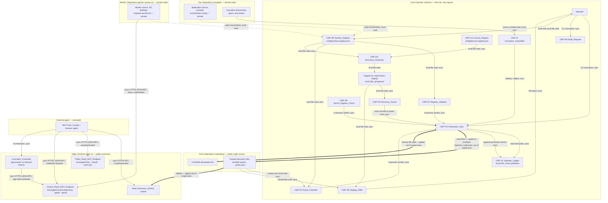
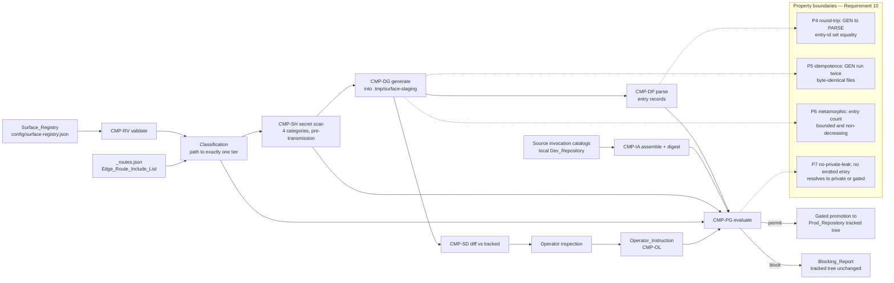

# Discoverability and IP Protection Design

## Overview

This design turns the four-tier surface taxonomy in `requirements.md` into a set
of local Node scripts over one declarative registry file. There is no service, no
hosted runner, and no outbound network call in the decision path. The whole
publication decision — classify, scan, generate, diff, report — executes on the
Operator's machine from a single command, and its only authority is the
Surface_Registry file (Requirement 9.7, Requirement 10.1).

Three design commitments shape everything below.

**One source of truth, one direction of derivation.** The Surface_Registry is
hand-edited; every discovery file is generated from it. Hand-maintained
`robots.txt`, `sitemap.xml`, and `llms.txt` in the Prod_Repository become
generated output, which is what makes the three Known Defects detectable rather
than invisible (a hand-maintained file cannot drift from itself).

**Fail-closed is the default branch, not an error path.** Classification is a
total function: every path either resolves to a registry entry or resolves to
`private`. Every component that cannot complete its work reports a block, never a
warning. The audit is the only component permitted to emit a non-blocking
warning, and only in the narrow case of Requirement 12.5.

**Nothing in this specification writes to the Prod_Repository or the
Edge_Runtime.** Generation targets a staging directory; fixture promotion is
the only exercised mutation path; production promotion requires a recorded
Operator_Instruction and remains outside this implementation.

**Implementation status.** The local Surface_Registry, generation, gate,
audit, fixture boundary, and focused test suite are implemented in Knowgrph.
Source validation is distinct from public-estate readiness: current public
origin drift and source-boundary violations must remain blocking evidence until
their owning promotion work is explicitly authorised.

### Non-goals

- No deployment, no promotion, no Cloudflare interaction (Out of Scope 1).
- No changes to pre-existing application or edge request handlers. Local policy
  scripts, registries, and focused tests are in scope.
- No credential mechanism for `gated` routes (Out of Scope 3); this design
  classifies those routes and emits the authorisation pointer only.
- No hosted CI gate. See ADR-2.

## Architecture

### Component inventory

Component identifiers are stable and are the traceability anchors for the
PRD_TAD_Document (Requirement 11.4, 11.10). Exactly one responsibility per
component; no component both decides and generates.

| ID | Component | Single responsibility | Module (Dev_Repository) | Requirements |
|---|---|---|---|---|
| `CMP-SR` | Surface_Registry | Declare exactly one Surface_Tier and its metadata for every registered artifact | `config/surface-registry.json` + `schemas/surface-registry.v1.schema.json` | 1.1, 1.4, 1.6–1.10, 1.14–1.16, 3.13–3.16, 6.6, 13.1–13.3 |
| `CMP-RV` | Registry_Validator | Validate registry structural and tier-assignment legality before any consumer reads it | `scripts/surface/registry-validate.mjs` | 1.3, 1.11–1.13, 1.17, 7.2 |
| `CMP-RC` | Route_Classifier | Resolve every path in the Edge_Route_Include_List to exactly one Surface_Tier | `scripts/surface/route-classify.mjs` | 13.1–13.3, 13.6, 13.7, 13.10 |
| `CMP-SH` | Secret_Hygiene_Check | Detect credential, signed-URL, private-host, and local-path matches in a candidate set | `scripts/surface/secret-scan.mjs` | 6.1–6.4 |
| `CMP-LR` | License_Registry | Map each artifact class to exactly one license identifier and one license category | `config/license-registry.json` + `scripts/surface/license-registry.mjs` | 7.1, 7.6–7.18 |
| `CMP-DG` | Discovery_Generator | Serialise the Surface_Registry into Discovery_Surface files | `scripts/surface/discovery-generate.mjs` | 2.1–2.5, 2.7–2.11, 3.1–3.5, 3.10, 3.19, 6.8, 13.4, 13.8 |
| `CMP-DP` | Discovery_Parser | Read a Discovery_Surface file back into entry records or a located parse error | `scripts/surface/discovery-parse.mjs` | 10.2, 10.6 |
| `CMP-IA` | Invocation_Assembler | Assemble the published Invocation_Registry catalog and its digest from source catalogs | `scripts/surface/invocation-assemble.mjs` | 4.1–4.11 |
| `CMP-PG` | Publication_Gate | Decide permit or block for a publication candidate and emit the blocking report | `scripts/surface/publication-gate.mjs` | 1.2, 1.5, 5.1–5.11, 6.5, 6.7, 6.9, 6.10, 8.1–8.9, 9.1–9.10, 10.7–10.9 |
| `CMP-AR` | Audit_Reporter | Emit the full-estate audit report and the process exit status | `scripts/surface/audit-report.mjs` | 12.1–12.10 |
| `CMP-SD` | Staging_Differ | Diff generated staging output against currently tracked Prod_Repository files | `scripts/surface/staging-diff.mjs` | Migration Path; 10.8 |
| `CMP-OL` | Operator_Ledger | Persist and read Operator_Instruction, Override_Record, and promotion records | `data/surface/ledger/*.json` + `scripts/surface/ledger.mjs` | 8.5, 8.6, 9.1–9.4, 9.8, 9.10 |

`CMP-RV` and `CMP-RC` are split out of `CMP-PG` deliberately. The gate decides;
the validator judges registry legality; the classifier resolves route coverage.
Collapsing them would give the gate three responsibilities and would make the
fail-closed properties untestable in isolation.

`CMP-SD` and `CMP-OL` are support components with no decision authority: the
differ only describes, the ledger only stores.

### Topology: Discoverability and IP Protection v1.0.0 — 2026-07 baseline

**Boundaries**: Local Operator machine (trust: full), Dev_Repository (private
origin), Worker_Repository (private origin), Prod_Repository (public origin
source), Edge_Runtime (public execution), External agent (untrusted).

| Node | Role | Type | Connects to | Connection type | Data residency |
|---|---|---|---|---|---|
| `CMP-SR` registry file | Store | JSON file | `CMP-RV`, `CMP-RC`, `CMP-DG`, `CMP-PG`, `CMP-AR` | Local file read (sync) | Local disk, Dev_Repository working tree |
| `CMP-LR` license file | Store | JSON file | `CMP-DG`, `CMP-PG` | Local file read (sync) | Local disk, Dev_Repository working tree |
| `CMP-OL` ledger | Store | Append-only JSON files | `CMP-PG` | Local file read/write (sync) | Local disk, Dev_Repository working tree, never published |
| `CMP-RV` | Gateway | Node script | `CMP-PG` | In-process call (sync) | — |
| `CMP-RC` | Router | Node script | `CMP-PG`, `CMP-DG` | In-process call (sync) | — |
| `CMP-SH` | Gateway | Node script | `CMP-PG` | In-process call (sync) | — |
| `CMP-DG` | Producer | Node script | Staging directory | Local file write (sync) | — |
| `CMP-DP` | Consumer | Node script | `CMP-PG` | In-process call (sync) | — |
| `CMP-IA` | Producer | Node script | `CMP-PG` | In-process call (sync) | — |
| `CMP-PG` | Gateway | Node script | `CMP-OL`, staging directory, report file | Local file read/write (sync) | — |
| `CMP-AR` | Producer | Node script | Audit report file | Local file write (sync) | Local disk, `.tmp/`, git-ignored |
| Staging directory | Store | Directory `.tmp/surface-staging/` | `CMP-SD` | Local file read (sync) | Local disk, git-ignored, never tracked |
| `_routes.json` | Store | JSON file | `CMP-RC` | Local file read (sync), sibling checkout | Local disk, Prod_Repository working tree |
| Prod tracked tree | Store | Git-tracked files | `CMP-SD`, `CMP-PG` | Local file read (sync); write only under recorded instruction | Local disk + GitHub public repository |
| Edge static assets | Store | Cloudflare Pages assets | External agent | Sync HTTPS GET | Cloudflare global edge, public |
| `Public_Read_MCP_Endpoint` | Gateway | Pages Function `/knowgrph/mcp` | External agent | Sync HTTPS JSON-RPC, unauthenticated | Cloudflare edge, no persistence |
| `Control_Plane_MCP_Endpoint` | Gateway | Pages Function `/knowgrph/control-plane/mcp` | `Invocation_Forwarder`, Worker_Repository client | Sync HTTPS JSON-RPC, credentialed | Cloudflare edge; spend records in provider account |
| `Invocation_Forwarder` | Router | App-owned forwarder in canvas app | `Control_Plane_MCP_Endpoint` | Sync HTTPS, app-held credential, no inbound listener | Browser memory, no persistence |
| Worker_Repository worker | Consumer | Cloudflare Worker | `Control_Plane_MCP_Endpoint` | Sync HTTPS, credentialed client | Cloudflare edge; secrets in Cloudflare secret store, never in a repository |

**Version notes**: v1.0.0 is the first recorded topology for this feature. It
adds `CMP-SR` … `CMP-OL` on the local boundary and records the already-deployed
two-endpoint MCP boundary unchanged. No node crosses from local to edge in this
version: every local-to-Prod edge in the diagram is gated on a recorded
Operator_Instruction and is out of scope for this specification.



Solid arrows are in-scope local edges. Thick arrows are gated promotion and
deploy edges that this specification defines but does not exercise. Dotted
arrows are read-only path enumeration used to build registry entries.

### Boundary rules

1. No component reads from the network. `CMP-IA` reads source catalogs from the
   local Dev_Repository working tree; the 10-second unreachable-source timeout in
   Requirement 4.7 applies to a local read that fails or hangs, not to an HTTP
   fetch.
2. `CMP-SR` may name the Dev_Repository and Worker_Repository identifiers and
   commit revisions in a provenance record, and may never name a source module,
   binding name, or secret name from either (Requirement 1.18). Enforced by a
   deny-list on provenance record fields in `CMP-DG`.
3. The Prod_Repository tracked tree is read-only to every component except
   `CMP-PG` operating under a recorded Operator_Instruction.

## Architectural Decision Records

### ADR-1: Surface_Registry file format and location

**Status**: Accepted
**Date**: 2026-07-05

#### Context

The registry is the single authority for 130 acceptance criteria and must be
hand-edited by one Operator, machine-validated, and read by six components in
under 60 seconds for 5,000 entries (Requirement 12.6). Format choice determines
whether validation needs a new dependency and whether entry-level rationale can
live next to the entry.

#### Decision

One file, `knowgrph/config/surface-registry.json`, schema-tagged
`knowgrph-surface-registry/v1`, validated against
`knowgrph/schemas/surface-registry.v1.schema.json` with `ajv` (already pinned at
`8.17.1` in the Dev_Repository). Per-entry rationale lives in a required `notes`
string field rather than in comments.

#### Alternatives Considered

1. **YAML single file**: comments and anchors make hand-editing pleasant; no
   YAML parser ships with Node, so this adds a runtime dependency to a script
   set whose whole value proposition is "zero new surface". Anchors also make two
   textually different files parse identically, which weakens the byte-identity
   idempotence property (Requirement 10.4).
2. **FOSS alternative — `yaml` npm package (MIT)**: mature, zero cost, but adds a
   parse-time dependency to the fail-closed path. A registry that cannot be read
   because a transitive dependency broke is a fail-closed block on every publish.
3. **Directory of per-artifact TOML/JSON files**: better git blame per artifact;
   costs a directory walk, makes "exactly one entry per token" and digest
   determinism harder, and multiplies review surface for a solo Operator.
4. **SQLite registry**: fast at 5,000 rows, queryable; binary file kills diff
   review, which is the primary Operator control in this design.

#### Rationale

JSON is the only option where the parser is already in the runtime, the file is
diff-reviewable, and byte-identical regeneration is trivially defined. The
comment loss is bought back with a mandatory `notes` field, which is strictly
better than a comment because the validator can require it.

#### TCO Impact

| Dimension | Chosen: JSON + ajv (Managed/Serverless: n/a, local only) | FOSS alt: `yaml` pkg (local) | FOSS alt: SQLite (Provisioned/Self-Managed local) | Delta / 12 months |
|---|---|---|---|---|
| Infra cost | $0 | $0 | $0 | $0 |
| Egress cost | $0 | $0 | $0 | $0 |
| Token cost | $0 (no model in path) | $0 | $0 | $0 |
| Ops burden | Low — no new dependency, no schema migration tooling | Medium — one more dependency to patch in the blocking path | High — binary artifact, migration scripts, no diff review | — |
| Vendor risk | Low | Low | Low | — |

#### Consequences

- **Positive**: zero new dependencies; `git diff` is the review UI; byte-identity
  idempotence is well-defined.
- **Negative**: no inline comments; JSON hand-editing is noisier (trailing commas
  are a real Operator error mode, caught by `CMP-RV` as a fail-closed block).
- **Neutral**: a YAML-to-JSON authoring front end can be added later without
  changing any consumer.

### ADR-2: Local-only gate execution versus a CI-hosted gate

**Status**: Accepted
**Date**: 2026-07-05

#### Context

Requirement 9.7 mandates classification, scanning, and reporting on the
Operator's local machine with zero outbound requests. A hosted gate is the
industry default and offers unbypassable enforcement.

#### Decision

The gate runs locally as `npm run surface:gate`, wired into the existing
`.githooks` pre-push hook. No CI workflow, no hosted secret scanner, no
third-party action.

#### Alternatives Considered

1. **GitHub Actions gate**: unbypassable on the remote, free minutes on public
   repositories; but the candidate set — including secrets that would be caught —
   must first be pushed to the runner to be scanned. A gate that requires
   uploading the thing you are protecting inverts the threat model.
2. **FOSS alternative — self-hosted runner (Actions runner, Apache-2.0) or
   Woodpecker CI (Apache-2.0)**: keeps scanning on owned hardware; adds a daemon
   to patch, a token to rotate, and an always-on machine for a solo Operator.
3. **FOSS alternative — `pre-commit` framework (MIT) with hosted mirror hooks**:
   same local execution as the chosen option but adds a Python toolchain to a
   Node estate.

#### Rationale

The scan must complete before candidate bytes leave the machine (Requirement
6.1). Only local execution satisfies that ordering. Enforcement weakness — a
local hook is bypassable with `--no-verify` — is acceptable because the Operator
is the sole authority (Requirement 9), and the audit (`CMP-AR`) provides
after-the-fact detection of any bypass.

#### TCO Impact

| Dimension | Chosen: local hook (Managed/Serverless: n/a) | FOSS alt: hosted CI (Managed/Serverless) | FOSS alt: self-hosted runner (Provisioned/Self-Managed) | Delta / 12 months |
|---|---|---|---|---|
| Infra cost | $0 | $0 within free tier, metered beyond | ~$60–$120 (always-on small instance) | −$60 to −$120 |
| Egress cost | $0 | $0 | $0 | $0 |
| Token cost | $0 | $0 | $0 | $0 |
| Ops burden | Low — one hook, no credentials | Low-Medium — workflow maintenance, action pinning, third-party supply chain | High — daemon patching, runner token rotation, capacity | — |
| Vendor risk | Low | Medium — action supply chain in the blocking path | Low | — |

#### Consequences

- **Positive**: no candidate bytes leave the machine before scanning; zero cost;
  no supply-chain surface in the blocking path.
- **Negative**: bypassable locally; no enforcement for a second contributor.
- **Neutral**: if a second contributor ever joins, a CI job that re-runs the
  audit (not the scan) can be added without changing component boundaries.

### ADR-3: Three-license split

**Status**: Accepted
**Date**: 2026-07-05

#### Context

Requirement 7 requires exactly one license identifier per artifact class and
exactly one category per class. Prose, machine-readable metadata, and bundled
build output have materially different reuse profiles.

#### Decision

`CC-BY-4.0` for prose classes; `Apache-2.0` for machine-readable metadata
classes; `LicenseRef-airvio-no-reuse-1.0` for bundled browser build output and
Publish_Allowlist distribution modules (Requirement 7.15–7.17). The
mapping lives in `config/license-registry.json`; the root declaration file in the
Prod_Repository is generated from it, so 7.13 and 7.14 drift is mechanical.

#### Alternatives Considered

1. **Single permissive license across everything (Apache-2.0)**: simplest
   declaration; grants reuse of bundled build output, which is precisely the
   asset the IP_Boundary exists to withhold.
2. **FOSS alternative — AGPL-3.0 everywhere**: copyleft would discourage silent
   reuse of build output, but it is a source-availability license applied to a
   repository with no published source, so its central obligation is unenforceable
   and its presence would misdescribe the estate.
3. **Two-license split (prose + no-reuse), metadata under CC-BY**: CC-BY
   attribution terms are impractical for JSON copied into third-party code and
   provide no patent grant, which is a real adoption blocker for an MCP manifest.

#### Rationale

The three-way split maps license semantics to consumption mode: prose is cited,
metadata is copied into code, build output is executed but not reused. A single
license necessarily gets one of the three wrong.

#### TCO Impact

| Dimension | Chosen: three-way split (Managed/Serverless: n/a) | FOSS alt: single Apache-2.0 | FOSS alt: AGPL-3.0 everywhere | Delta / 12 months |
|---|---|---|---|---|
| Infra cost | $0 | $0 | $0 | $0 |
| Egress cost | $0 | $0 | $0 | $0 |
| Token cost | $0 | $0 | $0 | $0 |
| Ops burden | Medium — three identifiers, one category check per class, generated declaration file | Low — one identifier | Medium — copyleft compliance questions with no source published | — |
| Vendor risk | Low | Low | Low | — |

#### Consequences

- **Positive**: reuse grant matches consumption mode per class; metadata adoption
  unblocked by a patent grant.
- **Negative**: three-way mapping is a validation surface (Requirement 7.10–7.12
  exist because of it); each new public artifact class needs an explicit mapping.
- **Neutral**: the generated declaration file makes adding a fourth class cheap.

### ADR-4: Two-endpoint MCP split versus a single authenticated endpoint

**Status**: Accepted (records an already-deployed decision)
**Date**: 2026-07-05

#### Context

MCP is the only inbound protocol boundary. Discovery must cost $0 and require no
credential; spend-bearing execution must be credentialed and approval-gated
(Requirement 3.6, 3.9, 3.13–3.18).

#### Decision

Keep the deployed split: `/knowgrph/mcp` unauthenticated with every tool carrying
`readOnlyHint`, and `/knowgrph/control-plane/mcp` credentialed carrying every
spend-bearing capability. `/`, `@`, and `#` tokens are metadata only and execute
through the Invocation_Forwarder into a control-plane tool (Requirement 4.9–4.11).

#### Alternatives Considered

1. **Single authenticated endpoint**: one route to operate and one policy to
   reason about; makes discovery credentialed, so an agent cannot enumerate
   capabilities before onboarding, and forces a credential into `robots.txt`-level
   discovery. Fails Requirement 3.6 and 3.9.
2. **FOSS alternative — single endpoint behind an open-source MCP gateway
   (Apache-2.0 gateway proxy, self-hosted)**: gives per-tool policy on one route;
   adds a fifth proxy tier the guidelines explicitly forbid without an ADR, plus
   a provisioned runtime to operate.
3. **Three endpoints (read, write, spend)**: finer blast radius; a third route to
   classify, rate-limit, and document for no additional protection, since the
   spend boundary is the one that matters.

#### Rationale

The split makes the expensive property structural rather than procedural: a
spend-bearing tool cannot be reached through the unauthenticated route because it
is not published there at all (Requirement 3.15), not because a check rejected
it. Structural absence is the strongest available guarantee and is what makes
Property 11 testable.

#### TCO Impact

| Dimension | Chosen: two Pages Functions (Managed/Serverless) | FOSS alt: MCP gateway proxy (Managed/Serverless container) | FOSS alt: MCP gateway proxy (Provisioned/Self-Managed) | Delta / 12 months |
|---|---|---|---|---|
| Infra cost | $0 within existing Pages plan | ~$60–$180 | ~$60–$120 plus host | −$60 to −$180 |
| Egress cost | $0 (existing origin) | Metered | Metered | Negative |
| Token cost | $0 on discovery; unchanged on execution | Unchanged | Unchanged | $0 |
| Ops burden | Low — two functions in an existing deployment | Medium — container image, config, rollout | High — host patching, TLS, failover | — |
| Vendor risk | Medium — Pages-specific routing | Low | Low | — |

#### Consequences

- **Positive**: $0 discovery; spend capability structurally absent from the public
  route; no new inbound protocol for `/`, `@`, `#`.
- **Negative**: two routes to keep classified and rate-limited; forwarder holds a
  credential in app context.
- **Neutral**: a gateway can be added later in front of both routes without
  changing the classification model.

### ADR-5: Generated discovery files replace hand-maintained ones

**Status**: Accepted
**Date**: 2026-07-05

#### Context

`robots.txt`, `sitemap.xml`, `llms.txt`, `openapi.json`, the agent card, and the
API catalog entry are currently hand-maintained in the Prod_Repository. Two of
the three Known Defects are drift between those files and reality; drift is
undetectable while the file is its own authority.

#### Decision

`CMP-DG` generates all Discovery_Surface files from `CMP-SR` into
`.tmp/surface-staging/`. `CMP-SD` diffs staging against the tracked files.
Promotion copies staging over tracked files only under a recorded
Operator_Instruction. The tracked files remain the served artifacts; they simply
stop being hand-authored.

#### Alternatives Considered

1. **Keep hand-maintained files, add a lint that checks them**: no migration
   step, but the lint duplicates generation logic and every new route needs two
   edits, which is exactly the drift mechanism that produced Known Defect 1 and 2.
2. **FOSS alternative — static site generator sitemap plugin (MIT)**: standard
   and free; derives from the page graph, not from the Surface_Registry, so it
   cannot represent `gated`, `public-artifact`, or representing-page substitution,
   and it would re-introduce a second source of truth.
3. **Edge-time generation in a Pages Function**: always fresh; moves
   classification to a runtime with no access to the registry, adds per-request
   cost, and breaks Requirement 9.7 (classification would leave the local
   machine).

#### Rationale

Generation is the only option where the round-trip, idempotence, and monotonicity
properties in Requirement 10 are even expressible. A hand-maintained file has no
generator to round-trip against.

#### TCO Impact

| Dimension | Chosen: local generation (Managed/Serverless: n/a) | FOSS alt: SSG plugin (local) | FOSS alt: edge-time generation (Managed/Serverless) | Delta / 12 months |
|---|---|---|---|---|
| Infra cost | $0 | $0 | $0 within plan, metered on invocation growth | ~$0 |
| Egress cost | $0 | $0 | $0 | $0 |
| Token cost | $0 | $0 | $0 | $0 |
| Ops burden | Low — one script, staging diff review | Medium — plugin config plus a second source of truth | Medium-High — runtime debugging, cache invalidation, violates local-only gate | — |
| Vendor risk | Low | Low | Medium | — |

#### Consequences

- **Positive**: drift becomes a test failure; the three Known Defects become
  reproducible; one edit per new route.
- **Negative**: an Operator hand-edit to a tracked discovery file is now a
  defect, and the diff step is a new habit.
- **Neutral**: existing tracked files become the first diff baseline.

## Components and Interfaces

Each component exposes one pure function over plain data plus one CLI wrapper.
Every function is total: it returns a verdict record, never throws for a policy
condition. Verifiable Completion Conditions (VCC) are stated per component for
Requirement 11.8.

### CMP-SR Surface_Registry

**Responsibility**: declare exactly one Surface_Tier and its metadata per
artifact.
**Interface** `IF-SR-READ`: `readRegistry(path) -> { schema, version, provenance, entries[] }`.
**Configuration**: `config/surface-registry.json`, `config/license-registry.json`.
**FOSS / Vendor**: FOSS (`ajv` MIT).
**VCC**: `node scripts/surface/registry-validate.mjs` exits `0` and prints
`entries=<n> tiers=4`; every entry validates against the v1 JSON Schema.

### CMP-RV Registry_Validator

**Responsibility**: judge registry legality before any consumer reads it.
**Interface** `IF-RV-VALIDATE`: `validateRegistry(registry) -> { ok, violations[] }`
where `violations[] = { code, artifactId, field?, recordedValue?, mandatoryValue? }`.
Codes: `MULTI_TIER` (1.3), `UNKNOWN_TIER` (1.12), `MISSING_FIELD` (1.13),
`CLASS_TIER_VIOLATION` (1.11), `REPO_VISIBILITY` (1.17), `UNLICENSED` (7.2).
**VCC**: for a registry with any injected violation, exit status is non-zero and
the violation code plus artifact identifier appear in stdout.

### CMP-RC Route_Classifier

**Responsibility**: resolve every Edge_Route_Include_List path to one tier.
**Interface** `IF-RC-CLASSIFY`: `classifyRoutes(registry, routesManifest) -> { routes[], unclassified[], missingRateLimit[] }`
where `routes[] = { path, tier, rateLimit?, readOnly?, executionRoute }`.
**Dependencies**: `_routes.json` from the local Prod_Repository checkout (read
only).
**Behaviour**: unmatched path ⇒ tier `private` and membership of `unclassified[]`
(Requirement 13.7); proxy route without `rateLimit` ⇒ `missingRateLimit[]`
(13.10).
**VCC**: `classifyRoutes` over the live `_routes.json` returns
`unclassified.length === 0` and `missingRateLimit.length === 0`.

### CMP-SH Secret_Hygiene_Check

**Responsibility**: detect matches in four categories across a candidate set.
**Interface** `IF-SH-SCAN`: `scanCandidate(files[], { timeoutMs: 300000 }) -> { complete, scannedCount, timestamp, matches[] }`
where `matches[] = { path, category, line }` and `category ∈ { credential-material, signed-url, private-host, local-absolute-path }`.
**Invariant**: no match record, and no report field, contains the matched value or
any substring of it (Requirement 6.2). The scanner returns line numbers and
category only.
**Behaviour**: incomplete coverage or timeout ⇒ `complete: false`, which
`CMP-PG` treats as a detection (Requirement 6.4).
**FOSS / Vendor**: FOSS. Detection rules are local regex sets in
`scripts/surface/secret-patterns.mjs`; `gitleaks` (MIT) was rejected as a
dependency because it is a Go binary and the four categories here are narrower
than its rule set. Recorded in the Testing Strategy rather than an ADR because no
dependency is added.
**VCC**: for a candidate containing a synthetic key in each category, `matches`
has one entry per category and the report text contains no 8-character substring
of any injected secret.

### CMP-LR License_Registry

**Responsibility**: map artifact class to one license identifier and one
category.
**Interface** `IF-LR-RESOLVE`: `resolveLicense(artifactClass) -> { licenseId, category }`
with `category ∈ { permissive, no-reuse }`; `IF-LR-DECLARATION`:
`renderDeclaration(registry) -> string` producing the Prod_Repository root
declaration file content.
**Behaviour**: class in neither or both categories ⇒ violation (7.11, 7.12);
prose class not `CC-BY-4.0` or metadata class not `Apache-2.0` ⇒ violation (7.18).
**VCC**: `resolveLicense` is total over every artifact class present in the
registry, and `renderDeclaration` output covers every class recorded in
`CMP-LR`.

### CMP-DG Discovery_Generator

**Responsibility**: serialise the registry into Discovery_Surface files.
**Interface** `IF-DG-GENERATE`: `generate(registry, licenseRegistry, outDir) -> { files: Map<name, bytes>, generationErrors[] }`.
**Emitted files**: `robots.txt`, `sitemap.xml`, `llms.txt`, `openapi.json`,
`.well-known/api-catalog`, `.well-known/agent-card.json`, `.well-known/mcp.json`,
per-document structured data blocks.
**Determinism rules** (these make Property 5 hold): entries sorted by artifact
identifier with a byte-wise comparator; timestamps taken from the registry
`lastModified` field, never from the clock; two-space JSON indent; `\n` line
endings; no generation counter.
**Behaviour**: `public-discoverable` artifact missing title, summary, or canonical
URL ⇒ omitted from `llms.txt` plus a `generationErrors[]` record (3.12); runtime
endpoint value ⇒ placeholder token containing no substring of the value (6.8).
**VCC**: two consecutive runs over an unchanged registry produce byte-identical
files; `generate` reads no input other than the two registry files (asserted by
a `fs.readFile` spy in the unit test).

### CMP-DP Discovery_Parser

**Responsibility**: read a Discovery_Surface file back into entry records or a
located parse error.
**Interface** `IF-DP-PARSE`: `parseDiscoveryFile(name, bytes) -> { entries[], error? }`
where `entries[] = { entryId, canonicalUrl, summary }` and
`error = { file, line }` with a 1-based line number.
**Behaviour**: formats with no summary field (`sitemap.xml`, `robots.txt`) yield
`summary: ""` (Requirement 10.2); on error, `entries` is empty and the file is
never rewritten (10.6).
**VCC**: for every generated file, `parseDiscoveryFile` returns zero errors; for a
file with a corrupted line `k`, the returned `error.line === k`.

### CMP-IA Invocation_Assembler

**Responsibility**: assemble the published catalog and its digest.
**Interface** `IF-IA-ASSEMBLE`: `assembleCatalog(sources[]) -> { entries[], digest, unreachableSources[], validationFailures[] }`.
**Entry shape**: `{ token, prefixRole, label, intentSummary, executionRouteTier, sourceCatalogs[] }`.
**Behaviour**: dev-only policy without recorded approval ⇒ excluded from entries
and from the digest input (4.3); duplicate token strings ⇒ one retained entry
naming every contributing catalog (4.6); digest computed over entries sorted by
token so assembly order cannot change it (4.4); source read failure or 10-second
hang ⇒ named in `unreachableSources[]` and the catalog still emitted (4.7).
**VCC**: for any permutation of the same source set, `digest` is identical; no
entry carries an implementation path, module identifier, prompt body, or a
directly invocable public endpoint address.

### CMP-PG Publication_Gate

**Responsibility**: decide permit or block for a candidate and emit the report.
**Interface** `IF-PG-EVALUATE`:
`evaluate({ candidatePaths[], registry, licenseRegistry, routes, scanResult, catalog, parsedFiles, instruction? }) -> { decision: "permit" | "block", blocks[], stub?, conflictRecord? }`
where `blocks[] = { criterionId, code, subject, detail }`.
**Ordering**: registry validation → tier resolution of every candidate path →
secret scan → discovery-file parse and drift check → license checks → invocation
checks → approval check. All stages run; the report lists every blocking
criterion identifier rather than stopping at the first (Requirement 6.5).
**State rule**: on `block`, no write occurs to the Prod_Repository tracked tree or
the staging directory (5.11, 6.10, 9.5).
**Conflict handling**: on a Discoverability_Protection_Conflict, emit exactly one
Metadata_Stub if and only if every field required by Requirement 8.3 is present;
otherwise emit none and stay blocked (8.7).
**VCC**: exit `0` with `decision=permit` only when `blocks.length === 0`; on any
block, `git status --porcelain` in the Prod_Repository checkout is byte-identical
before and after.

### CMP-AR Audit_Reporter

**Responsibility**: emit the estate audit report and the exit status.
**Interface** `IF-AR-AUDIT`: `audit(registry, { deadlineMs: 60000 }) -> { entries[], tierCounts, blockedCandidateCount, warnings[], failures[], elapsedMs, exitStatus }`.
**Behaviour**: located-outside-permitted-repository ⇒ failure regardless of
warnings (12.4); tier mismatch inside the permitted repository ⇒ warning with
success exit (12.5); pre/post per-file digest comparison over every scanned file
(12.7, 12.9); deadline exceeded ⇒ stop, fail, report elapsed time and unevaluated
count (12.10); unreadable registry ⇒ no report, failure exit (12.8).
**VCC**: 5,000-entry synthetic registry audits in under 60 s and every pre/post
digest pair is equal.

### CMP-SD Staging_Differ

**Responsibility**: describe the difference between staging output and tracked
files.
**Interface** `IF-SD-DIFF`: `diffStaging(stagingDir, trackedDir) -> { added[], removed[], changed[], identical[] }` with a unified diff per changed file.
**VCC**: `diffStaging` performs zero writes; `changed[]` is empty after an
approved promotion.

### CMP-OL Operator_Ledger

**Responsibility**: persist and read Operator_Instruction, Override_Record, and
promotion records.
**Interface** `IF-OL-READ`: `readInstruction(id) -> Operator_Instruction | null`;
`IF-OL-APPEND`: `appendPromotionRecord(record) -> { written: boolean }`.
**Behaviour**: ledger files are `private` in `CMP-SR` and never published; a
failed record write is reported to `CMP-PG` and blocks the promotion (9.10).
**VCC**: an instruction is readable only when it states an instruction
identifier, every authorised artifact identifier, exactly one destination, and a
timestamp (9.8).

### Integration contracts

| Interface | Protocol | Format | Errors |
|---|---|---|---|
| `IF-SR-READ` | Local file read | JSON (`knowgrph-surface-registry/v1`) | Unreadable ⇒ fail-closed block; audit exits failure (12.8) |
| `IF-RV-VALIDATE` | In-process call | Plain object | Returns `violations[]`; never throws for policy conditions |
| `IF-RC-CLASSIFY` | Local file read + in-process call | JSON | Unmatched path ⇒ `private` + `unclassified[]` |
| `IF-SH-SCAN` | Local filesystem walk | Plain object | Incomplete or timeout ⇒ `complete: false` treated as detection |
| `IF-DG-GENERATE` | In-process call + local write | Bytes per file name | `generationErrors[]`; partial file set is never written |
| `IF-DP-PARSE` | In-process call | Plain object | `error = { file, line }`; zero entries; file unmodified |
| `IF-IA-ASSEMBLE` | Local file read | Plain object | `unreachableSources[]`, `validationFailures[]` |
| `IF-PG-EVALUATE` | In-process call | Plain object | `blocks[]` with one entry per blocking criterion |
| `IF-AR-AUDIT` | In-process call + local write | JSON report + exit code | Failure exit dominates warnings |
| `IF-OL-*` | Local file read/write | JSON | Write failure ⇒ block promotion |

No interface in this table crosses a network boundary. The MCP endpoint contracts
in the Topology are pre-existing and unchanged by this design.

## Data Models

### Surface_Registry entry schema

`schema: "knowgrph-surface-registry/v1"`. Required fields are marked `R`;
conditionally required fields state their condition.

| Field | Type | Req | Semantics |
|---|---|---|---|
| `artifactId` | string, unique | R (1.4) | Stable traceability key; used as the sort key for deterministic generation |
| `path` | string | R | Repository-relative exact path, directory prefix, or routed path |
| `artifactClass` | enum | R | `application-source`, `prompt-internal`, `orchestration-wiring`, `credential-material`, `unpublished-spec`, `runtime-config`, `local-convenience`, `bundled-build-output`, `dist-module`, `published-document`, `guideline`, `specification`, `machine-readable-metadata`, `capability-description`, `service-description`, `routed-path`, `mcp-endpoint`, `invocation-token` |
| `surfaceTier` | enum, single value | R (1.1) | `private` \| `gated` \| `public-artifact` \| `public-discoverable`. An array here is a `MULTI_TIER` violation (1.3) |
| `licenseId` | string | R (1.4) | SPDX identifier, `LicenseRef-*`, or `NONE-private` for `private` entries |
| `publishPolicy` | enum | R (1.4) | `never` \| `dev-only` \| `operator-approved` \| `generated-only` |
| `owningRepository` | enum | R (1.4) | `dev` \| `worker` \| `prod` \| `site` |
| `repositoryVisibility` | enum | R (1.14–1.17) | `private` \| `public`; `dev` and `worker` must be `private` |
| `artifactClassCategory` | enum | R (7.10) | `permissive` \| `no-reuse` \| `unlicensed-private` |
| `canonicalUrl` | string or `null` | R when tier is `public-discoverable` (2.4, 2.6) | Exactly one absolute URL at the public origin; must not address two artifacts |
| `representingPage` | string or `null` | R when the artifact is not itself a page (2.8–2.10) | Path listed in `sitemap.xml` in place of the artifact |
| `title` | string 1–80 | R when tier is `public-discoverable` (3.1) | `llms.txt` and structured-data title |
| `summary` | string 1–200, no line break | R when tier is `public-discoverable` (3.1) | `llms.txt` and Metadata_Stub summary |
| `readOnly` | boolean or `null` | R when class is `mcp-endpoint` or `invocation-token` (3.15) | `true` permits publication on the public read endpoint |
| `executionRoute` | enum | R when the entry is invocable (3.16, 4.10) | `public-read-mcp` \| `control-plane-mcp` \| `invocation-forwarder` \| `static-edge` \| `none` |
| `spendBearing` | boolean | R when the entry is invocable (3.16, 3.18) | `true` forces `executionRoute: control-plane-mcp` |
| `rateLimit` | `{ requests, windowSeconds }` or `null` | R for the fetch-on-behalf proxy routes (13.2, 13.10) | Missing on a proxy route is a block |
| `lastModified` | ISO-8601 date | R for `public-discoverable` (2.5) | Structured-data date; also the generator's only time source |
| `provenanceRef` | string or `null` | Optional (1.18) | May name a repository identifier and commit revision; never a module, binding, or secret name |
| `notes` | string | R | Operator rationale; compensates for JSON's lack of comments (ADR-1) |

Two derived values are never stored: the tier derived from `artifactClass` (used
by the audit for the Requirement 12.5 warning) and the most-restrictive tier
resolution result (Requirement 1.10). Storing either would create a second
authority.

### Worked example — all four tiers

```json
{
  "schema": "knowgrph-surface-registry/v1",
  "version": "1.0.0",
  "publicOrigin": "https://airvio.co",
  "provenance": {
    "devRepository": "knowgrph",
    "devRevision": "6b381860cb2abd26cc2e37b84fd1bbc9cfa93896",
    "workerRepository": "agentic-canvas-os",
    "workerRevision": "a1c9f27d4e5b6081f3c2d9a4b7e8c1052f6d3b90"
  },
  "entries": [
    {
      "artifactId": "dev.mcp.docs-runtime",
      "path": "mcp/agentic-canvas-os-docs-runtime.js",
      "artifactClass": "orchestration-wiring",
      "surfaceTier": "private",
      "licenseId": "NONE-private",
      "publishPolicy": "never",
      "owningRepository": "dev",
      "repositoryVisibility": "private",
      "artifactClassCategory": "unlicensed-private",
      "canonicalUrl": null,
      "representingPage": null,
      "readOnly": null,
      "executionRoute": "none",
      "spendBearing": false,
      "rateLimit": null,
      "provenanceRef": null,
      "notes": "Invocation resolution wiring. Private under R1.6 and R1.15; never promoted."
    },
    {
      "artifactId": "route.api.llm.chat-completions",
      "path": "/api/llm/chat/completions",
      "artifactClass": "routed-path",
      "surfaceTier": "gated",
      "licenseId": "NONE-private",
      "publishPolicy": "never",
      "owningRepository": "prod",
      "repositoryVisibility": "public",
      "artifactClassCategory": "unlicensed-private",
      "canonicalUrl": null,
      "representingPage": null,
      "readOnly": false,
      "executionRoute": "control-plane-mcp",
      "spendBearing": true,
      "rateLimit": { "requests": 30, "windowSeconds": 60 },
      "notes": "Spend-bearing model route. R13.1 gated; robots disallow required by R13.4."
    },
    {
      "artifactId": "route.api.link-preview",
      "path": "/api/link-preview",
      "artifactClass": "routed-path",
      "surfaceTier": "gated",
      "licenseId": "NONE-private",
      "publishPolicy": "never",
      "owningRepository": "prod",
      "repositoryVisibility": "public",
      "artifactClassCategory": "unlicensed-private",
      "canonicalUrl": null,
      "representingPage": null,
      "readOnly": false,
      "executionRoute": "static-edge",
      "spendBearing": false,
      "rateLimit": { "requests": 20, "windowSeconds": 60 },
      "notes": "Fetch-on-behalf proxy: egress cost plus SSRF exposure. R13.2 requires the recorded 20 requests per 60 seconds rate limit."
    },
    {
      "artifactId": "asset.knowgrph.canvas-bundle",
      "path": "knowgrph/assets/index-*.js",
      "artifactClass": "bundled-build-output",
      "surfaceTier": "public-artifact",
      "licenseId": "LicenseRef-airvio-no-reuse-1.0",
      "publishPolicy": "generated-only",
      "owningRepository": "prod",
      "repositoryVisibility": "public",
      "artifactClassCategory": "no-reuse",
      "canonicalUrl": null,
      "representingPage": "/knowgrph/",
      "readOnly": null,
      "executionRoute": "static-edge",
      "spendBearing": false,
      "rateLimit": null,
      "notes": "Served, not reusable. Omitted from sitemap by R2.7; the loading page is listed instead by R2.10."
    },
    {
      "artifactId": "discovery.llms-txt",
      "path": "llms.txt",
      "artifactClass": "machine-readable-metadata",
      "surfaceTier": "public-discoverable",
      "licenseId": "Apache-2.0",
      "publishPolicy": "generated-only",
      "owningRepository": "prod",
      "repositoryVisibility": "public",
      "artifactClassCategory": "permissive",
      "canonicalUrl": "https://airvio.co/llms.txt",
      "representingPage": null,
      "title": "Agent index for airvio.co",
      "summary": "Machine-readable index of publicly discoverable documents and capability descriptions.",
      "readOnly": null,
      "executionRoute": "static-edge",
      "spendBearing": false,
      "rateLimit": null,
      "lastModified": "2026-07-05",
      "notes": "Generated by CMP-DG. Apache-2.0 under R7.16 because agents copy metadata into code."
    },
    {
      "artifactId": "endpoint.mcp.public-read",
      "path": "/knowgrph/mcp",
      "artifactClass": "mcp-endpoint",
      "surfaceTier": "public-discoverable",
      "licenseId": "Apache-2.0",
      "publishPolicy": "generated-only",
      "owningRepository": "prod",
      "repositoryVisibility": "public",
      "artifactClassCategory": "permissive",
      "canonicalUrl": "https://airvio.co/knowgrph/mcp",
      "representingPage": "/agents/",
      "title": "Public read MCP endpoint",
      "summary": "Unauthenticated MCP transport carrying read-only tools with zero model invocation on discovery.",
      "readOnly": true,
      "executionRoute": "public-read-mcp",
      "spendBearing": false,
      "rateLimit": null,
      "lastModified": "2026-07-05",
      "notes": "R3.13. Every tool published here must record readOnly true (R3.15)."
    },
    {
      "artifactId": "token.slash.video-generate",
      "path": "invocation://slash/video.generate",
      "artifactClass": "invocation-token",
      "surfaceTier": "public-discoverable",
      "licenseId": "Apache-2.0",
      "publishPolicy": "operator-approved",
      "owningRepository": "dev",
      "repositoryVisibility": "private",
      "artifactClassCategory": "permissive",
      "canonicalUrl": "https://airvio.co/agents/invocation-registry#video-generate",
      "representingPage": "/agents/",
      "title": "/video.generate",
      "summary": "Generate a video from a storyboard. Executes through the app-owned forwarder into a control-plane tool.",
      "readOnly": false,
      "executionRoute": "invocation-forwarder",
      "spendBearing": true,
      "rateLimit": null,
      "lastModified": "2026-07-05",
      "notes": "Metadata is public-discoverable; execution route is gated. R4.9-4.11 and R3.16."
    }
  ]
}
```

The last entry is the one worth reading twice: an artifact can be
`public-discoverable` as *metadata* while its execution route is `gated`. The
tier governs what is emitted about the token; `executionRoute` and
`spendBearing` govern where it can run. `CMP-PG` blocks any such entry whose
`executionRoute` is not `invocation-forwarder` and any entry with
`spendBearing: true` whose route is not the control plane.

### Report and record models

| Model | Fields | Requirements |
|---|---|---|
| `Blocking_Report` | `{ decision: "block", blocks[]: { criterionId, code, subject, detail }, candidateCount, timestamp }` | 6.5, 1.3, 5.2, 13.5 |
| `Scan_Result` | `{ complete, scannedCount, timestamp, matches[]: { path, category, line } }` — no matched value | 6.2, 6.3 |
| `Audit_Report` | `{ entries[]: { artifactId, surfaceTier, licenseId, state: "permitted" \| "blocked" }, tierCounts: { public-discoverable, public-artifact, gated, private }, blockedCandidateCount, warnings[], failures[], elapsedMs }` | 12.1, 12.2, 12.5 |
| `Operator_Instruction` | `{ instructionId, artifactIds[], destination: "prod" \| "edge", timestamp }` | 9.8 |
| `Override_Record` | `{ conflictId, author, scope, justification }` | 8.6, 8.9 |
| `Promotion_Record` | `{ artifactId, sourcePath, destinationPath, instructionId, timestamp }` | 9.4 |
| `Metadata_Stub` | `{ capabilityName, summary (≤200), surfaceTier, authorisationUrl }` | 8.3, 8.4 |
| `Conflict_Record` | `{ conflictId, artifactId, outcome: "blocked-with-stub" \| "blocked-without-stub" \| "override-applied", timestampUtc }` | 8.5 |

`tierCounts` reports `0` explicitly for empty tiers (12.2), so the report shape is
stable across registry states — which is what lets Property 6 compare counts
across generated states.

## Data Flow: Surface_Registry to gated promotion

| Stage | Component | Input format | Output format | Persistence | Error handling |
|---|---|---|---|---|---|
| Ingest | `CMP-SR` + `CMP-RV` | `surface-registry.json` | Validated registry object | None | Unreadable or invalid ⇒ fail-closed block (12.8, 1.13) |
| Classify | `CMP-RC` + `CMP-PG` tier resolution | Registry object, `_routes.json`, candidate paths | `{ path, tier }` per candidate path | None | Unmatched path ⇒ `private` + block (1.2, 5.10, 6.7, 13.7) |
| Scan | `CMP-SH` | Candidate file bytes | `Scan_Result` | None | Incomplete or timeout ⇒ treated as detection (6.4) |
| Generate | `CMP-DG` | Registry + license registry | Discovery_Surface bytes | Staging dir `.tmp/surface-staging/` (git-ignored) | `generationErrors[]`; no partial file set written (3.12) |
| Verify | `CMP-DP` + `CMP-IA` | Staging bytes, source catalogs | Entry records, catalog, digest | None | Parse error ⇒ block with file and line (10.9); digest mismatch ⇒ block (4.5) |
| Diff | `CMP-SD` | Staging bytes, tracked bytes | Unified diff | None | Read-only; never writes |
| Gate | `CMP-PG` | All prior outputs + `Operator_Instruction` | `permit` or `Blocking_Report` | `CMP-OL` promotion record on permit | Any block ⇒ tracked tree unchanged (5.11, 6.10, 9.5) |
| Promote | `CMP-PG` under instruction | Staging bytes | Tracked files | Prod_Repository working tree | Record write failure ⇒ block (9.10) |



The property boundaries sit exactly where the derivation direction changes.
Round-trip and no-leak are checked at the generate-to-parse seam because that is
the only place a discovery file's content can be compared against its authority.
Idempotence and monotonicity are checked on the generator alone, because both are
statements about the generator as a function, not about the estate.

## Invocation boundary: two MCP endpoints and the forwarder

The already-deployed `.well-known/mcp.json` declares `publicReadMcpUrl` (noauth,
every tool `readOnlyHint`) and `controlPlaneMcpUrl` (approval-gated,
spend-bearing), plus `hostedGrammarDefaultPath: "app-owned-forwarder"`. This
design classifies and generates that manifest rather than changing it.

| Surface | Inbound protocol | Credential | Published tier | Tools published | Spend |
|---|---|---|---|---|---|
| `/knowgrph/mcp` | MCP JSON-RPC over HTTPS | None | `public-discoverable` | Only entries with `readOnly: true` (3.15) | Never |
| `/knowgrph/control-plane/mcp` | MCP JSON-RPC over HTTPS | Required | `gated` | Approval-gated, spend-bearing, orchestration | Yes |
| `/`, `@`, `#` tokens | None — no inbound listener | App-held, in forwarder | Metadata `public-discoverable`; route `gated` | Metadata only, zero endpoint addresses (4.9) | Via control plane only |

Where a video-generation request lands, and what stops it reaching the public
read endpoint:

1. An agent reads `/agents/invocation-registry` or `llms.txt` and finds
   `/video.generate` with `executionRoute: invocation-forwarder` and no endpoint
   address. There is nothing there to call directly (4.9, 4.11).
2. If the agent calls `tools/call` for a video tool on `/knowgrph/mcp`, the tool
   is not in that endpoint's tool list, because `CMP-DG` publishes only
   `readOnly: true` entries there (3.15). The endpoint answers method-not-found;
   zero models are invoked (3.11).
3. If a registry edit tried to publish it there, `CMP-PG` blocks publication and
   names the control-plane endpoint as the required route (3.17, 3.18).
4. The legitimate path is UI or agent → Invocation_Forwarder (app-owned, no
   inbound listener) → `/knowgrph/control-plane/mcp` with the app-held
   credential → approval gate → spend.
5. An unauthenticated direct call to the control-plane endpoint returns an
   authorisation error plus the authorisation metadata pointer, invokes zero
   models, and returns no portion of the gated payload (3.9).

Three independent mechanisms therefore stand between a spend-bearing capability
and an anonymous caller: structural absence from the public tool list,
publication-time blocking of any other declared route, and runtime credential
rejection. Only the second is new work in this specification.

## Migration Path

No deployment. The migration converts three hand-maintained files into generated
ones through an inspect-then-approve loop that never writes to the
Prod_Repository without an Operator_Instruction.

| Step | Command | Writes | Gate |
|---|---|---|---|
| 1. Seed registry | hand-edit `config/surface-registry.json` | Dev_Repository only | `CMP-RV` must exit `0` |
| 2. Cover routes | `npm run surface:routes` | None | `unclassified[]` and `missingRateLimit[]` must be empty (13.6, 13.10) |
| 3. Generate to staging | `npm run surface:generate` | `.tmp/surface-staging/` only | `generationErrors[]` must be empty |
| 4. Diff | `npm run surface:diff` | None | Operator reads the unified diff per file |
| 5. Reconcile | edit the registry, not the staging output | Dev_Repository only | Re-run steps 3–4 until the diff is intentional |
| 6. Audit | `npm run surface:audit` | `.tmp/` report only | Exit `0` (12.3) |
| 7. Record instruction | `npm run surface:instruct -- --artifacts=… --destination=prod` | `CMP-OL` ledger | Instruction must satisfy 9.8 |
| 8. Promote | `npm run surface:promote` | Prod_Repository working tree | `CMP-PG` permit plus recorded instruction (9.1) |
| 9. Deploy | out of scope | — | Requires a separate Operator_Instruction naming `edge` (9.2) |

Steps 1–7 are implemented locally. Step 8 is defined and tested against a
temporary fixture directory, never against the real Prod_Repository checkout,
until the Operator authorises a separate promotion. Step 9 is excluded.

The initial candidate identifies the known defects and can include additional
governed generated files. The current candidate contains four additions and
seven changes. The complete deterministic diff is review evidence; it cannot be
promoted while the public-estate audit reports a source-boundary or discovery
drift failure.

## Correctness Properties

*A property is a characteristic or behavior that should hold true across all
valid executions of a system — essentially, a formal statement about what the
system should do. Properties serve as the bridge between human-readable
specifications and machine-verifiable correctness guarantees.*

Randomised property testing applies here because every component in the decision
path is a pure function over plain data: registry in, verdict or bytes out. No
component performs I/O in its core function, so 200 iterations cost milliseconds.
The prework consolidated 130 acceptance criteria into 20 properties. Four pairs
that look mergeable are deliberately kept apart, because merging them would let
one failure mask another: detection versus redaction (a scanner can detect
correctly and still echo the secret), listing-exclusion versus disallow
completeness (opposite directions, and Known Defect 2 lives only in the second),
round-trip versus field completeness (a correct id set says nothing about field
content), and audit report shape versus audit non-mutation (different failure
modes on the same run).

Each property states its generator strategy, because the generator is where the
protection value actually lives.

### Property 1: Registry legality is total and fail-closed

*For all* Surface_Registry states, `CMP-RV` returns either `ok: true` or a
violation set in which every illegal entry appears exactly once, naming the
artifact identifier and the violated field, and `CMP-PG` blocks publication
whenever the violation set is non-empty.

**Generator strategy**: generate a valid registry, then apply a random non-empty
subset of mutations: replace `surfaceTier` with an array of 2–4 tiers, replace it
with an arbitrary string outside the enum, blank or delete a random subset of
required fields, assign a mandatory-private artifact class a non-private tier,
mark `dev` or `worker` as public visibility, and drop `licenseId` from a public
entry. Assert one violation per mutation, with the expected code.

**Validates: Requirements 1.3, 1.4, 1.11, 1.12, 1.13, 1.17, 3.8, 6.6, 7.2**

### Property 2: Unclassified input resolves to private and blocks

*For all* Surface_Registry states and *for all* paths, files, values, and routed
paths not covered by a registry entry, tier resolution returns `private` and
`CMP-PG` returns `decision: "block"` with the unclassified subject named in the
report.

**Generator strategy**: generate a registry, then generate candidate paths from a
space designed to produce near misses — prefix of a registered path, registered
path plus a trailing slash, registered path with different case, unicode
homoglyph substitutions, `..` segments, and glob-lookalike literals. No generated
path may accidentally match; the generator filters against the registry before
asserting.

**Validates: Requirements 1.2, 5.9, 5.10, 6.7, 13.7**

### Property 3: Multi-class resolution returns the lattice minimum, order-independently

*For all* non-empty sets of matching artifact classes and *for all* permutations
of that set, the resolved Surface_Tier equals the minimum under the ordering
`private < gated < public-artifact < public-discoverable`, and an artifact-level
entry always wins over any containing-directory entry.

**Generator strategy**: generate a random subset of artifact classes plus a
random permutation via `fc.shuffle`; separately generate nested directory paths
of depth 1–6 where the directory entry and the artifact entry carry different
tiers. Assert permutation invariance and artifact-level precedence.

**Validates: Requirements 1.5, 1.10**

### Property 4: Generator/parser round-trip preserves the entry identifier set

*For all* Surface_Registry states with registered artifact counts from 0 to 1,000
inclusive, parsing each generated entry-listing Discovery_Surface file with
`CMP-DP` yields an entry identifier set equal, as an unordered set comparison, to
the identifier set of the `public-discoverable` artifacts that the file is
specified to list after representing-page substitution, with zero additional and
zero missing identifiers.

**Generator strategy**: registry generator parameterised on entry count
(`fc.nat({ max: 1000 })`), tier distribution, presence of a representing page,
and duplicate-canonical-URL attempts. At least 200 runs. Assert set equality per
emitted file, plus `summary === ""` for records parsed from formats that carry no
summary field.

**Validates: Requirements 2.1, 2.4, 2.7, 2.8, 2.10, 3.1, 10.2, 10.3**

### Property 5: Generation is idempotent and reads only the registry

*For all* Surface_Registry states, running `CMP-DG` twice with no intervening
registry change produces the identical set of file names and byte-identical
content for every file, and the set of files opened during generation contains
only the Surface_Registry and License_Registry paths.

**Generator strategy**: generate a registry, run `generate` twice, compare
`Map` key sets and per-file `Buffer.equals`. Wrap `fs` reads with a recording
proxy and assert the opened-path set. Include registries whose entries differ
only in insertion order, to catch iteration-order leakage, and advance a fake
clock between runs, to catch clock leakage.

**Validates: Requirements 10.1, 10.4**

### Property 6: Entry counts are bounded and never decrease on addition

*For all* Surface_Registry states with registered artifact counts from 0 to 1,000
inclusive, the entry count of every generated Discovery_Surface file is less than
or equal to the total registered artifact count, and adding one artifact
classified `public-discoverable` does not decrease the entry count of any
generated file.

**Generator strategy**: generate a registry, record per-file entry counts,
generate one additional valid `public-discoverable` entry with a fresh identifier
and canonical URL, regenerate, and compare counts per file name. Include the
0-entry case and registries at the 1,000 bound.

**Validates: Requirements 10.5**

### Property 7: No generated output resolves to or contains private or gated material

*For all* Surface_Registry states, no entry of any generated Discovery_Surface
file, no provenance record field, no Metadata_Stub, and no published invocation
entry resolves to an artifact classified `private` or `gated`, contains a
`private` source path, a source-map reference to `private` source, a module
identifier, a binding name, a secret name, or a prompt body; and when such an
entry is injected, `CMP-PG` blocks every Discovery_Surface file in the candidate
and reports the leaked entry identifier with its recorded Surface_Tier.

**Generator strategy**: registry generator that always includes `private` and
`gated` entries with adversarial values — module paths, Durable Object binding
names, secret names, and prompt bodies planted in `notes`, `title`, `summary`,
and `provenanceRef`. Assert absence by substring search over every emitted byte
stream. Then inject a leaked entry directly into a generated file and assert all
discovery files in the candidate are blocked.

**Validates: Requirements 1.18, 2.2, 4.2, 5.2, 5.3, 5.8, 8.4, 10.7, 13.8, 13.9**

### Property 8: Every gated routed path carries an explicit disallow directive

*For all* Surface_Registry states, generated `robots.txt` contains a disallow
directive for every routed path classified `gated`, and when any such directive
is removed from a candidate, `CMP-PG` blocks publication and the reported omitted
path set equals exactly the removed set.

**Generator strategy**: generate registries with random gated route sets
including path shapes that tempt prefix-collapsing (`/api/llm/models` alongside
`/api/llm/chat/completions`, wildcard `/__chat_proxy/*`). Then remove a random
non-empty subset of directives and assert set equality of the report.

**Validates: Requirements 13.4, 13.5, 2.2**

### Property 9: Emitted metadata is field-complete or the artifact is omitted with a reported error

*For all* Surface_Registry states, every emitted `public-discoverable` entry
carries a title of 1–80 characters, a single-line summary of 1–200 characters, a
canonical absolute URL, a license identifier, and a last-modified date; every
enumerated route carries a method and absolute request and response schema
references; every enumerated transport carries its four agent-card fields; and
any artifact missing a required field is omitted from `llms.txt` while every
remaining valid entry is still emitted and the omission is reported.

**Generator strategy**: generate registries containing k invalid entries
(0 ≤ k ≤ entry count) with a random subset of required fields blanked, plus
boundary-length titles and summaries (0, 1, 80, 81 characters) and summaries
containing `\n`, `\r\n`, and lone `\r`. Assert emitted set equals the valid set
and `generationErrors` names every omitted artifact.

**Validates: Requirements 2.5, 3.3, 3.5, 3.12, 7.5**

### Property 10: The secret scan covers every candidate file in all four categories, and any shortfall blocks

*For all* candidate file sets, `CMP-SH` returns a scan result whose scanned count
equals the candidate count with all four match categories evaluated per file and
a recorded timestamp, no candidate byte is transmitted before the scan result is
returned, and any missing per-file result or any scan exceeding 300 seconds
yields `complete: false`, which `CMP-PG` treats as a detection and blocks.

**Generator strategy**: generate candidate sets of 0–200 synthetic files with
random content including one planted match per category in random positions,
plus binary content, zero-byte files, very long single lines, and non-UTF-8
bytes. Use a transmit spy that must record zero calls before the scan resolves,
and a stubbed scanner that omits a random file subset or exceeds an injected
deadline.

**Validates: Requirements 6.1, 6.3, 6.4**

### Property 11: No report or generated document contains any substring of a detected secret or a runtime endpoint value

*For all* detected matches and *for all* runtime endpoint values, the serialized
blocking report and every generated document contain no substring of length 8 or
greater of the matched value or the endpoint value, the report names the file
path and the match category for every match, and a placeholder token that cannot
be emitted blocks publication with the document path and field name reported.

**Generator strategy**: generate secret-like strings (hex, base64url, JWT-shaped,
`sk-` prefixed) of length 16–256 and endpoint values (hostnames, signed URLs with
query parameters); after scanning or generation, slide an 8-character window over
the injected value and assert no window appears in the output. Include values
whose prefix legitimately appears in output (for example a public origin
hostname) so the property does not degrade into forbidding common substrings.

**Validates: Requirements 6.2, 6.8, 6.9**

### Property 12: The public read endpoint publishes exactly the read-only tools, and every spend-bearing capability routes only through the control plane

*For all* tool and token sets, the tools published on the Public_Read_MCP_Endpoint
are exactly those recorded `readOnly: true`; every `/`, `@`, and `#` entry is
published with zero directly invocable public endpoint addresses and declares the
Invocation_Forwarder targeting a Control_Plane_MCP_Endpoint tool; and any entry
that is non-read-only on the public endpoint, or spend-bearing with any other
declared route, is excluded and blocked with the required route reported.

**Generator strategy**: generate mixed sets of tools and tokens varying
`readOnly`, `spendBearing`, and `executionRoute` across every enum value, plus
entries carrying an `https://` address in the intent summary or label. Assert
published-set equality with the read-only subset, absence of URL-shaped
substrings in token entries, and one block per violating entry.

**Validates: Requirements 3.15, 3.16, 3.17, 3.18, 4.9, 4.10, 4.11**

### Property 13: The catalog digest is order-independent and computed only over published entries

*For all* source catalog sets and *for all* permutations of their assembly order,
`CMP-IA` produces one entry per trimmed, case-sensitive token string naming every
contributing source catalog, and an identical digest value; excluded dev-only
unapproved tokens contribute nothing to the digest; unreachable sources are named
while the catalog is still emitted from the reachable ones; and a digest mismatch
against the registry blocks publication with both digest values reported and the
previously published catalog unchanged.

**Generator strategy**: generate 1–8 source catalogs with overlapping tokens,
random leading and trailing whitespace, case variants, random `devOnly` and
`approved` flags, and a random failing subset via a stubbed reader with an
injected timeout. Permute source order and entry order with `fc.shuffle`; assert
digest equality and that the digest equals the digest of the approved-only entry
set.

**Validates: Requirements 4.1, 4.3, 4.4, 4.5, 4.6, 4.7, 4.8**

### Property 14: License assignment is total, single-valued, and partitions every class into exactly one category

*For all* Surface_Registry states, `CMP-LR` resolves exactly one license
identifier for every artifact class present, assigns every licensed class to
exactly one of the permissive and no-reuse categories, renders a declaration file
covering exactly the published classes recorded in the registry, and blocks with
the class identifier and both identifiers reported whenever a class is
uncategorised, double-categorised, omitted from the declaration, declared with a
differing identifier, or assigned an identifier other than the mandatory one for
its category.

**Generator strategy**: generate registries over the full artifact-class enum,
then mutate the license registry by removing a class from both categories, adding
it to both, removing random classes from the rendered declaration, and swapping
`CC-BY-4.0` and `Apache-2.0` between prose and metadata classes. Assert one block
per mutation with both identifiers present in the report.

**Validates: Requirements 7.1, 7.3, 7.4, 7.6, 7.7, 7.8, 7.9, 7.10, 7.11, 7.12, 7.13, 7.14, 7.18**

### Property 15: A block preserves state exactly and reports every blocking cause

*For all* non-empty sets of injected blocking causes, `CMP-PG` returns
`decision: "block"`, the reported criterion identifier set equals the injected
cause set, every differing identifier is reported in both directions for drift
and allowlist disagreements, and every per-file digest of the Prod_Repository
fixture tree and of the previously published catalog is identical before and
after the evaluation.

**Generator strategy**: generate a fixture tracked tree of 1–100 files, record
per-file digests, then inject a random non-empty subset of causes drawn from the
fail-closed matrix (unclassified path, secret match, missing license, missing
canonical URL, drift, parse error, missing approval, ledger write failure).
Assert report-set equality, symmetric-difference completeness for the drift and
allowlist causes, and digest equality for every file.

**Validates: Requirements 2.6, 2.9, 5.5, 5.6, 5.11, 6.5, 6.10, 9.5, 9.10, 10.8**

### Property 16: Promotion occurs only under a matching, earlier-timestamped instruction

*For all* pairs of recorded Operator_Instruction and promotion or deployment
attempt, `CMP-PG` permits the action if and only if the instruction states an
instruction identifier, every attempted artifact identifier, exactly one
destination equal to the attempted destination, and a timestamp strictly earlier
than the attempt; otherwise it blocks and reports the unauthorised artifact
identifier and destination; and every permitted promotion writes a record naming
the artifact, source path, destination path, instruction, and timestamp.

**Generator strategy**: generate instruction and attempt pairs varying the
artifact-set relationship (equal, subset, superset, disjoint), destination
(`prod`, `edge`, both attempted at once, absent), and timestamp order (earlier,
equal, later), plus dev-only documents with and without recorded approval. Assert
the biconditional, not just the blocking direction.

**Validates: Requirements 9.1, 9.2, 9.3, 9.4, 9.6, 9.8, 9.9**

### Property 17: The audit reports one entry per artifact with all four tier counts, and failure dominates warnings

*For all* Surface_Registry states and estate layouts, the audit report contains
exactly one entry per registered artifact naming its identifier, tier, license,
and publication state, reports a count for each of the four Surface_Tier values
including zero for empty tiers plus the blocked-candidate count, and exits with a
failure status if and only if at least one registered artifact is located outside
the repository permitted by its tier — irrespective of how many warnings were
raised.

**Generator strategy**: generate registries plus synthetic estate layouts with
independently varied misplacement counts (0–20) and tier-mismatch warning counts
(0–20), including the case where warnings exist and misplacements do not, and the
case where both exist. Assert the biconditional on exit status and exact tally
equality on counts.

**Validates: Requirements 12.1, 12.2, 12.3, 12.4, 12.5**

### Property 18: The audit mutates nothing, and any detected mutation fails the audit

*For all* estate layouts, every per-file digest recorded after the audit equals
the digest recorded before it, and when a mutation is injected mid-audit, the
audit exits with a failure status and reports the path of every differing file.

**Generator strategy**: generate fixture trees of 1–200 files including
zero-byte, read-only, symlinked, and non-UTF-8 files; audit; compare digests. Then
inject mutations into a random file subset via a hooked evaluator and assert the
reported path set equals the mutated set.

**Validates: Requirements 12.7, 12.9**

### Property 19: Classification, scanning, and reporting issue zero outbound requests

*For all* Surface_Registry states and candidate sets, running classification, the
secret scan, generation, and reporting records zero calls to any network
primitive.

**Generator strategy**: replace `globalThis.fetch`, `node:http.request`,
`node:https.request`, `node:net.Socket`, and `node:dns` lookups with recording
stubs that throw on invocation; run the full gate over generated registries and
candidate sets; assert the recorder is empty. This property is what makes
Requirement 9.7 a test rather than a claim.

**Validates: Requirements 9.7**

### Property 20: Parse errors name the file and the first offending 1-based line, and change nothing

*For all* generated Discovery_Surface files and *for all* corruption positions,
`CMP-DP` returns a parse error naming the file and the 1-based line number of the
first offending line, returns zero entry records for that file, leaves the file
byte-identical, and `CMP-PG` blocks the candidate reporting that file name and
line number.

**Generator strategy**: generate a file, pick a line index k uniformly, and apply
a corruption drawn from: delete a required field, truncate the line, unbalance an
XML tag, insert a NUL byte, insert a lone `\r`. Assert `error.line === k + 1`,
zero records, and `Buffer.equals` on the file before and after.

**Validates: Requirements 10.6, 10.9**

### Property 21: Conflicts resolve for protection, emit exactly one stub, and overrides never widen scope

*For all* sets of Discoverability_Protection_Conflict cases, every conflict
resolves in favour of protection with the conflicting representation blocked,
exactly one Metadata_Stub is emitted per conflict whose stub fields are all
present and no stub is emitted when any field is absent, each conflict records one
of the three outcomes with a UTC timestamp, and an Override_Record changes the
outcome of exactly the one conflict it names — never another — and is rejected
whenever it omits a required field or would publish `private` material.

**Generator strategy**: generate 1–20 conflicts over artifacts with random tiers
and random subsets of stub fields blanked, plus 0–5 overrides naming random
conflict identifiers with random field subsets blanked and random target tiers.
Assert exactly one `override-applied` outcome per valid override, no change to
any unnamed conflict, and rejection for every override targeting `private`.

**Validates: Requirements 8.1, 8.2, 8.3, 8.5, 8.6, 8.7, 8.8, 8.9**

## Error Handling

Every failure in this design resolves to one of three outcomes: **block** (the
default), **omit-and-report** (a single invalid entry does not sink a whole
generation run), or **warn** (available only to `CMP-AR`, only under Requirement
12.5). There is no retry anywhere: nothing in the decision path is transient
because nothing touches a network.

### Fail-closed matrix

| Class | Trigger | Report content | Preserved state |
|---|---|---|---|
| `FC-UNCLASSIFIED` | Artifact, tracked path, file, value, or routed path with no registry entry (1.2, 5.10, 6.7, 13.7) | Unclassified subject path; resolved tier `private`; criterion id | Tracked tree and staging dir untouched |
| `FC-REGISTRY-ILLEGAL` | Multi-tier, unknown tier, missing or empty required field, mandatory-private class mis-tiered, dev/worker marked public (1.3, 1.11–1.13, 1.17) | Artifact id; violated field name; recorded value; mandatory value | Nothing read further; no generation attempted |
| `FC-SECRET` | Match in any of the four categories (6.2) | File path and category per match; never the value or any substring | No candidate byte transmitted; tracked tree untouched |
| `FC-SCAN-INCOMPLETE` | Missing per-file result or scan over 300 s (6.4) | Cause of incompleteness; scanned count; deadline | Treated as a detection; tracked tree untouched |
| `FC-SOURCE-LEAK` | Private source module or private-referencing source map in the candidate (5.2, 5.3) | Private source path or source-map path | Tracked tree untouched |
| `FC-ALLOWLIST` | Publish_Allowlist and registry disagree (5.5) | Every disagreeing module identifier, both directions | Tracked tree untouched |
| `FC-CANONICAL` | `public-discoverable` artifact with no canonical URL, or a colliding URL (2.4, 2.6) | Artifact id; missing-URL indication or the colliding URL | Previously published state of that artifact unchanged |
| `FC-REPRESENTING-PAGE` | Required representing page undeclared or resolving to no published file (2.9) | Declared or missing page path | Tracked tree untouched |
| `FC-LICENSE` | Unlicensed public artifact, uncategorised or double-categorised class, declaration omission or mismatch, wrong mandatory identifier (7.3, 7.11–7.14, 7.18) | Artifact or class id; assigned identifier; mandatory identifier; both declaration identifiers | Prior registry entry retained unchanged (7.2) |
| `FC-MCP-ROUTE` | Non-read-only tool declared for the public endpoint, or spend-bearing capability with another route (3.17, 3.18) | Tool or capability id; declared route; required control-plane route | Published tool list unchanged |
| `FC-TOKEN-ROUTE` | `/`, `@`, `#` entry stating an endpoint address or a non-forwarder route (4.11) | Token string; declared route | Entry excluded; catalog otherwise emitted |
| `FC-DIGEST` | Published digest differs from the recomputed digest (4.5) | Both digest values | Previously published catalog unchanged |
| `FC-ENTRY-INVALID` | Invocation entry missing a field or exceeding a length bound (4.8) | Token string; missing or out-of-bound field name | Entry excluded; catalog otherwise emitted |
| `FC-ROBOTS-OMISSION` | `robots.txt` missing a disallow directive for a gated route (13.5) | Every omitted routed path | Tracked `robots.txt` unchanged |
| `FC-GATED-LISTED` | Gated or private entry present in `sitemap.xml` or `llms.txt` (10.7, 13.9) | Entry id; containing file name; recorded tier | Every Discovery_Surface file in the candidate blocked; tracked tree unchanged |
| `FC-DRIFT` | Parsed entry id set differs from the expected registry set (10.8) | Every id in the file but not the registry, and every id in the registry but not the file | Tracked tree unchanged |
| `FC-PARSE` | Discovery file unparseable (10.6, 10.9) | File name; 1-based first offending line number | File byte-identical; zero entry records |
| `FC-RATELIMIT` | Gated fetch-on-behalf proxy route with no recorded rate limit (13.10) | Routed path; missing field name | Tracked tree unchanged |
| `FC-NO-APPROVAL` | Promotion or deployment with no matching Operator_Instruction (9.5, 9.9) | Missing-approval indication; unauthorised artifact id; unauthorised destination | Prod tracked contents and edge served contents unchanged |
| `FC-LEDGER-WRITE` | Promotion record cannot be written (9.10) | Failed record write cause | Promotion abandoned; tracked tree unchanged |
| `FC-CONFLICT` | Discoverability_Protection_Conflict (8.1, 8.7) | Conflict id; artifact id; outcome; UTC timestamp; each missing stub field | Conflicting representation blocked; at most one stub emitted |
| `FC-OVERRIDE` | Override missing a field, or one that would publish `private` (8.8, 8.9) | Conflict id; rejected override author; each missing field | Conflict stays blocked; no other conflict affected |
| `FC-REGISTRY-UNREADABLE` | Registry unreadable at audit invocation (12.8) | Unreadable-registry error | No audit report emitted; failure exit |
| `FC-AUDIT-MUTATION` | Post-audit digest differs (12.9) | Path of every differing file | Failure exit |
| `FC-AUDIT-DEADLINE` | Audit exceeds 60 s (12.10) | Elapsed time; count of unevaluated artifacts | Audit stopped; failure exit |

Two ordering rules matter more than the individual rows. First, the secret scan
completes before any candidate byte is transmitted (6.1), so `FC-SECRET` and
`FC-SCAN-INCOMPLETE` can never fire after a partial disclosure. Second, the
ledger write precedes the tracked-tree write, so `FC-LEDGER-WRITE` can never
leave a promoted-but-unrecorded artifact.

`CMP-PG` runs every stage and accumulates blocks rather than short-circuiting on
the first, because Requirement 6.5 requires the report to name every blocking
criterion. The only exception is `FC-REGISTRY-ILLEGAL`: an illegal registry stops
the run immediately, since every downstream stage would be reasoning about
untrustworthy input.

## Testing Strategy

Three layers, all local, all runnable from the Dev_Repository with no network
access and no cloud credentials.

### Unit tests — `node:test`

Location `scripts/surface/__tests__/*.test.mjs`. Runner `node --test`, matching
the existing estate convention. Unit tests carry the criteria the prework
classified as EXAMPLE or EDGE_CASE, and nothing else:

- Live-registry fixed facts: repository visibility (1.14–1.16), the two MCP
  endpoint classifications (3.13, 3.14), the six gated route paths (13.1), the
  five rate-limited proxy paths (13.2), the discovery path classifications (13.3),
  the three license identifiers and the `LicenseRef-` prefix (7.15–7.17).
- Single-file content checks: `robots.txt` sitemap reference and three-axis
  content signal (2.3), API catalog reference (3.4), agent-card MCP-only
  statement (3.19).
- Empty-registry boundaries: well-formed zero-entry `sitemap.xml` and `llms.txt`
  (2.11, 3.2).
- Audit failure modes with a small input space: unreadable, malformed, and
  permission-denied registry (12.8); deadline overrun with an injected slow
  evaluator (12.10).
- One timed test: 5,000-entry synthetic registry audits in under 60 s (12.6).
- All of Requirement 11: the Site_Repository command
  `npm run check:discoverability-ip-protection` runs static assertions over the
  authored PRD/TAD — frontmatter parse, section presence, resolved operational
  values, readiness matrix, and stale-claim rejection. The document is not
  silently assumed to be available to the Knowgrph test runner.

### Randomised property tests — fast-check

Location `scripts/surface/__pbt__/surface.pbt.test.mjs`. Library **fast-check**,
already pinned at `3.23.2` as a Dev_Repository devDependency and already used for
the contract property tests in `contracts/__pbt__/`. It is MIT-licensed, has no
transitive runtime dependencies, ships first-class shrinking, and runs under
`node --test` with no extra runner — so it adds zero new dependency, zero cost,
and zero ops burden, which is the FOSS-first outcome. The alternatives considered
were `jsverify` (unmaintained), `@fast-check/vitest` (would pull in a second test
runner), and hand-rolled randomised loops (no shrinking, which is the entire
value of the library).

Configuration:

- `fc.assert(..., { numRuns: 200 })` — above the 100-iteration minimum and
  consistent with the existing `contracts/__pbt__` suite.
- One property test per design property. Twenty properties, twenty tests.
- Each test is tagged in a comment immediately above it:
  `// Feature: discoverability-ip-protection, Property {number}: {property text}`
- Registry generators live in `scripts/surface/__pbt__/generators.mjs` and are
  shared, so the adversarial content in the no-leak generator (module paths,
  binding names, secret names, prompt bodies) is present in every property's
  input space, not just Property 7's.
- Zero network access is a property, not a convention: Property 19 stubs the
  network primitives and asserts zero calls.

### Integration check — the local audit

`npm run surface:audit` is the integration test. It runs every component against
the live registry, the live `_routes.json`, and the live Prod_Repository checkout,
and its exit status is the single answer to "does the estate match the declared
policy" (Requirement 12.3). It is wired into the `.githooks` pre-push hook
alongside `npm run surface:gate`.

Two edge-runtime criteria cannot be covered locally and are recorded as
deployed-status gaps rather than tests: the p95 latency SLO over a 24-hour
production window (3.7) requires production traffic, and the model-cost-zero
assertion on discovery requests (3.6) is verified locally only as "these paths
resolve to static assets with no function binding". The authorisation-error
behaviours (3.9, 3.11) get one handler test each with a stubbed request.

### Known Defect reproduction

Each defect gets a failing test before any fix. The test asserts the *detector*
fires, which is the durable artifact; the fix is a registry edit plus a
regeneration, not a code change.

| Defect | Failing test | Assertion before fix | Fix | Assertion after fix |
|---|---|---|---|---|
| KD-1: `sitemap.xml` advertises `/api/storage/source-files`, `/api/storage/llms.txt`, `/api/storage/content-manifest.json`, none in the Edge_Route_Include_List | `drift.detects-unrouted-sitemap-entries` — feeds the tracked `sitemap.xml` and the seeded registry into `CMP-DP` plus the `CMP-PG` drift check | `blocks` contains one `FC-DRIFT` entry naming exactly those three ids as present-in-file-absent-from-registry (10.8), plus `FC-REPRESENTING-PAGE` for any that resolve to no published file (2.9) | Remove the three entries by regenerating `sitemap.xml` from the registry; do not hand-edit | Drift report is empty; Property 4 set equality holds on the regenerated file |
| KD-2: `robots.txt` disallows only `/api/payments/`, leaving spend-bearing model routes crawlable | `robots.detects-missing-gated-disallow` — feeds the tracked `robots.txt` and the seeded registry into the `CMP-DG` comparison | `blocks` contains one `FC-ROBOTS-OMISSION` naming `/api/llm/responses`, `/api/llm/chat/completions`, `/api/llm/models`, `/knowgrph/control-plane/mcp`, `/__chat_proxy/*`, and the five proxy routes (13.5) | Regenerate `robots.txt`; the disallow list is derived from tier, so it cannot be partially maintained again | Omitted-path set is empty; Property 8 holds |
| KD-3: no license declaration file at the Prod_Repository root | `license.detects-missing-declaration` — runs `CMP-LR` declaration coverage against the Prod_Repository root | `blocks` contains one `FC-LICENSE` entry per published artifact class recorded in the License_Registry and absent from the declaration (7.13) | Generate the declaration file from `config/license-registry.json` into staging; promote under an Operator_Instruction | Coverage set difference is empty; Property 14 holds |

All three tests remain in the suite permanently as regression guards. KD-1 and
KD-2 are the direct evidence for ADR-5: both defects exist because a
hand-maintained file was its own authority, and both become impossible once the
file is generated.
