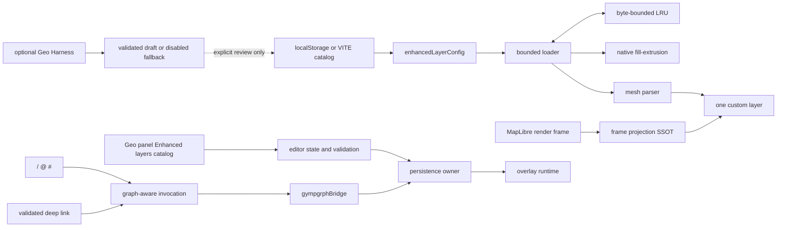

# Geospatial Mode Enhancement Design

## Status and authority

- Status: `runtime-ready-dev` on protected main
  `6b381860cb2abd26cc2e37b84fd1bbc9cfa93896`.
- Runtime authority:
  `/Users/huijoohwee/Documents/GitHub/knowgrph/docs/documents/knowgrph-geospatial-mode-document.md`.
- Requirements authority: `requirements.md` in this directory.
- This directory records design and verification. It does not authorize a
  production or Cloudflare deployment.
- The implementation is source-authored. GeoLibre, deck.gl, Tauri, and
  DuckDB-Wasm are inspiration-only references; no code, prose, schema, or
  examples are copied from them.

This index owns architecture and responsibility boundaries. Details are split
by responsibility:

- `design-runtime-components.md`: interfaces, state, loading, rendering, and
  invocation flow.
- `design-correctness-properties.md`: the 44 numbered properties.
- `design-verification-adrs.md`: executable proof, budgets, ADRs, and
  requirements traceability.
- `tasks.md`: gated implementation, candidate proof, integration, and exact-main
  proof ledger.

Every document in this specification stays below 600 lines.

## Goals

The enhancement adds two optional MapLibre-native rendering paths without
changing zero-configuration behavior:

1. polygon extrusion through `fill-extrusion`;
2. source-authored 3D meshes through one MapLibre custom layer.

It also makes enhanced layers reachable from the structured Floating Panel Geo
catalog, the clean-profile environment catalog, chat invocation tokens, MCP
deep links, and the optional bounded authoring harness.

The design remains browser-first, local-first, zero-infrastructure, and
dataset-neutral. Compiled source contains no dataset or asset URL.

## Non-goals

- A second map or GPU engine.
- A spatial database, routing service, desktop shell, or paid infrastructure.
- Runtime model-format loading.
- Automatic application of model output or fallback drafts.
- Production deployment or physical-device proof.

## Owner map

| Responsibility | Single owner |
| --- | --- |
| Shared command, event, bounds, and config types | `grph-shared/src/geospatial/` |
| Config normalization and fetch bounds | `gympgrph/src/enhancedLayerConfig.ts` |
| Clean-profile config source precedence | `gympgrph/src/enhancedLayerConfigSource.ts` |
| Persistence and visibility mutation | `gympgrph/src/enhancedLayerPersistence.ts` |
| Editor draft and field validation | `canvas/src/features/geospatial/enhancedLayerEditorModel.ts` |
| Catalog source/actions and same-tab refresh | `canvas/src/features/geospatial/useEnhancedLayerCatalog.ts` |
| Enhanced form and catalog UI | `canvas/src/features/geospatial/EnhancedLayerEditorForm.tsx`, `canvas/src/features/geospatial/EnhancedLayerCatalogPanel.tsx` |
| Host-to-package mutation bridge | `canvas/src/features/geospatial/gympgrphBridge.ts` |
| Geo panel section composition | `gympgrph/src/GeospatialPanelHost.tsx`, `gympgrph/src/GeospatialPanelDatasetControls.tsx` |
| Geo display controls and shared panel UI | `gympgrph/src/GeospatialPanelDisplayControls.tsx`, `gympgrph/src/geospatialPanelUi.tsx` |
| Bounded byte cache | `gympgrph/src/enhancedResourceCache.ts` |
| Bounded streaming and deadline | `gympgrph/src/enhancedLayerLoad.ts` |
| Extrusion height and paint | `gympgrph/src/extrusionHeight.ts`, `maplibreLayers.ts` |
| Per-frame asset projection | `gympgrph/src/asset3dProjection.ts` |
| Custom-layer GL lifecycle | `gympgrph/src/asset3dCustomLayer.ts` |
| Enhanced-layer orchestration | `gympgrph/src/useEnhancedGeospatialLayers.ts` |
| Fit precedence | `gympgrph/src/geospatialFitRuntime.ts` |
| Command parsing and validation | `canvas/src/features/geospatial/geoInvocationDispatcher.ts` |
| Graph-aware invocation execution | `canvas/src/features/geospatial/geoInvocationRuntime.ts` |
| All host-to-gympgrph writes | `canvas/src/features/geospatial/gympgrphBridge.ts` |
| MCP query claim/consumption | `canvas/src/features/geospatial/geoCommandDeepLink.ts` |
| Optional model harness | `canvas/src/features/geospatial/geoAuthoringHarness.ts` |
| Deterministic disabled fallback | `canvas/src/features/geospatial/geoAuthoringFallback.ts` |
| Readiness orchestration | `package.json` and `scripts/check-geospatial-mode-readiness.mjs` |
| Property evidence SSOT | `scripts/geospatial-readiness-properties.json` |

No owner delegates its mutation responsibility to a downstream alias or
compatibility shim.

## Runtime topology



## Additive guarantee

With no valid enhanced entries, normalization returns empty extrusion and asset
collections. The enhanced hook allocates no custom layer, creates no enhanced
MapLibre sources, and does not change the existing view selection, camera,
interaction mode, SVG fallback, or graph rendering gate.

The existing mode remains off until a user action, a geo import, or an explicit
`mode.set` invocation enables it. A failed on-demand module load restores the
previous enabled preference and does not write the view-mode key.

## Configuration precedence

Enhanced declarations use one deterministic precedence rule:

1. if `kg:ui:geospatial:enhancedLayers` exists, parse that value;
2. otherwise parse `VITE_GEOSPATIAL_DATASETS_JSON`;
3. otherwise use an empty catalog.

An invalid environment value fails closed and produces a diagnostic naming the
environment key. A present local value always wins, including an explicit empty
array. Visibility overrides remain under
`kg:ui:geospatial:enhancedLayerVisibility`.

## Operator editor boundary

The Geo panel always exposes a structured **Enhanced layers** catalog for the
effective environment, local, or empty source. The source badge presents the
resolved source; it does not duplicate source resolution.

`enhancedLayerEditorModel.ts` owns draft conversion, field validation, and
stable-ID collision checks. `useEnhancedLayerCatalog.ts` owns typed
Add/Edit/Remove/Toggle/Reset actions and source refresh.
`EnhancedLayerCatalogPanel.tsx` and `EnhancedLayerEditorForm.tsx` render those
contracts and never write browser storage directly. `GeospatialPanelHost.tsx`
and its display/dataset section components compose the injected catalog so every
runtime owner remains below 600 lines.

Valid Add/Edit/Remove actions atomically persist the full local catalog.
Per-layer Toggle writes only the visibility override and publishes the shared
change event. Reset removes both local keys and re-resolves environment then
empty precedence; it never saves an empty local array. Invalid drafts preserve
storage, events, and the mounted runtime unchanged.

Successful writes synchronously invalidate the enhanced-layer runtime in the
same tab. Reload is used only to prove persistence, not to activate a change.
Controls are labelled, keyboard-operable, and responsive at mobile floating
panel widths.

## Layer ordering

Enhanced sources and layers are additive:

1. basemap/style layers;
2. existing graph and dataset layers;
3. configured extrusion layers;
4. the single configured asset custom layer;
5. existing selection, popup, legend, debug, and host UI surfaces.

Each enhanced layer has a stable configuration-owned ID. No dataset-specific ID
or URL is compiled into the runtime.

## Projection contract

Every asset draw computes:

```text
frame.defaultProjectionData.mainMatrix
  * map.transform.getMatrixForModel([lng, lat], altitudeMeters)
  * zUpLocalScaleAndRotation
```

This is the only asset projection path. It is recomputed for every render frame
and therefore follows pan, zoom, pitch, bearing, globe rendering, and
globe-to-Mercator transition state. Valid coordinates include latitude
`[-90, 90]` and longitude `[-180, 180]`. Non-finite matrices fail closed for
that asset and frame.

The custom layer shares MapLibre's WebGL context. It captures and restores the
host program, buffers, vertex-array binding, and relevant vertex attribute
state. It releases owned buffers, programs, and vertex arrays on teardown and
recreates them after context restoration.

## Bounded loading contract

Every request requires positive `timeoutMs` and `maxBytes`. The effective
deadline is:

```text
min(configured timeoutMs, 10_000 ms)
```

Content-Length is rejected before streaming when oversized. Streaming stops as
soon as received bytes exceed the bound, and partial payloads are discarded.
The cache owns at most 32 entries and 32 MiB, evicts least-recently-used data,
returns copies, and rechecks the caller's current `maxBytes` on every hit.

Failures are isolated per layer. Loaded sources and meshes remain active.
Messages are bounded and include the literal `network-unavailable` reason when
that classification applies.

## Invocation boundary

`/geo` and `/geospatial` are always local command candidates. `#tag` is claimed
only with an explicit `show` or `hide`. `@node-id` is claimed only when that
graph node exists, allowing unrelated chat mentions and document invocations to
continue through their existing paths.

Parsing produces a `GeoCommand`; execution resolves current graph bounds and
enhanced config; all mutation crosses `gympgrphBridge`. Rejections are
actionable, bounded, and perform no write. MCP envelopes are validated and
claimed once in React development StrictMode.

## Optional authoring boundary

The harness is off by default. It validates input before model access, clamps
iterations to 1-50 and model timeouts to 1-300 seconds, validates canonical cost
logs and drafts, and never applies partial output.

When no adapter exists, a request times out, or transport fails, the harness
returns:

- a typed `model-unavailable` error;
- a deterministic, disabled, schema-shaped draft;
- no call to the configuration apply function.

The fallback is a review artifact, not an automatic write.
