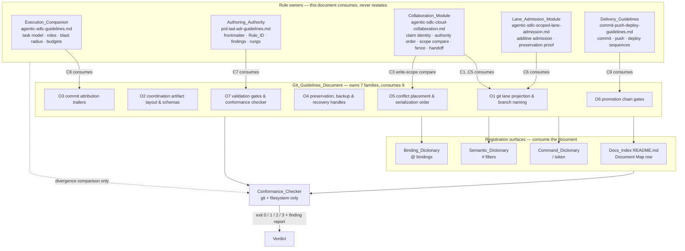
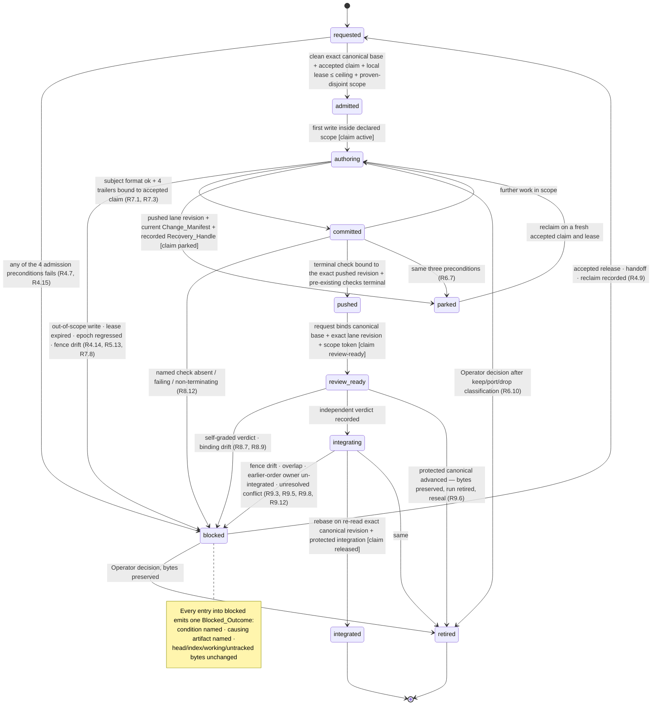
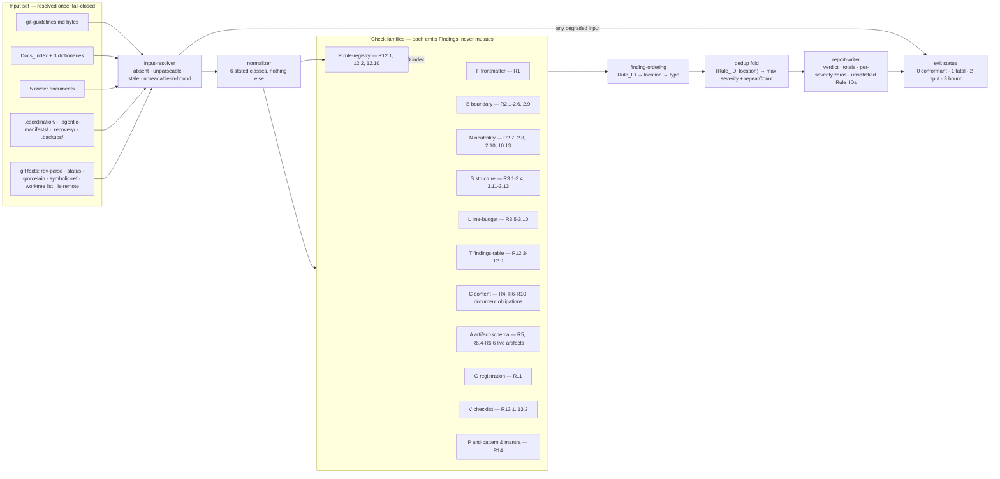

# Design Document

## Overview

This feature delivers three coupled artifacts, not one:

| # | Artifact | Location | Judged by |
|---|---|---|---|
| A | **Git_Guidelines_Document** | `huijoohwee.github.io/docs/documents/git-guidelines.md` | Conformance_Checker check families F, B, N, S, L, R, T, C, A, V, P |
| B | **Registrations** | `agentic-canvas-os/docs/README.md`, `DICTIONARY-COMMAND.md`, `DICTIONARY-SEMANTIC.md`, `DICTIONARY-BINDING.md` | Conformance_Checker check family G |
| C | **Conformance_Checker** | `huijoohwee.github.io/scripts/check-git-guidelines.mjs` + `scripts/lib/git-guidelines/*.mjs` | its own property, fixture, and drift test suites |

Artifact A is a **projection**. It owns no collaboration semantics. It states the git operations that satisfy rules owned elsewhere, and it is the only one of the three that is length-constrained, stage-loadable, and neutrality-constrained. Artifact C is what makes A a contract rather than an essay: every obligation in A is decidable by C from git objects and filesystem bytes, with zero model calls and no network traffic to any host other than a configured git remote.

### Design Goals

| Goal | Traced to | Design response |
|---|---|---|
| G1 — Machine-readable identity | R1.1–R1.15 | 17-line frontmatter with baseline + conformance + optional key partition; check family F with a bounded strict-subset YAML reader |
| G2 — Project, never compete | R2.1–R2.10 | 16-row boundary table: 9 `consumes` rows, 7 `owns` rows; check families B and N compare document text against owner text |
| G3 — Stage-loadable under a token budget | R3.1–R3.13 | 16 `##` sections, 392 allocated lines of a 400 cap, 10-stage load budget table, worst stage 127 lines of a 150 cap |
| G4 — Concurrency safety with zero infrastructure | R4, R5 | Git refs + `.coordination/` JSON only; four lane classes derived from four observable state fields; eight-field identity projection table |
| G5 — No lane is ever the only copy | R6 | `.backups/` bundles, `.recovery/` captures with last-written completion marker, two-variant Recovery_Handle |
| G6 — Auditable agentic history | R7, R8 | Four-trailer attribution bound to the accepted claim; verdict independence by (agent mechanism, Session ID) disjointness |
| G7 — Conflict as procedure, not improvisation | R9 | One overlap relation reused by admission, commit scope, and publication; a total serialization comparator |
| G8 — No green check ever deploys | R10 | Closed-by-default boundaries; six-identity candidate; single-use authorization |
| G9 — Regression is detectable, not merely describable | R12, R13 | Derived Rule_IDs, bidirectional findings coverage, deterministic ordering and dedup, fail-closed verdict |
| G10 — Recognizing a mistake costs one line | R14 | 8 two-line anti-pattern pairs at 19 lines; 7-clause mantra at 10 lines |
| G11 — Zero-infra, FOSS, offline-first, low TCO | R5.8, R13.7 | Node 22 + `node:test` + `git` — all already present; checker has zero runtime dependencies |

### Resolved Operator Decisions

The concurrency model and lease ceiling carried from requirements refinement were checked against protected upstream and resolved by the Operator on 2026-08-05.

| Decision | Requirement | Protected-upstream check | Resolution |
|---|---|---|---|
| Concurrent current authorities | R4.1, R4.9 | `agentic-canvas-os/docs/FACTS.md`, `CLOUD-COLLABORATION.md`, and `WORKSPACE-PARALLELISM.md` state that there is no global cardinality limit: any number of authenticated current authorities may coexist only when their normalized write sets are pairwise disjoint; overlap retains exactly one current writer and a non-writing waiting successor. | **Resolved: inherit protected upstream.** O1 owns no numeric cap and may not introduce one. |
| Lease expiry ceiling | R4.7, R5.3 | Protected collaboration requires finite expiry derived from authoritative time, and the executable writer-lease owner rejects a TTL above 24 hours. | **Resolved: 24 hours.** Record this as the document-local O2 ceiling without changing claim identity or authority order. |

The concurrency rule is consumed from protected upstream. Only the 24-hour lease ceiling is a document-local numeric bound enforced by the Conformance_Checker.

### One Correction Carried Into the Design

R5.4 enumerates claim state as `accepted | blocked | expired | released`. The Collaboration_Module's owned accepted-state vocabulary is `active | review-ready | parked | released | expired | revoked`, and the real artifact at `.coordination/dev-source-resolver-cloud-claim.json` records `"state":"active"`. Adopting R5.4's four names as *the claim's* state would be a `consumes`-row divergence under R2.6 — the document would be redefining a value domain its owner owns.

Design resolution: the artifact's `claim.state` field carries the **owner's** six-value vocabulary verbatim. R5.4's four names become a **derived** `admissionDecision`, computed by the document's own rules and never stored as the claim's state:

```
admissionDecision = accepted  when state = active ∧ now < expiresAt ∧ fenceRevision = currentAcceptedFence
                  = expired   when state = expired ∨ now ≥ expiresAt
                  = released  when state ∈ { released, revoked }
                  = blocked   otherwise (parked, review-ready, fence drift, unparseable, absent)
```

This keeps R5.4's enumeration observable while leaving claim identity owned upstream. Recorded here because it changes what the document may say, not only how the checker reads it.

## Architecture

### Ownership and Projection Boundary



The dotted edge matters: the checker reads the five owner documents **only** to detect divergence (R2.6, R12.3, R12.7). It never derives an obligation from them, so an owner-side edit cannot silently create a new obligation on the document.

### Task_Lane State Machine

Work states below are **git-observable projections**. The claim states in brackets are the Collaboration_Module's owned vocabulary and are recorded, not redefined.



`blocked` and `retired` are the two states the requirements insist on and that a naive design omits. `blocked` is recoverable and byte-preserving by construction; `retired` is terminal and byte-preserving by obligation (R9.6 preserves, R6.10 classifies before removal).

### Conformance_Checker Components and Data Flow



`rule-registry` runs before every other family because every finding needs a Rule_ID and the Rule_ID is *derived*, not authored (R12.1). Families are pure functions from normalized input to a finding array — that purity is what makes idempotence (R13.4) a property of composition rather than a property each family has to promise separately.

#### Language and Runtime Decision

Checked what the surrounding repositories already depend on before choosing.

| Candidate | Already present? | Zero-infra | FOSS | TCO | Verdict |
|---|---|---|---|---|---|
| **Node 22 ESM + `node:test`** | Yes — `huijoohwee.github.io/scripts/check-agentic-sdlc-guideline.mjs` is already a zero-dependency Node ESM guideline checker invoked by `npm test`; `knowgrph` and `agentic-canvas-os` run `node --test` across dozens of scripts | Yes | Yes | Zero new runtime | **Chosen** |
| Python 3 | Present (3.9.6) and used for a few smoke ledgers, but the guideline-checking lane in the delivery repository is entirely Node; adding a second lane doubles the maintenance surface for one script | Yes | Yes | Zero new runtime, non-zero cognitive cost | Rejected — split lane |
| Shell + `git` + `awk` | Present | Yes | Yes | Zero | Rejected — the ordering, dedup, digest, and set-equality logic is not honestly expressible, and R1.11 requires accumulating findings rather than exiting at the first defect |
| Any new runtime (Go, Rust, Deno) | No | Yes | Yes | New toolchain to install and pin | Rejected — violates the prefer-what-exists constraint |

**Runtime dependencies: zero.** The checker imports only `node:fs`, `node:path`, `node:url`, `node:crypto`, and `node:child_process` (for `git`). This satisfies R13.7 literally — no dependency beyond git and the local filesystem.

This forces one non-obvious decision. R1.10 and R1.14 need a *strict* YAML parser including duplicate-key rejection, and `js-yaml@^4.1.1` is available in sibling repositories. Adding it would put a runtime dependency on a script that R13.7 says must have none. Resolution: the checker ships `fm-reader.mjs`, a **bounded strict-subset reader** whose accepted grammar is exactly the frontmatter contract — block mappings of scalars, single-level nested mappings, block and flow sequences of scalars, plain and quoted scalars — and which rejects anything outside that grammar with a typed parse finding rather than guessing. Rejecting out-of-subset input is fail-closed, so the narrow grammar cannot produce a false pass. `js-yaml` is then used only as a **dev-time model oracle**: the property suite parses generated frontmatter with both readers and asserts agreement, which is model-based testing rather than a runtime dependency.

**Dev dependencies** (test lane only, outside the R13.7 runtime constraint): `fast-check@3.23.2` and `js-yaml@4.1.1`, both already pinned at those versions elsewhere in the workspace.

#### Exit Status Contract

The inherited severity set is `blocker | major | minor` (the Authoring_Authority's Readiness Gap Matrix uses `blocker/major/minor/none`). "Advisory" in the requirements is the Authoring_Authority's *rule class*, not a severity, so the design maps it explicitly:

| Exit | Meaning | Condition |
|---|---|---|
| `0` | Conformant | Zero `blocker` and zero `major` findings, **and** the Docs_Index row and `/` token are present (R13.3). `minor` findings may be present and are the advisory set (R1.12, R11.10, R12.13). |
| `1` | Not conformant | At least one `blocker` or `major` finding. |
| `2` | Input failure | Any required input absent, unparseable against its declared schema, stale by fence or base revision, or unreadable within its bound (R13.8). |
| `3` | Bound exceeded | Verdict not reached within 60 s (R13.11), or a configured remote unreachable within 30 s (R13.10). |

Exits `2` and `3` never carry a passing verdict — the verdict field is set to `not-conformant` before any family runs and is only lowered to `conformant` by the report-writer after every family has completed. **Fail-closed is the default state, not a branch.**

## Components and Interfaces

### Document Sections as Components

Sixteen `##` sections. Each is a component with one interface: its heading anchor. Each is self-contained per R3.2 — a rule inside it is applicable by a reader holding only that section, the Module Index, the boundary section, and the Glossary.

| # | Section | Anchor | Owned rule families | Stages that load it | Lines |
|---|---|---|---|---|---|
| 1 | Boundary & Ownership | `boundary--ownership` | — (declares all 16) | all (always loaded) | 21 |
| 2 | Module Index | `module-index` | — | all (always loaded) | 18 |
| 3 | Glossary | `glossary` | — (defines `Blocked_Outcome`) | all (always loaded) | 14 |
| 4 | Load Budget | `load-budget` | — | session start | 15 |
| 5 | Lane Topology & Admission | `lane-topology--admission` | O1 | lane admission | 38 |
| 6 | Coordination Artifacts | `coordination-artifacts` | O2 | lane admission, authoring, push, integration, cleanup | 36 |
| 7 | Authoring & Write Scope | `authoring--write-scope` | O1, O2 | authoring, commit | 20 |
| 8 | Preservation, Recovery & Cleanup | `preservation-recovery--cleanup` | O4 | authoring, recovery, cleanup | 30 |
| 9 | Commit & Attribution | `commit--attribution` | O3 | commit | 24 |
| 10 | Verification Gates | `verification-gates` | O7 | push, review | 24 |
| 11 | Conflict & Integration Order | `conflict--integration-order` | O5 | review, integration | 24 |
| 12 | Promotion Chain | `promotion-chain` | O6 | promotion | 28 |
| 13 | Findings & Rule Identity | `findings--rule-identity` | O7 | integration, promotion, recovery | 28 |
| 14 | Validation Checklist | `validation-checklist` | O7 | commit, push, promotion | 22 |
| 15 | Anti-Patterns | `anti-patterns` | — (references all) | review | 19 |
| 16 | Mantra | `mantra` | — (one clause per owned family) | review | 10 |

The Module Index lists 15 entries — every section except itself (R3.1).

The boundary table carries exactly 16 rows: 9 `consumes` + 7 `owns` (R2.2). The five Collaboration_Module rows are mandated separately by R2.5 and are never merged.

| Row | Rule family | Disposition | Owner |
|---|---|---|---|
| C1 | claim identity | `consumes` | Collaboration_Module |
| C2 | authority order | `consumes` | Collaboration_Module |
| C3 | write-scope comparison | `consumes` | Collaboration_Module |
| C4 | fence meaning | `consumes` | Collaboration_Module |
| C5 | handoff semantics | `consumes` | Collaboration_Module |
| C6 | additive lane admission & preservation proof | `consumes` | Lane_Admission_Module |
| C7 | frontmatter contract, Rule_ID derivation, finding recording, readiness rungs | `consumes` | Authoring_Authority |
| C8 | task model, roles & independence, blast radius, per-task budgets | `consumes` | Execution_Companion |
| C9 | commit, push & deploy command sequences | `consumes` | Delivery_Guidelines |
| O1 | git lane projection & branch naming | `owns` | — |
| O2 | coordination artifact layout & schemas | `owns` | — |
| O3 | commit attribution trailers | `owns` | — |
| O4 | preservation, backup & recovery handles | `owns` | — |
| O5 | conflict placement & serialization order | `owns` | — |
| O6 | promotion chain gates | `owns` | — |
| O7 | validation gates & conformance checker | `owns` | — |

All five owners appear as the owner of at least one `consumes` row, each carrying a resolvable relative link, which is how R2.1 is satisfied without a second owner list consuming boundary-section lines. Seven `owns` rows fixes the mantra clause count at 7 (R14.3).

### Load Budget Table (the document's own, ten stages)

Each stage maps to 1–4 sections (R3.3). Every one of the 16 sections is named by at least one stage row (R3.12).

| Stage | Sections named in the row |
|---|---|
| session start | `module-index`, `boundary--ownership`, `glossary`, `load-budget` |
| lane admission | `lane-topology--admission`, `coordination-artifacts` |
| authoring | `authoring--write-scope`, `coordination-artifacts`, `preservation-recovery--cleanup` |
| commit | `commit--attribution`, `authoring--write-scope`, `validation-checklist` |
| push | `verification-gates`, `coordination-artifacts`, `validation-checklist` |
| review | `verification-gates`, `conflict--integration-order`, `anti-patterns`, `mantra` |
| integration | `conflict--integration-order`, `coordination-artifacts`, `findings--rule-identity` |
| promotion | `promotion-chain`, `validation-checklist`, `findings--rule-identity` |
| recovery | `preservation-recovery--cleanup`, `findings--rule-identity` |
| cleanup | `preservation-recovery--cleanup`, `coordination-artifacts` |

### Line Budget Allocation and Proof

This is the design's load-bearing arithmetic. If it does not close, the document cannot be written to spec.

#### Non-section allocation

| Block | Lines | Composition |
|---|---|---|
| Frontmatter | 17 | 2 delimiters + 5 baseline keys + 5 conformance keys + 5 optional keys (`companion_of`, `invocation_token`, `semantic_filters`, `bindings`, `frontmatter_contract`) |
| Title block | 4 | `# Git Guidelines` + blank + one purpose line + blank |
| **Subtotal** | **21** | |

#### Section allocation

Counted per R3.6's rule: from the `##` heading line through the line preceding the next `##` heading, so each figure includes its own trailing blank line.

| Section | Lines | Internal composition |
|---|---|---|
| `boundary--ownership` | 21 | heading 1 + blank 1 + 2 table header + 16 rows + trailing blank 1 |
| `module-index` | 18 | heading 1 + blank 1 + 15 entries + trailing blank 1 |
| `glossary` | 14 | heading 1 + blank 1 + 2 table header + 9 terms + trailing blank 1 |
| `load-budget` | 15 | heading 1 + blank 1 + 2 table header + 10 stage rows + trailing blank 1 |
| `lane-topology--admission` | 38 | heading 1 + blank 1 + identity projection table 10 + lane class table 6 + 17 directive bullets + trailing blank 1 + 2 spacing |
| `coordination-artifacts` | 36 | heading 1 + blank 1 + artifact/field table 16 + 15 directive bullets + trailing blank 1 + 2 spacing |
| `authoring--write-scope` | 20 | heading 1 + blank 1 + 16 directive bullets + trailing blank 1 + 1 spacing |
| `preservation-recovery--cleanup` | 30 | heading 1 + blank 1 + artifact-location table 7 + 19 directive bullets + trailing blank 1 + 1 spacing |
| `commit--attribution` | 24 | heading 1 + blank 1 + commit-type table 8 + trailer table 6 + 6 directive bullets + trailing blank 1 + 1 spacing |
| `verification-gates` | 24 | heading 1 + blank 1 + recorded-result field table 7 + 13 directive bullets + trailing blank 1 + 1 spacing |
| `conflict--integration-order` | 24 | heading 1 + blank 1 + dependency-order table 7 + 13 directive bullets + trailing blank 1 + 1 spacing |
| `promotion-chain` | 28 | heading 1 + blank 1 + chain/boundary table 5 + rollback table 5 + 8 directive bullets + reference-implementation block 6 + trailing blank 1 + 1 spacing |
| `findings--rule-identity` | 28 | heading 1 + blank 1 + findings table 13 + 11 directive bullets + trailing blank 1 + 1 spacing |
| `validation-checklist` | 22 | heading 1 + blank 1 + 5 gate sub-blocks 12 + reference-implementation block 6 + trailing blank 1 + 1 spacing |
| `anti-patterns` | 19 | heading 1 + blank 1 + 8 pairs × 2 bullets = 16 + trailing blank 1 + 1 spacing |
| `mantra` | 10 | heading 1 + blank 1 + 7 clauses + trailing blank 1 |
| **Section subtotal** | **371** | |

#### Cap 1 — total length ≤ 400 physical lines (R3.5)

```
non-section  21
sections    371
            ---
allocated   392
reserve       8
            ---
cap         400   ✅ closes with 8 lines of headroom
```

The 8-line reserve is deliberate, not slack: an added rule consumes reserve rather than triggering the R3.9 overrun path. Because allocation closes at 392, the frontmatter carries **no** overrun justification key, and R3.9/R3.10 sit dormant. If reserve is ever exhausted, R3.9 permits up to 440 with a recorded justification — the checker enforces both thresholds regardless.

#### Cap 2 — Module Index + boundary ≤ 40 physical lines combined (R3.6)

```
module-index         18
boundary--ownership  21
                     --
                     39   ✅ 1 line under the 40 cap
```

This is the tightest cap in the document and it drives two structural choices: the Glossary is a **separate** `##` section rather than a boundary subsection, and the five owners are named inside the boundary table's owner column rather than in a preceding list.

#### Cap 3 — per-stage load ≤ 150 physical lines (R3.7)

R3.7 counts the sections required for a stage **including** the Module Index and the boundary section. Floor for every stage = 18 + 21 = **39**.

| Stage | Floor | Row-named sections | Per-stage sum | Headroom to 150 |
|---|---|---|---|---|
| session start | 39 | glossary 14 + load-budget 15 (index & boundary already in floor) | **68** | 82 |
| lane admission | 39 | 38 + 36 | **113** | 37 |
| authoring | 39 | 20 + 36 + 30 | **125** | 25 |
| commit | 39 | 24 + 20 + 22 | **105** | 45 |
| push | 39 | 24 + 36 + 22 | **121** | 29 |
| review | 39 | 24 + 24 + 19 + 10 | **116** | 34 |
| integration | 39 | 24 + 36 + 28 | **127** | 23 |
| promotion | 39 | 28 + 22 + 28 | **117** | 33 |
| recovery | 39 | 30 + 28 | **97** | 53 |
| cleanup | 39 | 30 + 36 | **105** | 45 |

Worst stage = **integration at 127 lines**, 23 under the cap. ✅

**Conservative variant.** R3.7 does not name the Glossary, but R3.2 lets a reader load it, so a reader who always pulls it pays 14 more on the nine stages whose row does not name it:

| Stage | Sum + Glossary |
|---|---|
| session start | 68 (already counted) |
| lane admission | 127 |
| authoring | 139 |
| commit | 119 |
| push | 135 |
| review | 130 |
| integration | **141** |
| promotion | 131 |
| recovery | 111 |
| cleanup | 119 |

Worst case under the conservative reading = **141**, still 9 under the cap. ✅ Both readings close, so the allocation is robust to the interpretation.

#### Cap 4 — section-local caps

| Cap | Requirement | Allocation | Status |
|---|---|---|---|
| Anti-pattern section ≤ 50 lines | R14.1 | 19 | ✅ |
| Anti-pattern pairs between 7 and 20 | R14.1 | 8 | ✅ |
| Each pair exactly 2 lines, each ≤ 120 chars | R14.4 | 8 × 2 bullets, no blank separators, no nesting | ✅ |
| Mantra section ≤ 25 lines | R14.3 | 10 | ✅ |
| Mantra clause count = owned family count | R14.3 | 7 = 7 | ✅ |
| Module Index entry ≤ 120 chars, one physical line | R3.1 | 15 single-line entries | ✅ |
| Every rule one line ≤ 200 chars | R3.4 | all rules are bullets or table rows | ✅ |

### Checker Modules as Components

Each module is a pure function `(NormalizedInput, RuleIndex) → Finding[]`. No module writes to any input (R1.12, R11.9, R11.11, R11.12, R11.13, R2.6 all require inputs to be left unmodified), which is enforced structurally: the input set is read once into frozen objects and no module receives a filesystem write capability.

| Module | Family | Rule_ID families judged | Reads | Emits | Fatal / advisory |
|---|---|---|---|---|---|
| `input-resolver.mjs` | — | R13.8, R13.10, R13.11 | all inputs, `git ls-remote` | `input-absent`, `input-unparseable`, `input-stale`, `input-unreadable`, `remote-unreachable` | fatal (exit 2 / 3) |
| `normalizer.mjs` | — | R13.5 | resolved bytes | — | — |
| `fm-reader.mjs` | F | R1.10, R1.14 | frontmatter block | `frontmatter-unparseable` (incl. duplicate key) | fatal |
| `frontmatter.mjs` | F | R1.1–R1.9, R1.11–R1.13, R1.15, R11.6 | frontmatter mapping, dictionaries | key-domain findings, `unknown-frontmatter-key` | baseline/conformance fatal; optional/unknown `minor` |
| `boundary.mjs` | B | R2.1, R2.2, R2.5, R2.9 | boundary section, filesystem for link resolution | `boundary-row-invalid`, `boundary-family-missing`, `boundary-owner-unknown` | fatal |
| `divergence.mjs` | B | R2.4, R2.6, R12.3, R12.7 | document + 5 owner documents | `owner-divergence`, `terminology-drift`, `finding-type-redefinition` | fatal |
| `neutrality.mjs` | N | R2.7, R2.8, R2.10, R10.13 | full document, block index | `vendor-coupling` | fatal |
| `structure.mjs` | S | R3.1–R3.4, R3.11–R3.13 | headings, index, stage table, rule lines | `section-unindexed`, `anchor-unresolved`, `stage-unmapped`, `section-unreferenced`, `cross-section-reference`, `rule-line-shape` | fatal |
| `line-budget.mjs` | L | R3.5–R3.10 | physical lines, section spans, stage table | `line-budget-exceeded`, `stage-budget-exceeded`, `index-boundary-budget-exceeded` | fatal |
| `rule-registry.mjs` | R | R12.1, R12.2, R12.10 | headings + bullets + table rows in document order | `rule-id-duplicate`, `rule-ordinal-mismatch`, `rule-unclassified`, `rule-multiclassified` | fatal |
| `findings-table.mjs` | T | R12.4–R12.6, R12.8, R12.9 | findings table + rule index | `finding-type-orphan`, `finding-type-unlisted`, `finding-row-invalid`, `document-local-marker-missing` | fatal |
| `content.mjs` | C | R4, R6–R10 document obligations | section bodies | `unimplemented-guideline` per unmet artifact-bearing rule | fatal |
| `artifact-schema.mjs` | A | R5, R6.4–R6.6 | `.coordination/`, `.agentic-manifests/`, `.recovery/`, `.backups/` | `artifact-schema-invalid`, `artifact-name-mismatch`, `capture-incomplete`, `manifest-order-invalid` | fatal |
| `registration.mjs` | G | R11.1–R11.5, R11.7–R11.13 | Docs_Index, 3 dictionaries | `registration-missing`, `registration-dangling`, `catalog-digest-mismatch`, `catalog-count-mismatch`, `token-divergence` | row & token fatal; filter & binding `minor` |
| `checklist.mjs` | V | R13.1, R13.2 | checklist section + rule index | `gate-partition-invalid`, `rule-uncovered-by-gate`, `checker-invocation-unstated` | fatal |
| `antipattern.mjs` | P | R14.1–R14.7 | anti-pattern + mantra sections, boundary table, findings table | `antipattern-missing`, `antipattern-shape-invalid`, `mantra-clause-unmapped`, `mantra-family-uncovered` | fatal |
| `report.mjs` | — | R13.3, R13.6, R13.9 | Finding[] | the report | determines exit |

#### Normalization Pipeline (exhaustive, R13.5)

Applied in this order, and nothing else is applied:

1. Line endings: `\r\n` and lone `\r` → `\n`.
2. Trailing whitespace: stripped per line.
3. Absolute path prefixes: the repository root prefix → the empty string, yielding repository-relative paths.
4. Timestamps: any ISO-8601 instant → the fixed token `<TS>`.
5. Run identifiers: any value in a field named `runId`, `operationId`, `sessionId`, or `idempotencyKey` → the fixed token `<RUN>`.
6. Ordering-insensitive metadata: frontmatter mapping keys and any sequence declared unordered by its schema → sorted ascending by byte order.

Explicitly **not** applied: interior whitespace collapsing, case folding, Unicode normalization, comment stripping, quote-style unification, number reformatting, path-separator translation. R13.5's "no other normalization" half is testable precisely because the exclusion list is explicit: a difference outside classes 1–6 must change the report.

#### Finding Ordering and Deduplication (R13.6)

```
sortKey(f) = [ anchor(f.ruleId) asc (byte order),
               ordinal(f.ruleId) asc (numeric),
               f.location.line asc, f.location.column asc,
               f.type asc (byte order) ]

dedupKey(f) = (f.ruleId, f.location)
fold        = { ...first, severity: max(group.severity), repeatCount: group.length }
```

The Rule_ID comparator splits anchor and ordinal because a lexicographic comparison of the whole ID sorts `#10` before `#2`. Severity order for the `max` fold is `minor < major < blocker`. Dedup runs **after** sorting, so the surviving entry of each group is deterministic (the first in sort order), which is what makes the ordered finding sequence in R13.4 reproducible rather than merely equal as a set.

### JSON Artifact Schemas

Grounded on the real artifacts. Field names and casing match the files already on disk; where a real file omits a field the design requires, that is called out rather than papered over.

#### 1. Declared write scope — `agentic-declared-write-scope/v1`

Real reference: `.coordination/dev-source-resolver-write-scope.json`.

| Field | Type | Constraint |
|---|---|---|
| `schema` | string | exactly `agentic-declared-write-scope/v1` |
| `semanticScope` | string | 3–64 chars, `[a-z0-9-]+` |
| `paths` | string[] | 1–4096 entries, each ≤ 512 chars, repository-relative, **ascending byte order, no duplicates** |

File name: `<semanticScope>-write-scope.json`. File: UTF-8, ≤ 64 KB.

> **Divergence from the real artifact:** the on-disk file lists `scripts/worktree-policy.mjs` before `scripts/__tests__/worktree-policy.test.mjs`, which is **not** ascending byte order (`_` is 0x5F, `w` is 0x77, so `__tests__` sorts first). R5.2 requires sorted order, so the checker will report this existing file. That is the correct outcome: the rule is new, and the artifact needs a one-line reorder.

#### 2. Claim request — `agentic-cloud-collaboration-request/v1`

Real reference: `.coordination/dev-source-resolver-cloud-request.json`.

| Field | Type | Constraint |
|---|---|---|
| `schema` | string | exactly `agentic-cloud-collaboration-request/v1` |
| `targetRepository` | string | non-empty |
| `workItemId` | string | non-empty |
| `canonicalBaseRevision` | string | 40-hex |
| `laneRevision` | string | 40-hex |
| `declaredWriteScope` | string[] | non-empty; `path:` and `semantic:` prefixed entries |
| `leaseEpoch` | integer | ≥ 0, strictly increasing per `semanticScope` |
| `expiresAt` | string | absolute UTC instant, ≤ 24 hours after issuance (resolved document-local O2 ceiling) |
| `deviceId`, `sessionId`, `actorId` | string | non-empty |
| `actorLogin` | string | optional |

File name: `<semanticScope>-request.json`.

> **Divergence from the real artifact:** the on-disk request omits `schema`. R5.13 makes an artifact that "fails to parse as JSON against its declared schema" a blocking condition, which is undecidable without a declared schema. The design therefore requires the key and the checker reports its absence. Adding a `schema` key is a file-layout rule under owned family O2 and does not touch claim identity, so it raises no R2.6 divergence.

#### 3. Accepted claim result — `agentic-cloud-collaboration-result/v1`

Real reference: `.coordination/dev-source-resolver-cloud-claim.json` (single-line JSON).

| Field | Type | Constraint |
|---|---|---|
| `schema` | string | exactly `agentic-cloud-collaboration-result/v1` |
| `ok` | boolean | — |
| `action` | string | `claim` \| `renew` \| `park` \| `review-ready` \| `handoff` \| `release` |
| `status`, `claim.state` | string | Collaboration_Module vocabulary: `active` \| `review-ready` \| `parked` \| `released` \| `expired` \| `revoked` |
| `ledgerRevision` | string | 40-hex, accepted remote ledger head |
| `claim.claimId` | string | 64-hex |
| `claim.actorId`, `claim.repositoryId`, `claim.workItemId` | string | non-empty |
| `claim.canonicalBaseRevision`, `claim.laneRevision` | string | 40-hex |
| `claim.declaredWriteScope` | string[] | **equal to the answered request's** `declaredWriteScope` (R5.4) |
| `claim.writeSetDigest` | string | 64-hex over the canonical encoding of the normalized scope |
| `claim.leaseEpoch` | integer | **equal to the answered request's** `leaseEpoch` (R5.4) |
| `claim.expiresAt` | string | absolute UTC instant |
| `claim.fenceRevision` | string | 64-hex, equals `claimDigest` |
| `claimDigest` | string | 64-hex |
| `receipt.receiptDigest`, `receipt.ledgerDigest`, `receipt.contractReceiptDigest` | string | 64-hex |
| `receipt.evaluationTime` | string | remote evaluation instant |
| *derived* `admissionDecision` | string | `accepted` \| `blocked` \| `expired` \| `released` — computed, never stored (see the correction above) |

File name: `<semanticScope>-claim.json`; receipts use `<semanticScope>-receipt.json` (R5.5 role enumeration `write-scope` \| `request` \| `claim` \| `receipt`).

#### 4. Change manifest — `agentic-change-manifest/v1`

Real reference: `.agentic-manifests/singapore-poi-shared-utils.json`. Matches the design exactly, including sorted `paths`.

| Field | Type | Constraint |
|---|---|---|
| `schema` | string | exactly `agentic-change-manifest/v1` |
| `branch` | string | `agent/<device-id>/<semantic-scope>`, ≤ 200 chars |
| `baseSha` | string | 40-hex |
| `paths` | string[] | **ascending lexicographic by path text** (R6.4); equals exactly the set changed since `baseSha`, including incidental changes (R7.6) |

Location: `.agentic-manifests/<semanticScope>.json`.

#### 5. Recovery capture manifest — `agentic-legacy-dirty-lane-recovery/v1`

Real reference: `.recovery/joohwee-docs-retained-20260801T1144Z/manifest.json`.

Directory layout, with the completion marker written **last** (R6.6):

```
.recovery/<semantic-scope>-<yyyymmdd>T<hhmm>Z/
  manifest.json      ← written 1st
  tracked.patch      ← written 2nd
  files/             ← written 3rd (retained untracked bytes)
  .complete          ← written 4th and last; its presence is the only completeness proof
```

| Field | Type | Constraint |
|---|---|---|
| `schema` | string | exactly `agentic-legacy-dirty-lane-recovery/v1` |
| `captureProfile` | string | non-empty |
| `sourceWorktree` | string | absolute path at capture time |
| `sourceBranch` | string | non-empty |
| `sourceHeadSha`, `protectedTipSha` | string | 40-hex |
| `operatorSessionId` | string | non-empty |
| `capturedAt` | string | UTC instant |
| `stateDigest`, `writeSetDigest`, `trackedPatchDigest`, `packageDigest` | string | 64-hex |
| `tracked` | entry[] | may be empty |
| `untracked` | entry[] | may be empty |
| entry `.path` | string | repository-relative |
| entry `.ownership` | string | `tracked` \| `untracked` |
| entry `.kind` | string | `file` \| `symlink` |
| entry `.mode` | integer | POSIX mode as observed (e.g. `420`) |
| entry `.digest` | string | 64-hex over the file bytes |

The per-entry `digest` and `mode` are what make the restore round trip (R6.11) decidable without re-reading the original tree, and what let R6.14 name **every** differing path rather than the first.

#### 6. Blocked outcome — `agentic-git-blocked-outcome/v1` (design-local, in-memory and reportable)

| Field | Type | Purpose |
|---|---|---|
| `ruleId` | string | the Rule_ID whose condition blocked |
| `blockingCondition` | string | one enumerated condition name |
| `causingArtifact` | string | path or claim identity that caused it |
| `preState` | `{ head, index, working, untracked }` | four digests taken before the attempt |
| `postState` | `{ head, index, working, untracked }` | four digests taken after the refusal |
| `unchanged` | boolean | `preState` equals `postState` field-for-field |
| `resolutionPath` | string | the recorded artifact that would unblock it |

### Registration Model

Five surfaces must stay in lockstep. The frontmatter is the document's own declaration; the four registration artifacts are the routing surfaces; parity between them is what the checker decides.

```
frontmatter.invocation_token  ═══ Command_Dictionary.dictionary_entries[i] ═══ Commands table row 1st cell
frontmatter.semantic_filters  ═══ Semantic_Dictionary entries + source naming the document path
frontmatter.bindings          ═══ Binding_Dictionary entries + source naming the document path
document path                 ═══ Command_Dictionary.source_docs[j] (exactly once)
document path                 ═══ Docs_Index Document Map row cell 1 (exactly once)
```

| Comparison | Rule | Severity | Requirement |
|---|---|---|---|
| Docs_Index row present with 3 non-empty cells | fatal | `blocker` | R11.1, R11.9 |
| `/` token present, unique, with 1 intent + 1 completion signal + ≥1 binding + ≥1 filter | fatal | `blocker` | R11.2, R11.3, R11.9 |
| Document path exactly once in `source_docs`; token exactly once in `dictionary_entries` | fatal | `blocker` | R11.3 |
| Frontmatter token ↔ registered token, byte-for-byte | fatal | `blocker` | R11.6, R11.12 |
| Metadata-named entry ↔ token strings in contents, both directions | fatal | `blocker` | R11.8 |
| Recomputed catalog digest ↔ recorded digest | fatal | `blocker` | R11.7, R11.11 |
| Recomputed catalog entry count ↔ recorded count | fatal | `blocker` | R11.7, R11.11 |
| Any registration path resolves on the filesystem | fatal | `blocker` | R11.13 |
| `#` filter present | advisory | `minor` | R11.4, R11.10 |
| `@` binding present | advisory | `minor` | R11.5, R11.10 |

#### Drift Detection by Digest and Count Parity

The Command_Dictionary already declares `catalog_digest` as an MCP metadata field, and its Consumer Metadata table already states the digest input: "token, kind, label, summary, and source path across all three dictionaries". The design reuses that definition rather than inventing one:

```
catalogEntry     = { token, kind, label, summary, sourcePath }
canonicalEncode  = JSON with keys sorted ascending, no insignificant whitespace, UTF-8
catalogDigest    = sha256( concat( canonicalEncode(e) for e in sortByToken(entries across all 3 dictionaries) ) )
catalogEntryCount = |entries across all 3 dictionaries|
```

The two quantities catch **different** drift classes, which is why R11.7 requires both:

| Drift | Count changes? | Digest changes? | Caught by |
|---|---|---|---|
| Entry added or removed | yes | yes | either |
| Entry renamed | no | yes | digest only |
| Entry's summary or source path edited | no | yes | digest only |
| Two entries swapped in the source list | no | no (sorted before digesting) | neither — and correctly so, because list order is ordering-insensitive metadata under normalization class 6 |
| Entry added and another removed in the same edit | no | yes | digest only |

The count alone is blind to renames; the digest alone is a weaker error message. Reporting both recorded and recomputed values (R11.11) is what turns a mismatch into a diagnosable one.

#### Registered Values

| Surface | Registered value |
|---|---|
| `/` token | `/git.guidelines` |
| `#` filter | `#git-collaboration` |
| `@` binding | `@git-guidelines` |
| Docs_Index row | path `docs/documents/git-guidelines.md`, role "Git-layer companion to the execution set", load condition "any git stage: session start through cleanup" |
| Frontmatter | `invocation_token: "/git.guidelines"`, `semantic_filters: ["#git-collaboration"]`, `bindings: ["@git-guidelines"]` |

Note the delivered document lives in `huijoohwee.github.io` while the dictionaries live in `agentic-canvas-os`. The Docs_Index row therefore references a path outside its own repository, and R11.13's existence check resolves it relative to the configured workspace root rather than the dictionary's repository — recorded here because it is the one cross-repository resolution in the checker and the obvious place to get it wrong.

## Data Models

### Collaboration_Identity — Eight Fields and Their Projections (R4.4)

Every field is projected from a git object or a Coordination_Artifact. Nothing is inferred from a directory name, a process, or a hostname. If a field has no projection, the operation blocks and names that field (R4.13).

| # | Field | Projected from | Concrete source | Authority |
|---|---|---|---|---|
| 1 | **Actor ID** | Coordination_Artifact | `actorId` in `<scope>-request.json` and `claim.actorId` in `<scope>-claim.json` | Remote-accepted. Git committer identity is corroborating evidence only, never the projection. |
| 2 | **Device ID** | Coordination_Artifact + git ref | `deviceId` in `<scope>-request.json`; must equal the `<device-id>` segment of `git symbolic-ref --short HEAD` under `agent/<device-id>/<semantic-scope>` | Remote-accepted; the ref segment is a redundancy check, and disagreement is `ambiguous`. |
| 3 | **Session ID** | Coordination_Artifact | `sessionId` in `<scope>-request.json` | Local declaration. Normalized to `<RUN>` before report comparison (normalization class 5). |
| 4 | **Worktree ID** | git object | `git worktree list --porcelain` worktree path joined with `git rev-parse --git-common-dir` | Local-observable. Distinguishes two checkouts of one repository. |
| 5 | **Branch ID** | git ref | `git symbolic-ref --short HEAD` → `refs/heads/agent/<device-id>/<semantic-scope>` | Local-observable, remotely addressable once pushed. |
| 6 | **Scope ID** | Coordination_Artifact | `semanticScope` in `<scope>-write-scope.json` (schema `agentic-declared-write-scope/v1`) | Document-owned layout (O2); the comparison semantics are consumed (C3). |
| 7 | **Lease Epoch** | Coordination_Artifact | `claim.leaseEpoch` in `<scope>-claim.json`; the local lease records the epoch it was issued under | Remote-accepted. Monotonic per Scope ID. A local lease at a lower epoch is stale (R4.14). |
| 8 | **Fence Revision** | Coordination_Artifact | `claim.fenceRevision` in `<scope>-claim.json`, equal to top-level `claimDigest` | Remote-accepted. Divergence is `stale-collaboration-fence` (R9.8). |

Fields 1, 2, 7, 8 are remote-accepted; a local-only value for any of them proves no cross-device authority (R5.7). Fields 4 and 5 are local-observable. Field 3 is a local declaration. Field 6 is a local declaration whose **comparison** is owned upstream. This split is the reason a local lease can never substitute for a remote claim: four of the eight fields simply have no local source of truth.

### Lane Class Derivation (R4.5)

Four observable state inputs, four classes, total function — every state vector maps to exactly one class.

| Class | Branch registration | Head revision | Declared write scope artifact | Accepted claim result | Admission consequence |
|---|---|---|---|---|---|
| `canonical` | exactly one canonical registration, valid | equals the exact protected canonical revision, **and** zero staged, zero unstaged tracked, zero untracked | absent by construction (performs no source authoring) | not required | required and preserved; any dirt, mismatch, duplication, or absence blocks |
| `overlapping` | valid task-lane registration | any | present and parseable | live, and its scope overlaps the candidate scope under the C3 relation | blocks until an accepted release, handoff, or reclaim is recorded |
| `disjoint-attributed` | valid task-lane registration | resolvable | present and parseable | live or explicitly terminal, and scope proven disjoint | does not block; the candidate operation must not mutate it |
| `ambiguous` | absent, duplicated, or prunable | unresolvable | **absent or unparseable** | absent, expired, fence-divergent, or conflicting | treated as overlapping against **every** peer, therefore blocks (R4.6) |

`ambiguous` is the default, not a leftover: the classifier evaluates `canonical`, then `disjoint-attributed`, then `overlapping`, and any vector that satisfies none falls to `ambiguous`. That ordering is what makes the function total and fail-closed at once.

### Lane Cardinality Model (R4.1)

```text
Repository
├── exactly 1 Canonical_Lane        (head = exact protected revision, clean, no authoring)
└── 0..* Task_Lanes                 (no global policy cap)
      current authorities: pairwise-disjoint normalized declared write sets
      overlap: exactly 1 current writer plus non-writing waiting successors
      each current lane: exactly 1 active writer = (Actor ID, Device ID, Session ID) holding a live lease
                         exactly 1 declared write scope
                         exactly 1 current lease epoch  (monotonic per Scope ID)
                         exactly 1 current fence revision
```

A live lease means: `now < expiresAt` **and** local lease epoch equals `claim.leaseEpoch` **and** the local fence equals `claim.fenceRevision`. A waiting successor has no write authority. Two active writers over one overlap are not a race to resolve; they are a blocking authority conflict.

### Finding Type Registry (R12.3, R12.4, R12.8)

Ownership marker `inherited` names the owner; `document-local` marks the three types this document introduces. Severities are drawn from the inherited set `blocker | major | minor` — no new severity is defined.

| Finding type | Ownership | Owner | Severity | Raised by (owned family) | Requirement |
|---|---|---|---|---|---|
| `out-of-scope-write` | inherited | Execution_Companion | `major` | O1, O3 | R7.8, R4.9 |
| `evidence-without-run` | inherited | Execution_Companion | `blocker` | O7 | R8.8 |
| `self-graded-verdict` | inherited | Execution_Companion | `blocker` | O7 | R8.9 |
| `stale-collaboration-fence` | inherited | Collaboration_Module via Execution_Companion | `blocker` | O5 | R9.8 |
| `deploy-boundary-breach` | inherited | Authoring_Authority | `blocker` | O6 | R10.14, R10.15 |
| `admission-snapshot-stale` | inherited | Lane_Admission_Module | `blocker` | O1 | R4.8, R9.6 |
| `concurrent-write-conflict` | inherited | Execution_Companion | `major` | O5 | R9.3, R9.10 |
| `vendor-coupling` | inherited | Authoring_Authority | `major` | O7 | R2.7, R2.10, R10.13 |
| `unimplemented-guideline` | inherited | Authoring_Authority | `major` | O7 | R12.2, R13.1 |
| `unattributed-agentic-commit` | **document-local** | — | `blocker` | O3 | R7.10, R12.8 |
| `misplaced-conflict-resolution` | **document-local** | — | `blocker` | O5 | R9.11, R12.8 |
| `unresolved-conflict-publish` | **document-local** | — | `blocker` | O5 | R9.12, R12.8 |

Eleven rows plus the two-line header fits the 13 lines allocated to the findings table inside `findings--rule-identity`. Twelve types are listed and every one is raisable by at least one Rule_ID, which is what R12.6 requires in one direction and R12.9 in the other.

### Finding Record and Report

```
Finding {
  ruleId       : string    // "<section-anchor>#<ordinal>", derived (R12.1)
  ruleText     : string    // recorded alongside the ID, because inserting a rule re-ordinals its successors
  type         : string    // from the registry above
  severity     : "blocker" | "major" | "minor"
  location     : { path: string, line: integer, column: integer }
  message      : string    // names the condition and the causing artifact
  repeatCount  : integer   // ≥ 1, set by the dedup fold
}

Report {
  verdict            : "conformant" | "not-conformant"   // initialized not-conformant
  findingTotal       : integer
  severityCounts     : { blocker: integer, major: integer, minor: integer }   // zeros explicit (R13.9)
  typeCounts         : { <every type in the registry>: integer }              // zeros explicit (R12.5)
  unsatisfiedRuleIds : string[]                                               // ascending (R13.9)
  inputStatus        : { <input>: "ok" | "absent" | "unparseable" | "stale" | "unreadable" }
  blockedOutcomes    : BlockedOutcome[]
  exitStatus         : 0 | 1 | 2 | 3
}
```

`typeCounts` is keyed by the **full** registry rather than by the types that fired, which is how a run that raises nothing still reports twelve explicit zeros. That is what makes a run-to-run comparison detect a regression: a type appearing at count 1 where the prior run recorded 0 is a diff, whereas an absent key is ambiguous between "zero" and "not checked".

## Correctness Properties

*A property is a characteristic or behavior that should hold true across all valid executions of a system — essentially, a formal statement about what the system should do. Properties serve as the bridge between human-readable specifications and machine-verifiable correctness guarantees.*

The prework classified 189 acceptance criteria and then consolidated by mechanism: sixteen separate "blocked outcome" criteria are one invariant applied to sixteen triggers, six separate bidirectional-coverage criteria are one relation applied to six set pairs, and every "IF … THEN exit non-zero and name X" criterion is the reporting half of a decision already covered. The result is 18 properties, none implied by another.

### Property 1: Frontmatter round trip

*For any* frontmatter mapping drawn from the declared frontmatter grammar, parsing it, serializing the result, and parsing again produces two mappings with identical key sets at every nesting level and identical scalar values for every key.

- **Generator domain**: mappings over the baseline, conformance, and optional key sets; scalar values drawn from an alphabet that includes every reserved punctuation character (`: `, ` #`, and leading `- ? : , [ ] { } & * ! | > % @ ` ' "`), the empty string, values at 1 / 80 / 120 characters, ASCII and non-ASCII text, and flow sequences of 0–8 scalars.
- **Invariant**: `keysAtEveryDepth(parse(serialize(parse(x)))) = keysAtEveryDepth(parse(x))` and `scalarAt(p, ·)` agrees for every path `p`.
- **Class**: round trip.
- **Validates: Requirements 1.9, 1.10**

### Property 2: Frontmatter key partition and severity routing

*For any* frontmatter mapping, every key lands in exactly one of the baseline, conformance, optional, or unknown partitions, and the verdict severity follows only from that partition and the key's declared value domain — baseline and conformance defects are fatal, optional and unknown defects are `minor`, and a mapping whose baseline and conformance keys are all in domain exits zero regardless of its optional and unknown keys.

- **Generator domain**: mappings mixing in-domain and out-of-domain values across all four partitions, plus arbitrary unknown key names; `owner` as scalar / sequence / mapping / delimited list; `local_rung` and `delivered_rung` as separate keys, merged key, and sequence.
- **Invariant**: partition membership is a total function with disjoint images; `exit = 0 ⟺ every baseline and conformance key is present and in domain`; severity of each finding equals the partition's mandated severity.
- **Class**: invariant.
- **Validates: Requirements 1.2, 1.3, 1.4, 1.5, 1.12, 1.13, 12.2**

### Property 3: Finding-set totality

*For any* set of `k` independently injected defects, the checker reports exactly those `k` defects — never fewer because it stopped at the first, and never more through duplicate attribution.

- **Generator domain**: `k` drawn 0–24; defect kinds drawn from missing frontmatter key, out-of-domain value, brand outside a reference-implementation block, unindexed section, unmapped stage, orphan findings-table row, absent anti-pattern, out-of-scope path, differing restored path.
- **Invariant**: `reportedDefectSet = injectedDefectSet` as sets, after the R13.6 dedup fold.
- **Class**: invariant (totality).
- **Validates: Requirements 1.11, 2.10, 4.13, 6.14, 7.8, 9.13, 11.8, 12.5, 13.9**

### Property 4: Line-budget measurement and threshold agreement

*For any* generated document whose physical line count and per-section spans are known by construction, the checker's measured total, its measured Module-Index-plus-boundary span, and its measured per-stage sums each equal the independently computed value, and each verdict flips exactly at its stated threshold and nowhere else.

- **Generator domain**: documents with total line counts sampled densely across 380–460; Module-Index-plus-boundary spans across 35–45; section length vectors and stage→section maps producing per-stage sums across 140–160; with and without a well-formed frontmatter overrun entry.
- **Invariant**: measured = constructed for all three quantities; `fatal ⟺ (total > 400 ∧ no justification) ∨ total > 440 ∨ indexBoundary > 40 ∨ max(stageSum) > 150`.
- **Class**: metamorphic / boundary.
- **Validates: Requirements 3.5, 3.6, 3.7, 3.9, 3.10, 14.1, 14.3, 14.4**

### Property 5: Bidirectional coverage between paired sets

*For any* pair of sets the document must keep in correspondence, an element present in one and absent from the other is reported, in whichever direction the gap occurs.

The six pairs, one parameterised property:

| Pair A | Pair B | Requirement |
|---|---|---|
| `##` sections | Module Index entries | 3.11 |
| `##` sections | load-budget stage rows | 3.12 |
| findings-table rows | finding types raisable by some rule | 12.6, 12.9 |
| artifact-bearing rules | validation-checklist gate checks | 13.1 |
| owned rule families | mantra clauses | 14.3, 14.7 |
| Command_Dictionary metadata entries | token strings in dictionary contents | 11.8 |

- **Generator domain**: for each pair, generate `(A, B)` with random symmetric difference in both directions, including empty sets and total mismatch.
- **Invariant**: `reported(A \ B) = A \ B` and `reported(B \ A) = B \ A`, with the direction named in each finding.
- **Class**: invariant (bidirectional coverage).
- **Validates: Requirements 3.11, 3.12, 11.8, 12.6, 12.9, 13.1, 14.3, 14.7**

### Property 6: Rule_ID derivation, uniqueness, and ordinal agreement

*For any* document layout, every derived Rule_ID equals its owning section anchor followed by `#` followed by the rule's 1-based position counted in document order across that section's directive bullets and table rows, every derived Rule_ID is unique document-wide, and two rules with identical text in one section are disambiguated by ascending ordinal rather than merged.

- **Generator domain**: 1–20 sections, each with 0–40 rules interleaving bullets and table rows, including duplicate rule text within a section, duplicate section titles producing colliding anchors, and rules inserted before existing rules.
- **Invariant**: `ruleId(r) = anchor(section(r)) + "#" + positionInSection(r)`; `|{ruleId(r)}| = |{r}|`; identical text yields distinct IDs.
- **Class**: invariant.
- **Validates: Requirements 12.1, 12.10**

### Property 7: Reference-implementation containment

*For any* placement of a brand, host, repository, package-manager, or vendor-command token anywhere in the document, the token is accepted if and only if it sits inside a heading or block whose own text contains the words "reference implementation", and every accepted-position token raises no finding while every other position raises `vendor-coupling` at its exact location.

- **Generator domain**: a fixed alphabet of brand and vendor-command tokens injected at random line and column positions, including immediately before a block's opening fence, immediately after its closing fence, inside a nested fence, inside a table cell, inside the frontmatter, and inside the anti-pattern and mantra sections; plus blocks whose heading text contains near-miss phrases ("reference implementations", "for reference", "implementation reference").
- **Invariant**: `finding ⟺ ¬insideReferenceImplementationBlock(position)`; the near-miss phrases do not license a token.
- **Class**: invariant (containment).
- **Validates: Requirements 2.7, 2.8, 2.10, 10.13, 13.2**

### Property 8: No divergence from a named owner

*For any* rule the document marks `consumes`, the term, value domain, ordering, and outcome it states are byte-consistent with the named owner's statement, and any substituted term, domain, ordering, or outcome is reported with its Rule_ID, its rule family, and its named owner.

- **Generator domain**: substitutions into consumed families — lane-class token variants (case, hyphenation, plural, abbreviation), role-name variants, claim-state vocabulary substitutions, reordered authority sequences, inverted outcomes; plus finding-type renames and severity changes for inherited types.
- **Invariant**: `finding ⟺ statedValue ≠ ownerValue`; the finding carries all three attribution fields.
- **Class**: metamorphic.
- **Validates: Requirements 2.4, 2.6, 12.3, 12.7**

### Property 9: Section self-containment

*For any* section, no rule in it requires loading another `##` section of the same document, while references to the five owner documents and to the Glossary remain permitted, and every intra-document section reference is reported with the referring Rule_ID and the referenced anchor.

- **Generator domain**: documents with injected references of each kind — bare anchor link, prose naming another section's heading, "see the … section", a rule whose predicate names a table defined elsewhere — plus permitted references to owners and to Glossary terms.
- **Invariant**: `finding ⟺ reference resolves to a ## anchor of this document other than module-index, boundary--ownership, or glossary`.
- **Class**: invariant.
- **Validates: Requirements 3.2, 3.13**

### Property 10: Additive lane admission preserves every pre-existing lane

*For any* repository state carrying `n` pre-existing lanes with arbitrary committed, staged, unstaged, and untracked bytes, admitting a new Task_Lane leaves each of those `n` lanes byte-identical in head revision, branch registration, index entries, tracked working bytes, untracked bytes, local lease, and fence — and if admission fails at any step, the entire repository is byte-identical to its pre-request state with no branch created and no ref updated.

- **Generator domain**: `n` drawn 0–12 with explicit examples at 9 and 12, all carrying pairwise-disjoint scopes; 12 is a test resource bound only, never a collaboration policy cap. Retain the existing dirt vectors, all 15 admission-precondition failure combinations, and interruption points.
- **Invariant**: `∀ lane ∈ preExisting : stateDigest7(lane, after) = stateDigest7(lane, before)`; on failure, `fullRepoDigest(after) = fullRepoDigest(before)` and the failing condition is named.
- **Class**: invariant (preservation) + atomicity.
- **Validates: Requirements 4.1, 4.7, 4.8, 4.15**

### Property 11: Overlap relation algebra

*For any* pair of declared write scopes normalized by resolving `.` and `..` segments and removing trailing separators, the overlap relation is reflexive and symmetric, is closed under the ancestor and descendant relation, returns overlap for shared semantic artifacts and for wildcard scopes, and returns overlap for any comparison not decidable from the recorded paths.

- **Generator domain**: path sets containing `.`/`..` segments, trailing separators, repeated separators, ancestor/descendant chains of depth 1–6, unicode and percent-like path characters, `semantic:` entries, wildcard entries, absent and unparseable scope artifacts.
- **Invariant**: `overlap(a, a)`; `overlap(a, b) ⟹ overlap(b, a)`; `isAncestor(p, q) ∧ p ∈ a ∧ q ∈ b ⟹ overlap(a, b)`; `undecidable(a, b) ⟹ overlap(a, b)`; normalization is idempotent.
- **Class**: invariant (relation algebra).
- **Validates: Requirements 4.6, 5.6, 7.5, 9.10**

### Property 12: Monotonic lease epoch per scope with mutual exclusion

*For any* sequence of claim requests, the lease epoch is a non-negative integer that increases strictly within each Scope ID and independently across Scope IDs; a lane whose local epoch is below the current accepted epoch or whose lease is past its recorded expiry has every further write blocked; and for any set of lanes with overlapping declared scopes, at most one holds an accepted claim covering the overlap at any instant, independently of whether their contents would merge cleanly.

- **Generator domain**: epoch sequences per scope (increasing, repeating, decreasing, interleaved across scopes); expiry offsets straddling `now` and the ceiling; overlapping lane sets of size 2–8 whose contents are constructed to merge without conflict.
- **Invariant**: `acceptable(seq) ⟺ strictlyIncreasingWithinScope(seq)`; `blocked ⟺ localEpoch < acceptedEpoch ∨ now ≥ expiresAt`; `|{ lanes with accepted claim over a shared path }| ≤ 1`; mergeability does not appear in the decision.
- **Class**: invariant.
- **Validates: Requirements 4.14, 5.3, 9.3, 9.5**

### Property 13: Recovery capture and restore round trip

*For any* working tree of tracked and untracked files, capturing it into a Recovery_Capture and restoring from that capture into a fresh tree yields bytes and mode bits identical to the captured bytes for every path enumerated in the capture's manifest; the completion marker exists only when the manifest, the tracked patch, and every retained file have been written; and any per-path difference blocks the restore, retains both byte sets, and names every differing path.

- **Generator domain**: trees of 0–200 files mixing text, binary, empty files, unicode and space-bearing filenames, nested directories, mode bits `420`/`493`, symlinks; capture interrupted at each of the four write steps; `k` corrupted paths injected before restore.
- **Invariant**: `∀ p ∈ manifest.paths : bytes(restored, p) = bytes(captured, p) ∧ mode(restored, p) = mode(captured, p)`; `markerPresent ⟺ allFourStepsCompleted`; on mismatch, blocked ∧ both retained ∧ `namedPaths = corruptedPaths`.
- **Class**: round trip.
- **Validates: Requirements 6.6, 6.11, 6.12, 6.13, 6.14, 4.10, 4.11**

### Property 14: Serialization order determinism and totality

*For any* set of paths, serializing the Change_Manifest yields byte-identical output regardless of input order; and *for any* set of pending integration requests, the serialization comparator is total and antisymmetric, orders by dependency class then by lowest lease epoch then by lexicographic Scope ID, and reproduces the identical ordering from any input permutation.

- **Generator domain**: path sets of size 0–500 shuffled `m` times; pending-request sets of size 0–8 with ties engineered at each of the three comparison keys, including full three-way ties and equal Scope IDs.
- **Invariant**: `∀ permutations π : serialize(π(paths)) = serialize(sortAsc(paths))`; the comparator is total, antisymmetric, transitive; `order(π(requests)) = order(requests)`.
- **Class**: confluence / determinism.
- **Validates: Requirements 6.4, 7.6, 9.13, 13.6**

### Property 15: Single-use authorization is consumed exactly once

*For any* sequence of attempts referencing one recorded decision, exactly the first matching attempt is authorized and every subsequent attempt is refused naming the consumed decision; and a decision whose named candidate identity or target stage differs from the attempt's is refused as if absent.

- **Generator domain**: attempt sequences of length 1–10 per decision; decisions with each of the five required fields present or absent; candidate-identity and target-stage matches and mismatches; reseal sequences producing superseded candidate identities; irreversible-operation occurrence sequences under one decision.
- **Invariant**: `|authorizedAttempts(d)| ≤ 1`; refusal names `d`; `mismatch(candidate ∨ target) ⟹ refused`; every superseded candidate identity is refused authority.
- **Class**: invariant (consumption).
- **Validates: Requirements 6.9, 10.5, 10.6, 10.10**

### Property 16: Boundaries are closed unless exactly authorized

*For any* Operator-instruction record and any deployment attempt, the boundary reads open if and only if the instruction carries all five required elements — acting Operator identity, named boundary, exact candidate identity, exact target stage, issue time — and both the candidate identity and the target stage equal the attempt's; every other input, including an absent instruction, an unparseable instruction, a non-matching instruction, and an evidence set containing only passing automated checks, reads closed and raises `deploy-boundary-breach`.

- **Generator domain**: instruction records over the power set of the five elements; candidate and target values matching and mismatched; evidence sets containing 0–5 passing check results with no decision; authoring-lane operations targeting the mirror and the delivery surface; the three publication claims sharing or not sharing run identities.
- **Invariant**: `open ⟺ allFivePresent ∧ candidateMatch ∧ targetMatch`; `¬open ⟹ blocked ∧ deploy-boundary-breach`; passing checks never contribute to `open`; the three claims require three distinct run identities.
- **Class**: invariant (closed by default).
- **Validates: Requirements 10.3, 10.7, 10.8, 10.14, 10.15, 10.16**

### Property 17: Checker idempotence under the stated normalization, and sensitivity outside it

*For any* input set and any perturbation of it drawn from the six stated normalization classes, two runs produce reports with identical verdict, identical total finding count, and identical ordered finding sequence compared by Rule_ID, finding type, severity, and location; and *for any* perturbation drawn from outside those six classes, the two reports differ.

- **Generator domain**: inside classes — CRLF and lone-CR rewrites, added trailing whitespace, absolute-vs-relative path prefixes, substituted ISO-8601 timestamps, substituted run/session/operation/idempotency identifiers, permuted frontmatter key order and permuted unordered sequences. Outside classes — interior whitespace changes, case changes, Unicode NFC/NFD variants, edited comment text, changed quote style around a reserved-punctuation scalar, reordered table rows.
- **Invariant**: `insideClasses(δ) ⟹ report(x) = report(δ(x))` on the four compared fields and the ordered sequence; `outsideClasses(δ) ⟹ report(x) ≠ report(δ(x))`.
- **Class**: idempotence + metamorphic.
- **Validates: Requirements 13.4, 13.5, 13.6**

### Property 18: Fail-closed — no passing verdict on degraded input, and every block preserves bytes

*For any* required input placed in any of the four degraded conditions — absent, unparseable against its declared schema, stale because its recorded fence differs from the current accepted fence or its recorded base differs from the revision under check, or unreadable within its stated bound — the run exits non-zero, names the input and which condition applies, and reports no passing verdict; and *for any* rule capable of blocking, the resulting Blocked_Outcome names the blocking condition and the causing artifact and leaves head, index, tracked working, and untracked bytes byte-identical.

- **Generator domain**: the cross product of the full input set × the four degraded conditions; and the full enumeration of blocking Rule_IDs, each with a generated triggering state carrying non-empty head, index, working, and untracked bytes.
- **Invariant**: `degraded(anyInput) ⟹ exit ≠ 0 ∧ verdict = not-conformant ∧ namedCondition ∈ {absent, unparseable, stale, unreadable}`; `∀ r ∈ blockingRules : outcome.blockingCondition ≠ ∅ ∧ outcome.causingArtifact ≠ ∅ ∧ outcome.preState = outcome.postState`; **no report in the entire generated domain carries `verdict = conformant`**.
- **Class**: error condition + invariant.
- **Validates: Requirements 1.14, 4.9, 4.13, 5.13, 5.15, 6.13, 7.11, 8.12, 8.13, 9.8, 9.11, 9.12, 11.9, 11.11, 11.12, 11.13, 13.3, 13.8**

### Criteria Deliberately Not Covered by a Property

| Criterion | Reason | Covered instead by |
|---|---|---|
| 3.8 | "Earliest stage at which a rule applies" is an authoring judgement, not derivable from the document | review; advisory coverage count |
| 5.8, 13.7 | Dependency-surface and model-invocation facts about the implementation; do not vary with input | smoke test |
| 5.14, 13.10, 13.11 | Wall-clock and reachability bounds against a remote; high cost, no input variation | integration tests |
| 1.6, 1.7, 1.8, 1.15, 2.3, 2.5, 4.12, 6.8, 7.9, 9.4, 9.9, 10.1, 10.2, 10.4, 10.11, 10.12, 11.4, 11.5, 13.2 | Single exact values or single permission cases | fixture-based unit tests |

## Error Handling

### The Blocked-Resolution Model

Twenty-two acceptance criteria across six requirements say some variant of "resolve as blocked, name the condition, name the artifact, leave the bytes unchanged". Restating those four obligations inside each rule would cost roughly 22 lines of a 400-line document and would guarantee that the twenty-third rule states them slightly differently. The design realizes them **once**.

`Blocked_Outcome` is defined as a **Glossary term**. That placement is deliberate and load-bearing:

- The Glossary is loadable alongside any section under R3.2, so a rule in `commit--attribution` that says "resolve as a `Blocked_Outcome`" does **not** require loading `coordination-artifacts`. Defining the term in any other `##` section would create exactly the cross-section dependency that R3.13 reports.
- Every blocking rule then reduces to naming its own condition and its own causing artifact. The byte-preservation obligation, the surfacing obligation, and the resolution-path obligation are inherited from the term.

The Glossary entry carries four obligations:

| Obligation | Realization | Requirement |
|---|---|---|
| Name the blocking condition | `blockingCondition` drawn from a closed enumeration, one name per blocking Rule_ID | R4.15, R5.15, R6.13 |
| Name the causing artifact | `causingArtifact` is a repository-relative path, a claim identity, or a revision — never a prose description | R4.9, R5.15, R6.13, R9.11 |
| Leave bytes unchanged | `preState` and `postState` each carry four digests over head, index, tracked working, and untracked bytes; `unchanged` is their field-for-field equality | R4.9, R4.13, R4.14, R4.15, R5.15, R6.13, R7.8, R8.12, R8.13, R9.11, R9.12 |
| Surface in the acting mechanism's own output | the outcome is written to the acting mechanism's own output stream, not only to a file an Evaluator would have to discover | R5.15, R8.2 |

### Blocking Condition Enumeration

One name per condition, so a finding message is comparable across runs rather than merely readable.

| Condition | Trigger | Causing artifact | Resolution path | Requirement |
|---|---|---|---|---|
| `canonical-base-unclean` | canonical head ≠ protected revision, or any staged / unstaged / untracked byte | worktree path | capture as Bundle_Backup or Recovery_Capture, then re-request | 4.3, 4.7, 4.11 |
| `claim-absent` | no accepted claim result covers the requested scope | expected `<scope>-claim.json` path | acquire an accepted claim | 4.7, 5.13 |
| `claim-scope-overlap` | a live claim's scope overlaps the requested scope | every overlapping claim identity with its Device ID | accepted release, handoff, or reclaim | 4.9, 9.3 |
| `lease-expired` | `now ≥ expiresAt` | `<scope>-claim.json` | fresh accepted claim and lease | 4.14, 5.13 |
| `lease-epoch-regressed` | local epoch < `claim.leaseEpoch` | `<scope>-claim.json` | fresh accepted claim and lease | 4.14 |
| `fence-divergent` | local fence ≠ `claim.fenceRevision` | `<scope>-claim.json` | re-read the accepted fence | 5.13, 9.8 |
| `identity-unprojectable` | any of the eight identity fields has no git or artifact projection | each unprojectable field, named | supply the projecting artifact | 4.13 |
| `scope-undeclared` | scope artifact absent or unparseable → `ambiguous` | expected `<scope>-write-scope.json` path | declare a parseable scope | 4.6, 5.13 |
| `offline-no-claim` | offline and no covering unexpired claim | probe result + expected claim path | reconnect, then acquire | 5.10 |
| `recovery-artifact-absent` | required bundle, manifest, or decision absent | expected path | create and verify it | 6.13 |
| `capture-incomplete` | Recovery_Capture lacks `.complete` | capture directory | re-run the capture to completion | 6.6, 6.13 |
| `restore-mismatch` | restored bytes ≠ captured bytes | every differing path, named | investigate; both byte sets retained | 6.14 |
| `operator-decision-absent` | irreversible operation with no matching per-occurrence decision | the operation and the affected paths | record one decision for this occurrence | 6.9 |
| `subject-format-invalid` | commit subject fails the format or exceeds 72 chars | the proposed subject + the violated constraint | correct the subject | 7.11 |
| `scope-containment-violated` | a changed path is outside the declared scope | every offending path | re-admit the scope or remove the paths | 7.8 |
| `attribution-incomplete` | a required trailer absent, duplicated, or empty | the commit revision | re-record the attribution | 7.10 |
| `check-not-terminal` | required check failed, absent, or exceeded its stated max duration | the check name + the revision | run the check to a terminal status | 8.12 |
| `evidence-revision-mismatch` | a relied-upon result is bound to another revision | the result record + both revisions | re-run against the exact revision | 8.8 |
| `verdict-not-independent` | verdict (mechanism, Session ID) matches an authoring pair | the colliding pair | obtain a verdict from a distinct mechanism | 8.9 |
| `hook-bypassed-unauthorized` | hook bypassed with no recorded decision | the hook name + the revision | record the decision or run the hook | 8.13 |
| `conflict-owner-mismatch` | resolution attempted in a non-owning lane | the conflicting path + the owning lane | resolve in the owning lane | 9.11 |
| `unresolved-conflict-content` | tracked bytes to be published carry unresolved conflict content | every carrying path | resolve the conflict | 9.12 |
| `integration-order-violated` | an earlier-order owner holds a claim and has not integrated | the earlier owner's claim identity | wait for the owner to integrate | 9.5 |
| `approach-repeated-without-cause` | the same named operation on the same lane and path set failed twice with no recorded root cause | the operation + the path set | record a root cause and name a different approach | 9.7 |
| `boundary-closed` | boundary instruction absent, unparseable, or non-matching | the expected instruction + the mismatched field | record a matching instruction | 10.3, 10.15 |
| `authorization-invalidated` | a bound identity drifted after authorization | the drifted identity | reseal candidate, re-review, re-authorize | 10.10 |
| `publication-claim-failed` | any of the three claims failed, is absent, or is unrecordable | the failing claim | enter rollback with both dispositions recorded | 10.16 |

### Degraded Reporting Does Not Weaken a Gate

R8.10 requires that if a finding's classification cannot be recorded, every other gate stays enforced and the operation blocks. The design makes this structural: gate evaluation and finding recording are separate stages, and a recording failure sets `verdict = not-conformant` with `exitStatus = 2` **after** every gate has already been evaluated. A gate can therefore never be skipped because reporting broke — the gate results exist before the report is written.

### The Checker's Own Failure Modes

| Failure | Handling | Exit |
|---|---|---|
| Input absent / unparseable / stale / unreadable | `inputStatus` records which of the four, verdict stays `not-conformant`, no family runs | 2 |
| Configured remote unreachable within 30 s | finding names the remote and every check it blocked | 3 |
| Verdict not reached within 60 s | partial findings emitted with the bound named; verdict stays `not-conformant` | 3 |
| Frontmatter unparseable | R1.14 short-circuit: name the failure and its line, evaluate no further Requirement-1 criterion, continue with families that do not read frontmatter | 1 |
| A check family throws | the family's findings are discarded, a `checker-internal-error` finding is recorded, verdict stays `not-conformant` | 1 |

The last row matters: a crashing family must not be indistinguishable from a clean family. Discarding its findings and recording the crash keeps the fail-closed invariant of Property 18 true even under implementation defects.

## Testing Strategy

Three complementary suites. Unit tests confirm the cases an author imagined; properties confirm the ones they did not; fixture and drift tests confirm the artifacts actually shipped.

### Library and Configuration

- **Runner**: `node:test`, matching every existing check lane in the workspace.
- **Property library**: `fast-check@3.23.2`, already pinned at that exact version in both `knowgrph` and `agentic-canvas-os`. Not implemented from scratch.
- **Iterations**: minimum 100 runs per property (`{ numRuns: 100 }`), shrinking enabled, seeds recorded on failure.
- **Layout**: `huijoohwee.github.io/scripts/__pbt__/git-guidelines-*.pbt.test.mjs` for properties, `scripts/__tests__/git-guidelines-*.test.mjs` for unit, fixture, and drift tests — mirroring the `__pbt__` / `__tests__` split already used in `knowgrph`.
- **Tag format**, one comment above each property test:
  `// Feature: git-guidelines-companion, Property <n>: <property text>`
- **One property, one test.** Each of the 18 properties is implemented by a single property-based test. Property 5 is parameterised over its six set pairs inside that one test rather than split into six.

### Property Test Suite

| Test file | Properties | Notes |
|---|---|---|
| `git-guidelines-frontmatter.pbt.test.mjs` | 1, 2 | Property 1 also runs `js-yaml` as a model oracle and asserts agreement with `fm-reader.mjs` on every generated mapping |
| `git-guidelines-reporting.pbt.test.mjs` | 3, 17 | 17 needs a two-run harness with a controlled clock and a perturbation generator |
| `git-guidelines-structure.pbt.test.mjs` | 4, 5, 6, 9 | 4 needs a document synthesizer that emits a known line count and section span vector |
| `git-guidelines-neutrality.pbt.test.mjs` | 7, 8 | 8 reads the five real owner documents as its oracle, so an owner-side edit surfaces as a test failure |
| `git-guidelines-lanes.pbt.test.mjs` | 10, 11, 12 | 10 runs against real temporary git repositories under `os.tmpdir()`, no network |
| `git-guidelines-recovery.pbt.test.mjs` | 13, 14 | 13 asserts mode bits and binary content, not just text equality |
| `git-guidelines-gates.pbt.test.mjs` | 15, 16, 18 | 18 is the largest domain: full input set × four degraded conditions, plus every blocking Rule_ID |

Generator note for Property 10 and 13: real `git init` repositories in a temp directory, never a mocked git. A mocked git would let a preservation bug hide behind the mock. Cost is acceptable because each case is a few hundred small files and no operation touches a network.

### Fixture-Based Conformance Tests

One conformant document plus one mutant per rule family. A mutant is expected to fail **with a specific Rule_ID**, not merely to fail — asserting only "exit non-zero" would pass even if the checker fired the wrong rule.

| Fixture | Expectation |
|---|---|
| `fixtures/conformant/git-guidelines.md` + real registrations | exit 0, zero `blocker`, zero `major`, `minor` findings permitted, all 12 type counts present |
| `fixtures/mutants/frontmatter-*.md` (14 mutants) | exit non-zero, expected `ruleId` in `unsatisfiedRuleIds`, document bytes unchanged |
| `fixtures/mutants/boundary-*.md` (7) | expected Rule_ID and rule family named |
| `fixtures/mutants/neutrality-*.md` (5) | `vendor-coupling` at the expected line and column |
| `fixtures/mutants/structure-*.md` (9) | expected coverage-direction finding |
| `fixtures/mutants/line-budget-*.md` (6) | measured count and exceeded limit both reported |
| `fixtures/mutants/findings-table-*.md` (6) | expected coverage direction plus the offending type or Rule_ID |
| `fixtures/mutants/checklist-*.md` (4) | expected uncovered artifact-bearing Rule_ID |
| `fixtures/mutants/antipattern-*.md` (8) | absent anti-pattern or offending pair's Rule_ID |
| `fixtures/mutants/mantra-*.md` (3) | uncovered family and unmapped clause both named |

The conformant fixture doubles as the R13.11 timing case: the 60-second bound is measured against it plus the real registration artifacts.

### Registration Drift Tests

These run against the **real** artifacts, not fixtures, so they fail the moment a dictionary edit desynchronizes.

| Test | Asserts | Requirement |
|---|---|---|
| `docs-index-row` | exactly one Document Map row for the document path, three non-empty cells | 11.1 |
| `command-token` | `/git.guidelines` present once in `dictionary_entries`, once in the Commands table, with intent, completion signal, ≥1 binding, ≥1 filter | 11.2, 11.3 |
| `source-docs` | document path once in `source_docs` | 11.3 |
| `frontmatter-parity` | frontmatter token, filters, and bindings byte-equal to registered counterparts | 11.6, 11.12 |
| `catalog-digest` | recomputed digest equals recorded; a synthetic rename changes it | 11.7, 11.11 |
| `catalog-count` | recomputed count equals recorded; a synthetic add changes it | 11.7, 11.11 |
| `metadata-entry-parity` | metadata-named entries and content token strings agree in both directions | 11.8 |
| `path-existence` | every path referenced by any of the four registrations resolves, including the cross-repository document path | 11.13 |

### Integration and Smoke Tests

| Test | Kind | Requirement |
|---|---|---|
| Unreachable stub remote → non-zero, remote named, blocked checks named | integration, 1 run | 13.10 |
| Conformant fixture + real registrations → verdict within 60 s | integration, 1 run | 13.11 |
| Frontmatter verdict on the largest permitted document within 5 s, exactly one verdict object | integration, 1 run | 1.15 |
| Reachability probe stub: success at 9 s → online; failure and 11 s timeout → offline | integration, 3 cases | 5.14 |
| Module graph contains zero third-party imports; no socket opens to a non-configured host; zero model invocations | smoke, 1 run | 5.8, 13.7 |
| Real `.coordination/`, `.agentic-manifests/`, `.recovery/` artifacts validate against their declared schemas | smoke, 1 run | 5.1–5.5, 6.4–6.6 |

The last smoke test is expected to fail on first run against two known artifacts — the unsorted `paths` in `dev-source-resolver-write-scope.json` and the missing `schema` key in `dev-source-resolver-cloud-request.json`. Both are recorded above as divergences from the real artifacts, and both are one-line fixes in the artifacts rather than relaxations of the schema.

### Unit Tests

Kept deliberately thin, because the properties cover the input space. Unit tests exist only for the 19 single-value or single-permission criteria listed in "Criteria Deliberately Not Covered by a Property", plus the exit-status mapping table and the severity `max` fold.

## Requirements Traceability

| Requirement | Criteria | Design elements satisfying it |
|---|---|---|
| **R1** Frontmatter and authoring conformance | 1.1–1.15 | Frontmatter allocation (17 lines, 5 baseline + 5 conformance + 5 optional keys); `fm-reader.mjs` bounded strict-subset reader with duplicate-key rejection; `frontmatter.mjs` key partition and severity routing; exit-status contract; Properties 1, 2, 3, 18; integration test for the 5 s bound |
| **R2** Companion boundary and non-duplication | 2.1–2.10 | `boundary--ownership` section at 21 lines with a 16-row table (9 `consumes` incl. the 5 mandated Collaboration_Module rows, 7 `owns`); owners named with resolvable links in the owner column; `boundary.mjs`, `divergence.mjs`, `neutrality.mjs`; Properties 7, 8 |
| **R3** Section addressability and load budget | 3.1–3.13 | 16-section decomposition table; Module Index with 15 entries; 10-stage load budget table; line budget allocation and the four cap proofs (392/400, 39/40, worst stage 127/150, section-local caps); `structure.mjs`, `line-budget.mjs`; Properties 4, 5, 9; 3.8 recorded as not mechanically decidable |
| **R4** Multi-device concurrent lane topology | 4.1–4.15 | `lane-topology--admission` at 38 lines; lane cardinality model; eight-field identity projection table; four-class derivation table with `ambiguous` as the fail-closed default; protected-upstream unlimited pairwise-disjoint authority model and non-writing waiting-successor rule; Blocked_Outcome conditions `canonical-base-unclean`, `claim-scope-overlap`, `identity-unprojectable`, `lease-epoch-regressed`; Properties 10, 11, 12, 13, 18 |
| **R5** Coordination artifacts on git and filesystem only | 5.1–5.15 | `coordination-artifacts` at 36 lines; schemas 1–3 grounded on the real `.coordination/` files with two divergences recorded; the `admissionDecision` derivation resolving the R5.4 vocabulary conflict; resolved 24-hour document-local O2 ceiling; normalization pipeline; Properties 11, 12, 18; smoke tests for 5.8 and the live artifacts; integration test for the 10 s probe |
| **R6** Preservation, backup, and recovery | 6.1–6.14 | `preservation-recovery--cleanup` at 30 lines; schemas 4–5 grounded on the real `.agentic-manifests/` and `.recovery/` files; four-step capture write order with `.complete` last; two-variant Recovery_Handle; Blocked_Outcome conditions `capture-incomplete`, `restore-mismatch`, `recovery-artifact-absent`, `operator-decision-absent`; Properties 13, 14, 15, 18 |
| **R7** Agent-driven commits and attribution | 7.1–7.12 | `commit--attribution` at 24 lines with a commit-type table and a four-trailer table bound to `claim.leaseEpoch` and `claim.declaredWriteScope`; `authoring--write-scope` at 20 lines for scope containment; `out-of-scope-write` and `unattributed-agentic-commit` registry rows; Blocked_Outcome conditions `subject-format-invalid`, `scope-containment-violated`, `attribution-incomplete`; Properties 11, 14, 18 |
| **R8** Verification gates before push and review | 8.1–8.13 | `verification-gates` at 24 lines with a recorded-result field table; verdict independence by (agent mechanism, Session ID) disjointness; `evidence-without-run` and `self-graded-verdict` registry rows; degraded-reporting-does-not-weaken-a-gate stage separation; Blocked_Outcome conditions `check-not-terminal`, `evidence-revision-mismatch`, `verdict-not-independent`, `hook-bypassed-unauthorized`; Property 18 |
| **R9** Conflict avoidance and resolution | 9.1–9.13 | `conflict--integration-order` at 24 lines with a dependency-order table; the single overlap relation reused from R5.6; the three-key serialization comparator; `stale-collaboration-fence`, `concurrent-write-conflict`, `misplaced-conflict-resolution`, `unresolved-conflict-publish` registry rows; Task_Lane state machine `retired` path; Properties 11, 12, 14, 18 |
| **R10** Dev to prod to delivery promotion | 10.1–10.16 | `promotion-chain` at 28 lines with a chain/boundary table, a rollback table carrying separate code and state dispositions, and one reference-implementation block for the local verification command; six-identity candidate; single-use authorization; `deploy-boundary-breach` registry row; Blocked_Outcome conditions `boundary-closed`, `authorization-invalidated`, `publication-claim-failed`; Properties 7, 15, 16 |
| **R11** Discoverability and invocation | 11.1–11.13 | Registration model with the five-surface lockstep diagram; the ten-row comparison table with fatal/advisory severities; catalog digest and entry count definitions reusing the Command_Dictionary's own stated digest input; the drift class matrix showing why both quantities are required; registered values table; cross-repository path resolution note; `registration.mjs`; Properties 3, 5, 18; the eight registration drift tests |
| **R12** Findings vocabulary and rule identity | 12.1–12.10 | Rule_ID derivation with the anchor/ordinal split comparator; `rule-registry.mjs` running before every other family; the 12-row finding type registry with `inherited`/`document-local` markers and inherited severities; `typeCounts` keyed by the full registry for explicit zeros; `findings-table.mjs`, `divergence.mjs`; Properties 2, 5, 6, 8 |
| **R13** Validation and deterministic conformance | 13.1–13.11 | `validation-checklist` at 22 lines with five gates and one reference-implementation block naming the checker; the 17-module checker decomposition; the six-class exhaustive normalization pipeline with its explicit exclusion list; the sort and dedup definitions; the four-value exit-status contract with fail-closed initialization; the zero-runtime-dependency decision and its `js-yaml` oracle consequence; Properties 3, 5, 17, 18; smoke and integration tests for 13.7, 13.10, 13.11 |
| **R14** Anti-patterns and mantra | 14.1–14.7 | `anti-patterns` at 19 lines carrying 8 two-line pairs with no blank separators; `mantra` at 10 lines carrying exactly 7 clauses, one per `owns` row; the finding-type-name exactness rule tied to the registry; `antipattern.mjs`; Properties 4, 5, 7 |

### Resolved Operator Decisions

The decision record is `.kiro/specs/git-guidelines-companion/open-decisions.md`.

| # | Decision | Resolution | Implementation consequence |
|---|---|---|---|
| 1 | Concurrent current authorities | unlimited upstream | Remove every document-local numeric cap; current authorities must remain pairwise disjoint, with exactly one writer per overlap and non-writing waiting successors. |
| 2 | Lease expiry ceiling | 24 hours | Enforce the resolved O2 ceiling in document text, schemas, fixtures, and checker coverage. |
| 3 | Divergent live artifacts | fix the artifacts | Sort the write-scope paths and add the missing request schema; do not relax R5.2 or R5.13. |
| 4 | Checker location | `huijoohwee.github.io/scripts/` | Keep the entry point at `scripts/check-git-guidelines.mjs` and modules under `scripts/lib/git-guidelines/`. |
