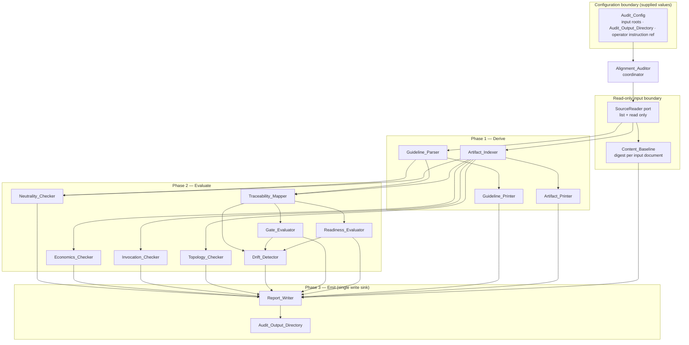
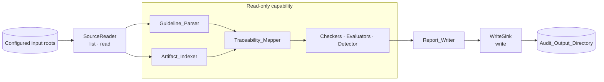
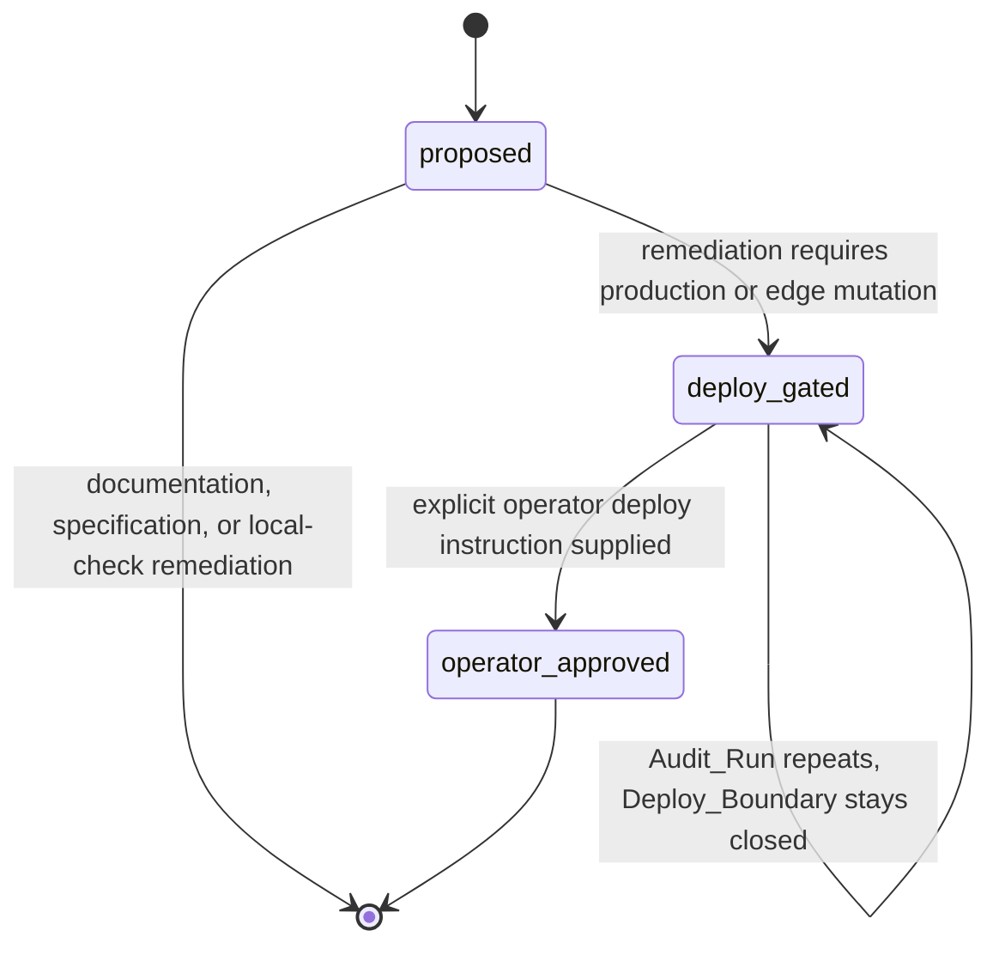

# Design Document

## Overview

The Alignment_Auditor is a read-only, deterministic pipeline that takes two configured input surfaces — a Guideline_Set and a Runtime_Repository — derives a model of each, evaluates conformance across eight dimensions, and emits a single versioned Audit_Report into an Audit_Output_Directory. It answers one question with evidence: do the two surfaces together enforce a complete from-0-to-1 pipeline that terminates in a verifiable runtime-ready state?

The audited Guideline_Set declares universality, neutrality, agnosticity, and modularity as binding rules. The audit capability is therefore designed to satisfy the rules it enforces: the audited repositories are configuration values, not literals in the design; every derived attribute comes from parsed frontmatter and document body content; no normative behavior derives from a file path segment or a directory name; and each component is addressable and liftable on its own.

### Design Goals

| Goal | Rationale | Traces to |
|---|---|---|
| Zero blast radius | Every write of an Audit_Run lands in the Audit_Output_Directory; inputs stay byte-identical and are proven so by a start-of-run baseline | R1.1, R1.2, R1.3 |
| Deploy-closed by default | Deploy_Boundary is `closed` unless an explicit operator deploy instruction reference is supplied; remediations that would touch a production or edge surface hold a `deploy-gated` state | R1.4, R1.5, R6.6, R11.8 |
| Content-derived only | Document identity and every entry attribute derive from frontmatter and body content; container names are never inputs to a decision | R2.2, R3.3, R8.3, R8.6 |
| Configuration-parameterised inputs | Input roots, output directory, and operator instruction reference are supplied values; no audited repository is named in the capability | R1.6 |
| Statement-level addressability | Each binding statement becomes one Normative_Element with a stable Element_Id, so conformance is measured statement by statement | R2.1, R2.3, R2.7 |
| Lossless model serialization | Guideline_Digest and Artifact_Index Markdown are exact renderings, provable by round trip | R2.4, R2.5, R3.5, R3.6 |
| Bidirectional traceability | Orphaned rules and unbacked claims surface as named, typed Findings rather than as absence | R4.1, R4.3, R4.5, R4.6 |
| Evidence-bound readiness | A Readiness_Level is a function of recorded Evidence_References, never of narrative | R6.1, R6.2, R6.5 |
| Deterministic output | Repeated runs over unchanged inputs produce identical Finding sets; document order is irrelevant | R13.1, R13.2, R13.3 |
| Continue-on-error per document | A malformed or unreadable document becomes a typed Finding, not a failed run | R2.6, R13.5, R13.6 |
| Zero-infrastructure, browser-capable | Pure ESM core behind an I/O port, no services, no persistent store, no model calls, no token spend | Operating context |

### Non-Goals

- Mutating any Guideline_Set or Runtime_Repository file. Remediations are recorded as statements only.
- Promoting anything to a production mirror or edge surface. That requires an explicit operator instruction and is outside this increment.
- Replacing the Runtime_Repository's existing documentation contract lane. This capability extends that surface; it does not duplicate it.
- Judging document prose quality. Only content-derivable conformance is evaluated.

---

## Architecture

### Shape

The Alignment_Auditor is a coordinator over a fixed pipeline of thirteen single-responsibility components. Three phases run in order: **derive** (parse inputs into models), **evaluate** (produce Findings from the models), **emit** (write the Audit_Report). Every component is a pure function of its declared inputs. Only the Report_Writer holds a write capability, and it holds exactly one.



**Component inventory**

| Layer | Component | Responsibility (SVO) | Emits Findings |
|---|---|---|---|
| Coordinator | Alignment_Auditor | Alignment_Auditor sequences phases and aggregates Findings | `malformed-document`, `unreadable-input` |
| Derive | Guideline_Parser | Guideline_Parser converts Guideline_Set documents into a Guideline_Model | `missing-frontmatter-key` |
| Derive | Guideline_Printer | Guideline_Printer renders a Guideline_Model into a Guideline_Digest | — |
| Derive | Artifact_Indexer | Artifact_Indexer builds the Artifact_Index from audited content | `unknown-status` |
| Derive | Artifact_Printer | Artifact_Printer renders an Artifact_Index into Markdown | — |
| Evaluate | Traceability_Mapper | Traceability_Mapper links elements, entries, and completion conditions | `unimplemented-guideline`, `unguided-artifact`, `unproven-claim`, `unresolvable-reference` |
| Evaluate | Gate_Evaluator | Gate_Evaluator assigns a Gate_State to each Pipeline_Gate | `gate-order-drift`, `gate-sequence-violation` |
| Evaluate | Readiness_Evaluator | Readiness_Evaluator assigns a Readiness_Level to each capability | — |
| Evaluate | Drift_Detector | Drift_Detector classifies divergence between the models | `status-conflict`, `stale-evidence`, `duplicate-owner`, `blended-status`, `missing-companion` |
| Evaluate | Neutrality_Checker | Neutrality_Checker evaluates the four scope rules | `vendor-coupling`, `path-derived-claim`, `non-modular-section`, `scope-contradiction` |
| Evaluate | Economics_Checker | Economics_Checker evaluates cost, token, value, and reach statements | `missing-economics-metric`, `blended-deployment-tco`, `missing-foss-comparison`, `unbounded-loop`, `paid-read-path`, `missing-delivery-statement` |
| Evaluate | Invocation_Checker | Invocation_Checker resolves invocation routes to owners | `orphan-route`, `ambiguous-route`, `unfederated-tool`, `uncatalogued-tool` |
| Evaluate | Topology_Checker | Topology_Checker evaluates lanes, boundaries, and topology nodes | `missing-lane`, `incomplete-lane-transition`, `deploy-boundary-breach`, `ungated-promotion`, `incomplete-topology-node` |
| Emit | Report_Writer | Report_Writer emits the Audit_Report into the Audit_Output_Directory | — |

The Guideline_Printer and Artifact_Printer sit in the derive phase because their output is a first-class Audit_Run artifact (the Guideline_Digest and the rendered Artifact_Index accompany the Audit_Report) and because their round-trip relationship with their parsers is the correctness evidence that the models are lossless.

### From-0-to-1 Gate Sequence

The Gate_Evaluator derives this ordered sequence and every gate condition from Guideline_Set content (R5.2). The sequence below is the shape the model takes; the specific conditions are read, not hard-coded.

```mermaid
flowchart LR
  g0["G0 Problem validation<br/>exit: problem + ROI + TCO + TTV recorded"]
  g1["G1 Requirements authoring<br/>exit: criteria observable and VCC-expressible"]
  g2["G2 Architecture authoring<br/>exit: components, contracts, topology, harness bounds"]
  g3["G3 Alignment review<br/>exit: bidirectional traceability closed"]
  g4["G4 Implementation<br/>exit: artifact exists for every artifact-bearing element"]
  g5["G5 Local proof<br/>exit: reproducible local check + recorded result"]
  g6["G6 Release readiness<br/>exit: every linked VCC carries evidence"]
  db{{"Deploy_Boundary<br/>default: closed"}}
  prod["Production-verified<br/>requires operator instruction"]

  g0 --> g1 --> g2 --> g3 --> g4 --> g5 --> g6 --> db
  db -.->|"explicit operator deploy instruction only"| prod
```



Gate states are ordered: a Pipeline_Gate at `met` while an earlier gate is `unmet` is a `gate-sequence-violation` (R5.7). The dashed transition past the Deploy_Boundary is never taken by an Audit_Run; it is recorded as out of scope (R1.4) and its state stays `closed` (R11.8).

### Configuration Is The Only Coupling

No component receives a path literal. The Alignment_Auditor receives one Audit_Config and resolves it once.

```
Audit_Config {
  guidelineRoots:        InputRoot[]        // >= 1
  runtimeRoots:          InputRoot[]        // >= 1
  auditOutputDirectory:  OutputRoot         // exactly 1
  operatorDeployInstruction: OperatorInstructionRef | null   // default null
  readinessLadder:       ReadinessLevel[]   // default ladder, overridable
  requiredFrontmatterKeys: string[]         // supplied per Guideline_Set contract
  economicsStatements:   StatementKind[]    // supplied; default four statements
}

InputRoot { roleLabel: string, locator: Locator, includeGlobs: string[], excludeGlobs: string[] }
```

`roleLabel` is a caller-supplied display label used only in the report; it is never consulted by a rule. `Locator` is opaque to the core and is interpreted by the SourceReader adapter, so a filesystem, an in-memory map, or a browser directory handle are interchangeable.

### Technology Choices

| Choice | Decision | Reason |
|---|---|---|
| Language and module system | Node ESM (`.mjs`), targeting the Node version the Runtime_Repository already declares | The Runtime_Repository is already `"type": "module"` with an `engines.node` floor and a `scripts/*.mjs` convention; matching it means zero new toolchain and zero build step |
| Runtime dependencies | None | Zero-infrastructure and FOSS-first; a dependency-free core keeps 12-month TCO at zero and removes supply-chain surface |
| Frontmatter and Markdown parsing | Hand-rolled scanner over the same flat-key frontmatter subset the Runtime_Repository's existing documentation contract lane already relies on | The audit and the existing lane must agree on what "frontmatter" means, otherwise the audit reports drift that the lane cannot see. Reusing the existing convention avoids a second, divergent definition |
| I/O | Behind a `SourceReader` port with a Node adapter and an in-memory adapter | Makes the core browser-capable and local-first, and makes the read-only property testable without a filesystem |
| Test runner | The Node built-in test runner, matching the existing `__tests__/*.test.mjs` convention | No new runner, no watch mode, single-execution by default |
| Property-based testing library | `fast-check`, pinned to an exact version, as a development-only dependency | MIT-licensed FOSS, no runtime footprint, integrates with the built-in runner, and supports the shrinking needed to make counterexamples reviewable. Property-based testing is not implemented from scratch |
| Check lane | A new named check lane that composes the audit contract validators into the Runtime_Repository's **existing** documentation contract entry point, in the same shape as the validators already registered there | The Runtime_Repository already ships a documentation contract lane that reads every Markdown document, enforces required frontmatter keys, and runs a list of per-contract validators. Adding a parallel lane would read the same documents twice, drift from the shared required-key list, and split the failure surface. Extending the existing surface keeps one entry point and one definition of "contract failure" |
| Model calls | None | Every evaluation is content-derivable. A discovery or read path with non-zero token cost is itself a Finding (`paid-read-path`), so the audit must hold itself to $0 |

**Hosting is not part of the contract.** Two arrangements are supported, and neither is normative: the capability may be hosted inside the Runtime_Repository's script surface (convenient, because the check-lane conventions live there), or in a third repository that treats both audited surfaces purely as configured inputs. In either case the Audit_Output_Directory must be disjoint from every input root, so a Runtime_Repository-hosted deployment writes outside its own configured input root or excludes the output directory from that root.

---

## Components and Interfaces

Signatures below are design notation, not implementation. `Result<T>` denotes a value plus an accumulated Finding list; no component throws for a per-document defect.

### Alignment_Auditor

**Responsibility**: Alignment_Auditor sequences the pipeline, aggregates Findings, and enforces the run-level invariants.

```
runAudit(config: Audit_Config, reader: SourceReader, sink: WriteSink): Audit_Run_Result

Audit_Run_Result {
  report: Audit_Report
  findings: Finding[]            // canonically ordered and deduplicated
  baselineVerified: boolean
  modifiedOutsideOutputCount: number   // always 0 on a conforming run
  deployBoundaryState: "closed" | "open"
  counts: { auditedDocuments: number, findings: number }
  elapsedMs: number
}
```

Ordered duties: validate and resolve the Audit_Config (run-terminating on failure); capture the Content_Baseline; run derive, evaluate, emit; re-verify the Content_Baseline; deduplicate and canonically order the Finding set; record counts and elapsed time. Emits `malformed-document` and `unreadable-input` because it owns the read boundary where those conditions are observable.

*Traces to: R1.1, R1.2, R1.6, R13.1–R13.7.*

### Guideline_Parser

**Responsibility**: Guideline_Parser converts Guideline_Set documents into a Guideline_Model.

```
parseGuidelineSet(docs: SourceDocument[], keys: string[]): Result<Guideline_Model>
parseGuidelineDigest(digest: string): Result<Guideline_Model>
```

Extraction rules, all content-derived: a **directive** is a list item under a directives block or an imperative statement containing a prohibition or required-safeguard clause; a **phase-gate condition** is the gate statement of a phase block plus each numbered step in that block; a **checklist item** is a task-list item in a checklist section; a **required template field** is a labelled field inside a template block; an **anti-pattern guard** is a prohibited/corrected pair. Each element records the `##` section heading anchor that owns it and the phase-gate it maps to, if any. Each element is classified as exactly one of Artifact_Bearing_Element or Advisory_Element from the element text: text that requires a document, a table, a diagram, a schema, a named check, or a recorded value is artifact-bearing; text that states a preference or a framing is advisory.

`parseGuidelineDigest` is the inverse of the Guideline_Printer and is the same function used on a Guideline_Set only in the sense that it produces the same type; the digest grammar is separate and stricter.

*Traces to: R2.1, R2.2, R2.3, R2.5, R2.6, R2.7, R2.8.*

### Guideline_Printer

**Responsibility**: Guideline_Printer renders a Guideline_Model into a Guideline_Digest.

```
printGuidelineModel(model: Guideline_Model): string
```

Output is canonically ordered and lossless with respect to the Guideline_Model equality relation defined below. Element text is emitted verbatim inside a fenced block with fence-length escalation, so no element text can terminate its own container.

*Traces to: R2.4, R2.5.*

### Artifact_Indexer

**Responsibility**: Artifact_Indexer builds the Artifact_Index from audited Runtime_Repository content.

```
buildArtifactIndex(docs: SourceDocument[], ladder: ReadinessLevel[]): Result<Artifact_Index>
parseArtifactIndexMarkdown(text: string): Result<Artifact_Index>
```

One entry per audited Markdown document, per declared contract schema, per declared validation command, and per declared readiness status. Each entry records the declared status value, declared runtime scope, declared owner, and declared proof reference, all taken from parsed frontmatter and body content. Validation command entries record the command text exactly as declared. A declared status absent from the configured Readiness_Level ladder yields `unknown-status` naming the declared value.

Entry attributes never read a path segment or a directory name. Document identity is a `Document_Key` derived from declared frontmatter identity (see Data Models), which makes both directory renames and file renames irrelevant to the result — a strengthening of R8.6, which constrains only the containing directory.

*Traces to: R3.1, R3.2, R3.3, R3.4, R3.6, R3.7.*

### Artifact_Printer

**Responsibility**: Artifact_Printer renders an Artifact_Index into Markdown.

```
printArtifactIndex(index: Artifact_Index): string
```

Canonically ordered and lossless with respect to the Artifact_Index equality relation. Absent optional attributes and empty-string attributes render distinguishably, so the round trip cannot collapse them.

*Traces to: R3.5, R3.6.*

### Traceability_Mapper

**Responsibility**: Traceability_Mapper links Normative_Elements, Artifact_Index entries, and Verifiable_Completion_Conditions.

```
mapTraceability(model: Guideline_Model, index: Artifact_Index): Result<Traceability_Chain[]> & { coverage: Coverage_Report }

Coverage_Report {
  artifactBearingTotal: number
  artifactBearingLinked: number
  linkedRatio: number          // artifactBearingLinked / artifactBearingTotal, 1 when total is 0
}
```

Linking is content-based: an element links to an entry when the entry's declared scope, declared owner, or body content satisfies the element's required-artifact descriptor. An entry links to a Verifiable_Completion_Condition when the entry declares a proof reference that resolves to a condition carrying an end state, a stated check, and a constraint.

Findings: `unimplemented-guideline` for an unlinked Artifact_Bearing_Element; nothing for an unlinked Advisory_Element, which is recorded as advisory coverage instead; `unguided-artifact` for an entry with no linked element; `unproven-claim` at severity `blocker` for a `runtime-ready` entry with no linked condition; `unresolvable-reference` when a link names a target absent from the supplied input roots, after which the remaining links are still processed.

*Traces to: R4.1–R4.8.*

### Gate_Evaluator

**Responsibility**: Gate_Evaluator assigns exactly one Gate_State to each Pipeline_Gate.

```
evaluateGates(model: Guideline_Model, index: Artifact_Index, chains: Traceability_Chain[]): Result<Pipeline_Gate[]>
```

Derives the ordered gate sequence and each gate's entry condition, exit condition, and required evidence type from Guideline_Set content. Assigns `met` only when every Normative_Element mapped to that gate carries at least one Evidence_Reference; `partially-met` when some but not all do; `unmet` when none do. Compares the Runtime_Repository's documented stage order against the derived order and records `gate-order-drift` naming both orders when they differ. Records `gate-sequence-violation` when a `met` gate follows an `unmet` gate.

*Traces to: R5.1–R5.7.*

### Readiness_Evaluator

**Responsibility**: Readiness_Evaluator assigns exactly one Readiness_Level to each audited capability and reports local and deployed readiness separately.

```
evaluateReadiness(chains: Traceability_Chain[], operatorInstruction: OperatorInstructionRef | null): Result<Readiness_Assignment[]>
```

Assignment is a total function of the Evidence_References recorded in the chain:

| Condition on evidence | Assigned level |
|---|---|
| Zero Evidence_References | `undocumented` or `spec-complete`, never higher |
| At least one Evidence_Reference naming a reproducible local check with a recorded result | at least `dev-proven` |
| An Evidence_Reference for every linked Verifiable_Completion_Condition | `runtime-ready` |
| A recorded production-surface check result **and** an explicit operator deploy instruction reference | `production-verified` |

The distinction between `undocumented` and `spec-complete` is whether the capability has a linked Normative_Element and an Artifact_Index entry at all. Because assignment is monotone in the evidence set, adding evidence while retaining existing evidence can never lower the assigned level.

*Traces to: R6.1–R6.8.*

### Drift_Detector

**Responsibility**: Drift_Detector classifies divergence between the Guideline_Model and the Artifact_Index into typed, severity-ranked Findings.

```
detectDrift(model: Guideline_Model, index: Artifact_Index, chains: Traceability_Chain[], gates: Pipeline_Gate[], readiness: Readiness_Assignment[]): Finding[]
```

Owns the cross-document conditions: `status-conflict` (two documents declare conflicting statuses for one capability, naming both), `stale-evidence` (an Evidence_Reference names a validation command absent from the Artifact_Index command entries), `duplicate-owner` (two documents declare ownership of one capability contract, naming both), `blended-status` (one status field combines a local and a deployed readiness claim), `missing-companion` (a document names a required companion absent from the Artifact_Index).

The Drift_Detector is also the single place where every Finding produced anywhere in the run is normalised: it assigns the final Finding_Type and severity per the resolution rule, and it is the point at which deduplication keys are computed.

*Traces to: R7.1–R7.8.*

### Neutrality_Checker

**Responsibility**: Neutrality_Checker evaluates universality, neutrality, agnosticity, and modularity conformance per audited document.

```
checkNeutrality(docs: SourceDocument[], universalScope: Set<Document_Key>): Finding[]
```

`vendor-coupling` when a Universal_Scope_Document names a brand, product, or vendor outside a labelled reference-implementation block. `path-derived-claim`, quoting the statement, when a document states that a normative claim derives from a file path segment or a directory name. `non-modular-section` when a `##` section of a Universal_Scope_Document depends on another section without naming it. `scope-contradiction` when a document declaring universal scope also constrains itself to a single named runtime, product, or repository. The modularity rule is omitted entirely for documents outside the Universal_Scope_Document set. Counts of `vendor-coupling` are reported per input role, not merged.

Because the checker consumes only `SourceDocument` content and a content-derived Document_Key set, changing a containing directory name cannot change its output.

*Traces to: R8.1–R8.7.*

### Economics_Checker

**Responsibility**: Economics_Checker evaluates return-on-investment, total-cost-of-ownership, token-budget, time-to-value, and delivery-reach conformance.

```
checkEconomics(docs: SourceDocument[], statements: StatementKind[]): Finding[]
```

For each feature-bearing document, verifies one statement per configured StatementKind (default: return-on-investment, 12-month total cost of ownership, token budget, time-to-value) and emits **one** `missing-economics-metric` Finding **per omitted statement**, naming that statement — so the Finding count for a document equals its omission count. `blended-deployment-tco` when a total-cost-of-ownership statement combines a managed and a self-managed deployment model into one figure. `missing-foss-comparison` when a proprietary dependency is named without a free-and-open-source alternative comparison. `unbounded-loop` at severity `blocker` when an AI pipeline omits a maximum-iteration bound or a circuit-breaker condition. `paid-read-path` when a discovery or read view declares a non-zero token cost. `missing-delivery-statement` when a user-facing capability omits browser reach, mobile reach, or offline behavior.

*Traces to: R9.1–R9.7.*

### Invocation_Checker

**Responsibility**: Invocation_Checker resolves each documented invocation route to exactly one owner and verifies tool federation.

```
checkInvocation(index: Artifact_Index): Finding[] & { routeCounts: { documented: number, resolved: number } }
```

Every documented `/` command route, `#` semantic tag, and `@` binding is resolved against the Artifact_Index owner declarations. Zero owners yields `orphan-route`; two or more yields `ambiguous-route`; exactly one is a resolved route. The three outcomes partition the documented route set, so `documented = resolved + orphan + ambiguous` holds by construction. Each documented tool identity must appear in both the federation contract document and the capability catalog document: absence from the former yields `unfederated-tool`, absence from the latter yields `uncatalogued-tool`.

*Traces to: R10.1–R10.6.*

### Topology_Checker

**Responsibility**: Topology_Checker evaluates lane topology, deploy-boundary, and topology-node conformance.

```
checkTopology(docs: SourceDocument[], index: Artifact_Index, operatorInstruction: OperatorInstructionRef | null): Finding[] & { deployBoundaryState: "closed" | "open" }
```

Verifies one development Lane, one production mirror Lane, and one edge delivery Lane; a missing Lane yields `missing-lane`. Verifies each Lane transition records one named Deploy_Boundary, one Evidence_Reference, and one rollback statement; an incomplete transition yields `incomplete-lane-transition`, and a transition with no explicit operator approval statement yields `ungated-promotion`. A document describing a development command as mutating a production or edge surface yields `deploy-boundary-breach` at severity `blocker`.

The breach evaluation is **independent of lane discovery**: it runs across every audited document even when one or more Lanes are absent, so a document set that fails to declare its lanes cannot suppress breach detection. Each documented runtime component must appear in one topology table with a named connection type and a named data residency; omission of either yields `incomplete-topology-node`. The returned `deployBoundaryState` is `closed` whenever `operatorInstruction` is null.

*Traces to: R11.1–R11.8.*

### Report_Writer

**Responsibility**: Report_Writer emits the Audit_Report, the Guideline_Digest, and the rendered Artifact_Index into the Audit_Output_Directory.

```
writeReport(run: Audit_Run_Result, sink: WriteSink): WrittenArtifact[]
```

Begins the Audit_Report with a YAML frontmatter block containing `title`, `doc_type`, `version`, `date`, and `lang`, quoting every scalar containing reserved punctuation. Records the input revision identifier of each configured surface. Orders Finding entries by severity, then by Finding_Type. Emits the readiness gap matrix with one row per audited capability carrying the current Readiness_Level, the gap statement, the priority, and the exit criterion expressed as a Verifiable_Completion_Condition. Expresses every remediation as exactly one of a documentation change, a specification change, or a locally reproducible check. Applies semantic versioning and writes to a new version filename, never over a prior one.

The Report_Writer is the only component that receives the WriteSink.

*Traces to: R12.1–R12.8.*

---

## Data Models

### Source and identity

```
SourceDocument {
  documentKey:   Document_Key
  inputRole:     string            // caller-supplied label, display only
  frontmatter:   Map<string, string> | null   // null when unparseable
  body:          string
  contentDigest: string            // hex digest of normalised content
  readState:     "ok" | "malformed" | "unreadable"
}

Document_Key = string
```

`Document_Key` is derived, in order of preference, from the document's declared frontmatter identity (a stable declared identifier if present, otherwise a slug of the declared `title`), disambiguated by a short prefix of `contentDigest` on collision. Its derivation reads no path segment and no directory name. Content normalisation for digest and comparison purposes: line endings to `\n`, trailing whitespace per line removed, exactly one trailing newline.

### Guideline_Model and Normative_Element

```
Guideline_Model {
  documents: Map<Document_Key, DocumentMeta>
  elements:  Normative_Element[]      // canonically ordered
}

DocumentMeta {
  documentKey:        Document_Key
  frontmatterKeys:    string[]        // sorted
  sectionAnchors:     string[]        // in document order
  universalScope:     boolean
}

Normative_Element {
  elementId:     Element_Id
  documentKey:   Document_Key
  sectionAnchor: string
  kind:          "directive" | "phase-gate-condition" | "checklist-item"
                 | "required-template-field" | "anti-pattern-guard"
  class:         "artifact-bearing" | "advisory"
  gateId:        Gate_Id | null
  ordinal:       number              // position within its section
  text:          string              // verbatim, normalised
}

Element_Id = string    // stable function of (sectionAnchor, text)
```

`Element_Id` is a pure function of the owning section heading anchor and the element text. Two elements with the same anchor and text in different documents share an id, which is intentional: a lifted section keeps its element identities. `ordinal` is a content position, not a processing position, so it is stable under any document processing order.

`class` is total and exclusive: every Normative_Element is exactly one of Artifact_Bearing_Element and Advisory_Element.

### Artifact_Index and entries

```
Artifact_Index {
  entries: Artifact_Entry[]      // canonically ordered
}

Artifact_Entry {
  entryId:                 Entry_Id
  documentKey:             Document_Key
  entryKind:               "markdown-document" | "contract-schema"
                           | "validation-command" | "readiness-status"
  declaredStatus:          string | ABSENT
  declaredRuntimeScope:    string | ABSENT
  declaredOwner:           string | ABSENT
  declaredProofReference:  string | ABSENT
  commandText:             string | ABSENT     // validation-command entries
  invocationRoutes:        Invocation_Route[]
  toolIdentities:          string[]
  excerpt:                 string
}

Invocation_Route {
  surface: "slash" | "hash" | "at" | "mcp"
  token:   string
}
```

`ABSENT` is a distinct sentinel from the empty string, and the serialization format preserves the distinction. Every attribute is derived from parsed frontmatter or body content only.

### Traceability_Chain and links

```
Traceability_Chain {
  capabilityId: Capability_Id
  links:        Traceability_Link[]
  conditions:   Verifiable_Completion_Condition[]
  evidence:     Evidence_Reference[]
  advisoryCoverage: Element_Id[]
}

Traceability_Link {
  elementId:         Element_Id
  artifactReference: Entry_Id | Document_Key
  evidenceReference: Evidence_Reference | null
}

Verifiable_Completion_Condition {
  conditionId: string
  endState:    string
  statedCheck: string
  constraint:  string
  bound:       string | null
}

Evidence_Reference {
  checkName:      string
  recordedResult: string
  reproducible:   "local" | "production" | "unproven"
}
```

### Pipeline_Gate

```
Pipeline_Gate {
  gateId:              Gate_Id
  order:               number            // 0-based, derived from Guideline_Set content
  entryCondition:      string
  exitCondition:       string
  requiredEvidenceType: string
  mappedElements:      Element_Id[]
  state:               "unmet" | "partially-met" | "met"
}
```

Exactly one `state` per gate. `met` requires that every element in `mappedElements` carries at least one Evidence_Reference.

### Readiness assignment

```
Readiness_Assignment {
  capabilityId:     Capability_Id
  localReadiness:   Readiness_Level
  deployedReadiness: Readiness_Level
  assignedLevel:    Readiness_Level     // min(local, deployed) is not used; see note
  evidenceCount:    number
  gapStatement:     string
  priority:         "P0" | "P1" | "P2"
  exitCriterion:    Verifiable_Completion_Condition
}

Readiness_Level = "undocumented" | "spec-complete" | "dev-proven"
                | "runtime-ready" | "production-verified"     // strictly ordered
```

`localReadiness` and `deployedReadiness` are reported as two separate fields and are never merged into one status string — merging them in an audited document is itself a `blended-status` Finding. `assignedLevel` is the single level required by R6.1 and equals `localReadiness` unless a production-surface check result and an operator deploy instruction reference both exist, in which case it is `production-verified`.

### Finding

```
Finding {
  findingType:      Finding_Type
  severity:         "blocker" | "major" | "minor"
  guidelineAnchor:  string       // section anchor or element id; "-" when not element-scoped
  artifactReference: string      // Entry_Id or Document_Key; "-" when not artifact-scoped
  evidenceExcerpt:  string
  remediation:      Remediation
}

Remediation {
  class: "documentation-change" | "specification-change" | "local-reproducible-check"
  statement: string
  state: "proposed" | "deploy-gated" | "operator-approved"
  operatorInstructionRef: string | null
}

Deduplication_Key = (findingType, guidelineAnchor, artifactReference)
```

All four record fields are always populated; `-` is the explicit not-applicable value so that the Deduplication_Key is always well-formed. `Remediation.state` is `deploy-gated` whenever the remediation would require a production-surface or edge-surface mutation, and advances to `operator-approved` only with a non-null `operatorInstructionRef`.

### Finding_Type enumeration

Twenty-nine types are named directly by an acceptance criterion. Five are derived by this design to give the checkers a typed outcome for criteria that mandate a verification without naming its Finding_Type; they are marked accordingly.

| Finding_Type | Default severity | Emitting component | Source |
|---|---|---|---|
| `missing-frontmatter-key` | major | Guideline_Parser | R2.6 |
| `unknown-status` | major | Artifact_Indexer | R3.4 |
| `unimplemented-guideline` | major | Traceability_Mapper | R4.3 |
| `unguided-artifact` | minor | Traceability_Mapper | R4.5 |
| `unproven-claim` | **blocker** (criterion-stated) | Traceability_Mapper | R4.6 |
| `unresolvable-reference` | major | Traceability_Mapper | R4.7 |
| `gate-order-drift` | major | Gate_Evaluator | R5.6 |
| `gate-sequence-violation` | major | Gate_Evaluator | R5.7 |
| `status-conflict` | major | Drift_Detector | R7.4 |
| `stale-evidence` | major | Drift_Detector | R7.5 |
| `duplicate-owner` | major | Drift_Detector | R7.6 |
| `blended-status` | minor | Drift_Detector | R7.7 |
| `missing-companion` | major | Drift_Detector | R7.8 |
| `vendor-coupling` | major | Neutrality_Checker | R8.2 |
| `path-derived-claim` | major | Neutrality_Checker | R8.3 |
| `non-modular-section` | minor | Neutrality_Checker | R8.4 |
| `scope-contradiction` | major | Neutrality_Checker | R8.1 *(design-derived)* |
| `missing-economics-metric` | major | Economics_Checker | R9.2 |
| `blended-deployment-tco` | major | Economics_Checker | R9.3 |
| `missing-foss-comparison` | major | Economics_Checker | R9.4 |
| `unbounded-loop` | **blocker** (criterion-stated) | Economics_Checker | R9.5 |
| `paid-read-path` | major | Economics_Checker | R9.6 |
| `missing-delivery-statement` | major | Economics_Checker | R9.7 *(design-derived)* |
| `orphan-route` | major | Invocation_Checker | R10.2 |
| `ambiguous-route` | major | Invocation_Checker | R10.3 |
| `unfederated-tool` | major | Invocation_Checker | R10.5 |
| `uncatalogued-tool` | major | Invocation_Checker | R10.4 *(design-derived)* |
| `missing-lane` | major | Topology_Checker | R11.1 *(design-derived)* |
| `incomplete-lane-transition` | major | Topology_Checker | R11.2 *(design-derived)* |
| `deploy-boundary-breach` | **blocker** (criterion-stated) | Topology_Checker | R11.3 |
| `ungated-promotion` | major | Topology_Checker | R11.5 |
| `incomplete-topology-node` | minor | Topology_Checker | R11.7 |
| `malformed-document` | major | Alignment_Auditor | R13.5 |
| `unreadable-input` | major | Alignment_Auditor | R13.6 |

**Severity resolution rule.** Where the source acceptance criterion states a severity, that severity governs and the table default is not consulted. Where the criterion is silent, the table default applies. This gives exactly one severity per Finding (R7.2) with a single deterministic precedence, and it means `unproven-claim`, `unbounded-loop`, and `deploy-boundary-breach` are always `blocker` regardless of table maintenance.

### Audit_Report

```
Audit_Report {
  frontmatter: {
    title: string, doc_type: string, version: string,   // semantic
    date: string, lang: string
  }
  inputRevisions:    { role: string, revisionId: string }[]
  alignmentSummary:  {
    normativeElementCount: number
    artifactEntryCount: number
    artifactBearingTotal: number
    artifactBearingLinked: number
    linkedRatio: number
    vendorCouplingCountByRole: Map<string, number>
    routeCounts: { documented: number, resolved: number }
    auditedDocumentCount: number
    findingCount: number
    deployBoundaryState: "closed" | "open"
    elapsedMs: number
    modifiedOutsideOutputCount: number
  }
  readinessGapMatrix: Readiness_Assignment[]     // one row per audited capability
  findingTable:       Finding[]                  // severity, then Finding_Type
  gateStateTable:     Pipeline_Gate[]            // gate order
}
```

`elapsedMs`, `date`, and the input revision identifiers live in the summary and frontmatter only. They are deliberately outside `findingTable`, which is what determinism is asserted over.

---

## Serialization Formats

Two Markdown serializations carry round-trip correctness obligations. Both are canonically ordered, so a printed artifact is a normal form.

### Guideline_Digest

```markdown
---
title: "Guideline Digest"
doc_type: "Guideline Digest"
version: "1.0.0"
date: "YYYY-MM-DD"
lang: "en-US"
digest_schema: "guideline-digest/v1"
---

# Guideline Digest

## Document: {documentKey}

| field | value |
|---|---|
| universal_scope | true |
| frontmatter_keys | `title`, `doc_type`, `version`, `date`, `lang` |
| section_anchors | `overview`, `flow-patterns` |

### Section: {sectionAnchor}

#### Element: {elementId}

| field | value |
|---|---|
| kind | `directive` |
| class | `artifact-bearing` |
| gate | `g2-architecture-authoring` |
| ordinal | 3 |

~~~element
{verbatim element text, may span lines}
~~~
```

Rules that make the format lossless:

- Documents appear in ascending `documentKey` order; sections in `sectionAnchors` order; elements in ascending `ordinal`.
- Element text is emitted verbatim inside an `~~~element` fence. If the text contains a run of `n` consecutive tilde characters at line start, the fence uses `n + 1` tildes. No escaping is applied inside the fence, so text is byte-exact after content normalisation.
- List-valued fields render as comma-separated backticked tokens; an empty list renders as `(none)`.
- `gate` renders `(none)` for a null `gateId`. `(none)` is reserved and cannot be a valid `Gate_Id`.

**Guideline_Model equality relation.** Two Guideline_Models are equal iff:

1. Their `documents` maps have equal key sets, and for each key the `universalScope` flag, the sorted `frontmatterKeys` list, and the ordered `sectionAnchors` list are equal.
2. Their `elements` lists, compared as **sets** of tuples `(elementId, documentKey, sectionAnchor, kind, class, gateId, ordinal, text)`, are equal — where `text` is compared after content normalisation.

Comparing elements as sets rather than sequences is deliberate: canonical order is a derived function of the tuple fields, so set equality implies sequence equality after canonical ordering, and the relation stays insensitive to processing order (which R13.2 requires).

### Artifact_Index Markdown

```markdown
---
title: "Artifact Index"
doc_type: "Artifact Index"
version: "1.0.0"
date: "YYYY-MM-DD"
lang: "en-US"
index_schema: "artifact-index/v1"
---

# Artifact Index

## Entry: {entryId}

| field | value |
|---|---|
| document_key | `{documentKey}` |
| entry_kind | `markdown-document` |
| declared_status | `runtime-ready` |
| declared_runtime_scope | (absent) |
| declared_owner | (empty) |
| declared_proof_reference | `{reference}` |
| command_text | (absent) |
| invocation_routes | `slash:/audit.run`, `hash:#alignment` |
| tool_identities | (none) |

~~~excerpt
{verbatim excerpt}
~~~
```

Rules that make the format lossless:

- Entries appear in ascending `entryId` order. `entryId` is derived from `(documentKey, entryKind, a content-derived discriminator)`, so it is stable and content-only.
- `(absent)` renders the `ABSENT` sentinel; `(empty)` renders the empty string. Both are reserved and cannot be produced by a declared value, because any declared value renders inside backticks.
- A declared value that itself contains a backtick renders in a fenced `~~~value` block keyed by field name, following the same fence-escalation rule as element text.
- `invocation_routes` render as `surface:token` pairs; `(none)` for an empty list.

**Artifact_Index equality relation.** Two Artifact_Indexes are equal iff their `entries` lists, compared as **sets** of tuples over every field, are equal — where each `string | ABSENT` field compares equal only when both sides are `ABSENT` or both are the same normalised string, and `invocationRoutes` and `toolIdentities` compare as ordered lists after canonical sorting.

---

## Determinism Strategy

Determinism is a structural property of the design, not a post-hoc sort.

**Canonical ordering.** Every collection has a total order that is a function of content only:

| Collection | Order key |
|---|---|
| `SourceDocument[]` | `documentKey` ascending |
| `Normative_Element[]` | `(documentKey, section index, ordinal)` |
| `Artifact_Entry[]` | `entryId` ascending |
| `Pipeline_Gate[]` | `order` ascending, derived from Guideline_Set content |
| `Readiness_Assignment[]` | `capabilityId` ascending |
| `Finding[]` | `(severity rank, findingType, guidelineAnchor, artifactReference)` |

No order key references a filesystem enumeration order, a wall clock, a random source, or a path. Because ordinals and section indices are positions *within a document's own content*, reordering the input document list cannot change any order key.

**Finding deduplication.** After all components have run, the Alignment_Auditor reduces the Finding list on `Deduplication_Key = (findingType, guidelineAnchor, artifactReference)`. When two Findings share a key, the survivor takes the higher severity (per the resolution rule) and the lexicographically smaller `evidenceExcerpt`, so the reduction is associative, commutative, and idempotent — which is what makes the confluence property hold regardless of the order components contributed Findings.

**What is excluded from Finding-set equality.** The Finding set is the determinism contract. The following are recorded in the Audit_Report but are explicitly outside the Finding-set equality relation:

- `elapsedMs` and any wall-clock reading
- the report `date` frontmatter value
- the Audit_Report `version` string
- input revision identifiers
- the Content_Baseline digests

Two runs over unchanged inputs therefore produce identical Finding sets even though their reports differ in the timing and versioning fields (R13.1, R13.7, R12.7). Determinism assertions in tests compare Finding sets and the derived models, never whole report bytes.

**Monotone addition.** Because every Finding's Deduplication_Key is scoped to a `guidelineAnchor` and an `artifactReference` that both derive from content, adding one document to an input set can only add Findings keyed to the new document, or add cross-document Findings in which the new document participates. Findings whose key names only unchanged documents are unaffected (R13.3). The one deliberate exception is dual-closure: adding a document can *resolve* an `unimplemented-guideline` by supplying the missing artifact. This is a resolution, not a loss, and the property statement for R13.3 is scoped to Findings for unchanged documents whose link set is unchanged.

**Bounded Finding count.** Each Normative_Element can contribute at most one surviving Finding per element-scoped Finding_Type after deduplication, and likewise per Artifact_Entry. The Alignment_Auditor asserts `findingCount <= normativeElementCount + artifactEntryCount` as a post-condition (R13.4); a violation is a defect in the deduplication reduction, not a legitimate result.

---

## Read-Only And Deploy-Safety Enforcement

### Single write sink

Exactly one object in the design holds a write capability.

```
WriteSink {
  root: OutputRoot                     // the resolved Audit_Output_Directory
  write(relativeName: string, content: string): WrittenArtifact
}
```

The WriteSink is constructed once by the Alignment_Auditor from the resolved Audit_Output_Directory and is handed only to the Report_Writer. `relativeName` is rejected if it escapes the root after normalisation. Every other component receives a `SourceReader`, which exposes only `list` and `read`. This makes "the audit is read-only" a structural fact about which component can reach a write primitive, rather than a convention that each component must remember.



### Input and output overlap rejection

Before any read, the Alignment_Auditor resolves every input root and the Audit_Output_Directory to canonical, symlink-resolved locators and rejects the run when the output directory equals, contains, or is contained by any input root. This is a **run-terminating configuration error**: no Findings are produced, no baseline is captured, and no report is written. Overlap is rejected rather than filtered because a filtered overlap would let a prior run's output become a later run's input, breaking both the read-only guarantee and determinism.

### Start-of-run content baseline

```
Content_Baseline { entries: Map<Document_Key, { byteLength: number, digest: string }> }
```

The baseline is captured immediately after input enumeration and before any evaluation. After the emit phase, the Alignment_Auditor re-reads every baselined input and recomputes `byteLength` and `digest`. `modifiedOutsideOutputCount` is the number of entries whose recomputed pair differs from the baseline, and a conforming run reports zero (R1.2). The baseline is stored in the Audit_Report inside the Audit_Output_Directory; it is never written next to an input. Because the baseline is captured before evaluation and verified after emit, it covers the whole window in which any component could have written.

Remediations that would change a Guideline_Set or Runtime_Repository file are recorded as `Remediation.statement` text with the file named as an `artifactReference`; the file itself is untouched and the baseline proves it (R1.3).

### Deploy-gated remediation state machine



Rules:

- Every remediation starts at `proposed`.
- A remediation whose statement would mutate a production or edge surface is assigned `deploy-gated`. An Audit_Run can never advance it (R1.5).
- Advancing to `operator-approved` requires a non-null `operatorInstructionRef`, which enters only through Audit_Config. The audit does not synthesise one.
- `deployBoundaryState` is `closed` for every Audit_Run with a null `operatorDeployInstruction` (R11.8), and `production-verified` is unreachable in that case (R6.6).
- Every production-surface and edge-surface mutation is recorded in the Audit_Report as outside the scope of an Audit_Run (R1.4).

Applied to the topology this capability audits — development, production mirror, edge delivery — this means an Audit_Run can report on all three lanes and can never act on the second or third.

---

## Correctness Properties

*A property is a characteristic or behavior that should hold true across all valid executions of
a system, essentially a formal statement about what the system should do. Properties serve as the
bridge between human-readable specifications and machine-verifiable correctness guarantees.*

The prework classified 95 acceptance criteria. Two are not properties: Requirement 1.4 is a
structural absence proven by a static import check, and Requirement 1.6 is wiring proven by an
example plus a static check. The remaining criteria consolidate into the properties below after
removing redundancy (for example, the five traceability criteria collapse into one partition
property, and every "one finding per omitted required statement" criterion collapses into one
parameterized omission-cardinality property).

### Property 1: Guideline model round trip

*For any* Guideline_Model, parsing the Guideline_Digest produced by the Guideline_Printer yields
a Guideline_Model structurally equal to the input.

**Validates: Requirements 2.4, 2.5**

### Property 2: Artifact index round trip

*For any* Artifact_Index, parsing the Markdown produced by the Artifact_Printer yields an
Artifact_Index structurally equal to the input.

**Validates: Requirements 3.5, 3.6**

### Property 3: Element extraction is complete, anchored, and totally classified

*For any* Guideline_Set document assembled from a known multiset of element seeds, the parsed
model contains exactly one Normative_Element per seed, each carrying the anchor of a heading
present in the source, each carrying exactly one of the roles `artifact-bearing` and `advisory`,
and each Element_Id equal to another element's Element_Id if and only if their normalized
(anchor, kind, text) triples are equal.

**Validates: Requirements 2.1, 2.2, 2.3, 2.7, 2.8**

### Property 4: Entry attributes are declared-value preserving

*For any* Runtime_Repository document set assembled from known entry seeds, the Artifact_Index
contains exactly one entry per seed per entry kind, each entry field equals the value declared in
the document, each validation command entry preserves its command text verbatim, and a declared
status yields an `unknown-status` Finding quoting that status if and only if the status is absent
from the Readiness_Level ladder.

**Validates: Requirements 3.1, 3.2, 3.4, 3.7**

### Property 5: Traceability closure partitions both populations

*For any* Guideline_Model and Artifact_Index, the linked artifact-bearing elements and the
elements carrying an `unimplemented-guideline` Finding partition the artifact-bearing element
set; no unlinked Advisory_Element carries a Finding; the linked entries and the entries carrying
an `unguided-artifact` Finding partition the entry set; every link records an Element_Id, an
artifact reference, and an Evidence_Reference field; and `linkedCount` is at most
`artifactBearingCount` with `ratio` equal to their quotient, or `0` when the denominator is `0`.

**Validates: Requirements 4.1, 4.2, 4.3, 4.4, 4.5, 4.8**

### Property 6: Every runtime-ready claim is evidence-closed

*For any* Artifact_Index entry, the entry is assigned the Readiness_Level `runtime-ready` if and
only if it has at least one linked Verifiable_Completion_Condition and every linked
Verifiable_Completion_Condition carries an Evidence_Reference; otherwise a declared
`runtime-ready` status produces an `unproven-claim` Finding with severity `blocker`.

**Validates: Requirements 4.6, 6.5**

### Property 7: Gate evaluation is total and coverage-exact

*For any* Guideline_Set, including an empty one, the Gate_Evaluator emits exactly the seven
required Pipeline_Gates in strictly ascending ordinal order, each carrying one entry condition,
one exit condition, and one required evidence type, each assigned exactly one Gate_State, and
each assigned `met` if and only if every mapped Normative_Element carries at least one
Evidence_Reference.

**Validates: Requirements 5.1, 5.2, 5.3, 5.4, 5.5**

### Property 8: Gate ordering divergence is detected

*For any* documented stage order and *for any* vector of Gate_States, a `gate-order-drift`
Finding naming both orders is produced if and only if the documented order is not the derived
order, and a `gate-sequence-violation` Finding is produced if and only if some `met` gate holds a
higher ordinal than some `unmet` gate.

**Validates: Requirements 5.6, 5.7**

### Property 9: Readiness is a monotone, gated ladder

*For any* capability, any Evidence_Reference set, and any non-empty addition to that set that
retains every existing Evidence_Reference, the assigned Readiness_Level is a member of the
five-rung ladder, the level after the addition ranks greater than or equal to the level before,
zero evidence yields `spec-complete` or lower, one Evidence_Reference naming a reproducible local
check with a recorded result yields `dev-proven` or higher, `production-verified` is assigned only
when a production-surface check result and an operator deploy instruction reference are both
present, and `localReadiness` and `deployedReadiness` are reported as two separate fields.

**Validates: Requirements 6.1, 6.2, 6.3, 6.4, 6.6, 6.7, 6.8**

### Property 10: Every Finding is well formed

*For any* input set, every emitted Finding carries exactly one Finding_Type from the closed
enumeration, exactly one severity from `blocker`, `major`, `minor`, a non-empty guideline anchor,
a non-empty artifact reference, a non-empty evidence excerpt, a non-empty remediation statement
whose state is one of `documentation`, `specification`, `local-check`, `deploy-gated`, and exactly
one subject; and the severity assigned to identical finding inputs is identical across repeated
evaluations.

**Validates: Requirements 7.1, 7.2, 7.3, 12.6**

### Property 11: Drift discriminators fire exactly on divergence

*For any* pair of Artifact_Index entries sharing a `capabilityId` and *for any* declared value
pair, `status-conflict` is produced naming both entries if and only if the declared statuses
differ, `duplicate-owner` is produced naming both entries if and only if two or more distinct
owners are declared, `blended-status` is produced if and only if one status field carries both a
local readiness marker and a deployed readiness marker, `stale-evidence` is produced if and only
if an Evidence_Reference names a command absent from the index command entries, and
`missing-companion` is produced if and only if a named companion document is absent from the
index.

**Validates: Requirements 7.4, 7.5, 7.6, 7.7, 7.8**

### Property 12: Findings are invariant under containing-directory rename

*For any* audited document set and *for any* two distinct containing directory names, the
Artifact_Index and the emitted Finding set produced from the unchanged document content are
structurally equal.

**Validates: Requirements 3.3, 8.3, 8.6**

### Property 13: Neutrality rules are scoped and quoted

*For any* audited document, `vendor-coupling` is produced if and only if a brand token appears in
a Universal_Scope_Document outside a labelled reference-implementation block, `path-derived-claim`
is produced with the offending statement quoted in the evidence excerpt if and only if the
document states that a normative claim derives from a file path segment or directory name,
`non-modular-section` is produced if and only if a `##` section of a Universal_Scope_Document
depends on an unnamed section, no `non-modular-section` Finding is produced for a document outside
the Universal_Scope_Document set, and the per-side `vendor-coupling` counts sum to the total.

**Validates: Requirements 8.1, 8.2, 8.4, 8.5, 8.7**

### Property 14: Omitted required statements produce one named Finding each

*For any* audited document and *for any* subset of its required statements that is omitted, the
checker produces exactly one Finding per omitted statement naming that statement, for each of
these required-field sets: baseline frontmatter keys (`missing-frontmatter-key`), the four
economics statements (`missing-economics-metric`), the three delivery-reach dimensions, the Lane
set and each Lane transition's boundary, evidence, rollback, and operator approval fields
(`ungated-promotion`), and each topology node's connection type and data residency
(`incomplete-topology-node`); and the run continues over the remaining documents in every case.

**Validates: Requirements 2.6, 9.1, 9.2, 9.7, 11.1, 11.2, 11.5, 11.6, 11.7**

### Property 15: Economics discriminators fire exactly on the declared condition

*For any* audited document, `blended-deployment-tco` is produced if and only if one
total-cost-of-ownership figure carries both a managed and a self-managed deployment-model marker,
`missing-foss-comparison` is produced if and only if a proprietary dependency is named without an
accompanying free-and-open-source comparison, `unbounded-loop` is produced with severity `blocker`
if and only if a declared AI pipeline omits a maximum-iteration bound or a circuit-breaker
condition, and `paid-read-path` is produced if and only if a discovery or read view declares a
token cost that is not zero.

**Validates: Requirements 9.3, 9.4, 9.5, 9.6**

### Property 16: Invocation routes partition by owner cardinality

*For any* declared route-to-owner multimap, every Invocation_Route falls into exactly one of
resolved, `orphan-route`, and `ambiguous-route` according to whether its owner count is one, zero,
or greater than one; the documented route count equals the sum of the three partition sizes; and
`unfederated-tool` is produced for exactly those MCP tool identities absent from the declared
federation contract entry, with the capability catalog membership checked independently.

**Validates: Requirements 10.1, 10.2, 10.3, 10.4, 10.5, 10.6**

### Property 17: Deploy-boundary breach detection is independent of Lane completeness

*For any* audited document set containing at least one described development command that mutates
a production or edge surface, and *for any* subset of Lane declarations removed from that set, the
`deploy-boundary-breach` Findings produced with severity `blocker` are preserved.

**Validates: Requirements 11.3, 11.4**

### Property 18: The Deploy_Boundary stays closed without an operator instruction

*For any* Audit_Run whose configuration carries no operator deploy instruction reference, and
*for any* audited document content including content that itself describes deployment, the
reported Deploy_Boundary state is `closed` and every remediation targeting a production or edge
surface holds `remediationState: "deploy-gated"` with a null operator instruction reference.

**Validates: Requirements 1.5, 11.8**

### Property 19: No file outside the Audit_Output_Directory changes

*For any* input set and *for any* Audit_Output_Directory, every source file is byte-identical
after the run, the reported count of files modified outside the Audit_Output_Directory is zero,
every written path resolves to a strict descendant of the Audit_Output_Directory, and every
Finding whose remediation would change a source file carries that change as a remediation
statement only.

**Validates: Requirements 1.1, 1.2, 1.3**

### Property 20: Repeated runs over unchanged inputs are identical

*For any* input set, two consecutive Audit_Runs over that unchanged input set produce structurally
equal Finding sets and byte-identical rendered Audit_Reports apart from the elapsed-run-time
field.

**Validates: Requirements 13.1, 13.7**

### Property 21: Document processing order does not change the result

*For any* input set and *for any* permutation of the order in which its documents are processed,
the emitted Finding set is structurally equal.

**Validates: Requirements 13.2**

### Property 22: Adding a document preserves prior Findings

*For any* input set and *for any* additional audited document, every Finding whose subject belongs
to the unchanged documents is present in the Finding set produced from the enlarged input set.

**Validates: Requirements 13.3**

### Property 23: Finding count stays within the cardinality bound

*For any* input set, the emitted Finding count is less than or equal to the sum of the
Normative_Element count and the Artifact_Index entry count.

**Validates: Requirements 13.4**

### Property 24: Malformed, unreadable, and unresolvable inputs yield typed Findings and a completed run

*For any* input set and *for any* subset of its documents that is malformed, unreadable, or names
a reference absent from the supplied roots, the run completes and produces an Audit_Report
containing exactly one `malformed-document`, `unreadable-input`, or `unresolvable-reference`
Finding per affected document or reference, naming it, while the remaining documents still
contribute elements and entries.

**Validates: Requirements 4.7, 13.5, 13.6**

### Property 25: The rendered report parses back to the report model

*For any* Audit_Report model, including one produced from empty inputs, the rendered Markdown
begins with a frontmatter block whose `title`, `doc_type`, `version`, `date`, and `lang` scalars
parse back to their original values with reserved punctuation preserved, contains an alignment
summary carrying the audited document count, the Finding count and the elapsed run time, contains
both input revision identifiers, contains one readiness gap matrix row per audited capability with
a non-empty Readiness_Level, gap statement, priority and Verifiable_Completion_Condition exit
criterion, and contains a Finding table and a Pipeline_Gate state table.

**Validates: Requirements 12.1, 12.2, 12.3, 12.5, 12.8, 13.7**

### Property 26: Finding order is a total order by severity then type

*For any* Finding set, the emitted sequence is non-decreasing under the canonical comparator
ordering by severity then Finding_Type, and the comparator is irreflexive, antisymmetric and
transitive over every generated triple of Findings.

**Validates: Requirements 12.4**

### Property 27: Prior report versions are retained

*For any* sequence of Audit_Runs against the same Audit_Output_Directory, each published
Audit_Report carries a semantic version strictly greater than its predecessor and the bytes of
every previously published Audit_Report are unchanged.

**Validates: Requirements 12.7**

## Error Handling

The auditor has three error classes and one rule per class. There is no fourth behavior.

### Continue-On-Error: Per-Document Defects

Applies to malformed documents, unreadable documents, missing frontmatter keys, unknown declared
statuses, and unresolvable references. Requirements 2.6, 3.4, 4.7, 13.5, 13.6.

Each defect becomes a typed Finding with the offending document or reference named in the
`artifactRef`, and the pipeline continues over every remaining document. The mechanism is that
per-document work is wrapped in a result-returning boundary, not a thrown exception: every parse
and index function returns `{ value, findings }` and never throws for input-shaped defects.

Malformed detection covers a missing opening frontmatter delimiter, a missing closing delimiter,
an unterminated fenced block, and a frontmatter block that a strict scalar read rejects. An
unreadable document is any source whose read port rejects; the reader records a synthetic
Artifact_Index entry for it so that the Finding retains a subject and the cardinality bound in
Requirement 13.4 still holds.

A checker that throws unexpectedly is caught at the checker boundary and recorded as a
`malformed-document` Finding against the named subject. The run still completes. This keeps a
defect in one checker from suppressing the other six.

### Terminate-Before-Write: Configuration Defects

Applies to Requirement 1.6 and the write boundary. Note: the requirements document does not yet
carry an explicit acceptance criterion for configuration validation failure. The behavior below is
designed anyway because it is the only way to keep Requirement 1.1 true under a bad configuration;
it is flagged in the open question at the end of this document.

Configuration validation runs before the source reader is constructed and before the output
boundary is constructed. An invalid configuration (empty roots, missing output directory, an
output directory that is a prefix of an input root, a malformed operator instruction reference)
produces a non-zero exit with the errors printed and zero files written. Because the write port
does not exist yet at that point, a bad configuration cannot produce a partial report.

`OutputBoundaryViolation` is thrown by `writeArtifact` before any bytes are written when a
resolved path is not a strict descendant of the Audit_Output_Directory. The report render is
computed fully in memory first, so a violation cannot leave a half-written report.

### Post-Run Source Integrity

Applies to Requirements 1.2, 1.3.

The reader retains `{ readHandle -> contentHash }` for every source it opened. After the report is
written, `Source_Integrity_Verifier` re-reads and re-hashes every retained handle, compares, and
reports `externalWriteCount`. A non-zero count is a hard failure: the CLI exits non-zero and the
report is annotated with the mismatching subjects. This is a detection backstop behind the
structural write containment, not a substitute for it.

### Error Paths Summary

| Failure mode | Detection point | Behavior | Finding |
|---|---|---|---|
| Invalid configuration | before reader construction | exit non-zero, zero writes | none |
| Unreadable source | reader | continue | `unreadable-input` |
| Malformed document | parser or indexer | continue | `malformed-document` |
| Off-ladder status | indexer | continue | `unknown-status` |
| Missing frontmatter key | parser | continue | `missing-frontmatter-key` |
| Absent reference | mapper | continue | `unresolvable-reference` |
| Checker exception | checker boundary | continue | `malformed-document` |
| Output path escape | write boundary | throw before write | none |
| Source hash mismatch after run | integrity verifier | exit non-zero | annotated in report |

## Testing Strategy

### Test Surfaces

| Surface | Runner | Command |
|---|---|---|
| Unit and property tests | `node --test` | `node --test __tests__/alignment-audit-*.test.mjs` |
| Contract document check | existing docs lane | `npm run docs:check` |
| Combined lane | new script | `npm run alignment-audit:check` |

`alignment-audit:check` runs the focused tests then the CLI in verify mode against a committed
fixture pair, so the lane proves the auditor runs end to end without touching any real repository.

### Property-Based Test Configuration

- Library: `fast-check`, MIT licensed, devDependency only, pinned to the exact version already
  resolved in this workspace. It integrates with `node --test` without a transpile step, supports
  async properties, and shrinks counterexamples.
- Each property is implemented as exactly one property-based test with `{ numRuns: 100 }` at
  minimum.
- Each test carries a comment tag in the form
  `// Feature: guideline-runtime-alignment-audit, Property N: <property text>`.
- Each test declares an explicit `seed` and `path` on failure reproduction so a counterexample is
  replayable offline.
- No property test performs real filesystem writes. The `readSource` and `writeArtifact` ports are
  in-memory fakes; a small number of integration tests exercise the real ports against a temporary
  directory.

### Shared Generators

| Generator | Produces | Notes |
|---|---|---|
| `arbNormalizedText` | strings including Unicode, CRLF, zero-width, and whitespace runs | forces the normalization rules |
| `arbElementSeed` | `{ anchor, kind, roleHint, text }` | one seed renders to exactly one element |
| `arbGuidelineDocument` | Markdown assembled from element seeds plus frontmatter with a chosen key subset | keeps the expected element multiset known |
| `arbEntrySeed` | declared status, scope, owner, proof, command, routes, capability id | statuses drawn from on-ladder and off-ladder pools |
| `arbRuntimeDocument` | Markdown assembled from entry seeds | includes readiness tables and route tables |
| `arbDocumentSet` | a set of documents plus a containing directory name | the directory name is the rename axis |
| `arbEvidenceSet` | Evidence_References with lanes and result strings | supports subset/superset pairs for monotonicity |
| `arbMalformedDocument` | broken delimiters, unterminated fences, bad scalars | drives the robustness property |
| `arbAuditConfig` | roots, output directory, optional operator instruction | the instruction presence is the deploy axis |
| `arbFindingSet` | Findings across every type and severity | drives ordering and dedupe properties |

### Test Plan Per Candidate Property

Every row of the requirements' Candidate Correctness Properties table maps to a concrete plan.

| Candidate row | Design property | Generator strategy | Property statement under test | Shrinking target |
|---|---|---|---|---|
| Parsing a printed Guideline_Model returns an equal Guideline_Model | 1 | `arbGuidelineModel` built from 0 to 40 `arbElementSeed` records across 1 to 6 anchors, with adversarial text (pipes, backticks, leading dashes, CRLF) | `equals(parse(print(m)), m)` | the single element whose text breaks the digest grammar |
| Parsing a printed Artifact_Index returns an equal Artifact_Index | 2 | `arbArtifactIndex` over 0 to 30 `arbEntrySeed` records covering all four entry kinds, command text with pipes and quotes | `equals(parse(print(i)), i)` | the single entry whose declared value breaks the table grammar |
| Every Artifact_Bearing_Element is either linked or reported as a Finding | 5 | independent `arbGuidelineModel` and `arbArtifactIndex` with a controlled token-overlap dial from 0 to 1 | linked set and `unimplemented-guideline` set partition the artifact-bearing set; no advisory Finding; counting identity holds | the smallest (element, entry) pair that is both linked and reported, or neither |
| Every runtime-ready claim carries at least one VCC | 6 | entries with declared status drawn from the ladder crossed with VCC sets of size 0 to 5 and per-VCC evidence presence | `runtime-ready` assigned iff VCCs non-empty and all covered; otherwise `unproven-claim` at `blocker` | the smallest entry declaring `runtime-ready` with zero VCCs and no blocker |
| Adding evidence never lowers an assigned Readiness_Level | 9 | `arbEvidenceSet` of size 0 to 8, plus a non-empty addition of size 1 to 4; VCC sets of size 0 to 5 | `rank(level(evidence + addition)) >= rank(level(evidence))` plus the ladder bounds | the single added Evidence_Reference that lowers the rank |
| A second audit over unchanged inputs produces an identical Finding set | 20 | `arbDocumentSet` of 0 to 12 documents mixing well-formed and malformed content | two runs yield equal Finding sets and byte-identical reports apart from elapsed time | the smallest document whose second-run output differs |
| Document processing order does not change the Finding set | 21 | `arbDocumentSet` plus `fc.shuffledSubarray` over the full set to produce a permutation | `equals(findings(order A), findings(order B))` | the smallest pair of documents whose relative order changes the result |
| Adding one document preserves every Finding for unchanged documents | 22 | `arbDocumentSet` as base plus one independently generated document | subject-restricted Finding subset of the base is a subset of the enlarged run's Findings | the smallest added document that perturbs an unrelated Finding |
| Finding count stays bounded by element count plus index entry count | 23 | documents deliberately seeded to trigger many checkers at once (off-ladder status, vendor token, unbounded loop, breach, orphan route) | `findings.length <= elements.length + entries.length` | the smallest document that exceeds the bound |
| Renaming a containing directory does not change the Finding set | 12 | `arbDocumentSet` plus two distinct directory names drawn from a pool including vendor-like and status-like names | index and Finding set structurally equal across the two names | the shortest document whose output depends on the directory name |
| Malformed and unreadable inputs yield typed Findings and a completed run | 24 | `arbDocumentSet` with a random subset replaced by `arbMalformedDocument` and a random subset marked unreadable in the fake read port | one typed Finding per affected document, report produced, unaffected documents still contribute | the smallest malformed byte sequence that aborts the run |
| No file outside the Audit_Output_Directory changes during a run | 19 | `arbDocumentSet` plus `arbAuditConfig`; output names include `..` sequences and absolute-looking prefixes | all source hashes unchanged, `externalWriteCount === 0`, every write path a strict descendant | the shortest relative name that escapes the output directory |
| Deploy_Boundary stays closed without an explicit operator instruction | 18 | `arbAuditConfig` with `operatorDeployInstruction` absent, crossed with documents containing deploy prose, approval prose, and breach prose | reported boundary state is `closed`; deploy-targeting remediations are `deploy-gated` with a null instruction reference | the shortest document that opens the boundary |

The remaining design properties (3, 4, 7, 8, 10, 11, 13, 14, 15, 16, 17, 25, 26, 27) follow the
same shape: a seeded-document generator whose expected outcome is known by construction, a
biconditional or cardinality assertion, and a shrinking target that is the smallest seed whose
classification flips.

### Unit And Example Tests

Property tests cover the general rules, so unit tests stay few and targeted:

- Two static import checks: no audit module imports a filesystem write API except
  `output-boundary.mjs`; no audit module imports `node:child_process`, `node:http`, `node:https`,
  `node:net`, or references `fetch`. These prove Requirements 1.4 and the deploy-closure invariant
  by structure.
- One example asserting the auditor runs against two distinct configured root sets, proving
  Requirement 1.6, plus a check that the core exports no default root constant.
- One example per rendered report section with a golden fixture, so a formatting regression is
  visible in a diff.
- Boundary examples: empty input set, single-document input set, and an input set with every
  document unreadable.
- One integration test against a temporary directory that exercises the real read and write ports
  and asserts the post-run integrity comparison.

### What Is Not Property-Tested

Report cosmetics (column widths, heading capitalization) use golden fixtures rather than
properties, because the requirement is a specific rendering, not a universal rule. The extraction
of a real Guideline_Set's element inventory is a fixture-based regression check, not a property,
because it asserts one concrete document's content.

## Requirements Traceability

| Requirement | Components | Properties | Other tests |
|---|---|---|---|
| 1.1 Write containment | `output-boundary` | 19 | static import check |
| 1.2 Zero external modifications | `Source_Integrity_Verifier`, `Report_Writer` | 19, 20 | integration test |
| 1.3 Remediation leaves sources intact | `Finding_Pipeline`, `Report_Writer` | 10, 19 | golden fixture |
| 1.4 Deploy mutation out of scope | `Topology_Checker`, `Report_Writer` | none | static import check, example |
| 1.5 Deploy-gated remediation | `Finding_Pipeline`, `Topology_Checker` | 18 | example |
| 1.6 Configuration-supplied roots | `Configuration Loader`, `SourceReader` | none | two-root example, no-default-constant check |
| 2.1 - 2.3, 2.7 Element extraction and identity | `Guideline_Parser` | 3, 12 | fixture regression |
| 2.4 - 2.5 Digest round trip | `Guideline_Printer`, `Guideline_Parser` | 1 | none |
| 2.6 Missing frontmatter key | `Guideline_Parser`, shared frontmatter reader | 14, 24 | none |
| 2.8 Role classification | `Guideline_Parser` | 3 | none |
| 3.1 - 3.2, 3.7 Index construction | `Artifact_Indexer` | 4 | fixture regression |
| 3.3 Content-only derivation | `Artifact_Indexer`, `SourceReader` | 12 | none |
| 3.4 Unknown status | `Artifact_Indexer` | 4 | none |
| 3.5 - 3.6 Index round trip | `Artifact_Printer`, `Artifact_Indexer` | 2 | none |
| 4.1 - 4.5, 4.8 Chain closure and coverage | `Traceability_Mapper` | 5 | none |
| 4.6 Unproven runtime-ready claim | `Traceability_Mapper`, `Readiness_Evaluator` | 6 | none |
| 4.7 Unresolvable reference | `Traceability_Mapper` | 24 | none |
| 5.1 - 5.5 Gate model | `Gate_Evaluator` | 7 | empty-input example |
| 5.6 - 5.7 Gate ordering | `Gate_Evaluator` | 8 | none |
| 6.1 - 6.4, 6.6 - 6.8 Readiness ladder | `Readiness_Evaluator` | 9 | none |
| 6.5 runtime-ready assignment | `Readiness_Evaluator` | 6, 9 | none |
| 7.1 - 7.3 Finding shape and severity | `Finding_Pipeline` | 10 | none |
| 7.4 - 7.8 Drift detection | `Drift_Detector` | 11 | none |
| 8.1 - 8.2, 8.4 - 8.5, 8.7 Neutrality rules | `Neutrality_Checker` | 13 | none |
| 8.3, 8.6 Path agnosticity | `Neutrality_Checker`, `Artifact_Indexer` | 12, 13 | none |
| 9.1 - 9.2, 9.7 Economics statements | `Economics_Checker` | 14 | none |
| 9.3 - 9.6 Economics discriminators | `Economics_Checker` | 15 | none |
| 10.1 - 10.6 Invocation surface | `Invocation_Checker` | 16 | none |
| 11.1 - 11.2, 11.5 - 11.7 Topology completeness | `Topology_Checker` | 14 | none |
| 11.3 - 11.4 Deploy-boundary breach | `Topology_Checker` | 17 | none |
| 11.8 Boundary closed by default | `Topology_Checker`, `Configuration Loader` | 18 | static import check |
| 12.1 - 12.3, 12.5, 12.8 Report content | `Report_Writer` | 25 | golden fixtures |
| 12.4 Finding order | `Finding_Pipeline`, `Report_Writer` | 26 | none |
| 12.6 Remediation classification | `Finding_Pipeline` | 10 | none |
| 12.7 Version retention | `Report_Writer`, `output-boundary` | 27 | integration test |
| 13.1 Determinism | whole pipeline | 20 | none |
| 13.2 Confluence | whole pipeline | 21 | none |
| 13.3 Additive preservation | whole pipeline | 22 | none |
| 13.4 Cardinality bound | `Finding_Pipeline` | 23 | none |
| 13.5 - 13.6 Malformed and unreadable inputs | `SourceReader`, `Guideline_Parser`, `Artifact_Indexer` | 24 | all-unreadable example |
| 13.7 Run summary counts | `Report_Writer` | 20, 25 | none |

## Correctness Properties

*A property is a characteristic or behavior that should hold true across all valid executions of a system — essentially, a formal statement about what the system should do. Properties serve as the bridge between human-readable specifications and machine-verifiable correctness guarantees.*

Property-based testing applies to this feature because the whole capability is a pure transformation from document content to a Finding set. The parsers and printers are round-trip candidates by construction, the checkers are detectors whose soundness and completeness are only meaningful across a generated input space, and determinism, agnosticity, and read-only safety are all universally quantified relations that examples cannot establish.

The 25 properties below were derived from the prework analysis over all 90 acceptance criteria and then consolidated to remove redundancy. Each states its class, its generator strategy, and the criteria it discharges.

### Property 1: Guideline_Model round trip

*For any* Guideline_Model, printing it with the Guideline_Printer and parsing the resulting Guideline_Digest with the Guideline_Parser produces a Guideline_Model equal to the input under the Guideline_Model equality relation.

- **Class**: Round trip
- **Generator**: Arbitrary Guideline_Models. Element `text` draws from a string generator biased toward format-hostile content: tilde runs of length 1 to 6 at line start, pipe characters, table delimiter rows, `---` lines, backticks, blank lines, leading and trailing whitespace, CRLF sequences, and non-ASCII code points. `gateId` is null in a meaningful fraction of cases; `frontmatterKeys` and `sectionAnchors` include the empty list; multiple documents share section anchors so that Element_Id collisions occur.
- **Validates: Requirements 2.4, 2.5**

### Property 2: Artifact_Index round trip

*For any* Artifact_Index, printing it with the Artifact_Printer and parsing the resulting Markdown with the Artifact_Indexer produces an Artifact_Index equal to the input under the Artifact_Index equality relation.

- **Class**: Round trip
- **Generator**: Arbitrary Artifact_Indexes covering all four `entryKind` values. Each `string | ABSENT` field draws from a three-way generator over `ABSENT`, the empty string, and an arbitrary string, so the sentinel-versus-empty distinction is exercised on every field. Declared values include backticks, the literal tokens `(absent)`, `(empty)`, and `(none)`, pipe characters, and newlines. `commandText` includes realistic multi-word commands and command strings containing pipes and quotes.
- **Validates: Requirements 3.5, 3.6**

### Property 3: Guideline extraction fidelity and element classification totality

*For all* generated element specifications rendered into a synthetic Guideline_Set document, parsing that document recovers exactly the specified elements: the element multiset matches by kind, owning section anchor, and normalised text; each element's Element_Id equals the id recomputed from its own `(sectionAnchor, text)` pair; and each element carries exactly one `class` drawn from `artifact-bearing` and `advisory`.

- **Class**: Invariant (model-based extraction)
- **Generator**: Element specifications with random kind, random owning section, random ordinal, and random text; rendered through the authoring shapes the Guideline_Parser recognises. Documents vary in section count, element count per section, interleaving of kinds, adjacent sections with equal anchors, and sections with zero elements. Text draws from both artifact-requiring and preference-stating phrasings so both `class` outcomes occur.
- **Validates: Requirements 2.1, 2.2, 2.3, 2.7, 2.8**

### Property 4: Artifact index fidelity to declared content

*For all* generated entry specifications rendered into synthetic Runtime_Repository documents, building the Artifact_Index recovers exactly one entry per specified Markdown document, contract schema, validation command, and declared readiness status, with `declaredStatus`, `declaredRuntimeScope`, `declaredOwner`, `declaredProofReference`, and `commandText` equal to the declared values.

- **Class**: Invariant (model-based extraction)
- **Generator**: Entry specifications across all four kinds, with declared attributes independently present, empty, or absent; documents declaring zero, one, and many entries of each kind; command text with and without surrounding formatting.
- **Validates: Requirements 3.1, 3.2, 3.7**

### Property 5: Traceability closure and count arithmetic

*For any* Guideline_Model and Artifact_Index pair, every Artifact_Bearing_Element is either linked to at least one Artifact_Index entry or has exactly one `unimplemented-guideline` Finding; every Advisory_Element with zero links has no Finding and appears in advisory coverage; every Artifact_Index entry with zero linked elements has exactly one `unguided-artifact` Finding; every link records a non-empty Element_Id and artifact reference; every unresolvable link target yields exactly one `unresolvable-reference` Finding while the remaining links are still processed; and the reported counts satisfy `artifactBearingLinked <= artifactBearingTotal` with `linkedRatio` equal to their quotient.

- **Class**: Invariant (closure)
- **Generator**: Model and index pairs with controlled link overlap: fully linked, fully disjoint, and partial overlap; artifact-bearing to advisory ratios across the full range including all-advisory and all-artifact-bearing; reference sets seeded with both resolvable and unresolvable targets; the empty model and the empty index as boundary cases.
- **Validates: Requirements 4.1, 4.2, 4.3, 4.4, 4.5, 4.7, 4.8**

### Property 6: Runtime-ready claims are proven or blocker-flagged

*For any* Artifact_Index and Traceability_Chain set, every entry declaring the Readiness_Level `runtime-ready` either has at least one linked Verifiable_Completion_Condition with an Evidence_Reference or carries exactly one `unproven-claim` Finding at severity `blocker`; and conversely, any capability holding an Evidence_Reference for every linked Verifiable_Completion_Condition is assigned the Readiness_Level `runtime-ready`.

- **Class**: Invariant (safety)
- **Generator**: Entries with declared statuses drawn across the whole ladder plus off-ladder strings; linked condition sets of size zero to many; evidence sets covering none, some, and all linked conditions; conditions with and without a complete end state, stated check, and constraint.
- **Validates: Requirements 4.6, 6.5**

### Property 7: Pipeline_Gate totality and evidence-soundness of `met`

*For any* synthesized Guideline_Set declaring a gate sequence, the derived Pipeline_Gate list preserves the declared order and covers every declared stage; every derived gate carries exactly one entry condition, one exit condition, and one required evidence type; every gate is assigned exactly one Gate_State; a gate is `met` if and only if every element mapped to it carries at least one Evidence_Reference; and removing any single Evidence_Reference from a `met` gate makes that gate not `met`.

- **Class**: Invariant plus metamorphic (evidence removal)
- **Generator**: Gate declarations with random stage labels, random declared order, and random per-gate element mappings; evidence distributions across mapped elements from empty to complete, including exactly-one-missing distributions that sit on the `met` boundary; gate sequences of length 1 to 12.
- **Validates: Requirements 5.1, 5.2, 5.3, 5.4, 5.5**

### Property 8: Gate order drift and sequence violation detection

*For any* derived gate order and any documented stage order, a `gate-order-drift` Finding naming both orders is present if and only if the documented order differs from the derived order; and *for any* vector of Gate_States over the ordered gate sequence, a `gate-sequence-violation` Finding is present if and only if some gate holding `met` follows a gate holding `unmet`.

- **Class**: Error condition plus invariant (monotonicity)
- **Generator**: Permutations of a derived order, including the identity permutation, adjacent swaps, single-element rotations, and full reversals; Gate_State vectors sampled over all three states, including monotone vectors, single-inversion vectors, and vectors where `partially-met` sits between an `unmet` and a `met` gate.
- **Validates: Requirements 5.6, 5.7**

### Property 9: Readiness totality and evidence bounds

*For any* Traceability_Chain, the Readiness_Evaluator assigns exactly one Readiness_Level from the ladder and populates both `localReadiness` and `deployedReadiness` as separate fields; a chain with zero Evidence_References is assigned `spec-complete` or lower; and a chain holding at least one Evidence_Reference that names a reproducible local check with a recorded result is assigned `dev-proven` or higher.

- **Class**: Invariant (totality and bounds)
- **Generator**: Chains with evidence sets of size zero to many; evidence entries with `reproducible` drawn over `local`, `production`, and `unproven`; recorded results present, empty, and absent; chains with and without linked conditions; chains with zero linked elements to exercise the `undocumented` boundary.
- **Validates: Requirements 6.1, 6.2, 6.3, 6.4, 6.8**

### Property 10: Evidence addition never lowers a Readiness_Level

*For any* Traceability_Chain and any non-empty set of additional Evidence_References, if every Evidence_Reference of the original chain is retained, then the Readiness_Level assigned after the addition is greater than or equal to the Readiness_Level assigned before it, under the ladder order.

- **Class**: Metamorphic (monotonicity)
- **Generator**: A base chain plus an addition set; additions include `unproven` evidence, duplicate evidence, evidence for already-covered conditions, evidence for previously uncovered conditions, and production evidence without an operator instruction — so the property is exercised on additions that should and should not raise the level.
- **Validates: Requirements 6.7**

### Property 11: Deploy safety without an operator instruction

*For any* input set audited with a null operator deploy instruction reference, the reported Deploy_Boundary state is `closed`, no capability is assigned the Readiness_Level `production-verified`, and no Remediation holds the state `operator-approved`; every Remediation whose statement would mutate a production or edge surface holds the state `deploy-gated`.

- **Class**: Invariant (safety)
- **Generator**: Arbitrary input sets, biased toward documents declaring `production-verified` statuses, recorded production-surface check results, deploy commands, and edge-surface references — that is, inputs that would tempt an implementation to open the boundary. The operator instruction is null in every case; a paired arm supplies a reference and asserts the boundary may open.
- **Validates: Requirements 1.5, 6.6, 11.8**

### Property 12: Finding well-formedness and severity resolution

*For all* Findings produced by any Audit_Run, each Finding carries exactly one Finding_Type from the documented enumeration, exactly one severity from `blocker`, `major`, `minor`, a non-empty guideline anchor, a non-empty artifact reference, a non-empty evidence excerpt, and a remediation whose class is exactly one of `documentation-change`, `specification-change`, `local-reproducible-check`; and every Finding whose source criterion states a severity carries that stated severity.

- **Class**: Invariant (well-formedness)
- **Generator**: Arbitrary input sets constructed to route through every emitting component, including documents that trigger `unproven-claim`, `unbounded-loop`, and `deploy-boundary-breach` so the criterion-stated severities are exercised; degenerate inputs (empty document set, single empty document) to confirm the invariant holds vacuously rather than by omission.
- **Validates: Requirements 7.1, 7.2, 7.3, 12.6**

### Property 13: Drift condition detection is sound and complete

*For any* audited document set and any drift condition kind drawn from conflicting status, stale evidence, duplicate ownership, blended status, and missing companion, injecting exactly one instance of that condition produces exactly one Finding of the corresponding type with its naming fields populated, and injecting no condition produces no Finding of that type.

- **Class**: Error condition (soundness and completeness)
- **Generator**: A clean synthetic document set plus an injection selector. Each injection has a matched near-miss variant that must not fire: matching statuses rather than conflicting ones; an Evidence_Reference naming a command that *is* indexed; a single declared owner; a status naming a lane without making a dual claim; a named companion that *is* indexed. Document set size 1 to 8, so cross-document conditions have room to form.
- **Validates: Requirements 7.4, 7.5, 7.6, 7.7, 7.8**

### Property 14: Neutrality rule detection and modularity scope exclusion

*For any* audited document set and any neutrality condition kind drawn from vendor coupling, path-derived claim, non-modular section, and scope contradiction, injecting exactly one instance into a Universal_Scope_Document produces exactly one Finding of the corresponding type; a `path-derived-claim` Finding's evidence excerpt contains the injected statement; injecting the same brand token inside a labelled reference-implementation block produces no `vendor-coupling` Finding; and the same non-modular content in a document outside the Universal_Scope_Document set produces no `non-modular-section` Finding.

- **Class**: Error condition (soundness and completeness) plus conditional exclusion
- **Generator**: Documents with a `universalScope` flag; brand tokens placed inside and outside labelled reference-implementation blocks; path-derivation statements phrased both as normative claims and as neutral descriptions of layout; cross-section dependencies that do and do not name their target; universal-scope declarations paired with and without single-runtime constraints.
- **Validates: Requirements 8.1, 8.2, 8.3, 8.4, 8.5**

### Property 15: Economics statement detection with per-omission multiplicity

*For any* feature-bearing document and any subset of the configured economics statements omitted from it, the number of `missing-economics-metric` Findings equals the size of the omitted subset and the set of statements they name equals that subset; the same multiplicity holds for `missing-delivery-statement` over browser reach, mobile reach, and offline behavior; and injecting a blended deployment-model figure, a proprietary dependency without a free-and-open-source comparison, an AI pipeline missing either a maximum-iteration bound or a circuit-breaker condition, or a non-zero-cost read view produces exactly one Finding of the corresponding type, with `unbounded-loop` at severity `blocker`.

- **Class**: Error condition with counting arithmetic
- **Generator**: Omission subsets over the power set of the configured statement list, including the empty set and the full set; TCO statements with separated deployment-model variants as the near-miss for blended figures; dependency mentions with and without a comparison; AI pipelines missing each loop-bound part independently and both together; declared read-path costs of `0`, `0.00`, `$0`, and non-zero values.
- **Validates: Requirements 9.1, 9.2, 9.3, 9.4, 9.5, 9.6, 9.7**

### Property 16: Invocation route resolution partitions the route set

*For any* Artifact_Index, every documented Invocation_Route falls into exactly one of resolved, `orphan-route`, and `ambiguous-route`, determined by whether it has one, zero, or two or more owner documents; the reported counts satisfy `documented = resolved + orphanCount + ambiguousCount` with `resolved <= documented`; and every documented tool identity absent from the federation contract document yields exactly one `unfederated-tool` Finding while absence from the capability catalog document yields exactly one `uncatalogued-tool` Finding.

- **Class**: Invariant (partition) plus error condition
- **Generator**: Route sets across all four surfaces with owner-count distributions weighted to hit 0, 1, and 2 or more; routes whose tokens differ only in case or trailing punctuation; tool identity sets placed in the federation document only, the catalog only, both, and neither.
- **Validates: Requirements 10.1, 10.2, 10.3, 10.4, 10.5, 10.6**

### Property 17: Topology and lane conformance detection is robust to absent lanes

*For any* audited document set and any topology condition kind drawn from missing lane, incomplete lane transition, ungated promotion, incomplete topology node, and deploy-boundary breach, injecting exactly one instance produces exactly one Finding of the corresponding type, with `deploy-boundary-breach` at severity `blocker`; and *for any* document set containing an injected breach, removing every Lane declaration from that set preserves every `deploy-boundary-breach` Finding.

- **Class**: Error condition plus metamorphic (degradation robustness)
- **Generator**: Document sets declaring zero to three Lanes; lane transitions omitting each of the named Deploy_Boundary, Evidence_Reference, and rollback statement independently and in combination; approval statements present and absent; topology nodes omitting connection type, data residency, or both; development-command descriptions that do and do not assert production or edge mutation. The lane-removal arm re-runs the identical content with lane declarations stripped.
- **Validates: Requirements 11.1, 11.2, 11.3, 11.4, 11.5, 11.6, 11.7**

### Property 18: No file outside the Audit_Output_Directory changes

*For any* input set and any valid Audit_Config, after an Audit_Run every input document is byte-identical to its start-of-run Content_Baseline entry, every recorded write target lies under the resolved Audit_Output_Directory, and the reported count of files modified outside that directory is zero.

- **Class**: Invariant (read-only)
- **Generator**: Arbitrary input sets, biased toward inputs that provoke source-change remediations: documents missing required frontmatter keys, unlinked artifact-bearing elements, stale evidence references, and remediation-bearing conditions. Documents whose body text contains paths, write instructions, and output-directory-like strings are included so that no incidental echo becomes a write. Runs execute against an instrumented in-memory reader and sink that record every access.
- **Validates: Requirements 1.1, 1.2, 1.3**

### Property 19: Path agnosticity under container and file renaming

*For any* input set, relocating every document so that its containing directory name and its file name change while its content stays byte-identical produces an identical Finding set and identical Artifact_Index entry attributes.

- **Class**: Invariant (agnosticity)
- **Generator**: An input set plus a relocation map that renames every container segment and every file name to freshly generated names, including names that resemble Readiness_Level values, Finding_Type names, and lane names — so that any accidental path inspection changes the result and is caught. A second arm permutes directory nesting depth without changing content.
- **Validates: Requirements 3.3, 8.6**

### Property 20: Repeated runs over unchanged inputs are identical

*For any* input set and Audit_Config, running the Alignment_Auditor twice with no change to the inputs between runs produces two identical Finding sets, and after N runs the Audit_Output_Directory holds N distinct semantically versioned Audit_Reports with no prior report overwritten.

- **Class**: Idempotence
- **Generator**: Arbitrary input sets including empty, single-document, all-malformed, and large sets; run counts from 2 to 5. Comparison is over the Finding set only; `elapsedMs`, the report `date`, the report `version`, and the input revision identifiers are excluded.
- **Validates: Requirements 12.7, 13.1**

### Property 21: Document processing order does not change the Finding set

*For any* input set and any permutation of the order in which its documents are processed, the resulting Finding set is identical.

- **Class**: Confluence
- **Generator**: An input set plus a permutation of its document list, including reversal, random shuffles, and rotations. Input sets are biased toward cross-document conditions — status conflicts, duplicate owners, ambiguous routes, missing companions — because those are the conditions whose detection could plausibly depend on which document was seen first.
- **Validates: Requirements 13.2**

### Property 22: Adding a document preserves Findings for unchanged documents

*For any* input set and any one additional document, every Finding produced for the original set whose deduplication key names only unchanged documents and whose link set is unchanged is also produced for the extended set.

- **Class**: Metamorphic
- **Generator**: A base input set plus one added document. Added documents range over: an unrelated document, a document that supplies a previously missing artifact, a document that introduces a status conflict, a document that duplicates an owner, and a byte-identical copy of an existing document. The qualifying subset is computed from the deduplication keys and the link sets rather than assumed.
- **Validates: Requirements 13.3**

### Property 23: Finding count is bounded by model size

*For any* input set, the number of Findings produced is less than or equal to the sum of the Normative_Element count and the Artifact_Index entry count.

- **Class**: Metamorphic bound
- **Generator**: Adversarial input sets designed to maximise Findings per document: documents omitting every required frontmatter key, declaring off-ladder statuses, naming absent companions, omitting every economics statement, declaring ambiguous routes, and asserting deploy-boundary breaches — all at once, across many documents. Near-duplicate documents are included so that the deduplication reduction is stressed.
- **Validates: Requirements 13.4**

### Property 24: Degraded inputs yield typed Findings and a completed run

*For any* input set containing malformed documents, unreadable documents, and documents omitting required frontmatter keys, the Audit_Run completes and produces an Audit_Report; each malformed document yields a `malformed-document` Finding naming it; each unreadable document yields an `unreadable-input` Finding naming it; each omitted required frontmatter key yields one `missing-frontmatter-key` Finding naming that key; and every healthy document in the set still contributes its Normative_Elements and Artifact_Index entries.

- **Class**: Error condition
- **Generator**: Mixed sets of healthy documents and injected failures. Malformations include a missing opening frontmatter delimiter, a missing closing delimiter, an unterminated fence, a duplicated frontmatter key, and invalid indentation. Unreadability is simulated by instructing the in-memory reader to fail specific reads. Required-key omissions draw from the power set of the configured key list. Sets include the all-degraded case, where the run must still complete with a report.
- **Validates: Requirements 2.6, 13.5, 13.6**

### Property 25: Audit_Report structural completeness, ordering, and frontmatter round trip

*For any* Audit_Run, the emitted Audit_Report contains an alignment summary, a readiness gap matrix, a Finding table, and a Pipeline_Gate state table; its frontmatter carries `title`, `doc_type`, `version`, `date`, and `lang`, and re-parsing that frontmatter recovers every scalar value unchanged; it records one input revision identifier per configured surface; the Finding table sequence is non-decreasing under the ordering `(severity rank, Finding_Type)`; the readiness gap matrix holds exactly one row per audited capability, each with a Readiness_Level, a gap statement, a priority, and an exit criterion expressed as a Verifiable_Completion_Condition; the per-role `vendor-coupling` counts sum to the total `vendor-coupling` count; and the reported audited-document count, Finding count, and elapsed run time are all present with the counts equal to the model sizes.

- **Class**: Invariant (structure and ordering) plus round trip (frontmatter)
- **Generator**: Arbitrary Audit_Run results, including runs with zero Findings, runs where every Finding shares one severity, and runs with ties across every ordering key. Report titles, `doc_type` values, and runtime scope strings draw from scalars containing colons, hash characters, single and double quotes, brackets, braces, leading `>` and `-`, and trailing whitespace — the values that break naive YAML emission.
- **Validates: Requirements 8.7, 12.1, 12.2, 12.3, 12.4, 12.5, 12.8, 13.7**

### Criteria not covered by a property

| Criterion | Reason | Test approach |
|---|---|---|
| 1.4 Record production and edge mutation as out of scope | A fixed report statement; does not vary with input | One example test on the Report_Writer output |
| 1.6 Read from configured paths | Parameter plumbing; its substance is Property 19 | One example test that both configured locators are read |

---

## Error Handling

Two error classes exist, and the distinction is deliberate: a defect **in the audited content** must never stop the audit, while a defect **in the audit's own configuration** must stop it before it can produce a misleading result.

### Run-terminating configuration errors

These are detected during config resolution, before any input read and before the Content_Baseline is captured. No Findings are produced, no Audit_Report is written, and the run exits with a non-zero status and a single diagnostic naming the offending configuration field.

| Condition | Rationale for terminating |
|---|---|
| Zero configured input roots for either surface | There is nothing to audit; an empty report would read as "aligned" |
| Audit_Output_Directory unresolvable or not writable | The run cannot record its result, so it cannot honestly claim anything |
| Audit_Output_Directory equals, contains, or is contained by any input root | A prior run's output would become a later run's input, breaking both the read-only guarantee and determinism |
| Configured Readiness_Level ladder is empty or contains duplicates | `unknown-status` and every readiness bound would be undefined |
| Configured required-frontmatter-key list is empty | `missing-frontmatter-key` could never fire, silently disabling a whole check |
| A `relativeName` passed to the WriteSink escapes the output root after normalisation | A write outside the sink is a defect, not a Finding |

Configuration errors are not Findings. Recording them as Findings would put them in the determinism contract and in the count bound, where they do not belong.

### Per-document continue-on-error

Every defect in audited content becomes a typed Finding, and the run completes.

| Condition | Finding | Continuation behavior |
|---|---|---|
| Document cannot be read | `unreadable-input` naming the document | Document contributes no elements or entries; all other documents are processed |
| Document structure cannot be parsed | `malformed-document` naming the document | Document contributes no elements or entries; all other documents are processed |
| Document parses but omits a required frontmatter key | `missing-frontmatter-key` per omitted key, naming the key | Document still contributes its elements and entries |
| Declared status absent from the ladder | `unknown-status` naming the value | Entry is indexed with the declared value retained verbatim |
| Link target absent from the input roots | `unresolvable-reference` | Remaining links in the same chain are still processed |

### The malformed-document split

R2.6 and R13.5 describe two different failure depths, and conflating them would either hide real structural breakage or over-report ordinary authoring gaps.

- **R13.5 — `malformed-document`.** The document's *structure* cannot be parsed: the frontmatter block has no opening or closing delimiter, the frontmatter is not valid YAML in the supported flat-key subset, or a fenced block is unterminated. The parser cannot reach the body reliably, so the document contributes **zero** Normative_Elements and **zero** Artifact_Index entries. It is named once. Consequently no `class` assignment (R2.8) is attempted for it, since it has no elements to classify.
- **R2.6 — `missing-frontmatter-key`.** The document's structure parses cleanly; a required key is simply absent from an otherwise well-formed frontmatter block. This is a content gap, not a structural failure, so the document **does** contribute its Normative_Elements and Artifact_Index entries, and one Finding is emitted per omitted key naming that key.

A document therefore yields at most one `malformed-document` Finding and, if and only if it is not malformed, zero or more `missing-frontmatter-key` Findings. The two are mutually exclusive per document, which keeps the Finding count bound in R13.4 tight.

### Degenerate but valid runs

An input set of zero readable documents is a valid run, not an error. It produces an Audit_Report with empty tables, an alignment summary whose counts are zero, a `linkedRatio` of 1 (the vacuous case), and a `closed` Deploy_Boundary. Reporting an empty result honestly is preferable to failing, because a silent failure would be indistinguishable from alignment.

---

## Testing Strategy

Property-based tests are the primary correctness evidence. Unit tests cover the specific examples, boundary values, and the two criteria that are not properties. One end-to-end run against the two real audited surfaces is the locally reproducible check that the capability works on genuine content rather than only on generated content.

### Property-based tests

- Library: `fast-check`, pinned to an exact version, development dependency only. Property-based testing is not implemented from scratch.
- Runner: the Node built-in test runner, matching the Runtime_Repository's existing `__tests__/*.test.mjs` convention. Single execution, no watch mode.
- **Each of the 25 correctness properties is implemented by exactly one property-based test.** No property is split across tests and no test covers two properties.
- Minimum **100 iterations** per property test, because the inputs are randomised.
- Each test carries a tag comment referencing its design property, in the format:
  `// Feature: guideline-runtime-alignment-audit, Property {number}: {property text}`
- Shrinking is left enabled so counterexamples arrive minimised and reviewable.
- Every run executes against the in-memory SourceReader and an instrumented WriteSink. No property test touches a real filesystem, which keeps the whole suite fast, hermetic, and free of the read-only risk it is meant to verify.
- Generators are shared through one arbitraries module so that the format-hostile string generator, the ladder generator, and the document synthesizer are defined once. A weak generator is the most common way a property test passes while the code is wrong, so the adversarial biases listed per property are part of the design, not an implementation detail.

### Unit tests

Kept deliberately narrow, since the properties already cover input breadth.

- **Parsers and printers**: one worked example per format — a known Guideline_Digest and a known Artifact_Index Markdown document with their expected models — so a format regression produces a readable diff rather than a shrunk counterexample.
- **Boundary values**: the empty document set; a document with frontmatter but no body; an element whose text is a single character; the shortest and longest gate sequences; a Finding set with exactly one entry.
- **Reserved token collisions**: declared values equal to `(absent)`, `(empty)`, and `(none)`; a `Gate_Id` literal equal to `(none)`.
- **Severity resolution**: one test per criterion-stated severity confirming `unproven-claim`, `unbounded-loop`, and `deploy-boundary-breach` are `blocker` even if the default table were changed.
- **Configuration errors**: one test per run-terminating condition, asserting a non-zero exit, no report written, and no Finding emitted.
- **The two non-property criteria**: R1.4 (out-of-scope declaration present in the report) and R1.6 (both configured locators are read).

### End-to-end run

One locally reproducible check runs the Alignment_Auditor with the Node SourceReader against the two real audited surfaces, configured entirely through the check's configuration file. Assertions are limited to what is stable regardless of how those surfaces evolve:

- The run completes and writes exactly one Audit_Report plus the Guideline_Digest and rendered Artifact_Index, all inside the Audit_Output_Directory.
- `modifiedOutsideOutputCount` is zero and the Content_Baseline re-verifies.
- `deployBoundaryState` is `closed`.
- The Audit_Report satisfies Property 25's structural assertions.
- Running twice produces identical Finding sets, exercising Property 20 on real content.

The end-to-end check deliberately does **not** assert a Finding count or a specific Finding list, because those change legitimately as the audited surfaces evolve, and a brittle assertion there would train maintainers to ignore the lane. The Audit_Report itself is the artifact reviewed for content.

### Check lane composition

The capability's validators are composed into the Runtime_Repository's existing documentation contract entry point in the same shape as the validators already registered there, so there is one entry point and one definition of contract failure. Two named lanes are exposed: a `check` lane that runs the property suite, the unit suite, and the end-to-end run; and a `run` lane that performs an Audit_Run and writes the report without asserting. The `check` lane is the release gate; the `run` lane is the working tool.

### What is deliberately not property-tested

- The Node SourceReader adapter's filesystem behavior. It is thin I/O over a platform API; a small number of integration tests over a temporary directory is the right cost. The core logic is exercised through the in-memory adapter.
- The report's `date`, `version`, and `elapsedMs` fields. They are excluded from the determinism contract by design, so asserting them across iterations would be asserting non-determinism.
- Prose quality of Findings. Remediation text readability is reviewed, not tested.

---

## Seed Findings Observed During Requirements Gathering

Recorded here so they are not lost. These are observations about the audited surfaces made while writing this spec, not outputs of an Audit_Run — the capability does not exist yet. Each is expressed in the Finding vocabulary this design defines, and each becomes an expected first-run result the implementation can be sanity-checked against.

### Seed 1 — Unresolvable spec-directory references

**Finding_Type**: `unresolvable-reference` · **Severity**: major

Both audited surfaces reference specification directories that are not present on disk in the accessible workspace roots. The Runtime_Repository's combined product and architecture document declares upstream specification packages in its frontmatter `source_docs` list, and other runtime documents name specification packages as normative authorities. Enumerating the accessible specification root shows only this feature's own package present; the referenced packages are absent.

This is exactly the condition R4.7 names: a linked reference whose target is absent from the supplied input roots. It matters because those references are declared as *sources of truth* for runtime-ready claims. A `runtime-ready` status whose proof chain terminates in an absent document is a candidate `unproven-claim` (R4.6, `blocker`) once the Traceability_Mapper runs.

**Remediation class**: documentation change or specification change. Either restore the referenced packages into a configured input root, or amend the declarations to name targets that resolve. Recording the reference as historical would also resolve it, provided the declaration stops asserting current authority.

**Note on the audit's own configuration**: this seed is also a design constraint. Because references may legitimately point outside any configured input root, `unresolvable-reference` must be a Finding and never a run-terminating error — which is why R4.7 requires continuation and why the design places it in the per-document continue-on-error class.

### Seed 2 — Existing documentation contract lane overlaps the audit surface

**Finding_Type**: not a conformance Finding · **Class**: architectural overlap

The Runtime_Repository already ships a documentation contract check lane that enumerates every Markdown document in its documentation surface, enforces a required frontmatter key list, applies line-count and character-set budgets, scans for forbidden runtime artifact patterns, and dispatches a list of per-contract validators. That lane reads the same documents the Artifact_Indexer would read and enforces a subset of the same rules — notably the required-frontmatter-key check, which is R2.6's obligation.

Two consequences are already folded into this design:

1. **Extend, do not duplicate.** The audit's validators compose into that existing entry point rather than standing up a parallel lane. A parallel lane would read every document twice, maintain a second required-key list that could drift from the first, and split the failure surface so a maintainer would have to check two places to know whether the documentation contract holds.
2. **Share the frontmatter definition.** The audit's frontmatter scanner deliberately targets the same flat-key subset the existing lane relies on. If the audit used a fuller YAML parser it would recognise structure the existing lane cannot, and would then report drift that the release gate is structurally incapable of seeing — an audit that disagrees with the gate it feeds is worse than no audit.

**Remediation class**: specification change, already applied in the Technology Choices and Testing Strategy sections of this document.

### Seed 3 — Declared statuses that blend local and deployed readiness

**Finding_Type**: `blended-status` · **Severity**: minor

The Runtime_Repository's readiness matrix contains status values that combine a local readiness claim and a deployed readiness claim in one field, in forms such as a local-proof claim followed by a gated-deployment qualifier in the same cell. R7.7 names this condition and R6.8 requires local and deployed readiness to be two separate fields.

This seed is recorded rather than acted on. It is a documentation-change remediation, and this spec is forbidden from editing the audited surfaces. It is also a useful first-run signal: if the Drift_Detector's `blended-status` check fires zero times against the real Runtime_Repository, the check is probably wrong.

**Remediation class**: documentation change, `deploy-gated` for nothing — the change is local to a documentation file and touches no production or edge surface.
