# Implementation Plan: Guideline Runtime Alignment Audit

## Overview

The Alignment_Auditor is built bottom-up as a dependency-free Node ESM capability inside the Runtime_Repository's existing script surface, matching the conventions that repository already declares: `"type": "module"`, `engines.node >= 22`, `scripts/*.mjs` modules, `__tests__/*.test.mjs` executed by `node --test`, and per-contract validators composed into the single `scripts/docs-contract.mjs` entry point reached by `npm run docs:check`. No new toolchain, no build step, no runtime dependency. `fast-check` enters as an exact-pinned devDependency only.

Capability root: `scripts/alignment-audit/` (core modules), `scripts/alignment-audit.mjs` (CLI), `scripts/alignment-audit-contract.mjs` (check-lane validator), `__tests__/alignment-audit-*.test.mjs` (tests), `__tests__/lib/alignment-audit-arbitraries.mjs` (shared generators). Audit output lands only in the configured Audit_Output_Directory (`audit/alignment-audit/`), which is disjoint from every input root.

Build order follows the dependency graph: identity and normalisation primitives, the Finding enumeration, the read-only I/O boundary, configuration and deploy safety, then the two parse/print model pairs, then the mappers and evaluators, then the four conformance checkers, then the report writer, then the coordinator, then the CLI and entry surface, then the check-lane wiring, and finally the self-audit that turns the capability on its own spec and guideline documents.

Scope guards held for the whole plan: no file outside the audit capability is edited except the two additive registration lines in `scripts/docs-contract.mjs` and the additive `scripts` and `devDependencies` entries in `package.json`; no audited source document is modified; nothing is deployed to a production mirror or an edge surface.

## Tasks

- [ ] 1. Scaffold the capability and its shared primitives
  - [-] 1.1 Create the normalisation and identity module
    - Create `scripts/alignment-audit/normalize.mjs` exporting `normalizeContent` (CRLF to `\n`, per-line trailing whitespace removed, exactly one trailing newline), `contentDigest`, `documentKeyFrom` (declared frontmatter identity, else declared `title` slug, else short `contentDigest` prefix on collision), `elementIdFrom(sectionAnchor, text)`, and `entryIdFrom(documentKey, entryKind, discriminator)`
    - No export reads a path segment, a directory name, a wall clock, or a random source
    - _Requirements: 2.3, 3.3_

  - [-] 1.2 Create the shared frontmatter scanner
    - Create `scripts/alignment-audit/frontmatter.mjs` implementing the same flat-key frontmatter subset `scripts/docs-contract.mjs` already relies on: opening `---\n` delimiter, closing `\n---\n` delimiter, flat `key: value` scalars
    - Return `{ frontmatter, body, readState }` with `readState` of `ok` or `malformed`; never throw for input-shaped defects
    - Report missing keys against a supplied required-key list rather than a module-level constant
    - _Requirements: 2.2, 2.6, 13.5_

  - [-] 1.3 Pin the property-testing dependency
    - Add `"fast-check": "3.23.2"` to `devDependencies` in `package.json` as an exact pin, development-only, no runtime dependency added
    - _Requirements: 13.1_

  - [~] 1.4 Create the shared arbitraries module with the format-hostile text generator
    - Create `__tests__/lib/alignment-audit-arbitraries.mjs` exporting `arbNormalizedText` (tilde runs of length 1 to 6 at line start, pipes, table delimiter rows, `---` lines, backticks, blank lines, leading and trailing whitespace, CRLF, non-ASCII), plus `arbReservedToken` covering `(absent)`, `(empty)`, `(none)`
    - Export `arbDocumentSet` returning a document list plus a containing directory name, so the rename axis is available to every later property
    - _Requirements: 2.3, 3.3, 13.2_

  - [ ]* 1.5 Write unit tests for normalisation, identity, and the frontmatter scanner
    - Create `__tests__/alignment-audit-units-primitives.test.mjs`: normalisation idempotence on CRLF and trailing whitespace, `Element_Id` equality for equal `(anchor, text)` pairs across documents, missing opening delimiter, missing closing delimiter, duplicated key, frontmatter with no body
    - _Requirements: 2.3, 2.6, 3.3, 13.5_

- [ ] 2. Define the Finding enumeration as the single source of truth
  - [~] 2.1 Implement the Finding module
    - Create `scripts/alignment-audit/finding.mjs` as the only definition of `FINDING_TYPES` (all 34 types from the design's Finding_Type table), `DEFAULT_SEVERITY` per type, and `SEVERITY_RANK` over `blocker`, `major`, `minor`
    - Implement `resolveSeverity` so a criterion-stated severity governs and the table default is consulted only when the criterion is silent, making `unproven-claim`, `unbounded-loop`, and `deploy-boundary-breach` always `blocker`
    - Implement `makeFinding` requiring a populated `guidelineAnchor`, `artifactReference`, `evidenceExcerpt`, and `Remediation` with class `documentation-change`, `specification-change`, or `local-reproducible-check`, using `-` as the explicit not-applicable value
    - Implement `deduplicationKey` as `(findingType, guidelineAnchor, artifactReference)` and `compareFindings` as `(severity rank, findingType, guidelineAnchor, artifactReference)`
    - Every other module imports its Finding_Type from here; no module declares a type string of its own
    - _Requirements: 7.1, 7.2, 7.3, 12.4, 12.6_

  - [ ]* 2.2 Write property test for Finding well-formedness
    - **Property 12: Finding well-formedness and severity resolution** — class: invariant (well-formedness)
    - File `__tests__/alignment-audit-property-12.test.mjs`, `fc.assert` at `{ numRuns: 100 }`, tag comment `// Feature: guideline-runtime-alignment-audit, Property 12: ...`
    - Generate Findings across every type and severity, including the degenerate empty and single-Finding cases
    - **Validates: Requirements 7.1, 7.2, 7.3, 12.6**

  - [ ]* 2.3 Write unit tests for the severity resolution rule
    - Create `__tests__/alignment-audit-units-finding.test.mjs`: one case per criterion-stated severity asserting `blocker` survives a mutated default table, and one case asserting an unknown type is rejected rather than silently accepted
    - _Requirements: 7.1, 7.2_

- [ ] 3. Enforce the read-only boundary structurally
  - [~] 3.1 Implement the SourceReader port and its two adapters
    - Create `scripts/alignment-audit/source-reader.mjs` exposing only `list` and `read`, with a Node adapter over `node:fs/promises` read APIs and an in-memory adapter driven by a document map
    - An unreadable source returns `readState: "unreadable"` with a synthetic subject retained, never a thrown error
    - Retain `{ readHandle -> contentDigest }` for every source opened, for post-run verification
    - _Requirements: 1.6, 13.6_

  - [~] 3.2 Implement the single write sink
    - Create `scripts/alignment-audit/output-boundary.mjs` exporting `createWriteSink(outputRoot)` with a single `write(relativeName, content)`, rejecting any `relativeName` that does not resolve to a strict descendant of the resolved output root before any bytes are written
    - Allocate semantically versioned report filenames and refuse to overwrite an existing published report
    - This is the only module in the capability permitted to import a filesystem write API
    - _Requirements: 1.1, 12.7_

  - [~] 3.3 Implement the content baseline and integrity verifier
    - Create `scripts/alignment-audit/content-baseline.mjs` capturing `{ byteLength, digest }` per input document immediately after enumeration and before evaluation, and re-verifying after the emit phase
    - Report `modifiedOutsideOutputCount`; a non-zero count annotates the report with the mismatching subjects and drives a non-zero CLI exit
    - _Requirements: 1.2, 1.3_

  - [ ]* 3.4 Write property test for write containment
    - **Property 18: No file outside the Audit_Output_Directory changes** — class: invariant (read-only)
    - File `__tests__/alignment-audit-property-18.test.mjs`, in-memory reader and instrumented sink recording every access, output names including `..` sequences and absolute-looking prefixes
    - Assert every source byte-identical to its baseline, `modifiedOutsideOutputCount === 0`, and every write path a strict descendant of the output root
    - **Validates: Requirements 1.1, 1.2, 1.3**

  - [ ]* 3.5 Write static import guard tests
    - Create `__tests__/alignment-audit-units-import-guards.test.mjs` scanning every `scripts/alignment-audit/**/*.mjs` source: no module except `output-boundary.mjs` imports a filesystem write API, and no module imports `node:child_process`, `node:http`, `node:https`, `node:net`, or references `fetch`
    - This is the structural proof that production-surface and edge-surface mutation is out of reach of an Audit_Run
    - _Requirements: 1.1, 1.4_

  - [ ]* 3.6 Write unit tests for the output boundary and version retention
    - Extend coverage in `__tests__/alignment-audit-units-output-boundary.test.mjs`: escaping relative names rejected before write, sequential runs allocate strictly increasing semantic versions, a prior report is never reopened for write
    - _Requirements: 1.1, 12.7_

- [ ] 4. Resolve configuration and close the deploy boundary by default
  - [~] 4.1 Implement configuration resolution and run-terminating validation
    - Create `scripts/alignment-audit/config.mjs` resolving `Audit_Config` from supplied values only: `guidelineRoots`, `runtimeRoots`, `auditOutputDirectory`, `operatorDeployInstruction` defaulting to `null`, `readinessLadder`, `requiredFrontmatterKeys`, `economicsStatements`
    - Terminate before the reader and the sink are constructed on: zero roots for either surface, unresolvable or unwritable output directory, an output directory that equals, contains, or is contained by any input root, an empty or duplicate-bearing ladder, an empty required-key list, a malformed operator instruction reference
    - Export no default root constant and no audited repository name
    - _Requirements: 1.6, 11.8_

  - [~] 4.2 Implement the deploy-gated remediation state machine
    - Create `scripts/alignment-audit/deploy-gate.mjs` implementing `proposed` to `deploy-gated` for any remediation whose statement would mutate a production or edge surface, and `deploy-gated` to `operator-approved` only with a non-null `operatorInstructionRef` supplied through configuration
    - Derive `deployBoundaryState` as `closed` whenever `operatorDeployInstruction` is null, make `production-verified` unreachable in that case, and emit the fixed record that every production-surface and edge-surface mutation is outside the scope of an Audit_Run
    - The module synthesises no operator instruction under any input
    - _Requirements: 1.4, 1.5, 6.6, 11.8_

  - [ ]* 4.3 Write property test for deploy safety
    - **Property 11: Deploy safety without an operator instruction** — class: invariant (safety)
    - File `__tests__/alignment-audit-property-11.test.mjs`, generating configs with a null instruction crossed with documents declaring `production-verified` statuses, recorded production check results, deploy commands, and edge-surface references
    - Assert boundary state `closed`, no `production-verified` assignment, no `operator-approved` remediation, and every production-targeting remediation `deploy-gated` with a null instruction reference; a paired arm supplies a reference and asserts the boundary may open
    - **Validates: Requirements 1.5, 6.6, 11.8**

  - [ ]* 4.4 Write unit tests for configuration errors and configured roots
    - Create `__tests__/alignment-audit-units-config.test.mjs`: one case per run-terminating condition asserting non-zero result, zero writes, and zero Findings; plus one example running against two distinct configured root sets and one asserting the core exports no default root constant
    - _Requirements: 1.6_

- [ ] 5. Build the Guideline_Model, parser, and printer
  - [~] 5.1 Implement the guideline model and its equality relation
    - Create `scripts/alignment-audit/guideline-model.mjs` defining `Guideline_Model`, `DocumentMeta`, `Normative_Element` with `kind`, `class`, `gateId`, `ordinal`, and `text`, plus canonical ordering by `(documentKey, section index, ordinal)`
    - Implement `guidelineModelsEqual` comparing documents by key set, `universalScope`, sorted `frontmatterKeys`, and ordered `sectionAnchors`, and comparing elements as sets of the eight-field tuple with normalised text
    - _Requirements: 2.1, 2.3, 2.8_

  - [~] 5.2 Implement the Guideline_Parser over Guideline_Set documents
    - Create `scripts/alignment-audit/guideline-parser.mjs` exporting `parseGuidelineSet(docs, requiredKeys)` returning `{ value, findings }`
    - Extract one Normative_Element per directive, phase-gate condition, checklist item, required template field, and anti-pattern guard; record the owning `##` section anchor and the mapped `gateId` when present
    - Classify each element as exactly one of `artifact-bearing` and `advisory` from element text
    - Emit `missing-frontmatter-key` per omitted key and continue with the remaining documents; a structurally unparseable document contributes zero elements
    - _Requirements: 2.1, 2.2, 2.6, 2.7, 2.8_

  - [~] 5.3 Implement the Guideline_Printer
    - Create `scripts/alignment-audit/guideline-printer.mjs` emitting the Guideline_Digest: frontmatter with `digest_schema`, documents in ascending `documentKey`, sections in `sectionAnchors` order, elements in ascending `ordinal`, field tables, and element text verbatim inside an `~~~element` fence with fence-length escalation
    - Render list-valued fields as comma-separated backticked tokens and `(none)` for the empty list and a null `gateId`
    - _Requirements: 2.4_

  - [~] 5.4 Implement the Guideline_Digest reader
    - Add `parseGuidelineDigest(digest)` to `scripts/alignment-audit/guideline-parser.mjs` implementing the stricter digest grammar as the exact inverse of the printer, including fence-escalation recovery and the reserved `(none)` token
    - _Requirements: 2.5_

  - [~] 5.5 Add the guideline generators to the arbitraries module
    - Extend `__tests__/lib/alignment-audit-arbitraries.mjs` with `arbElementSeed` (`anchor`, `kind`, `roleHint`, `text`), `arbGuidelineDocument` rendering 0 to 40 seeds across 1 to 6 anchors with a chosen frontmatter key subset, and `arbGuidelineModel` built from the same seeds so the expected element multiset is known by construction
    - Include documents sharing section anchors so `Element_Id` collisions occur, sections with zero elements, and both artifact-requiring and preference-stating phrasings
    - This generator is the paired input for the Guideline_Model round-trip property
    - _Requirements: 2.1, 2.3, 2.4, 2.5, 2.8_

  - [ ]* 5.6 Write property test for the Guideline_Model round trip
    - **Property 1: Guideline_Model round trip** — class: round trip
    - File `__tests__/alignment-audit-property-01.test.mjs`, `arbGuidelineModel`, assert `guidelineModelsEqual(parseGuidelineDigest(printGuidelineModel(m)), m)` at `{ numRuns: 100 }`
    - **Validates: Requirements 2.4, 2.5**

  - [ ]* 5.7 Write property test for extraction fidelity and classification totality
    - **Property 3: Guideline extraction fidelity and element classification totality** — class: invariant (model-based extraction)
    - File `__tests__/alignment-audit-property-03.test.mjs`, assert one element per seed by kind, anchor, and normalised text; each `Element_Id` equal to the id recomputed from its own `(sectionAnchor, text)`; each element carrying exactly one `class`
    - **Validates: Requirements 2.1, 2.2, 2.3, 2.7, 2.8**

- [ ] 6. Build the Artifact_Index, indexer, and printer
  - [~] 6.1 Implement the artifact index model and its equality relation
    - Create `scripts/alignment-audit/artifact-index.mjs` defining `Artifact_Entry` over the four `entryKind` values, the `ABSENT` sentinel as distinct from the empty string, `Invocation_Route`, canonical ordering by `entryId`, and `artifactIndexesEqual` comparing entries as sets of all fields with `ABSENT`-aware field comparison and canonically sorted route and tool lists
    - _Requirements: 3.1, 3.5, 3.6_

  - [~] 6.2 Implement the Artifact_Indexer
    - Create `scripts/alignment-audit/artifact-indexer.mjs` exporting `buildArtifactIndex(docs, ladder)` returning `{ value, findings }`
    - Emit one entry per audited Markdown document, declared contract schema, declared validation command, and declared readiness status, recording `declaredStatus`, `declaredRuntimeScope`, `declaredOwner`, `declaredProofReference`, verbatim `commandText`, `invocationRoutes`, and `toolIdentities` from parsed frontmatter and body content only
    - Emit `unknown-status` naming any declared status absent from the configured ladder while retaining the declared value verbatim
    - Derive no attribute from a path segment or a directory name
    - _Requirements: 3.1, 3.2, 3.3, 3.4, 3.7_

  - [~] 6.3 Implement the Artifact_Printer
    - Create `scripts/alignment-audit/artifact-printer.mjs` emitting entries in ascending `entryId` with `(absent)`, `(empty)`, and `(none)` as reserved renderings, declared values inside backticks, backtick-bearing values inside a field-keyed `~~~value` fence with escalation, and routes as `surface:token` pairs
    - _Requirements: 3.5_

  - [~] 6.4 Implement the Artifact_Index Markdown reader
    - Add `parseArtifactIndexMarkdown(text)` to `scripts/alignment-audit/artifact-indexer.mjs` recovering the sentinel-versus-empty distinction, fenced values, and route pairs exactly
    - _Requirements: 3.6_

  - [~] 6.5 Add the runtime document generators to the arbitraries module
    - Extend `__tests__/lib/alignment-audit-arbitraries.mjs` with `arbEntrySeed` (declared status drawn from on-ladder and off-ladder pools, scope, owner, proof, command text with pipes and quotes, routes across all four surfaces, capability id), `arbRuntimeDocument` rendering seeds into readiness and route tables, and `arbArtifactIndex` over 0 to 30 seeds covering all four entry kinds with each `string | ABSENT` field drawn three-way over `ABSENT`, empty, and arbitrary
    - This generator is the paired input for the Artifact_Index round-trip property
    - _Requirements: 3.1, 3.2, 3.4, 3.5, 3.6, 3.7_

  - [ ]* 6.6 Write property test for the Artifact_Index round trip
    - **Property 2: Artifact_Index round trip** — class: round trip
    - File `__tests__/alignment-audit-property-02.test.mjs`, assert `artifactIndexesEqual(parseArtifactIndexMarkdown(printArtifactIndex(i)), i)` with declared values including the reserved tokens, backticks, pipes, and newlines
    - **Validates: Requirements 3.5, 3.6**

  - [ ]* 6.7 Write property test for index fidelity to declared content
    - **Property 4: Artifact index fidelity to declared content** — class: invariant (model-based extraction)
    - File `__tests__/alignment-audit-property-04.test.mjs`, assert one entry per seed per kind, each field equal to the declared value, command text verbatim, and `unknown-status` emitted exactly when the declared status is off-ladder
    - **Validates: Requirements 3.1, 3.2, 3.4, 3.7**

  - [ ]* 6.8 Write property test for path agnosticity under renaming
    - **Property 19: Path agnosticity under container and file renaming** — class: invariant (agnosticity)
    - File `__tests__/alignment-audit-property-19.test.mjs`, relocate every document so its containing directory name and file name change while content stays byte-identical, using names that resemble Readiness_Level values, Finding_Type names, and lane names; a second arm permutes nesting depth
    - Assert identical Artifact_Index entry attributes and an identical Finding set
    - **Validates: Requirements 3.3, 8.6**

- [~] 7. Checkpoint - models and boundaries
  - Ensure all tests pass, ask the user if questions arise.

- [ ] 8. Implement the mapper and the two evaluators
  - [~] 8.1 Implement the Traceability_Mapper
    - Create `scripts/alignment-audit/traceability-mapper.mjs` exporting `mapTraceability(model, index)` returning chains plus a `Coverage_Report` with `artifactBearingTotal`, `artifactBearingLinked`, and `linkedRatio` (1 when the total is 0)
    - Link content-based: an element links to an entry when the entry's declared scope, declared owner, or body content satisfies the element's required-artifact descriptor; an entry links to a Verifiable_Completion_Condition through its declared proof reference carrying an end state, a stated check, and a constraint
    - Emit `unimplemented-guideline`, `unguided-artifact`, `unproven-claim` at `blocker`, and `unresolvable-reference`; record an unlinked Advisory_Element as advisory coverage with no Finding; continue processing remaining links after an unresolvable one
    - _Requirements: 4.1, 4.2, 4.3, 4.4, 4.5, 4.6, 4.7, 4.8_

  - [ ]* 8.2 Write property test for traceability closure and count arithmetic
    - **Property 5: Traceability closure and count arithmetic** — class: invariant (closure)
    - File `__tests__/alignment-audit-property-05.test.mjs`, independent model and index generators with a token-overlap dial from 0 to 1, artifact-bearing to advisory ratios across the full range, and empty-model and empty-index boundaries
    - Assert linked elements and `unimplemented-guideline` elements partition the artifact-bearing set, no advisory Finding, linked entries and `unguided-artifact` entries partition the entry set, every link records its three fields, and `linkedRatio` equals the quotient
    - **Validates: Requirements 4.1, 4.2, 4.3, 4.4, 4.5, 4.7, 4.8**

  - [~] 8.3 Implement the Readiness_Evaluator
    - Create `scripts/alignment-audit/readiness-evaluator.mjs` exporting `evaluateReadiness(chains, operatorInstruction)` assigning exactly one `assignedLevel` from the five-rung ladder and reporting `localReadiness` and `deployedReadiness` as two separate fields
    - Make assignment a monotone total function of the Evidence_Reference set: zero evidence yields `spec-complete` or lower, one reproducible local check with a recorded result yields `dev-proven` or higher, evidence for every linked condition yields `runtime-ready`, and `production-verified` requires both a recorded production-surface check result and a non-null operator deploy instruction reference
    - Populate `gapStatement`, `priority`, and the `exitCriterion` expressed as a Verifiable_Completion_Condition for the report's readiness gap matrix
    - _Requirements: 6.1, 6.2, 6.3, 6.4, 6.5, 6.6, 6.7, 6.8_

  - [ ]* 8.4 Write property test for runtime-ready evidence closure
    - **Property 6: Runtime-ready claims are proven or blocker-flagged** — class: invariant (safety)
    - File `__tests__/alignment-audit-property-06.test.mjs`, entries with declared statuses across the ladder plus off-ladder strings, linked condition sets of size 0 to 5, evidence covering none, some, and all conditions
    - Assert `runtime-ready` is assigned exactly when every linked condition carries evidence and a non-conforming declared `runtime-ready` yields one `unproven-claim` at `blocker`
    - **Validates: Requirements 4.6, 6.5**

  - [ ]* 8.5 Write property test for readiness totality and evidence bounds
    - **Property 9: Readiness totality and evidence bounds** — class: invariant (totality and bounds)
    - File `__tests__/alignment-audit-property-09.test.mjs`, evidence sets of size 0 to many with `reproducible` over `local`, `production`, and `unproven`, results present, empty, and absent, and chains with zero linked elements for the `undocumented` boundary
    - **Validates: Requirements 6.1, 6.2, 6.3, 6.4, 6.8**

  - [ ]* 8.6 Write property test for readiness monotonicity
    - **Property 10: Evidence addition never lowers a Readiness_Level** — class: metamorphic (monotonicity)
    - File `__tests__/alignment-audit-property-10.test.mjs`, base evidence set of size 0 to 8 plus a retained-superset addition of size 1 to 4, including `unproven` evidence, duplicate evidence, evidence for covered and uncovered conditions, and production evidence with no operator instruction
    - Assert `rank(level(evidence + addition)) >= rank(level(evidence))`
    - **Validates: Requirements 6.7**

  - [~] 8.7 Implement the Gate_Evaluator
    - Create `scripts/alignment-audit/gate-evaluator.mjs` exporting `evaluateGates(model, index, chains)` deriving the ordered Pipeline_Gate sequence and each gate's entry condition, exit condition, and required evidence type from Guideline_Set content rather than from a hard-coded list
    - Assign exactly one Gate_State per gate: `met` only when every mapped element carries at least one Evidence_Reference, `partially-met` when some do, `unmet` when none do
    - Emit `gate-order-drift` naming both orders when the Runtime_Repository's documented stage order differs from the derived order, and `gate-sequence-violation` when a `met` gate follows an `unmet` gate
    - _Requirements: 5.1, 5.2, 5.3, 5.4, 5.5, 5.6, 5.7_

  - [ ]* 8.8 Write property test for gate totality and evidence soundness
    - **Property 7: Pipeline_Gate totality and evidence-soundness of `met`** — class: invariant plus metamorphic (evidence removal)
    - File `__tests__/alignment-audit-property-07.test.mjs`, gate sequences of length 1 to 12 with random labels, declared order, and per-gate element mappings, plus exactly-one-missing evidence distributions on the `met` boundary
    - Assert order preservation, one entry, exit, and evidence type per gate, exactly one state per gate, the `met` biconditional, and that removing any single Evidence_Reference from a `met` gate makes it not `met`
    - **Validates: Requirements 5.1, 5.2, 5.3, 5.4, 5.5**

  - [ ]* 8.9 Write property test for gate order drift and sequence violation
    - **Property 8: Gate order drift and sequence violation detection** — class: error condition plus invariant (monotonicity)
    - File `__tests__/alignment-audit-property-08.test.mjs`, permutations of the derived order including identity, adjacent swaps, rotations, and reversal, crossed with Gate_State vectors including monotone, single-inversion, and `partially-met`-between cases
    - **Validates: Requirements 5.6, 5.7**

- [ ] 9. Implement drift detection and the Finding pipeline
  - [~] 9.1 Implement the Drift_Detector
    - Create `scripts/alignment-audit/drift-detector.mjs` exporting `detectDrift(model, index, chains, gates, readiness)` emitting `status-conflict` naming both documents, `stale-evidence` for an Evidence_Reference naming a command absent from the index command entries, `duplicate-owner` naming both documents, `blended-status` for one field combining a local and a deployed claim, and `missing-companion` for a named companion absent from the index
    - _Requirements: 7.4, 7.5, 7.6, 7.7, 7.8_

  - [ ]* 9.2 Write property test for drift condition soundness and completeness
    - **Property 13: Drift condition detection is sound and complete** — class: error condition (soundness and completeness)
    - File `__tests__/alignment-audit-property-13.test.mjs`, a clean synthetic set of 1 to 8 documents plus an injection selector, each injection paired with a near-miss variant that must not fire (matching statuses, an indexed command, a single owner, a single-lane status, an indexed companion)
    - **Validates: Requirements 7.4, 7.5, 7.6, 7.7, 7.8**

  - [~] 9.3 Implement the Finding pipeline
    - Create `scripts/alignment-audit/finding-pipeline.mjs` normalising every Finding through `finding.mjs`, reducing on `Deduplication_Key` with a survivor rule that takes the higher resolved severity and the lexicographically smaller `evidenceExcerpt` so the reduction is associative, commutative, and idempotent, then applying the canonical `(severity rank, findingType, guidelineAnchor, artifactReference)` order
    - Assert the post-condition `findingCount <= normativeElementCount + artifactEntryCount` and surface a violation as a defect rather than a result
    - Assign each remediation its class and its `deploy-gated` state through `deploy-gate.mjs`
    - _Requirements: 7.1, 7.2, 7.3, 12.4, 12.6, 13.4_

  - [ ]* 9.4 Write property test for the Finding count bound
    - **Property 23: Finding count is bounded by model size** — class: metamorphic bound
    - File `__tests__/alignment-audit-property-23.test.mjs`, adversarial documents omitting every required key, declaring off-ladder statuses, naming absent companions, omitting every economics statement, declaring ambiguous routes, and asserting breaches all at once, plus near-duplicate documents to stress the reduction
    - **Validates: Requirements 13.4**

- [ ] 10. Implement the four conformance checkers
  - [~] 10.1 Implement the Neutrality_Checker
    - Create `scripts/alignment-audit/neutrality-checker.mjs` exporting `checkNeutrality(docs, universalScope)` emitting `vendor-coupling` for a brand, product, or vendor token in a Universal_Scope_Document outside a labelled reference-implementation block, `path-derived-claim` quoting the offending statement, `non-modular-section` for a `##` section depending on an unnamed section, and `scope-contradiction` for a universal-scope declaration that also constrains itself to one named runtime, product, or repository
    - Omit the modularity rule entirely for documents outside the Universal_Scope_Document set, and report `vendor-coupling` counts per input role without merging
    - Consume only document content and content-derived document keys, so a containing directory name cannot change the output
    - _Requirements: 8.1, 8.2, 8.3, 8.4, 8.5, 8.6, 8.7_

  - [ ]* 10.2 Write property test for neutrality detection and modularity scope exclusion
    - **Property 14: Neutrality rule detection and modularity scope exclusion** — class: error condition (soundness and completeness) plus conditional exclusion
    - File `__tests__/alignment-audit-property-14.test.mjs`, brand tokens inside and outside labelled reference-implementation blocks, path-derivation phrased as a normative claim and as a neutral layout description, cross-section dependencies that do and do not name their target
    - Assert the `path-derived-claim` excerpt contains the injected statement and no `non-modular-section` fires outside the Universal_Scope_Document set
    - **Validates: Requirements 8.1, 8.2, 8.3, 8.4, 8.5**

  - [~] 10.3 Implement the Economics_Checker
    - Create `scripts/alignment-audit/economics-checker.mjs` exporting `checkEconomics(docs, statements)` emitting one `missing-economics-metric` per omitted configured statement naming that statement, `blended-deployment-tco`, `missing-foss-comparison`, `unbounded-loop` at `blocker`, `paid-read-path` for a declared non-zero-cost discovery or read view, and one `missing-delivery-statement` per omitted browser reach, mobile reach, or offline behavior dimension
    - _Requirements: 9.1, 9.2, 9.3, 9.4, 9.5, 9.6, 9.7_

  - [ ]* 10.4 Write property test for economics detection with per-omission multiplicity
    - **Property 15: Economics statement detection with per-omission multiplicity** — class: error condition with counting arithmetic
    - File `__tests__/alignment-audit-property-15.test.mjs`, omission subsets over the power set of the configured statement list including empty and full, separated deployment-model variants as the blended-figure near miss, dependency mentions with and without a comparison, loop bounds missing each part independently and together, and declared read costs of `0`, `0.00`, `$0`, and non-zero
    - **Validates: Requirements 9.1, 9.2, 9.3, 9.4, 9.5, 9.6, 9.7**

  - [~] 10.5 Implement the Invocation_Checker
    - Create `scripts/alignment-audit/invocation-checker.mjs` exporting `checkInvocation(index)` resolving each documented `/`, `#`, and `@` route against owner declarations into exactly one of resolved, `orphan-route`, and `ambiguous-route`, reporting `{ documented, resolved }` counts that satisfy the partition identity
    - Emit `unfederated-tool` for a tool identity absent from the federation contract document and `uncatalogued-tool` for absence from the capability catalog document, checked independently
    - _Requirements: 10.1, 10.2, 10.3, 10.4, 10.5, 10.6_

  - [ ]* 10.6 Write property test for invocation route partitioning
    - **Property 16: Invocation route resolution partitions the route set** — class: invariant (partition) plus error condition
    - File `__tests__/alignment-audit-property-16.test.mjs`, owner-count distributions weighted to 0, 1, and 2 or more, tokens differing only in case or trailing punctuation, and tool identity sets placed in the federation document only, the catalog only, both, and neither
    - **Validates: Requirements 10.1, 10.2, 10.3, 10.4, 10.5, 10.6**

  - [~] 10.7 Implement the Topology_Checker
    - Create `scripts/alignment-audit/topology-checker.mjs` exporting `checkTopology(docs, index, operatorInstruction)` emitting `missing-lane` per absent development, production mirror, or edge delivery Lane, `incomplete-lane-transition` per transition missing its named Deploy_Boundary, Evidence_Reference, or rollback statement, `ungated-promotion` for a transition with no explicit operator approval statement, `deploy-boundary-breach` at `blocker` for a development command described as mutating a production or edge surface, and `incomplete-topology-node` per component missing a connection type or a data residency
    - Run breach evaluation across every audited document independently of lane discovery, and return `deployBoundaryState: "closed"` whenever the operator instruction is null
    - _Requirements: 11.1, 11.2, 11.3, 11.4, 11.5, 11.6, 11.7, 11.8_

  - [ ]* 10.8 Write property test for topology conformance robust to absent lanes
    - **Property 17: Topology and lane conformance detection is robust to absent lanes** — class: error condition plus metamorphic (degradation robustness)
    - File `__tests__/alignment-audit-property-17.test.mjs`, document sets declaring 0 to 3 Lanes, transitions omitting each required field independently and in combination, nodes omitting connection type, residency, or both, and a lane-removal arm re-running identical content with every lane declaration stripped
    - Assert one Finding per injected condition, `deploy-boundary-breach` at `blocker`, and breach Findings preserved after lane removal
    - **Validates: Requirements 11.1, 11.2, 11.3, 11.4, 11.5, 11.6, 11.7**

- [~] 11. Checkpoint - evaluators and checkers
  - Ensure all tests pass, ask the user if questions arise.

- [ ] 12. Implement the Report_Writer
  - [~] 12.1 Implement report rendering
    - Create `scripts/alignment-audit/report-writer.mjs` rendering the Audit_Report fully in memory: frontmatter with `title`, `doc_type`, `version`, `date`, and `lang`, quoting every scalar containing reserved punctuation; the alignment summary with element, entry, coverage, per-role `vendor-coupling`, route, document, Finding, boundary-state, elapsed, and `modifiedOutsideOutputCount` fields; the input revision identifier per configured surface; the readiness gap matrix with one row per audited capability carrying level, gap statement, priority, and Verifiable_Completion_Condition exit criterion; the severity-then-type ordered Finding table; and the Pipeline_Gate state table
    - Express every remediation as exactly one of a documentation change, a specification change, or a locally reproducible check, and include the fixed record that production-surface and edge-surface mutation is outside the scope of an Audit_Run
    - _Requirements: 1.4, 8.7, 12.1, 12.2, 12.3, 12.4, 12.5, 12.6, 12.8_

  - [~] 12.2 Implement report emission and version retention
    - Add `writeReport(run, sink)` emitting the Audit_Report, the Guideline_Digest, and the rendered Artifact_Index through the single WriteSink, allocating a strictly increasing semantic version filename and leaving every prior published report byte-unchanged
    - _Requirements: 12.7_

  - [ ]* 12.3 Write property test for report structure, ordering, and frontmatter round trip
    - **Property 25: Audit_Report structural completeness, ordering, and frontmatter round trip** — class: invariant (structure and ordering) plus round trip (frontmatter)
    - File `__tests__/alignment-audit-property-25.test.mjs`, runs with zero Findings, single-severity runs, and ties across every ordering key, with scalars containing colons, hashes, quotes, brackets, braces, leading `>` and `-`, and trailing whitespace
    - **Validates: Requirements 8.7, 12.1, 12.2, 12.3, 12.4, 12.5, 12.8, 13.7**

  - [ ]* 12.4 Write golden fixture unit tests per report section
    - Create `__tests__/alignment-audit-units-report.test.mjs` with one golden fixture per rendered section plus one example asserting the out-of-scope declaration for production-surface and edge-surface mutation is present
    - _Requirements: 1.4, 12.1, 12.5_

- [ ] 13. Implement the Alignment_Auditor coordinator
  - [~] 13.1 Implement the run sequence
    - Create `scripts/alignment-audit/alignment-auditor.mjs` exporting `runAudit(config, reader, sink)`: resolve configuration, capture the Content_Baseline, run derive, evaluate, and emit, re-verify the baseline, reduce and order Findings through the pipeline, and report `counts.auditedDocuments`, `counts.findings`, `elapsedMs`, `baselineVerified`, `modifiedOutsideOutputCount`, and `deployBoundaryState`
    - Construct the WriteSink once and hand it only to the Report_Writer; hand every other component the SourceReader
    - _Requirements: 1.1, 1.2, 13.7_

  - [~] 13.2 Implement the continue-on-error boundaries
    - Wrap per-document work in a result-returning boundary so no input-shaped defect throws: emit `malformed-document` for a document whose structure cannot be parsed (contributing zero elements and zero entries) and `unreadable-input` for a rejected read, and keep the two mutually exclusive per document with `missing-frontmatter-key`
    - Catch an unexpected checker throw at the checker boundary, record it as `malformed-document` against the named subject, and complete the run so one checker defect cannot suppress the others
    - Treat a zero-readable-document input set as a valid run producing empty tables, zero counts, a `linkedRatio` of 1, and a `closed` boundary
    - _Requirements: 2.6, 13.5, 13.6_

  - [ ]* 13.3 Write property test for degraded inputs
    - **Property 24: Degraded inputs yield typed Findings and a completed run** — class: error condition
    - File `__tests__/alignment-audit-property-24.test.mjs`, mixed healthy and injected failures: missing delimiters, unterminated fences, duplicated keys, invalid indentation, reads failed by the in-memory reader, and required-key omissions over the power set, including the all-degraded case
    - **Validates: Requirements 2.6, 13.5, 13.6**

  - [ ]* 13.4 Write property test for run idempotence
    - **Property 20: Repeated runs over unchanged inputs are identical** — class: idempotence
    - File `__tests__/alignment-audit-property-20.test.mjs`, run counts 2 to 5 over empty, single-document, all-malformed, and large sets; compare Finding sets only, excluding `elapsedMs`, `date`, `version`, and input revision identifiers, and assert N retained distinct versioned reports
    - **Validates: Requirements 12.7, 13.1**

  - [ ]* 13.5 Write property test for processing-order confluence
    - **Property 21: Document processing order does not change the Finding set** — class: confluence
    - File `__tests__/alignment-audit-property-21.test.mjs`, permutations including reversal, shuffles, and rotations, biased toward cross-document conditions: status conflicts, duplicate owners, ambiguous routes, missing companions
    - **Validates: Requirements 13.2**

  - [ ]* 13.6 Write property test for additive Finding preservation
    - **Property 22: Adding a document preserves Findings for unchanged documents** — class: metamorphic
    - File `__tests__/alignment-audit-property-22.test.mjs`, added documents ranging over unrelated, artifact-supplying, conflict-introducing, owner-duplicating, and byte-identical copies, with the qualifying subset computed from deduplication keys and link sets rather than assumed
    - **Validates: Requirements 13.3**

  - [ ]* 13.7 Write boundary example tests for the coordinator
    - Create `__tests__/alignment-audit-units-coordinator.test.mjs`: empty input set, single-document set, and a set where every document is unreadable, each asserting a completed run and a written report
    - _Requirements: 13.5, 13.6, 13.7_

- [ ] 14. Implement the entry surface and CLI
  - [~] 14.1 Declare the invocation surface descriptor
    - Create `scripts/alignment-audit/invocation-surface.mjs` exporting the capability's own `/` command route, `#` semantic tag, `@` binding, and MCP tool identity as data consumed by the CLI, with exactly one declared owner per route so the capability satisfies the rule it enforces
    - _Requirements: 10.1, 10.4_

  - [~] 14.2 Implement the CLI entry point
    - Create `scripts/alignment-audit.mjs` accepting a configuration file path and a mode of `run` or `verify`, resolving configuration before constructing any port, exiting non-zero with a single diagnostic and zero writes on a configuration error, and exiting non-zero on a post-run integrity mismatch
    - Print the audited document count, the Finding count, the elapsed run time, and the Deploy_Boundary state; never accept a deploy or promote flag
    - _Requirements: 1.2, 1.6, 11.8, 13.7_

  - [~] 14.3 Add the audit configuration and the committed fixture pair
    - Create `scripts/alignment-audit/alignment-audit.config.json` with the configured guideline roots, runtime roots, `audit/alignment-audit/` as the Audit_Output_Directory, a null operator deploy instruction, the default ladder, the required frontmatter key list matching the existing docs lane, and the four economics statements
    - Create `scripts/alignment-audit/__fixtures__/guideline/` and `scripts/alignment-audit/__fixtures__/runtime/` holding a small synthetic audited pair for the check lane, so the lane proves the auditor end to end without reading any real repository
    - _Requirements: 1.6_

  - [ ]* 14.4 Write the integration test against real ports
    - Create `__tests__/alignment-audit-integration.test.mjs` running the Node SourceReader and real WriteSink against a temporary directory, asserting the post-run integrity comparison, a strict-descendant write set, and retention of prior report versions across repeated runs
    - _Requirements: 1.1, 1.2, 12.7_

- [ ] 15. Wire the capability into the existing docs-contract check lane
  - [~] 15.1 Implement the check-lane validator
    - Create `scripts/alignment-audit-contract.mjs` exporting `validateAlignmentAuditContractDocuments(documents)` in the same shape as the validators already registered in the existing lane: take the document map, return a failure-string array, throw nothing
    - Reuse `frontmatter.mjs` so the audit and the lane share one definition of frontmatter and cannot drift
    - _Requirements: 2.6, 3.1, 12.1_

  - [~] 15.2 Register the validator in the existing entry point
    - Add the import and the single `failures.push(...)` line for `validateAlignmentAuditContractDocuments` to `scripts/docs-contract.mjs`, additive only, leaving every existing validator and budget untouched
    - _Requirements: 2.6, 12.1_

  - [~] 15.3 Add the named check and run lanes
    - Add to `package.json` scripts: `alignment-audit:check` running `node --test __tests__/alignment-audit-*.test.mjs && node ./scripts/alignment-audit.mjs scripts/alignment-audit/alignment-audit.config.json --mode verify && npm run docs:check`, and `alignment-audit:run` running the CLI in `run` mode
    - Add no deploy, publish, or promote script
    - _Requirements: 1.1, 1.4, 11.8_

  - [ ]* 15.4 Write the end-to-end lane test
    - Create `__tests__/alignment-audit-end-to-end.test.mjs` running the auditor against the committed fixture pair and asserting only the stable invariants: exactly one Audit_Report plus the Guideline_Digest and rendered Artifact_Index written, all inside the output directory, `modifiedOutsideOutputCount` zero, baseline re-verified, `deployBoundaryState` `closed`, and two consecutive runs producing identical Finding sets
    - Assert no Finding count and no specific Finding list
    - _Requirements: 1.1, 1.2, 11.8, 13.1, 13.7_

- [ ] 16. Self-audit the capability against its own rules
  - [~] 16.1 Add the self-audit configuration
    - Create `scripts/alignment-audit/self-audit.config.json` configuring this feature's own spec documents and the audited guideline documents as the Guideline_Set roots and the capability's own module and document surface as the Runtime_Repository roots, with a distinct Audit_Output_Directory disjoint from both and a null operator deploy instruction
    - _Requirements: 1.6, 8.1_

  - [ ]* 16.2 Write the self-audit test
    - Create `__tests__/alignment-audit-self-audit.test.mjs` running the capability over its own spec and guideline documents and asserting: zero `path-derived-claim` and zero `vendor-coupling` Findings against capability-owned documents, zero `non-modular-section` Findings for its Universal_Scope_Documents, `deployBoundaryState` `closed`, `modifiedOutsideOutputCount` zero, and an identical Finding set after the whole self-audit input set is relocated under a renamed containing directory
    - **Property 19: Path agnosticity under container and file renaming** applied to the capability's own inputs, and **Property 18: No file outside the Audit_Output_Directory changes** applied to the same run
    - **Validates: Requirements 1.1, 1.2, 3.3, 8.1, 8.4, 8.6**

- [~] 17. Final checkpoint
  - Ensure all tests pass, ask the user if questions arise.

## Notes

- Tasks marked with `*` are optional and can be skipped for a faster first cut; every one of them is a test.
- Each of the 25 design correctness properties gets exactly one property-based test in its own file, at a minimum of 100 iterations, tagged `// Feature: guideline-runtime-alignment-audit, Property N: ...` with shrinking enabled.
- Generators are non-optional and paired with the round-trip property that validates the model they produce: 1.4 and 5.5 feed Property 1, and 6.5 feeds Property 2.
- No property test touches a real filesystem; the in-memory SourceReader and an instrumented WriteSink are used throughout, and only 14.4 exercises the real ports against a temporary directory.
- Read-only enforcement is structural (3.2, 3.3, 3.5) rather than conventional: only `output-boundary.mjs` can reach a write primitive, and the Content_Baseline proves inputs stayed byte-identical.
- Deploy safety is structural too (4.2, 10.7, 15.3): the boundary defaults to `closed`, no promotion can occur without a supplied operator instruction reference, and no deploy script is added.
- Edits outside `scripts/alignment-audit/`, `scripts/alignment-audit.mjs`, `scripts/alignment-audit-contract.mjs`, and `__tests__/alignment-audit-*` are limited to the additive registration in 15.2 and the additive `package.json` entries in 1.3 and 15.3.

## Task Dependency Graph

```mermaid
flowchart LR
  subgraph w0["Wave 0 - primitives"]
    t11["1.1 normalize"]
    t12["1.2 frontmatter"]
    t13["1.3 pin fast-check"]
  end
  subgraph w1["Wave 1 - ports and enum"]
    t14["1.4 arbitraries base"]
    t21["2.1 finding enum"]
    t31["3.1 source reader"]
    t32["3.2 write sink"]
  end
  subgraph w2["Wave 2 - config and baseline"]
    t15["1.5* unit primitives"]
    t22["2.2* Property 12"]
    t23["2.3* unit severity"]
    t33["3.3 baseline"]
    t41["4.1 config"]
  end
  subgraph w3["Wave 3 - models and safety"]
    t34["3.4* Property 18"]
    t35["3.5* import guards"]
    t36["3.6* unit sink"]
    t42["4.2 deploy gate"]
    t51["5.1 guideline model"]
    t61["6.1 index model"]
  end
  subgraph w4["Wave 4 - parsers"]
    t43["4.3* Property 11"]
    t44["4.4* unit config"]
    t52["5.2 guideline parser"]
    t62["6.2 indexer"]
  end
  subgraph w5["Wave 5-8 - printers, readers, generators"]
    t53["5.3 printer"]
    t63["6.3 printer"]
    t54["5.4 digest reader"]
    t64["6.4 index reader"]
    t55["5.5 guideline generators"]
    t65["6.5 runtime generators"]
    t56["5.6* Property 1"]
    t57["5.7* Property 3"]
    t66["6.6* Property 2"]
    t67["6.7* Property 4"]
    t68["6.8* Property 19"]
  end
  subgraph w9["Wave 9-11 - mappers, evaluators, checkers"]
    t81["8.1 mapper"]
    t83["8.3 readiness"]
    t87["8.7 gates"]
    t91["9.1 drift"]
    t93["9.3 finding pipeline"]
    tck["10.1 10.3 10.5 10.7 checkers"]
    tpb["8.2* 8.4* 8.5* 8.6* 8.8* 8.9* 9.2* 9.4* 10.2* 10.4* 10.6* 10.8*"]
  end
  subgraph w12["Wave 12-14 - report and coordinator"]
    t121["12.1 render"]
    t122["12.2 emit + versions"]
    t131["13.1 run sequence"]
    t132["13.2 continue-on-error"]
    t123["12.3* Property 25"]
    t124["12.4* golden fixtures"]
  end
  subgraph w15["Wave 15-17 - entry surface"]
    t141["14.1 invocation surface"]
    t142["14.2 CLI"]
    t143["14.3 config + fixtures"]
    t144["14.4* integration"]
    tdet["13.3* 13.4* 13.5* 13.6* 13.7*"]
  end
  subgraph w18["Wave 17-20 - lane wiring and self-audit"]
    t151["15.1 validator"]
    t152["15.2 register in docs-contract"]
    t153["15.3 npm lanes"]
    t154["15.4* end-to-end"]
    t161["16.1 self-audit config"]
    t162["16.2* self-audit test"]
  end

  w0 --> w1 --> w2 --> w3 --> w4 --> w5 --> w9 --> w12 --> w15 --> w18
  t21 --> t93
  t32 --> t122
  t33 --> t131
  t42 --> t93
  t55 --> t56
  t65 --> t66
  t93 --> t121
  t131 --> t132
  t142 --> t153
  t151 --> t152
  t153 --> t154 --> t162
```



```json
{
  "waves": [
    { "id": 0, "tasks": ["1.1", "1.2", "1.3"] },
    { "id": 1, "tasks": ["1.4", "2.1", "3.1", "3.2"] },
    { "id": 2, "tasks": ["1.5", "2.2", "2.3", "3.3", "4.1"] },
    { "id": 3, "tasks": ["3.4", "3.5", "3.6", "4.2", "5.1", "6.1"] },
    { "id": 4, "tasks": ["4.3", "4.4", "5.2", "6.2"] },
    { "id": 5, "tasks": ["5.3", "6.3"] },
    { "id": 6, "tasks": ["5.4", "6.4"] },
    { "id": 7, "tasks": ["5.5"] },
    { "id": 8, "tasks": ["5.6", "5.7", "6.5"] },
    { "id": 9, "tasks": ["6.6", "6.7", "6.8", "8.1", "8.3", "8.7"] },
    { "id": 10, "tasks": ["8.2", "8.4", "8.5", "8.6", "8.8", "8.9", "9.1", "10.1", "10.3", "10.5", "10.7"] },
    { "id": 11, "tasks": ["9.2", "9.3", "10.2", "10.4", "10.6", "10.8"] },
    { "id": 12, "tasks": ["9.4", "12.1"] },
    { "id": 13, "tasks": ["12.2", "13.1"] },
    { "id": 14, "tasks": ["12.3", "12.4", "13.2"] },
    { "id": 15, "tasks": ["13.3", "13.4", "13.5", "13.6", "13.7", "14.1"] },
    { "id": 16, "tasks": ["14.2", "14.3"] },
    { "id": 17, "tasks": ["14.4", "15.1"] },
    { "id": 18, "tasks": ["15.2", "15.3"] },
    { "id": 19, "tasks": ["15.4", "16.1"] },
    { "id": 20, "tasks": ["16.2"] }
  ]
}
```
