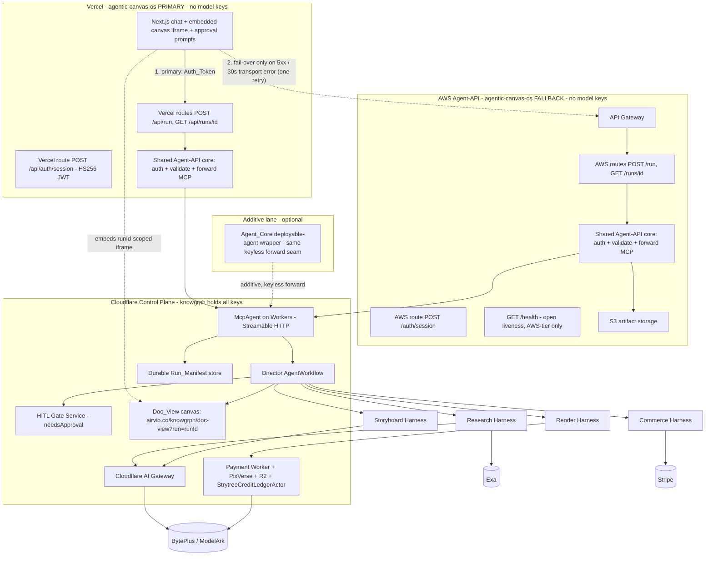
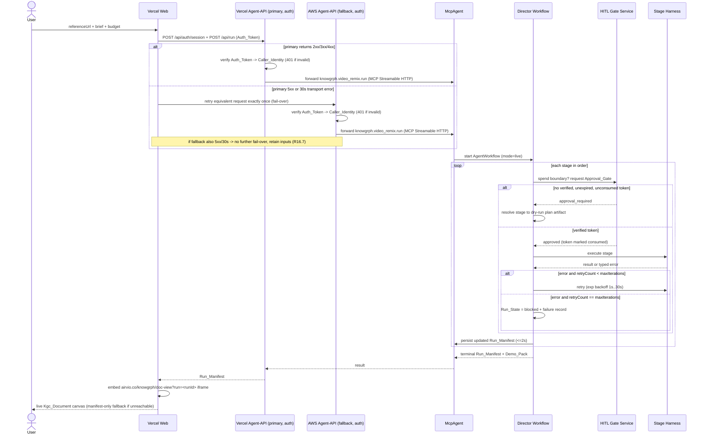
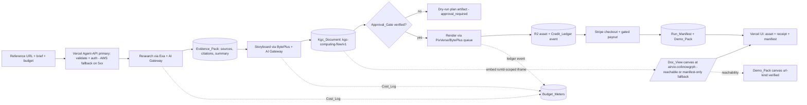
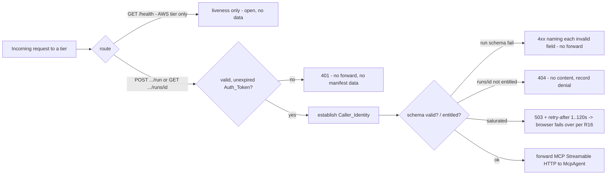

# Design Document

## Overview

This design specifies the **knowgrph ↔ agentic-canvas-os MCP connector**: a thin, approval-gated bridge that lets a single autonomous agent take a reference video URL plus a creative brief and drive a full research → storyboard → render → publish → checkout loop that ends in a sold asset. It refines the existing PRD/TAD (`knowgrph-mcp-agentic-canvas-os-prd-tad.md`, v0.3.1) and the 19 approved requirements into an implementable design.

This is a **documentation and planning artifact only**. No code is changed by this document; it grounds the eventual implementation in the existing knowgrph assets (`mcp/agentic-canvas-os-lanes.js`, `mcp/video-remix-runtime.js`, `cloudflare/workers/knowgrph-payment/strytreeApi.ts`, `StrytreeCreditLedgerActor`, `buildApprovalGates`, BytePlus/Exa/Stripe SSOTs) so the feature **reuses rather than rebuilds**.

### Design principles (project lenses)

- **min-viable-max-value** — one hero, fully gated end-to-end flow. The connector is a thin adapter layer over proven Cloudflare assets; new infra is limited to a **primary Vercel tier** (UI + same-origin serverless Agent-API routes) and a **fallback AWS tier** (API Gateway + Lambda + S3), both keyless. The canvas is embedded, not reimplemented.
- **tco-zero** — Vercel hobby for the primary path and AWS free-tier (API Gateway + Lambda + S3) for the fallback; the control plane and pipeline stay on Cloudflare. No always-on compute, no duplicated render path, and no second canvas renderer.
- **token-economics** — every model call routes through Cloudflare AI Gateway for caching, token counting, and a single Cost_Log source of truth; bounded retry and budget meters cap worst-case spend.
- **harness-first** — each stage is a self-contained harness with a typed input/output contract, a cost-log contract, and a defined fallback path, orchestrated by the Director.

### The four flow lenses (how the design is organized)

| Flow lens | Where addressed | Primary requirements |
|---|---|---|
| **User Flow** — creator, solo founder/orchestrator, judge journeys | Architecture › User Flow; Components (Frontend) | R1, R2, R3, R13 |
| **Work Flow** — Director run as durable `AgentWorkflow` with HITL gates + bounded retry | Architecture › Work Flow; Components (Director, Hitl_Gate_Service) | R4, R5 |
| **Data Flow** — reference URL → sold asset, Evidence_Pack, Kgc_Document round-trip, ledger consistency, Cost_Log | Architecture › Data Flow; Data Models | R6, R7, R8, R9, R10 |
| **Tech Stack** — per-repo boundaries, spend isolation, MCP forwarding, durable tool surface, auth, realized topology | Architecture › Tech Stack; Components (Agent_Api, Mcp_Agent, Auth, Canvas_Embed, Publish_Chain, Agent_Core) | R11, R12, R13, R14, R15, R16, R17, R18, R19 |

### Scope boundaries

- The **Control_Plane** (Cloudflare) is the only tier that holds model keys and invokes paid models. The product tiers (Vercel_Agent_Api, Aws_Agent_Api, and the additive Agent_Core lane) never hold model keys, never call paid models directly, and never bypass an approval gate (R11).
- **Realized topology (R16):** the **Vercel_Agent_Api is the primary/default product path** (same-origin serverless routes `POST /api/auth/session`, `POST /api/run`, `GET /api/runs/{id}`); the **Aws_Agent_Api is the fallback** (bare routes `POST /auth/session`, `POST /run`, `GET /runs/{id}`, `GET /health`), invoked by the browser only on a primary 5xx or 30s transport error. Both tiers share one platform-neutral, keyless Agent-API core that forwards `knowgrph.video_remix.run` to the Mcp_Agent over MCP Streamable HTTP.
- **Embedded canvas (R17):** the Frontend embeds the live knowgrph `doc-view` canvas after MCP-backed orchestration rather than reimplementing the renderer; knowgrph owns the canvas engine.
- **Additive AgentCore lane (R19):** the Agent_Core wrapper is a supplementary deployable-agent surface; the product is fully functional through the Vercel-primary / AWS-fallback path without it.
- Authentication on the Agent_Api gates *access* to spend and state endpoints; it **never substitutes** for an Approval_Token at a spend boundary (R15.9).
- The identity provider and Auth_Token issuance mechanism are resolved (HS256 JWT minted by the Agent_Api `POST /auth/session` / `POST /api/auth/session` using the FOSS `jsonwebtoken` library); the design remains implementation-agnostic so an OIDC provider, Cloudflare Access, or mTLS could later replace HS256 without changing the Auth_Token interface.

---

## Architecture

### Tech Stack — per-repo boundaries and spend isolation (R11, R12)

The two repos own distinct stacks. The product (`agentic-canvas-os`) delegates all reasoning and spend-bearing actions to the knowgrph control plane.

| Concern | `knowgrph` (Control_Plane, Cloudflare) | `agentic-canvas-os` (product) |
|---|---|---|
| Host | Workers + Pages (`airvio.co`, `airvio.co/knowgrph/mcp`) | **Vercel (primary)** — Frontend + same-origin Agent-API routes; **AWS (fallback)** — API Gateway + Lambda + S3 |
| Agent runtime | `McpAgent` + `AgentWorkflow` (Agents SDK) | thin clients calling the control plane |
| Model routing | Cloudflare AI Gateway (cache, token count, fallback, billing) | routes any model call through the same AI Gateway |
| Model keys | **holds all keys** (BytePlus/ModelArk, Exa, Stripe) | **holds none** |
| Paid model calls | **only tier permitted** | forwards to Mcp_Agent; never calls directly |
| HITL | `needsApproval` + Approval_Token gates | renders approval prompts |
| Auth | n/a (trusts authenticated forwarded calls) | Agent_Api authenticates callers (R15) |

**Hard boundary rule (R11.1–11.5):** the product tiers (Vercel_Agent_Api, Aws_Agent_Api, Agent_Core) host the user-reachable surface and durable artifacts but never hold model keys, never call paid models directly, and never bypass an approval gate. All model spend flows through Cloudflare AI Gateway; all paid actions pass an Agents SDK approval gate.

#### Component topology

The product runs as **two cooperating Agent-API tiers over one shared keyless core**: the Vercel tier is the default browser path; the AWS tier is the fail-over. The browser fails over to AWS only on a primary 5xx or 30s transport error, retries exactly once, and resumes primary-first routing on the next primary success (R16).



### User Flow — journeys mapped to components (R1, R2, R3, R13)

| Persona | Journey | Components engaged | Requirements |
|---|---|---|---|
| **End creator user** | Paste reference URL + brief + budget → review plan/budget → view cited evidence → view shot-plan on embedded canvas → approve gates → receive asset + Stripe checkout | Frontend → primary Vercel_Agent_Api `POST /api/run` (AWS fallback on 5xx) → Mcp_Agent → Director → Research/Storyboard/Render/Commerce harnesses → Frontend renders Run_Manifest, embedded Doc_View canvas, approval prompts, asset | R1.1–R1.9, R13.1–R13.5, R16, R17 |
| **Solo founder / orchestrator** | Call one MCP tool `knowgrph.video_remix.run` in live, approval-gated mode with observable spend | Mcp_Agent tool surface → Director → Budget_Meters/Cost_Log → Run_Manifest | R2.1–R2.6, R14.1–R14.6 |
| **Hackathon judge** | Inspect a Demo_Pack mapped to the seven judging dimensions with reachable `frontend`/`agent_api`/`canvas` URLs and verifiable evidence | Director assembles Demo_Pack → Vercel_Agent_Api `GET /api/runs/{id}` + Aws_Agent_Api `GET /health` + runId-scoped Doc_View canvas → Frontend | R3.1–R3.8 |

The creator never touches infrastructure: the Frontend validates input client-side (R1.2), mints an Auth_Token via `POST /api/auth/session` and forwards to the primary Vercel_Agent_Api within 2s (R1.1), displays planned stages and budget before any gate (R1.3), renders each Evidence_Pack source (R1.4), embeds the runId-scoped knowgrph Doc_View canvas with one visual node per planned shot (R1.5, R17), renders each gate's id + estimated cost (R1.6), and surfaces the asset + checkout once `payment-action` is approved (R1.7). Submission errors — including the case where both the primary Vercel tier and the AWS fallback fail — retain user input (R1.8, R16.7); manifest state changes are reflected at each transition (R1.9, R13.4).

### Work Flow — Director run as a durable AgentWorkflow (R4, R5)

The Director (`knowgrph.video_remix.run`) is an Agents SDK `AgentWorkflow` that sequences five stages strictly in order — **research → storyboard → render → publish → checkout** — beginning each stage only after the prior reaches `completed` (R4.1). It reuses `buildPlanner`, `buildToolCalls`, `buildApprovalGates`, and `buildFailureHandling` from `mcp/agentic-canvas-os-lanes.js` and the implemented `mcp/video-remix-runtime.js`.



**HITL gates (R4.2, R4.3, R4.7, R4.8, R11.6–11.8):** the Hitl_Gate_Service verifies a fresh Approval_Token *in the same operation that precedes each paid action* with no intervening spend-bearing operation, treats a token as valid only within 15 minutes of issuance, and marks a token **consumed** on use so it cannot authorize a second paid action. Missing/invalid/expired/consumed/mismatched tokens block the action, preserve prior state, and perform zero paid-provider calls.

**Bounded failure handling (R5):** a failing stage retries with exponential backoff starting at 1s, capped at 30s/attempt, incrementing `retryCount` by exactly 1 per retry (R5.1). Total iterations are bounded by `maxIterations` ∈ [1,100] (R5.2). While `retryCount < maxIterations`, Run_State stays `running` (R5.3); on reaching `maxIterations`, Run_State becomes `blocked` with a failure record `{ stageId, finalRetryCount, reason }` (R5.4). Total provider unavailability yields a structured degraded error and `blocked` without consuming additional retries (R5.5). A Stripe webhook that does not match a verified session withholds payout and appends a reconciliation flag (R5.6).

### Data Flow — reference URL to sold asset (R6–R10)



Key data-flow guarantees:
- **Research/attribution (R6):** Exa via AI Gateway yields an Evidence_Pack of 3–50 Source_Cards each with a unique `sourceId`; downstream storyboard claims must resolve to a `sourceId` present in the pack or be rejected. Exa failure → degraded summary with empty sources, `weak_signal`, no fabrication.
- **Storyboard (R7):** emits a Kgc_Document validating against `kgc-computing-flow/v1` with exactly one `flow.nodes[]` entry per planned shot (N ∈ [1,500]) and a parse→serialize→parse **round-trip** guarantee (R7.3). Validation failure → reject with no nodes emitted; reasoning failure → single-node fallback that still validates and round-trips.
- **Render/ledger (R8):** dispatch through the existing Strytree/BytePlus queue with a verified render token; each completed shot returns one asset reference + one Credit_Ledger event recording provider spend + provider identity; budget/keyless → deterministic mock provider with zero-spend ledger event.
- **Commerce (R9):** checkout + payout only when `payment-action` gate state is `approved`; otherwise no session, no settlement, payout left in pre-checkout state.
- **Cost logging / token economics (R10):** AI Gateway emits a Cost_Log per model call within 1s; the Director aggregates into Budget_Meters within 1s; the Credit_Ledger sum must equal Budget_Meters provider spend within ±0.01 USD or a reconciliation discrepancy is flagged.

---

## Components and Interfaces

### Frontend (`agentic-canvas-os/apps/web`, Vercel Next.js) — R1, R13, R16, R17

**Responsibility:** collect intent, validate input, render approval prompts and the Run_Manifest, surface assets/checkout. Holds no model keys; any model call routes through Cloudflare AI Gateway (R11.3).

**Key interfaces:**
- `openSession()` → mints an Auth_Token via the primary Vercel_Agent_Api `POST /api/auth/session` (R16.1, R1.1).
- `submitRun({ referenceUrl, brief, budgetUsd })` → validates client-side (R1.2), attaches the Auth_Token, calls the primary Vercel_Agent_Api `POST /api/run` within 2s (R1.1). On a primary 5xx or 30s transport error, fails over to the Aws_Agent_Api `POST /run` **exactly once** (R16.2); no fail-over on any 2xx/3xx/4xx primary response (R16.3). If the fallback also fails, shows an error and retains inputs (R1.8, R16.7).
- `routePolicy` → primary-first: always attempts the Vercel tier first and never retains sticky fallback state; resumes primary routing on the next primary success after any prior fail-over (R16.4).
- `renderApprovalPrompts(runManifest)` → one prompt per pending Approval_Gate within 2s, showing gate id + spend amount (R13.1, R1.6). Approval re-submitted with updated `approvals[]` to the primary `POST /api/run` within 2s (R13.2); on failure, retains prompt and allows up to 3 retries (R13.3).
- `renderManifest(runManifest)` → renders Run_State, full stage list, Budget_Meters within 2s of receipt (R13.4, R1.9); displays every Evidence_Pack source (R1.4).
- `embedCanvas(runManifest)` → once the storyboard Kgc_Document validates, embeds the runId-scoped knowgrph Doc_View canvas in an iframe within 2s and never reimplements the renderer (R17.1, R1.5); on unreachable/refused/non-success within 10s, falls back within 2s to a manifest-only view, indicates the canvas is unavailable, and preserves Run_Manifest state (R17.6). See the Canvas_Embed component.
- **503 fallback (R13.5):** on a primary HTTP 503, fail over to the Aws_Agent_Api per R16 and poll `GET /api/runs/{id}` every 5s for up to 12 attempts; resume normal primary operation on the first non-503 primary response.

### Agent_Api — two tiers over one shared keyless core (`agentic-canvas-os`) — R11, R12, R15, R16

**Responsibility:** the product's public compute surface — a **thin, stateless adapter** that authenticates callers, validates requests, and forwards MCP calls to the Mcp_Agent. Holds no model keys (R11.1, R11.2). It is realized by **two tiers that share one platform-neutral Agent-API core**:

- **Vercel_Agent_Api (primary/default)** — same-origin serverless routes `POST /api/auth/session`, `POST /api/run`, `GET /api/runs/{id}`. This is the default browser product path (R16.1).
- **Aws_Agent_Api (fallback)** — API Gateway + Lambda + S3 exposing `POST /auth/session`, `POST /run`, `GET /runs/{id}`, and `GET /health`. The browser invokes it only on a primary 5xx or 30s transport error (R16.2). `GET /health` is an AWS-tier-only open liveness route (R3.4, R15.6).

The shared core means both tiers apply identical schema validation, auth/entitlement, forwarding, and MCP-error-mapping logic; requirements that name `Agent_Api` without a tier apply to both. The browser owns the fail-over decision (R16.2–R16.4, R16.7); each tier independently enforces Auth_Token authentication, Caller_Identity entitlement, and Approval_Gate checks (R16.6).

**Request pipeline (every spend/state endpoint, both tiers):**



**Endpoints (primary Vercel route → AWS fallback route):**

| Vercel (primary) | AWS (fallback) | Auth (R15) | Behavior | Requirements |
|---|---|---|---|---|
| `POST /api/auth/session` | `POST /auth/session` | Open (mints token) | Mint an HS256 Auth_Token for the session; secret server-side only | R15.7, R16.1, R16.5 |
| `POST /api/run` | `POST /run` | Required Auth_Token → 401 if missing/invalid/expired | Validate `{ referenceUrl(≤2048, abs URL), brief(1–10000), budgetUsd(0.01–999,999,999.99), approvals[](0–100) }`; on pass forward `knowgrph.video_remix.run` within 2000ms; 4xx naming each invalid field on fail; 503 + retry-after on saturation | R12.1–R12.4, R15.1–R15.3, R15.9, R16.5 |
| `GET /api/runs/{id}` | `GET /runs/{id}` | Required Auth_Token → 401; entitlement check → 404 | Return current Run_Manifest within 1000ms for entitled caller; 404 for unknown id; 404 for unentitled caller (denial recorded) | R12.5–R12.6, R15.1, R15.4, R15.5 |
| — | `GET /health` | **Open**, no Auth_Token | AWS-tier-only liveness status; no Run_Manifest data, credentials, or config; HTTP 200 within 5s when healthy | R3.4, R15.6 |

**MCP error mapping (R12.7):** a typed MCP error from the Mcp_Agent maps either to a gate prompt or to a failure record in the Run_Manifest, preserving existing Run_Manifest state — identically on either tier.

**Secret handling (R15.7):** Auth_Token verification material and all authentication secrets are server-side only on both tiers — never in the client bundle, logs, or any response. Consistent with the stack boundary that the product tier holds no model provider keys.

### Authentication & Authorization layer (R15)

Implementation-agnostic by design. The Auth_Token is a verifiable, time-bounded caller credential **distinct from an Approval_Token**.

- **Verification (R15.1–R15.3):** the run and run-readback routes on both tiers (`POST /api/run` · `POST /run`; `GET /api/runs/{id}` · `GET /runs/{id}`) require a structurally valid, signature-valid, unexpired Auth_Token. Malformed/invalid-signature/expired → 401 with an error that reveals neither credential contents nor internal config. No MCP forwarding and no manifest disclosure on rejection. The fallback tier enforces the same authentication boundary as the primary (R16.6).
- **Caller_Identity (R15.2):** established from the Auth_Token before any processing; used for run-manifest authorization.
- **Entitlement / cross-tenant isolation (R15.4, R15.5):** a caller may read only runs it is entitled to. To avoid leaking run existence across sessions/tenants, the Agent_Api returns **HTTP 404** for both unknown runs and authenticated-but-unentitled runs, with no manifest content disclosed and a denied-access attempt recorded server-side.
- **Expiry window (R15.8):** an Auth_Token is expired once issuance age exceeds the configured window; window ∈ [5 minutes, 24 hours], default **60 minutes** when unset.
- **Auth ≠ approval (R15.9):** an accepted authenticated request still passes all Approval_Gate checks; authentication never substitutes for an Approval_Token at any spend boundary.

**Issuance mechanism.** The Auth_Token is a **stateless HMAC-signed JWT (HS256)** minted by the Agent_Api itself, issued by a thin `POST /api/auth/session` route on the primary Vercel tier (and `POST /auth/session` on the AWS fallback tier). The minted JWT carries `subject` (session id, used as Caller_Identity), `entitledRunIds` (populated as runs are created within that session), and standard `iat` / `exp` claims honoring the configured expiry window from R15.8 (default 60 minutes; configurable within [5 minutes, 24 hours]). Sign and verify use the FOSS [`jsonwebtoken`](https://github.com/auth0/node-jsonwebtoken) library on every Agent_Api Lambda. The signing secret is held in **AWS Secrets Manager** (or the Lambda environment for a single-region demo deployment) and is **server-side only** — never in the client bundle, logs, or any response, consistent with R15.7. There is no external IdP and no per-user database, which keeps the demo aligned with the project's KISS, FOSS, and tco-zero lenses while remaining future-swappable for Cloudflare Access / OIDC / mTLS without changing the implementation-agnostic Auth_Token interface used by the rest of this design.

### Mcp_Agent (`McpAgent` on Cloudflare Workers, Streamable HTTP) — R14

**Responsibility:** expose live, durable, stateful, approval-gated tools to remote clients at `airvio.co/knowgrph/mcp`. Migrates the existing HTTP MCP (`cloudflare/pages/knowgrph-agent-ready.mjs`) to an Agents SDK `McpAgent` (ADR-7).

**Interfaces:**
- **Tool surface (R14.1, R14.4):** lists `knowgrph.video_remix.run` and each stage tool (`research`, `storyboard`, `render`, `publish`, `checkout`), each with input + output schema.
- **Durable state (R14.2, R14.3):** on a run state change, persists the updated Run_Manifest within 2s so a later `GET /runs/{id}` returns the latest persisted state; on persistence failure, retains the most recently persisted state, returns a persistence-failure response, and emits an observability diagnostic.
- **Observability (R14.5):** on each stage transition emits a diagnostic `{ runId, fromStage, toStage, utcTimestamp, outcomeStatus }`.
- **Gate enforcement (R14.6):** a remote invocation of an approval-gated stage tool before approval is withheld, leaves Run_Manifest state unchanged, and returns "approval required".

### Director Orchestrator (`knowgrph.video_remix.run`, Agents SDK `AgentWorkflow`) — R2, R4, R5

**Responsibility:** sequence stages, enforce budget + approval gates, apply bounded-retry failure handling, aggregate Cost_Log/Budget_Meters, assemble Demo_Pack.

**Tool contract (R2.1):** input `{ referenceUrl, brief(1–5000), budgetUsd(0.01–100000.00), mode("live"|"dry-run"), approvals[](0–50) }`; output Run_Manifest `{ state, stages[], approvalGates[], budgetMeters, demoPack }` within 5s. Invalid input → reject naming the bad field, zero paid calls, no manifest (R2.2).

**Live without approvals (R2.3):** halt at first spend boundary, Run_State `blocked`, ≥5 Approval_Gate entries, `budgetMeters.estimatedCostUsd == 0`, exactly 0 paid-provider calls.

**Dry-run (R2.6, R4.4):** every spend-bearing step resolves to a plan artifact; zero paid calls; `actualCostUsd == 0`.

**Cost accounting (R2.4, R2.5, R10.3):** exactly one Cost_Log entry per model-bearing stage `{ stageId, estimatedCostUsd, actualCostUsd }`; Budget_Meters updated within 2s of each spend event (and within 1s of a Cost_Log emission per R10.3).

**Config:** `maxIterations` (default 8, ∈ [1,100]), `tokenBudget`, `tcoBudgetUsd`, `mode`, `AI_GATEWAY_ID`.

### Stage harnesses — R6, R7, R8, R9

| Harness | Tool(s) | Input → Output | Reuses | Requirements |
|---|---|---|---|---|
| **Research_Harness** | `…research` | `{ referenceUrl, query?, maxResults≤10 }` → `{ sources[], citations[], summary }` | `grph-shared/src/search/exaMcpSsot.ts`; BytePlus summary via AI Gateway | R6.1–R6.5 |
| **Storyboard_Harness** | `…storyboard` | `{ brief, evidencePack, shotCount? }` → `{ canvasDocumentMarkdown, flow:{nodes[],edges[]} }` (`kgc-computing-flow/v1`) | KGC frontmatter-flow path; BytePlus chat via AI Gateway | R6.3, R6.6, R7.1–R7.5 |
| **Render_Harness** | `…render` | `{ shots[], renderGateToken }` → `{ assets:[{ shotId, assetUrl, ledgerEventId, costCents }] }` | `strytreeApi.ts` (PixVerse/BytePlus queue, R2, `StrytreeCreditLedgerActor`) | R8.1–R8.6 |
| **Commerce_Harness** | `…publish`, `…checkout` | publish `{ assets[] }→{ publishedUrls[] }`; checkout `{ assetUrl, priceId, paymentGateToken }→{ sessionId }` | `payments.ts`, `agenticCommerce*.ts`, `stripeMcpSsot.ts` | R9.1–R9.4 |

Each harness emits the standard AI-Gateway Cost_Log and has a defined fallback (Research: degraded `weak_signal`; Storyboard: single-node fallback; Render: deterministic mock provider; Commerce: gate rejection / webhook reconciliation).

### Hitl_Gate_Service — R4, R11

**Responsibility:** issue, store, and verify per-gate Approval_Tokens using the Agents SDK `needsApproval` pattern. Reuses the `buildApprovalGates` gate-id catalog of **exactly six** gate ids: `paid-model-call`, `render-action`, `payment-action`, `cloud-deploy`, `consumer-repo-write`, `authenticated-browser`. The render stage uses its own `render-action` gate, distinct from `paid-model-call` (see Open Decisions › Resolved Decisions). The `cloud-deploy` gate governs the Publish_Chain deploy to Cloudflare (R18.4); `authenticated-browser` governs the in-browser authenticated session surface.

**Interface:** `{ gateId, decision, token }` in; verification on every paid action. Verification asserts the token is unexpired (≤15 min since issuance, R4.7), matches the requested action, and is **unconsumed**; on permit it marks the token consumed (R11.6–11.8). Failure → block, leave spend state unchanged, return an error identifying the failed check (R11.7, R4.8).

### Canvas_Embed (`agentic-canvas-os` Frontend ↔ knowgrph Doc_View) — R17

**Responsibility:** present the authoritative shot-plan by **embedding the live knowgrph Doc_View canvas** after MCP-backed orchestration, rather than reimplementing the renderer. The Frontend frames the knowgrph-hosted route `airvio.co/knowgrph/doc-view?run=<runId>[&doc=<docId>]` in an iframe; knowgrph owns the canvas engine (R17.1).

**Embedding flow & guarantees:**
- **When to embed (R17.1):** once a Run_Manifest whose storyboard Kgc_Document validates against `kgc-computing-flow/v1` is available, the Frontend embeds the Doc_View iframe within 2s and renders the document through no alternative/reimplemented renderer.
- **Cross-origin framing (R17.2):** the Doc_View route restricts framing via a `frame-ancestors` policy that permits embedding **only from the Vercel Frontend origin** and refuses framing from any other origin.
- **Run-scoped entitlement (R17.3, R17.4, R17.5):** the embedded document is scoped to the authenticated, entitled `runId`, enforcing the **same entitlement boundary as the R15 run-readback path**. An unentitled Caller_Identity is denied and no Kgc_Document content is rendered for that `runId`. The optional `&doc=<docId>` parameter is scoped under the same `runId` entitlement boundary.
- **Reachability bound & fallback (R17.6, R17.7):** the Canvas_Embed is treated as **reachable only when** the Doc_View route returns embeddable content within 10s and framing from the Vercel origin is permitted. If content does not load within 10s, framing is refused, or the route returns a non-success response, the Frontend falls back **within 2s** to a manifest-only view, indicates the embedded canvas is unavailable, and preserves the displayed Run_Manifest state unchanged.
- **One node per shot (R17.8):** for a Kgc_Document of N planned shots (1 ≤ N ≤ 500), the Canvas_Embed renders exactly one visual node per planned shot — the count of rendered nodes equals the count of `flow.nodes[]` entries — consistent with storyboard materialization (R7).
- **Demo_Pack linkage (R17.7, R3.8):** the reachability determination feeds the Director's verification of the Demo_Pack `canvas` url-kind entry — a `canvas` entry is verified only when the embedded runId-scoped canvas is reachable.

### Publish_Chain (Dev → Prod → Cloudflare) — R18

**Responsibility:** govern the one-directional artifact flow from the Dev source of truth to the live Cloudflare deployment, behind an operator-gated `cloud-deploy` Approval_Token, with drift detection that blocks deploys.

**Stages:**

```text
Dev (source of truth)   /Users/huijoohwee/Documents/GitHub/knowgrph
        │  build-sync  →  check-sync   (sync-verification record)
        ▼
Prod (artifact mirror)  huijoohwee/content/knowgrph
        │  deploy-cloudflare           (cloud-deploy Approval_Token gated)
        ▼
Cloudflare (live)       airvio.co · airvio.co/knowgrph · airvio.co/knowgrph/mcp
```

**Guarantees:**
- **Single source of truth (R18.1, R18.3):** Dev (`/Users/huijoohwee/Documents/GitHub/knowgrph`) is the sole source for all connector contracts, implementation, and documentation. No connector contract, route-specific fix, or other connector change may be authored directly in the Prod mirror or the Cloudflare artifact; every such change must originate in Dev.
- **Sync-only downstream (R18.2):** the Prod mirror (`huijoohwee/content/knowgrph`) and the Cloudflare deployment receive only artifacts generated or synced from Dev by the Publish_Chain.
- **Contract preservation (R18.6):** Dev → Prod sync preserves the Dev contract so the Mcp_Agent endpoint exposed to the product remains `airvio.co/knowgrph/mcp`.
- **Sync verification (R18.7):** on completing a Dev → Prod sync, the Publish_Chain verifies every synced Prod artifact corresponds to that sync's output and records a sync-verification result naming any non-corresponding artifact.
- **Deploy gating (R18.4, R18.5):** a Cloudflare deploy requires a `cloud-deploy` Approval_Token that is verified, unexpired (within the 15-minute Approval_Token window of R4), and unconsumed; the token is marked consumed once the deploy is permitted (single-use). An absent/invalid/expired/consumed token blocks the deploy, leaves the live deployment unchanged, and returns an error identifying the failed approval check.
- **Drift detection (R18.8):** if the Publish_Chain detects drift — a Prod mirror or Cloudflare artifact diverging from the current Dev → Prod sync output without a corresponding Dev sync — it flags the divergent artifact, blocks any Cloudflare deploy, and leaves the live deployment unchanged until the divergence is reconciled from Dev.

### Agent_Core lane (additive AWS AgentCore wrapper) — R19

**Responsibility:** provide an **additive, keyless deployable-agent surface** around the same control-plane forwarding seam. It is supplementary to — not a replacement for — the Vercel-primary / AWS-fallback REST path.

**Guarantees:**
- **Forward-only within 2000ms (R19.1):** on a run submission, the Agent_Core lane forwards the same `knowgrph.video_remix.run` call to the Mcp_Agent at `airvio.co/knowgrph/mcp` over MCP Streamable HTTP within 2,000ms of validation completion.
- **No routing change (R19.2, R19.3):** where the Agent_Core lane is deployed, the Vercel_Agent_Api remains the primary path and the Aws_Agent_Api remains the fallback — enabling the lane does not change the browser primary-first routing and single fail-over of R16. Where the lane is absent or not deployed, the Vercel-primary / AWS-fallback path provides full product capability without depending on it.
- **Keyless boundary (R19.4):** the lane holds no model provider keys and issues no direct paid-model requests, consistent with R11.
- **Own approval boundary (R19.5):** any paid action requested through the lane in Live_Mode requires an Approval_Token that is unexpired, matches the requested paid action, and is unconsumed; otherwise the action is blocked and all spend-bearing state is left unchanged.
- **Own auth boundary (R19.6):** the lane authenticates inbound callers with an Auth_Token at its exposed surface, applying the same R15-style authentication boundary as the Agent_Api, such that authentication never substitutes for an Approval_Token at any spend boundary.

---

## Data Models

All structures are persisted/serialized as JSON. The Mcp_Agent owns the durable Run_Manifest store (Workers durable storage); the Credit_Ledger is the existing `StrytreeCreditLedgerActor` Durable Object.

### Run_Manifest

```
Run_Manifest {
  runId: string
  state: Run_State                 // running | blocked | budget_exceeded | approval_required | verification_failed | completed
  mode: "live" | "dry-run"
  stages: Stage[]
  approvalGates: ApprovalGate[]
  budgetMeters: Budget_Meters
  demoPack: Demo_Pack | null
  failures: FailureRecord[]         // { stageId, finalRetryCount, reason }
  reconciliationFlags: string[]     // run ids / notes (R5.6, R10.5)
}

Stage {
  id: "research" | "storyboard" | "render" | "publish" | "checkout"
  status: "pending" | "running" | "approval_required" | "weak_signal" | "completed" | "blocked"
  retryCount: int                   // >= 0
  costLog: Cost_Log | null          // exactly one per model-bearing stage (R2.4)
  artifact: object | null           // plan artifact in dry-run / approval_required
}

ApprovalGate {
  gateId: "consumer-repo-write" | "cloud-deploy" | "paid-model-call" | "render-action" | "payment-action" | "authenticated-browser"
  approvalState: "pending" | "approved" | "rejected"
  estimatedCostUsd: decimal         // shown in UI (R1.6, R13.1)
  token: Approval_Token | null
}
```

### Approval_Token (distinct from Auth_Token)

```
Approval_Token {
  gateId: string
  issuedAt: timestamp               // valid only within 15 min (R4.7)
  consumed: boolean                 // single-use (R11.8)
  signature: string                 // verifiable
}
```

### Auth_Token / Caller_Identity (R15)

```
Auth_Token {                        // stateless JWT minted by Agent_Api POST /auth/session
  subject: string                   // maps to Caller_Identity (session id)
  entitledRunIds: set<string>       // populated as runs are created in the session (R15.4)
  issuedAt: timestamp               // JWT `iat`
  expiryWindowSeconds: int          // configured window in [300, 86400], default 3600 (R15.8)
  signature: string                 // HMAC-SHA256 (HS256) produced by the Agent_Api with a
                                    // server-side secret held in AWS Secrets Manager / Lambda env
                                    // (R15.7); verified via the FOSS jsonwebtoken library
}

Caller_Identity {
  principalId: string
  entitledRunIds: set<string>       // basis for GET /runs/{id} authorization (R15.4, R15.5)
}
```

### Evidence_Pack / Source_Card (R6)

```
Evidence_Pack {
  sources: Source_Card[]            // 3..50 on success (R6.1)
  citations: { sourceId, url }[]
  summary: string
}
Source_Card {
  sourceId: string                  // unique within the Evidence_Pack (R6.2)
  url: string
  platform: string
  evidenceLevel: string
}
```

### Kgc_Document (`kgc-computing-flow/v1`) (R7)

```
Kgc_Document {
  frontmatter: { schema: "kgc-computing-flow/v1", ... }
  flow: {
    nodes: Node[]                   // exactly one per planned shot; count == N, 1<=N<=500 (R7.2)
    edges: Edge[]
  }
}
Node { id: string, label: string, type: string, status: string }
Edge { from: string, to: string }
```

Equivalence for the round-trip property (R7.3) = identical node count, identical set of node ids, identical node ordering, and identical edge connections.

### Credit_Ledger event & Cost_Log (R8, R10)

```
CreditLedgerEvent {                 // StrytreeCreditLedgerActor
  ledgerEventId: string
  runId: string
  shotId: string
  provider: string                  // provider identity (R8.4)
  providerSpendUsd: decimal         // 0 for mock provider (R8.5)
}

Cost_Log {                          // emitted by Ai_Gateway within 1s (R10.1)
  model: string                     // non-empty, or "unknown" indicator (R10.2)
  prompt_tokens: int | "unknown"
  completion_tokens: int | "unknown"
  cache_hits: int
  estimated_cost_usd: decimal       // >= 0.00
  incomplete: boolean               // true when any token field unknown (R10.2)
}

Budget_Meters {
  estimatedCostUsd: decimal
  actualCostUsd: decimal            // 0 in dry-run (R2.6)
  providerSpendUsd: decimal         // reconciled vs ledger within +/-0.01 (R10.4)
}
```

### Demo_Pack (R3)

```
Demo_Pack {
  urls: { url, kind }[]             // kind: "frontend" | "agent_api" | "canvas"
                                    //   >=1 frontend URL + >=1 agent_api endpoint (R3.2)
                                    //   a canvas entry references the embedded, runId-scoped Doc_View
                                    //   canvas and is verified only when that embedded runId-scoped
                                    //   canvas is reachable (R3.8, R17.7)
  sections: DemoSection[7]          // one per judging dimension, each non-empty (R3.1)
}
DemoSection {
  dimension: string                 // Agent Overview | Autonomy | Actions/Tool Use | Orchestration | HITL | Failure Handling | Demo
  evidence: string                  // references Evidence_Pack citations, asset ref, Stripe session id where they exist (R3.6)
  verified: boolean                 // false when a URL/artifact is unverified/missing:
                                    //   frontend/agent_api URL not HTTP 200 within 5s (R3.3),
                                    //   canvas not reachable (R3.8), or artifact missing (R3.5, R3.7)
}
```

`urls[].kind` is one of `frontend`, `agent_api`, or `canvas`. A `frontend`/`agent_api` entry is verified when it returns HTTP 200 within 5s (R3.2, R3.3); a `canvas` entry is verified **only when** the embedded runId-scoped Doc_View canvas for the run is reachable per the Canvas_Embed reachability rule (R3.8, R17.7), and is otherwise marked unverified with the unreachable canvas URL recorded.

### Publish_Chain artifacts (R18)

```
SyncVerificationResult {            // emitted on each Dev -> Prod sync (R18.7)
  syncedArtifacts: { path, correspondsToDevSync: boolean }[]
  divergent: string[]               // artifacts that do not correspond (drift, R18.8)
}
DeployGate {                        // Cloudflare deploy gating (R18.4, R18.5)
  gateId: "cloud-deploy"
  token: Approval_Token | null      // verified, unexpired (<=15 min), single-use (R4, R11.8)
  blocked: boolean                  // true when token absent/invalid/expired/consumed or drift detected
}
```

---

## Correctness Properties

*A property is a characteristic or behavior that should hold true across all valid executions of a system — essentially, a formal statement about what the system should do. Properties serve as the bridge between human-readable specifications and machine-verifiable correctness guarantees.*

This feature's pure logic layers are well-suited to property-based testing — input validation, the approval-gate state machine, the Kgc_Document parser/serializer, ledger/budget accounting, the Demo_Pack assembler, the Agent_Api auth/authorization decision logic, the browser primary/fallback fail-over router, the canvas-embed entitlement and reachability determination, the publish-chain deploy gating and drift detection, and the AgentCore-lane forwarding/parity logic. External I/O (Exa, BytePlus/PixVerse, Stripe, AWS health, durable storage timing, iframe rendering, Cloudflare deploys) is exercised with mocks for property tests and with 1–3 examples in integration/smoke tests (see Testing Strategy). The properties below are the consolidated set produced by the prework reflection; each is annotated with the requirements it validates.

### Property 1: Approval-gate invariant for paid actions

*For any* paid action requested in Live_Mode — render dispatch, checkout/payout, any spend-bearing stage tool invoked directly over MCP, or a paid action requested through the additive Agent_Core lane — the action executes **only if** the presented Approval_Token is verified, matches the requested action's gate, is unexpired (issuance age ≤ 15 minutes), and has not been previously consumed; in every other case the action is blocked, no paid-provider call occurs, spend-bearing state is unchanged, and the rejection reason is recorded. On a permitted action the token is marked consumed so it can never authorize a second paid action. A valid Auth_Token never substitutes for an Approval_Token at any spend boundary.

**Validates: Requirements 4.2, 4.3, 4.7, 4.8, 8.2, 9.3, 11.6, 11.7, 11.8, 14.6, 15.9, 19.5**

### Property 2: Live-without-approvals halts with zero spend

*For any* valid `knowgrph.video_remix.run` input invoked in Live_Mode with an empty `approvals[]` array, the resulting Run_Manifest has Run_State `blocked`, at least 5 Approval_Gate entries, `budgetMeters.estimatedCostUsd` exactly 0, and exactly 0 paid-provider calls recorded.

**Validates: Requirements 2.3**

### Property 3: Dry-run performs zero paid actions

*For any* valid run input invoked in `mode:"dry-run"`, every spend-bearing step resolves to a plan artifact, exactly 0 paid-provider calls occur, and `budgetMeters.actualCostUsd` is exactly 0.

**Validates: Requirements 2.6, 4.4**

### Property 4: Director input validation rejects malformed runs

*For any* run input that omits a required field, supplies a `budgetUsd` outside [0.01, 100000.00], or supplies a `mode` other than `"live"`/`"dry-run"`, the Director rejects the call with an error naming the invalid field, performs zero paid-provider calls, and creates no Run_Manifest; conversely, *for any* fully valid input a Run_Manifest is produced.

**Validates: Requirements 2.1, 2.2**

### Property 5: Frontend input validation rejects malformed submissions

*For any* submission where the reference URL is empty or not a syntactically valid HTTP/HTTPS URL, or the brief is empty or exceeds 5,000 characters, or the budget cap is not a number in [0.01, 999,999.99], the Frontend rejects the submission, displays an error identifying the invalid field, and does not forward to the primary Vercel_Agent_Api `POST /api/run`.

**Validates: Requirements 1.2**

### Property 6: Agent_Api schema validation and forwarding decision

*For any* `POST /run` request, it is forwarded to the Mcp_Agent **iff** it satisfies the schema (`referenceUrl` absolute URL ≤ 2,048 chars, `brief` 1–10,000 chars, `budgetUsd` ∈ [0.01, 999,999,999.99], `approvals[]` 0–100 entries); any request failing the schema yields an HTTP 4xx naming each invalid field and reason, and no MCP call is forwarded.

**Validates: Requirements 12.1, 12.2, 12.3**

### Property 7: Stage ordering invariant

*For any* Director run started in Live_Mode, the observed stage start sequence is a prefix of `research → storyboard → render → publish → checkout`, and no stage begins before its immediately preceding stage has reached a completed state.

**Validates: Requirements 4.1**

### Property 8: Bounded-retry failure handling

*For any* stage that fails repeatedly, each retry increments `retryCount` by exactly 1, the backoff delay for every attempt lies within [1s, 30s] and is non-decreasing up to the cap, the total number of attempts never exceeds `maxIterations`, Run_State remains `running` while `retryCount < maxIterations`, and once `retryCount` reaches `maxIterations` the Run_State becomes `blocked` with an appended failure record `{ stageId, finalRetryCount, reason }`.

**Validates: Requirements 5.1, 5.3, 5.4**

### Property 9: Budget cap halts spend-bearing stages

*For any* run in which cumulative Budget_Meters spend reaches or exceeds the configured budget cap mid-run, the Director records `budget_exceeded`, halts all further spend-bearing stages, and surfaces a budget-exceeded indication.

**Validates: Requirements 4.6**

### Property 10: Source-card uniqueness and referential integrity

*For any* Evidence_Pack produced by the Research_Harness, every Source_Card `sourceId` is unique within the pack; and *for any* Storyboard_Harness output, every research-derived claim references at least one `sourceId` that resolves to a Source_Card present in the associated Evidence_Pack — a claim referencing a `sourceId` absent from the pack is rejected with an unresolved-source error.

**Validates: Requirements 6.2, 6.3, 6.6**

### Property 11: Weak-signal on insufficient sources without fabrication

*For any* research result yielding fewer than 3 Source_Cards, the Research_Harness marks the stage `weak_signal`, does not fabricate sources to reach the minimum, and the Director halts before the storyboard stage until a verified Approval_Token authorizes continuation.

**Validates: Requirements 4.5, 6.5**

### Property 12: Storyboard node count and schema validity

*For any* approved brief and plan of N planned shots (1 ≤ N ≤ 500), the emitted Kgc_Document validates against the `kgc-computing-flow/v1` schema and contains exactly N `flow.nodes[]` entries (non-empty).

**Validates: Requirements 7.1, 7.2**

### Property 13: Kgc_Document round-trip preservation

*For any* emitted Kgc_Document, parsing the document, serializing the parsed result, then parsing it again produces an equivalent flow structure — identical node count, identical set of node identifiers, identical node ordering, and identical edge connections between nodes.

**Validates: Requirements 7.3**

### Property 14: Storyboard fallback preserves validity and round-trip

*For any* storyboard reasoning failure, the emitted fallback Kgc_Document contains exactly one `flow.nodes[]` entry, validates against `kgc-computing-flow/v1`, satisfies the round-trip property, and is accompanied by an indication that fallback content was substituted.

**Validates: Requirements 7.5**

### Property 15: Render success yields exactly one asset and one ledger event

*For any* successfully rendered shot, the Render_Harness returns exactly one asset reference resolvable under the knowgrph media bucket and records exactly one Credit_Ledger event — capturing provider spend and provider identity — before returning the asset reference.

**Validates: Requirements 8.1, 8.3, 8.4**

### Property 16: Budget/keyless renders use the zero-spend mock provider

*For any* shot where no provider key is available or cumulative recorded provider spend for the run meets or exceeds the budget cap, the Render_Harness routes the shot to the deterministic mock provider and records a Credit_Ledger event with provider spend equal to zero.

**Validates: Requirements 8.5**

### Property 17: Payment gate governs all money movement

*For any* checkout attempt, a Stripe checkout session is created and the payout is settled (with a settlement confirmation observable to the caller) **iff** the `payment-action` Approval_Gate state is `approved`; for every other gate state no session is created, no payout is settled, and the payout remains in its pre-checkout state.

**Validates: Requirements 9.1, 9.2, 9.3**

### Property 18: Stripe webhook mismatch withholds payout

*For any* Stripe checkout webhook that does not match a verified session, the Commerce_Harness withholds the payout, leaves the payout amount unchanged, and appends a reconciliation flag identifying the affected run.

**Validates: Requirements 5.6**

### Property 19: Cost_Log field-domain validity

*For any* completed model call, the emitted Cost_Log contains a non-empty `model`, `prompt_tokens` and `completion_tokens` that are integers ≥ 0 or an explicit unknown indicator, `cache_hits` ≥ 0, and `estimated_cost_usd` ≥ 0.00; entries with unknown token counts are marked incomplete and retained rather than discarded.

**Validates: Requirements 10.1, 10.2**

### Property 20: Cost_Log aggregation correctness and one entry per model-bearing stage

*For any* set of emitted Cost_Logs in a run, the Director aggregates them into Budget_Meters such that the aggregated estimated/actual costs equal the sums of the corresponding Cost_Log fields, and each model-bearing stage has exactly one Cost_Log entry carrying its stage id, estimated cost, and actual cost.

**Validates: Requirements 2.4, 10.3**

### Property 21: Credit-ledger consistency or reconciliation flag

*For any* run, either the sum of recorded Credit_Ledger events equals the total provider spend reported in Budget_Meters within ±0.01 USD, or — when the deviation exceeds ±0.01 USD — the Director flags a reconciliation discrepancy and preserves both the Credit_Ledger events and the Budget_Meters values without modification.

**Validates: Requirements 10.4, 10.5**

### Property 22: Demo_Pack has seven non-empty sections with required URLs

*For any* Director run that reaches a terminal Run_State, the assembled Demo_Pack contains exactly seven non-empty evidence sections (one per judging dimension) and a `urls[]` collection containing at least one Frontend URL and at least one Agent_Api endpoint.

**Validates: Requirements 3.1, 3.2**

### Property 23: Demo_Pack artifact-reference completeness

*For any* terminal run, each of the Evidence_Pack citations, the rendered asset reference, and the Stripe session identifier is referenced in the Demo_Pack when it exists and is marked not available when it does not; any Demo_Pack URL that does not return HTTP 200 within 5 seconds causes its corresponding section to be marked unverified with the failing URL recorded.

**Validates: Requirements 3.3, 3.6, 3.7**

### Property 24: Typed MCP error mapping preserves manifest state

*For any* typed MCP error returned by the Mcp_Agent, the Agent_Api maps it either to a gate prompt or to a failure record in the Run_Manifest and preserves the existing Run_Manifest state for that run.

**Validates: Requirements 12.7**

### Property 25: Durable manifest persistence read-back consistency

*For any* Director run state change, after the Mcp_Agent persists the updated Run_Manifest a subsequent `GET /runs/{id}` for that run returns the latest persisted state.

**Validates: Requirements 14.2**

### Property 26: Tool listing exposes input and output schemas

*For any* remote client request for the tool surface, the returned list includes `knowgrph.video_remix.run` and each stage tool, and every listed tool includes both its input schema and its output schema.

**Validates: Requirements 14.4**

### Property 27: Stage-transition diagnostics are complete

*For any* stage transition during a Director run, the Mcp_Agent emits an observability diagnostic containing the run identifier, the originating stage id, the destination stage id, a UTC timestamp, and the transition outcome status.

**Validates: Requirements 14.5**

### Property 28: Agent_Api authentication rejection

*For any* request to `POST /run` or `GET /runs/{id}` carrying a missing, malformed, invalid-signature, or expired Auth_Token, the Agent_Api responds with HTTP 401, performs no MCP forwarding, discloses no Run_Manifest data, and returns an error that reveals neither credential contents nor internal configuration.

**Validates: Requirements 15.1, 15.3**

### Property 29: Cross-tenant run-manifest authorization

*For any* authenticated Caller_Identity established from a valid Auth_Token, a `GET /runs/{id}` returns the Run_Manifest **iff** that identity is entitled to the run; for a run the identity is not entitled to (including unknown runs), the response is HTTP 403 or 404 with no Run_Manifest content and a recorded denied-access attempt, so no run data crosses tenant boundaries.

**Validates: Requirements 15.2, 15.4, 15.5, 12.6**

### Property 30: Auth_Token expiry window bounds

*For any* configured expiry window, the Agent_Api treats an Auth_Token as expired exactly when its issuance age exceeds the window; the effective window is always within [5 minutes, 24 hours] and defaults to 60 minutes when unset.

**Validates: Requirements 15.8**

### Property 31: Liveness probe discloses nothing sensitive

*For any* `GET /health` request (with or without an Auth_Token), the Agent_Api responds without requiring authentication and restricts the response to liveness status, disclosing no Run_Manifest data, credentials, or internal configuration values.

**Validates: Requirements 15.6**

### Property 32: Manifest and approval-prompt rendering completeness

*For any* Run_Manifest received by the Frontend, the rendered output reflects the current Run_State, the complete stage list, and the Budget_Meters; and *for any* Run_Manifest containing pending Approval_Gate entries, exactly one approval prompt is rendered per pending gate, each displaying the gate identifier and the associated spend amount. The embedded canvas render contains exactly one visual node per planned shot in the Kgc_Document (count of rendered nodes equals the count of `flow.nodes[]` entries, for N ∈ [1,500]), and every Evidence_Pack source is displayed.

**Validates: Requirements 1.4, 1.5, 1.6, 1.9, 13.1, 13.4, 17.8**

### Property 33: Browser primary-first routing with single fail-over

*For any* sequence of Frontend requests and primary Vercel_Agent_Api responses, the Frontend directs each request to the primary tier first; it issues exactly one fallback request to the Aws_Agent_Api **iff** the primary response is an HTTP 5xx or a 30-second transport error, and issues **no** fallback request for any primary 2xx/3xx/4xx response; after any prior fail-over a subsequent primary success resumes primary-first routing with no sticky fallback state; and if the single fallback retry also returns 5xx or a 30-second transport error, no further fail-over occurs for that request and the caller's submitted inputs are retained unchanged.

**Validates: Requirements 13.5, 16.1, 16.2, 16.3, 16.4, 16.7**

### Property 34: Fallback tier enforces identical security boundary and forwarding target

*For any* run-bearing request and any tuple of (Auth_Token, Caller_Identity, run entitlement, Approval_Token) inputs, the Aws_Agent_Api fallback tier produces the same authentication, entitlement, and Approval_Gate accept/deny decision as the primary Vercel_Agent_Api would for the same inputs, both tiers forward the identical `knowgrph.video_remix.run` call to `airvio.co/knowgrph/mcp` over MCP Streamable HTTP, and neither tier holds or transmits model provider keys.

**Validates: Requirements 16.5, 16.6**

### Property 35: Canvas-embed run-scoped entitlement

*For any* Caller_Identity, requested `runId`, and optional `docId`, the embedded Doc_View canvas renders Kgc_Document content **iff** that identity is entitled to the `runId` under the same entitlement boundary that governs the R15 run-readback path; for an unentitled identity (or a `docId` outside the entitled `runId`) no Kgc_Document content is rendered for that `runId`.

**Validates: Requirements 17.3, 17.4, 17.5**

### Property 36: Canvas reachability determines fallback and Demo_Pack canvas verification

*For any* Canvas_Embed attempt, the embed is treated as **reachable iff** the Doc_View route returns embeddable content within 10 seconds **and** framing from the Vercel Frontend origin is permitted; when it is not reachable the Frontend falls back within 2 seconds to a manifest-only view, indicates the embedded canvas is unavailable, and preserves the displayed Run_Manifest state unchanged; and the Director marks the Demo_Pack `canvas` url-kind entry verified **iff** the embedded runId-scoped canvas is reachable, otherwise marking it unverified and recording the unreachable canvas URL.

**Validates: Requirements 3.8, 17.6, 17.7**

### Property 37: Cloud-deploy gating is single-use and fail-closed

*For any* Cloudflare deploy attempt, the deploy proceeds **only if** the presented `cloud-deploy` Approval_Token is verified, unexpired (issued within the 15-minute Approval_Token window), and not previously consumed; on a permitted deploy the token is marked consumed so it cannot authorize a second deploy; in every other case (token absent, invalid, expired, or already consumed) the deploy is blocked, the live Cloudflare deployment is left unchanged, and an error identifying the failed approval check is returned.

**Validates: Requirements 18.4, 18.5**

### Property 38: Publish-chain sync verification and drift blocking

*For any* Dev → Prod sync, the Publish_Chain records a sync-verification result whose flagged set is exactly the Prod/Cloudflare artifacts that do not correspond to that sync's Dev output; and *for any* detected drift (a Prod or Cloudflare artifact diverging from the current Dev → Prod sync output without a corresponding Dev sync), the Publish_Chain flags the divergent artifact, blocks any Cloudflare deploy, and leaves the live deployment unchanged until the divergence is reconciled from the Dev source.

**Validates: Requirements 18.7, 18.8**

### Property 39: AgentCore lane is forward-only, routing-neutral, and auth-bounded

*For any* run submission to the Agent_Core lane, the lane forwards the identical `knowgrph.video_remix.run` call to `airvio.co/knowgrph/mcp` over MCP Streamable HTTP, makes no direct paid-model-provider request, and holds no model provider keys; the lane authenticates inbound callers with an Auth_Token applying the same R15 boundary as the Agent_Api (authentication never substituting for an Approval_Token); and *for any* browser routing scenario, the routing decision is identical whether or not the Agent_Core lane is deployed — the Vercel_Agent_Api remains primary and the Aws_Agent_Api remains the single fail-over per Property 33.

**Validates: Requirements 19.1, 19.2, 19.3, 19.4, 19.6**

---

## Error Handling

Error handling follows a **fail-closed, evidence-preserving** discipline: when in doubt, the system blocks spend, preserves prior state, and records why.

### Input and request errors
- **Frontend validation (R1.2):** invalid URL/brief/budget rejected client-side with a field-specific message; no `POST /run` forwarded; inputs retained.
- **Agent_Api schema validation (R12.1, R12.3):** invalid `POST /run` → HTTP 4xx naming each invalid field; no MCP forward.
- **Director validation (R2.2):** invalid tool input → error naming the field; zero paid calls; no Run_Manifest.

### Authentication and authorization errors (R15)
- Missing/malformed/expired/invalid-signature Auth_Token on `POST /run` or `GET /runs/{id}` → **401**, no forward, no manifest disclosure, error free of credential/config detail (R15.1, R15.3).
- Authenticated but unentitled `GET /runs/{id}` → **404** (matches the response for unknown runs to avoid leaking run existence), no content, denial recorded (R15.5).
- `GET /health` never requires auth and never discloses sensitive data (R15.6).

### Capacity and availability errors
- **Agent_Api saturation (R12.4):** in-flight forwarded calls at max concurrency → **503** + `retry-after` ∈ [1,120]s. On a primary 503 the Frontend fails over to the Aws_Agent_Api per R16 and polls `GET /api/runs/{id}` every 5s up to 12 attempts, resuming primary operation on the first non-503 primary response (R13.5).
- **All providers unavailable (R5.5):** affected harness returns a structured degraded error identifying unavailable providers; Director sets `blocked` without consuming additional retries.

### Topology fail-over and embed errors
- **Primary tier failure (R16.2, R16.7):** a primary 5xx or 30s transport error triggers exactly one fallback request to the Aws_Agent_Api; no fail-over occurs on any 2xx/3xx/4xx (R16.3). If the fallback retry also returns 5xx/30s transport error, the Frontend performs no further fail-over, shows an error that the request could not be completed, and retains submitted inputs unchanged.
- **Canvas unreachable/refused (R17.6):** if the Doc_View embed does not load embeddable content within 10s, framing is refused, or the route returns a non-success response, the Frontend falls back within 2s to a manifest-only view, indicates the canvas is unavailable, and preserves Run_Manifest state. The unreachable canvas URL is recorded and the Demo_Pack `canvas` entry is marked unverified (R3.8, R17.7).
- **Canvas entitlement denial (R17.4, R17.5):** an unentitled `runId`/`docId` request to Doc_View is denied with no Kgc_Document content rendered, mirroring the R15 run-readback boundary.

### Deploy and publish-chain errors (R18)
- **Deploy gate failure (R18.5):** a `cloud-deploy` Approval_Token that is absent/invalid/expired/consumed blocks the deploy, leaves the live Cloudflare deployment unchanged, and returns an error identifying the failed approval check.
- **Drift detected (R18.8):** a Prod/Cloudflare artifact diverging from the current Dev → Prod sync output without a corresponding Dev sync is flagged; any Cloudflare deploy is blocked and the live deployment left unchanged until reconciled from Dev.

### Stage execution errors (bounded retry, R5)
- Single-stage failure → exponential backoff (1s start, 30s cap), `retryCount += 1` per attempt, bounded by `maxIterations`; on exhaustion → `blocked` + failure record `{ stageId, finalRetryCount, reason }`.

### Data-flow errors
- **Research (R6.4):** Exa error/timeout → degraded summary, empty sources, `weak_signal`, partial input retained, no fabrication.
- **Storyboard (R7.4, R7.5):** schema-invalid Kgc_Document → reject, emit no nodes; reasoning failure → single-node fallback that validates and round-trips, flagged as fallback.
- **Render (R8.6):** dispatch failure or no asset within 120s → error identifying the failed shot, ledger event reflecting actual spend, previously rendered assets unchanged. Keyless/over-budget → mock provider, zero-spend ledger event (R8.5).
- **Commerce (R9.4, R5.6):** session/settlement failure after approval → no settlement, error naming the failed operation, payout preserved; webhook mismatch → payout withheld + reconciliation flag.
- **Cost/ledger (R10.2, R10.5):** unknown token counts → explicit unknown indicator, entry marked incomplete and retained; ledger/meter deviation > ±0.01 → reconciliation discrepancy flagged, both values preserved.

### Persistence and MCP transport errors
- **Manifest persistence failure (R14.3):** retain most-recently-persisted state, return persistence-failure response, emit diagnostic.
- **Typed MCP error (R12.7):** mapped to a gate prompt or a failure record; existing Run_Manifest state preserved.
- **Gated tool invoked pre-approval (R14.6):** withhold execution, leave state unchanged, return "approval required".

---

## Testing Strategy

A dual approach: **property-based tests** verify universal invariants across generated inputs; **unit/example tests** cover specific scenarios and error paths; **integration/smoke tests** verify external wiring and timing that property tests deliberately mock out.

### Property-based tests
- Use a property-based testing library for the target language (Director/harness logic in JS/TS via `fast-check`; do not hand-roll generators).
- **Minimum 100 iterations** per property test.
- Each property test is tagged with a comment referencing its design property in the form: **Feature: knowgrph-acos-mcp-connector, Property {number}: {property_text}**.
- Each correctness property (Properties 1–39) is implemented by a **single** property-based test.
- External dependencies (Exa, BytePlus/PixVerse, Stripe, AWS health, durable storage, iframe rendering/reachability, Cloudflare deploys) are **mocked** in property tests so the logic layer is exercised cheaply at 100+ iterations. Generators must include edge cases called out in the prework: empty/whitespace strings, non-HTTP URLs, out-of-range budgets, N at the [1,500] boundaries, token ages straddling the 15-minute and configured-expiry windows, ledger deviations straddling ±0.01, saturation at the concurrency limit, primary response codes across {2xx,3xx,4xx,5xx,transport-timeout}, canvas load/framing outcomes straddling the 10s reachability bound, and `cloud-deploy` token states across {valid, absent, invalid, expired, consumed}.

Key generator notes:
- **Property 13 (Kgc_Document round-trip):** generate arbitrary valid `kgc-computing-flow/v1` documents with varied node counts, id sets, orderings, and edge sets; assert equivalence after parse→serialize→parse.
- **Property 21 (ledger consistency):** generate render/spend event sequences (including mock-provider zero-spend events) and assert the consistency-or-flag invariant.
- **Property 1 (approval gate):** generate paid actions paired with tokens across the matrix {valid, expired, consumed, mismatched, absent} and an independent valid/invalid Auth_Token, asserting execution iff the Approval_Token is fully valid and that auth never substitutes for approval — across the render/checkout/MCP-direct **and** Agent_Core lane boundaries (R19.5).
- **Properties 28–30 (auth/authz):** generate Auth_Tokens across {valid, malformed, bad-signature, expired} and identity/run entitlement pairs; assert rejection, cross-tenant isolation, and expiry-window bounds. Tests are written against the implementation-agnostic Auth_Token interface, so the same generators continue to apply if HS256 is ever swapped for OIDC / Cloudflare Access / mTLS.
- **Property 33 (fail-over routing):** generate sequences of primary response codes including transport timeouts; assert primary-first ordering, exactly-one fail-over only on 5xx/timeout, no fail-over on 2xx/3xx/4xx, primary resumption after success, and no further fail-over plus input retention when the fallback also fails.
- **Property 34 (tier parity):** drive the shared Agent-API core decision function for both tiers with identical (token, identity, run, approval) inputs; assert identical decisions and an identical forwarding target.
- **Properties 35–36 (canvas embed):** generate identity/runId/docId entitlement pairs and (loaded-within-10s?, framing-permitted?) outcome combinations; assert content rendered iff entitled, reachable iff both conditions hold, manifest-only fallback otherwise, and Demo_Pack `canvas` verified iff reachable.
- **Property 37 (cloud-deploy gating):** generate `cloud-deploy` tokens across the state matrix; assert deploy proceeds iff fully valid, token consumed on permit, and live deployment unchanged otherwise.
- **Property 38 (publish-chain):** generate Dev sync outputs vs Prod/Cloudflare artifact sets; assert the flagged divergent set is computed correctly and that any drift blocks the deploy.
- **Property 39 (AgentCore lane):** assert forward-only behavior (identical MCP target, no direct paid call), R15-equivalent inbound auth, and routing-neutrality by running the Property 33 routing model with the lane present and absent and asserting identical decisions.

### Unit / example tests
- Specific UI flows and timing-bound behaviors: forward within 2s (R1.1), planned stages shown before gates (R1.3), asset + checkout after approval (R1.7), approval decision transmission (R13.2), `GET /api/runs/{id}` happy path (R12.5), embed Doc_View iframe when Kgc_Document valid using no reimplemented renderer (R17.1), manifest-only fallback within 2s on unreachable canvas (R17.6).
- Error-path edge cases as enumerated examples: submission error/timeout retention across both tiers (R1.8, R16.7), health retry-then-record (R3.5), all-providers-down (R5.5), invalid Kgc_Document (R7.4), render dispatch failure/timeout (R8.6), post-approval Stripe failure (R9.4), unknown-token-count Cost_Log (R10.2), saturation 503 (R12.4), unknown-id 404 (R12.6), approval transmit failure retries (R13.3), 503 polling fallback (R13.5), persistence failure (R14.3).

### Integration tests (1–3 examples each)
- Agent_Api → Mcp_Agent MCP Streamable HTTP forwarding from both tiers (R12.2, R16.5), and Agent_Core lane forwarding within 2000ms (R19.1).
- Control-plane model calls routing through Cloudflare AI Gateway (R11.2, R11.4).
- `GET /health` returns 200 within 5s on the deployed AWS fallback endpoint (R3.4); Demo_Pack `frontend`/`agent_api`/`canvas` URL reachability (R3.2, R3.8).
- Doc_View `frame-ancestors` permits only the Vercel origin and refuses others (R17.2).
- Budget_Meters update timing on live spend events (R2.5).
- Cloudflare deploy gated by a `cloud-deploy` token and blocked on drift, against a mocked/staging deploy seam (R18.4, R18.8).

### Smoke / static-scan tests (single execution)
- Secret-scan that no model provider keys exist in the Vercel_Agent_Api, Aws_Agent_Api, Agent_Core lane, Mcp_Agent, or Frontend tiers (R11.1, R11.3, R11.5, R16.5, R19.4).
- Secret-scan that no auth secret appears in the Frontend client bundle, logs, or responses (R15.7).
- Tool-surface connectivity over Streamable HTTP (R14.1).
- Publish-chain checks that Prod/Cloudflare artifacts are Dev sync outputs and the Mcp_Agent endpoint constant remains `airvio.co/knowgrph/mcp` (R18.1, R18.2, R18.3, R18.6).

### Why some criteria are not property-tested
Per the prework classification, architectural/configuration constraints (R11.1, R11.3, R11.5, R15.7, R14.1, R16.5 key-absence, R18.1–R18.3, R18.6, R19.4 key-absence) are verified by static scans and smoke tests rather than PBT, because their behavior does not vary with input and 100 iterations add no value. Timing- and external-service-bound criteria (forwarding latency, AI-Gateway routing, AWS health, Stripe/Exa/BytePlus calls, iframe framing policy, Cloudflare deploy latency) are verified with a small number of integration examples; their pure decision logic (fail-over routing, entitlement, reachability propagation, deploy gating, drift detection) is captured by the properties above using mocks.

---

## Reused knowgrph assets (reuse-not-rebuild)

| Design element | Existing asset |
|---|---|
| Director, planner, gates, failure handling, demo pack | `mcp/agentic-canvas-os-lanes.js` (`buildPlanner`, `buildToolCalls`, `buildApprovalGates`, `buildFailureHandling`) |
| Video-remix runtime + stage tools | `mcp/video-remix-runtime.js`, `mcp/agentic-canvas-os-runtime.js` |
| MCP tool registration | `mcp/server.js`, `mcp/local-tool-contract.js`; canvas contract `canvasknowgrphVdeoxplnContract.mjs` |
| Deployed HTTP MCP → `McpAgent` migration | `cloudflare/pages/knowgrph-agent-ready.mjs` (ADR-7) |
| Render pipeline + credit ledger | `cloudflare/workers/knowgrph-payment/strytreeApi.ts`, `StrytreeCreditLedgerActor` |
| Commerce / Stripe | `cloudflare/workers/knowgrph-payment/payments.ts`, `agenticCommerce*.ts`, `grph-shared/src/payments/stripeMcpSsot.ts` |
| Research / Exa | `grph-shared/src/search/exaMcpSsot.ts` |
| Reasoning + media models | `canvas/src/features/integrations/byteplus*Ssot.ts` |
| KGC frontmatter-flow / canvas | `canvas/src/features/agent-ready/*`, KGC apply path (`kgc-computing-flow/v1`) |
| Readiness checks | `scripts/check-agent-ready.mjs` |
| Local MCP contract coverage | `canvas/src/__tests__/mcpLocalToolContract.test.ts` |

## Open Decisions

### Resolved Decisions

- **Agent-API topology re-baseline — Vercel-primary / AWS-fallback (R12, R16) — RESOLVED (v0.3.1):** the **Vercel_Agent_Api is the primary/default product path** (same-origin serverless routes `POST /api/auth/session`, `POST /api/run`, `GET /api/runs/{id}`) and the **Aws_Agent_Api is the fallback** (bare routes `POST /auth/session`, `POST /run`, `GET /runs/{id}`, `GET /health`). The browser invokes the AWS tier only on a primary 5xx or 30s transport error, retries exactly once, never fails over on a 2xx/3xx/4xx, and resumes primary-first routing on the next primary success (R16.2–R16.4, R16.7). Both tiers share **one platform-neutral, keyless Agent-API core** (identical schema validation, auth/entitlement, MCP forwarding, and error mapping); `GET /health` remains an AWS-tier-only open liveness route (R3.4, R15.6). *Rationale:* the same-origin Vercel path is the lowest-latency, cookie/session-friendly default for the browser and the immediate high-ROI product seam (the backend already accepts re-submitted `approvals[]`), while the proven AWS Lambda tier provides a keyless fail-over and operator proof surface — preserving min-viable-max-value and tco-zero without a second canvas renderer or a duplicated model-spend path. This re-baselines the earlier design framing that treated the AWS Agent-API as the single/primary product backend; the prior AWS-centric Resolved Decisions below still hold for the AWS tier and the AgentCore lane, now read under this primary/fallback split.
- **Identity provider & Auth_Token issuance mechanism (R15) — RESOLVED:** **stateless HMAC-signed JWT (HS256)** issued by the Agent_Api itself via a thin `POST /api/auth/session` route (primary Vercel tier) and `POST /auth/session` (AWS fallback tier), using the FOSS [`jsonwebtoken`](https://github.com/auth0/node-jsonwebtoken) library for sign/verify. The minted JWT carries `subject`, `entitledRunIds`, `iat`, and `exp`, honoring the 60-minute default expiry window from R15.8 (configurable within [5 minutes, 24 hours]). The HS256 signing secret is stored in AWS Secrets Manager (or the Lambda/Vercel environment for a single-region demo) and is server-side only per R15.7. *Rationale:* KISS (no external IdP, no per-user database), FOSS (`jsonwebtoken` is MIT-licensed and battle-tested), tco-zero (purely route-resident; no auth subsystem to host or pay for), demo-friendly (a fresh session is one HTTP call away), and future-swappable (the implementation-agnostic Auth_Token interface used elsewhere in this design lets Cloudflare Access / OIDC / mTLS replace HS256 without touching the rest of the system).
- **403 vs 404 for unentitled `GET /runs/{id}` (R15.5) — RESOLVED:** return **HTTP 404 for both unknown runs and authenticated-but-unentitled runs**, with no manifest content disclosed and a denied-access attempt recorded server-side. *Rationale:* prevents leaking run existence across sessions/tenants (an unentitled 403 would confirm the run exists), matches the cross-tenant isolation property already asserted by Property 29, and keeps the Agent_Api's externally observable behavior uniform across the two cases.
- **`render-action` vs `paid-model-call` gate-id discrepancy (R4.2, R8.1, R8.2) — RESOLVED:** the render spend boundary **keeps its own `render-action` gate**; it is **not** merged into `paid-model-call`. The render harness runtime, the McpAgent tool registry, and `director-workflow.js` all flagged that `render-action` was absent from the design Glossary's five-item enumeration. The requirements, however, explicitly call for a *distinct* render gate — R4.2 ("a verified, unexpired Approval_Token for **the render Approval_Gate**"), R8.1/R8.2 ("a valid, unexpired render Approval_Token"), and the Render_Harness contract input `renderGateToken`. The canonical catalog is therefore the six-gate `APPROVAL_GATES` set that `buildApprovalGates` projects from (`consumer-repo-write`, `cloud-deploy`, `paid-model-call`, `render-action`, `payment-action`, `authenticated-browser`); the Glossary's five-item list was an incomplete enumeration and is corrected accordingly. *Rationale:* (1) requirements explicitly require a separate render gate; (2) `render-action` (BytePlus/PixVerse render-queue spend) is a different risk class from `paid-model-call` (Exa/BytePlus provider token spend); (3) single-use token semantics would be weakened by merging — one `paid-model-call` token could not independently authorize research, storyboard, *and* render; (4) the runtime, worker boundary, and tests already treat `render-action` as canonical, so keeping it avoids churn (min-viable-max-value, tco-zero). The Approval_Token issuer (`mcp/video-remix/approval-token-issuer.js`) derives its gate-id catalog directly from `APPROVAL_GATES` so the issuer and the harness gate ids cannot drift.
- **AgentCore Runtime artifact shape under R11 (R11.1, R11.2, R11.5) — RESOLVED (audit decision, task 13.0, BLOCKING):** the AWS AgentCore Runtime artifact is a **thin MCP-forwarding adapter** — it forwards `knowgrph.video_remix.run` plus the stage tools (`research`, `storyboard`, `render`, `publish`, `checkout`) to the Cloudflare `McpAgent` over MCP Streamable HTTP — and is **NOT** a Bedrock-model-invoking reasoning agent. *Consequences enforced by this decision:* (1) AWS holds **no model keys** in any config, environment value, request, or response (R11.1, R11.5); (2) AWS **invokes no paid model directly** — every reasoning and spend-bearing action is forwarded to the Cloudflare control plane, which remains the only tier that holds model keys and calls paid models (R11.2, R11.5); (3) **AWS Bedrock model invocation stays off the MVP path**, consistent with PRD ADR-3 ("the Lambda is a thin adapter that forwards to the control-plane `McpAgent`. AWS holds no model keys; AWS Bedrock is deferred/optional, not on the MVP path"). This makes the AgentCore Runtime artifact behaviorally identical to the API Gateway + Lambda Agent_Api adapter (Section "Agent_Api") — same forward-only contract, same no-keys boundary — differing only in the AWS hosting surface. *Rationale:* keeping AgentCore a forwarding adapter preserves the single, observable model-spend path through Cloudflare AI Gateway, upholds the R11 hard boundary rule that no tier other than the Control_Plane holds model keys or invokes paid models, and avoids splitting token accounting or introducing AWS model spend (min-viable-max-value, tco-zero, token-economics). *Property linkage:* the approval-gate invariant (**Property 1**) continues to hold at the McpAgent boundary regardless of whether the forwarded call originates from API Gateway/Lambda or from the AgentCore Runtime, because the AgentCore artifact performs no paid action of its own — it only forwards, and every spend boundary is still gated by a verified, unexpired, unconsumed Approval_Token on the Cloudflare control plane.
- **AgentCore Runtime vs the API Gateway + Lambda adapter (R11, R12) — RESOLVED (audit finding, task 13.11):** the AgentCore Runtime **complements** the existing API Gateway + Lambda + S3 tier — it does **not** replace it. The API Gateway + Lambda + S3 tier keeps the product **REST** surface the Vercel frontend already integrates with (`POST /auth/session` Auth_Token minting, `POST /run`, `GET /runs/{id}`, `GET /health`, S3 artifacts), while the AgentCore Runtime hosts the durable streamable-HTTP **MCP tool surface** (`tools/list`, `knowgrph.video_remix.run` + stage tools, `/ping`) as the AWS-tier "deployable agent" judging artifact. Both are **keyless thin forwarders** to the Cloudflare `McpAgent` (no model keys, no direct paid-model invocation), so R11 holds identically on either entry path and no new AWS spend boundary is introduced (Property 1 unchanged, per task 13.0). *Rationale:* the frontend already binds to the REST endpoints (`NEXT_PUBLIC_AGENT_API_URL`); replacing them with a pure MCP surface would force a frontend rewrite and drop the REST `auth/session` minting, `GET /runs/{id}` read-back, and S3 artifact roles for zero spend-isolation or cost benefit (the MCP surface is already keyless) — failing min-viable-max-value and tco-zero. The two AWS deploys (task 11.2 REST tier; tasks 13.9–13.10 AgentCore Runtime) are both retained and independently `cloud-deploy`-gated. *Recorded in full* in `knowgrph/docs/knowgrph-acos-topology-decision.md` ("AgentCore Runtime vs API Gateway + Lambda — replace or complement?").
- **AgentCore MCP server container runtime/language (Node vs Python FastMCP) (R11.1, R12.2, R14.1) — RESOLVED (audit finding, task 13.12):** the AgentCore MCP server container is **Node-based (option a)** — it honors the AgentCore Runtime MCP contract (stateless streamable-HTTP MCP at `0.0.0.0:8000/mcp`, `/ping` liveness, ARM64) by **reusing the existing Node/TS forwarder** (`aws/agent-api/src/lib/mcp-forwarder.js`), and is **NOT** ported to Python FastMCP despite the `agentcore-samples` `02-hosting-MCP-server` tutorial using FastMCP. This is already realized by task 13.1: `knowgrph/aws/agentcore/src/mcp-server.js` + `server.js` + an ARM64 `node:20-slim` `Dockerfile`. *Rationale:* the sample's Python FastMCP choice is a tutorial implementation detail, not a contract requirement — the AgentCore MCP contract is language-agnostic (transport, bind target, `/ping`, ARM64 packaging). Reusing the already-green Node forwarder keeps a **single SSOT** for the MCP Streamable HTTP transport shared with the API Gateway + Lambda REST adapter (one place for the 2,000 ms deadline / Property 6 and SSE/JSON-RPC parsing), avoids a parallel Python reimplementation with its own toolchain and drift risk, and adds no second-language CI cost (reuse-over-rebuild, min-viable-max-value, tco-zero). *R11 preserved either path:* the AgentCore artifact is a thin forwarder (task 13.0) that holds **no model keys** in any config, env value, request, or response and invokes **no paid model directly** — language choice does not touch this boundary (Node and Python forwarders are both keyless), and the handler fails closed (HTTP 501) when `MCP_ENDPOINT` is unset, so no accidental live/paid call occurs. *Property linkage:* Property 1 is unchanged — the Node forwarder performs no paid action and duplicates no gate logic, relaying a control-plane "approval required" response unchanged. *Recorded in full* in `knowgrph/docs/knowgrph-acos-topology-decision.md` ("AgentCore MCP server — container runtime / language (Node vs Python FastMCP)").

### Still deferred (carried from PRD/TAD)

- Frontend framework choice (Next.js vs reuse Vite canvas).
- Checkout model (one-time vs subscription).
- Exa connection mode (hosted-free vs API-key).
- `McpAgent` migration cadence.
- BytePlus model ids and per-model AI Gateway cache TTLs.
