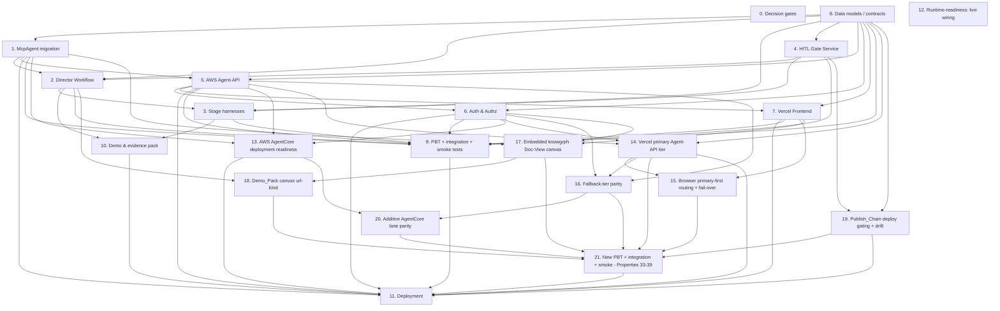
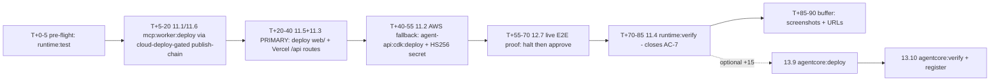

# Implementation Plan

## Overview

This is the implementation task list for the **knowgrph ↔ agentic-canvas-os MCP connector**, derived from the approved `requirements.md` (19 requirements) and `design.md` (39 correctness properties). It is **planning only** — no code changes begin until the user explicitly instructs. Every leaf task is actionable, traces back to specific requirement numbers (e.g., R7.3, R16.2) and design properties (e.g., Property 13, Property 33), and is sized for a single focused work session.

> **v0.3.1 topology re-baseline (Sections 14–21, new).** The PRD/TAD v0.3.1 re-baseline (Vercel-primary / AWS-fallback topology, embedded knowgrph Doc-View canvas, render-action gate, Dev→Prod→Cloudflare publish chain with `cloud-deploy` gating, and the additive AgentCore lane) adds requirements **R16–R19** and correctness **Properties 33–39**, and revises **R1, R3, R11, R12, R13, R15**. Sections 0–13 below are preserved with their existing checkbox states. Sections 14–21 are the **new, unchecked** delta tasks that implement the re-baseline; each reuses the platform-neutral keyless Agent-API core, the existing HITL gate catalog, the existing Demo_Pack assembler, and the live knowgrph canvas engine rather than rebuilding them. Tasks reuse existing knowgrph assets (`mcp/agentic-canvas-os-lanes.js`, `mcp/video-remix-runtime.js`, `strytreeApi.ts`, `StrytreeCreditLedgerActor`, `buildApprovalGates`, `byteplus*Ssot.ts`, `exaMcpSsot.ts`, `stripeMcpSsot.ts`, `kgc-computing-flow/v1`) — refactor/extend, do not rebuild.

Lenses honored throughout: **min-viable-max-value**, **tco-zero**, **token-economics**, **harness-first**.

## Task Dependency Graph



Reading the graph:
- **Section 0 (decision gates)** is resolved; Section 6 (auth) is unblocked.
- **Section 8 (data models / contracts)** is the shared foundation everything else depends on.
- **Section 1 (McpAgent)** must exist before Section 2 (Director) can run on it; Section 4 (HITL) must exist before Section 2 and Section 3 can wire approvals.
- **Section 5 (Agent-API)** must exist before Section 6 (auth middleware) attaches and before Section 7 (Frontend) calls it.
- **Section 9 (tests)** depends on the implementations above and must pass before Section 11 (deployment).
- **Section 11 (deployment)** is gated by the `cloud-deploy` Approval_Gate per Requirement R11 / R15 invariants.
- **Section 13 (AgentCore) complements, not replaces, Section 5/11 (task 13.11).** The AgentCore Runtime (13.9–13.10) is an *additive* AWS surface hosting the durable MCP tool surface as the deployable-agent judging artifact; the API Gateway + Lambda + S3 REST tier (5 → 11.2) is retained as the product surface the Vercel frontend calls (`POST /auth/session`, `POST /run`, `GET /runs/{id}`, `GET /health`, S3). Both are keyless thin forwarders to the Cloudflare `McpAgent`; the `13 --> 11` edge is additive (it adds the AgentCore deploy), it does not supersede the `5 --> 11` REST-deploy path.
- **Sections 14–21 (v0.3.1 re-baseline) layer on top of the completed core.** Section 14 (Vercel primary Agent-API tier) reuses the same platform-neutral keyless Agent-API core built for the AWS tier in Sections 5/6, so it depends on 5 and 6. Section 15 (browser primary-first routing + single fail-over) extends the Section 7 Frontend and depends on 14. Section 16 (fallback-tier parity) asserts the AWS tier and Vercel tier share one decision/forwarding core (5, 6, 14). Section 17 (embedded Doc-View canvas) reuses the live knowgrph canvas engine and the R15 entitlement boundary (1, 6, 7); Section 18 (Demo_Pack canvas url-kind) extends the Section 2/10 Demo_Pack assembler with the reachability signal from 17. Section 19 (Publish_Chain sync/drift/gating logic) reuses the HITL `cloud-deploy` gate (4) and shared contracts (8). Section 20 (additive AgentCore lane parity) reconciles with Section 13 rather than duplicating it (13, 16). Section 21 (new tests for Properties 33–39 + the new integration/smoke items) depends on 14–20 and must pass before the operator-gated Section 11 deploys.
- **New operator-gated deploys (11.5 Vercel primary tier, 11.6 publish-chain `cloud-deploy`-gated Cloudflare deploy)** join the existing Section 11 operator-gated wave; per v0.3.1 the **Vercel-primary path is the minimum viable judge-ready path** and AWS is the fallback.

Wave-based execution order (each wave's tasks may run in parallel; subsequent waves wait on the previous):

```json
{
  "waves": [
    {
      "wave": 1,
      "description": "Decision gates and shared data contracts unblock everything downstream.",
      "tasks": ["0", "8"]
    },
    {
      "wave": 2,
      "description": "Control-plane substrate and HITL gates land before the Director consumes them.",
      "tasks": ["1", "4"]
    },
    {
      "wave": 3,
      "description": "Director Workflow and AWS Agent-API thin adapter come up on the substrate.",
      "tasks": ["2", "5"]
    },
    {
      "wave": 4,
      "description": "Stage harnesses, Auth & Authz, and Frontend depend on the Director and Agent-API.",
      "tasks": ["3", "6", "7"]
    },
    {
      "wave": 5,
      "description": "Demo Pack assembly, the full test suite, and live-wiring readiness verify the integrated system. The v0.3.1 Vercel primary Agent-API tier (14), embedded Doc-View canvas (17), and Publish_Chain sync/drift/gating logic (19) layer on the completed core.",
      "tasks": ["9", "10", "12", "14", "17", "19"]
    },
    {
      "wave": 6,
      "description": "Agent-authorable AWS AgentCore readiness (container, CLI config, IAM role, inbound-auth reconciliation, observability, liveness, local tests, and the two audit findings). Depends only on the completed control-plane substrate (1), Agent-API (5), and Auth (6) — NOT on the operator-gated live proof (12.7). Browser primary-first routing + fail-over (15), fallback-tier parity (16), and the Demo_Pack canvas url-kind (18) build on the wave-5 deltas.",
      "tasks": ["13.0", "13.1", "13.2", "13.3", "13.4", "13.5", "13.6", "13.7", "13.8", "13.11", "13.12", "15", "16", "18"]
    },
    {
      "wave": 7,
      "description": "Additive AgentCore lane parity (20, reconciled with Section 13) and the new property/integration/smoke coverage for Properties 33-39 plus the Doc_View frame-ancestors integration test, the new-tier/AgentCore-lane secret scans, and the publish-chain sync/endpoint-constant smoke checks (21). Must be green before the operator-gated deploys.",
      "tasks": ["20", "21"]
    },
    {
      "wave": 8,
      "description": "OPERATOR-GATED, agent cannot execute: live/billable deploys to Cloudflare/AWS/Vercel (Section 11, incl. the new 11.5 Vercel primary Agent-API tier deploy and 11.6 publish-chain cloud-deploy-gated Cloudflare deploy with drift check), the approved live end-to-end proof (12.7), and the AgentCore Runtime deploy + Demo_Pack registration (13.9, 13.10). All require cloud credentials and a verified cloud-deploy Approval_Token; run per the deploy runbook. Per v0.3.1 the Vercel-primary path is the minimum viable judge-ready path; AWS is the fallback.",
      "tasks": ["11", "12.7", "13.9", "13.10"]
    }
  ]
}
```

## 90-Minute Operator Deploy + Live-Proof Runbook (operator-gated critical path)

> **Constraint:** ~90 minutes, **operator-run**. Every step here makes live,
> billable changes to Cloudflare/AWS/Vercel and requires **cloud credentials +
> a verified `cloud-deploy` Approval_Token**. The agent **cannot** execute these
> (live/billable); all agent-authorable work is already complete and locally
> green. This section only **sequences** the remaining operator-gated tasks
> (11.1, 11.2, 11.3, 11.4, 11.5, 11.6, 12.7 and the optional 13.9/13.10) — it
> changes no task semantics or checkbox states. Per the v0.3.1 re-baseline the
> **Vercel-primary tier (11.5 + 11.3) is the minimum viable judge-ready path**
> and the **AWS REST tier (11.2) is the fallback**. The authoritative
> step-by-step (exact commands, secret provisioning, verification) is
> `knowgrph/docs/knowgrph-acos-deploy-runbook.md` — **§2 REST tier**, **§4 live
> proof**, **§5 AgentCore tier**.

**Minimum viable judge-ready path (v0.3.1 — Vercel-primary):**
`11.1 → 11.5 (+11.3) → 12.7 → 11.4`. Per the v0.3.1 re-baseline the **primary
product path is the Vercel tier** — the Frontend (11.3) plus the same-origin
Vercel Agent-API routes `POST /api/auth/session`, `POST /api/run`,
`GET /api/runs/{id}` (11.5). The **AWS REST tier (11.2) is the fallback**: deploy
it to exercise the browser's single fail-over (R16, Property 33), but the judge-
ready demo stands on the Vercel-primary path alone. AgentCore (13.9/13.10) is the
**deployable-agent bonus artifact** (optional/stretch lane below). The Cloudflare
deploy itself runs through the `cloud-deploy`-gated Publish_Chain with a Dev→Prod
sync verification + drift check (11.6, R18).

### Critical path (per-step time budget, ~90 min)

| Window | Task(s) | Action | `npm run` command(s) | Verify / gate |
|---|---|---|---|---|
| **T+0–5** | pre-flight | Confirm `cloud-deploy` Approval_Token, cloud creds, and env (`MCP_ENDPOINT`, `AGENT_API_URL`, `FRONTEND_URL`); run the local green gate. | `runtime:test` | All local tests green before any live deploy. |
| **T+5–20** | **11.1 / 11.6** | Cloudflare control-plane deploy (McpAgent Worker, durable Run_Manifest store, AI Gateway routing, HITL Gate Service) via the `cloud-deploy`-gated Publish_Chain with Dev→Prod sync verification + drift check (11.6). | `mcp:worker:deploy` | `GET airvio.co/knowgrph/mcp/health` → **200** over Streamable HTTP; sync-verification clean, no drift. |
| **T+20–40** | **11.5 (+11.3)** | **Primary path:** Vercel deploy of `web/` (Frontend) **and the same-origin Vercel Agent-API routes** (`/api/auth/session`, `/api/run`, `/api/runs/{id}`) pointed at the Mcp_Agent; provision the HS256 signing secret server-side (Vercel env). | `web:build` → deploy `web/` | Primary `POST /api/run` reachable; **no auth secret / model key in the client bundle**. |
| **T+40–55** | **11.2** *(fallback)* | AWS Agent-API CDK deploy (API Gateway + Lambda + S3, least-privilege IAM, no model keys) as the **fail-over tier**; provision the HS256 signing secret in Secrets Manager (`knowgrph/agent-api/auth-jwt-secret`). | `agent-api:install` → `agent-api:cdk:deploy` | `GET /health` → **200 within 5s**; primary 5xx fails over here exactly once (Property 33). |
| **T+55–70** | **12.7** | The **one** approved live E2E proof: first show live-without-approvals halt (**AC-1**), then approve gates and run research→storyboard→render→publish→checkout via `executeLiveStages`. | (worker invocation w/ real Approval_Tokens) | Capture terminal **Run_Manifest** + **7/7 Demo_Pack** (AC-1..AC-7), incl. the embedded runId-scoped `canvas` url-kind entry. |
| **T+70–85** | **11.4** | Post-deploy verification; record reachable Frontend URL, primary Vercel Agent_Api endpoint, AWS fallback endpoint, and the embedded `canvas` URL in the Demo_Pack `urls[]`. | `runtime:verify` (+ `runtime:test` against live) | `/health`/reachability surfaces green; **closes AC-7**. |
| **T+85–90** | buffer | Capture screenshots + URLs for the submission. | — | Submission artifacts collected. |

### Optional / stretch lane — AgentCore deployable-agent artifact (+~15 min)

> **COMPLEMENTS the REST path (task 13.11), does not replace it.** Include
> **only if time remains** — the frontend depends on the REST tier (11.2), not
> AgentCore. Run after the critical path above.

| Window | Task(s) | Action | `npm run` command(s) | Verify |
|---|---|---|---|---|
| **+0–10** | **13.9** | Build + push ARM64 image to ECR and `agentcore launch` (inbound JWT authorizer 13.4, least-privilege IAM 13.3, control-plane endpoint env). | `agentcore:deploy` | `tools/list` over Streamable HTTP; `/ping` → **200 within 5s**. |
| **+10–15** | **13.10** | Register the deployed AgentCore MCP endpoint in the Demo_Pack `urls[]` + `runtime:verify` probe as the AWS-tier deployable-agent artifact. | `agentcore:verify` | Endpoint returns success within 5s (else mark section unverified). |

### Fail-safe / fallback

The **dry-run halt (AC-1)** is **always demonstrable** even if a live paid stage
fails: the live-without-approvals path produces a `blocked` Run_Manifest with
zero spend (Property 2), so the judging narrative holds regardless. The
**bounded-retry / fail-closed** behavior (Property 8; 501 when `MCP_ENDPOINT`
unset) keeps the demo **degrading gracefully** rather than erroring out — a
failed live stage records a failure and halts cleanly without spend leakage.

### Critical-path order at a glance



## Tasks

- [ ] 0. Decision gates (RESOLVED)
  Both decisions are resolved per design.md › Open Decisions › Resolved Decisions.
  - [x] 0.1 Identity provider and Auth_Token issuance mechanism — RESOLVED: stateless HMAC-signed JWT (HS256) minted by `POST /auth/session` Lambda using the FOSS `jsonwebtoken` library; signing secret held server-side only in AWS Secrets Manager / Lambda env. Recorded in `design.md` Open Decisions › Resolved Decisions and reflected in the Auth_Token data model.
    - _Requirements: R15 (all), R15.7, R15.8_
    - _Properties: 28, 30_
  - [x] 0.2 403 vs 404 for unentitled `GET /runs/{id}` — RESOLVED: HTTP 404 for both unknown and unentitled runs (avoids leaking run existence across sessions/tenants). Recorded in `design.md` Open Decisions › Resolved Decisions and the Agent_Api endpoint table.
    - _Requirements: R15.5, R12.6_
    - _Properties: 29_

- [x] 1. Control plane: McpAgent migration on Cloudflare Workers
  - [x] 1.1 Migrate the deployed HTTP MCP at `cloudflare/pages/knowgrph-agent-ready.mjs` to an Agents SDK `McpAgent` Worker exposing MCP Streamable HTTP transport at `airvio.co/knowgrph/mcp` (ADR-7). Wire the existing tool registrations from `mcp/server.js` and `mcp/local-tool-contract.js` through the new Worker.
    - _Requirements: R14.1_
    - _Properties: 1, 26_
  - [x] 1.2 Implement durable Run_Manifest persistence (Workers durable storage) so a run state change is written within 2s and a subsequent `GET /runs/{id}` returns the latest persisted state.
    - _Requirements: R14.2_
    - _Properties: 25_
  - [x] 1.3 Add persistence-failure handling: retain the most recently persisted state, return a persistence-failure response, emit an observability diagnostic.
    - _Requirements: R14.3_
  - [x] 1.4 Implement the tool surface listing endpoint to return `knowgrph.video_remix.run` plus each stage tool with both input and output schemas.
    - _Requirements: R14.4_
    - _Properties: 26_
  - [x] 1.5 Emit stage-transition diagnostics `{ runId, fromStage, toStage, utcTimestamp, outcomeStatus }` on every stage transition.
    - _Requirements: R14.5_
    - _Properties: 27_
  - [x] 1.6 Enforce gated-tool execution at the McpAgent boundary: a remote invocation of an approval-gated stage tool before approval is withheld, leaves Run_Manifest state unchanged, and returns "approval required".
    - _Requirements: R14.6_
    - _Properties: 1_

- [x] 2. Director Workflow (knowgrph.video_remix.run)
  - [x] 2.1 Refactor the existing video-remix runtime in `mcp/video-remix-runtime.js` and `mcp/agentic-canvas-os-lanes.js` into an Agents SDK `AgentWorkflow`. Wire `buildPlanner`, `buildToolCalls`, `buildApprovalGates`, and `buildFailureHandling` as the Director skeleton.
    - _Requirements: R2.1, R4.1_
    - _Properties: 7_
  - [x] 2.2 Implement strict stage ordering research → storyboard → render → publish → checkout, beginning each stage only after the prior stage reaches `completed`.
    - _Requirements: R4.1_
    - _Properties: 7_
  - [x] 2.3 Implement the live-without-approvals halt path: empty `approvals[]` in Live_Mode → Run_State `blocked`, ≥5 Approval_Gate entries, `budgetMeters.estimatedCostUsd == 0`, exactly 0 paid-provider calls.
    - _Requirements: R2.3_
    - _Properties: 2_
  - [x] 2.4 Implement dry-run mode resolution: every spend-bearing step resolves to a plan artifact, `actualCostUsd == 0`, exactly 0 paid-provider calls.
    - _Requirements: R2.6, R4.4_
    - _Properties: 3_
  - [x] 2.5 Implement Director input validation: reject calls that omit a required field, supply out-of-range `budgetUsd` (outside [0.01, 100000.00]), or supply a `mode` other than `"live"`/`"dry-run"`. On rejection: name the invalid field, zero paid calls, no Run_Manifest.
    - _Requirements: R2.1, R2.2_
    - _Properties: 4_
  - [x] 2.6 Implement bounded-retry failure handling: exponential backoff starting at 1s capped at 30s, `retryCount` increment of exactly 1 per attempt, total iterations bounded by `maxIterations` ∈ [1,100]. While `retryCount < maxIterations` keep Run_State `running`.
    - _Requirements: R5.1, R5.2, R5.3_
    - _Properties: 8_
  - [x] 2.7 Implement fail-closed on retry exhaustion: set Run_State `blocked`, halt iterations, append failure record `{ stageId, finalRetryCount, reason }` to the Run_Manifest.
    - _Requirements: R5.4_
    - _Properties: 8_
  - [x] 2.8 Implement total-provider-unavailability handling: harness returns a structured degraded error identifying unavailable providers; Director sets Run_State `blocked` without consuming additional retries.
    - _Requirements: R5.5_
  - [x] 2.9 Implement budget-cap enforcement: when cumulative Budget_Meters spend reaches or exceeds the configured budget cap mid-run, record `budget_exceeded`, halt all further spend-bearing stages, and surface a budget-exceeded indication to the operator.
    - _Requirements: R4.6_
    - _Properties: 9_
  - [x] 2.10 Implement Cost_Log aggregation: exactly one Cost_Log entry per model-bearing stage (carrying `stageId`, `estimatedCostUsd`, `actualCostUsd`); aggregate into Run_Manifest Budget_Meters within 1s of Cost_Log emission.
    - _Requirements: R2.4, R10.3_
    - _Properties: 20_
  - [x] 2.11 Implement Budget_Meters update timing: while Run_State is in-progress, update Budget_Meters within 2s of each spend event.
    - _Requirements: R2.5_
  - [x] 2.12 Implement ledger-vs-meters reconciliation: if the sum of Credit_Ledger events deviates from Budget_Meters provider spend by more than ±0.01 USD, flag a reconciliation discrepancy and preserve both records unchanged.
    - _Requirements: R10.4, R10.5_
    - _Properties: 21_
  - [x] 2.13 Implement Demo_Pack assembly at terminal Run_State: exactly seven non-empty evidence sections (one per judging dimension); `urls[]` containing ≥1 Frontend URL and ≥1 Agent_Api endpoint.
    - _Requirements: R3.1, R3.2_
    - _Properties: 22_
  - [x] 2.14 Implement Demo_Pack URL reachability marking: mark a section unverified and record the failing URL when any Demo_Pack URL does not return HTTP 200 within 5s.
    - _Requirements: R3.3_
    - _Properties: 23_
  - [x] 2.15 Implement Demo_Pack artifact-reference completeness: reference Evidence_Pack citations, rendered asset reference, and Stripe session id when they exist; mark each as not available otherwise.
    - _Requirements: R3.6, R3.7_
    - _Properties: 23_
  - [x] 2.16 Implement health-route retry/record in Demo_Pack assembly: after deploy gates approved, retry `GET /health` up to 3 times if it does not return HTTP 200 within 5s; on all-retries failure record a health-check failure indication.
    - _Requirements: R3.4, R3.5_

- [x] 3. Stage harnesses
  - [x] 3.1 Research_Harness — wire `knowgrph.video_remix.research` to `grph-shared/src/search/exaMcpSsot.ts` and the BytePlus summary model via Cloudflare AI Gateway. Enforce contract `{ referenceUrl, query?, maxResults≤10 } → { sources[], citations[], summary }`. Produce 3–50 Source_Cards within 30s.
    - _Requirements: R6.1_
    - _Properties: 10_
  - [x] 3.2 Research_Harness — assign a unique `sourceId` to each Source_Card within an Evidence_Pack.
    - _Requirements: R6.2_
    - _Properties: 10_
  - [x] 3.3 Research_Harness — implement the degraded path: on Exa error or 30s timeout, return a degraded summary with empty sources, mark stage `weak_signal`, retain partial input unchanged, never fabricate sources.
    - _Requirements: R6.4, R6.5_
    - _Properties: 11_
  - [x] 3.4 Director — when Research returns fewer than 3 sources, mark research stage `weak_signal` and halt before storyboard until a verified Approval_Token authorizes continuation.
    - _Requirements: R4.5, R6.5_
    - _Properties: 11_
  - [x] 3.5 Storyboard_Harness — wire `knowgrph.video_remix.storyboard` to BytePlus chat via Cloudflare AI Gateway, reusing the KGC frontmatter-flow path (`canvas/src/features/agent-ready/*`). Enforce contract `{ brief, evidencePack, shotCount? } → { canvasDocumentMarkdown, flow:{nodes[],edges[]} }`.
    - _Requirements: R7.1_
    - _Properties: 12_
  - [x] 3.6 Storyboard_Harness — produce exactly N `flow.nodes[]` entries for N planned shots (1 ≤ N ≤ 500); reject Kgc_Documents that fail `kgc-computing-flow/v1` schema validation, return validation error, emit no nodes.
    - _Requirements: R7.2, R7.4_
    - _Properties: 12_
  - [x] 3.7 Storyboard_Harness — implement reasoning-failure fallback: emit a single-node Kgc_Document that validates against the schema and satisfies the round-trip property; flag fallback substitution.
    - _Requirements: R7.5_
    - _Properties: 14_
  - [x] 3.8 Storyboard_Harness — enforce source referential integrity: reject any downstream claim referencing a `sourceId` not present in the associated Evidence_Pack with an unresolved-source error.
    - _Requirements: R6.3, R6.6_
    - _Properties: 10_
  - [x] 3.9 Render_Harness — wire `knowgrph.video_remix.render` to `cloudflare/workers/knowgrph-payment/strytreeApi.ts` (BytePlus queue, R2 media bucket, `StrytreeCreditLedgerActor`). Enforce contract `{ shots[], renderGateToken } → { assets:[{ shotId, assetUrl, ledgerEventId, costCents }] }`. Dispatch within 5s of stage invocation given a valid token.
    - _Requirements: R8.1_
    - _Properties: 15_
  - [x] 3.10 Render_Harness — token failure path: on missing/expired/invalid render Approval_Token, reject the request, perform no provider dispatch, record zero provider spend, return token-failure error.
    - _Requirements: R8.2_
    - _Properties: 1_
  - [x] 3.11 Render_Harness — emit exactly one asset reference under the knowgrph media bucket and one Credit_Ledger event capturing provider spend and provider identity per shot, recorded before returning the asset reference.
    - _Requirements: R8.3, R8.4_
    - _Properties: 15_
  - [x] 3.12 Render_Harness — keyless / over-budget routing: route to deterministic mock provider, record Credit_Ledger event with provider spend = 0.
    - _Requirements: R8.5_
    - _Properties: 16_
  - [x] 3.13 Render_Harness — dispatch failure / 120s timeout handling: return error identifying the failed shot, record Credit_Ledger event with actual provider spend incurred, leave previously rendered shot assets unchanged.
    - _Requirements: R8.6_
  - [x] 3.14 Commerce_Harness — implement `knowgrph.video_remix.publish` and `knowgrph.video_remix.checkout` against `cloudflare/workers/knowgrph-payment/payments.ts`, `agenticCommerce*.ts`, and `grph-shared/src/payments/stripeMcpSsot.ts`. Create Stripe session within 10s when `payment-action` gate is `approved`.
    - _Requirements: R9.1_
    - _Properties: 17_
  - [x] 3.15 Commerce_Harness — settle payout only with `payment-action == approved` and existing checkout session; record an observable settlement confirmation. For any other gate state, no session, no settlement, payout unchanged.
    - _Requirements: R9.2, R9.3_
    - _Properties: 17_
  - [x] 3.16 Commerce_Harness — post-approval checkout/settlement failure path: do not settle, return error identifying the failed operation, preserve payout in pre-checkout state.
    - _Requirements: R9.4_
  - [x] 3.17 Commerce_Harness — webhook mismatch reconciliation: on Stripe webhook not matching a verified session, withhold payout, leave amount unchanged, append reconciliation flag to Run_Manifest.
    - _Requirements: R5.6_
    - _Properties: 18_

- [x] 4. HITL Gate Service
  - [x] 4.1 Implement Approval_Token issuance and storage reusing the gate ids from `buildApprovalGates` (`consumer-repo-write`, `cloud-deploy`, `paid-model-call`, `payment-action`, `authenticated-browser`).
    - _Requirements: R4.7, R11.6_
  - [x] 4.2 Implement Approval_Token verification within the same operation that precedes each paid action with no intervening spend-bearing operation; treat tokens as valid only within 15 minutes of issuance.
    - _Requirements: R4.7, R11.6_
    - _Properties: 1_
  - [x] 4.3 Implement single-use enforcement: mark a token consumed on permitted use so it cannot authorize a second paid action.
    - _Requirements: R11.8_
    - _Properties: 1_
  - [x] 4.4 Implement the rejection path: missing/invalid/expired/consumed/mismatched Approval_Token blocks execution, leaves spend-bearing state unchanged, returns an error identifying the failed approval check.
    - _Requirements: R4.8, R11.7_
    - _Properties: 1_
  - [x] 4.5 Wire render Approval_Gate enforcement into Director.render and `payment-action` gate enforcement into Commerce.checkout/payout.
    - _Requirements: R4.2, R4.3, R9.3_
    - _Properties: 1, 17_

- [x] 5. AWS Agent-API (`agentic-canvas-os/apps/agent-api`)
  - [x] 5.0 Implement `POST /auth/session` Lambda that mints a stateless HS256 JWT carrying `subject` (session id), `entitledRunIds` (initially empty; updated as runs are created in the session), `iat`, and `exp` (60-minute default; configurable within [5 minutes, 24 hours] per R15.8). Sign with `jsonwebtoken` (HS256). Read the signing secret from AWS Secrets Manager or Lambda env; never log or return the secret.
    - _Requirements: R15.2, R15.7, R15.8_
    - _Properties: 30_
  - [x] 5.1 Scaffold AWS CDK project for API Gateway + Lambda + S3 with no model provider keys in any config or environment value (least-privilege IAM).
    - _Requirements: R11.1, R11.2_
  - [x] 5.2 Implement `POST /run` schema validation: `referenceUrl` non-empty absolute URL ≤2,048 chars; `brief` 1–10,000 chars; `budgetUsd` ∈ [0.01, 999,999,999.99]; `approvals[]` 0–100 entries.
    - _Requirements: R12.1_
    - _Properties: 6_
  - [x] 5.3 Implement MCP Streamable HTTP forwarding to the McpAgent within 2,000 ms of validation completion when the schema passes.
    - _Requirements: R12.2_
    - _Properties: 6_
  - [x] 5.4 Implement schema-failure response: HTTP 4xx naming each invalid field and reason; do not forward any MCP call.
    - _Requirements: R12.3_
    - _Properties: 6_
  - [x] 5.5 Implement saturation handling: when in-flight forwarded MCP calls reach the configured maximum concurrency, return HTTP 503 with `retry-after` ∈ [1, 120] seconds.
    - _Requirements: R12.4_
  - [x] 5.6 Implement `GET /runs/{id}` for known runs: return current Run_Manifest within 1,000 ms.
    - _Requirements: R12.5_
  - [x] 5.7 Implement `GET /runs/{id}` for unknown runs: HTTP 404 indicating run not found (matches the response for unentitled runs to avoid leaking run existence; resolves Decision 0.2).
    - _Requirements: R12.6_
  - [x] 5.8 Implement `GET /health`: open (no auth required), 200 within 5s when healthy, restricted to liveness status — discloses no Run_Manifest data, credentials, or internal config.
    - _Requirements: R3.4, R15.6_
    - _Properties: 31_
  - [x] 5.9 Implement typed-MCP-error mapping: map MCP errors to a gate prompt or a failure record in the Run_Manifest, preserving the existing Run_Manifest state.
    - _Requirements: R12.7_
    - _Properties: 24_
  - [x] 5.10 Configure non-disclosing error responses (no stack traces, no internal config, no credential contents) across all endpoints.
    - _Requirements: R15.3, R15.6_

- [x] 6. Authentication & Authorization
  Section 6 is unblocked: auth is implemented as a stateless HS256 JWT (jsonwebtoken) minted by `POST /auth/session`; signing secret is server-side only in AWS Secrets Manager / Lambda env.
  - [x] 6.1 Implement Auth_Token verification middleware on `POST /run` and `GET /runs/{id}` using the FOSS `jsonwebtoken` library to verify HS256 signatures against the server-side secret. On missing/malformed/invalid-signature/expired token return HTTP 401, perform no MCP forwarding, disclose no Run_Manifest data, and return an error free of credential/config detail.
    - _Requirements: R15.1, R15.3_
    - _Properties: 28_
  - [x] 6.2 On valid Auth_Token, establish Caller_Identity before any further processing.
    - _Requirements: R15.2_
    - _Properties: 29_
  - [x] 6.3 Implement Auth_Token expiry-window enforcement: configurable window in [5 minutes, 24 hours], default 60 minutes when unset; an Auth_Token is expired exactly when its issuance age exceeds the window.
    - _Requirements: R15.8_
    - _Properties: 30_
  - [x] 6.4 Implement run-manifest authorization on `GET /runs/{id}`: return the Run_Manifest only for an entitled Caller_Identity. For unentitled or unknown runs return HTTP 404 (resolves Decision 0.2), no Run_Manifest content, and record the denied access attempt.
    - _Requirements: R15.4, R15.5, R12.6_
    - _Properties: 29_
  - [x] 6.5 Enforce the auth-vs-approval invariant at the request pipeline: an authenticated request continues to all Approval_Gate checks; authentication never substitutes for an Approval_Token at any spend boundary.
    - _Requirements: R15.9_
    - _Properties: 1_
  - [x] 6.6 Server-side-only secret hygiene: keep Auth_Token verification material and any authentication secrets server-side only; assert via build/CI that no auth secret appears in the Frontend client bundle, logs, or any Agent_Api response.
    - _Requirements: R15.7_

- [x] 7. Vercel Frontend (`agentic-canvas-os/apps/web`)
  - [x] 7.1 Implement client-side submission validation: reject empty/non-HTTP/HTTPS URLs, empty briefs or briefs over 5,000 chars, and budget caps outside [0.01, 999,999.99]. Display a field-specific error and do not forward to `POST /run`.
    - _Requirements: R1.2_
    - _Properties: 5_
  - [x] 7.2 Implement `POST /run` submission: attach Auth_Token, forward valid submissions within 2s.
    - _Requirements: R1.1, R15 (caller side)_
  - [x] 7.3 Implement run-initiation display: show each planned stage and the budget cap before any Approval_Gate is approved.
    - _Requirements: R1.3_
    - _Properties: 32_
  - [x] 7.4 Implement Evidence_Pack rendering: display every cited source contained in the Evidence_Pack.
    - _Requirements: R1.4_
    - _Properties: 32_
  - [x] 7.5 Implement Kgc_Document shot-plan rendering: render exactly one visual node per planned shot defined in the Kgc_Document.
    - _Requirements: R1.5_
    - _Properties: 32_
  - [x] 7.6 Implement approval-prompt rendering: for each pending Approval_Gate, render a prompt within 2s of receipt showing gate id and estimated spend amount.
    - _Requirements: R1.6, R13.1_
    - _Properties: 32_
  - [x] 7.7 Implement approval-decision transmission within 2s; on failure or no success response within 10s, retain the prompt, show an error indication, allow up to 3 retries.
    - _Requirements: R13.2, R13.3_
  - [x] 7.8 Implement post-render checkout entry point: present the rendered asset and a Stripe checkout entry once the `payment-action` Approval_Gate is approved.
    - _Requirements: R1.7_
  - [x] 7.9 Implement submission-error UX: on `POST /run` error or no response within 30s, display an error and retain the user's submitted inputs.
    - _Requirements: R1.8_
  - [x] 7.10 Implement Run_Manifest rendering: render Run_State, the complete stage list, and Budget_Meters within 2s of receipt; reflect manifest state changes at each stage transition.
    - _Requirements: R1.9, R13.4_
    - _Properties: 32_
  - [x] 7.11 Implement 503 polling fallback: poll `GET /runs/{id}` every 5s up to 12 attempts; resume normal operation on first non-503.
    - _Requirements: R13.5_
  - [x] 7.12 Configure the Frontend so any client-side model call routes through Cloudflare AI Gateway only; build-time check that no paid model provider endpoint is invoked directly and no model provider key ships in the bundle.
    - _Requirements: R11.3, R11.5_

- [x] 8. Data models / shared contracts
  - [x] 8.1 Define and publish the `Run_Manifest` schema (state, stages[], approvalGates[], budgetMeters, demoPack, failures[], reconciliationFlags[]) as the SSOT for control plane and product tier.
    - _Requirements: R2.1, R5.4_
  - [x] 8.2 Define and publish the `ApprovalGate` and `Approval_Token` schemas (gateId enum, approvalState, estimatedCostUsd, single-use `consumed` flag, signature, issuedAt, 15-minute validity).
    - _Requirements: R4.7, R11.6, R11.8_
  - [x] 8.3 Define and publish the `Auth_Token` and `Caller_Identity` schemas (subject/principalId, issuedAt, expiryWindowSeconds ∈ [300, 86400] default 3600, signature; entitledRunIds set). Signature scheme is HS256 (HMAC-SHA256), produced and verified by the Agent_Api with a server-side secret; the rest of the data model remains implementation-agnostic so the issuer can later swap to OIDC / Cloudflare Access / mTLS without changing the schema.
    - _Requirements: R15.2, R15.4, R15.7, R15.8_
  - [x] 8.4 Define and publish the `Cost_Log` schema with field-domain constraints (model non-empty or "unknown" indicator, prompt_tokens/completion_tokens int ≥ 0 or unknown, cache_hits ≥ 0, estimated_cost_usd ≥ 0.00, `incomplete` flag).
    - _Requirements: R10.1, R10.2_
    - _Properties: 19_
  - [x] 8.5 Define and publish the Credit_Ledger event schema (`ledgerEventId`, `runId`, `shotId`, `provider`, `providerSpendUsd`).
    - _Requirements: R8.4, R8.5_
  - [x] 8.6 Implement the Kgc_Document parser/serializer for `kgc-computing-flow/v1` with a guaranteed round-trip: parse → serialize → parse yields identical node count, identical set of node ids, identical node ordering, and identical edge connections.
    - _Requirements: R7.3_
    - _Properties: 13_
  - [x] 8.7 Define and publish the `Demo_Pack` schema (urls[]{url, kind}; sections[7]{dimension, evidence, verified}).
    - _Requirements: R3.1, R3.2_

- [x] 9. Property-based, integration, and smoke tests
  - [x] 9.1 Implement property-based tests using `fast-check` for all 32 design properties. Each property has exactly one PBT, ≥100 iterations, with the comment header `Feature: knowgrph-acos-mcp-connector, Property N: {property_text}`. External dependencies are mocked.
    - _Requirements: All_
    - _Properties: 1–32_
  - [x] 9.2 Implement integration tests (1–3 examples each): Agent_Api → McpAgent MCP Streamable HTTP forwarding (R12.2); control-plane model calls routing through Cloudflare AI Gateway (R11.2, R11.4); Demo_Pack URL reachability and `GET /health` 200 within 5s on the deployed endpoint (R3.2, R3.4); Budget_Meters update timing on live spend events (R2.5).
    - _Requirements: R2.5, R3.2, R3.4, R11.2, R11.4, R12.2_
  - [x] 9.3 Implement static-scan / smoke tests: secret-scan that no model provider keys exist in Agent_Api, McpAgent, or Frontend tiers; secret-scan that no auth secret appears in the Frontend client bundle, logs, or responses; tool-surface connectivity over Streamable HTTP.
    - _Requirements: R11.1, R11.3, R11.5, R15.7, R14.1_
  - [x] 9.4 Wire generators for known edge cases called out in the design: empty/whitespace strings, non-HTTP URLs, out-of-range budgets, N at [1,500] boundaries, token ages straddling the 15-minute and configured-expiry windows, ledger deviations straddling ±0.01, saturation at the concurrency limit, Auth_Token states {valid, malformed, bad-signature, expired}, Approval_Token states {valid, expired, consumed, mismatched, absent}.
    - _Requirements: R5.1, R5.4, R7.2, R10.4, R12.4, R15.1, R15.3, R15.8_
    - _Properties: 1, 8, 12, 21, 28, 30_

- [x] 10. Demo & evidence pack assembly
  - [x] 10.1 Map the seven Demo_Pack sections to the judging dimensions: Agent Overview, Autonomy & Decision-Making, Actions & Tool Use, Orchestration, Human-in-the-Loop, Failure Handling, Demo & Presentation. Author the templating that pulls evidence from a terminal Run_Manifest.
    - _Requirements: R3.1_
    - _Properties: 22_
  - [x] 10.2 Wire Demo_Pack `urls[]` population: include the deployed Frontend URL and the deployed Agent_Api endpoint; mark sections unverified for any URL not returning HTTP 200 within 5s.
    - _Requirements: R3.2, R3.3_
    - _Properties: 22, 23_
  - [x] 10.3 Wire Demo_Pack artifact references: Evidence_Pack citations, rendered asset reference, and Stripe session id when each exists; mark each as not available otherwise.
    - _Requirements: R3.6, R3.7_
    - _Properties: 23_
  - [x] 10.4 Implement `GET /health` retry-and-record loop in Demo_Pack assembly (3 retries; failure indication on exhaustion).
    - _Requirements: R3.4, R3.5_

- [ ] 11. Deployment
  > **OPERATOR-GATED.** All Section 11 deploys make live, billable changes to
  > Cloudflare/AWS/Vercel and require a `cloud-deploy` Approval_Token + cloud
  > credentials, so they are executed by the operator, not the agent. The
  > step-by-step procedure (with the exact `npm run` commands, secret
  > provisioning, and verification) is in
  > `knowgrph/docs/knowgrph-acos-deploy-runbook.md`. Code, IaC, scripts, and the
  > `runtime:verify` probe are all in place and locally tested.
  >
  > **AWS tier topology (task 13.11 — COMPLEMENT):** the API Gateway + Lambda + S3
  > REST tier (11.2) and the AgentCore Runtime MCP tier (13.9–13.10) are **both**
  > retained and independently `cloud-deploy`-gated — they are not mutually
  > exclusive. The REST tier is the product surface the Vercel frontend calls
  > (`POST /auth/session`, `POST /run`, `GET /runs/{id}`, `GET /health`, S3
  > artifacts); the AgentCore Runtime is the additive durable MCP tool surface
  > (the deployable-agent judging artifact). Both are keyless thin forwarders to
  > the Cloudflare `McpAgent` (R11 holds on either path). An operator may deploy
  > the REST tier alone (the frontend's hard dependency) and add the AgentCore
  > tier when demonstrating the deployable-agent artifact. See the deploy runbook
  > §2 (REST tier) and §5 (AgentCore tier).
  - [ ] 11.1 Cloudflare control-plane deploy: gated by the `cloud-deploy` Approval_Gate. Deploy the McpAgent Worker (`npm run mcp:worker:deploy`), durable Run_Manifest store, AI Gateway routing, and HITL Gate Service. Verify `GET airvio.co/knowgrph/mcp/health` returns 200 over Streamable HTTP.
    - _Requirements: R3.7 (urls), R11.4, R14.1_
    - _Depends on: 12.1_
  - [ ] 11.2 AWS CDK deploy of the Agent_Api: `npm run agent-api:install` then `npm run agent-api:cdk:deploy`; API Gateway + Lambda + S3, least-privilege IAM, no model keys in environment values; gated by `cloud-deploy`. Provision the HS256 signing secret in Secrets Manager (`knowgrph/agent-api/auth-jwt-secret`). Verify `GET /health` returns 200 within 5s. **This REST tier is retained, not replaced by AgentCore (task 13.11 — COMPLEMENT): it is the product surface the Vercel frontend calls (`POST /auth/session`, `POST /run`, `GET /runs/{id}`, `GET /health`, S3); the AgentCore Runtime (13.9–13.10) adds the complementary durable MCP tool surface.**
    - _Requirements: R3.4, R11.1, R11.2, R15.7_
    - _Properties: 31_
    - _Depends on: 12.2_
  - [ ] 11.3 Vercel Frontend deploy: `npm run web:build` then deploy `web/` (gated by `cloud-deploy`). Point the frontend at the deployed Agent_Api URL. Verify the deployed Frontend URL is reachable and that no auth secret or model provider key is present in the client bundle.
    - _Requirements: R3.2, R11.3, R11.5, R15.7_
    - _Depends on: 11.2_
  - [ ] 11.4 Post-deploy verification: run `AGENT_API_URL=… MCP_ENDPOINT=… FRONTEND_URL=… AGENTCORE_MCP_URL=… npm run runtime:verify` (probes supplied `/health`/reachability surfaces plus optional AgentCore `/ping`, and emits a sample Demo_Pack `urls[]`); record the reachable Frontend URL, Agent_Api endpoint, and optional AgentCore MCP endpoint in a sample Demo_Pack; run the smoke and integration tests against the live deployment. Automated by `.github/workflows/runtime-gate.yml` (runs `runtime:test` + `runtime:verify` on a deploy trigger; endpoints come from repo Variables / dispatch inputs — no hardcode). Closes AC-7.
    - _Requirements: R3.2, R3.4_
    - _Properties: 22, 31_
    - _Depends on: 11.1, 11.2, 11.3_
  - [ ] 11.5 **(OPERATOR-GATED — v0.3.1 primary path)** Vercel primary Agent-API tier deploy: deploy the same-origin serverless routes `POST /api/auth/session`, `POST /api/run`, `GET /api/runs/{id}` alongside the Frontend (11.3) on Vercel, pointed at the Mcp_Agent at `airvio.co/knowgrph/mcp`. Provision the HS256 signing secret server-side only (Vercel project env), never in the client bundle. Gated by `cloud-deploy`. Verify the primary `POST /api/run` path is reachable end-to-end and that the AWS REST tier (11.2) remains available as the single fail-over. This is the minimum viable judge-ready product path; AWS (11.2) is the fallback.
    - _Requirements: R16.1, R16.5, R15.7, R12.1, R12.2_
    - _Properties: 6, 34_
    - _Depends on: 14, 11.1, 11.3_
  - [ ] 11.6 **(OPERATOR-GATED)** Publish_Chain `cloud-deploy`-gated Cloudflare deploy with sync verification + drift check: run the Dev→Prod sync, record the sync-verification result, run drift detection (block on any divergence), then deploy to Cloudflare only behind a verified, unexpired, unconsumed `cloud-deploy` Approval_Token (marked consumed on permit). Preserve the `airvio.co/knowgrph/mcp` endpoint constant; author no route-specific fix in the Prod mirror. Uses the Section 19 publish-chain logic; the live deploy itself is operator-run.
    - _Requirements: R18.4, R18.5, R18.6, R18.7, R18.8_
    - _Properties: 37, 38_
    - _Depends on: 19, 11.1_

- [ ] 12. Runtime-readiness: live wiring (spec-complete → runtime-ready)
  > Added by the runtime-readiness audit. Sections 1–10 are **spec-complete**
  > (contract-shaped, locally testable: 770 local tests pass) but every external
  > edge was a deterministic in-memory mock with live wiring deferred. Section 12
  > replaces those inert seams with live, drop-in implementations that keep the
  > deterministic test path green. **Status: 12.1–12.6 and 12.4a complete and
  > locally tested (network-free).** 12.7 (one approved live E2E) and all of
  > Section 11 are OPERATOR-GATED — they need cloud credentials + deployed
  > endpoints + paid-provider calls and are run per
  > `knowgrph/docs/knowgrph-acos-deploy-runbook.md`.
  - [x] 12.1 Live MCP Streamable HTTP transport — implement `createFetchMcpTransport` (real `fetch`, JSON + SSE reply parsing, fail-closed on non-2xx) and opt-in REAL 2,000 ms elapsed measurement in `createMcpForwarder({ measureElapsed: true })`; expose `createLiveForwardingRunHandler` (auth → schema → concurrency → live forward) and an ENV-GATED default export `createDefaultRunHandler` (live when `MCP_ENDPOINT`/`AGENT_API_LIVE_FORWARDING` set, else fail-closed 501). Replaces the `not_implemented` default for deployed use. `aws/agent-api/src/lib/mcp-forwarder.js`, `aws/agent-api/src/handlers/run.js`; tests in `__tests__/mcp-live-transport.test.mjs`, `__tests__/default-handler-env-gating.test.mjs`.
    - _Requirements: R12.2_
    - _Properties: 6_
  - [x] 12.2 Live Exa research client — implement `createExaMcpClient` (real `web_search_exa` MCP `tools/call`, hosted-free + api-key modes, JSON/SSE parsing) mapping results to the raw Source_Card shape; drop-in for the deterministic mock via `runResearchHarness(input, { exaClient })`; degraded path preserved on live failure (R6.4). `mcp/video-remix/research-exa-client.js`; tests in `mcp/__tests__/research-exa-client.test.mjs`.
    - _Requirements: R6.1, R6.4_
    - _Properties: 10, 11_
  - [x] 12.3 Deploy + verify tooling — add `agent-api:install`, `agent-api:cdk:synth/deploy`, `web:build`, `runtime:verify`, `runtime:test` npm scripts and the `scripts/verify-runtime-ready.mjs` AC-7 probe (5s-bounded `/health` + reachability checks; emits a sample Demo_Pack `urls[]`).
    - _Requirements: R3.2, R3.4_
  - [x] 12.4 Live Storyboard/Render/Commerce clients — `mcp/video-remix/live-stage-clients.js` implements drop-in clients matching each harness seam (injectable `fetch`, JSON parsing, fail-closed typed errors → harness fallback). Storyboard (BytePlus chat via Cloudflare AI Gateway) is wired through the async `runStoryboardHarness`; Render (Strytree/BytePlus queue) and Commerce (Stripe via payment worker) are consumed via the async harness variants (12.4a) + async gate enforcers (12.5). Surfaced per-credential via `resolveStageClients`; tests in `mcp/__tests__/live-stage-clients.test.mjs`. **Requires provider credentials to run live (see deploy runbook).**
    - _Requirements: R7.1, R8.1, R9.1_
    - _Properties: 12, 15, 17_
  - [x] 12.4a Async harness variants — `runRenderHarnessAsync` (`render-harness.js`), `runCheckoutAsync` + `runPublishAsync` (`commerce-harness.js`) `await` the dispatch / Stripe / payout / publish seams so the live Render/Commerce clients (12.4) are consumable, while the synchronous variants remain the deterministic Director/test default (unchanged — all prior tests pass). Re-exported via `video-remix-runtime.js`. A parity test (`mcp/__tests__/harness-async-parity.test.mjs`) asserts each async variant is byte-identical to its sync sibling on the same deterministic seams (drift guard) and exercises real async client seams incl. fail-closed (R8.6) and post-approval failure (R9.4).
    - _Requirements: R8.1, R8.6, R9.1, R9.4_
    - _Properties: 15, 16, 17_
  - [x] 12.5 Wire the live clients at the McpAgent/Director boundary — env-gated `resolveStageClients(env)` + `createLiveArgsResolver` (`mcp/video-remix/live-clients.js`) inject live-fetched `sourceCards` into the Director before its synchronous run when `KNOWGRPH_LIVE_CLIENTS`/`EXA_API_KEY` are set; mock otherwise. Threaded through the shared dispatcher via an optional `resolveLiveArgs` seam (default identity → no behavior change) and wired in `cloudflare/workers/knowgrph-mcp/index.ts`; env documented in `wrangler.toml`. **Render/Commerce live clients are now consumed at the Director gate boundary**: `enforceRenderGate`/`enforceCheckoutGate` call the async harness variants (12.4a), and `resolveGateClientDeps(clients, base)` maps the live render/Stripe/payout clients into the gate `deps` (mock passthrough otherwise). Tests in `mcp/__tests__/live-clients.test.mjs`, `mcp/__tests__/director-gates-live-async.test.mjs`. **Local tests stay network-free.**
    - _Requirements: R11.2, R11.4, R14.1_
  - [x] 12.5a Async Director live execution path — `mcp/video-remix/director-live-run.js` `executeLiveStages(manifest, { clients, renderToken, paymentToken, ... })` composes the gated render → checkout boundaries (`enforceDirector*`, 12.5) with the env-gated live-client→deps mapping (`resolveGateClientDeps`), executing real spend-bearing stages against live clients when configured and the deterministic mocks otherwise. Kept SEPARATE from the synchronous `runVideoRemix` (which stays the planning/dry-run SSOT for the contract tests). `plannedShotsFromManifest` derives shots from the storyboard. Tests in `mcp/__tests__/director-live-run.test.mjs`. Worker invocation with real Approval_Tokens + deployed endpoints is the live-proof step (12.7).
    - _Requirements: R4.2, R4.3, R8.1, R9.1_
    - _Properties: 1, 15, 17_
  - [x] 12.6 Repo topology decision (PRD MECE gap #1) — RESOLVED: `knowgrph` is the monorepo SSOT for the connector; `agentic-canvas-os` (empty repo) is a future split target, not a runtime-readiness prerequisite. Recorded in `knowgrph/docs/knowgrph-acos-topology-decision.md` with the per-tier source locations and the future-split path. The stack boundary (R11) is enforced by directory ownership + secret-scan smoke tests, not repo separation. (PRD/TAD, demo doc, and the codebase/decision doc now all agree on the monorepo SSOT: the PRD/TAD carries a frontmatter topology note + Tech Stack note and its MECE Readiness Gap Matrix "Repo topology + SSOT" row is marked RESOLVED in `huijoohwee.github.io/docs/documents/knowgrph-mcp-agentic-canvas-os-prd-tad.md`; the demo doc carries the matching topology note; and `knowgrph/docs/knowgrph-acos-topology-decision.md` is the decision SSOT.)
    - _Requirements: R11 (tier boundaries)_
  - [ ] 12.7 One approved live end-to-end proof — OPERATOR-GATED (credentials + `cloud-deploy` Approval_Token + deployed endpoints). Procedure in `knowgrph/docs/knowgrph-acos-deploy-runbook.md` § 4: live-without-approvals halt (AC-1), then approve gates and run the full research→storyboard→render→publish→checkout path via `executeLiveStages`, capture the terminal Run_Manifest + 7/7 Demo_Pack as the judging artifact (AC-1..AC-7). Not executable by the agent (live/billable).
    - _Requirements: R2.3, R3.1, R3.2, R4.1_
    - _Properties: 1, 2, 22_

- [ ] 13. AWS AgentCore deployment readiness
  > Added by the **AgentCore deployment-readiness audit** (hackathon AWS tier =
  > a deployable agent on **Amazon Bedrock AgentCore Runtime** via
  > [`agentcore-cli`](https://github.com/aws/bedrock-agentcore-starter-toolkit)
  > + [`agentcore-samples`](https://github.com/awslabs/amazon-bedrock-agentcore-samples),
  > sample `01-tutorials/01-AgentCore-runtime/02-hosting-MCP-server`). This
  > section makes the AWS tier deployable to AgentCore **without breaking the
  > spend-isolation boundary**: per R11 the AgentCore artifact stays a *thin
  > MCP-forwarding adapter* to the Cloudflare control plane and **invokes no
  > Bedrock/paid model directly** (AWS Bedrock model invocation remains
  > deferred/optional per PRD ADR-3). Planning only — code/IaC is authored and
  > locally tested; the `agentcore launch` deploy (13.9, 13.10) is
  > **OPERATOR-GATED** behind a `cloud-deploy` Approval_Token, like Section 11.
  >
  > AgentCore Runtime contract facts the tasks must honor: ARM64 container;
  > MCP servers expose a stateless streamable-HTTP server at `0.0.0.0:8000/mcp`
  > (and/or `/invocations` POST + `/ping` GET on port 8080 for the HTTP
  > contract); AgentCore CLI is a Node.js 20+ npm tool (`configure` → local
  > test → `launch` → `invoke`); deploy needs an ECR image + a least-privilege
  > IAM execution role; inbound auth via a JWT authorizer is supported.

  - [x] 13.0 **Audit decision (BLOCKING) — AgentCore artifact shape under R11.** Record the decision that the AgentCore Runtime artifact is the *thin MCP-forwarding adapter* (forwards `knowgrph.video_remix.run` + stage tools to the Cloudflare `McpAgent`) and **NOT** a Bedrock-model-invoking reasoning agent, so AWS holds no model keys and invokes no paid model directly. Note AWS Bedrock model invocation stays off the MVP path (PRD ADR-3 "Bedrock deferred/optional"). Capture in `design.md` › Open Decisions and the topology decision doc.
    - _Requirements: R11.1, R11.2, R11.5_
    - _Properties: 1_
    - _Depends on: 1.6, 5.10, 6.6_
  - [x] 13.1 Containerize the Agent_Api MCP-forwarding surface (Section 5/12.1 `mcp-forwarder` + run handler) as an **AgentCore-compatible MCP server**: ARM64 Docker image running a stateless streamable-HTTP MCP server at `0.0.0.0:8000/mcp` that forwards to the Cloudflare `McpAgent` over MCP Streamable HTTP. No model provider keys in the image, build args, or environment values; fail-closed (HTTP 501) when the control-plane endpoint is unset.
    - _Requirements: R11.1, R11.2, R12.2, R14.1_
    - _Properties: 1, 6_
    - _Depends on: 13.0_
  - [x] 13.2 Add the AgentCore CLI project configuration: install `agentcore-cli` (Node.js 20+), author `agentcore configure` settings registering the containerized MCP server (entrypoint, `protocol=MCP`, ARM64), and pin tool/image versions. Follow the `agentcore-samples` `02-hosting-MCP-server` pattern; keep config in the repo (`aws/agentcore/`).
    - _Requirements: R12.2, R14.1_
    - _Depends on: 13.1_
  - [x] 13.3 Define the least-privilege **AgentCore Runtime IAM execution role**: grant only ECR pull, CloudWatch logs, and S3 artifact access — and **no** `bedrock:InvokeModel*` or other paid-model-invoke permission (enforces R11: AWS invokes no paid model). No model provider keys in the role, task env, or Secrets Manager entries reachable by this role.
    - _Requirements: R11.1, R11.2, R11.5_
    - _Properties: 1_
    - _Depends on: 13.0_
  - [x] 13.4 Reconcile **AgentCore Runtime inbound auth** with the R15 Auth_Token: configure the AgentCore inbound JWT authorizer to verify the HS256 Auth_Token and establish Caller_Identity (or document a thin verifying layer in front of AgentCore that performs R15 verification before forwarding). Reject missing/invalid/expired tokens with no MCP forwarding and no manifest disclosure; authentication never substitutes for an Approval_Token (R15.9).
    - _Requirements: R15.1, R15.2, R15.3, R15.9_
    - _Properties: 1, 28, 29_
    - _Depends on: 13.0, 6.6_
  - [x] 13.5 Preserve the **Approval_Gate invariant through AgentCore**: a tool invocation of an approval-gated stage tool routed via the AgentCore-hosted MCP server before approval is withheld, leaves forwarded Run_Manifest gate state unchanged, performs zero paid-provider calls, and returns "approval required" (forwards to the Cloudflare Hitl_Gate_Service; no gate logic duplicated in the AgentCore tier).
    - _Requirements: R4.2, R4.3, R11.6, R14.6_
    - _Properties: 1_
    - _Depends on: 13.0_
  - [x] 13.6 Map **AgentCore Runtime observability** to R14.5: emit/propagate the stage-transition diagnostic `{ runId, fromStage, toStage, utcTimestamp, outcomeStatus }` through AgentCore's built-in observability (CloudWatch/OTEL) without leaking credentials, Auth_Token, or Approval_Token material into traces or logs.
    - _Requirements: R14.5, R15.7_
    - _Properties: 27_
    - _Depends on: 13.1_
  - [x] 13.7 Add the AgentCore container **`/ping` GET liveness** endpoint reconciled with R3.4 / R15.6 `/health`: open liveness only, returns 200 within 5s when healthy, and discloses no Run_Manifest data, credentials, or internal config.
    - _Requirements: R3.4, R15.6_
    - _Properties: 31_
    - _Depends on: 13.1_
  - [x] 13.8 **Local test before deploy** (network-free, deterministic): run an MCP client smoke test (`tools/list` + one dry-run forward) and `agentcore invoke` against the local container; assert fail-closed (501) when the control-plane endpoint is unset and that the deterministic in-memory test path stays green. Add an `agentcore:test` npm script.
    - _Requirements: R12.2, R14.1_
    - _Properties: 1, 6_
    - _Depends on: 13.1, 13.7_
  - [ ] 13.9 **(OPERATOR-GATED)** AgentCore Runtime deploy: gated by the `cloud-deploy` Approval_Gate. Build + push the ARM64 image to ECR and run `agentcore launch` (or starter-toolkit deploy) to create the AgentCore Runtime, wiring the inbound JWT authorizer (13.4), the least-privilege IAM role (13.3), and the control-plane endpoint env. Verify the deployed AgentCore MCP endpoint answers `tools/list` over Streamable HTTP and `/ping` returns 200 within 5s. `agentcore:deploy` + `agentcore:verify` npm scripts and the runbook procedure are implemented; the live launch itself remains operator-run.
    - _Requirements: R3.4, R11.1, R11.2, R14.1_
    - _Properties: 31_
    - _Depends on: 13.1, 13.2, 13.3, 13.4_
  - [ ] 13.10 **(OPERATOR-GATED)** Register the deployed AgentCore Runtime endpoint in the Demo_Pack `urls[]` and the `runtime:verify` reachability probe; record it as the AWS-tier "deployable agent" judging artifact (Actions & Tool Use / Orchestration dimensions). The verifier accepts `AGENTCORE_MCP_URL` / `AGENTCORE_PING_URL` / `AGENTCORE_MCP_PATH_URL` and marks the section unverified if the endpoint does not return success within 5s; final live registration remains operator-run after deployment.
    - _Requirements: R3.2, R3.3, R3.4_
    - _Properties: 22, 23, 31_
    - _Depends on: 13.9_
  - [x] 13.11 **Audit finding — CDK Lambda adapter (Section 5/11) vs AgentCore Runtime — RESOLVED: COMPLEMENT.** Decided that the AgentCore Runtime **complements** (does not replace) the API Gateway + Lambda + S3 tier: the Lambda tier keeps the product REST surface (`POST /auth/session`, `POST /run`, `GET /runs/{id}`, `GET /health`, S3 artifacts) the Vercel frontend already integrates with, while the AgentCore Runtime hosts the durable streamable-HTTP MCP tool surface as the AWS-tier "deployable agent" judging artifact. Both are keyless thin forwarders to the Cloudflare `McpAgent` (R11 preserved on either path; no new AWS spend boundary; Property 1 unchanged per 13.0). Rationale: the frontend binds to the REST endpoints, so replace would force a frontend rewrite and drop the auth-session/read-back/S3 roles for zero spend or cost benefit (min-viable-max-value, tco-zero). Recorded in `knowgrph/docs/knowgrph-acos-topology-decision.md` and `design.md` › Open Decisions › Resolved Decisions; Section 11 deploy steps, the Task Dependency Graph notes, and the deploy runbook (§2 REST tier + §5 AgentCore tier) updated to match.
    - _Requirements: R11, R12_
    - _Depends on: 13.0_
  - [x] 13.12 **Audit finding — container runtime/language for the AgentCore MCP server.** The `agentcore-samples` MCP hosting tutorial uses Python FastMCP, while this project's forwarder is Node/TS. Decide: (a) build a Node-based MCP server container honoring the AgentCore MCP contract (`0.0.0.0:8000/mcp`, stateless), or (b) port the thin forwarder to Python FastMCP per the sample. Record the decision and ensure either path holds no model keys and preserves R11.
    - _Requirements: R11.1, R12.2, R14.1_
    - _Depends on: 13.0_

- [ ] 14. Vercel primary Agent-API tier (`agentic-canvas-os/apps/web` same-origin routes)
  > **NEW (v0.3.1).** The Vercel tier is the primary/default product path. These
  > routes reuse the **same platform-neutral keyless Agent-API core** already
  > built for the AWS tier in Sections 5/6 — extract/share that core, do not fork
  > it. Holds no model keys; forwards `knowgrph.video_remix.run` keyless to
  > `airvio.co/knowgrph/mcp` over MCP Streamable HTTP.
  - [ ] 14.1 Extract the platform-neutral keyless Agent-API core (schema validation + Auth_Token verification + Caller_Identity/entitlement + MCP Streamable HTTP forwarding + typed-MCP-error mapping) from the AWS tier (Section 5/6/12.1) into a shared module both tiers import, so the Vercel and AWS tiers apply byte-identical decision and forwarding logic. No model provider keys in the shared core.
    - _Requirements: R16.5, R12.1, R12.2, R12.7_
    - _Properties: 6, 34_
  - [ ] 14.2 Implement the Vercel `POST /api/auth/session` serverless route: mint a stateless HS256 Auth_Token (via the shared `jsonwebtoken` signer) carrying `subject`, `entitledRunIds`, `iat`, `exp` (60-min default, configurable [5min,24h]); read the signing secret from Vercel server-side env only — never in the client bundle, logs, or response.
    - _Requirements: R16.1, R15.7, R15.8_
    - _Properties: 30, 34_
  - [ ] 14.3 Implement the Vercel `POST /api/run` serverless route on the shared core: require a valid, unexpired Auth_Token (401 otherwise, no forward, no manifest disclosure), validate `{ referenceUrl, brief, budgetUsd, approvals[] }` (4xx naming each invalid field on fail), and on pass forward `knowgrph.video_remix.run` keyless to `airvio.co/knowgrph/mcp` within 2,000 ms; 503 + `retry-after` ∈ [1,120]s on saturation.
    - _Requirements: R16.1, R16.5, R12.1, R12.2, R12.3, R12.4, R15.1, R15.9_
    - _Properties: 6, 34_
  - [ ] 14.4 Implement the Vercel `GET /api/runs/{id}` serverless route on the shared core: require a valid Auth_Token (401 otherwise), establish Caller_Identity, return the current Run_Manifest within 1,000 ms for an entitled caller, and return HTTP 404 for unknown or unentitled runs with no manifest content and a recorded denial.
    - _Requirements: R16.1, R12.5, R12.6, R15.2, R15.4, R15.5_
    - _Properties: 29, 34_

- [ ] 15. Browser primary-first routing + single fail-over (`agentic-canvas-os/apps/web`)
  > **NEW (v0.3.1).** Extends the Section 7 Frontend `routePolicy`/`submitRun`
  > seam. The browser owns the fail-over decision.
  - [ ] 15.1 Implement primary-first routing: every session/run/readback request attempts the primary Vercel_Agent_Api same-origin routes (`POST /api/auth/session`, `POST /api/run`, `GET /api/runs/{id}`) before any use of the Aws_Agent_Api.
    - _Requirements: R16.1_
    - _Properties: 33_
  - [ ] 15.2 Implement the single fail-over: on a primary HTTP 5xx response or a 30s transport error, retry the equivalent request against the Aws_Agent_Api fallback routes (`POST /auth/session`, `POST /run`, `GET /runs/{id}`) exactly once; perform no fail-over for any primary 2xx/3xx/4xx response.
    - _Requirements: R16.2, R16.3_
    - _Properties: 33_
  - [ ] 15.3 Implement primary resumption: after any prior fail-over, a subsequent primary success resumes primary-first routing with no retained sticky fallback state.
    - _Requirements: R16.4_
    - _Properties: 33_
  - [ ] 15.4 Implement both-tiers-fail handling: if the single fallback retry also returns 5xx or a 30s transport error, perform no further fail-over for that request, display an error that the request could not be completed, and retain the caller's submitted inputs unchanged.
    - _Requirements: R16.7, R1.8_
    - _Properties: 33_
  - [ ] 15.5 Reconcile the existing 503 polling fallback (task 7.11) with the new fail-over: on a primary HTTP 503, fail over to the Aws_Agent_Api per R16 and poll `GET /api/runs/{id}` every 5s for up to 12 attempts, resuming normal primary operation on the first non-503 primary response.
    - _Requirements: R13.5, R16.2_
    - _Properties: 33_

- [ ] 16. Fallback-tier parity (shared keyless Agent-API core)
  > **NEW (v0.3.1).** Asserts the AWS fallback tier and the Vercel primary tier
  > make identical security decisions and forward to the identical target,
  > because both consume the shared core from 14.1.
  - [ ] 16.1 Wire the Aws_Agent_Api tier (Section 5) onto the shared keyless core (14.1) so it enforces identical Auth_Token authentication, Caller_Identity entitlement, and Approval_Gate accept/deny decisions as the Vercel primary tier for the same inputs.
    - _Requirements: R16.6_
    - _Properties: 34_
  - [ ] 16.2 Assert identical MCP forwarding target across tiers: both the Vercel_Agent_Api and the Aws_Agent_Api forward the identical `knowgrph.video_remix.run` call to `airvio.co/knowgrph/mcp` over MCP Streamable HTTP, and neither tier holds or transmits model provider keys.
    - _Requirements: R16.5_
    - _Properties: 34_

- [ ] 17. Embedded knowgrph Doc-View canvas (`agentic-canvas-os` Frontend ↔ knowgrph `doc-view` route)
  > **NEW (v0.3.1).** Reuse the live knowgrph canvas engine — do NOT reimplement
  > the renderer. The Frontend embeds the runId-scoped Doc_View iframe; knowgrph
  > owns the canvas engine and the entitlement boundary.
  - [ ] 17.1 Implement the knowgrph `doc-view` route `airvio.co/knowgrph/doc-view?run=<runId>[&doc=<docId>]` that renders a stored Kgc_Document live through the existing canvas engine (KGC frontmatter-flow path), exposing no alternative/reimplemented renderer.
    - _Requirements: R17.1_
    - _Properties: 35_
  - [ ] 17.2 Restrict framing on the `doc-view` route via a `frame-ancestors` Content-Security-Policy that permits embedding only from the Vercel Frontend origin and refuses framing from any other origin.
    - _Requirements: R17.2_
    - _Properties: 36_
  - [ ] 17.3 Enforce runId-scoped entitlement on the `doc-view` route reusing the R15 run-readback boundary: render Kgc_Document content only for an authenticated, entitled `runId`; deny and render nothing for an unentitled Caller_Identity; scope the optional `&doc=<docId>` under the same `runId` entitlement boundary.
    - _Requirements: R17.3, R17.4, R17.5_
    - _Properties: 35_
  - [ ] 17.4 Implement the Frontend `embedCanvas` seam: once the storyboard Kgc_Document validates against `kgc-computing-flow/v1`, embed the runId-scoped Doc_View iframe within 2s and render exactly one visual node per planned shot (count of rendered nodes equals `flow.nodes[]` count, 1 ≤ N ≤ 500); never reimplement the renderer.
    - _Requirements: R17.1, R17.8, R1.5_
    - _Properties: 32, 35_
  - [ ] 17.5 Implement the 10s reachability bound + manifest-only fallback: treat the Canvas_Embed as reachable only when the Doc_View route returns embeddable content within 10s and framing from the Vercel origin is permitted; otherwise fall back within 2s to a manifest-only view, indicate the canvas is unavailable, and preserve the displayed Run_Manifest state unchanged.
    - _Requirements: R17.6, R17.7_
    - _Properties: 36_
  - [ ] 17.6 Surface the reachability determination to the Director so it feeds Demo_Pack `canvas` url-kind verification (R3.8): expose a reachable/unreachable signal plus the canvas URL for the run.
    - _Requirements: R17.7, R3.8_
    - _Properties: 36_

- [ ] 18. Demo_Pack canvas url-kind (extends the Section 2/10 Demo_Pack assembler)
  > **NEW (v0.3.1).** Extend the existing Demo_Pack assembler — do not fork it.
  - [ ] 18.1 Extend the Demo_Pack assembler to emit a `canvas` url-kind entry referencing the embedded runId-scoped Doc_View canvas URL, and mark it verified only when that embedded runId-scoped canvas is reachable (per 17.5/17.6); otherwise mark it unverified and record the unreachable canvas URL.
    - _Requirements: R3.8, R17.7_
    - _Properties: 36_

- [ ] 19. Publish_Chain deploy gating + drift detection (Dev → Prod → Cloudflare logic)
  > **NEW (v0.3.1).** Agent-authorable publish-chain logic; the live deploy that
  > consumes it is operator-gated (task 11.6). Reuses the HITL `cloud-deploy`
  > gate from Section 4.
  - [ ] 19.1 Implement the Dev → Prod sync-verification record: on completing a sync, verify every synced Prod artifact corresponds to that sync's Dev output and emit a `SyncVerificationResult { syncedArtifacts[], divergent[] }` naming any non-corresponding artifact.
    - _Requirements: R18.7_
    - _Properties: 38_
  - [ ] 19.2 Implement drift detection: flag any Prod mirror or Cloudflare artifact that diverges from the current Dev → Prod sync output without a corresponding Dev sync, block any Cloudflare deploy, and leave the live deployment unchanged until the divergence is reconciled from Dev.
    - _Requirements: R18.8_
    - _Properties: 38_
  - [ ] 19.3 Implement `cloud-deploy` deploy gating reusing the Hitl_Gate_Service: permit a Cloudflare deploy only with a verified, unexpired (≤15 min), unconsumed `cloud-deploy` Approval_Token, mark it consumed on permit (single-use), and on absent/invalid/expired/consumed token block the deploy, leave the live Cloudflare deployment unchanged, and return an error identifying the failed approval check.
    - _Requirements: R18.4, R18.5_
    - _Properties: 37_
  - [ ] 19.4 Enforce source-of-truth + contract-preservation guards: reject any connector contract or route-specific fix authored directly in the Prod mirror or Cloudflare artifact (every change must originate in Dev), and preserve the Mcp_Agent endpoint constant `airvio.co/knowgrph/mcp` across the Dev → Prod sync.
    - _Requirements: R18.1, R18.2, R18.3, R18.6_
    - _Properties: 38_

- [ ] 20. Additive AgentCore lane parity (reconciles with Section 13)
  > **NEW (v0.3.1).** Reconcile with the existing Section 13 AgentCore tasks
  > rather than duplicating them: Section 13 makes the lane deployable; this
  > section asserts the R19 parity invariants (forward-only, keyless, own auth +
  > approval boundary, routing-neutral).
  - [ ] 20.1 Assert the Agent_Core lane is forward-only and keyless: on a run submission it forwards the identical `knowgrph.video_remix.run` call to `airvio.co/knowgrph/mcp` over MCP Streamable HTTP within 2,000 ms of validation completion, makes no direct paid-model-provider request, and holds no model provider keys (reuses the keyless forwarder from 13.0/13.1).
    - _Requirements: R19.1, R19.4_
    - _Properties: 39_
  - [ ] 20.2 Assert the lane enforces its own R15-style inbound Auth_Token boundary and Approval_Gate checks: authenticate inbound callers with an Auth_Token applying the same R15 boundary as the Agent_Api, require an unexpired/matching/unconsumed Approval_Token for any Live_Mode paid action (otherwise block and leave spend-bearing state unchanged), and never let authentication substitute for an Approval_Token. Reconcile with tasks 13.4/13.5 (no duplicated gate logic).
    - _Requirements: R19.5, R19.6_
    - _Properties: 1, 39_
  - [ ] 20.3 Assert routing-neutrality: the browser primary-first routing and single fail-over (Section 15) produce identical decisions whether or not the Agent_Core lane is deployed — the Vercel_Agent_Api remains primary and the Aws_Agent_Api remains the single fail-over — and the product provides full capability with the lane absent.
    - _Requirements: R19.2, R19.3_
    - _Properties: 39_

- [ ] 21. New property-based, integration, and smoke tests (Properties 33–39)
  > **NEW (v0.3.1).** Mirrors the Section 9 central test convention. Property
  > tests use `fast-check` at **≥100 iterations**, each with the comment header
  > `Feature: knowgrph-acos-mcp-connector, Property N: {property_text}` and a
  > single PBT per property; external dependencies are mocked.
  - [ ]* 21.1 Property test for browser primary-first routing with single fail-over: generate sequences of primary response codes across {2xx,3xx,4xx,5xx,transport-timeout}; assert primary-first ordering, exactly-one fail-over only on 5xx/30s-timeout, no fail-over on 2xx/3xx/4xx, primary resumption after success (no sticky fallback), and no-further-fail-over + input retention when the fallback also fails.
    - **Property 33: Browser primary-first routing with single fail-over**
    - **Validates: Requirements 13.5, 16.1, 16.2, 16.3, 16.4, 16.7**
  - [ ]* 21.2 Property test for fallback-tier parity: drive the shared Agent-API core decision function for both tiers with identical (Auth_Token, Caller_Identity, run entitlement, Approval_Token) inputs; assert identical auth/entitlement/Approval_Gate decisions, an identical `airvio.co/knowgrph/mcp` forwarding target, and no model keys on either tier.
    - **Property 34: Fallback tier enforces identical security boundary and forwarding target**
    - **Validates: Requirements 16.5, 16.6**
  - [ ]* 21.3 Property test for canvas-embed run-scoped entitlement: generate Caller_Identity / `runId` / optional `docId` entitlement pairs; assert Kgc_Document content renders iff the identity is entitled to the `runId` under the R15 boundary, and no content renders for an unentitled identity or a `docId` outside the entitled `runId`.
    - **Property 35: Canvas-embed run-scoped entitlement**
    - **Validates: Requirements 17.3, 17.4, 17.5**
  - [ ]* 21.4 Property test for canvas reachability → fallback + Demo_Pack verification: generate (loaded-within-10s?, framing-permitted?) outcome combinations; assert reachable iff both hold, manifest-only fallback within 2s with preserved manifest state otherwise, and the Demo_Pack `canvas` url-kind verified iff reachable (else unverified with the URL recorded).
    - **Property 36: Canvas reachability determines fallback and Demo_Pack canvas verification**
    - **Validates: Requirements 3.8, 17.6, 17.7**
  - [ ]* 21.5 Property test for `cloud-deploy` gating: generate `cloud-deploy` tokens across {valid, absent, invalid, expired, consumed}; assert deploy proceeds iff fully valid, token marked consumed on permit, and live deployment left unchanged with an error identifying the failed check otherwise.
    - **Property 37: Cloud-deploy gating is single-use and fail-closed**
    - **Validates: Requirements 18.4, 18.5**
  - [ ]* 21.6 Property test for publish-chain sync verification + drift blocking: generate Dev sync outputs vs Prod/Cloudflare artifact sets; assert the flagged divergent set equals exactly the artifacts not corresponding to the Dev output, and that any detected drift blocks the deploy and leaves the live deployment unchanged.
    - **Property 38: Publish-chain sync verification and drift blocking**
    - **Validates: Requirements 18.7, 18.8**
  - [ ]* 21.7 Property test for the AgentCore lane: assert forward-only behavior (identical MCP target, no direct paid call, no model keys), R15-equivalent inbound auth (auth never substitutes for approval), and routing-neutrality by running the Property 33 routing model with the lane present and absent and asserting identical decisions.
    - **Property 39: AgentCore lane is forward-only, routing-neutral, and auth-bounded**
    - **Validates: Requirements 19.1, 19.2, 19.3, 19.4, 19.6**
  - [ ]* 21.8 Integration test (1–3 examples): the Doc_View route's `frame-ancestors` policy permits framing only from the Vercel Frontend origin and refuses all other origins.
    - _Requirements: R17.2_
  - [ ]* 21.9 Smoke / static-scan test: secret-scan that no model provider keys exist in the new Vercel_Agent_Api tier (Section 14) or the Agent_Core lane (Sections 13/20), and that no auth secret appears in the Vercel client bundle, logs, or responses.
    - _Requirements: R11.1, R11.5, R15.7, R16.5, R19.4_
  - [ ]* 21.10 Smoke / publish-chain test: assert Prod/Cloudflare artifacts are Dev sync outputs and the Mcp_Agent endpoint constant remains `airvio.co/knowgrph/mcp`; and an integration example that a Cloudflare deploy is gated by a `cloud-deploy` token and blocked on drift against a mocked/staging deploy seam.
    - _Requirements: R18.1, R18.2, R18.3, R18.6, R18.4, R18.8_
    - _Properties: 37, 38_

## Tracing Summary

| Parent task | Requirements covered | Properties covered |
|---|---|---|
| 0. Decision gates | R12.6, R15 (all) | 28, 29, 30 |
| 1. McpAgent migration | R14 | 1, 25, 26, 27 |
| 2. Director Workflow | R2, R3, R4 (sequencing/budget), R5, R10 | 2–4, 7–9, 20–23 |
| 3. Stage harnesses | R4.5, R5.6, R6, R7, R8, R9 | 10–18 |
| 4. HITL Gate Service | R4 (gates), R11.6–11.8 | 1, 17 |
| 5. AWS Agent-API | R3.4, R11.1, R11.2, R12, R15.2, R15.3, R15.6, R15.7, R15.8 | 6, 24, 30, 31 |
| 6. Auth & Authz | R15 | 1, 28, 29, 30 |
| 7. Vercel Frontend | R1, R11.3, R11.5, R13 | 5, 32 |
| 8. Data models / contracts | R2.1, R3, R4.7, R7.3, R8.4–8.5, R10.1–10.2, R11.6, R11.8, R15.2, R15.4, R15.7, R15.8 | 13, 19 |
| 9. PBT + integration + smoke | All | 1–32 |
| 10. Demo & evidence pack | R3 | 22, 23, 31 |
| 11. Deployment | R3.2, R3.4, R3.7, R11.1–11.5, R14.1, R15.7, R16.1, R16.5, R18.4–18.8 | 6, 22, 31, 34, 37, 38 |
| 12. Runtime-readiness: live wiring | R6.1, R6.4, R7.1, R8.1, R9.1, R11.2, R11.4, R12.2, R14.1 | 6, 10, 11, 12, 15, 17, 22 |
| 13. AWS AgentCore deployment readiness | R3.2, R3.3, R3.4, R4.2, R4.3, R11.1, R11.2, R11.5, R11.6, R12.2, R14.1, R14.5, R14.6, R15.1, R15.2, R15.3, R15.6, R15.7, R15.9 | 1, 6, 22, 23, 27, 28, 29, 31 |
| 14. Vercel primary Agent-API tier | R12.1–12.7, R15.1, R15.2, R15.4, R15.5, R15.7, R15.8, R15.9, R16.1, R16.5 | 6, 29, 30, 34 |
| 15. Browser primary-first routing + fail-over | R1.8, R13.5, R16.1, R16.2, R16.3, R16.4, R16.7 | 33 |
| 16. Fallback-tier parity | R16.5, R16.6 | 34 |
| 17. Embedded knowgrph Doc-View canvas | R1.5, R3.8, R17.1–17.8 | 32, 35, 36 |
| 18. Demo_Pack canvas url-kind | R3.8, R17.7 | 36 |
| 19. Publish_Chain deploy gating + drift | R18.1–18.8 | 37, 38 |
| 20. Additive AgentCore lane parity | R19.1–19.6 | 1, 39 |
| 21. New PBT + integration + smoke (33–39) | R11.1, R11.5, R15.7, R16.5, R17.2, R18.1–18.8, R19.4 + Properties 33–39 | 33, 34, 35, 36, 37, 38, 39 |

## Reminder

Sections 1–10 are spec-complete and locally proven (770 local tests pass).
Section 12 (live wiring) is in progress: 12.1–12.3 are implemented and tested;
12.4–12.7 plus Section 11 deploys require provider/cloud credentials and a
gated `cloud-deploy` Approval_Token, so they are executed by the operator.
Section 13 (AWS AgentCore deployment readiness) is new and incomplete: the
container, CLI config, IAM role, inbound-auth reconciliation, and local tests
(13.0–13.8, 13.11, 13.12) are agent-authorable planning/code-readiness work;
the `agentcore launch` deploy and Demo_Pack registration (13.9, 13.10) are
OPERATOR-GATED behind a `cloud-deploy` Approval_Token like Section 11.

For the remaining operator-gated path, follow the **"90-Minute Operator Deploy
+ Live-Proof Runbook"** section near the top of this file: per the v0.3.1
re-baseline it sequences 11.1/11.6 → 11.5 (+11.3) → 12.7 → 11.4 (the
**Vercel-primary** minimum viable judge-ready path, with the AWS REST tier 11.2
deployed as the fallback) with per-step time budgets and the exact `npm run`
commands, and lists 13.9/13.10 as the optional AgentCore deployable-agent lane.
The authoritative step-by-step is
`knowgrph/docs/knowgrph-acos-deploy-runbook.md` (§2 REST tier, §4 live proof,
§5 AgentCore tier). No completion facts change — these tasks stay
operator-gated.

Sections 14–21 are **new and unchecked** (v0.3.1 topology re-baseline): the
Vercel primary Agent-API tier (14), browser primary-first routing + single
fail-over (15), fallback-tier parity (16), embedded knowgrph Doc-View canvas
(17), Demo_Pack canvas url-kind (18), Publish_Chain deploy gating + drift
detection logic (19), additive AgentCore lane parity (20), and the new
property/integration/smoke coverage for Properties 33–39 (21) are
agent-authorable; the new operator-gated live deploys are 11.5 (Vercel primary
tier) and 11.6 (publish-chain `cloud-deploy`-gated Cloudflare deploy).

## Notes

- **Decision gates resolved.** Tasks 0.1 (HS256 JWT issuance via `POST /auth/session`) and 0.2 (HTTP 404 for both unknown and unentitled runs) are recorded in design.md › Open Decisions › Resolved Decisions. Section 6 is unblocked.
- **Reuse over rebuild.** Tasks should refactor or extend the assets named in `design.md` § Reused knowgrph assets — `mcp/agentic-canvas-os-lanes.js`, `mcp/video-remix-runtime.js`, `cloudflare/workers/knowgrph-payment/strytreeApi.ts`, `StrytreeCreditLedgerActor`, `buildApprovalGates`, the BytePlus/Exa/Stripe SSOTs, and the KGC frontmatter-flow path — rather than introducing parallel implementations.
- **Spend-isolation invariants.** Per Requirement 11, AWS and Vercel tiers never hold model provider keys, never call paid models directly, and never bypass an Approval_Gate. The Section 9.3 secret-scan (core tiers) and the Section 21.9 secret-scan (new Vercel tier + AgentCore lane) are the enforcement checks.
- **Auth ≠ approval.** Per Requirement 15.9, an authenticated request still passes every Approval_Gate at every spend boundary. Property 1 (approval-gate invariant) is the enforcement check, including the additive AgentCore lane (R19.5, Property 39 / Section 20.2).
- **Property tests are mandatory.** Each of the 39 design properties is covered by exactly one `fast-check` test at ≥100 iterations (Properties 1–32 in Section 9.1; Properties 33–39 in Section 21.1–21.7). External services are mocked in PBT so the logic layers are exercised cheaply; live wiring is verified by the small set of integration examples in Sections 9.2 and 21.8/21.10.
- **v0.3.1 topology re-baseline.** Sections 14–21 implement the Vercel-primary / AWS-fallback topology (R16), the embedded knowgrph Doc-View canvas (R17), the Dev→Prod→Cloudflare Publish_Chain with `cloud-deploy` gating + drift detection (R18), and the additive AgentCore lane parity (R19). The Vercel primary tier reuses the shared platform-neutral keyless Agent-API core (14.1) so the AWS fallback tier makes byte-identical decisions (Property 34); the canvas reuses the live knowgrph engine (no reimplemented renderer); and Section 20 reconciles with the existing Section 13 AgentCore tasks rather than duplicating them.
- **Deployment is gated.** Section 11 deploys execute only with a verified `cloud-deploy` Approval_Token. Post-deploy verification feeds the Demo_Pack URL list (Section 10.2).
- **Token economics.** Every model call routes through Cloudflare AI Gateway and emits a Cost_Log; the Director aggregates Cost_Logs into Budget_Meters; the Credit_Ledger reconciles within ±0.01 USD or flags a discrepancy. Section 2.10–2.12 and Property 21 are the enforcement checks.
- **AgentCore preserves spend isolation.** Section 13 makes the AWS tier a deployable agent on Amazon Bedrock AgentCore Runtime (`agentcore-cli` + `agentcore-samples` `02-hosting-MCP-server`), but the AgentCore artifact is a *thin MCP-forwarding adapter* to the Cloudflare control plane that holds no model keys and invokes no Bedrock/paid model directly (13.0, 13.3). This keeps R11 and Property 1 intact; AWS Bedrock model invocation stays deferred/optional per PRD ADR-3. The `agentcore launch` deploy (13.9–13.10) is operator-gated behind a `cloud-deploy` Approval_Token. Audit finding 13.11 is **RESOLVED — COMPLEMENT**: the AgentCore Runtime is an additive durable-MCP surface alongside the retained API Gateway + Lambda + S3 REST tier (both keyless forwarders); audit finding 13.12 is **RESOLVED — NODE PATH (option a)**: the AgentCore MCP server container is Node-based, reusing the existing Node/TS forwarder (`aws/agent-api/src/lib/mcp-forwarder.js` via `aws/agentcore/src/mcp-server.js` + an ARM64 `node:20-slim` Dockerfile) rather than porting to Python FastMCP — the AgentCore MCP contract (`0.0.0.0:8000/mcp`, stateless, ARM64) is language-agnostic and R11 holds either way since the forwarder is keyless (reuse-over-rebuild, single SSOT, tco-zero). Recorded in `knowgrph/docs/knowgrph-acos-topology-decision.md` and `design.md` › Open Decisions › Resolved Decisions.
- **AgentCore Runtime contract.** Tasks honor the documented contract: ARM64 container; MCP servers serve a stateless streamable-HTTP endpoint at `0.0.0.0:8000/mcp` (with `/ping` GET liveness reconciled to R3.4/R15.6); AgentCore CLI is a Node.js 20+ tool (`configure` → local test → `launch` → `invoke`); deploy needs an ECR image, a least-privilege IAM execution role with no model-invoke permission, and a JWT inbound authorizer mapped to the R15 Auth_Token.
