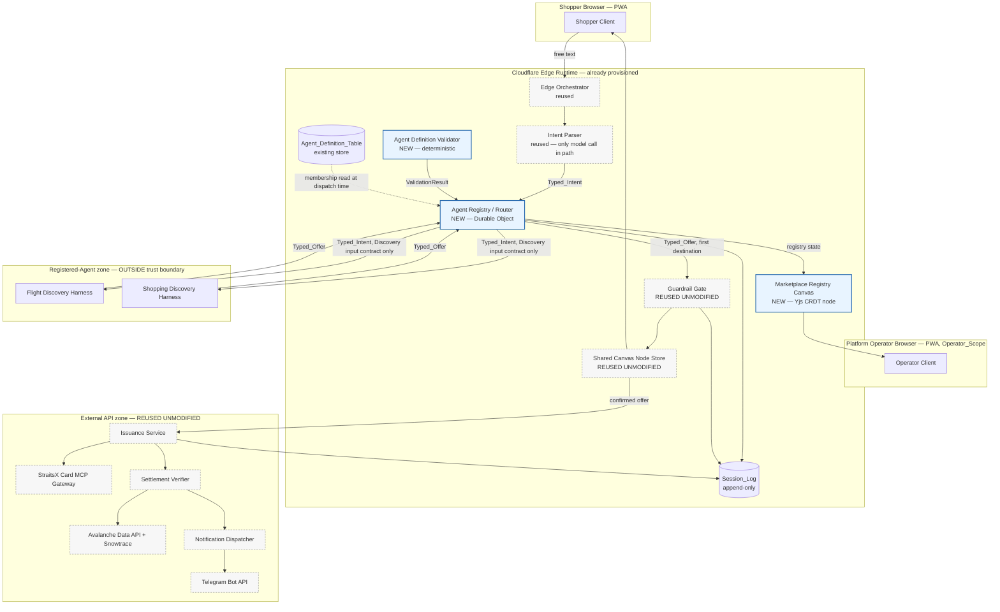
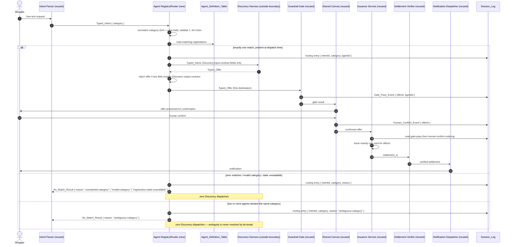

# Design Document

## Overview

This design realizes the Phase 1 increment of the source specification: insert **one** routing primitive between Intent Parser and Discovery, validate agent registrations against an externally owned schema, and project registration state to an operator surface. Everything downstream of Discovery — Guardrail Gate, Shared Canvas Node Store, Issuance Service, Settlement Verifier, Notification Dispatcher — is consumed at its existing interface and is not modified.

Three new authored units, each one file, each one responsibility:

| Unit | Responsibility (single) | Runtime | Authored-line ceiling |
|---|---|---|---|
| `agent-registry.ts` | Resolve a Typed_Intent to at most one registered agent and emit at most one dispatch | Durable Object | ≤ 600 |
| `definition-validator.ts` | Return pass/reject for one submitted Agent_Definition against the retrieved Invocation Surface Contract schema | Deterministic module | ≤ 600 |
| `registry-canvas.ts` | Project Agent_Definition_Table state into an Operator_Scope Yjs node and render it | Durable Object + PWA view | ≤ 600 |

Supporting units, deliberately separate so no unit carries two responsibilities and no unit approaches the 600-line ceiling: `session-log.ts` (append-only event writer), `typed-contracts.ts` (types only, no logic), `scope-keys.ts` (CRDT key construction and scope predicates), `pending-queue.ts` (offline change queue).

### Design Goals, Framed By Operating Priorities

- **Minimum-viable-maximum-value** — one new dispatch hop unlocks every future vertical; five proven components are reused at their existing interfaces with zero edits.
- **Time-to-value** — no new vendor onboarding, no new credential provisioning, no new storage system. First runnable slice is Router + Validator over the two already-specified harnesses.
- **ROI / TCO** — $0 marginal infrastructure: Durable Objects and the Yjs store are already provisioned. The only new cost line is authored code to maintain, bounded by the three-file decomposition above.
- **Token economics** — routing is deterministic and model-free (Requirement 2.7). No new model call is introduced anywhere in this increment. See *Token Economics and Cost*.
- **FOSS-first** — Yjs (MIT) reused as an additional *consumer*, not a new dependency. No new library is introduced for routing or validation.
- **Zero-infra** — Cloudflare Workers/Durable Objects already provisioned; no service is added (Requirement 9.7).
- **Browser-based, mobile-first** — the operator surface is a PWA view rendering at 320 CSS px without horizontal scroll (Requirement 3.10); shopper and operator surfaces hold at 360 px with 44×44 px touch targets (Requirement 9.5).
- **Local-first, offline-first** — Registry_Canvas reads from the local Yjs replica first and treats the edge as a convergence peer, never as a read prerequisite. Offline changes are queued in record order and merged on reconnect.

### Trust Boundary Position

Knowgrph never executes registered-agent code. The Router sends a typed intent across the boundary and reads a typed offer back. Registration establishes `declared-and-present` status only — a schema and allowlist-membership fact, not a runtime behavioral guarantee (ADR-2, Requirement 1.10). The design surfaces that word literally in the Registry_Canvas status column so the operator surface cannot overstate it.

## Architecture



Boundary reading of the diagram: the only edges Knowgrph adds are `IP → AR`, `AR ↔ ADV`, `AR → harnesses`, `AR → GG`, and `AR → MRC`. `GG → SCN → ISS → SV → ND` is carried over untouched. The Registered-Agent zone touches nothing but the Router, in both directions.

### Dispatch Decision Is Evaluated, Not Cached

Membership is re-read from the Agent_Definition_Table at the moment of the dispatch decision rather than trusted from a warm Routing_Table snapshot. The Routing_Table is a category index for *selection*; the table read is the *authorization*. This costs one Durable Object storage read per intent and removes the class of bug where a de-registered agent keeps receiving payment-adjacent traffic from a stale index.

### Sequence — Happy Path And Both No-Match Branches



Ambiguity fails closed rather than picking a winner. A tie-break (first-registered, lowest-id, round-robin) would make routing depend on registration history, which is invisible to the shopper and untestable as a property.

## Components and Interfaces

All types live in `typed-contracts.ts`, which contains type declarations only. Credential-carrying is made *structurally* impossible rather than forbidden by review: the forwardable field sets are closed object types with no index signature, and the boundary-crossing functions accept only those closed types, so an extra field is a compile error, not a lint warning.

```ts
// ---- Closed, no index signature: excess-property checks reject unknown fields ----

/** Exactly the fields the Router may forward across the trust boundary. */
export interface DiscoveryInput {
  readonly intentId: IntentId;
  readonly category: CategoryLabel;      // normalized
  readonly constraints: OfferConstraints; // budget ceiling, dates, quantity — no account data
}

/** Exactly the offer-data fields a harness may return. No credential shape exists here. */
export interface DiscoveryOutputFields {
  readonly offerId: OfferId;
  readonly title: string;
  readonly amountMinor: number;          // integer minor units
  readonly currency: CurrencyCode;
  readonly merchantName: string;
  readonly detailUrl: string;
}

export interface TypedIntent {
  readonly intentId: IntentId;
  readonly category: string;             // as received, un-normalized
  readonly constraints: OfferConstraints;
  readonly principalId: PrincipalId;     // never forwarded — absent from DiscoveryInput
}

export interface TypedOffer {
  readonly offer: DiscoveryOutputFields;
  readonly agentId: AgentId;             // stamped by the Router, not by the harness
  readonly intentId: IntentId;
}

export interface AgentDefinition {
  readonly agentId: AgentId;
  readonly declaredCategory: string;
  readonly declaredToolAllowlist: readonly string[];
  readonly trustStatus: 'declared-and-present';   // single legal value in this increment
  readonly schemaRevision: SchemaRevisionId;
  readonly contentHash: ContentHash;              // binds a pass result to exact content
}

export interface RoutingTableEntry {
  readonly normalizedCategory: CategoryLabel;
  readonly agentId: AgentId;
  readonly passResultId: ValidationPassId;        // required — no entry without one
  readonly boundContentHash: ContentHash;         // must equal the definition's hash
  readonly committedAt: IsoTimestamp;
  readonly routable: boolean;                     // true only after commit
}

export type ValidationResult =
  | { readonly kind: 'pass'; readonly passResultId: ValidationPassId;
      readonly contentHash: ContentHash; readonly schemaRevision: SchemaRevisionId }
  | { readonly kind: 'reject'; readonly violations: readonly SchemaViolation[] };
//  A pass carries no violations and a reject carries at least one: the union makes the
//  "pass with a violation reason" state unrepresentable.

export interface SchemaViolation {
  readonly fieldId: string;            // schema field identifier
  readonly reason: ViolationReason;    // includes 'schema-unavailable'
}

export type NoMatchReason =
  | 'unmatched-category' | 'ambiguous-category' | 'invalid-category'
  | 'registration-state-unavailable' | 'agent-not-registered';

export interface NoMatchResult {
  readonly kind: 'no-match';
  readonly intentId: IntentId;
  readonly reason: NoMatchReason;
}

export type RouteOutcome =
  | { readonly kind: 'dispatch'; readonly agentId: AgentId; readonly input: DiscoveryInput }
  | NoMatchResult;

export interface SessionLogEntry {
  readonly seq: number;                // monotonic per session, append-only
  readonly sessionId: SessionId;
  readonly at: IsoTimestamp;
  readonly agentId: AgentId | null;    // null only for pre-resolution rejections
  readonly event:
    | { readonly type: 'routing'; readonly intentId: IntentId;
        readonly categoryAsReceived: string; readonly agentId: AgentId | null;
        readonly reason: NoMatchReason | null }
    | { readonly type: 'registration-rejected'; readonly reason: string;
        readonly operatorId?: OperatorId }
    | { readonly type: 'gate-pass'; readonly offerId: OfferId }
    | { readonly type: 'gate-fail'; readonly offerId: OfferId; readonly reason: string }
    | { readonly type: 'human-confirm'; readonly offerId: OfferId }
    | { readonly type: 'issuance'; readonly offerId: OfferId }
    | { readonly type: 'fail-closed'; readonly code: FailClosedCode;
        readonly offerId: OfferId | null; readonly detail: string };
}
```

### Agent Registry / Router — `agent-registry.ts`

Single responsibility: intent → at most one dispatch.

```ts
export interface AgentRegistry {
  /** Deterministic, model-free, ≤200ms. Emits exactly one Session_Log routing entry. */
  route(intent: TypedIntent): Promise<RouteOutcome>;

  /** Stamps agentId, screens the offer, forwards to Guardrail Gate as first destination. */
  admitOffer(offer: DiscoveryOutputFields, agentId: AgentId, intentId: IntentId):
    Promise<{ kind: 'admitted' } | { kind: 'rejected'; code: FailClosedCode }>;

  /** Commits a routable entry only when bound to a pass result for identical content. */
  commitRegistration(def: AgentDefinition, result: ValidationResult):
    Promise<{ kind: 'committed' } | { kind: 'rejected'; reason: string }>;

  removeRegistration(agentId: AgentId, requestedBy: OperatorId): Promise<void>;
}
```

Invariants held inside this unit: exactly one Session_Log routing entry per intent; membership re-read before dispatch; ambiguity and invalid category short-circuit before any harness call; no agent identifier appears in source (the category-to-agent mapping is externalized registration state).

### Agent Definition Validator — `definition-validator.ts`

Single responsibility: one definition, one verdict.

```ts
export interface DefinitionValidator {
  /** Retrieves the externally owned schema per call; retains no copy past the call.
   *  Resolves within 5s or rejects with a 'schema-unavailable' violation. */
  validate(submitted: unknown, deadlineMs: 5000): Promise<ValidationResult>;
}
```

The schema is fetched from its owning source at validation time and held only in the call frame — there is no module-level cache, which is how "persist no second copy" is enforced structurally. Violations are collected exhaustively; the validator walks the whole submission before returning.

### Marketplace Registry Canvas — `registry-canvas.ts`

Single responsibility: project and render registration state under Operator_Scope.

```ts
export interface RegistryCanvas {
  subscribe(scope: ClientScope): Observable<RegistryProjection>;
  /** Local replica read; never blocks on the edge. */
  readLocal(): RegistryProjection;
}

export interface RegistryProjection {
  readonly revision: RevisionId;
  readonly rows: readonly RegistryRow[];     // empty for non-operator scope
  readonly scopeWithheld: boolean;
  readonly staleness: { readonly isCurrent: boolean; readonly sinceLastSyncMs: number };
}

export interface RegistryRow {
  readonly agentId: AgentId;
  readonly declaredCategory: string | NotDeclared;
  readonly declaredToolAllowlist: readonly string[] | NotDeclared;
  readonly trustStatus: 'declared-and-present' | NotDeclared;
}
export type NotDeclared = { readonly notDeclared: true };
```

Rendering is a semantic `<ul>` of rows, each row a `<dl>` of the four fields, each row carrying an accessible name containing the agent identifier. `NotDeclared` is a distinct type rather than an empty string so a missing field cannot render as blank space.

## Data Models

No new storage system. Two existing stores are used: the Yjs CRDT store on Durable Objects, and the existing Agent_Definition_Table.

### CRDT Key Scheme — established `table_name:record_id` pattern

| Key | Holder | Scope | Contents |
|---|---|---|---|
| `agent_definition:{agentId}` | Agent_Definition_Table | edge-authoritative | one Agent_Definition record |
| `routing_entry:{normalizedCategory}` | Router Durable Object | edge-authoritative | RoutingTableEntry; absent key means non-routable |
| `registry_canvas:operator` | Registry_Canvas | Operator_Scope | projected RegistryProjection rows |
| `registry_pending:{clientId}` | client replica | client-local | ordered offline pending-change queue |
| `session_log:{sessionId}` | Session_Log | session-scoped | append-only ordered entries |

Scope is a property of the key, not of a filter applied after read: `scope-keys.ts` is the only unit that constructs these keys, and it refuses to construct `registry_canvas:operator` for a non-operator scope. A non-operator subscription therefore has no key to read, which is why it yields zero rows plus a withheld indication rather than a filtered list.

### Offline Pending-Change Queue

`registry_pending:{clientId}` is an ordered Yjs array: append on local change, never reorder, never drop. On reconnect the queue is submitted for merge head-first, so submission order equals record order. Retention target is ≥ 24h and ≥ 100 entries; entries are removed only after their merge is acknowledged. Retry is bounded — at most 5 attempts at intervals of at most 30s — after which the surface reports synchronization unavailable while the queue and the stale indicator both persist.

### Convergence Model

Registry state is a grow-and-set CRDT map keyed by agent identifier, so concurrent operator updates converge regardless of application order. The projection is derived, never independently authored: rendered rows are computed from the definition map for a single read revision, which is what makes the rendered set equal to the table set by construction rather than by reconciliation.

## Correctness Properties

*A property is a characteristic or behavior that should hold true across all valid executions of a system — essentially, a formal statement about what the system should do. Properties serve as the bridge between human-readable specifications and machine-verifiable correctness guarantees.*

The requirements baseline owns the authoritative property set, CP-1 through CP-13. The headings below restate that set without forking it: Property N corresponds to CP-N, and each preserves its recorded name, class, covered criteria, statement, and minimum iteration count exactly.

**Property-set decisions taken during prework:**

- **No property is added beyond CP-1..CP-13.** Authoring a parallel property set in the design would reproduce, at test level, the exact unsynchronized-copies anti-pattern this increment exists to remove.
- **Membership assertions (1.1, 1.2) fold into CP-2.** CP-2's dispatch-time membership invariant subsumes them; separate properties would restate the same universal.
- **Dispatch arity (2.2, 2.3, 2.4) is one invariant, held by CP-1.** CP-11 is retained as distinct because it asserts *result totality and log arity*, which CP-1 does not.
- **Rendering set-equality and field presence (3.2, 3.3, 3.9) are one property, CP-6**, with the empty table as a generator case rather than a separate property.
- **Payment ordering (4.2) and its negative arm (4.3, 4.8) are one property, CP-3**, exercised with both arms rather than split.
- **Boundary payload screening (5.3, 5.4) is one property, CP-10**, covering both directions across the trust boundary.
- **Criteria classified INTEGRATION, EXAMPLE, or SMOKE are not promoted to properties.** Deploy-boundary state, dictionary lookups, layout, startup configuration, execution-contract process obligations, and static repository facts do not vary meaningfully with generated input; running them 100 times finds nothing a single run does not.

### Property 1: Routing Exclusivity (CP-1, Invariant)

For all generated Typed_Intent and Agent_Definition_Table pairs, the number of Discovery dispatches emitted by Agent_Registry is exactly one when precisely one registered agent declares the intent's category, and exactly zero otherwise. Minimum iterations: 200.

**Validates: Requirements 2.1, 2.2, 2.3, 2.4, 2.8, 2.9, 1.1**

### Property 2: Registration Gate Invariant (CP-2, Invariant)

For all generated dispatch sequences, every dispatched agent identifier is a member of the Agent_Definition_Table at dispatch time, and every Routing_Table entry has a corresponding Definition_Validator pass result. Minimum iterations: 200.

**Validates: Requirements 1.1, 1.4, 1.9**

### Property 3: Payment Ordering Invariant (CP-3, Invariant)

For all generated Session_Log sequences over all agent identifiers, every Issuance_Service issuance entry is preceded in the same session by both a Gate_Pass_Event and a Human_Confirm_Event carrying the same offer identifier, with the Gate_Pass_Event ordered before the Human_Confirm_Event, and at most one issuance exists per offer identifier. Minimum iterations: 500.

**Validates: Requirements 4.2, 4.3, 4.8**

### Property 4: Agent-Identifier Parity (CP-4, Metamorphic)

For all generated Typed_Offer records, substituting the agent identifier while holding offer content fixed leaves the Guardrail_Gate result unchanged. Minimum iterations: 300.

**Validates: Requirements 4.4**

### Property 5: Agent Definition Round Trip (CP-5, Round Trip)

For all valid Agent_Definition values, serializing then parsing then serializing yields an equivalent Agent_Definition, and the Definition_Validator verdict is identical across both representations. Minimum iterations: 300.

**Validates: Requirements 1.3, 1.6**

### Property 6: Registry Projection Consistency (CP-6, Invariant)

For all generated Agent_Definition_Table states, the set of agent identifiers rendered by Registry_Canvas equals the set present in the Agent_Definition_Table for the same read revision. Minimum iterations: 200.

**Validates: Requirements 3.2, 3.3, 3.9**

### Property 7: CRDT Merge Confluence (CP-7, Confluence)

For all generated pairs of concurrent Registry_Canvas update sequences, applying them in either order yields identical converged registration state. Minimum iterations: 300.

**Validates: Requirements 3.6, 9.2**

### Property 8: Registration Idempotence (CP-8, Idempotence)

For all valid Agent_Definition values, registering the same definition twice yields the same Routing_Table state as registering it once. Minimum iterations: 200.

**Validates: Requirements 1.4, 1.9, 8.6**

### Property 9: Malformed Definition Error Conditions (CP-9, Error Condition)

For all generated Agent_Definition values violating at least one schema constraint, Definition_Validator returns a reject result naming every violated field identifier, and no Routing_Table entry is created. Minimum iterations: 400.

**Validates: Requirements 1.3, 1.7**

### Property 10: Credential Non-Propagation (CP-10, Invariant)

For all generated Typed_Intent and Typed_Offer values, the payloads crossing the Agent_Registry boundary contain zero credential-shaped fields, and every StraitsX or Avalanche call in the recorded tool-call log names Issuance_Service as caller. Minimum iterations: 300.

**Validates: Requirements 5.3, 5.4**

### Property 11: No_Match Totality (CP-11, Invariant)

For all generated Typed_Intent values, Agent_Registry returns either exactly one selected agent identifier or a No_Match_Result carrying a reason, and records exactly one Session_Log routing entry. Minimum iterations: 300.

**Validates: Requirements 2.3, 2.5, 2.8, 2.9**

### Property 12: Unrecognized Agent Identifier Rejection (CP-12, Error Condition)

For all generated Typed_Offer values whose agent identifier is empty or absent from the Agent_Registry, zero downstream components receive the offer and a fail-closed reason naming an unrecognized agent identifier is recorded. Minimum iterations: 300.

**Validates: Requirements 4.7**

### Property 13: Offline Change Order Preservation (CP-13, Invariant)

For all generated sequences of locally recorded registration changes made while offline, the order in which those changes are submitted for CRDT merge on reconnection equals the order in which they were recorded, and no recorded change is dropped. Minimum iterations: 200.

**Validates: Requirements 9.4**

## Error Handling

Every path fails closed: on any unresolved condition the design withholds the dispatch or the issuance rather than proceeding with a default. Nothing in this table alters a reused component's interface — fail-closed decisions for reused components are read off the Session_Log they already write.

| Criterion class | Condition | Typed error / result | Recorded evidence | Downstream effect |
|---|---|---|---|---|
| 1.2 | Resolved agentId absent from Agent_Definition_Table | `NoMatchResult{reason:'agent-not-registered'}` | routing entry: intentId, agentId, reason | zero Discovery, zero payment-adjacent calls |
| 1.5 | Routing change unbound to a pass result | `rejected{reason:'unbound-routing-change'}` | rejection entry: operatorId, reason | Routing_Table unmodified |
| 1.8 | Schema not retrievable within 5s | `ValidationResult{kind:'reject', violations:[{reason:'schema-unavailable'}]}` | reject result with violation | no Routing_Table entry |
| 1.3 / 1.7 | Schema violations present | `reject` with one `SchemaViolation` per violating field | all violating fieldIds enumerated | no Routing_Table entry |
| 2.3 | Zero category matches | `NoMatchResult{reason:'unmatched-category'}` | one routing entry with reason | zero dispatches |
| 2.4 | Two or more agents share a category | `NoMatchResult{reason:'ambiguous-category'}` | one routing entry with reason | zero dispatches; no tie-break |
| 2.8 | Category absent/empty/whitespace/>64 chars | `NoMatchResult{reason:'invalid-category'}` | one routing entry with category as received | zero dispatches |
| 2.9 | Registration state unreadable | `NoMatchResult{reason:'registration-state-unavailable'}` | one routing entry with reason | zero dispatches; intent unmodified |
| 3.8 | Agent_Definition_Table unreadable | stale projection retained | staleness indicator + sinceLastSyncMs | zero entries discarded |
| 4.3 | Gate-pass or human-confirm absent for offerId | `fail-closed{code:'gate-or-confirm-absent'}` | fail-closed entry naming the absent event, offerId, agentId | no card issued; prior log entries unchanged |
| 4.7 | Offer carries empty/unknown agentId | `fail-closed{code:'unrecognized-agent'}` | fail-closed entry with the offending identifier | routed to no downstream component |
| 4.8 | Confirmation window elapsed | `fail-closed{code:'confirmation-expired'}` | fail-closed entry with offerId | offer treated as unconfirmed; no card |
| 5.2 | Non-Issuance component attempts StraitsX/Avalanche | `error{code:'unauthorized-payment-caller'}` | caller component identifier + target service name | rejected before any outbound request |
| 5.4 | Offer carries a credential-shaped field | `rejected{code:'credential-bearing-offer'}` | rejection with offending field name | intent unmodified |
| 5.6 | Required config key absent at startup | startup refusal naming each absent key | startup error record | process does not start; no defaults applied |
| 7.3 | Prod mirror or Cloudflare mutation requested | `error{code:'deploy-boundary-closed'}` | requested operation + boundary name | both surfaces unchanged |
| 8.2 / 8.3 | Token unresolved / ambiguous | `error{code:'token-unresolved'|'token-ambiguous'}` | token + invoking surface, or every matching dictionary | no dispatch |
| 8.5 | Request from a non-MCP surface | `rejected{code:'non-mcp-surface'}` | rejected surface identity | Routing_Table and Agent_Definition_Table unchanged |
| 8.8 | Definition fails revalidation | entry removal | removal reason + failing revision id | stored definition unchanged; entry non-routable |
| 9.3 | CRDT merge does not complete | bounded retry, then `sync-unavailable` surface message | retry attempt count | local state and pending queue retained |
| 9.6 | Client offline at issuance | `error{code:'issuance-requires-connectivity'}` | preserved local issuance inputs | zero cards issued |

Two structural notes. `ValidationResult` is a discriminated union, so "pass carrying a violation reason" and "reject carrying none" are unrepresentable rather than merely disallowed. `DiscoveryInput` and `DiscoveryOutputFields` are closed types with no index signature, so a credential field cannot be constructed into a boundary payload in typed code; the runtime screen in `admitOffer` exists for untyped input arriving from outside the trust boundary.

## Testing Strategy

Dual approach. Property tests carry the universals; example, integration, and smoke checks carry everything that does not vary meaningfully with input. Library: **fast-check** (MIT) for the TypeScript surface — chosen because it is already the ecosystem-standard PBT library for this runtime and requires no new toolchain. Property-based testing is not implemented from scratch.

Global configuration: shrinking enabled (`endOnFailure: false`, default biased shrinker), fixed seed recorded per run for reproduction, `numRuns` per property as stated below and never below 100. Every payment-path property runs against mocked StraitsX and Avalanche clients so no property test issues a real payment call.

Each test carries the tag comment: `Feature: knowgrph-agentic-commerce-platform, Property {n}: {property text}`.

### Property Tests — CP-1..CP-13

| Property | Generators | numRuns | Notes |
|---|---|---|---|
| CP-1 Routing Exclusivity | `arbTypedIntent` (category perturbed by whitespace padding, case flips, empty, whitespace-only, 65+ chars) × `arbDefinitionTable` (0..20 agents, duplicate-category arm) | 200 | Asserts dispatch count is exactly 1 iff exactly one match, else 0 |
| CP-2 Registration Gate | `arbDispatchSequence` (interleaved register / de-register / dispatch), `arbPassBinding` (matching and mismatched contentHash) | 200 | Includes de-registration between selection and dispatch |
| CP-3 Payment Ordering | `arbSessionLog` (permuted gate-pass / human-confirm / issuance across multiple offerIds and agentIds, with omission and duplication arms) | 500 | Highest count: central safety invariant. Mocked payment clients |
| CP-4 Agent-Identifier Parity | `arbTypedOffer` × `arbAgentId` substitution, offer content held fixed | 300 | Metamorphic; asserts gate result equality |
| CP-5 Definition Round Trip | `arbAgentDefinition` (valid arm only, unicode category labels, allowlists 0..50 entries) | 300 | serialize→parse→serialize equivalence and verdict equality |
| CP-6 Registry Projection | `arbDefinitionTable` including empty table and per-field emptiness combinations | 200 | Rendered agentId set equals table set; not-declared indicator present per empty field |
| CP-7 CRDT Merge Confluence | `arbUpdateSequencePair` (concurrent operator update sequences, 1..10 ops each) | 300 | Apply in both orders; assert converged state equality |
| CP-8 Registration Idempotence | `arbAgentDefinition` × repeat count 1..3, plus `arbSchemaRevision` transition arm | 200 | Also covers 8.6 revalidation binding and 8.8 removal arm |
| CP-9 Malformed Definition | `arbInvalidAgentDefinition` (k≥1 injected violations, k up to field count) | 400 | Asserts all k fieldIds named; zero entries created |
| CP-10 Credential Non-Propagation | `arbAdversarialPayload` (credential-shaped names: `*card*`, `*token*`, `*secret*`, `*account*`, plus credential-shaped values) × `arbCallerIdentity` | 300 | Both arms: forwarded payload screening and caller-identity in tool-call log |
| CP-11 No_Match Totality | `arbTypedIntent` across all invalid-category shapes and read-failure injection | 300 | Exactly one outcome and exactly one routing entry, always |
| CP-12 Unrecognized Agent | `arbTypedOffer` with agentId empty, whitespace, or absent from registry | 300 | Zero downstream receipt; fail-closed reason recorded |
| CP-13 Offline Order Preservation | `arbLocalChangeSequence` (1..100 changes, interleaved with disconnect/reconnect events) | 200 | Submission order equals record order; zero drops |

Shrinking matters most for CP-3 and CP-9: the useful failure report is the *minimal* log permutation or the *minimal* violating definition, which is why shrinking is left enabled rather than short-circuited on first failure.

### Integration And Example Checks

Carried from the requirements baseline without modification; reproduced here as the design-side test inventory.

| Criterion | Check kind | Rationale |
|---|---|---|
| 1.3 (5s bound), 1.8 | Integration, 1 example each | External retrieval timing and failure |
| 1.6 | Repository scan + CP-5 | No module-scope schema retention |
| 1.10 | DOM assertion | `declared-and-present` rendered literally |
| 2.6 | Repository scan | Zero hardcoded agent identifiers in source |
| 2.7 (latency, model-free) | Integration, 1 example + static scan | 200ms bound; no model client imported by the router unit |
| 3.1 | Integration, 1 example at 500 definitions | Projection latency at scale |
| 3.4 | Integration, 2 examples | Access-scope withholding |
| 3.5, 9.7 | Dependency and key-pattern inventory | Zero new storage systems or services |
| 3.7 | Static + DOM assertion | Semantic list/description elements, accessible names |
| 3.8 | Integration, 1 example | Stale-read retention and indicator |
| 3.10 | Browser assertion, 1 example | 320px, no horizontal scroll |
| 4.5 | Interface-signature snapshot | Reused interfaces unchanged |
| 4.8 | Integration, 1 example | Confirmation-window expiry — see open question |
| 5.1 | Client-construction scan + CP-10 | Sole StraitsX client holder |
| 5.5 | Repository scan | No credentials or machine paths |
| 5.6 | Integration, 1 example per absent-key class | Startup refusal |
| 6.1, 6.2 | Process assertion, 1 per task | Named check stated; return surfaces status, counts, artifacts |
| 6.3, 6.4 | Process assertion, 1 per verdict | Evaluator mechanism distinct from implementer |
| 6.5 | Integration, 1 example per cause | Four enumerated not-runtime-ready causes |
| 6.6, 6.7 | Process assertion, 1 each | Bound recording; unbounded dispatch refusal |
| 6.8 | Integration, 1 example | Two-iteration no-progress terminal stop |
| 6.9, 6.10 | Repository scan | ≤600 authored lines, one declared responsibility per file |
| 7.1–7.5, 7.9 | Integration, 1 per boundary | External gate state |
| 7.6–7.8 | Integration, 1 each | Registration boundary routability and reversal |
| 8.1–8.3 | Integration, 3 examples | Resolved / unresolved / ambiguous token |
| 8.4, 8.5 | Export-surface scan + 2 examples | MCP-only surface |
| 8.7 | Integration, 1 example | Dispatch blocked during revalidation |
| 9.1, 9.3 | Integration, 1 each | Offline indicator; bounded retry policy |
| 9.2 (5s bound) | Integration, 1 example | Convergence timing |
| 9.5 | Browser assertion, 1 per surface | 360px, 44×44px targets |
| 9.6 | Integration, 1 example | Offline issuance suppression |

### Named Invocable Check Per Requirement

Requirement 6.1 obliges each verifiable condition to be stated as a check a reader can invoke without interpretation. One named check per requirement:

| Requirement | Named check |
|---|---|
| 1 | `npm run check:registration-gate` — CP-2, CP-5, CP-8, CP-9 plus the 1.3/1.8 timing examples and the 1.6 scan |
| 2 | `npm run check:routing` — CP-1, CP-11 plus the 2.6 scan and the 2.7 latency example |
| 3 | `npm run check:registry-canvas` — CP-6, CP-7 plus the 3.1/3.4/3.8 integrations and 3.7/3.10 browser assertions |
| 4 | `npm run check:payment-ordering` — CP-3, CP-4, CP-12 plus the 4.5 signature snapshot and 4.8 expiry example |
| 5 | `npm run check:payment-isolation` — CP-10 plus the 5.1/5.5 scans and 5.6 startup examples |
| 6 | `npm run check:execution-evidence` — process assertions plus the 6.9/6.10 repository scan |
| 7 | `npm run check:deploy-boundary` — one integration per Deploy Boundary Register row and transition |
| 8 | `npm run check:invocation-surface` — dictionary examples, export-surface scan, CP-8 revalidation arms |
| 9 | `npm run check:offline-surfaces` — CP-7, CP-13 plus the 9.1/9.2/9.3/9.6 integrations and 9.5 browser assertions |

Each check exits non-zero on failure and prints its recorded counts, so its return satisfies Requirement 6.2 without a separate reporting layer.

## Token Economics and Cost

Routing is **model-free**. `agent-registry.ts` performs string normalization and a map lookup; it imports no model client, and the static scan under Requirement 2.7 enforces that. `definition-validator.ts` is schema evaluation, also model-free. `registry-canvas.ts` is CRDT projection and rendering, model-free.

The only model call in the path is **Intent Parser**, which exists today and is unchanged by this increment. This design therefore adds **zero** new token cost.

Per-session cost shape:

```
session_cost = intent_parse_tokens × model_rate        // pre-existing, unchanged
             + 0                                       // routing
             + 0                                       // validation
             + 0                                       // registry projection
             + infra_cost                               // $0 — Durable Objects + Yjs already provisioned
```

Marginal cost of adding an *additional* registered agent is one Agent_Definition record and one routing entry: no token cost, no infrastructure cost, no vendor onboarding. That is the ROI claim this increment rests on, and it is measurable as stated rather than asserted.

The open question on whether category matching eventually needs a classifier is carried forward below. If it is ever answered yes, this section's zero-token claim changes and must be re-derived, not quietly amended.

## Deploy Boundary

Dev-only. Every acceptance criterion is satisfiable within `GitHub/knowgrph` via the repository-owned dev scripts.

| Boundary | State this increment | Design consequence |
|---|---|---|
| Sandbox-to-Mirror | `pending-protected-integration` | Changes reach `main` only through the protected integration path; direct writes rejected |
| Mirror-to-Delivery | `closed` | Prod mirror (`GitHub/huijoohwee/content/knowgrph`) and Cloudflare routes (`airvio.co`, `airvio.co/knowgrph`) are gated targets, never acceptance criteria. Zero permitted mutations absent a recorded exact-candidate human authorization |
| Agent Registration: declarative-allowlist → routable | `closed` | An entry becomes routable only on a recorded pass result bound to that exact entry; reversal is entry removal, which moves no funds |

Protected integration yields **Dev integration authority only**. The integration receipt names the protected path, candidate identity, and outcome; no deployment authority is derived from it. A task requesting a mirror or route mutation is rejected before any mutation is issued, with the requested operation and target boundary recorded.

## Design Decisions and Rationale

**One router, not per-vertical wiring (ADR-1).** Rejected: per-vertical reimplementation — duplicates guardrail and issuance logic per vertical, the exact anti-pattern the increment exists to remove. Rejected: full agent mesh — no single gate can enforce a budget across a mesh without becoming distributed-systems research, and it is absurd at two agents. Consequence accepted: the Router is a single dispatch point, so it needs an explicit `No_Match_Result` state rather than a silent drop. That is why `RouteOutcome` is a union with no implicit failure representation.

**Ambiguity fails closed rather than tie-breaking.** Not in the source ADRs; derived from Requirement 2.4. A tie-break would make routing depend on registration order — invisible to the shopper, and unstateable as a property.

**Membership re-read at dispatch, not trusted from the index.** Derived from Requirement 1.1's "at the moment of the dispatch decision". Costs one storage read per intent; removes stale-index payment exposure.

**Declarative allowlist now, attestation later (ADR-2).** Rejected: on-chain attestation in this increment — a contract build plus issuance and verification flow, not schedulable alongside the Router. Rejected: no allowlist, route by string match — any string could reach a payment-adjacent path. Consequence accepted and made visible in the design: `trustStatus` has exactly one legal value, `'declared-and-present'`, and the operator surface renders that literal term. The marketplace cannot be presented as carrying a third-party trust guarantee until Phase 2.

**Registry Canvas extends Yjs rather than introducing a store (ADR-3).** Rejected: a separate table with no CRDT — loses live multi-device operator sync and diverges from the established key pattern for no gain. Rejected: Automerge — same switching-cost argument already made against it, now doubled since it would diverge from the transaction-node CRDT choice too. Consequence accepted: registry keys need their own scoping discipline, which is why `scope-keys.ts` is the sole key constructor and refuses to build the operator key for a non-operator scope.

**Credential exclusion is structural, not conventional.** Closed types with no index signature plus a discriminated `ValidationResult` mean the unsafe states are unrepresentable. Convention-and-review was rejected because it produces no compile-time evidence and no property to test.

**Four supporting units rather than three fat ones.** `session-log.ts`, `typed-contracts.ts`, `scope-keys.ts`, `pending-queue.ts` exist so each of the three named components keeps one declared responsibility and stays well under the 600-authored-line ceiling. Folding the log writer or key builder into the Router would give that file two responsibilities and fail Requirement 6.10 on its own terms.

## Open Design Questions

1. **Requirement 4.8's confirmation window is not independently testable as written.** The window is owned by the reused Issuance_Service and is not currently exposed as a named readable constant. Until it is — a read-only export such as `CONFIRMATION_WINDOW_MS`, with no behavioral change to the component — a 4.8 expiry check can only assert against a value it has hardcoded, which is a test asserting against itself. Flagged as a blocking prerequisite for 4.8's integration check. Exposing a constant is additive and does not alter the interface, so it does not conflict with Requirement 4.5 or Non-Goal 12; confirmation is still needed that this reading is accepted.
2. **Does category routing need a classifier rather than a fixed enum?** Requirement 2.7 mandates deterministic model-free routing. A classifier would invalidate the zero-token claim in *Token Economics and Cost* and change 2.7. Carried undecided.
3. **Where does trust and verification actually enforce** — inside the registered agent, pre-dispatch in the Router, or through on-chain attestation? Requirement 1.10 records the declarative-only position as interim.
4. **Does each registered agent need its own funding source**, or does every agent draw from one operator-controlled wallet? Multi-tenant fund segregation is a current non-goal, so the design assumes one operator-controlled funding source; if that assumption is wrong, the Issuance_Service caller-identity model in CP-10 needs revisiting.
5. **Marketplace fee model** — free infrastructure versus a take rate. Deliberately undecided; nothing in this design assumes either.
