# Implementation Plan

## Deploy Boundary Statement — Read Before Dispatching Any Task

Every task in this list executes entirely within `Dev_Lane` (`GitHub/knowgrph`, `npm run dev:apex`, `npm run dev`).

- **No task in this list may mutate the Prod mirror** (`GitHub/huijoohwee/content/knowgrph`).
- **No task in this list may mutate a Cloudflare route** (`airvio.co`, `airvio.co/knowgrph`).
- Every task's capability class is one of `read`, `local write`, or `local execute`. **Zero tasks carry `environment mutate` or any boundary-crossing capability.** A task that requests one is rejected before the mutation is issued, with the requested operation and target boundary recorded (Requirement 7.3).
- All three Deploy Boundary Register rows report `closed` at the start and at the end of this increment (Requirement 7.9).

## Overview

Seven authored units, each one file, each one declared responsibility, each ≤600 authored lines (Requirement 6.9). Work is test-first: the fast-check harness and the closed typed contracts land before any component, because both the components and every property test depend on the closed types.

| Unit | Path | Declared responsibility |
|---|---|---|
| Typed Contracts | `src/registry/typed-contracts.ts` | Type declarations only, no logic |
| Scope Keys | `src/registry/scope-keys.ts` | CRDT key construction and scope predicates |
| Session Log | `src/registry/session-log.ts` | Append-only ordered event writer |
| Pending Queue | `src/registry/pending-queue.ts` | Ordered offline change queue |
| Definition Validator | `src/registry/definition-validator.ts` | One definition, one verdict |
| Agent Registry / Router | `src/registry/agent-registry.ts` | Intent → at most one dispatch |
| Registry Canvas | `src/registry/registry-canvas.ts` | Project and render registration state under Operator_Scope |

Runtime-side units carrying Dev_Lane obligations rather than component responsibilities: `src/runtime/startup-config.ts`, `src/runtime/payment-caller-guard.ts`, `src/runtime/deploy-boundary.ts`, `src/registry/mcp-surface.ts`, `src/registry/revalidation.ts`, `src/registry/wiring.ts`. Each is kept separate for the same reason the design separates its supporting units: folding them into a named component would give that file a second responsibility and fail Requirement 6.10 on its own terms.

**Task marking convention.** Sub-tasks postfixed with `*` are **not required for a working slice** — they are property tests, integration checks, browser assertions, repository scans, and process assertions. Sub-tasks without `*` are **required for a working slice** and must be implemented. Top-level tasks are never postfixed.

**Bounds convention.** Per the governing guidelines' Per-Task Budgets rule, every task states four bounds plus a circuit breaker on a single `_Bounds:_` line: token budget · iteration cap · wall-clock cap · peak working-context cap · breaker. The default breaker is Requirement 6.8: two consecutive iterations with no change in the named check's recorded result → stop retrying, transition the task to failed, record last observed result and terminal reason.

---

## Tasks

- [ ] 1. Foundation — test harness and closed typed contracts

  - [ ] 1.1 Configure the fast-check property-test harness
    - Add `fast-check` (MIT) as a dev dependency at a pinned exact version; add no runtime dependency
    - Author `tests/support/pbt.ts` exporting the shared runner config: shrinking enabled (`endOnFailure: false`, default biased shrinker), per-run seed generated and **recorded to the run output** for reproduction, `numRuns` supplied per property and never below 100
    - Export a `tag(feature, propertyNumber, propertyText)` helper so every property test carries the comment `Feature: knowgrph-agentic-commerce-platform, Property {n}: {property text}`
    - Author `tests/support/mocks/payment-clients.ts` exposing mocked StraitsX and Avalanche clients so no property test issues a real payment call
    - _Requirements: 6.1, 6.2_
    - _Properties: harness for 1–13_
    - _Check: `npm test -- --run`_
    - _Scope: `package.json` (devDependencies + `test` script only), `vitest.config.ts`, `tests/support/pbt.ts`, `tests/support/mocks/payment-clients.ts`_
    - _Capability: local write, local execute_
    - _Bounds: 20k tokens · 3 iterations · 25 min · 35% context · breaker: default (Req 6.8)_

  - [ ] 1.2 Author `typed-contracts.ts` — type declarations only, zero logic
    - Declare `DiscoveryInput` and `DiscoveryOutputFields` as **closed** interfaces with no index signature, so an excess field is a compile error rather than a lint warning
    - Declare `TypedIntent` (carrying `principalId`, which is absent from `DiscoveryInput`), `TypedOffer`, `AgentDefinition` (with `trustStatus: 'declared-and-present'` as the single legal value, plus `schemaRevision` and `contentHash`), `RoutingTableEntry`, `SessionLogEntry`
    - Declare `ValidationResult` as a discriminated union so "pass carrying a violation" and "reject carrying none" are unrepresentable
    - Declare `SchemaViolation`, `NoMatchReason` (including `'schema-unavailable'` on the violation side and all five no-match reasons), `NoMatchResult`, `RouteOutcome`, `FailClosedCode`
    - Declare branded id types: `AgentId`, `IntentId`, `OfferId`, `SessionId`, `OperatorId`, `PrincipalId`, `ContentHash`, `SchemaRevisionId`, `ValidationPassId`, `CategoryLabel`, `CurrencyCode`, `IsoTimestamp`, `RevisionId`
    - Emit zero runtime values from this module
    - _Requirements: 1.3, 1.10, 2.5, 4.6, 5.3, 5.4_
    - _Properties: foundation for 1, 5, 9, 10, 11, 12_
    - _Check: `npx tsc --noEmit`_
    - _Scope: `src/registry/typed-contracts.ts`_
    - _Capability: local write_
    - _Bounds: 30k tokens · 3 iterations · 35 min · 40% context · breaker: default (Req 6.8)_

  - [ ]* 1.3 Write type-level assertions for the closed contract types
    - Assert that constructing a `DiscoveryInput` with an extra field fails type-checking (expect-error assertions)
    - Assert `principalId` is not assignable into `DiscoveryInput`
    - Assert a credential-shaped field cannot be constructed into `DiscoveryOutputFields`
    - Assert `ValidationResult` narrowing forbids `violations` on the pass arm
    - _Requirements: 5.3, 5.4_
    - _Properties: 10 (structural arm)_
    - _Check: `npm run check:payment-isolation`_
    - _Scope: `tests/unit/typed-contracts.types.test.ts`_
    - _Capability: local write, local execute_
    - _Bounds: 15k tokens · 2 iterations · 20 min · 30% context · breaker: default (Req 6.8)_

- [ ] 2. Supporting units — keys, log, pending queue

  - [ ] 2.1 Implement `scope-keys.ts` — sole constructor of CRDT keys
    - Implement constructors for `agent_definition:{agentId}`, `routing_entry:{normalizedCategory}`, `registry_canvas:operator`, `registry_pending:{clientId}`, `session_log:{sessionId}` following the established `table_name:record_id` pattern
    - Implement the scope predicate: refuse to construct `registry_canvas:operator` for a non-Operator_Scope subscription, so a non-operator subscription has no key to read
    - Implement category normalization used by key construction: trim leading and trailing whitespace, case-fold; reject absent, empty, whitespace-only, or >64-character labels
    - Introduce zero additional storage systems
    - _Requirements: 2.1, 2.8, 3.4, 3.5_
    - _Properties: 1, 6, 11_
    - _Check: `npm run check:registry-canvas`_
    - _Scope: `src/registry/scope-keys.ts`_
    - _Capability: local write_
    - _Bounds: 25k tokens · 3 iterations · 30 min · 35% context · breaker: default (Req 6.8)_

  - [ ]* 2.2 Write unit tests for `scope-keys.ts`
    - Test key shape for all five key families
    - Test operator-key refusal under every non-operator scope
    - Test category normalization edge cases: padding, case flips, empty, whitespace-only, 64 chars, 65 chars, unicode labels
    - _Requirements: 2.1, 2.8, 3.4, 3.5_
    - _Check: `npm run check:registry-canvas`_
    - _Scope: `tests/unit/scope-keys.test.ts`_
    - _Capability: local write, local execute_
    - _Bounds: 15k tokens · 2 iterations · 20 min · 30% context · breaker: default (Req 6.8)_

  - [ ] 2.3 Implement `session-log.ts` — append-only ordered writer
    - Append entries under `session_log:{sessionId}` with a monotonic per-session `seq`; expose no update and no delete operation
    - Support the full event union: `routing`, `registration-rejected`, `gate-pass`, `gate-fail`, `human-confirm`, `issuance`, `fail-closed`
    - Require a non-empty `agentId` on every gate, confirmation, and issuance entry; permit `null` only for pre-resolution rejections
    - Expose an ordered read used to evaluate gate-pass-before-human-confirm ordering and at-most-one-issuance-per-offer
    - _Requirements: 2.5, 4.2, 4.6_
    - _Properties: 3, 11_
    - _Check: `npm run check:payment-ordering`_
    - _Scope: `src/registry/session-log.ts`_
    - _Capability: local write_
    - _Bounds: 25k tokens · 3 iterations · 30 min · 35% context · breaker: default (Req 6.8)_

  - [ ]* 2.4 Write property test for payment ordering
    - **Property 3: Payment Ordering Invariant (CP-3, Invariant)**
    - Generator: `arbSessionLog` — permuted gate-pass / human-confirm / issuance across multiple `offerId` and `agentId` values, with omission and duplication arms
    - `numRuns: 500` (highest count in the set: this is the central safety invariant). Shrinking enabled — the useful report is the minimal failing log permutation
    - Run against the mocked payment clients from task 1.1; issue zero real payment calls
    - **Validates: Requirements 4.2, 4.3, 4.8**
    - _Check: `npm run check:payment-ordering`_
    - _Scope: `tests/props/cp-03-payment-ordering.test.ts`_
    - _Capability: local write, local execute_
    - _Bounds: 30k tokens · 4 iterations · 40 min · 45% context · breaker: default (Req 6.8)_

  - [ ] 2.5 Implement `pending-queue.ts` — ordered offline change queue
    - Back the queue with an ordered Yjs array under `registry_pending:{clientId}`: append on local change, never reorder, never drop
    - Submit head-first on reconnect so submission order equals record order
    - Remove an entry only after its merge is acknowledged
    - Retain at least 24 hours and at least 100 pending changes
    - Bound retry: at most 5 attempts at intervals of at most 30 seconds, after which report synchronization unavailable while retaining both the queue and the stale indicator
    - _Requirements: 9.3, 9.4_
    - _Properties: 13_
    - _Check: `npm run check:offline-surfaces`_
    - _Scope: `src/registry/pending-queue.ts`_
    - _Capability: local write_
    - _Bounds: 25k tokens · 3 iterations · 30 min · 35% context · breaker: default (Req 6.8)_

  - [ ]* 2.6 Write property test for offline change order preservation
    - **Property 13: Offline Change Order Preservation (CP-13, Invariant)**
    - Generator: `arbLocalChangeSequence` — 1..100 locally recorded changes interleaved with disconnect and reconnect events
    - `numRuns: 200`
    - Assert submission order equals record order and zero recorded changes are dropped
    - **Validates: Requirements 9.4**
    - _Check: `npm run check:offline-surfaces`_
    - _Scope: `tests/props/cp-13-offline-order.test.ts`_
    - _Capability: local write, local execute_
    - _Bounds: 20k tokens · 3 iterations · 25 min · 35% context · breaker: default (Req 6.8)_

- [ ] 3. Checkpoint — foundation and supporting units
  - Ensure all tests pass, ask the user if questions arise.
  - Confirm `npx tsc --noEmit` is clean and each authored file is ≤600 authored lines with one declared responsibility
  - _Requirements: 6.2, 6.9_
  - _Check: `npm test -- --run && npm run check:execution-evidence`_
  - _Scope: none (read only)_
  - _Capability: read, local execute_
  - _Bounds: 10k tokens · 1 iteration · 15 min · 25% context · breaker: default (Req 6.8)_

- [ ] 4. Definition Validator — one definition, one verdict

  - [ ] 4.1 Implement `definition-validator.ts`
    - Implement `validate(submitted: unknown, deadlineMs: 5000): Promise<ValidationResult>`
    - Retrieve the externally owned Invocation Surface Contract schema from its owning source **per call**; hold it only in the call frame, with no module-level cache, so "persist no second copy" is enforced structurally
    - Return exactly one of a pass result (carrying `passResultId`, `contentHash`, `schemaRevision`, and zero violations) or a reject result (carrying at least one `SchemaViolation`), within 5 seconds of submission
    - Walk the entire submission before returning: enumerate the schema field identifier of **every** violating field, not only the first
    - On schema retrieval failure or 5s timeout, return a reject carrying a `'schema-unavailable'` violation reason
    - Evaluate declared schema conformance and declared allowlist membership only — no runtime behavioral inference
    - _Requirements: 1.3, 1.6, 1.7, 1.8, 1.10_
    - _Properties: 5, 9_
    - _Check: `npm run check:registration-gate`_
    - _Scope: `src/registry/definition-validator.ts`_
    - _Capability: local write_
    - _Bounds: 40k tokens · 4 iterations · 45 min · 45% context · breaker: default (Req 6.8)_

  - [ ]* 4.2 Write property test for malformed definition error conditions
    - **Property 9: Malformed Definition Error Conditions (CP-9, Error Condition)**
    - Generator: `arbInvalidAgentDefinition` — k≥1 injected schema violations, k up to the field count
    - `numRuns: 400`. Shrinking enabled — the useful report is the minimal violating definition
    - Assert all k field identifiers are named in the reject result and zero Routing_Table entries are created
    - **Validates: Requirements 1.3, 1.7**
    - _Check: `npm run check:registration-gate`_
    - _Scope: `tests/props/cp-09-malformed-definition.test.ts`_
    - _Capability: local write, local execute_
    - _Bounds: 25k tokens · 3 iterations · 30 min · 40% context · breaker: default (Req 6.8)_

  - [ ]* 4.3 Write property test for Agent Definition round trip
    - **Property 5: Agent Definition Round Trip (CP-5, Round Trip)**
    - Generator: `arbAgentDefinition` — valid arm only, unicode category labels, tool allowlists of 0..50 entries
    - `numRuns: 300`
    - Assert serialize → parse → serialize yields an equivalent `AgentDefinition` and the validator verdict is identical across both representations
    - **Validates: Requirements 1.3, 1.6**
    - _Check: `npm run check:registration-gate`_
    - _Scope: `tests/props/cp-05-definition-round-trip.test.ts`_
    - _Capability: local write, local execute_
    - _Bounds: 20k tokens · 3 iterations · 25 min · 35% context · breaker: default (Req 6.8)_

  - [ ]* 4.4 Write integration checks for schema retrieval timing and unavailability
    - One example asserting a verdict is returned within the 5-second bound (Requirement 1.3)
    - One example asserting schema-unavailable within 5 seconds yields a reject carrying the `'schema-unavailable'` reason and zero Routing_Table entries (Requirement 1.8)
    - _Requirements: 1.3, 1.8_
    - _Check: `npm run check:registration-gate`_
    - _Scope: `tests/integration/schema-retrieval.test.ts`_
    - _Capability: local write, local execute_
    - _Bounds: 20k tokens · 3 iterations · 25 min · 35% context · breaker: default (Req 6.8)_

  - [ ]* 4.5 Write repository scan asserting no module-scope schema retention
    - Assert `definition-validator.ts` holds zero module-level or static schema cache; the retrieved schema appears only in call-frame scope
    - _Requirements: 1.6_
    - _Properties: 5 (companion scan)_
    - _Check: `npm run check:registration-gate`_
    - _Scope: `tests/scans/no-schema-retention.test.ts`_
    - _Capability: read, local write, local execute_
    - _Bounds: 15k tokens · 2 iterations · 20 min · 30% context · breaker: default (Req 6.8)_

- [ ] 5. Agent Registry / Router — intent to at most one dispatch

  - [ ] 5.1 Implement `route(intent)` — deterministic, model-free selection
    - Normalize the declared category through `scope-keys.ts` (trim, case-fold) and validate 1..64 characters
    - Select the registered agent whose declared category matches exactly after normalization
    - **Re-read Agent_Definition_Table membership at the moment of the dispatch decision** rather than trusting a warm Routing_Table snapshot; the index is for selection, the table read is the authorization
    - Return a `RouteOutcome` union: exactly one `dispatch` carrying a `DiscoveryInput`, or a `NoMatchResult` carrying one of `'unmatched-category'`, `'ambiguous-category'`, `'invalid-category'`, `'registration-state-unavailable'`, `'agent-not-registered'`
    - Fail closed on ambiguity — never tie-break by first-registered, lowest-id, or round-robin
    - Emit exactly one Session_Log routing entry per intent, carrying the intent identifier, the category value **as received**, and either the selected agent identifier or the no-match reason
    - Read the category-to-agent mapping from externalized registration state; hold zero per-vertical agent identifiers in source
    - Import no model client; resolve within 200 ms
    - Leave the received Typed_Intent unmodified on every failure path
    - _Requirements: 1.1, 1.2, 2.1, 2.2, 2.3, 2.4, 2.5, 2.6, 2.7, 2.8, 2.9_
    - _Properties: 1, 2, 11_
    - _Check: `npm run check:routing`_
    - _Scope: `src/registry/agent-registry.ts`_
    - _Capability: local write_
    - _Bounds: 45k tokens · 4 iterations · 50 min · 50% context · breaker: default (Req 6.8)_

  - [ ]* 5.2 Write property test for routing exclusivity
    - **Property 1: Routing Exclusivity (CP-1, Invariant)**
    - Generators: `arbTypedIntent` (category perturbed by whitespace padding, case flips, empty, whitespace-only, 65+ characters) × `arbDefinitionTable` (0..20 agents, duplicate-category arm)
    - `numRuns: 200`
    - Assert the dispatch count is exactly 1 iff exactly one registered agent declares the category, and exactly 0 otherwise
    - **Validates: Requirements 2.1, 2.2, 2.3, 2.4, 2.8, 2.9, 1.1**
    - _Check: `npm run check:routing`_
    - _Scope: `tests/props/cp-01-routing-exclusivity.test.ts`_
    - _Capability: local write, local execute_
    - _Bounds: 25k tokens · 3 iterations · 30 min · 40% context · breaker: default (Req 6.8)_

  - [ ]* 5.3 Write property test for No_Match totality
    - **Property 11: No_Match Totality (CP-11, Invariant)**
    - Generator: `arbTypedIntent` across all invalid-category shapes, with registration-state read-failure injection
    - `numRuns: 300`
    - Assert the router always returns either exactly one selected agent identifier or a `NoMatchResult` carrying a reason, and always records exactly one Session_Log routing entry
    - **Validates: Requirements 2.3, 2.5, 2.8, 2.9**
    - _Check: `npm run check:routing`_
    - _Scope: `tests/props/cp-11-no-match-totality.test.ts`_
    - _Capability: local write, local execute_
    - _Bounds: 25k tokens · 3 iterations · 30 min · 40% context · breaker: default (Req 6.8)_

  - [ ] 5.4 Implement `commitRegistration` and `removeRegistration`
    - Commit a `RoutingTableEntry` only when bound to a Definition_Validator pass result issued for **identical** submitted content: `boundContentHash` must equal the definition's `contentHash`, and `passResultId` is required — no entry exists without one
    - Set `routable: true` only after the entry is committed
    - Reject any Routing_Table change unbound to a matching pass result: leave the Routing_Table unmodified and record a rejection entry carrying the requesting operator identifier and the missing-or-non-matching-pass-result reason
    - On resubmission for an agent identifier that already holds an entry, retain the existing entry unchanged until a pass result for the resubmitted content is committed, then replace it
    - Report registration status as `declared-and-present` — never as a runtime behavioral guarantee
    - Implement `removeRegistration(agentId, requestedBy)` as entry removal, which moves no funds and leaves the stored definition record unchanged
    - _Requirements: 1.4, 1.5, 1.9, 1.10, 7.6, 7.7, 7.8_
    - _Properties: 2, 8_
    - _Check: `npm run check:registration-gate`_
    - _Scope: `src/registry/agent-registry.ts`_
    - _Capability: local write_
    - _Bounds: 40k tokens · 4 iterations · 45 min · 45% context · breaker: default (Req 6.8)_

  - [ ]* 5.5 Write property test for the registration gate invariant
    - **Property 2: Registration Gate Invariant (CP-2, Invariant)**
    - Generators: `arbDispatchSequence` (interleaved register / de-register / dispatch, including de-registration between selection and dispatch) and `arbPassBinding` (matching and mismatched `contentHash`)
    - `numRuns: 200`
    - Assert every dispatched agent identifier is a member of the Agent_Definition_Table at dispatch time, and every Routing_Table entry has a corresponding pass result
    - **Validates: Requirements 1.1, 1.4, 1.9**
    - _Check: `npm run check:registration-gate`_
    - _Scope: `tests/props/cp-02-registration-gate.test.ts`_
    - _Capability: local write, local execute_
    - _Bounds: 25k tokens · 3 iterations · 30 min · 40% context · breaker: default (Req 6.8)_

  - [ ]* 5.6 Write property test for registration idempotence
    - **Property 8: Registration Idempotence (CP-8, Idempotence)**
    - Generators: `arbAgentDefinition` × repeat count 1..3, plus an `arbSchemaRevision` transition arm
    - `numRuns: 200`
    - Assert registering the same definition twice yields the same Routing_Table state as registering it once; cover the 8.6 revalidation binding and the 8.8 removal arm
    - **Validates: Requirements 1.4, 1.9, 8.6**
    - _Check: `npm run check:registration-gate`_
    - _Scope: `tests/props/cp-08-registration-idempotence.test.ts`_
    - _Capability: local write, local execute_
    - _Bounds: 25k tokens · 3 iterations · 30 min · 40% context · breaker: default (Req 6.8)_

  - [ ] 5.7 Implement `admitOffer` — boundary screening and gate-first routing
    - Stamp `agentId` on the `TypedOffer` in the router, never accept it from the harness
    - Reject any offer carrying a field outside the Discovery output contract, or any field whose name or value matches a credential, card-number, card-token, or account-identifier form; return `credential-bearing-offer` and leave the originating Typed_Intent unmodified
    - Reject an offer whose agent identifier is empty or absent from the registry: route it to **no** downstream component and record `fail-closed{code:'unrecognized-agent'}` naming the offending identifier
    - Route an admitted offer to Guardrail_Gate as its **first** destination; make it available to Issuance_Service, Settlement Verifier, and Notification Dispatcher only after Guardrail_Gate has returned an outcome for that offer identifier
    - Pass zero agent-specific gate parameters, so the input set supplied to Guardrail_Gate is identical for every registered agent identifier
    - Forward only the fields enumerated in the Discovery input contract when dispatching; include zero payment credentials, card identifiers, or card tokens
    - _Requirements: 4.1, 4.4, 4.6, 4.7, 5.3, 5.4_
    - _Properties: 4, 10, 12_
    - _Check: `npm run check:payment-ordering`_
    - _Scope: `src/registry/agent-registry.ts`_
    - _Capability: local write_
    - _Bounds: 40k tokens · 4 iterations · 45 min · 45% context · breaker: default (Req 6.8)_

  - [ ]* 5.8 Write property test for unrecognized agent identifier rejection
    - **Property 12: Unrecognized Agent Identifier Rejection (CP-12, Error Condition)**
    - Generator: `arbTypedOffer` with `agentId` empty, whitespace-only, or absent from the registry
    - `numRuns: 300`
    - Assert zero downstream components receive the offer and a fail-closed reason naming an unrecognized agent identifier is recorded
    - **Validates: Requirements 4.7**
    - _Check: `npm run check:payment-ordering`_
    - _Scope: `tests/props/cp-12-unrecognized-agent.test.ts`_
    - _Capability: local write, local execute_
    - _Bounds: 20k tokens · 3 iterations · 25 min · 35% context · breaker: default (Req 6.8)_

  - [ ]* 5.9 Write property test for credential non-propagation
    - **Property 10: Credential Non-Propagation (CP-10, Invariant)**
    - Generators: `arbAdversarialPayload` (credential-shaped names `*card*`, `*token*`, `*secret*`, `*account*`, plus credential-shaped values) × `arbCallerIdentity`
    - `numRuns: 300`
    - Assert both arms: payloads crossing the router boundary contain zero credential-shaped fields, and every StraitsX or Avalanche call in the recorded tool-call log names Issuance_Service as caller
    - **Validates: Requirements 5.3, 5.4**
    - _Check: `npm run check:payment-isolation`_
    - _Scope: `tests/props/cp-10-credential-non-propagation.test.ts`_
    - _Capability: local write, local execute_
    - _Bounds: 25k tokens · 3 iterations · 30 min · 40% context · breaker: default (Req 6.8)_

  - [ ]* 5.10 Write property test for agent-identifier parity
    - **Property 4: Agent-Identifier Parity (CP-4, Metamorphic)**
    - Generators: `arbTypedOffer` × `arbAgentId` substitution with offer content held fixed
    - `numRuns: 300`
    - Assert the Guardrail_Gate result is unchanged under agent-identifier substitution
    - **Validates: Requirements 4.4**
    - _Check: `npm run check:payment-ordering`_
    - _Scope: `tests/props/cp-04-agent-identifier-parity.test.ts`_
    - _Capability: local write, local execute_
    - _Bounds: 20k tokens · 3 iterations · 25 min · 35% context · breaker: default (Req 6.8)_

  - [ ]* 5.11 Write router scans and latency example
    - Static scan: zero hardcoded per-vertical agent identifiers in `agent-registry.ts` (Requirement 2.6)
    - Static scan: `agent-registry.ts` imports no model client (Requirement 2.7, model-free arm)
    - Integration example: routing resolves within 200 ms and returns an identical outcome for identical category and registration state (Requirement 2.7, determinism and latency arms)
    - _Requirements: 2.6, 2.7_
    - _Check: `npm run check:routing`_
    - _Scope: `tests/scans/router-model-free.test.ts`, `tests/integration/routing-latency.test.ts`_
    - _Capability: read, local write, local execute_
    - _Bounds: 20k tokens · 3 iterations · 25 min · 35% context · breaker: default (Req 6.8)_

- [ ] 6. Checkpoint — validator and router
  - Ensure all tests pass, ask the user if questions arise.
  - Confirm `npm run check:registration-gate`, `npm run check:routing`, and `npm run check:payment-ordering` all exit zero and print their recorded counts
  - _Requirements: 6.1, 6.2_
  - _Check: `npm run check:registration-gate && npm run check:routing && npm run check:payment-ordering`_
  - _Scope: none (read only)_
  - _Capability: read, local execute_
  - _Bounds: 10k tokens · 1 iteration · 15 min · 25% context · breaker: default (Req 6.8)_

- [ ] 7. Marketplace Registry Canvas — project and render under Operator_Scope

  - [ ] 7.1 Implement the projection layer of `registry-canvas.ts`
    - Implement `subscribe(scope)` and `readLocal()`; `readLocal()` reads the local Yjs replica and never blocks on the edge
    - Derive `RegistryProjection` rows from the Agent_Definition_Table map **for a single read revision**, so the rendered set equals the table set by construction rather than by reconciliation
    - Model registry state as a grow-and-set CRDT map keyed by agent identifier so concurrent operator updates converge regardless of application order
    - Project changed state to every subscribed Operator_Scope client within 2 seconds for registries up to 500 definitions
    - Yield zero rows plus `scopeWithheld: true` for a non-Operator_Scope subscription — there is no operator key to read for that scope
    - Contain zero rendered entries whose agent identifier is absent from the table for the same read
    - Persist under the established `table_name:record_id` pattern in the already-adopted Yjs store; introduce zero additional storage systems
    - _Requirements: 3.1, 3.2, 3.3, 3.4, 3.5, 3.6_
    - _Properties: 6, 7_
    - _Check: `npm run check:registry-canvas`_
    - _Scope: `src/registry/registry-canvas.ts`_
    - _Capability: local write_
    - _Bounds: 40k tokens · 4 iterations · 45 min · 45% context · breaker: default (Req 6.8)_

  - [ ] 7.2 Implement the render layer of `registry-canvas.ts`
    - Render a semantic `<ul>` with one `<li>` per registration, each row a `<dl>` of the four fields, each row carrying a non-empty accessible name containing the agent identifier
    - Render `NotDeclared` as an explicit "not declared" indicator — it is a distinct type, not an empty string, so a missing field cannot render as blank space
    - Render `trustStatus` using the literal term `declared-and-present`, so the surface cannot overstate the registration fact
    - Render zero list items plus a "no agents are registered" indication when the table is empty for the current read
    - Render every field named in Requirement 3.2 without horizontal scrolling at a 320 CSS px viewport
    - _Requirements: 1.10, 3.2, 3.7, 3.9, 3.10_
    - _Properties: 6_
    - _Check: `npm run check:registry-canvas`_
    - _Scope: `src/registry/registry-canvas.ts`_
    - _Capability: local write_
    - _Bounds: 35k tokens · 4 iterations · 40 min · 45% context · breaker: default (Req 6.8)_

  - [ ] 7.3 Wire offline behaviour and staleness into `registry-canvas.ts`
    - Present the last locally held registration state within 1 second of the surface opening or resuming while offline (no successful edge exchange in the preceding 10 seconds)
    - Display a persistent visible not-current indicator together with `sinceLastSyncMs`, the elapsed time since the last successful synchronization
    - Converge local and edge state through CRDT merge within 5 seconds of reconnection without operator intervention, and remove the not-current indicator once convergence completes
    - On merge failure or timeout, retain unmerged local state, discard zero locally recorded changes, keep the indicator visible, and delegate bounded retry to `pending-queue.ts`
    - On a table read failure, retain and continue rendering the last successfully projected state, present the may-be-stale indication, and discard zero previously projected entries
    - _Requirements: 3.8, 9.1, 9.2, 9.3_
    - _Properties: 7, 13_
    - _Check: `npm run check:offline-surfaces`_
    - _Scope: `src/registry/registry-canvas.ts`_
    - _Capability: local write_
    - _Bounds: 35k tokens · 4 iterations · 40 min · 45% context · breaker: default (Req 6.8)_

  - [ ]* 7.4 Write property test for registry projection consistency
    - **Property 6: Registry Projection Consistency (CP-6, Invariant)**
    - Generator: `arbDefinitionTable` including the empty table and per-field emptiness combinations
    - `numRuns: 200`
    - Assert the rendered agent-identifier set equals the table set for the same read revision, and the not-declared indicator is present for each empty field
    - **Validates: Requirements 3.2, 3.3, 3.9**
    - _Check: `npm run check:registry-canvas`_
    - _Scope: `tests/props/cp-06-registry-projection.test.ts`_
    - _Capability: local write, local execute_
    - _Bounds: 25k tokens · 3 iterations · 30 min · 40% context · breaker: default (Req 6.8)_

  - [ ]* 7.5 Write property test for CRDT merge confluence
    - **Property 7: CRDT Merge Confluence (CP-7, Confluence)**
    - Generator: `arbUpdateSequencePair` — concurrent operator update sequences, 1..10 operations each
    - `numRuns: 300`
    - Apply each pair in both orders and assert identical converged registration state
    - **Validates: Requirements 3.6, 9.2**
    - _Check: `npm run check:registry-canvas`_
    - _Scope: `tests/props/cp-07-crdt-confluence.test.ts`_
    - _Capability: local write, local execute_
    - _Bounds: 25k tokens · 3 iterations · 30 min · 40% context · breaker: default (Req 6.8)_

  - [ ]* 7.6 Write canvas integration checks
    - One example at 500 definitions asserting projection within 2 seconds (Requirement 3.1)
    - Two examples asserting Operator_Scope withholding: zero entries plus a not-available-to-this-scope indication (Requirement 3.4)
    - One example asserting stale-read retention, the stale indicator, and zero discarded entries (Requirement 3.8)
    - Key-pattern and dependency inventory asserting zero additional storage systems (Requirements 3.5, 9.7)
    - _Requirements: 3.1, 3.4, 3.5, 3.8, 9.7_
    - _Check: `npm run check:registry-canvas`_
    - _Scope: `tests/integration/registry-canvas.test.ts`, `tests/scans/storage-inventory.test.ts`_
    - _Capability: read, local write, local execute_
    - _Bounds: 30k tokens · 4 iterations · 35 min · 40% context · breaker: default (Req 6.8)_

  - [ ]* 7.7 Write browser and accessibility assertions
    - Static plus DOM assertion: semantic list and description elements, one list item per registration, non-empty accessible name containing the agent identifier (Requirement 3.7)
    - DOM assertion: `declared-and-present` rendered literally (Requirement 1.10)
    - Browser assertion: Registry_Canvas renders every Requirement 3.2 field with no horizontal scroll at 320 CSS px (Requirement 3.10)
    - Browser assertion per surface: shopper and operator surfaces render at 360 CSS px with no horizontal overflow, every interactive control reachable by vertical scrolling only, and no touch target smaller than 44 × 44 CSS px (Requirement 9.5)
    - _Requirements: 1.10, 3.7, 3.10, 9.5_
    - _Check: `npm run check:registry-canvas && npm run check:offline-surfaces`_
    - _Scope: `tests/browser/registry-canvas.a11y.test.ts`, `tests/browser/surface-viewports.test.ts`_
    - _Capability: local write, local execute_
    - _Bounds: 30k tokens · 4 iterations · 35 min · 40% context · breaker: default (Req 6.8)_

  - [ ]* 7.8 Write offline-surface integration checks
    - One example asserting the offline indicator appears with elapsed-since-sync within 1 second of resume (Requirement 9.1)
    - One example asserting CRDT convergence within 5 seconds of reconnection and indicator removal (Requirement 9.2)
    - One example asserting the bounded retry policy: at most 5 attempts at intervals of at most 30 seconds, then a synchronization-unavailable message with local state and queue retained (Requirement 9.3)
    - One example asserting offline issuance suppression: zero cards issued, a connectivity-required message, and issuance inputs preserved locally for resubmission (Requirement 9.6)
    - _Requirements: 9.1, 9.2, 9.3, 9.6_
    - _Properties: 7, 13 (companion examples)_
    - _Check: `npm run check:offline-surfaces`_
    - _Scope: `tests/integration/offline-surfaces.test.ts`_
    - _Capability: local write, local execute_
    - _Bounds: 30k tokens · 4 iterations · 35 min · 40% context · breaker: default (Req 6.8)_

- [ ] 8. Payment isolation and Dev_Lane configuration

  - [ ] 8.1 Implement the payment caller-identity guard
    - Keep Issuance_Service as the only component holding a configured StraitsX Card MCP Gateway client; add no client elsewhere
    - Reject a StraitsX or Avalanche call from any component whose identifier is not the Issuance_Service identifier **before any outbound request is issued**, return `unauthorized-payment-caller`, and record the calling component identifier with the rejected target service name
    - Record caller identity on every payment-path tool call so the recorded tool-call log names Issuance_Service as caller
    - Modify no reused component interface
    - _Requirements: 5.1, 5.2_
    - _Properties: 10_
    - _Check: `npm run check:payment-isolation`_
    - _Scope: `src/runtime/payment-caller-guard.ts`_
    - _Capability: local write_
    - _Bounds: 30k tokens · 3 iterations · 35 min · 40% context · breaker: default (Req 6.8)_

  - [ ] 8.2 Implement startup configuration resolution and refusal
    - Resolve every provider endpoint and credential from environment-provided configuration
    - Refuse to start when any required key is absent: return an error **naming each absent key** and apply no built-in default value for that key
    - _Requirements: 5.5, 5.6_
    - _Check: `npm run check:payment-isolation`_
    - _Scope: `src/runtime/startup-config.ts`_
    - _Capability: local write_
    - _Bounds: 25k tokens · 3 iterations · 30 min · 35% context · breaker: default (Req 6.8)_

  - [ ]* 8.3 Write payment-isolation scans and startup examples
    - Repository scan: zero credentials, account identifiers, card identifiers, or developer-specific absolute paths in Dev_Lane source (Requirement 5.5)
    - Client-construction scan: Issuance_Service is the sole holder of a configured StraitsX client (Requirement 5.1)
    - One integration example per absent-key class asserting startup refusal and the named absent key (Requirement 5.6)
    - _Requirements: 5.1, 5.5, 5.6_
    - _Properties: 10 (companion scan)_
    - _Check: `npm run check:payment-isolation`_
    - _Scope: `tests/scans/no-secrets-or-machine-paths.test.ts`, `tests/scans/straitsx-client-holder.test.ts`, `tests/integration/startup-config.test.ts`_
    - _Capability: read, local write, local execute_
    - _Bounds: 25k tokens · 3 iterations · 30 min · 35% context · breaker: default (Req 6.8)_

- [ ] 9. Reused-component interface preservation

  - [ ]* 9.1 Write the reused-interface signature snapshot check
    - Snapshot the public operation, parameter, and return-value signatures of Guardrail_Gate, Shared Canvas Node Store, Issuance_Service, Settlement Verifier, and Notification Dispatcher
    - Assert zero operations, parameters, or return values were added, removed, or altered — this is the executable form of Non-Goal 12
    - Commit the snapshot as the baseline artifact and fail the check on any drift
    - _Requirements: 4.5_
    - _Check: `npm run check:payment-ordering`_
    - _Scope: `tests/snapshots/reused-interfaces.snap`, `tests/snapshots/reused-interfaces.test.ts`_
    - _Capability: read, local write, local execute_
    - _Bounds: 25k tokens · 3 iterations · 30 min · 40% context · breaker: default (Req 6.8)_

- [ ] 10. Invocation surface consistency

  - [ ] 10.1 Expose registration and routing through the MCP invocation surface only
    - Implement `mcp-surface.ts` as the single command surface for Agent_Registry registration and routing operations; define zero parallel command registry
    - Reject a registration or routing request arriving from any non-MCP surface: leave the Routing_Table and Agent_Definition_Table unchanged and record the rejected surface identity
    - Resolve every `/`, `#`, and `@` token exclusively through the three Agentic Canvas OS invocation dictionaries and their shared runtime projection; treat a token as resolved only when exactly one dictionary entry matches
    - Reject without dispatch on zero matches (`token-unresolved`, recording the token and its invoking surface) and on multi-dictionary matches (`token-ambiguous`, recording the token and every matching dictionary)
    - _Requirements: 8.1, 8.2, 8.3, 8.4, 8.5_
    - _Check: `npm run check:invocation-surface`_
    - _Scope: `src/registry/mcp-surface.ts`_
    - _Capability: local write_
    - _Bounds: 35k tokens · 4 iterations · 40 min · 45% context · breaker: default (Req 6.8)_

  - [ ] 10.2 Implement schema-revision revalidation
    - Implement `revalidation.ts` as a separate unit so neither the validator nor the router acquires a second declared responsibility
    - On an Invocation Surface Contract schema revision change, revalidate every Agent_Definition in the table against the new revision and record, per definition, a pass or fail outcome bound to the new revision identifier
    - Block dispatch to every Agent_Definition with no recorded pass outcome for the new revision while the pass is in progress
    - On failure, remove the Routing_Table entry, leave the stored Agent_Definition record unchanged, and record the removal reason together with the failing revision identifier
    - _Requirements: 8.6, 8.7, 8.8_
    - _Properties: 8_
    - _Check: `npm run check:invocation-surface`_
    - _Scope: `src/registry/revalidation.ts`_
    - _Capability: local write_
    - _Bounds: 30k tokens · 4 iterations · 35 min · 40% context · breaker: default (Req 6.8)_

  - [ ]* 10.3 Write invocation-surface checks
    - Three integration examples: resolved token, unresolved token, ambiguous token (Requirements 8.1, 8.2, 8.3)
    - Export-surface scan plus two examples asserting the MCP-only surface and non-MCP rejection (Requirements 8.4, 8.5)
    - One integration example asserting dispatch is blocked during a revalidation pass (Requirement 8.7)
    - _Requirements: 8.1, 8.2, 8.3, 8.4, 8.5, 8.7_
    - _Check: `npm run check:invocation-surface`_
    - _Scope: `tests/integration/invocation-surface.test.ts`, `tests/scans/mcp-export-surface.test.ts`_
    - _Capability: read, local write, local execute_
    - _Bounds: 30k tokens · 4 iterations · 35 min · 40% context · breaker: default (Req 6.8)_

- [ ] 11. Deploy boundary and execution evidence

  - [ ] 11.1 Implement Deploy Boundary Register state reporting
    - Report `pending-protected-integration` for Sandbox-to-Mirror and `closed` for Mirror-to-Delivery
    - Report `closed` with zero permitted mutations for Mirror-to-Delivery absent a recorded authorization that names the exact candidate identity and is issued by an authenticated human operator
    - Reject a Prod mirror or Cloudflare route mutation request **before any mutation is issued**: leave both surfaces unchanged, record the requested operation and the target boundary name, and return `deploy-boundary-closed`
    - Route protected-`main` integration through the protected path and reject any direct write that bypasses it
    - Record an integration receipt naming the protected path, candidate identity, and outcome, and treat it as Dev integration authority only, deriving zero deployment authority from it
    - Report `closed` for all three register rows at the start and the end of the increment, each with zero recorded exact-candidate human authorizations
    - _Requirements: 7.1, 7.2, 7.3, 7.4, 7.5, 7.9_
    - _Check: `npm run check:deploy-boundary`_
    - _Scope: `src/runtime/deploy-boundary.ts`_
    - _Capability: local write_
    - _Bounds: 30k tokens · 3 iterations · 35 min · 40% context · breaker: default (Req 6.8)_

  - [ ] 11.2 Implement the Registration Deploy Boundary transition
    - Permit an entry, and only that entry, to become routable when a Definition_Validator pass result is recorded for that exact Routing_Table entry
    - Keep an entry non-routable when its validation result is `fail` or is not recorded, and return an error indicating validation evidence is absent or failing
    - On reversal, remove the Routing_Table entry and report the entry as non-routable after removal
    - _Requirements: 7.6, 7.7, 7.8_
    - _Properties: 2, 8_
    - _Check: `npm run check:deploy-boundary`_
    - _Scope: `src/runtime/deploy-boundary.ts`_
    - _Capability: local write_
    - _Bounds: 25k tokens · 3 iterations · 30 min · 35% context · breaker: default (Req 6.8)_

  - [ ]* 11.3 Write deploy-boundary and execution-evidence assertions
    - One integration example per Deploy Boundary Register row and per transition, asserting external gate state and pre-run/post-run byte-identity of the mirror revision and route set (Requirements 7.1–7.9)
    - Process assertion per task: the named check is stated exactly as invocable before dispatch, and the return surfaces the check invoked, exit status, recorded counts, and the enumerated set of changed artifacts including incidental changes (Requirements 6.1, 6.2)
    - Process assertion per verdict: the Evaluator mechanism differs from the implementing mechanism, does not modify the artifacts it judges, and is recorded per verdict; a self-graded verdict withholds terminal success and records a blocker-severity finding naming the task (Requirements 6.3, 6.4)
    - One integration example per cause asserting the four enumerated not-runtime-ready causes are recorded (Requirement 6.5)
    - Process assertions: all four bounds recorded per task against their stated bound, and an unbounded dispatch refused with a blocker-severity finding (Requirements 6.6, 6.7)
    - One integration example asserting the two-iteration no-progress terminal stop records the last observed result and the terminal reason (Requirement 6.8)
    - _Requirements: 6.1, 6.2, 6.3, 6.4, 6.5, 6.6, 6.7, 6.8, 7.1, 7.2, 7.3, 7.4, 7.5, 7.6, 7.7, 7.8, 7.9_
    - _Check: `npm run check:deploy-boundary && npm run check:execution-evidence`_
    - _Scope: `tests/integration/deploy-boundary.test.ts`, `tests/process/execution-contract.test.ts`_
    - _Capability: read, local write, local execute_
    - _Bounds: 35k tokens · 4 iterations · 45 min · 45% context · breaker: default (Req 6.8)_

  - [ ]* 11.4 Write the file-size and single-responsibility scan
    - Assert each of `agent-registry.ts`, `definition-validator.ts`, and `registry-canvas.ts` is ≤600 authored lines, excluding generated content, and declares exactly one stated responsibility
    - Report a file exceeding the ceiling or declaring more than one responsibility as not runtime-ready, recording its measured authored line count
    - Extend the same scan to the supporting units so the decomposition cannot silently regress
    - _Requirements: 6.9, 6.10_
    - _Check: `npm run check:execution-evidence`_
    - _Scope: `tests/scans/authored-line-ceiling.test.ts`_
    - _Capability: read, local write, local execute_
    - _Bounds: 20k tokens · 3 iterations · 25 min · 30% context · breaker: default (Req 6.8)_

- [ ] 12. End-to-end wiring with the two already-specified Discovery harnesses

  - [ ] 12.1 Wire the router into the existing path and register both harnesses
    - Implement `wiring.ts` inserting Agent_Registry between the reused Intent Parser and Discovery, and connecting admitted offers to Guardrail_Gate as first destination; add the edges `IP → AR`, `AR ↔ ADV`, `AR → harnesses`, `AR → GG`, `AR → MRC` and no others
    - Register the **Flight Discovery Harness** and the **Shopping Discovery Harness** as registered agents through the MCP surface, each with a distinct declared category, so no ambiguous-category state exists in the wired configuration
    - Treat both harnesses as outside the trust boundary: they touch nothing but the router, in both directions
    - Modify Guardrail_Gate, Shared Canvas Node Store, Issuance_Service, Settlement Verifier, and Notification Dispatcher not at all — consume each at its existing interface
    - Add zero new infrastructure services; run on the already-provisioned browser and edge runtimes
    - _Requirements: 2.6, 4.1, 4.5, 9.7_
    - _Properties: 1, 2, 4_
    - _Check: `npm run check:routing && npm run check:payment-ordering`_
    - _Scope: `src/registry/wiring.ts`, `tests/fixtures/registered-harnesses.ts`_
    - _Capability: local write_
    - _Bounds: 35k tokens · 4 iterations · 45 min · 45% context · breaker: default (Req 6.8)_

  - [ ]* 12.2 Write the end-to-end verification test across both harnesses
    - Happy path per harness: free-text intent → Typed_Intent → single dispatch → Typed_Offer → Guardrail_Gate → Shared Canvas → human confirm → issuance → settlement → notification, against mocked StraitsX and Avalanche clients
    - Assert both no-match branches from the design sequence: zero-match / invalid-category / state-unreadable, and the two-or-more-agents ambiguity branch, each emitting zero Discovery dispatches
    - Assert gate and confirmation parity: identical gate input set and identical outcome for offers differing only in which harness produced them
    - Assert every gate, confirmation, and issuance Session_Log entry carries a non-empty registered agent identifier, so outcomes are retrievable and comparable per agent identifier
    - _Requirements: 2.2, 2.3, 2.4, 4.1, 4.4, 4.6_
    - _Properties: 1, 3, 4, 11_
    - _Check: `npm run check:payment-ordering`_
    - _Scope: `tests/integration/e2e-two-harnesses.test.ts`_
    - _Capability: local write, local execute_
    - _Bounds: 40k tokens · 4 iterations · 50 min · 50% context · breaker: default (Req 6.8)_

- [ ] 13. Named invocable checks

  - [ ] 13.1 Wire the nine `npm run check:*` scripts
    - `check:registration-gate` — CP-2, CP-5, CP-8, CP-9 plus the 1.3 and 1.8 timing examples and the 1.6 scan
    - `check:routing` — CP-1, CP-11 plus the 2.6 scan and the 2.7 latency example
    - `check:registry-canvas` — CP-6, CP-7 plus the 3.1, 3.4, 3.8 integrations and the 3.7, 3.10 browser assertions
    - `check:payment-ordering` — CP-3, CP-4, CP-12 plus the 4.5 signature snapshot and the 4.8 expiry example (see task 14.1)
    - `check:payment-isolation` — CP-10 plus the 5.1 and 5.5 scans and the 5.6 startup examples
    - `check:execution-evidence` — process assertions plus the 6.9 and 6.10 repository scan
    - `check:deploy-boundary` — one integration per Deploy Boundary Register row and transition
    - `check:invocation-surface` — dictionary examples, export-surface scan, CP-8 revalidation arms
    - `check:offline-surfaces` — CP-7, CP-13 plus the 9.1, 9.2, 9.3, 9.6 integrations and the 9.5 browser assertions
    - Each script exits non-zero on failure and prints its recorded counts and the run seed, so its return satisfies Requirement 6.2 without a separate reporting layer
    - _Requirements: 6.1, 6.2_
    - _Properties: 1–13 (invocation surface for all)_
    - _Check: `npm run check:execution-evidence`_
    - _Scope: `package.json` (`scripts` only), `scripts/checks/*.mjs`_
    - _Capability: local write, local execute_
    - _Bounds: 30k tokens · 3 iterations · 35 min · 40% context · breaker: default (Req 6.8)_

- [ ] 14. Blocked — pending operator decision

  - [ ]* 14.1 **[BLOCKED]** Write the Requirement 4.8 confirmation-window expiry check
    - **Blocked reason:** the confirmation window is owned by the reused Issuance_Service and is not currently exposed as a named readable constant. A 4.8 expiry check written today could only assert against a value it had itself hardcoded, which is a test asserting against itself. **No window value is invented here.**
    - **Blocking prerequisite:** an operator decision on Open Design Question 1 — whether Issuance_Service may expose a read-only constant such as `CONFIRMATION_WINDOW_MS`. The design's reading is that a read-only export is additive and alters no operation, parameter, or return value, so it does not conflict with Requirement 4.5 or Non-Goal 12; confirmation that this reading is accepted is still required.
    - **On unblock:** implement one integration example asserting that an offer identifier with no Human_Confirm_Event inside the window is treated as unconfirmed, zero cards are issued, and a `confirmation-expired` fail-closed reason is recorded — asserting against the exposed constant, never against a literal
    - Until unblocked, `check:payment-ordering` reports this criterion as not runtime-ready with cause "required named check absent" (Requirement 6.5)
    - _Requirements: 4.8, 6.5_
    - _Properties: 3 (expiry arm)_
    - _Check: `npm run check:payment-ordering`_
    - _Scope: `tests/integration/confirmation-window.test.ts` (not created while blocked)_
    - _Capability: local write, local execute_
    - _Bounds: 20k tokens · 2 iterations · 25 min · 30% context · breaker: blocked-prerequisite unresolved → refuse dispatch and record the blocker rather than retry_

- [ ] 15. Final checkpoint — full check sweep
  - Ensure all tests pass, ask the user if questions arise.
  - Run all nine named checks; confirm each exits zero, prints its recorded counts and run seed, and enumerates changed artifacts
  - Confirm all three Deploy Boundary Register rows report `closed` with zero recorded exact-candidate human authorizations, and that the Prod mirror revision and Cloudflare route set are byte-identical to their pre-run state
  - Confirm the authored-line ceiling and single-responsibility scan passes for all seven authored units
  - Record the outstanding blocker from task 14.1 rather than closing it
  - _Requirements: 6.2, 6.5, 6.9, 7.1, 7.9_
  - _Check: `npm run check:registration-gate && npm run check:routing && npm run check:registry-canvas && npm run check:payment-ordering && npm run check:payment-isolation && npm run check:execution-evidence && npm run check:deploy-boundary && npm run check:invocation-surface && npm run check:offline-surfaces`_
  - _Scope: none (read only)_
  - _Capability: read, local execute_
  - _Bounds: 15k tokens · 1 iteration · 25 min · 30% context · breaker: default (Req 6.8)_

---

## Notes

- Sub-tasks marked `*` are **optional for a working slice**: property tests, integration and browser checks, repository scans, process assertions. Sub-tasks without `*` are **required**. Top-level tasks carry no marking.
- Task 14.1 is **blocked**, not optional-by-choice. It stays in the plan so the gap is visible rather than silently closed with an invented value.
- Every property test runs with shrinking enabled and the run seed recorded. Shrinking matters most for Property 3 and Property 9, where the useful failure report is the minimal failing log permutation or the minimal violating definition.
- Every payment-path test runs against mocked StraitsX and Avalanche clients. No task issues a real payment call.
- Routing stays **model-free**: `agent-registry.ts` imports no model client, and task 5.11 enforces that by static scan. This increment adds zero new token cost — the Intent Parser remains the only model call in the path.
- No task adds a storage system, an infrastructure service, or a vendor dependency. `fast-check` is the only new dependency and it is dev-only.

## Task Dependency Graph

```mermaid
flowchart TD
  T11["1.1 fast-check harness"]
  T12["1.2 typed-contracts.ts"]
  T13["1.3* contract type assertions"]
  T21["2.1 scope-keys.ts"]
  T22["2.2* scope-keys unit tests"]
  T23["2.3 session-log.ts"]
  T24["2.4* P3 payment ordering"]
  T25["2.5 pending-queue.ts"]
  T26["2.6* P13 offline order"]
  T41["4.1 definition-validator.ts"]
  T42["4.2* P9 malformed definition"]
  T43["4.3* P5 round trip"]
  T44["4.4* schema retrieval integration"]
  T45["4.5* no-schema-retention scan"]
  T51["5.1 route()"]
  T52["5.2* P1 routing exclusivity"]
  T53["5.3* P11 no-match totality"]
  T54["5.4 commit/removeRegistration"]
  T55["5.5* P2 registration gate"]
  T56["5.6* P8 idempotence"]
  T57["5.7 admitOffer()"]
  T58["5.8* P12 unrecognized agent"]
  T59["5.9* P10 credential non-propagation"]
  T510["5.10* P4 identifier parity"]
  T511["5.11* router scans + latency"]
  T71["7.1 canvas projection"]
  T72["7.2 canvas render"]
  T73["7.3 canvas offline/staleness"]
  T74["7.4* P6 projection consistency"]
  T75["7.5* P7 merge confluence"]
  T76["7.6* canvas integration"]
  T77["7.7* browser + a11y"]
  T78["7.8* offline integration"]
  T81["8.1 payment caller guard"]
  T82["8.2 startup config"]
  T83["8.3* isolation scans"]
  T91["9.1* reused-interface snapshot"]
  T101["10.1 mcp-surface.ts"]
  T102["10.2 revalidation.ts"]
  T103["10.3* invocation-surface checks"]
  T111["11.1 deploy-boundary state"]
  T112["11.2 registration boundary"]
  T113["11.3* boundary + evidence assertions"]
  T114["11.4* line-ceiling scan"]
  T121["12.1 wiring + both harnesses"]
  T122["12.2* end-to-end test"]
  T131["13.1 nine check:* scripts"]
  T141["14.1* BLOCKED 4.8 expiry"]

  T11 --> T13
  T12 --> T13
  T12 --> T21
  T12 --> T23
  T12 --> T25
  T12 --> T41
  T12 --> T82
  T21 --> T51
  T23 --> T51
  T23 --> T24
  T11 --> T24
  T25 --> T26
  T11 --> T26
  T21 --> T22
  T41 --> T42
  T41 --> T43
  T41 --> T44
  T41 --> T45
  T41 --> T54
  T51 --> T52
  T51 --> T53
  T51 --> T54
  T54 --> T55
  T54 --> T56
  T54 --> T57
  T54 --> T112
  T57 --> T58
  T57 --> T59
  T57 --> T510
  T57 --> T511
  T81 --> T59
  T12 --> T81
  T82 --> T83
  T81 --> T83
  T21 --> T71
  T25 --> T73
  T71 --> T72
  T72 --> T73
  T71 --> T74
  T71 --> T75
  T72 --> T76
  T72 --> T77
  T73 --> T78
  T54 --> T101
  T101 --> T102
  T101 --> T103
  T102 --> T103
  T111 --> T112
  T111 --> T113
  T112 --> T113
  T57 --> T91
  T57 --> T121
  T101 --> T121
  T71 --> T121
  T121 --> T122
  T121 --> T114
  T122 --> T131
  T113 --> T131
  T131 --> T141
```



### Dispatch Waves

Tasks within a wave are independent and dispatchable in parallel. Wave N executes only after every task in waves 0..N−1 completes. **No two tasks in the same wave write the same file** — the three tasks writing `agent-registry.ts` (5.1, 5.4, 5.7), the three writing `registry-canvas.ts` (7.1, 7.2, 7.3), the two writing `deploy-boundary.ts` (11.1, 11.2), and the two writing `package.json` (1.1, 13.1) are each separated across waves by construction.

| Wave | Tasks | Files written (no intra-wave collision) |
|---|---|---|
| 0 | 1.1, 1.2 | `package.json`+harness support; `typed-contracts.ts` |
| 1 | 1.3, 2.1, 2.3, 2.5, 8.2, 11.1 | type tests; `scope-keys.ts`; `session-log.ts`; `pending-queue.ts`; `startup-config.ts`; `deploy-boundary.ts` |
| 2 | 2.2, 2.4, 2.6, 4.1, 8.1, 5.1 | unit/prop tests; `definition-validator.ts`; `payment-caller-guard.ts`; `agent-registry.ts` (1st) |
| 3 | 4.2, 4.3, 4.4, 4.5, 5.2, 5.3, 5.4, 8.3 | prop/integration/scan tests; `agent-registry.ts` (2nd) |
| 4 | 5.5, 5.6, 5.7, 7.1, 10.1, 11.2 | prop tests; `agent-registry.ts` (3rd); `registry-canvas.ts` (1st); `mcp-surface.ts`; `deploy-boundary.ts` |
| 5 | 5.8, 5.9, 5.10, 5.11, 7.2, 9.1, 10.2 | prop/scan/snapshot tests; `registry-canvas.ts` (2nd); `revalidation.ts` |
| 6 | 7.3, 7.4, 7.5, 12.1 | `registry-canvas.ts` (3rd); prop tests; `wiring.ts` + fixtures |
| 7 | 7.6, 7.7, 7.8, 10.3, 11.3, 11.4, 12.2 | integration, browser, process, scan tests |
| 8 | 13.1, 14.1 | `package.json` (`scripts`) + `scripts/checks/*`; blocked task record |

```json
{
  "waves": [
    { "id": 0, "tasks": ["1.1", "1.2"] },
    { "id": 1, "tasks": ["1.3", "2.1", "2.3", "2.5", "8.2", "11.1"] },
    { "id": 2, "tasks": ["2.2", "2.4", "2.6", "4.1", "5.1", "8.1"] },
    { "id": 3, "tasks": ["4.2", "4.3", "4.4", "4.5", "5.2", "5.3", "5.4", "8.3"] },
    { "id": 4, "tasks": ["5.5", "5.6", "5.7", "7.1", "10.1", "11.2"] },
    { "id": 5, "tasks": ["5.8", "5.9", "5.10", "5.11", "7.2", "9.1", "10.2"] },
    { "id": 6, "tasks": ["7.3", "7.4", "7.5", "12.1"] },
    { "id": 7, "tasks": ["7.6", "7.7", "7.8", "10.3", "11.3", "11.4", "12.2"] },
    { "id": 8, "tasks": ["13.1", "14.1"] }
  ]
}
```

## Bridge Coverage

**Requirement coverage: 9 / 9 requirements (100%) covered by at least one task.**

| Requirement | Covering tasks | Named check |
|---|---|---|
| 1 — Registration Precedes Routability | 4.1, 4.2, 4.3, 4.4, 4.5, 5.1, 5.4, 5.5, 5.6, 7.2 | `npm run check:registration-gate` |
| 2 — Single-Agent Category Routing | 2.1, 5.1, 5.2, 5.3, 5.11, 12.1, 12.2 | `npm run check:routing` |
| 3 — Operator-Visible Registry Canvas | 2.1, 7.1, 7.2, 7.3, 7.4, 7.5, 7.6, 7.7 | `npm run check:registry-canvas` |
| 4 — Guardrail And Confirmation Parity | 2.3, 2.4, 5.7, 5.8, 5.10, 9.1, 12.1, 12.2, 14.1 (blocked) | `npm run check:payment-ordering` |
| 5 — Issuance Sole Payment Caller | 1.2, 1.3, 5.7, 5.9, 8.1, 8.2, 8.3 | `npm run check:payment-isolation` |
| 6 — Bounded Traceable Execution Evidence | 1.1, 11.3, 11.4, 13.1 | `npm run check:execution-evidence` |
| 7 — Dev-Only Deploy Boundary | 5.4, 11.1, 11.2, 11.3 | `npm run check:deploy-boundary` |
| 8 — Invocation Surface Consistency | 5.6, 10.1, 10.2, 10.3 | `npm run check:invocation-surface` |
| 9 — Local-First Offline-Tolerant Surfaces | 2.5, 2.6, 7.3, 7.7, 7.8 | `npm run check:offline-surfaces` |

**Property coverage: 13 / 13 correctness properties (100%) covered by exactly one dedicated test task.**

| Property | Test task | numRuns |
|---|---|---|
| 1 — Routing Exclusivity | 5.2 | 200 |
| 2 — Registration Gate Invariant | 5.5 | 200 |
| 3 — Payment Ordering Invariant | 2.4 | 500 |
| 4 — Agent-Identifier Parity | 5.10 | 300 |
| 5 — Agent Definition Round Trip | 4.3 | 300 |
| 6 — Registry Projection Consistency | 7.4 | 200 |
| 7 — CRDT Merge Confluence | 7.5 | 300 |
| 8 — Registration Idempotence | 5.6 | 200 |
| 9 — Malformed Definition Error Conditions | 4.2 | 400 |
| 10 — Credential Non-Propagation | 5.9 | 300 |
| 11 — No_Match Totality | 5.3 | 300 |
| 12 — Unrecognized Agent Identifier Rejection | 5.8 | 300 |
| 13 — Offline Change Order Preservation | 2.6 | 200 |

**Authored-unit coverage: 7 / 7 design units (100%) have an implementing task.** `typed-contracts.ts` → 1.2; `scope-keys.ts` → 2.1; `session-log.ts` → 2.3; `pending-queue.ts` → 2.5; `definition-validator.ts` → 4.1; `agent-registry.ts` → 5.1, 5.4, 5.7; `registry-canvas.ts` → 7.1, 7.2, 7.3.

**Integration and example check coverage: 44 / 44 criteria** from the design's Integration And Example Checks table are carried by tasks 4.4, 4.5, 5.11, 7.6, 7.7, 7.8, 8.3, 9.1, 10.3, 11.3, 11.4, 12.2, with the single exception of Requirement 4.8, which is blocked in task 14.1 and reported as not runtime-ready rather than counted as covered. **Effective integration coverage: 43 / 44 (97.7%), 1 blocked.**

**Named check coverage: 9 / 9 named invocable checks (100%) wired by task 13.1.**

**Non-Goal enforcement:** Non-Goal 12 (no modification to reused interfaces) is enforced executably by task 9.1. Non-Goal 13 (no Prod mirror publication or Cloudflare deployment) is enforced by task 11.1 and by the Dev-only capability constraint on every task in this list.
