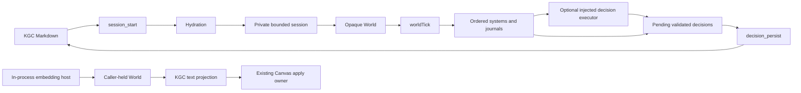

# Design Document: Knowgrph Agentic ECS

## Overview

The Agentic ECS is a native, in-process runtime inserted between validated KGC Markdown and the existing Knowgrph MCP owner. KGC remains the persistent source of truth. A private session hydrates an opaque World, ticks code-injected ordered systems, accumulates validated direct System Decisions and executor-returned Decisions, and atomically persists only pending decision nodes. Separately, an in-process embedding host may project observations from its caller-held World through the existing Canvas owner; the private MCP registry exposes no projection operation.

The implementation uses neutral data-oriented design principles but contains no bitECS code or dependency. It uses the repository-pinned official `@modelcontextprotocol/sdk` through the existing stdio server. There is no new model client, graph orchestrator, renderer, transport, HTTP endpoint, deployment guard, or compatibility facade.

## Design Decisions

1. **Five-name public API.** `ecs/index.js` exports only `createWorld`, `allocateEntity`, `registerComponent`, `query`, and `worldTick`. All stores, journals, sentinels, hydration, persistence, and session mechanics stay internal or integration-specific.
2. **Construction-time systems.** Systems, the optional decision executor, and clock enter through `createWorld` options. A public `registerSystem` would broaden mutable lifecycle state and is intentionally absent.
3. **Atomic allocation.** An entity id is reserved only after every initial component/value validates, preventing holes and partial membership.
4. **Per-system journals.** Earlier successful systems remain committed. Only the currently failing system rolls back; later systems and reasoning do not run.
5. **Restricted transactional context.** Systems receive only frozen query/read/write/set/decision/reasoning verbs. Public reads and another tick fail while a journal is open, and invalid emitted Decisions roll back inside that journal.
6. **Decision-only persistence.** Runtime arrays and entity snapshots remain ephemeral. Persistence consumes pending session decisions, not caller-authored records, and binds writes to the start-time canonical file identity.
7. **Private bounded sessions.** UUID session ids index a private TTL/max-count map. No World or store is serialized into MCP output.
8. **Existing-owner rendering.** ECS snapshots a caller-held World, generates KGC text, and calls `applyChatKgcDocumentTextToCanvas`; it does not create a Source File, renderer fork, or fourth MCP operation.
9. **Capability absence for deployment.** ECS cannot deploy. Every tool response reports `dev-only`; production remains an external release workflow concern.

## Topology



All boxes execute locally in the Knowgrph process. The private three-tool session lane and standalone projection lane are intentionally disconnected. The only persistent mutation is the final atomic KGC decision write.

## Module Ownership

| Owner | Responsibility | Boundary |
|---|---|---|
| `ecs/componentStore.js` | Typed-array schemas, capacity growth, membership, reads/writes, private absence sentinel | No public store export |
| `ecs/world.js` | Opaque World construction, component registration, atomic entity allocation, internal accessors | No public mutable internals |
| `ecs/query.js` | Ascending component-membership intersection and read-only observations | Reject unknown components |
| `ecs/worldTick.js` | Async ordered system execution, per-system journal, reasoning boundary, decision/cost validation | No persistence or transport |
| `ecs/index.js` | Exact five-name public surface | No legacy aliases |
| `ecs/kgcNodeContract.js` | ECS-specific KGC node validation/normalization | Reuses canonical KGC shape |
| `ecs/hydration.js` | Deterministic KGC-to-World construction | No session insertion on failure |
| `ecs/decisionPersistence.js` | Idempotent decision merge and atomic file replacement | No raw World serialization |
| `ecs/renderingLayer.js` | Read-only World-to-KGC text projection | Calls existing Canvas text seam |
| `contracts/kgc-document.schema.js` | Safe canonical preservation of JSON node `properties`, including reserved keys | Preserves existing schemas; ECS validation stays separate |
| `mcp/ecs-tool-contract.js` | Exact tool names, schemas, grammar, result/error envelopes | No execution state |
| MCP ECS runtime/session modules | Safe path resolution, private session lifecycle, dispatch | Bounded memory; Dev-only |
| `mcp/local-tool-contract.js` | Catalog registration for exactly three tools | Existing catalog remains owner |
| `mcp/server.js` | Existing official SDK stdio registration/dispatch | No new transport |
| `canvas/src/features/chat/chatKgcCanvasApply.ts` | Reusable apply-from-text seam | Existing Canvas mutation owner |
| `canvas/src/features/agentic-ecs/agenticEcsCanvasProjection.ts` | Typed Canvas-facing ECS projection adapter | No ECS store ownership |

## Public API

```js
import {
  createWorld,
  allocateEntity,
  registerComponent,
  query,
  worldTick,
} from "./ecs/index.js";

const world = createWorld({
  systems: [],
  decisionExecutor: undefined,
  clock: undefined,
});
```

The World is accepted only by the five functions and integration helpers inside the package. Consumers do not reach into component arrays or attach arbitrary properties. During `worldTick`, public `query`, snapshots/projection, and another tick fail with `ECS_TICK_IN_PROGRESS`; Systems use only their restricted frozen context.

### Component field mapping

| Field type | Storage |
|---|---|
| `f32` | `Float32Array` |
| `f64` | `Float64Array` |
| `i8` | `Int8Array` |
| `i16` | `Int16Array` |
| `i32` | `Int32Array` |
| `u8` | `Uint8Array` |
| `u16` | `Uint16Array` |
| `u32` | `Uint32Array` |

A private module-unique Symbol represents absence. Symbol primitives are already immutable; the design does not attempt to freeze a Symbol. Public observations convert absence to `[absent]` only at presentation boundaries.

## World Invariants

- Component names are unique, non-empty, and registered before entity allocation.
- Field specs are non-empty and use only the eight supported numeric types.
- Entity ids are monotonic integers with no failed-allocation gap.
- Entity allocation validates a complete candidate before mutating any membership or field array.
- Capacity growth is geometric and copies every prior field value and membership bit.
- Queries deduplicate requested component names and return ascending ids.
- Unknown components and invalid values fail before mutation.

## Tick Algorithm

```text
cost_logs = []
decisions = []
for each system in construction order:
  begin a fresh mutation journal
  await the system with only query/read/write/setComponent/emitDecision/requestReasoning
  validate emitted Decisions inside this journal
  if it fails:
    undo this journal only
    return structured failure with earlier commits intact
  commit this journal

if every System succeeded and no reasoning request was emitted:
  append exactly one canonical zero cost log
  return success

if reasoning was requested and no executor is configured:
  defer each request with no cost log
else invoke the executor with an AbortSignal bounded to 30 seconds
if the executor is unavailable or timed out:
  return success with deferred reasoning and no invented decision or usage
require exactly one valid non-none cost_logs entry per executor request
canonicalize usage and retain it even if the paired Decision is invalid/deferred
validate returned decisions
append validated decisions to pending session state
return success
```

The tick implementation is asynchronous even for model-free systems so one API covers synchronous and asynchronous systems. It never persists source data. After a structured MCP tick result, `tickCount` advances before pending retention. Any pending-retention failure caused by a conflicting or invalid/noncanonical Decision is therefore a post-commit failure with `tickCommitted: true`, canonical cost/deferred evidence, and no automatic replay permission. A structured System failure is distinct: earlier System commits and the incremented tick count may remain without this marker.

## KGC Contracts

The canonical document validator admits these structures under an existing `@node` record:

```yaml
- type: EcsComponentSchema
  properties:
    ecsComponent:
      name: Position
      fields:
        x: f32
        y: f32
- type: EcsEntity
  properties:
    ecsEntity:
      entityRef: player
      components:
        Position:
          x: 1
          y: 2
- type: EcsDecision
  properties:
    ecsDecision:
      decisionId: decision-1
      decisionType: world_tick_result
      entityRef: player
      payload: {}
      producedAt: 2026-07-20T00:00:00.000Z
```

Hydration requires at least one schema and one entity, sorts both by stable identifiers before registration/allocation, and validates/indexes every persisted Decision. Decision type is exactly `dialogue_outcome`, `quest_flag`, or `world_tick_result`. It returns `{ ok: true, world, decisionIndex }` internally; unrelated nodes remain untouched. Any ECS-node conflict invalidates the whole hydration attempt.

## Persistence Algorithm

1. Resolve the session and snapshot its pending validated decisions plus start-time canonical path/device/inode identity.
2. Enter the process queue keyed by that canonical path; revalidate root containment, canonical path, and identity inside the turn.
3. Open the source with no-follow semantics, verify the handle identity, and read the original KGC bytes from that handle.
4. Parse through `readKgcNodeState`, validate existing Decisions, and remove candidates whose `decisionId` already exists.
5. If no candidates remain, return an idempotent terminal success and dispose the session.
6. Serialize only new Decision nodes and byte-splice them into block `flow.nodes`, preserving unrelated records and Markdown body.
7. Revalidate the bound target, write a uniquely named sibling temporary file exclusively, capture its replacement identity, and revalidate again.
8. Rename the sibling over the source atomically.
9. On success, update the session's file identity, clear pending state, and dispose the session; on any failure, remove temporary residue where possible, retain pending state, and return a structured error.

No MCP caller may inject a decisions array. This prevents transport input from bypassing decision validation or session provenance. The in-process path queue prevents lost updates among local calls. A bounded per-path identity lineage trusts replacements produced by prior queued ECS renames, so sessions opened on the same original inode can append in sequence; any identity outside that current lineage fails closed. Handle identity and repeated same-turn revalidation reject parent/target swaps exercised by regression tests. Mutation from separate OS processes remains fenced by the repository's branch/worktree collaboration contract, not by a claimed distributed lock.

If rename commits but World disposal fails, the source may already contain the Decisions. The session retains the pending records and replacement file identity so a retry is idempotent and can complete terminal disposal.

## Canvas Projection

The renderer-facing adapter takes an internal read-only World snapshot and produces KGC Markdown text. It passes `{ name, text }` to `applyChatKgcDocumentTextToCanvas`, the extracted seam inside the existing chat/KGC Canvas owner. The seam preserves existing document validation, graph materialization, and Canvas mutation behavior. This adapter is an in-process host seam over a caller-held World, not a tool over the private MCP session registry; snapshot/apply failures use sanitized fixed metadata.

Projection never:

- writes the KGC source file;
- creates a temporary Source File;
- mutates typed arrays while formatting;
- stores a second graph representation; or
- renders through an ECS-specific visual component.

## MCP Contract

| Tool | Invocation | Arguments |
|---|---|---|
| `knowgrph.ecs.session_start` | `/ecs.session-start #agentic-ecs @source.frontmatter` | `{ kgcPath, scope?, binding? }` |
| `knowgrph.ecs.world_tick` | `/ecs.world-tick #agentic-ecs @ecs-session` | `{ sessionId, input?, scope?, binding? }` |
| `knowgrph.ecs.decision_persist` | `/ecs.decision-persist #agentic-ecs @ecs-session` | `{ sessionId, scope?, binding? }` |

Every descriptor uses a closed input JSON schema. Grammar metadata is validated against the matching command, semantic, and binding token. The shared extensible output envelope requires `ok` and `execution_boundary`, and all actual outputs include `execution_boundary: "dev-only"`.

The canonical stdio server intentionally supplies neither systems nor a decision executor. Its default session therefore performs a legal zero-system tick, emits one canonical model-free zero cost log, and closes through zero-pending persistence. Reviewed embedding code may pass systems and an optional executor through `createEcsRuntime({ hydrationOptions })`; the MCP caller cannot author systems, inject decisions, or select a model through `input`.

### Safe source path

The session-start runtime:

1. requires a non-empty string ending in `.md`;
2. resolves it from the configured repository root;
3. resolves root and candidate through `realpath`;
4. verifies the candidate remains under the real root; and
5. captures the regular file device/inode, opens with no-follow semantics, and verifies the handle identity before reading; and
6. rejects root-escaping traversal, symlink escape or swap, directories, missing files, and non-Markdown targets while permitting normalized paths that remain beneath the root.

### Session state machine

```text
absent -> live -> live with pending decisions
live -> disposed after successful or zero-pending persistence
live -> retained after persistence failure
live -> source committed but retained after disposal failure -> idempotent close retry
inactive expired live -> disposed and removed by lazy TTL sweep
inactive expired live -> retained with extended TTL after disposal failure
```

The store uses UUID ids, a finite TTL, a finite maximum count, and a lazy sweep before reads/inserts. Successful access extends a live session's TTL. An expiry disposal failure retains the session, extends its TTL, and surfaces a retryable `ECS_SESSION_DISPOSE_FAILED` error. Capacity exhaustion returns a typed error rather than evicting a live session silently.

## Error Model

All integration boundaries return `{ ok: false, errorCode, message }` with optional non-secret details. Expected validation, session, filesystem, timeout, projection, and tool errors do not escape as uncaught exceptions. MCP uses explicit public allowlists for error/deferred codes, deterministic `system-{index}` labels, and canonical Decision/cost fields. Allowlists constrain field shape, not retained string content; an embedding host must keep secrets out of Decision identifiers/fields/payload, deferred request identifiers, and canonical Cost_Log fields. Sanitized thrown-error/projection metadata and World internals contain no source bytes, executor prompts/arbitrary codes, function names, credentials, or unrestricted absolute-path disclosure.

World core functions may throw typed JavaScript errors for programmer misuse; MCP and Canvas adapters catch and normalize them at their boundaries.

## Correctness Properties

Property tests use the repository-pinned `fast-check` with at least 100 generated runs per property.

1. Supported field specs select the exact typed-array constructors.
2. Component write/read round trips preserve representable numeric values.
3. Capacity growth preserves all earlier values and membership.
4. Unsupported schemas fail without partial component registration.
5. Entity allocation is all-or-nothing and does not consume an id on failure.
6. Absence is distinct from `0`, `NaN`, and present values and does not mutate state.
7. Query returns the ascending intersection for arbitrary membership sets.
8. Permuting equivalent KGC schema/entity node order yields equal hydrated observations.
9. Malformed ECS KGC input produces no session or World fabrication.
10. Systems run once in order and observe prior committed writes.
11. A failing system restores only its own writes, preserves prior commits, and prevents later execution.
12. Equal tick inputs and dependencies yield equal observable outputs.
13. Successful no-reasoning ticks emit exactly one shared-schema zero cost log; failure/concurrency does not.
14. Timeout/unavailable/invalid-usage reasoning emits neither a decision nor fabricated usage, while valid cost survives an invalid paired Decision.
15. Persistence is idempotent by decision id and never writes raw store state.
16. Concurrent same-path persistence retains both non-conflicting batches.
17. Injected validation, write, or pre-rename persistence failure and in-operation parent/target swaps preserve original/outside bytes and pending session decisions; a post-rename disposal failure retains the committed replacement identity for idempotent close retry.
18. Projection is read-only, tick-fenced, maps absence to `[absent]`, preserves distinct representations for present non-finite values/reserved property names, and sanitizes apply failures.
19. Invalid MCP inputs and secret-bearing executor metadata produce structured sanitized errors and no unintended state/source mutation.

Fixed-shape tests, rather than PBT, prove exact package exports, exact MCP tool discovery, official SDK stdio handshake, Canvas seam wiring, no added transport, file-size limits, collaboration selector behavior, and dependency/provenance boundaries.

## Validation Strategy

Focused proof layers are separate:

| Layer | Evidence |
|---|---|
| Core | ECS unit and property tests |
| Source contract | KGC schema tests and byte-preserving persistence tests |
| Transport | Official MCP SDK stdio initialize/list/call tests |
| Canvas | Focused projection tests and Canvas TypeScript check |
| Repository | collaboration selector test, hygiene, and `git diff --check` |
| Integration | protected PR Integration Gate at one exact commit SHA |
| Deployment | Not authorized and not part of this design |

## Security and Operations

- The canonical no-system/no-executor stdio construction performs no outbound request and loads no credential; embedding hosts own all external behavior and cost of injected Systems and executors.
- MCP source paths are contained by realpath, not string-prefix checks alone.
- Session output never exposes World internals.
- Temporary files are sibling-scoped and cleaned after failure where possible.
- Cost and decision data are validated before crossing integration boundaries.
- Dev-only is capability absence, not a caller-selectable deploy flag.
- Production, mirrors, D1, Pages, Workers, R2, and Cloudflare remain untouched.
