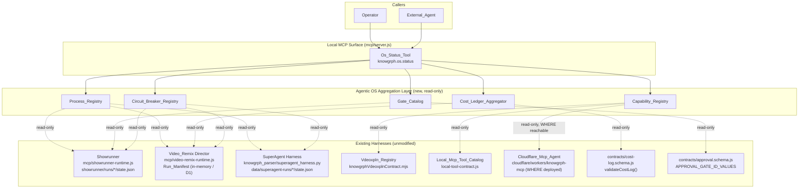
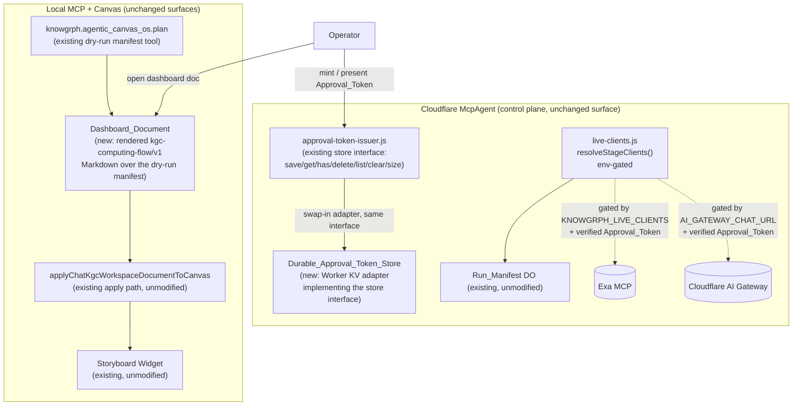

# Design Document

## Overview

The knowgrph Agentic OS is a thin, read-only unification layer over six-plus already-existing, independently-running knowgrph harnesses. It adds no new runtime, no new datastore, and (by default) no new dependency. It is implemented as four aggregation modules — Process_Registry, Capability_Registry, Cost_Ledger_Aggregator, Circuit_Breaker_Registry — plus a Gate_Catalog extension, all exposed through one new MCP tool surface, the Os_Status_Tool, wired into the existing `mcp/server.js` / `mcp/local-tool-contract.js` pattern (and, where deployed, forwarded through the Cloudflare `McpAgent` using the same keyless MCP Streamable HTTP forwarding pattern already established for `knowgrph.video_remix.run`). Per the native-in-repo consolidation (ADR-3 in the combined PRD/TAD), the AWS AgentCore adapter, the AWS Agent-API fallback, and the Vercel product tier are removed from the runtime topology; Supabase is permanently excluded; the Cloudflare `McpAgent` is the sole remote MCP surface.

Every registry is computed at read time from state that already exists on disk or in already-deployed runtimes:

- **Process_Registry** reads Showrunner `showrunner/runs/<run_id>/state.json`, Video_Remix `Run_Manifest` state, and SuperAgent `data/superagent-runs/<run_id>/state.json`.
- **Capability_Registry** reads `knowgrph.vdeoxpln.list` (`buildKnowgrphVdeoxplnRegistry()`), the Local_Mcp_Tool_Catalog (`buildKnowgrphLocalMcpToolDefinitions()`), and, where reachable, the Cloudflare `McpAgent` `tools/list`.
- **Cost_Ledger_Aggregator** reads `contracts/cost-log.schema.js`-shaped entries and `Credit_Ledger` events wherever a Harness already emits them (Director per-stage aggregation in `mcp/video-remix/cost-log.js`, render ledger events, and optional `credit-ledger.jsonl` files), normalizing ledger events into the canonical Cost_Log shape before validating each included entry with the existing `validateCostLog()`.
- **Gate_Catalog** reads the six canonical `APPROVAL_GATE_ID_VALUES` from `contracts/run-manifest.schema.js` / `contracts/approval.schema.js` plus the Showrunner `awaiting_review` boundary, described (not enforced) under the existing `ApprovalGate` shape.
- **Circuit_Breaker_Registry** reads each Harness's already-configured bound (VideoDB 36×10s, SuperAgent `max_steps`/`max_retries_per_task`, Showrunner `max_retries`/`token_budget`, Director 1s→30s backoff cap) and, where available, its current iteration count.

None of the five read views writes a second copy of any Harness's state. This design does not modify `contracts/approval.schema.js`, does not touch the R11 Spend_Isolation_Boundary, and does not touch the Approval_Gate_Invariant (Property 1) established in `knowgrph-acos-mcp-connector` — both are reaffirmed unmodified (see Error Handling). **This revision** extends the design (unchanged above) with Requirements 8–15: a Durable_Approval_Token_Store KV adapter (Track A), a Live_Golden_Path_Run wiring for the already-implemented research/storyboard live clients (Track B), a Dashboard_Document render path over the existing Canvas apply pipeline (Track C), and a documentation/response-shape maturity pass (Capability_Class routing, consistent error/timeout semantics, tool-usage guidance, normalized Harness_Tool_Error, and the Agent_Onboarding_Sequence) over the existing four MCP surfaces — introducing exactly one new persistent artifact (the Durable_Approval_Token_Store KV namespace) and no fifth MCP surface.

**Resolved Decisions** (Open Questions from requirements.md, resolved here):

- **Open Question 2 (tool granularity):** a **single combined tool**, `knowgrph.os.status`, with a required `view` argument (`process_list | capabilities | cost_summary | gate_catalog | circuit_breakers`), is chosen over separate per-view tools. See ADR-1 below.
- **Open Question 1 (SuperAgent multi-run enumeration):** the Process_Registry enumerates SuperAgent runs by listing subdirectories of `data/superagent-runs/` (the existing `default_output_dir()` convention in `knowgrph_parser/superagent_utils.py`) that contain a readable `state.json`. There is today no registry of SuperAgent run ids beyond this directory convention; the design formalizes "one subdirectory of `data/superagent-runs/` with a `state.json` = one Superagent_Run" as the enumeration rule rather than inventing a new index file. This directly satisfies Requirement 1.1's completeness bound: the Process_Registry considers every subdirectory a candidate source and applies the existing "omit if unreadable" rule (1.3) to any subdirectory whose `state.json` is missing, malformed, or unreadable.

## Architecture

The Agentic OS adds exactly one new logical layer between existing MCP tool dispatch and existing Harness state, with no new process and no new network hop for the local path:



**Version**: 2.0.0 — runtime-ready (this document is the topology SSOT for the Agentic OS increment; it extends, and does not replace, the topology already documented in `knowgrph-tech-stack-document.md`). Version notes: v2.0.0 removes the AWS AgentCore node and reduces the Capability_Registry union from four catalogs to three per the ADR-3 native-in-repo consolidation (no Vercel, Supabase, or AWS tier); v1.0.0 (four-catalog, AWS-inclusive) is archived in git history.

### Architecture Delta — Requirements 8–10 (Track A/B/C)

**Version**: 2.1.0 — extends v2.0.0 with three additive nodes behind existing modules. No new MCP surface, no fifth proxy tier (ADR-4/ADR-006 preserved); the Durable_Approval_Token_Store is the sole new persistent artifact, per ADR-FO-1 in `knowgrph-agentic-os-follow-on-prd-tad.md`.



- **No fifth MCP surface**: the Durable_Approval_Token_Store and Live_Golden_Path_Run wiring sit entirely behind the existing Cloudflare `McpAgent` control-plane surface (`cloudflare/workers/knowgrph-mcp`); they add no new tool transport.
- **No new proxy node**: `live-clients.js` is called by the Director exactly as it is today; only its already-designed env gate now has a deployed, approval-token-verified path exercised end to end.
- **Dashboard_Document has no new renderer**: it is a Markdown projection of the existing `knowgrph.agentic_canvas_os.plan` manifest, opened through the existing `applyChatKgcWorkspaceDocumentToCanvas` — the same function used for every other frontmatter-flow document.

## Components and Interfaces

### `mcp/os-status-runtime.js` + `mcp/os-status-cost-ledger.js` (new)

Owns the five read views as pure, read-time aggregation functions, following the naming convention of sibling runtime modules (`mcp/showrunner-runtime.js`, `mcp/video-remix-runtime.js`, `mcp/memory-layer-runtime.js`). The Cost_Ledger_Aggregator implementation is factored into `mcp/os-status-cost-ledger.js` to keep the dispatcher/runtime file below the repo line-budget guard while preserving the `mcp/os-status-runtime.js` export surface.

```js
// mcp/os-status-runtime.js
export async function listProcessRegistry({ rootDir }) { /* Process_Registry */ }
export async function listCapabilityRegistry({ rootDir, cloudflareMcpUrl }) { /* Capability_Registry */ }
export async function summarizeCostLedger({ rootDir }) { /* Cost_Ledger_Aggregator */ }
export async function listGateCatalog({ rootDir }) { /* Gate_Catalog */ }
export async function listCircuitBreakerRegistry({ rootDir }) { /* Circuit_Breaker_Registry */ }
export async function runOsStatusTool(view, args, { rootDir }) { /* Os_Status_Tool dispatcher */ }
```

- **Responsibility**: read existing Harness state sources at call time; normalize; never write.
- **Dependencies**: `contracts/cost-log.schema.js` (`validateCostLog`), `contracts/credit-ledger.schema.js` (`validateCreditLedgerEvent`), `contracts/run-manifest.schema.js` / `contracts/approval.schema.js` (`APPROVAL_GATE_ID_VALUES`, `APPROVAL_TOKEN_TTL_MS`), `mcp/video-remix/cost-log.js`, `mcp/video-remix-runtime.js`, `mcp/showrunner-runtime.js` (read-only reuse of its `loadState`-equivalent path convention), `canvas/src/features/agent-ready/knowgrphVdeoxplnContract.mjs`, `mcp/local-tool-contract.js`.
- **Configuration**: `KNOWGRPH_ROOT` (existing env, same root as `mcp/server.js`), optional `KNOWGRPH_MCP_AGENT_URL` for the WHERE-reachable capability union (already-established env-style config pattern; no new secret).
- **FOSS / Vendor**: FOSS/internal — pure Node module, no new dependency; reuses `@modelcontextprotocol/sdk` already in `mcp/package.json` via `mcp/server.js`.

### `mcp/local-tool-contract.js` (extended)

Adds one new tool descriptor, `knowgrph.os.status`, to `buildKnowgrphLocalMcpToolDefinitions()`, following the existing descriptor pattern (name, input schema, output schema) used for `knowgrph.showrunner.*` and `knowgrph.memory.*`.

- **Interface**: `{ name: "knowgrph.os.status", inputSchema: { view: "process_list"|"capabilities"|"cost_summary"|"gate_catalog"|"circuit_breakers", ...viewArgs }, outputSchema: OS_STATUS_OUTPUT_SCHEMA }`.
- **FOSS / Vendor**: FOSS/internal.

### `mcp/server.js` (extended)

Adds one dispatch branch: `if (toolName === KNOWGRPH_LOCAL_MCP_TOOL_NAMES.osStatus) return jsonToolResult(await runOsStatusTool(args.view, args, { rootDir: KNOWGRPH_ROOT }));` — mirrors the existing dispatch pattern used for `knowgrph.showrunner.*` (`runShowrunnerLocalTool`) and the memory tools (`MEMORY_TOOL_HANDLERS`).

### Cloudflare `McpAgent` remote read-view dispatcher

The Cloudflare `McpAgent` (`cloudflare/workers/knowgrph-mcp`) advertises `knowgrph.os.status` through `tool-registry.mjs` and serves a Worker-owned remote read-view dispatcher in `os-status-tool.mjs`. The remote dispatcher returns Cloudflare-owned/static catalog data and explicit unavailable-source metadata for local filesystem sources the Worker cannot enumerate; it holds no model key, writes no datastore, and does not create a second runtime path for local harness state. Per ADR-3 there is no AWS AgentCore forwarding lane; the Cloudflare `McpAgent` is the sole remote MCP surface.

### `Durable_Approval_Token_Store` (new, Requirement 8, Track A)

A Cloudflare Worker KV-backed adapter implementing the exact `store` interface already defined by `mcp/video-remix/approval-token-issuer.js`'s in-memory store seam: `save(token)`, `get(gateId)`, `has(gateId)`, `delete(gateId)`, `list()`, `clear()`, `size()`. It is a drop-in adapter behind the existing seam — `approval-token-issuer.js`'s issuance, TTL-check, and `consumeSeam()` logic are unmodified.

```js
// cloudflare/workers/knowgrph-mcp/durable-approval-token-store.mjs (new)
export function createKvApprovalTokenStore(kvNamespace) {
  return {
    async save(token) { /* kvNamespace.put(token.gateId, JSON.stringify(token), { expirationTtl: ... }) */ },
    async get(gateId) { /* kvNamespace.get(gateId) -> parsed token or null */ },
    async has(gateId) { /* boolean via get() !== null */ },
    async delete(gateId) { /* kvNamespace.delete(gateId) */ },
    async list() { /* kvNamespace.list() -> Approval_Token[] */ },
    async clear() { /* delete all listed keys — test/dev only */ },
    async size() { /* (await list()).length */ },
  };
}
```

- **Responsibility**: durable persistence of `Approval_Token` records across Worker isolate restarts, within their existing 15-minute TTL (`APPROVAL_TOKEN_TTL_MS`), using KV's native `expirationTtl` so expired tokens self-evict without extra code.
- **Decision**: per **ADR-FO-1** in `knowgrph-agentic-os-follow-on-prd-tad.md`, a KV namespace binding is used instead of a new Durable Object class — smallest diff, reuses a binding category already available to the Worker, zero new DO class, zero new vendor (Requirement 8.6).
- **Wiring**: `approval-token-issuer.js` accepts its `store` as a constructor/factory argument today; the Worker's bootstrap swaps the default in-memory store for `createKvApprovalTokenStore(env.APPROVAL_TOKEN_KV)` — no change to `approval-token-issuer.js` itself, satisfying Requirement 8.1 and 8.5 (no change to `APPROVAL_GATE_IDS`, `APPROVAL_TOKEN_TTL_MS`, or the `ApprovalGate`/`Approval_Token` shape).
- **Non-retry-on-mark-failure**: per Requirement 8.7, if `delete`/consume-marking fails after a permitted spend has already executed, the Worker does not retry within that request/response cycle; the token may remain valid for a subsequent verify call rather than blocking or reversing the completed spend (see Error Handling).
- **FOSS / Vendor**: FOSS/internal — Cloudflare Workers KV is a primitive already used elsewhere in the deployment; no new vendor.

### Track B — Live_Golden_Path_Run wiring (Requirement 9)

No new component. The Video_Remix Director calls `resolveStageClients()` from `mcp/video-remix/live-clients.js` exactly as it does today; this increment's only change is a deployed configuration in which `KNOWGRPH_LIVE_CLIENTS` (or a provider-specific key, e.g. `EXA_API_KEY`) is set on the Cloudflare `McpAgent` Worker, so `resolveStageClients()` resolves the research stage to the live Exa client and the storyboard stage to the live client when `AI_GATEWAY_CHAT_URL` is configured — per **ADR-FO-2** (`knowgrph-agentic-os-follow-on-prd-tad.md`): live stages default to mock; opt-in is via env, and unset env yields deterministic mock/zero-spend regardless of any presented Approval_Token.

- **Gating conjunction** (Requirement 9.7): a live provider call happens if and only if both (a) env/key indicates live mode for that stage AND (b) a verified, unexpired, unconsumed Approval_Token for that stage's gate is presented. A defect evaluating either condition fails closed to the mock — the Director never defaults open to a live call on an evaluation error.
- **No render/commerce live calls this increment** (Requirement 9.6): render and commerce stages remain `requiresAsyncHarness` scaffolds; this wiring exercises only the already-wireable research and storyboard clients.
- **Persistence reuse** (Requirement 9.5): the resulting Run_Manifest persists through the existing Run_Manifest Durable Object store, retrievable via the existing `GET /knowgrph/control-plane/mcp/runs/{id}` route — no new persisted shape.

### Track C — `Dashboard_Document` render path (Requirement 10)

No new renderer, parser, or graph-apply component (Requirement 10.5). `knowgrph.agentic_canvas_os.plan` (`mcp/local-tool-contract.js`, existing) already produces a dry-run manifest with one entry per lane (`market_radar`, `browser_evidence`, `market_to_artifact`, `learning_loop`, `starter_repo`). This increment adds a projection step that renders that manifest as a `kgc-computing-flow/v1` frontmatter-flow Markdown document (the Dashboard_Document), reusing the existing schema, and opens it through the existing `applyChatKgcWorkspaceDocumentToCanvas` apply path onto the existing Storyboard Widget.

```js
// mcp/agentic-canvas-os-dashboard.js (new, thin projection — no new schema)
export function renderDashboardDocument(dryRunManifest) {
  // for each known lane key present AND readable in dryRunManifest.lanes:
  //   emit one flow.nodes[] entry; omit (never fabricate) missing/unreadable lanes
  // actively strip any file-write / deploy / paid-call / payment-mutation affordance
  // field from each node before returning the frontmatter-flow document string
}
```

- **Read-only projection filter** (Requirement 10.3): because the underlying frontmatter-flow schema or an existing Canvas component could otherwise carry a mutation affordance (file-write, deploy, paid-call, payment), `renderDashboardDocument` actively filters those fields out rather than relying on their absence by construction.
- **No lane fabrication** (Requirement 10.4): a lane absent or unreadable in the dry-run manifest is omitted from `flow.nodes[]`; no placeholder node is emitted.
- **Single apply pipeline** (Requirement 10.2): the rendered document is opened via the existing `applyChatKgcWorkspaceDocumentToCanvas`, the same function used for every other frontmatter-flow document — no parallel apply path is introduced.

### Capability_Class / Gateway_Routing_Contract extension to Capability_Registry (Requirement 11)

Not a new component — a field-level extension of the existing Capability_Registry (`mcp/os-status-runtime.js`'s `listCapabilityRegistry`). For every `Capability_Entry` it now derives:

- `capabilityClass`: `"approval_gated_spend"` if the entry's `toolId` appears in the Gate_Catalog's gate-to-tool association (i.e. the owning Harness already associates that capability with an `ApprovalGate`); otherwise `"read_only_discovery"`.
- `recommendedSurfaces`: for `approval_gated_spend`, exactly `["cloudflare_mcp_agent"]`; for `read_only_discovery`, the subset of `{"local_stdio","pages_http_mcp","browser_webmcp"}` drawn from that entry's already-reported `sourceCatalogs`, and never including `cloudflare_mcp_agent`.

This is the **Gateway_Routing_Contract**: expressed entirely as data returned by the existing Capability_Registry, documented here and in the TAD — not a new dispatcher, proxy, or fifth `Mcp_Gateway_Surface` (ADR-4/ADR-006 preserved, Requirement 11.3). Enforcement of the boundary (Requirement 11.4) remains at each owning Harness's existing approval-gate check; where an `approval_gated_spend` call arrives on a non-control-plane surface and the owning Harness's own gate check would not reject it, that surface's own dispatch point performs the boundary check (documented per-surface, not a new process). The `.well-known/mcp/server-card.json` (`cloudflare/pages/knowgrph-agent-ready.mjs`'s `mcpServerCard`, existing) is extended to link to or summarize this mapping (Requirement 11.5).

### Consistent error/timeout semantics across the four Mcp_Gateway_Surfaces (Requirement 12)

Documentation and response-shape convergence over the existing four surfaces — no new component:

| Mcp_Gateway_Surface | Existing timeout bound reused | Failure-mode on unreachable dependency |
|---|---|---|
| Local stdio (`mcp/server.js`) | Process-lifetime bound (no per-call timer beyond the harness's own bound, e.g. Director backoff cap) | `ok:true` + `unavailableSources`/`unreachableCatalogs` when partial success is possible (Process_Registry, Capability_Registry); `Harness_Tool_Error` when the call cannot proceed at all |
| Pages HTTP MCP (`/knowgrph/mcp`) | Existing Pages Function request timeout | `Harness_Tool_Error` (read-only surface; no partial-success metadata path) |
| Browser WebMCP (`navigator.modelContext`) | Existing in-page call timeout already enforced by the WebMCP runtime | `Harness_Tool_Error` |
| Cloudflare `McpAgent` control plane | Existing Worker request timeout / Director's own bounded backoff (1s→30s cap) | `ok:true` + `unavailableSources` for partial reads (e.g. `knowgrph.os.status` views); `Harness_Tool_Error` for orchestration/spend failures |

Every failure response, on any of the four surfaces, is shaped `{ ok: false, errorCode: string, message: string }` — the same `Harness_Tool_Error` shape already used by `knowgrph.os.status` (Requirement 12.1).

### `Harness_Tool_Error` normalization at the `mcp/server.js` dispatch boundary (Requirement 14)

Extends the existing top-level try/catch in `mcp/server.js`'s `CallToolRequestSchema` handler (already used for the Os_Status_Tool dispatcher's `registry_failure` mapping) to normalize **every** harness's failure path, not only the Os_Status_Tool's:

```js
// mcp/server.js (extended CallToolRequestSchema handler)
function normalizeHarnessToolError(rawResult) {
  if (rawResult && rawResult.ok === false && rawResult.error && typeof rawResult.error === "object") {
    // e.g. Showrunner's { ok:false, error:{ code, message } }
    return { ok: false, errorCode: rawResult.error.code || "harness_error", message: rawResult.error.message || String(rawResult.error) };
  }
  if (rawResult && rawResult.ok === false && typeof rawResult.errorCode === "string") {
    return rawResult; // already Harness_Tool_Error-shaped (e.g. knowgrph.os.status)
  }
  if (rawResult instanceof Error || typeof rawResult === "string") {
    // unstructured text-only error content
    return { ok: false, errorCode: "harness_error", message: String(rawResult.message || rawResult) };
  }
  return rawResult; // success-path shape untouched
}
```

- **Preserves existing information** (Requirement 14.2, 14.3): maps `error.code` → `errorCode` and `error.message` → `message` for harnesses already structured (e.g. Showrunner); wraps unstructured text as `message` with a generic non-empty `errorCode` (`harness_error`) for harnesses that are not. No harness's internal handler changes.
- **Success paths untouched** (Requirement 14.2): the normalization function only rewrites shapes recognizable as a failure (`ok:false` or a thrown `Error`/string); any other value passes through unchanged.
- **Capability_Registry reporting** (Requirement 14.4): every `Capability_Entry` now reports that its owning Harness returns the `Harness_Tool_Error` shape on failure (a fixed corollary of this normalization existing at the dispatch boundary).

### `Tool_Usage_Example` field addition to `Capability_Entry` (Requirement 13)

A read-time projection, not a new store. `mcp/os-status-runtime.js`'s Capability_Registry looks up each `toolId`'s already-published usage example (from `mcp/local-tool-contract.js`'s descriptor or `mcp/README.md`'s documented tool-call examples) and, only when found and parseable, attaches it as `usageExample` on the `Capability_Entry`. When no documented example exists, the field is omitted with no other hint that one might exist elsewhere (Requirement 13.2); when a documented example exists but fails to parse, the field is omitted and the parse failure is recorded in response metadata (Requirement 13.4) rather than returning a partial example.

## Data Models

All types below are **derived read-time projections** — none is persisted by the Agentic OS.

```js
// Process_Entry — normalized across Pipeline_Run, Run_Manifest, Superagent_Run
Process_Entry = {
  processId: string,          // run_id / runId, transcribed from source
  harness: "showrunner" | "video_remix" | "superagent",
  status: string,              // source-native status string, transcribed verbatim
  startedAt: string | "unknown", // ISO-8601 if the source records it; else "unknown"
  sourceRef: string,           // path or logical ref to the source-of-truth file/record
}

// Process_Registry response
Process_Registry_Response = {
  ok: true,
  entries: Process_Entry[],    // <= 200, most-recently-started first when truncated
  truncated: boolean,
  unavailableSources: Array<{ harness: string, reason: string }>,
}

// Capability_Entry — normalized union across 3 catalogs
// Fields capabilityClass, recommendedSurfaces, usageExample are new in this revision (Requirements 11, 13);
// all other fields are unchanged from the original R1-7 design.
Capability_Entry = {
  toolId: string,
  owningHarness: string,
  schemaRef: string,            // reference to the already-declared input/output schema
  sourceCatalogs: Array<"vdeoxpln" | "local_mcp" | "cloudflare_mcp_agent">,
  capabilityClass: "read_only_discovery" | "approval_gated_spend",  // new (Requirement 11.1)
  recommendedSurfaces: Array<"local_stdio" | "pages_http_mcp" | "browser_webmcp" | "cloudflare_mcp_agent">, // new (Requirement 11.2)
  usageExample?: string | object,  // new, optional (Requirement 13.1) — present only when sourced from an existing documented example
}

Capability_Registry_Response = {
  ok: true,
  entries: Capability_Entry[],
  unreachableCatalogs: Array<"cloudflare_mcp_agent">,
  usageExampleParseFailures: Array<{ toolId: string, reason: string }>, // new (Requirement 13.4)
}

// Cost_Ledger_Aggregator response
Cost_Ledger_Response = {
  ok: true,
  totalsByHarness: Record<string, { estimated_cost_usd: number }>, // existing field semantics, no new unit
  validationFailures: Array<{ harness: string, sourceRef: string, index: number, sourceKind: "Cost_Log"|"Credit_Ledger", entry: object, errors: Array<{ path: string, reason: string }> }>,
  costEmissionGaps: Array<{ harness: string, reason: string }>, // model-bearing harnesses with no matching Cost_Log or Credit_Ledger
}

// Gate_Catalog response (extends the existing six-gate catalog by one entry)
Gate_Catalog_Response = {
  ok: true,
  gates: Array<{ gateId: string, approvalState: "pending"|"approved"|"rejected"|"n/a", estimatedCostUsd: number | "unknown", token: object | null, sourceRunRef: string | null }>,
}

// Circuit_Breaker_Registry response
Circuit_Breaker_Response = {
  ok: true,
  breakers: Array<{
    harness: string,
    configuredBound: string,       // e.g. "36x10s", "max_steps=N", "1s->30s backoff"
    exitCondition: string,
    currentIterationCount: number | "unavailable",
    processId: string | null,
  }>,
}

// Os_Status_Tool top-level result (any view)
Os_Status_Result =
  | { ok: true, view: string, ...ViewSpecificResponse, cost_log: { model: "none", prompt_tokens: 0, completion_tokens: 0, cache_hits: 0, estimated_cost_usd: 0, incomplete: false } }
  | { ok: false, view: string, errorCode: string, message: string }
```

Reused, unmodified upstream shapes this design reads but never redefines: `ApprovalGate` / `Approval_Token` (`contracts/approval.schema.js`), `Run_Manifest` (`contracts/run-manifest.schema.js`), raw `Cost_Log` (`contracts/cost-log.schema.js`), `Credit_Ledger` event (`contracts/credit-ledger.schema.js`).

```js
// Harness_Tool_Error — new normalized failure shape for every local MCP tool-call failure (Requirement 14)
// Also the shared failure shape referenced across all four Mcp_Gateway_Surfaces (Requirement 12.1).
Harness_Tool_Error = {
  ok: false,
  errorCode: string,   // non-empty; mapped from an existing harness's error.code, or "harness_error" for unstructured text
  message: string,     // non-empty; preserves the existing harness's error information
}
```

**No new persisted data model for Requirements 8–10**:

- **Requirement 8 (Durable_Approval_Token_Store)**: introduces no new response shape. It implements the existing `store` interface (`save`, `get`, `has`, `delete`, `list`, `clear`, `size`) from `mcp/video-remix/approval-token-issuer.js` and persists the existing, unmodified `Approval_Token` shape (`contracts/approval.schema.js`) — only its storage backend changes (in-memory → Worker KV).
- **Requirement 9 (Live_Golden_Path_Run)**: produces the existing `Run_Manifest` shape (`contracts/run-manifest.schema.js`) and existing `Cost_Log` shape (`contracts/cost-log.schema.js`); no new fields, no new schema.
- **Requirement 10 (Dashboard_Document)**: produces the existing `kgc-computing-flow/v1` frontmatter-flow document shape; no new schema, parser, or renderer.

## Correctness Properties

*A property is a characteristic or behavior that should hold true across all valid executions of a system-essentially, a formal statement about what the system should do. Properties serve as the bridge between human-readable specifications and machine-verifiable correctness guarantees.*

### Property 1: Process_Registry coverage and partial-failure behavior

*For any* set of Showrunner/Video_Remix/SuperAgent state sources, each independently readable or unreadable, the Process_Registry response contains exactly one Process_Entry for every readable source, omits every unreadable source from `entries`, records every unreadable source's harness and reason in `unavailableSources`, and returns `ok:true` regardless of how many sources are unreadable.

**Validates: Requirements 1.1, 1.3**

### Property 2: Process_Entry normalization shape

*For any* valid Pipeline_Run, Run_Manifest, or Superagent_Run source record, the Process_Entry derived from it contains exactly the fields `{ processId, harness, status, startedAt, sourceRef }` with `harness` correctly identifying the originating source type, regardless of which of the three source shapes produced it.

**Validates: Requirements 1.2**

### Property 3: Process_Registry 200-cap and truncation-by-recency

*For any* number N of readable state sources, if N ≤ 200 the response contains all N entries with `truncated:false`; if N > 200 the response contains exactly the 200 entries with the most recent `startedAt` values with `truncated:true`.

**Validates: Requirements 1.5**

### Property 4: Capability_Registry union over reachable catalogs

*For any* combination of the three source catalogs (Vdeoxpln_Registry, Local_Mcp_Tool_Catalog, and Cloudflare_Mcp_Agent reachable or not), the set of `toolId`s in the Capability_Registry response equals the union of the `toolId`s from whichever catalogs were reachable, and includes the Os_Status_Tool's own tool id as a member contributed by the Local_Mcp_Tool_Catalog.

**Validates: Requirements 2.1, 6.5**

### Property 5: Capability entry minimum-fields projection

*For any* capability entry present in any of the three source catalogs, the corresponding Capability_Entry in the Capability_Registry response carries a non-empty `toolId`, a non-empty `owningHarness`, and a `schemaRef` that resolves to the schema already declared by its source catalog.

**Validates: Requirements 2.2**

### Property 6: Capability_Registry de-duplication by tool id

*For any* tool id declared by more than one of the three source catalogs, the Capability_Registry response contains exactly one Capability_Entry for that tool id, and that entry's `sourceCatalogs` lists every catalog that declared it.

**Validates: Requirements 2.3**

### Property 7: Capability_Registry partial-unreachability behavior

*For any* subset of {Cloudflare_Mcp_Agent} made unreachable, the Capability_Registry response still returns `ok:true` with entries from the remaining reachable catalogs, and `unreachableCatalogs` names exactly that subset.

**Validates: Requirements 2.4**

### Property 8: Cost_Ledger_Aggregator per-harness total correctness

*For any* set of valid Cost_Log entries and Credit_Ledger events tagged by harness, the reported `totalsByHarness[harness].estimated_cost_usd` equals the arithmetic sum of `estimated_cost_usd` across that harness's valid normalized entries, expressed using the existing field name and numeric semantics with no second unit or currency introduced.

**Validates: Requirements 3.1, 3.5**

### Property 9: Cost_Ledger_Aggregator validation gate

*For any* mixed batch of Cost_Log entries and Credit_Ledger events, an entry contributes to `totalsByHarness` if and only if the normalized Cost_Log passes `validateCostLog()` and, for Credit_Ledger input, the source event also passes `validateCreditLedgerEvent()`; every invalid entry is excluded from the total, appears in `validationFailures`, and aggregation of the remaining entries in the batch completes without halting.

**Validates: Requirements 3.2, 3.3**

### Property 10: Cost_Emission_Gap detection correctness

*For any* pairing of a harness's Process_Registry history (containing zero or more model-bearing calls) with its available Cost_Log or Credit_Ledger entries, the harness appears in `costEmissionGaps` if and only if it has at least one model-bearing call with no corresponding schema-valid cost entry.

**Validates: Requirements 3.4**

### Property 11: Gate_Catalog canonical-plus-one completeness

*For any* snapshot of the six canonical `APPROVAL_GATE_ID_VALUES`, the Gate_Catalog response's `gates` set contains all six canonical gate ids plus exactly one additional entry representing the Showrunner stage-approval boundary.

**Validates: Requirements 4.1**

### Property 12: Gate_Catalog pending-entry reporting

*For any* Showrunner Pipeline_Run in `awaiting_review`, or any Harness-carried ApprovalGate with `approvalState:"pending"`, the Gate_Catalog response contains a pending gate entry for that run shaped as `{ gateId, approvalState, estimatedCostUsd, token }` matching the existing `ApprovalGate` fields.

**Validates: Requirements 4.2**

### Property 13: Gate_Catalog unknown-cost indicator (no fabrication)

*For any* Showrunner stage-approval boundary for which no cost data is derivable from existing sources, the Gate_Catalog reports `estimatedCostUsd` using the existing Cost_Log unknown indicator (`COST_LOG_UNKNOWN`), never a fabricated numeric value.

**Validates: Requirements 4.4**

### Property 14: Circuit_Breaker_Registry configured-bound transcription fidelity

*For any* Harness's already-configured max-iteration bound and circuit-breaker exit condition, the Circuit_Breaker_Registry reports values identical to that Harness's existing configuration, for every one of the four known harness bound shapes (VideoDB poll count, SuperAgent `max_steps`/`max_retries_per_task`, Showrunner `max_retries`/`token_budget`, Director backoff cap).

**Validates: Requirements 5.1**

### Property 15: Circuit_Breaker_Registry current-iteration-count always present

*For any* in-flight Process_Entry, the Circuit_Breaker_Registry response always includes a `currentIterationCount` field for that entry's harness — either a non-negative integer when the underlying count is available, or the string `"unavailable"` when it is not — and never omits the harness from `breakers`.

**Validates: Requirements 5.2, 5.4**

### Property 16: Os_Status_Tool structured-error-on-failure

*For any* of the four underlying registries induced to fail (thrown error, rejected promise, or malformed source data), the Os_Status_Tool call resolves to `{ ok:false, view, errorCode, message }` and never throws an uncaught exception or leaves an unhandled rejection.

**Validates: Requirements 6.3**

### Property 17: Os_Status_Tool zero-cost self-accounting

*For any* Os_Status_Tool view invoked with any valid arguments, either the Cost_Log entry emitted for that call has `estimated_cost_usd`, `prompt_tokens`, and `completion_tokens` each computed as exactly `0` because no model call occurs on that code path (never by clamping a non-zero computed value to `0`), or, if any of those three fields would be computed as non-zero, the call resolves to a Harness_Tool_Error rather than a successful result carrying that non-zero value.

**Validates: Requirements 6.4**

### Property 18: Registry read-only invariant across all read views

*For any* of the read views (Process_Registry, Capability_Registry, Cost_Ledger_Aggregator, Gate_Catalog, Circuit_Breaker_Registry) and any of their underlying sources-of-truth (Harness state files, capability catalog modules, `contracts/cost-log.schema.js` / `contracts/credit-ledger.schema.js` / `contracts/approval.schema.js` exported constants, circuit-breaker counters), invoking a read call leaves that source-of-truth byte-identical before and after the call — no new file is written, no existing file's content changes, and no exported constant's value changes.

**Validates: Requirements 1.4, 2.5, 4.3, 5.3**

### Property 19: Durable_Approval_Token_Store survives store-adapter swap

*For any* Approval_Token minted with a `gateId` and `issuedAt` within its 15-minute TTL, if the backing store is swapped from one adapter instance to a fresh adapter instance pointed at the same underlying KV data (simulating a Worker restart), then a `verify` call for that `gateId` on the fresh adapter instance still resolves the token as unconsumed, and `APPROVAL_GATE_IDS`, `APPROVAL_TOKEN_TTL_MS`, and the `ApprovalGate`/`Approval_Token` shape remain byte-identical before and after the swap.

**Validates: Requirements 8.1, 8.2, 8.5**

### Property 20: Live provider call requires both env/key AND a verified Approval_Token; authorized output is well-formed; resolution success never substitutes for the token check

*For any* combination of {live-mode env/key present or absent} × {a verified, unexpired, unconsumed Approval_Token presented or not} for a gated stage, the Video_Remix Director invokes the live provider client for that stage if and only if both conditions hold — and fails closed to the deterministic mock on a defect evaluating either condition, or when live client resolution succeeds but the Approval_Token condition is not satisfied (resolution succeeding never by itself permits the call to proceed to the provider); when both conditions hold and the stage is research, the Research_Harness's returned source count is `>= 3` and the emitted Cost_Log passes `validateCostLog()`; when both conditions hold and the stage is storyboard, the storyboard stage's execution completing is sufficient for stage success regardless of whether the emitted Kgc_Document validates against `kgc-computing-flow/v1` or has `flow.nodes.length` equal to the planned shot count — a schema-validation or node-count mismatch on the emitted Kgc_Document is a storyboard-harness-level output-validation/fallback concern and never causes the Live_Golden_Path_Run stage itself to be reported as failed.

**Validates: Requirements 9.1, 9.2, 9.3, 9.4, 9.7**

### Property 21: Dashboard_Document renders exactly the readable lanes with all mutation affordances filtered and logged, regardless of component novelty

*For any* `knowgrph.agentic_canvas_os.plan` dry-run manifest with an arbitrary subset of its known lanes present, absent, or unreadable, and an arbitrary subset of file-write/deploy/paid-call/payment-mutation affordance fields present on those lanes' underlying schema — whether that schema/component is newly built or reused — the rendered Dashboard_Document's `flow.nodes[]` set contains exactly one entry per lane that is both present and readable in the manifest (never a placeholder for an absent/unreadable lane), no node in the rendered document carries a file-write, deploy, paid-call, or payment-mutation affordance field, and every affordance field that was filtered out during rendering produces a corresponding log/alert record of that filtering event.

**Validates: Requirements 10.1, 10.3, 10.4, 10.6**

### Property 22: Capability_Class and recommended-surface assignment correctness (recommendation, not a hard block, for read_only_discovery)

*For any* Capability_Registry entry set and any subset of those entries associated with a Gate_Catalog gate id, every entry associated with a gate id is classified `capabilityClass:"approval_gated_spend"` with `recommendedSurfaces` equal to exactly `["cloudflare_mcp_agent"]`, and every entry not associated with a gate id is classified `capabilityClass:"read_only_discovery"` with `recommendedSurfaces` equal to a non-empty subset of its own `sourceCatalogs`-derived surfaces that never includes `cloudflare_mcp_agent`; the absence of `cloudflare_mcp_agent` from a `read_only_discovery` entry's `recommendedSurfaces` is a routing recommendation only and does not by itself imply that a call to that capability on the Cloudflare_Mcp_Agent control-plane surface is rejected. *For any* `approval_gated_spend` call arriving on a Mcp_Gateway_Surface other than `cloudflare_mcp_agent`, and any combination of {owning Harness's approval-gate check fails or not} × {surface-boundary check fails or not}, there is no combination in which both checks fail and the call is nonetheless permitted to proceed — the surface-boundary check's own failure mode is fail-closed.

**Validates: Requirements 11.1, 11.2, 11.4**

### Property 23: Harness_Tool_Error shape on induced failure, per surface, with partial-success carve-out preserved and determinable metadata retained on total failure

*For any* of the four Mcp_Gateway_Surfaces and any induced failure cause (validation error, unknown tool, harness-internal throw, or an unreachable dependency), the surface's response is `{ ok:false, errorCode, message }` with non-empty string `errorCode` and `message` whenever the call cannot proceed at all, and that response includes whatever `unavailableSources`/`unreachableCatalogs` metadata was determinable at the point of failure rather than omitting it solely because the call failed; and whenever the underlying dependency failure still permits a partial result (the same conditions already covered by Properties 1, 7, and 16), the response instead returns `ok:true` with the gap named in `unavailableSources`/`unreachableCatalogs`, never a `Harness_Tool_Error` for that partial-success case.

**Validates: Requirements 12.1, 12.3**

### Property 24: Tool_Usage_Example is never fabricated

*For any* set of tool descriptors, each either carrying a well-formed documented usage example, no documented example, or a malformed/unparseable documented example, the corresponding Capability_Entry's `usageExample` field is present and equal to the documented example if and only if a well-formed documented example exists; is absent with a corresponding entry in `usageExampleParseFailures` when the documented example exists but fails to parse; and is absent with no parse-failure entry and no other hint of an example when no documented example exists at all.

**Validates: Requirements 13.1, 13.2, 13.3, 13.4**

### Property 25: Harness_Tool_Error normalization preserves error information and leaves success paths unchanged

*For any* harness failure payload shaped either as the existing `{ok:false, error:{code, message}}` form or as unstructured text/`Error`, normalizing it at the `mcp/server.js` dispatch boundary produces `{ ok:false, errorCode, message }` where `errorCode` and `message` are non-empty and traceable to the original `error.code`/`error.message` or original text; and for any success-path payload (not shaped as a failure), the normalization function returns that payload unchanged.

**Validates: Requirements 14.1, 14.2, 14.3, 14.4**

### Property 26: Agent_Onboarding_Sequence steps 2–3 are resolvable entirely from `capabilities` + `gate_catalog` views, with a correct zero-gated-capability case

*For any* Capability_Registry (`capabilities` view) and Gate_Catalog (`gate_catalog` view) response pair, step 2 of the Agent_Onboarding_Sequence always resolves to at least one `read_only_discovery` Capability_Entry drawn from the `capabilities` view alone; and if the pair contains at least one `approval_gated_spend` Capability_Entry, step 3 resolves to at least one such entry whose associated gate id is present in the `gate_catalog` view's `gates[]` set; if the pair contains zero `approval_gated_spend` entries, steps 3 and 4 are reported inapplicable and no error is raised.

**Validates: Requirements 15.3, 15.4**

## Error Handling

- **Unreadable/malformed state source** (Process_Registry, Circuit_Breaker_Registry): caught per-source; the source is omitted/marked unavailable; the overall call still returns `ok:true` (Requirement 1.3, 5.4).
- **Unreachable Cloudflare_Mcp_Agent catalog** (Capability_Registry): caught per-catalog; catalog listed in `unreachableCatalogs`; remaining catalogs still returned (Requirement 2.4).
- **Invalid Cost_Log or Credit_Ledger entry** (Cost_Ledger_Aggregator): excluded from totals via `validateCostLog()` / `validateCreditLedgerEvent()`, recorded in `validationFailures`, aggregation continues (Requirement 3.3).
- **Underlying registry throws** (Os_Status_Tool dispatcher): every registry call is wrapped in try/catch inside `runOsStatusTool`; any throw is converted to `{ ok:false, view, errorCode:"registry_failure", message }`, mirroring the existing `mcp/server.js` `CallToolRequestSchema` handler's top-level try/catch pattern (Requirement 6.3).
- **Spend_Isolation_Boundary / Approval_Gate_Invariant reaffirmation**: this design introduces no code path that issues, verifies, or consumes an `Approval_Token`, and no code path that holds or forwards a model key on any tier. After the ADR-3 native-in-repo consolidation there is no AWS or Vercel tier at all, so the R11 boundary's external-tier audit surface is strictly smaller. The Gate_Catalog is read/describe-only (Requirement 4.5) and defers all enforcement to the existing `Hitl_Gate_Service` and the Showrunner `approve_stage` handler. This design **introduces no new spend boundary and no new approval-issuance path**; R11 and Property 1 (`knowgrph-acos-mcp-connector`) remain unmodified and are exercised unchanged by that spec's existing test suite — no new Property 1 variant is authored here.
- **`estimated_cost_usd` non-zero on an Os_Status_Tool call**: per Requirement 6.4, this is treated as a defect to fix at its source (a stray model call was introduced), not suppressed by clamping — the design deliberately has no clamping code path.

### Error Handling additions — Requirements 8, 9, 14 (this revision)

- **Durable_Approval_Token_Store KV read/write failure** (Requirement 8): a KV `get`/`save` failure during `verify` is surfaced to the caller as a `Harness_Tool_Error` (`errorCode:"token_store_unavailable"`) rather than silently treated as "token not found" — a store failure must never be conflated with a legitimately-absent or -consumed token, since that would silently lose token state. A KV `delete` (consume-marking) failure **after** the permitted spend has already executed is the one exception per Requirement 8.7: it is logged but not retried within that request/response cycle, and the spend response to the caller is unaffected; the token may remain valid for a subsequent verify call rather than the Worker blocking or reversing the already-completed spend.
- **Missing env/provider secret for a live stage** (Requirement 9, reaffirming ADR-FO-2): when `KNOWGRPH_LIVE_CLIENTS` is unset and no provider key is present, `resolveStageClients()` returns the existing deterministic mock and the Director makes zero live-provider calls, regardless of any presented Approval_Token — this is the existing, unmodified ADR-FO-2 behavior, not a new error path. When env/key is present but no verified Approval_Token is presented, live client *resolution* may still occur but zero live *calls* are made until a token verifies; a defect evaluating either the env/key condition or the token-verification condition fails closed to the mock.
- **`Harness_Tool_Error` normalization mapping rules** (Requirement 14 — this section *is* the normalization specification): at the `mcp/server.js` `CallToolRequestSchema` dispatch boundary, every tool result is passed through `normalizeHarnessToolError()` before being returned to the caller:
  - A result already shaped `{ok:false, errorCode, message}` (e.g. `knowgrph.os.status`) passes through unchanged.
  - A result shaped `{ok:false, error:{code, message}}` (e.g. Showrunner) maps `error.code → errorCode` and `error.message → message`, with no change to the harness's internal handler.
  - An unstructured `Error` instance or plain string is wrapped as `{ok:false, errorCode:"harness_error", message: String(error)}`.
  - Any value not matching one of the three failure shapes above (i.e. every success-path response) is returned unchanged — this normalization step never rewrites a success-path shape.

## Testing Strategy

**Dual testing approach**: property tests (above) validate universal aggregation/read-only behavior across generated Harness state fixtures; unit/integration tests cover the fixed-shape wiring points below.

- **Property tests**: implemented with `fast-check` (already available via the repo's existing PBT convention — see `contracts/__pbt__/`, `mcp/__pbt__/`), minimum 100 iterations each, one test per property above. Each test is tagged `Feature: knowgrph-agentic-os, Property {N}: {property title}`. Generators produce randomized Harness state fixtures (Showrunner `state.json` shapes, Run_Manifest shapes, SuperAgent `state.json` shapes, Cost_Log entries, Credit_Ledger events, ApprovalGate entries, catalog entries) written to a temp directory standing in for `KNOWGRPH_ROOT`; no property test touches the real repo's `showrunner/runs/`, `data/superagent-runs/`, or `contracts/*.schema.js` files.
- **Unit/example tests**:
  - Requirement 6.1: `knowgrph.os.status` appears in `ListTools` output from `mcp/local-tool-contract.js` with the documented input/output schema (example test, fixed descriptor).
  - Requirement 6.2 / topology forwarding: 1 integration-style test asserting the Cloudflare `tool-registry.mjs` entry for `knowgrph.os.status` exists and carries no model-key environment reference (reuses the existing secret-scan smoke test pattern from `knowgrph-acos-mcp-connector` R11.1/R11.3/R11.5).
  - Requirement 7.1/7.2: one smoke check asserting package manifests and lockfiles (`package.json`, `package-lock.json` where present) across `canvas/`, `mcp/`, `contracts/`, and `cloudflare/workers/knowgrph-mcp` show zero added dependencies attributable to this increment, and no new D1 migration / R2 bucket / KV namespace / Durable Object class is present.
  - Open Question 1 resolution: one example test verifying that a `data/superagent-runs/` subdirectory with no `state.json` is treated as unreadable (folds into Property 1's fixture set as an edge case, plus one explicit example test for documentation clarity).
- **Not property-tested (and why)**: Requirements 6.1 (fixed tool registration), 6.2 (infrastructure wiring, no meaningfully-varying input), 7.1/7.2/7.3 (dependency-manifest/documentation checks), 4.5/7.4 (architectural non-mutation already covered by Property 18 and the existing `knowgrph-acos-mcp-connector` Property 1 suite, which is run unchanged and not re-derived here).

### Testing Strategy additions — Requirements 8–15 (this revision)

- **Property tests** (Properties 19–26): same `fast-check` convention, minimum 100 iterations each, one test per property, tagged `Feature: knowgrph-agentic-os, Property {N}: {property title}`. Generators produce randomized Approval_Token fixtures (Property 19), env/token-combination fixtures with mocked live clients (Property 20), randomized dry-run manifest lane subsets with randomized mutation-affordance fields (Property 21), randomized Capability_Entry/Gate_Catalog association sets (Property 22), randomized per-surface failure-injection fixtures (Property 23), randomized tool-descriptor sets with well-formed/absent/malformed examples (Property 24), randomized per-harness failure/success payloads (Property 25), and randomized capabilities/gate_catalog view pairs including the zero-gated-capability case (Property 26). None of these tests make a real network call to Exa, AI Gateway, or Cloudflare KV — Property 19 and 20 use in-memory fixtures standing in for the KV adapter and live clients respectively.
- **Unit/example tests**:
  - Requirement 8: reuse `mcp/__tests__/approval-token-single-use.test.mjs` and `mcp/__tests__/approval-rejection-path.test.mjs` unmodified, parametrized against `createKvApprovalTokenStore()` backed by a KV fixture/mock, per the follow-on doc's VCC for PRD-FO-1.
  - Requirement 9: reuse `mcp/__tests__/director-live-run.test.mjs` and `mcp/__tests__/research-harness.test.mjs` with injected fetch/fixture Exa and AI Gateway clients, asserting zero live-client invocations when `KNOWGRPH_LIVE_CLIENTS`/`EXA_API_KEY` are unset.
  - Requirement 10: one example test asserting a fixture `dashboard.agentic-os.md` document generated from a `knowgrph.agentic_canvas_os.plan` dry-run manifest applies through `applyChatKgcWorkspaceDocumentToCanvas` with node count equal to the manifest's lane count, and that no second Canvas apply function is invoked for this document type.
  - Requirements 11–15: capabilities-view fixture tests — one asserting `.well-known/mcp/server-card.json` links to or embeds the Capability_Class/Mcp_Gateway_Surface mapping (11.5); one per Mcp_Gateway_Surface asserting the documented timeout bound and failure-mode table match that surface's own existing fixtures (12.2, 12.4); one asserting every Capability_Entry with a documented example in `mcp/README.md` carries a matching `usageExample` (13.1); one asserting the Capability_Registry response documents that every entry's owning Harness returns `Harness_Tool_Error` on failure (14.4); and one fixture External_Agent walkthrough test resolving the Agent_Onboarding_Sequence entirely from `knowgrph.os.status` responses (15.1–15.3).
- **Not property-tested (Requirements 8–15) and why**: 8.3/8.4 (single-use/consumed-rejection behavior — already covered by the existing `knowgrph-acos-mcp-connector` Property 1 and this design's own Property 19 companion tests re-run against the new adapter, not re-derived as a new property), 8.6 (fixed vendor/DO-class constraint, checked by the existing dependency-manifest smoke test extended to cover the KV binding), 9.5/9.6 (infrastructure persistence reuse and a fixed non-invocation guarantee), 10.2/10.5 (fixed single-pipeline wiring and non-duplication, architectural), 11.3/11.5 (fixed no-new-dispatcher constraint and one static documentation-linkage check), 12.2/12.4 (fixed documentation-completeness tables), 15.1/15.2 (fixed documentation-content checks against the design/TAD text itself).
