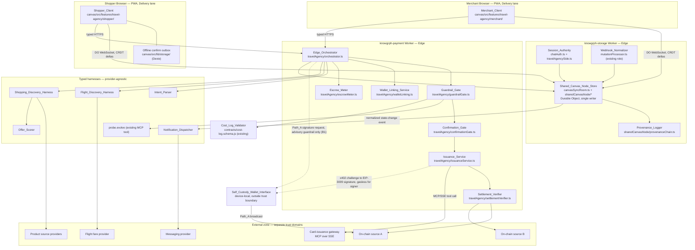
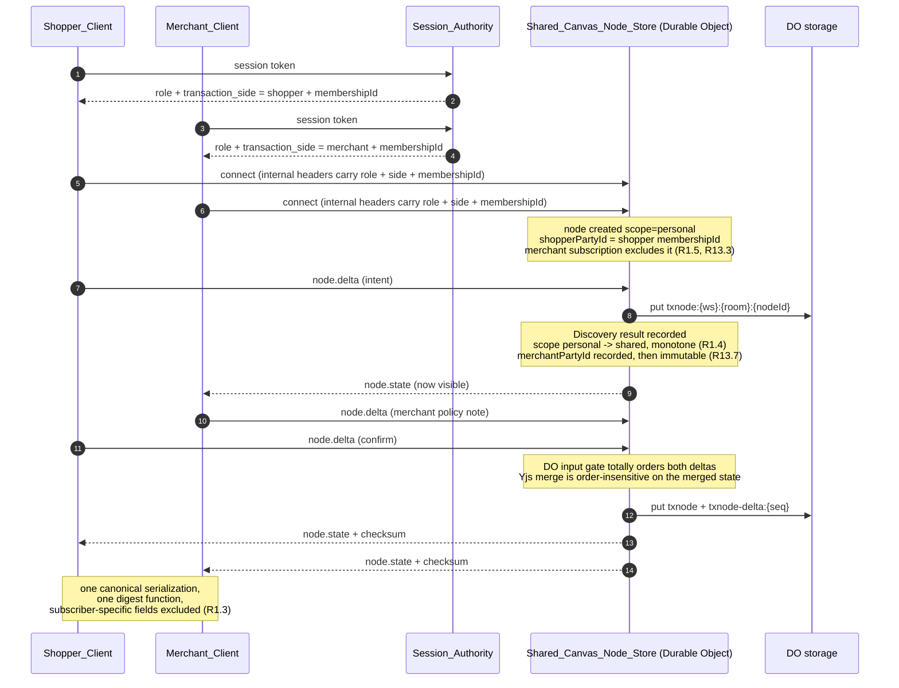
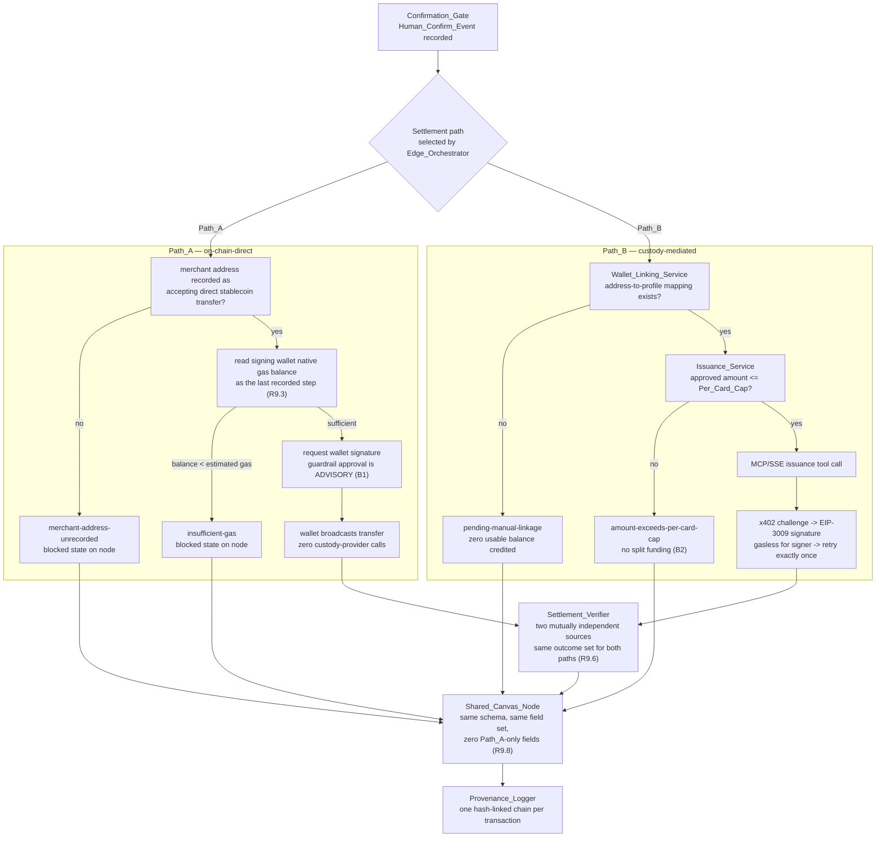

# Design Document

## Overview

This increment adds two agent-mediated commerce flows — a SIN→KUL flight booking and a comparison-shopping purchase — and one new primitive, the **Shared_Canvas_Node**, to the existing `knowgrph` codebase. It is an extension of running substrate, not a greenfield subsystem. Nine of the twenty-one components named in the requirements glossary already exist in some form; the design says for each one whether it extends real code or is net-new, and names the file.

Three seams carry the user-facing value:

1. A **single stored record per transaction node identity** in the existing `KnowgrphCanvasSyncRoom` Durable Object, merged with Yjs and read by both a shopper-side and a merchant-side subscription whose expanded payloads produce equal `Node_Payload_Checksum` values.
2. A **server-side Guardrail_Gate** in the edge runtime that blocks payment-instrument issuance above a session-configured ceiling and emits bounded flexible-date retries.
3. A **Confirmation_Gate** that no `Payment_Call` may precede in session-log order, including the Path_A wallet signature request.

### Where this sits inside the existing architecture

| Existing substrate | What this increment does to it |
|---|---|
| `cloudflare/workers/knowgrph-storage` — D1 + R2 + `KNOWGRPH_CANVAS_ROOM` Durable Object, hand-rolled SHA-256 bearer sessions (`chatAuth.ts`), workspace roles in `workspace_memberships` | Hosts Shared_Canvas_Node_Store, Session_Authority extension, Provenance_Logger. Adds one D1 migration and one Durable Object record family. |
| `cloudflare/workers/knowgrph-payment` — `payment_purchase_lifecycles` / `_approvals` / `_cards` / `_authorizations` tables, `agenticCommerceX402.ts`, `chainEvidenceAdapter.ts`, `straitsxPaymentRailAdapter.ts`, `@x402/*` + `viem` | Hosts Guardrail_Gate, Confirmation_Gate, Issuance_Service, Settlement_Verifier, Wallet_Linking_Service, Escrow_Meter, Path_A orchestration. Reuses the lifecycle and approval tables rather than inventing a parallel state machine. |
| `grph-shared/src/collaboration/yjsSnapshot.ts` — client-side Yjs helpers; already bundled into the storage Worker through `collaborationBridge.ts` | Becomes the merge and canonical-serialization implementation inside the Durable Object. The Worker bundle already resolves `yjs`, so the bundling path is proven; the Durable Object binding is not. |
| `mcp/probe-tree-*` — `knowgrph.probe.{generate,select,evolve}` with full JSON Schemas, bounded defaults `maxDepth 8`, 2–4 options, `tokenBudget 1200` | `probe.evolve` becomes the retry-scoring surface for Guardrail_Gate retries. No schema change. |
| `mcp/external-tool-gateway-contract.js`, `mcp/external-tool-profile-registry.js` | Transport enum gains `sse` so Issuance_Service can bind an MCP-over-SSE gateway. |
| `contracts/cost-log.schema.js`, `contracts/semantic-key.js` | Reused unchanged as the Cost_Log shape and the canonical-serialization helper. No second cost-log schema, no second stable-stringify. |
| `canvas/src/lib/storage/*` — Dexie local-first engine, outbox, `{namespace}\u0000{id}` keys, Workbox PWA | Hosts Shopper_Client and Merchant_Client offline behaviour. Offline confirm queue extends the existing outbox. |
| `fast-check` 3.23.2 devDependency, `__pbt__/` convention in `mcp/`, `ecs/`, `docs/`, `web/`, `contracts/` | All ten correctness properties bind to `__pbt__` files. No new test framework. |

### Cost posture

Every decision below that spends money, tokens, or calendar time states its cost and its cheaper alternative. The increment targets **$0 monthly infrastructure TCO** — no binding beyond the already-provisioned Cloudflare Workers, Durable Objects, D1 and R2 — and a **configured monthly token ceiling** consumed only by Intent_Parser and Offer_Scorer. Every other component records a zero-model Cost_Log, and a non-zero model call from one of those components is a defect the Cost_Log_Validator reports (Requirement 15.3).

### What is deferred, not solved

Blocked items **B1** (no Path_A guardrail enforcement point), **B2** (Per_Card_Cap versus the flagship SGD 500 Budget_Ceiling), and **B3** (unconfirmed production issuance schema) are carried forward unresolved. All eleven Open Questions Carried Forward remain open, including **Open Question 11** — which of the three coexisting collaboration transports owns non-transaction canvas documents. Requirement 1.8 binds *shared transaction nodes* to the Durable Object canvas-room WebSocket and nothing else; the PocketBase Yjs rooms and the peer-to-peer module keep whatever they own today, and this design deliberately does not decide their future.

---

## Architecture

### Component topology



### Shopper/merchant dual-read data flow

The point of the primitive is that there is no mirroring step to go wrong. One record, one merge, two filtered reads.



### Settlement fork — Path A and Path B converging on one node



The convergence is structural, not conventional: both paths write through the same `recordSettlementOutcome` seam with the same typed payload, so there is no place to add a Path_A-only field without failing the node-delta schema validation.

---

## Components and Interfaces

Every external provider sits behind a typed interface whose endpoint, credentials and limits resolve from operator-owned configuration at invocation time. Vendor names appear only as reference implementations. Boundary schema validation — not the compiler — carries the typed-contract guarantee, because `canvas/tsconfig.json` sets `strict: false` (Requirement 16.3).

Module decomposition below respects the CI-enforced 600-line and 500-KiB per-file caps (`scripts/check-hygiene-compliance.mjs`) from the start. `canvasSyncRoom.ts` is already 549 lines, so the shared-node work lands in a sibling directory with a thin dispatch seam in the existing class rather than inline.

### Shared_Canvas_Node_Store

- **Status**: extends `cloudflare/workers/knowgrph-storage/canvasSyncRoom.ts` (class `KnowgrphCanvasSyncRoom`). The CRDT-merge-to-persistence join is **net-new**.
- **Modules**:
  - `sharedCanvasNode/nodeDeltaContract.ts` — typed node-delta schema, full-document validation before any partial apply.
  - `sharedCanvasNode/nodeCrdtMerge.ts` — `Y.Doc` lifecycle per node identity over `grph-shared/src/collaboration/yjsSnapshot.ts`.
  - `sharedCanvasNode/nodeChecksum.ts` — canonical serialization, excluded-field constant, SHA-256 digest.
  - `sharedCanvasNode/nodeStorage.ts` — Durable Object key layout, persistence, rehydration, replay-log pruning.
  - `sharedCanvasNode/nodeSubscription.ts` — scope and party filtering, replay-versus-snapshot decision, re-validation ticker.
  - `sharedCanvasNode/nodeCostLog.ts` — zero-model Cost_Log per operation.
  - `sharedCanvasNode/provenanceChain.ts` — hash-linked append, gap markers, verification verdict.
- **Input**: `NodeDeltaEnvelope` over the existing canvas-room WebSocket. **Output**: `NodeStateFrame`, `NodeReplayBatch`, `NodeSnapshotFrame`, `NodeDeltaRejection`.
- **Errors**: `node-delta-schema-invalid` (names failing field path), `delta-limit-exceeded` (names exceeded limit and configured value), `node-scope-forbidden`, `node-party-mismatch`, `session-expired`, `node-rehydration-checksum-mismatch`.
- **Cost**: zero model calls, zero estimated model cost, one Cost_Log per merge, write, rejection, replay and snapshot serve (Requirements 1.12, 1.13).

### Session_Authority

- **Status**: extends `cloudflare/workers/knowgrph-storage/chatAuth.ts` and `canvasRoomProxyIdentity.ts`. New module `travelAgencySide.ts`.
- **Input**: bearer session token. **Output**: `{ userId, membershipId, workspaceId, role, transactionSide }` where `role` stays the existing `viewer | editor | owner | provider-admin` union and `transactionSide` is exactly one of `shopper | merchant`.
- **Propagation decision**: the transaction side travels in a sibling internal header `x-knowgrph-room-transaction-side`, written by the same proxy-identity authority that writes `x-knowgrph-room-role` and validated in the same `readConnectionAttachment` gate. This is one propagation mechanism carrying two fields, not a second authentication path (Requirement 13.5). Requirement 13.2 names the role header as the channel; the design reads that as the internal-header channel rather than that one header key, because packing a side value into the role string would fork the role union Requirement 13.1 requires to stay independent. Cheaper alternative — reuse the single header with a compound value — was rejected on that ground and is recorded here rather than hidden.
- **Errors**: `session-invalid`, `transaction-side-unresolved` (the two are distinguishable per Requirement 13.6).

### Shopper_Client

- **Status**: net-new feature surface at `canvas/src/features/travel-agency/shopper/`, over the existing PWA, Dexie local-first engine and outbox. Mobile-first single-column layout is net-new; offline tolerance extends existing substrate.
- **Input**: `NodeStateFrame` stream over the canvas-room WebSocket, plus typed HTTPS responses from Edge_Orchestrator. **Output**: rendered transaction timeline, and confirm submissions each carrying a stable action identifier assigned when the action was queued.
- **Accessibility and markup**: semantic HTML whose native role matches the content role; every selectable media or icon wrapper retains a non-empty accessible name and a keyboard-reachable interaction contract, and no `aria-hidden` is applied to a selectable wrapper or any element containing one (Requirements 14.3, 14.4).
- **Layout**: at or below the existing 768px threshold, one column with exactly one bottom-pinned primary action visible without scrolling; above it, the existing multi-column canvas layout with nothing pinned.
- **Offline bounds**: at most one queued confirm per transaction identifier, at most 20 queued confirms, each retained at most 86 400 s; at most 20 cached discovery result sets per session, each retained at most 24 h from its capture timestamp, oldest evicted first on either bound; stale-state indicator within 1 s of the offline signal and removed within 1 s of the online signal. While any confirm is queued, no automatic payment retry and no `Payment_Call`.
- **Errors**: `confirm-queue-full`, `confirm-action-expired`, `confirm-submission-exhausted` (after 3 attempts on one action identifier, requires explicit human re-confirm), `stale-state`.
- **Constraint**: browser-PWA capabilities only (Requirement 14.13). No native-only API.

### Merchant_Client

- **Status**: net-new feature surface at `canvas/src/features/travel-agency/merchant/`, sharing the same headless primitives, semantic-key helpers and layout rules as Shopper_Client. No forked equivalents (Requirement 16.5).
- **Input**: `NodeStateFrame` stream filtered to `shared` nodes whose merchant party identifier matches the subscriber's membership identifier, plus typed HTTPS responses from Edge_Orchestrator. **Output**: rendered transaction timeline, `inventory-committed` transitions, and the `backed` marking or its withholding reason.
- **Same-record guarantee**: renders from the same expanded payload the Shopper_Client renders, and asserts checksum equality as a displayed fact rather than an implicit assumption, so a mismatch is visible to the operator rather than silent.
- **Layout and accessibility**: identical rules to Shopper_Client, including the 768px behaviour and the selectable-wrapper accessible-name contract.
- **Path_A presentation**: presents the Path_A guardrail approval as advisory and presents no indication that a budget ceiling is enforced (Requirement 9.10, blocked item B1).
- **Errors**: `stale-state`, `session-expired`, `no-escrow-commitment`, `window-mismatch`.
- **Constraint**: browser-PWA capabilities only. No native-only API.

### Edge_Orchestrator

- **Status**: extends `cloudflare/workers/knowgrph-payment/index.ts` routing. New module `travelAgency/orchestrator.ts` plus `travelAgency/settlementPath.ts`.
- **Input**: `TravelAgencyRequest` (typed intent, session identity, settlement-path selection). **Output**: `TravelAgencyResponse` carrying gate results, offer lists and node identities.
- **Responsibility**: dispatch Discovery, Guardrail_Gate and Shared_Canvas_Node_Store writes; select a settlement path; own the Path_A gas-balance read as the last recorded step before a signature request, with a re-read when the most recent reading is older than 5 s.
- **Errors**: `insufficient-gas`, `merchant-address-unrecorded`, `signature-declined`, `broadcast-failed`, `configuration-missing`.

### Intent_Parser

- **Status**: net-new harness at `mcp/travel-agency/intentParser.js`, using the existing typed harness contract shape and the existing model-adapter seam.
- **Input**: free text, at most 2 000 characters. **Output** (flight): `{ origin, destination, dateRangeStart, dateRangeEnd, budgetCeiling: { amount, currency } }` with start not earlier than the request date, span at most 90 days, amount 1–1 000 000. **Output** (shopping): `{ itemDescription (1–200 chars), priceCeiling (0.01–999 999 999.99), rankingCriterion }` drawn from the configured ranking-criteria set.
- **Errors**: `unparseable-intent`, naming every unresolved or out-of-bounds field, with no typed intent emitted.
- **Cost**: one Cost_Log per invocation with model identifier, prompt tokens, completion tokens and estimated cost, recorded before the invocation returns. This and Offer_Scorer are the only two token-consuming components in the increment.

### Flight_Discovery_Harness

- **Status**: net-new harness at `mcp/travel-agency/flightDiscovery.js` with the provider behind `FlightFareProvider`. Reference implementation: a GDS-style fare API.
- **Input**: typed flight intent. **Output**: at most 50 fares, each conforming to the internal typed offer schema and carrying a provider fare reference, a total amount inclusive of taxes and mandatory fees, that amount's currency, and a stated Hold_Window duration. Returns within 30 s.
- **Bounds**: at most 3 concurrently open provider probes; each resolved probe's normalized fares emitted as a partial result within 1 s of resolving; a probe not resolving within 10 s is cancelled and recorded as cancelled.
- **Errors**: closed provider-error set `duplicate-booking | rate-limited | provider-unavailable | provider-error-unmapped`, plus `unrankable-fares`, `provider-unconfigured`, and the `no-fares-found` reason on an empty list with no retry.
- **Degraded mode**: when no fare sits at or below Budget_Ceiling and at least one comparable fare exists, return the 5 lowest comparable fares in ascending amount, each flagged `above-budget`.

### Shopping_Discovery_Harness

- **Status**: net-new at `mcp/travel-agency/shoppingDiscovery.js`. Each product source sits behind a `ProductSourceProvider` typed interface whose endpoint and credentials resolve from operator-owned configuration at runtime. Reference implementations: two public product-search APIs on free tiers.
- **Input**: typed shopping intent. **Output**: one normalized offer list per responding source, each offer conforming to the internal typed offer schema before any offer is returned.
- **Bounds**: exactly one request per configured source, dispatched in parallel within a single pass, at most 10 configured sources, no retry loop and no per-source retry attempt. A source that errors, returns a response failing internal schema validation, or does not complete within 10 s of dispatch is marked degraded in the Cost_Log and receives no further request in that pass; offers from the remaining sources are still returned.
- **Errors**: `unparseable-intent` (raised upstream by Intent_Parser and suppressing the pass entirely — zero dispatches), `provider-contract-violation` per source, `provider-unconfigured`, `configuration-missing`.
- **Cost**: zero model calls; one Cost_Log per invocation recording per-source dispatch outcomes and degraded markings.

### Offer_Scorer

- **Status**: net-new at `mcp/travel-agency/offerScorer.js`. Fan-in component; the second and only other token-consuming component in the increment.
- **Input**: two or more normalized offer lists. **Output**: one ranked list containing every input offer exactly once — no offer omitted, no offer duplicated — with a partial marking plus the responding-source count and the configured-source count whenever fewer sources returned schema-valid offers than were configured.
- **Bounds**: one scoring invocation per pass. No additional discovery pass is started, including when every source is degraded, in which case an empty ranked list is returned marked partial.
- **Errors**: `configuration-missing` (ranking-criteria set absent). Degradation is expressed as a partial marking, not an error.
- **Cost**: one Cost_Log per invocation including an invocation that receives zero offers, carrying model identifier, prompt tokens, completion tokens and estimated cost.

### Guardrail_Gate

- **Status**: net-new at `cloudflare/workers/knowgrph-payment/travelAgency/guardrailGate.ts`, deterministic, server-side only.
- **Input**: `{ normalizedOffer, sessionConfig: { budgetCeiling, retryBound }, serverHeldRetryCount }`. Budget_Ceiling and Retry_Bound are read from session-scoped configuration at request time and held nowhere in repository source or component defaults.
- **Output**: `{ result: 'pass' | 'block' | 'retry', decisionId, approvedAmount?, approvedCurrency?, approvedOfferId?, adjustedIntent?, retryAttemptIndex, terminal }`.
- **Decision rules**: over-ceiling ⇒ `block` with zero Payment_Call invocations; `block` on a flight offer with completed retries strictly below Retry_Bound ⇒ `retry` carrying an adjusted flexible-date intent inside the originating date range and differing from every date set already evaluated in that session, incrementing the server-held count by exactly one; count equal to Retry_Bound ⇒ terminal `block` returning at most the 5 lowest-total-amount offers in ascending order; Retry_Bound zero ⇒ terminal `block` on the first over-budget offer. At or below ceiling ⇒ `pass` recording the approved amount, currency, offer identifier and the decision identifier downstream components must match exactly.
- **Client-state hostility**: any client-supplied gate result, approved amount, or retry attempt count is discarded, the offer is re-evaluated from session configuration and the server-held count, and each discarded value is recorded in the Provenance_Logger entry.
- **Errors**: `invalid-guardrail-configuration` (names the offending value, evaluates no offer, zero Payment_Call invocations for the session), `currency-mismatch` (names both currencies), `retry-scoring-unavailable` (recorded in place of the `probe.evolve` exemplar identifier; the retry still proceeds unchanged and still counts toward Retry_Bound).
- **Bounds**: each decision completes within 1 s. `probe.evolve` is given 5 s before `retry-scoring-unavailable` is recorded.
- **Cost**: zero model calls, zero estimated cost per decision. The `probe.evolve` call is a bounded MCP tool call against the existing `tokenBudget 1200` default; its token cost is attributed to `probe.evolve`, not to the gate.

### Confirmation_Gate

- **Status**: net-new at `cloudflare/workers/knowgrph-payment/travelAgency/confirmationGate.ts`, reusing the existing `payment_purchase_approvals` table shape (`approval_ref`, `amount_minor`, `currency`, `expires_at`, `consumed_at`) rather than adding a parallel approval store.
- **Input**: `{ transactionId, submittedApprovedAmount, submittedCurrency, actionId }`. **Output**: `{ state: 'pending' | 'confirmed', humanConfirmEventId, recordedAtUtcMs }` with timestamps in UTC at millisecond precision.
- **Ordering authority**: every accepted `Payment_Call` holds a session-log position strictly greater than that transaction's most recent valid Human_Confirm_Event; a call for which such a position cannot be assigned is not accepted. The Path_A wallet signature request is a member of the `Payment_Call` set.
- **Amount binding**: a divergence of at least one minor currency unit (0.01), or any currency difference, between the Guardrail_Gate `pass` amount and the confirmed amount invalidates the Human_Confirm_Event and returns the transaction to pending.
- **Validity window**: an integer number of seconds in 30–900 inclusive from operator-owned configuration, defaulting to 300 s when unconfigured. A `Payment_Call` arriving later than the window invalidates the event and returns `confirmation-required`.
- **Idempotence**: a confirm submission matching an existing valid event for the same transaction and amount records no additional event, retains the original recording timestamp, and permits no additional `Payment_Call`.
- **Errors**: `confirmation-required`, `confirmation-state-mismatch` (records both states in the Provenance_Logger entry and leaves server state unchanged).
- **Cost**: zero model calls, one Cost_Log per operation.

### Issuance_Service

- **Status**: net-new at `cloudflare/workers/knowgrph-payment/travelAgency/issuanceService.ts`. Reuses `payment_purchase_cards` for card state and the existing `straitsxPaymentRailAdapter.ts` credential-handling pattern. Reference implementation: a card-issuance MCP gateway over SSE, sandbox endpoint only.
- **Input**: `{ transactionId, guardrailDecisionId, approvedAmountMinor, settlementCurrency, signerAddress }`. **Output**: `{ cardOpaqueId, oneTimeViewUrl, settlementTxId }`.
- **Transport**: MCP tool calls over SSE, endpoint and tool names from operator-owned configuration, each call bounded to a 30-second deadline measured from dispatch to first response frame.
- **Amount rule**: card scope amount equals the Guardrail_Gate `pass` amount exactly, in the same settlement currency, expressed in that currency's smallest unit, with no rounding, buffer or adjustment.
- **x402 funding**: an issuance tool call returning an x402 payment challenge triggers exactly one EIP-3009 `transferWithAuthorization` signature request built only from values carried in that challenge, then exactly one retry of the tool call with that signature. The signature is treated as gasless for the signer; no wallet native gas balance is read as a precondition. A second challenge on the retried call ⇒ `x402-retry-bound-exceeded`.
- **Issuance count**: only successfully issued cards count toward the per-transaction limit of one. A card with no recorded credential-view acknowledgement within 300 s of issuance and zero recorded authorizations is treated as a lost one-time view, and exactly one replacement is issued at the same approved amount with a `view-lost-reissue` reason recorded so it is distinguishable from a duplicate-issuance defect.
- **Errors**: `funding-declined` (rejection, or no signature within 120 s; no card, no further signature request, declined state recorded on the node), `amount-exceeds-per-card-cap` (names cap and approved amount; zero issuance tool calls; **no multi-card or split-funding flow — see B2**), `configuration-missing` (absent Per_Card_Cap key), `confirmation-required` (no Human_Confirm_Event at request time), `x402-retry-bound-exceeded`, `issuance-provider-error`, `issuance-deadline-elapsed` (no automatic retry of a signed call).
- **Design finding**: the repository's existing `@x402/*` usage in `agenticCommerceX402.ts` is the **resource-server** role — Knowgrph charging an x402 caller. Requirement 6.4 needs the **payer/client** role — Knowgrph satisfying a gateway's challenge. The dependencies (`@x402/core`, `@x402/evm`, `viem`) are present; the payer code path is net-new. Cost of the cheaper alternative — hand-rolling the EIP-3009 typed-data signature with `viem` alone — is roughly equal build effort with worse challenge-parsing fidelity, so the `@x402` client surface is preferred.

### Self_Custody_Wallet_Interface

- **Status**: net-new thin adapter at `cloudflare/workers/knowgrph-payment/travelAgency/walletSigningInterface.ts`, plus a client-side request surface. The wallet itself is outside the trust boundary; no key material touches any component. Reference implementation: an EVM-compatible self-custody wallet.
- **Input**: `{ challengeDerivedTypedData }` (Path_B funding) or `{ unsignedTransfer }` (Path_A). **Output**: `{ signature }` or `{ broadcastTxHash }`, or a decline.
- **Gas asymmetry, kept explicit**: the Path_B EIP-3009 funding signature is gasless for the signer because the gateway's relayer submits and pays. Path_A is an ordinary on-chain transaction the wallet broadcasts itself and **does** require wallet-held native gas.
- **Errors**: `signature-declined`, `signature-timeout`, `broadcast-failed`.

### Wallet_Linking_Service

- **Status**: net-new at `cloudflare/workers/knowgrph-payment/travelAgency/walletLinking.ts` with a new D1 table. Custody provider behind `CustodyProfileProvider`.
- **Input**: `{ walletAddress, customerProfileId }`. **Output**: `{ mappingId, walletAddressNormalized, customerProfileId, createdAt }`, readable to attribution checks within 5 s of recording.
- **Address rule**: accepts `0x` followed by exactly 40 hexadecimal characters in any letter case; two addresses differing only in case are the same address; no wallet-vendor-specific attestation required. **This is an assumption pending Open Question 4** and claims no vendor-specific attestation coverage.
- **Attribution**: a Path_B inbound transfer from an unmapped address is held unattributed with a `pending-manual-linkage` state, zero usable balance credited, retained until a mapping exists, with no time-based expiry that credits the transfer.
- **Idempotence**: re-linking the same address to the same profile leaves the stored mapping unchanged, creates no additional record, and returns the existing mapping as success.
- **Errors**: `address-already-linked` (different profile), `invalid-wallet-address` (zero outbound custody-provider calls), `configuration-missing`. Profile-verification deadline from configuration, defaulting to 10 s.

### Settlement_Verifier

- **Status**: extends `cloudflare/workers/knowgrph-payment/chainEvidenceAdapter.ts` and `chainEvidencePersistence.ts`. The **second independent source is net-new**, and so is the read-only two-source comparison.
- **Input**: `{ settlementTxId, guardrailApprovedAmountBaseUnits, fundingSignerAddress }`. **Output**: exactly one of `verified | verification-disagreement | verification-mismatch | unverified`, recorded on the transaction's Shared_Canvas_Node within 60 s of receiving the identifier.
- **Independence rule**: neither source is the interface that reported the identifier, and the two sources share no upstream data provider. At most 2 resolution attempts per source, 10 s deadline per attempt.
- **Comparisons**: resolved amount equals the guardrail-approved amount exactly in the settlement asset's smallest denominated unit with zero tolerance; resolved signing address equals the funding-signature address, compared case-insensitively.
- **Read-only**: issues only data-retrieval requests. No call transfers value, submits a transaction, or mutates on-chain state.
- **Errors**: `verification-disagreement` (names each source's reported state), `verification-mismatch` (names the failing comparison and both values), `unverified` (names the unreachable source, or the observed confirmation count when below the configured minimum depth). In every non-`verified` case the transaction state is left unchanged.
- **Design finding**: the existing `payment_chain_evidence_observations` and `payment_chain_confirmed_funding` tables carry `CHECK (chain_id = 43114)` — Avalanche mainnet. Sandbox settlement runs on Fuji (43113), which the current constraint rejects. The design adds a migration that widens the constraint to an operator-configured chain-id allowlist rather than hard-coding a second literal, and states that this is a real blocker for any sandbox Evidence Reference until applied.

### Escrow_Meter

- **Status**: net-new at `cloudflare/workers/knowgrph-payment/travelAgency/escrowMeter.ts`. `Should`-tier (US-4).
- **Input**: `{ offerId, holdWindowSeconds, escrowTxId?, commitmentTimestamp?, commitmentWindowSeconds? }`. **Output**: `backed` marking, or a withholding reason, recorded on the offer's Shared_Canvas_Node.
- **Rules**: Hold_Window recorded in whole seconds within 5 s of receiving the fare hold; escrow commitment window within 5 s of the recorded Hold_Window; commitment timestamp strictly precedes the `inventory-committed` transition; remaining window exposed in whole seconds to both subscriptions and updated at least every 5 s; remaining window and `backed` marking both withdrawn when remaining reaches zero.
- **Checksum interaction**: the remaining window is **derived**, not stored in the checksummed payload. The payload holds `commitmentTimestampMs` and `commitmentWindowSeconds`; both clients compute the remainder locally. Storing a clock-derived remainder in the payload would make the two subscriptions disagree on `Node_Payload_Checksum` at every read, which is exactly what Requirement 1.3 forbids.
- **Errors**: `no-escrow-commitment`, `window-mismatch` (names both durations in whole seconds).

### Webhook_Normalizer

- **Status**: existing pipeline role in `cloudflare/workers/knowgrph-storage/mutationProcessor.ts` and `cloudflare/workers/knowgrph-payment/paymentEventIngress.ts`. Extended with travel-agency event kinds; no new normalization pipeline.
- **Input**: raw external callback. **Output**: `NormalizedCanvasEvent { nodeId, transactionId, eventKind, stateName, recordedAtMs, sequenceIndex }`.
- **Errors**: `callback-signature-invalid`, `callback-unmapped-kind`.

### Notification_Dispatcher

- **Status**: **fully net-new** — no notification service and no messaging-provider code exists anywhere in the repository today. New harness at `mcp/travel-agency/notificationDispatcher.js` with the provider behind `MessagingProvider`, plus a D1 recipient-mapping table and a suppression-key store.
- **Input**: `NormalizedCanvasEvent` only. It performs no provider-payload parsing of its own and derives every send decision from the normalized event and the node's recorded state history.
- **Output**: `{ messageId, recipientRef, sentAtMs }` or a canvas event.
- **Verification-before-send**: a normalized event naming a state absent from the node's recorded state history at evaluation time is discarded, no message is transmitted, and a canvas event records the discarded unverified state. This is the anti-false-send rule and it is checked before the provider request is constructed.
- **Suppression key**: `(nodeId, transitionSequenceIndex, recipientId)`, retained at least 24 h after the recorded state-change event timestamp. A key already holding a successful transmission or a terminal outcome transmits nothing, including on a duplicate or replayed event.
- **Bounds**: first attempt within 10 s of the recorded state-change timestamp; at most 2 further retries at intervals of at least 1 s; no attempt later than 30 s after that timestamp; all attempts for one transition count as one message. Concurrent transitions for one node are processed one send operation per transition in ascending state-history sequence order per recipient, and a later transition does not begin until the earlier one terminates.
- **Recipient resolution first**: the per-user messaging identifier is resolved from the stored mapping as the first step, before any provider request is constructed or transmitted.
- **Errors**: `notification-recipient-unmapped`, `notification-send-failed` (names target state and the final attempt's provider error, marks the suppression key terminal, leaves the node's state history unchanged), `configuration-missing`.
- **Cost**: one Cost_Log per send operation with external call count, model call count and estimated cost actually incurred, each defaulting to zero.

### Provenance_Logger

- **Status**: net-new at `cloudflare/workers/knowgrph-storage/sharedCanvasNode/provenanceChain.ts`, living inside the Durable Object so the single-threaded input gate is the total-order authority. Reuses the hash-chain pattern already proven in `mcp/export-ledger.js` (`previous_hash` / `entry_hash` verification) rather than inventing a second chain shape.
- **Input**: `{ transactionId, eventKind, payload, approvingDecisionId? }`. **Output**: `ProvenanceEntry` appended within 2 s of the event.
- **Rules**: consecutive sequence indices from 1; each entry above index 1 records the digest of the entry at the immediately lower index; index 1 records a reserved genesis predecessor of digest length (64 hex zeros); every `Payment_Call` entry records the identifier of the `pass` decision entry that approved it, and that entry holds a lower index in the same chain; append-only, with modify and delete rejected while leaving every stored entry byte-identical; chain verification derives its verdict only from stored entries and returns an identical verdict and identical lowest failing index on every repeat, independent of requesting side or request time.
- **Failure handling**: a failed append records a gap marker occupying the index the entry would have held, carrying the expected preceding digest and the failed entry's event kind, with no further attempt at that index. Verification reports each gap marker as a detected discontinuity naming its index.
- **Errors**: `provenance-decision-reference-unresolvable`, `provenance-append-only-violation`, `provenance-gap` (verification finding, not an append error).

### External_Transport_Contract

- **Status**: extends two real files. `mcp/external-tool-gateway-contract.js` line 38 currently reads `transportType: { type: "string", enum: ["stdio", "streamable-http"] }` and gains `"sse"`. `mcp/external-tool-profile-registry.js` normalizes transports in one function that today branches on `stdio` then `streamable-http` and fails closed with `profile.transport.type must be stdio or streamable-http` — it gains an `sse` branch asserting the same HTTPS-only, no-credentials, no-query, no-fragment URL rules and the same `headersFromEnv` mapping, and the failure message is updated. Tests in `mcp/__tests__/external-tool-profile-registry.test.mjs` and `external-tool-session.test.mjs` gain the `sse` cases.
- **Rationale for extending rather than adding a transport registry**: the enum and the normalizer are already the single authority for admitted transports. A parallel registry would fork it, which Requirement 16.5 forbids.

### Cost_Log_Validator

- **Status**: existing, unchanged. `contracts/cost-log.schema.js` exports `validateCostLog` and `createCostLog` in the canonical snake_case shape.
- **This increment's use**: a defect naming the component and invocation when one of the five zero-model components records a non-zero model call, and a **distinct** missing-cost-log defect when a required invocation completes with no Cost_Log at all. Either defect withholds a conformance-pass result for the run.
- **Reuse note**: the validator's cross-field rule already ties `incomplete` to unknown token counts. No second cost-log schema is introduced.

---

## Data Models

### Shared_Canvas_Node — expanded payload

The expanded payload is a JSON object stored as the Yjs `json` root map. `documentKind: 'json'` is deliberate: the existing `yjsSnapshot.ts` JSON path already sorts object keys in `normalizeJsonValue` and emits stable two-space JSON with a trailing newline in `formatCollaborationJson`, so canonical serialization comes from substrate rather than from new code.

```
SharedCanvasNode {
  schema: "knowgrph-travel-shared-canvas-node/v1"
  nodeId: string                       // stable node identity
  transactionId: string
  scope: "personal" | "shared"         // monotone: personal -> shared only
  shopperPartyId: string               // workspace membership id, immutable
  merchantPartyId: string | null       // recorded no later than scope -> shared, then immutable
  settlementPath: "path-a" | "path-b" | null
  state: string                        // open string, matches GraphNode.type openness
  stateHistory: Array<{
    sequenceIndex: number              // consecutive from 1
    stateName: string
    recordedAtMs: number               // UTC ms
    writerSide: "shopper" | "merchant" | "system"
  }>
  intent: { kind: "flight" | "shopping", fields: Record<string, JsonValue> } | null
  offers: Array<NormalizedOffer>
  gateDecisions: Array<{
    decisionId: string
    result: "pass" | "block" | "retry"
    evaluatedOfferId: string
    evaluatedAmountMinor: number
    evaluatedCurrency: string
    budgetCeilingMinor: number
    budgetCeilingCurrency: string
    retryBound: number
    retryAttemptIndex: number
    terminal: boolean
    exemplarId: string | null
    discardedClientValues: Array<{ field: string, value: string }>
  }>
  confirmation: {
    state: "pending" | "confirmed"
    humanConfirmEventId: string | null
    approvedAmountMinor: number | null
    approvedCurrency: string | null
    recordedAtMs: number | null
  }
  issuance: {
    cardOpaqueId: string | null
    settlementTxId: string | null
    reissueReason: "view-lost-reissue" | null
    perCardCapMinor: number | null
  } | null
  settlement: {
    txId: string | null
    verification: "verified" | "verification-disagreement"
                | "verification-mismatch" | "unverified" | null
    verificationDetail: Record<string, JsonValue> | null
    guardrailApprovalAdvisory: boolean      // true for every Path_A record (B1)
  } | null
  escrow: {
    holdWindowSeconds: number | null
    escrowTxId: string | null
    commitmentTimestampMs: number | null
    commitmentWindowSeconds: number | null
    withholdingReason: "no-escrow-commitment" | "window-mismatch" | null
  } | null
  provenanceHead: { sequenceIndex: number, entryDigest: string } | null
  blockedStates: Array<{ reason: string, recordedAtMs: number, detail: string }>
  updatedAtMs: number
}
```

`NormalizedOffer` is the internal typed offer schema shared by both discovery harnesses:

```
NormalizedOffer {
  offerId: string
  sourceId: string
  providerReference: string
  totalAmountMinor: number       // inclusive of every tax and mandatory fee
  currency: string               // ISO 4217 lowercase, matching the payments substrate convention
  holdWindowSeconds: number | null
  aboveBudget: boolean
  attributes: Record<string, JsonValue>
}
```

### Node_Payload_Checksum and the excluded-field set

```
canonicalExpandedPayload(node) = formatCollaborationJson(omitDeep(node, NODE_CHECKSUM_EXCLUDED_FIELDS))
Node_Payload_Checksum          = sha256Hex(canonicalExpandedPayload(node))

NODE_CHECKSUM_EXCLUDED_FIELDS = [
  "viewerSide",              // which subscription served this read
  "viewerMembershipId",
  "subscriptionId",
  "servedAtMs",              // read time
  "remainingWindowSeconds",  // clock-derived; computed client-side, never stored
  "activePeerCount"          // roster-dependent
]
```

The exclusion list is one exported constant consumed by both subscriptions, so there is no path where one side digests a field the other does not. `sha256Hex` uses `crypto.subtle.digest('SHA-256', ...)`, the same primitive already used by `devicePrincipal.ts` and `contracts/media-artifact.schema.js`. `contracts/semantic-key.js`'s `hashSemanticParts` is FNV-1a 32-bit and is **not** used for the checksum — it is a cheap dedup key, not a collision-resistant digest — but its `stableStringify` remains the reference for key-sorted serialization elsewhere.

### Node_Delta

```
NodeDeltaEnvelope {
  type: "node.delta"
  schema: "knowgrph-travel-node-delta/v1"
  nodeId: string
  transactionId: string
  writerSide: "shopper" | "merchant"      // server-resolved; a client-supplied value is discarded
  clientSeq: number                        // per-connection monotone, for dedup
  updateBase64: string                     // Yjs update, base64
  updateByteLength: number                 // asserted against the decoded length
  expectedScope: "personal" | "shared" | null
}
```

Validation is total before any apply: schema shape, `updateByteLength` at most 65 536 and equal to the decoded length, `nodeId` and `transactionId` well-formed, `writerSide` overwritten from the resolved session, and the resulting expanded payload at most 524 288 bytes. A failure leaves the stored record byte-identical and returns `node-delta-schema-invalid` naming the failing field path, or `delta-limit-exceeded` naming the exceeded limit and its configured value.

### Provenance entry

```
ProvenanceEntry {
  entryId: string
  transactionId: string
  sequenceIndex: number                  // consecutive integers from 1
  eventKind: "gate-decision" | "payment-call" | "settlement-event" | "notification-event"
  recordedAtMs: number
  approvingDecisionId: string | null      // required and resolvable for payment-call
  payload: Record<string, JsonValue>      // credential values recorded as the redaction placeholder
  previousEntryDigest: string             // 64 hex; genesis = 64 zeros at index 1
  entryDigest: string                     // sha256Hex(canonicalEntry(entry)) excluding entryDigest
  gapMarker: false
}

ProvenanceGapMarker {
  transactionId: string
  sequenceIndex: number
  expectedPreviousEntryDigest: string
  failedEventKind: string
  recordedAtMs: number
  gapMarker: true
}
```

`canonicalEntry` fixes field order, fixes the textual encoding of every recorded value, and excludes the entry's own digest field — byte-identical serializations produce byte-identical digests, and any single-byte difference produces a different digest.

### Cost_Log — reused shape

The raw snake_case shape from `contracts/cost-log.schema.js` is used verbatim; no field is added or renamed.

```
{ model, prompt_tokens, completion_tokens, cache_hits, estimated_cost_usd, incomplete }
```

Zero-model components emit `createCostLog({ model: "none", prompt_tokens: 0, completion_tokens: 0, cache_hits: 0, estimated_cost_usd: 0 })`, which validates with `incomplete: false`. Component-specific counters that the raw schema does not carry — outbound probe counts, MCP call counts, degraded-source markers, external call counts — travel in a sibling `operationCounters` record on the same log line, keeping the validated Cost_Log shape unforked.

### Transaction-side and party-identifier additions

New D1 migration `cloudflare/d1/migrations/0012_travel_agency.sql`:

```sql
CREATE TABLE IF NOT EXISTS workspace_membership_transaction_sides (
  membership_id    TEXT PRIMARY KEY,
  workspace_id     TEXT NOT NULL,
  transaction_side TEXT NOT NULL CHECK (transaction_side IN ('shopper','merchant')),
  created_at       TEXT NOT NULL,
  updated_at       TEXT NOT NULL,
  FOREIGN KEY (membership_id) REFERENCES workspace_memberships(id)
);

CREATE TABLE IF NOT EXISTS travel_wallet_profile_links (
  mapping_id           TEXT PRIMARY KEY,
  wallet_address_lower TEXT NOT NULL UNIQUE,
  customer_profile_id  TEXT NOT NULL,
  created_at           TEXT NOT NULL
);

CREATE TABLE IF NOT EXISTS travel_notification_recipients (
  user_id           TEXT PRIMARY KEY,
  recipient_ref     TEXT NOT NULL,
  created_at        TEXT NOT NULL,
  updated_at        TEXT NOT NULL
);

CREATE TABLE IF NOT EXISTS travel_notification_suppression (
  suppression_key TEXT PRIMARY KEY,     -- nodeId \u0000 transitionSequenceIndex \u0000 recipientId
  outcome         TEXT NOT NULL CHECK (outcome IN ('sent','terminal')),
  state_name      TEXT NOT NULL,
  recorded_at     TEXT NOT NULL,
  retain_until    TEXT NOT NULL
);

CREATE TABLE IF NOT EXISTS travel_agency_runtime_config (
  config_key   TEXT PRIMARY KEY,
  config_value TEXT NOT NULL,
  updated_at   TEXT NOT NULL
);
```

A separate side table rather than `ALTER TABLE workspace_memberships ADD COLUMN transaction_side` because Requirement 13.1 requires the attribute to stay independent of the existing role union, SQLite's `ADD COLUMN` cannot carry the `CHECK` that constrains the value domain, and the existing `WorkspaceMembershipRow` type in `db.ts` and its fake in `canvas/src/__tests__/helpers/fakeKnowgrphStorageD1Reads.ts` stay untouched. The cheaper alternative — one added column — costs the `CHECK` guarantee and a row-type rewrite across both files; that trade is recorded rather than assumed away.

Party identifiers live on the node record, not in D1: `shopperPartyId` is the creating session's workspace membership identifier, `merchantPartyId` is recorded no later than the `scope` transition to `shared`, and both are immutable for the node's remaining lifetime.

A companion migration widens `payment_chain_evidence_observations.chain_id` and `payment_chain_confirmed_funding.chain_id` from `CHECK (chain_id = 43114)` to membership in an operator-configured chain-id allowlist, because sandbox settlement runs on a testnet chain id the current constraint rejects.

### Durable Object storage key layout

All keys follow the existing `{recordKind}:{workspaceId}:{roomId}:{recordId}` convention. No third pattern is introduced; IndexedDB keeps `{namespace}\u0000{id}`.

| Key | Value | Purpose |
|---|---|---|
| `txnode:{workspaceId}:{roomId}:{nodeId}` | `{ schema, nodeId, scope, shopperPartyId, merchantPartyId, yjsStateBase64, checksum, acceptedSeq, updatedAtMs }` | The single stored record per node identity. `yjsStateBase64` is non-empty for every node that has accepted at least one delta. |
| `txnode-delta:{workspaceId}:{roomId}:{nodeId}#{seq}` | `{ seq, updateBase64, acceptedAtMs, writerSide }` | Bounded replay log for reconnect. |
| `txnode-index:{workspaceId}:{roomId}:{nodeId}` | `{ transactionId, scope, shopperPartyId, merchantPartyId, updatedAtMs }` | Subscription enumeration without materializing payloads. |
| `prov:{workspaceId}:{roomId}:{transactionId}#{seq}` | `ProvenanceEntry` or `ProvenanceGapMarker` | Hash-linked chain, append-only. |
| `prov-head:{workspaceId}:{roomId}:{transactionId}` | `{ sequenceIndex, entryDigest }` | Next-index and predecessor-digest authority. |

The `#{seq}` suffix keeps `recordId` a single segment so the four-segment convention holds, and gives `list({ prefix })` range scans for replay and chain verification without a secondary index.

---

## The CRDT-merge-to-Durable-Object join

This is the single largest design risk in the increment and is treated as net-new work throughout. What exists today: `KnowgrphCanvasSyncRoom` imports no Yjs, broadcasts full document text on `document.sync`, persists asset records only under `asset:{workspaceId}:{roomId}:{artifactId}`, and the collaboration-save contract field `yjsStateBase64` is written as `''` by `knowgrphStorageGitSaveBridge.ts` and `sourceFileCanonicalCloudSync.ts`. What is already proven: the storage Worker bundle resolves `yjs` through `collaborationBridge.ts`, which imports `serializeCollaborationYDocStateBase64` from `grph-shared`. So the bundling path is not the risk; the Durable Object binding, the persistence lifecycle and the checksum agreement are.

### How deltas arrive

New message types on the existing canvas-room WebSocket, dispatched from `webSocketMessage` after the existing `ping` / `runtime.identity.*` / `presence.update` branches and before the `document.sync` branch, which keeps its current behaviour for non-transaction documents:

| Inbound | Outbound |
|---|---|
| `node.delta` | `node.delta.accepted` \| `node.delta.rejected` |
| `node.subscribe` | `node.state` (per visible node) |
| `node.resume { lastAcceptedSeq, disconnectedAtMs }` | `node.replay` (batch) \| `node.snapshot` |
| `node.snapshot.request` | `node.snapshot` |

The Durable Object's single-threaded input gate serializes every inbound delta for a room. That is the total order Requirement 12.6 needs and the reason the Provenance_Logger lives inside the Durable Object rather than in the payment Worker: moving it out would require a distributed sequencer, which costs a second coordination primitive for no user-visible gain.

### How deltas merge

One `Y.Doc` per node identity, held in an in-memory `Map<nodeId, Y.Doc>` bounded by an LRU of 64 documents, created through the existing helper:

```
createCollaborationYDoc({
  documentKey: `txnode/${workspaceId}/${roomId}/${nodeId}.json`,
  documentKind: 'json',
  initialText: '{}',
})
```

`documentKey` feeds the helper's `hashStringToHex` GUID derivation, so a node identity maps to a stable document GUID. Deltas apply through `applyYjsUpdateBase64({ doc, updateBase64, origin: 'room-delta' })`, which returns `false` for an empty update — that is the zero-length guard, not a silent accept. Merge is Yjs's own conflict resolution, so the merged state is independent of arrival order for the same delta set; that order-insensitivity is what Requirement 1.2 asserts and what property P1 tests.

### How canonical serialization and the checksum are computed

Both subscriptions call the same two functions in the same order:

1. `serializeCollaborationYDoc({ doc, documentKind: 'json' })` — the existing helper, which reads the root map through `readJsonRoot`, sorting keys at every level, and formats via `formatCollaborationJson`.
2. `omitDeep(parsed, NODE_CHECKSUM_EXCLUDED_FIELDS)` then `formatCollaborationJson` again, then `sha256Hex`.

There is exactly one digest function and exactly one canonical serializer in the module, both exported from `nodeChecksum.ts`, and the subscription layer has no route to a payload it digested differently. Subscriber-specific fields never enter the Yjs document at all — they are attached to the outbound frame after the checksum is computed, which is a stronger guarantee than excluding them at digest time and costs nothing.

Numbers deserve a note: `normalizeJsonValue` maps non-finite numbers to `null`, so a delta carrying `Infinity` or `NaN` cannot produce two different serializations on the two sides. Monetary amounts are carried as integer minor units, never as floats, so no rounding difference can enter the digest.

### Persistence and rehydration

After each accepted delta, inside the same input-gate turn:

1. `acceptedSeq += 1`.
2. `put('txnode-delta:…#{acceptedSeq}', { seq, updateBase64, acceptedAtMs, writerSide })`.
3. Recompute the checksum, then `put('txnode:…', { …, yjsStateBase64: encodeCollaborationYDocStateBase64(doc), checksum, acceptedSeq, updatedAtMs })`.
4. `put('txnode-index:…', …)` when scope or party identifiers changed.
5. Prune `txnode-delta` entries older than 300 s plus a 60 s margin, and any beyond the 512-entry cap.
6. Emit one zero-model Cost_Log for the operation.

Writing the full state on every delta rather than an append-only update log is the deliberate choice: it makes rehydration a single read and makes restart-checksum equality (Requirement 1.14) a direct comparison. Its cost is write amplification proportional to payload size, bounded by the 524 288-byte payload cap, so the worst case is one 512-KiB Durable Object write per delta. The cheaper alternative — persist only updates and rebuild on read — halves write bytes but makes rehydration O(delta count) and makes the restart-checksum guarantee depend on replaying every historical delta correctly. At the payload caps in force, the write-full-state cost is the smaller risk and the smaller bill.

On Durable Object restart, the in-memory map is empty. The first access for a node identity reads `txnode:…`, creates the document, applies `yjsStateBase64`, recomputes the checksum, and compares it to the persisted `checksum`. Equal ⇒ serve. Unequal ⇒ record `node-rehydration-checksum-mismatch`, serve the node read-only, and reject further deltas for it; that is a terminal condition, not a recoverable one, because silently re-deriving a different checksum is precisely the failure the primitive exists to prevent.

### Reconnect replay versus snapshot fallback

The decision function takes the client's `lastAcceptedSeq` and `disconnectedAtMs` and the server's `acceptedSeq`, and is deliberately conservative:

```
chooseResume(client, node, nowMs):
  gap = node.acceptedSeq - client.lastAcceptedSeq
  if gap <= 0                                       -> "up-to-date"
  if nowMs - client.disconnectedAtMs > 300_000      -> "snapshot"
  if gap > 512                                      -> "snapshot"
  if any seq in (client.lastAcceptedSeq, acceptedSeq] absent from the replay log
                                                    -> "snapshot"
  if total replay bytes > 262_144                   -> "snapshot"
  otherwise                                         -> "replay"
```

Requirement 1.11 requires replay within 10 s for disconnections up to 300 s, and Requirement 1.15 requires a snapshot beyond 300 s. The 300-second rule is necessary but not sufficient: replay-log retention, the entry cap and the byte cap also decide, and any of them falling short produces a snapshot instead. Both outcomes end at the same postcondition — the reconnected subscriber's `Node_Payload_Checksum` equals the other side's for the same node identity — so the fallback is not a degraded result, only a different route. This is stated plainly because a design that promised replay whenever the disconnect was under 300 s would be promising something the storage bounds cannot guarantee.

### Scope and party filtering

Filtering happens on the enumeration index, before any payload is materialized:

- Resolved side `merchant` ⇒ serve exactly the nodes whose `scope` is `shared` and whose `merchantPartyId` equals the subscriber's membership identifier. Every `personal` node is withheld irrespective of its party identifiers.
- Resolved side `shopper` ⇒ serve exactly the nodes whose `shopperPartyId` equals the subscriber's membership identifier, across both `personal` and `shared`.
- An open subscription re-validates the session token and resolved side at intervals of at most 60 s **and** before serving each node payload. A re-validation finding the token expired or revoked closes the subscription within 5 s with a typed `session-expired` close reason and leaves every stored node record unchanged.

A rejected subscription serves zero node payloads — including zero partial payloads and zero metadata-only payloads. That is why the index carries only identifiers and party fields and is never streamed to a client.

---

## Correctness Properties

*A property is a characteristic or behavior that should hold true across all valid executions of a system — essentially, a formal statement about what the system should do. Properties serve as the bridge between human-readable specifications and machine-verifiable correctness guarantees.*

This kind of testing applies here because the load-bearing logic is pure or made pure by injectable seams: CRDT merge and canonical serialization, a deterministic budget gate, an ordering rule over a session log, a hash chain, an offer normalizer, and a set of filters. Every property below runs against mocks and fakes with zero live provider calls. Layout at a fixed viewport threshold, transport wiring, and configuration-presence smoke checks are covered by unit, integration and smoke tests instead, and are named as such in the Testing Strategy.

The Durable Object class is already unit-testable through the `KnowgrphDurableObjectStateLike` fake used by `canvas/src/__tests__/runtimeIdentityCanvasRoom.test.ts`, which constructs `new KnowgrphCanvasSyncRoom({ storage, getWebSockets, acceptWebSocket })` directly. Every shared-node property reuses that seam rather than standing up a Worker.

Properties 1 through 10 formalize the P1–P10 candidates recorded in `requirements.md`, each broadened to absorb the criteria the reflection found redundant with it. Properties 11 through 16 are additions the requirements-phase candidate list did not name: server-authoritative decisions under forged client state, Cost_Log discipline, no-mutation-on-rejection, settlement-verification totality and path parity, evidence-derived readiness, and accessible-name retention.

Bound for every property: **200 runs** (`fc.assert(..., { numRuns: 200 })`), above the 100-iteration minimum and matching the existing `RUNS = 200` convention in `mcp/__pbt__/gates-director.pbt.test.mjs`. Each test carries the tag comment `Feature: knowgrph-agentic-travel-agencies, Property N: <property text>`.

### Property 1: Dual-read checksum identity

*For any* sequence of schema-valid node deltas submitted from either transaction side to one node identity, *for any* permutation of that sequence, and *for any* read time after quiescence, the `Node_Payload_Checksum` read through the shopper-side subscription equals the `Node_Payload_Checksum` read through the merchant-side subscription for that node identity — and that equality survives a Durable Object restart with rehydration from persisted CRDT state, a snapshot fallback served in place of a delta replay, and rejection of any over-limit delta.

**Validates: Requirements 1.2, 1.3, 1.11, 1.14, 1.15, 8.7, 12.9**

- **Generator**: `fc.array(nodeDeltaArb, { minLength: 1, maxLength 40 })` where `nodeDeltaArb` produces `{ writerSide: fc.constantFrom('shopper','merchant'), patch: sharedNodePatchArb }`; `sharedNodePatchArb` covers state transitions, offer appends, gate-decision appends, escrow commitments and provenance-head updates, including non-ASCII strings, integer minor-unit amounts and deeply nested attribute objects. Composed with `fc.shuffledSubarray` for the permutation clause, `fc.integer({ min: 0, max: 600_000 })` for disconnect duration, and `fc.boolean()` for a simulated restart between the last two deltas. Read time is drawn separately so the read-time invariance clause is exercised.
- **Bound**: 200 runs, at most 40 deltas per run, payload capped at 524 288 bytes by the generator so limit rejection is exercised without dominating the run.
- **File**: `cloudflare/workers/knowgrph-storage/__pbt__/shared-canvas-node-checksum.pbt.test.mjs`

### Property 2: No payment call precedes human confirmation

*For any* generated session-event sequence containing a cart-add event, zero or more `Payment_Call` attempts, and zero or one `Human_Confirm_Event`, no accepted `Payment_Call` holds a session-log position at or below the position of that transaction's most recent valid `Human_Confirm_Event`, and every rejected attempt performs zero outbound payment-interface and zero wallet-signature invocations. The `Payment_Call` set includes issuance requests, Path_A wallet signature requests, and client-originated calls. *For any* offline queue and restore sequence, at most one confirm submission per action identifier reaches the gate.

**Validates: Requirements 3.2, 3.4, 3.5, 3.6, 3.13, 6.14, 9.5, 14.9, 14.10**

- **Generator**: `fc.array(sessionEventArb, { minLength: 1, maxLength: 30 })` where `sessionEventArb = fc.oneof(cartAddArb, paymentCallArb, humanConfirmArb, clockAdvanceArb)` and `paymentCallArb = fc.constantFrom('issuance','path-a-signature','client-initiated')` paired with an amount. A companion `fc.array(offlineConfirmArb)` drives the restore clause with duplicate action identifiers deliberately included. Outbound invocations are counted by a spy; the clock is injected.
- **Bound**: 200 runs, at most 30 events per run.
- **File**: `cloudflare/workers/knowgrph-payment/__pbt__/confirmation-gate-ordering.pbt.test.mjs`

### Property 3: Budget bound with bounded, terminating retry

*For any* generated fare set, Budget_Ceiling and Retry_Bound, the count of `Payment_Call` invocations for fares whose total amount exceeds Budget_Ceiling is zero, the count of retry attempts is at most Retry_Bound, the retry loop terminates, every emitted adjusted date set lies within the originating intent's date range and differs from every date set already evaluated in that session, and the retry decision emitted when `probe.evolve` fails is identical to the retry decision emitted when it succeeds.

**Validates: Requirements 2.2, 2.3, 2.4, 2.5, 2.10, 2.12, 2.13, 2.14**

- **Generator**: `fc.record({ fares: fc.array(normalizedOfferArb, { maxLength: 25 }), ceiling: fc.record({ amountMinor: fc.integer({ min: 1, max: 100_000_000 }), currency: currencyArb }), retryBound: fc.integer({ min: 0, max: 6 }), dateRange: dateRangeArb, scorerOutcome: fc.constantFrom('ok','error','timeout') })`. `currencyArb` deliberately mixes currencies so the mismatch branch is reached. `retryBound` includes 0. `normalizedOfferArb` straddles the ceiling.
- **Bound**: 200 runs, at most 25 fares, retry bound at most 6 so exhaustion is reached in every run.
- **File**: `cloudflare/workers/knowgrph-payment/__pbt__/guardrail-gate-budget.pbt.test.mjs`

### Property 4: Notification sends only for reached states, exactly once

*For any* generated node state history, configured Notified_State set, and stream of normalized state-change events including duplicates, replays and events naming states absent from the history, every transmitted message corresponds to a state the node actually reached that is a member of the configured set, the count of transmitted messages per transition per recipient is exactly one, no message is transmitted for a state absent from the history, attempts for one transition number at most three within 30 seconds of the recorded state-change timestamp, and send operations for one node identity are processed in ascending state-history sequence order per recipient without overlap.

**Validates: Requirements 11.2, 11.3, 11.4, 11.5, 11.7, 11.12, 11.13, 11.14**

- **Generator**: `fc.record({ history: stateHistoryArb, notifiedStates: fc.subarray(['confirmed','failed','disputed','settled','held']), events: fc.array(normalizedEventArb, { maxLength: 30 }), providerOutcomes: fc.array(fc.constantFrom('ok','error','timeout'), { maxLength: 30 }), recipients: fc.array(recipientArb, { minLength: 1, maxLength: 3 }) })`. `normalizedEventArb` draws its state name from the union of history states and a set of never-reached states, so false-send opportunities are generated rather than assumed absent. Duplicates are injected by `fc.shuffledSubarray` over the event list concatenated with itself.
- **Bound**: 200 runs, at most 30 events, at most 3 recipients.
- **File**: `mcp/__pbt__/travel-notification-dispatch.pbt.test.mjs`

### Property 5: Offer normalization round trip and error-code totality

*For any* generated provider response, parsing it into the internal typed offer schema and serializing it back produces an equivalent object; every offer that fails internal schema validation is absent from the returned offers; and every generated provider error maps to exactly one code from the closed set `duplicate-booking | rate-limited | provider-unavailable | provider-error-unmapped`.

**Validates: Requirements 4.3, 4.5, 4.7, 5.3, 5.6**

- **Generator**: `providerResponseArb` builds fare and product payloads in provider shape with fields randomly omitted, retyped, or filled with non-ASCII text and awkward numeric encodings (string amounts, exponent notation, negative zero); `providerErrorArb` produces arbitrary error records including shapes no mapping rule anticipates, so the unmapped code is genuinely reached rather than asserted unreachable.
- **Bound**: 200 runs, at most 30 offers per response.
- **File**: `mcp/__pbt__/travel-offer-normalization.pbt.test.mjs`

### Property 6: Scorer conservation

*For any* generated collection of normalized offer lists, the ranked output contains each input offer exactly once, so the output length equals the sum of the input lengths and the output multiset equals the input multiset.

**Validates: Requirements 5.5**

- **Generator**: `fc.array(fc.array(normalizedOfferArb, { maxLength: 20 }), { minLength: 2, maxLength: 10 })`, including empty inner lists and offers that compare equal on every scoring field so tie handling cannot silently drop one.
- **Bound**: 200 runs, at most 10 lists of at most 20 offers.
- **File**: `mcp/__pbt__/travel-offer-scorer.pbt.test.mjs`

### Property 7: Scope and party containment

*For any* generated node set with mixed Node_Scope values and arbitrary shopper-side and merchant-side party identifiers, and *for any* generated subscriber identity, the merchant-side subscription result contains no node whose Node_Scope is `personal` and no node whose merchant party identifier differs from that subscriber's membership identifier, the shopper-side subscription result contains exactly those nodes whose shopper party identifier equals that subscriber's membership identifier across both scope values, and a subscriber whose transactions are absent from the generated set receives zero nodes.

**Validates: Requirements 1.5, 13.3, 13.4, 13.6**

- **Generator**: `fc.record({ nodes: fc.array(nodeIndexEntryArb, { maxLength: 40 }), subscriber: fc.record({ membershipId: membershipIdArb, side: fc.constantFrom('shopper','merchant') }) })` where `membershipIdArb` draws from a small pool so both matching and non-matching subscribers occur, plus an out-of-pool identifier for the empty-result clause. The expected result is computed by an independent oracle filter.
- **Bound**: 200 runs, at most 40 nodes.
- **File**: `cloudflare/workers/knowgrph-storage/__pbt__/shared-canvas-node-scope.pbt.test.mjs`

### Property 8: Provenance chain integrity

*For any* generated append sequence, including concurrent batches and injected write failures, sequence indices are exactly the consecutive integers from 1 with no duplicate and no gap other than a recorded gap marker, each entry's recorded preceding digest equals the digest of the actual entry at the immediately lower index, index 1 records the reserved genesis predecessor, every `Payment_Call` entry references a `pass` decision entry at a lower index in the same chain, no append mutates an existing entry, verification returns an identical verdict and identical lowest failing index on every repetition regardless of requesting side or request time, and every gap marker is reported as a discontinuity naming its index.

**Validates: Requirements 12.1, 12.2, 12.3, 12.4, 12.5, 12.6, 12.7, 12.8, 12.10**

- **Generator**: `fc.array(appendRequestArb, { minLength: 1, maxLength: 40 })` with `appendRequestArb` drawing an event kind from the closed set and, for `payment-call`, a decision reference drawn from previously appended pass decisions plus a deliberate unresolvable reference; `fc.array(fc.boolean())` marks write-failure positions; `fc.array(fc.nat())` groups appends into concurrent batches; a tamper generator flips one byte in one stored entry to exercise the verification verdict.
- **Bound**: 200 runs, at most 40 appends.
- **File**: `cloudflare/workers/knowgrph-storage/__pbt__/provenance-chain.pbt.test.mjs`

### Property 9: Configuration-missing error conditions

*For any* generated operator configuration object with one required key removed or set to an empty value, and *for any* component in the travel-agency component set, that component returns a typed `configuration-missing` error naming the removed key and the requesting component, makes zero outbound calls that depend on that key, includes no configuration value in the error payload, and leaves every other component whose configuration is complete free to make its own outbound calls.

**Validates: Requirements 4.4, 4.10, 5.11, 6.12, 6.15, 7.7, 10.4, 11.10, 16.2, 16.6, 16.7, 16.9**

- **Generator**: `fc.record({ component: fc.constantFrom(...travelAgencyComponentIds), config: completeConfigArb, removedKey: fc.constantFrom(...requiredKeysFor(component)), emptiness: fc.constantFrom('absent','empty-string','whitespace') })`, with a credential-value generator whose values are asserted absent from every emitted Cost_Log, provenance entry and error payload.
- **Bound**: 200 runs across the component set.
- **File**: `cloudflare/workers/knowgrph-payment/__pbt__/travel-configuration-resolution.pbt.test.mjs`

### Property 10: Wallet-linking idempotence

*For any* generated wallet address and customer profile pair, linking twice produces the same stored mapping as linking once, address comparison ignores letter case in both directions, a second link to a different profile is rejected with the existing mapping unchanged, and a malformed address records no mapping and makes zero outbound custody-provider calls.

**Validates: Requirements 10.1, 10.2, 10.5, 10.6, 10.7, 10.8**

- **Generator**: `walletAddressArb` produces `0x` plus 40 hex characters with randomized letter case, plus a malformed family (wrong length, non-hex characters, missing prefix, embedded whitespace); `profileIdArb` draws from a two-element pool so the conflicting-profile branch is reached.
- **Bound**: 200 runs.
- **File**: `cloudflare/workers/knowgrph-payment/__pbt__/wallet-linking.pbt.test.mjs`

### Property 11: Server-authoritative decisions under forged client state

*For any* generated request carrying forged client-supplied gate results, approved amounts, retry attempt counts, confirmation states, transaction sides, party identifiers, or Path_A recipient addresses, the resulting decision equals the decision computed from server-held state and operator-owned configuration alone, and every discarded submitted value is recorded in that decision's Provenance_Logger entry.

**Validates: Requirements 2.9, 3.8, 3.9, 9.1, 13.2**

- **Generator**: `fc.record({ serverState: serverStateArb, forged: forgedClientPayloadArb })` where `forgedClientPayloadArb` emits arbitrary values for each named field including values that would flip the decision if trusted. The oracle recomputes the decision from `serverState` with the forged payload removed.
- **Bound**: 200 runs.
- **File**: `cloudflare/workers/knowgrph-payment/__pbt__/server-authoritative-decisions.pbt.test.mjs`

### Property 12: Cost_Log emission and zero-model discipline

*For any* generated operation sequence across the travel-agency component set, each invocation emits exactly one Cost_Log that validates against the existing cost-log schema; for the Shared_Canvas_Node_Store, Guardrail_Gate, Confirmation_Gate, Settlement_Verifier and Notification_Dispatcher every emitted log records zero model calls, zero prompt tokens, zero completion tokens and zero estimated model cost; an invocation completing with no log yields a missing-cost-log defect distinct from a shape-violation defect; and the measured window total equals the sum of the emitted estimated costs, marked incomplete while any invocation in the window lacks a log.

**Validates: Requirements 1.12, 1.13, 2.11, 4.8, 5.8, 6.13, 11.11, 15.1, 15.2, 15.3, 15.5, 15.9**

- **Generator**: `fc.array(fc.record({ component: fc.constantFrom(...travelAgencyComponentIds), operation: operationArb, suppressLog: fc.boolean(), forceModelCall: fc.boolean() }), { maxLength: 30 })`. `forceModelCall` drives the defect branch; `suppressLog` drives the missing-log branch.
- **Bound**: 200 runs, at most 30 operations.
- **File**: `contracts/__pbt__/travel-cost-log-discipline.pbt.test.mjs`

### Property 13: A rejected write leaves the record byte-identical

*For any* generated stored node state and *for any* generated invalid submission — a delta failing schema validation, a delta exceeding the 65 536-byte delta cap, a delta whose application would exceed the 524 288-byte payload cap, an append-only violation, or a post-promotion party-identifier mutation — the stored record after the rejection is byte-identical to its pre-submission state, the node's `Node_Payload_Checksum` is unchanged, and the returned typed error names the failing field path or the exceeded limit together with its configured value.

**Validates: Requirements 1.9, 1.10, 1.16, 12.4, 12.7, 13.7, 16.10**

- **Generator**: a valid prefix builds the stored state, then `invalidSubmissionArb` mutates one field, oversizes the update, or attempts a forbidden mutation. Byte-identity is asserted by comparing the serialized stored record before and after.
- **Bound**: 200 runs.
- **File**: `cloudflare/workers/knowgrph-storage/__pbt__/shared-canvas-node-rejection.pbt.test.mjs`

### Property 14: Settlement verification outcome totality and path parity

*For any* generated pair of on-chain source responses, confirmation depth, resolved amount and resolved signing address, the Settlement_Verifier records exactly one outcome drawn from `verified | verification-disagreement | verification-mismatch | unverified`, records no other outcome, leaves the transaction state unchanged in every non-`verified` case, issues at most two resolution attempts per source, issues zero requests that mutate on-chain state, and produces the identical outcome whether the transaction settled through Path_A or Path_B.

**Validates: Requirements 7.1, 7.2, 7.3, 7.4, 7.5, 7.6, 7.8, 7.9, 7.10, 9.6**

- **Generator**: `fc.record({ sourceA: sourceResponseArb, sourceB: sourceResponseArb, confirmations: fc.integer({ min: 0, max: 40 }), minimumDepth: fc.integer({ min: 1, max: 20 }), resolvedAmountMinor: fc.bigInt(), approvedAmountMinor: fc.bigInt(), resolvedAddress: mixedCaseAddressArb, signerAddress: mixedCaseAddressArb, path: fc.constantFrom('path-a','path-b') })`. `sourceResponseArb` includes silence on both attempts, transport errors and disagreeing states. The oracle is an independently written decision table.
- **Bound**: 200 runs.
- **File**: `cloudflare/workers/knowgrph-payment/__pbt__/settlement-verification.pbt.test.mjs`

### Property 15: Evidence-derived rungs and fail-closed deploy boundaries

*For any* generated set of Evidence References, operator instructions and rollback statements — including empty sets, references missing one of their five required parts, statements missing one of their three required parts, and hand-edited stored rung or boundary values — each component's local and delivered rung equals the value derived from those records alone, a component with no complete Evidence Reference holds `spec-complete` and `undocumented`, the sandbox-to-production issuance boundary resolves to `closed` unless every opening condition is present, an opened boundary is open for exactly the authorized candidate, no delivered rung is derived for the Prod mirror or the Cloudflare route, and any value changed by other means is discarded and restored with a defect naming the component, the discarded value and the restored value.

**Validates: Requirements 17.1, 17.2, 17.4, 17.5, 17.6, 17.7, 17.8, 17.9, 17.10**

- **Generator**: `fc.record({ evidence: fc.array(evidenceReferenceArb, { maxLength: 12 }), instructions: fc.array(operatorInstructionArb, { maxLength: 4 }), rollbacks: fc.array(rollbackStatementArb, { maxLength: 4 }), candidates: fc.array(candidateIdArb, { minLength: 1, maxLength: 4 }), tamper: fc.option(tamperArb) })` where `evidenceReferenceArb` and `rollbackStatementArb` each drop a random subset of their required parts.
- **Bound**: 200 runs.
- **File**: `docs/__pbt__/travel-readiness-derivation.pbt.test.mjs`

### Property 16: Selectable wrappers keep an accessible name

*For any* generated Shared_Canvas_Node state rendered by either client, every selectable media wrapper and every selectable icon wrapper in the rendered tree carries a non-empty accessible name and a keyboard-reachable interaction contract, no `aria-hidden` attribute appears on a selectable wrapper or on any element containing one, and each structural role in the transaction timeline is expressed by a semantic element whose native role matches that role.

**Validates: Requirements 14.3, 14.4**

- **Generator**: `sharedCanvasNodeStateArb` produces node states across every scope, settlement path, gate outcome, escrow state and blocked-state combination, including empty offer lists and long non-ASCII strings, so no branch of the renderer escapes the assertion.
- **Bound**: 200 runs.
- **File**: `canvas/src/__pbt__/travel-agency-accessible-structure.pbt.test.ts`

### Properties deliberately not written

- **Layout at the 768px threshold** (Requirements 14.1, 14.2) — a fixed threshold with no meaningful input variation. Two example tests, one narrow and one wide.
- **The `backed`-marking decision table** (Requirements 8.5, 8.6, 8.8, 8.10) — a four-cell table. Example tests against the same oracle used inside the implementation, plus the read-time-invariance clause already carried by Property 1.
- **MCP-over-SSE transport wiring** (Requirement 6.1) — external gateway behaviour, not our logic, and expensive to iterate. Integration tests with two or three examples against a mocked SSE server.
- **Source-hygiene, file-cap, binding-set, single-transport and single-auth-path checks** (Requirements 1.8, 13.5, 14.13, 16.1, 16.4, 16.5, 15.4, 17.3) — one-shot structural assertions. Smoke tests, extending the existing `__smoke__/model-provider-key-scan.smoke.test.mjs` and `scripts/check-hygiene-compliance.mjs`.
- **The generic-EVM-address assumption** (Requirement 10.9) — a documentation statement pending Open Question 4, not a computable behaviour.

---

## Error Handling

Every error is a typed value, never a thrown string, and every error payload carries the requesting component and — where the requirement demands it — the failing field path, the exceeded limit and its configured value, or both compared values. Credential values never appear in an error payload; the configuration key name appears in their place.

Classes used below:

- **Recoverable** — the caller may retry the same operation after a state change, with no data loss and no manual step.
- **Terminal** — the operation will not succeed on retry without an out-of-band change (operator configuration, a human re-confirm, a built enforcement point). Automatic retry is forbidden.
- **Degraded** — the operation continues with reduced information and records why.
- **Defect** — a conformance finding recorded against the run, withholding a pass.
- **Report** — an observability record, not a failure of the operation that triggered it.

| Requirement | Typed error / outcome | Class | Behaviour on occurrence |
|---|---|---|---|
| 1.10 | `node-delta-schema-invalid` | Recoverable | Delta rejected; stored record byte-identical; checksum unchanged; error names the failing field path. |
| 1.16 | `delta-limit-exceeded` | Recoverable | Delta rejected; record byte-identical; error names the exceeded limit (delta 65 536 bytes or payload 524 288 bytes) and its configured value. |
| 1.14 | `node-rehydration-checksum-mismatch` | **Terminal** | Node served read-only; further deltas rejected. Re-deriving a different checksum is the exact failure the primitive prevents, so it is never auto-repaired. |
| 2.12 | `invalid-guardrail-configuration` | **Terminal** for the session | Names the offending value; no offer evaluated; zero `Payment_Call` invocations for that session. |
| 2.13 | `currency-mismatch` | **Terminal** for the offer | `block` emitted; names both currencies; zero `Payment_Call` invocations for that offer. |
| 2.14 | `retry-scoring-unavailable` | Degraded | Recorded in place of the exemplar identifier; the retry proceeds unchanged and still counts toward Retry_Bound. |
| 3.2, 3.12, 6.14 | `confirmation-required` | Recoverable | Transaction returned to pending; zero outbound payment-interface and wallet-signature invocations; a new `Human_Confirm_Event` unblocks it. |
| 3.9 | `confirmation-state-mismatch` | Recoverable | Request rejected; server-held state unchanged; both states recorded in the Provenance_Logger entry. |
| 3.10, 14.12 | `confirm-queue-full` | Recoverable | Further confirm actions rejected with an indication; existing queued actions unchanged. |
| 3.10 | `confirm-action-expired` | **Terminal** for the action | Action discarded past 86 400 s with an indication that re-confirmation is required. |
| 14.11 | `confirm-submission-exhausted` | **Terminal** for the action | After 3 attempts on one action identifier: action retained byte-identical in the outbox, error names the unsent confirm, zero `Payment_Call`, explicit human re-confirm required. |
| 4.2, 5.10 | `unparseable-intent` | **Terminal** for the request | Names every unresolved or out-of-bounds field; no typed intent emitted; no discovery pass performed. |
| 4.6 | `unrankable-fares` | **Terminal** for the invocation | Names the non-comparable count; no fare list returned. |
| 4.7 | `rate-limited`, `provider-unavailable` | Recoverable | Mapped code passed to the deduplication check; the harness itself starts no retry. |
| 4.7 | `duplicate-booking` | **Terminal** for the offer | Mapped code passed to the deduplication check. |
| 4.7 | `provider-error-unmapped` | **Terminal** | The closed set's escape hatch; ensures no provider error escapes typing. |
| 4.10 | `provider-unconfigured` | **Terminal** until configured | Names the absent or invalid key; zero outbound provider calls; no fare list. |
| 4.12 | `no-fares-found` | Degraded | An empty fare list carrying the reason; no retry of the invocation. |
| 5.4, 5.9 | source `degraded` marking | Degraded | Remaining sources' offers returned; result marked partial with responding-source and configured-source counts; no further request to that source in the pass. |
| 6.6 | `funding-declined` | **Terminal** | No card issued; no further signature request for that challenge; declined state recorded on the node. |
| 6.7 | `issuance-provider-error`, `issuance-deadline-elapsed` | **Terminal** | Typed error propagated upstream; no automatic retry of a signed call, because retrying a signed payment authorization is how double-spend happens. |
| 6.10 | `amount-exceeds-per-card-cap` | **Terminal** — **B2** | Names the configured cap and the approved amount; zero issuance tool calls; **no multi-card or split-funding flow exists**. |
| 6.16 | `x402-retry-bound-exceeded` | **Terminal** | No further signature request; no card; observed challenge count recorded. |
| 7.4 | `verification-disagreement` | **Terminal** for the attempt | Names each source's reported state; `verified` withheld; transaction state unchanged. Disagreement is itself a signal, not a transient. |
| 7.8 | `verification-mismatch` | **Terminal** for the attempt | Names the failing comparison and both values; `verified` withheld; state unchanged. |
| 7.5, 7.9 | `unverified` | Recoverable | Names the unreachable source or the observed confirmation count; state unchanged; re-verifiable once the source responds or depth is reached. |
| 8.5, 8.9 | `no-escrow-commitment` | Recoverable | `backed` withheld; reason recorded on the node; a later valid commitment clears it. |
| 8.6 | `window-mismatch` | Recoverable | `backed` withheld; names both durations in whole seconds. |
| 9.4 | `insufficient-gas` | Recoverable | Names the read balance and the estimated gas cost; no signature requested regardless of any earlier reading; blocked state recorded. |
| 9.7 | `signature-declined` | **Terminal** for the attempt | No broadcast; no rollback, because no held balance was debited; unsigned transfer payload left unchanged. |
| 9.11 | `merchant-address-unrecorded` | **Terminal** until configured | No Path_A option offered; no signature requested; blocked state recorded. |
| 9.12 | `broadcast-failed` | **Terminal** | Network's reported reason recorded on the node; no automatic re-broadcast; no balance debited. |
| 10.3 | `pending-manual-linkage` | Recoverable state | Transfer held unattributed; zero usable balance credited; retained until a mapping exists, with no time-based expiry that credits it. |
| 10.7 | `address-already-linked` | **Terminal** | Existing mapping unchanged; no additional record. |
| 10.8 | `invalid-wallet-address` | **Terminal** | No mapping recorded; zero outbound custody-provider calls. |
| 11.9 | `notification-recipient-unmapped` | **Terminal** for the send | Canvas event recorded; nothing transmitted to the messaging provider. |
| 11.7 | `notification-send-failed` | **Terminal** for the transition | Canvas event names the target state and the final attempt's provider error; suppression key marked terminal; node state history unchanged. |
| 12.4 | `provenance-decision-reference-unresolvable` | **Terminal** for the append | Append rejected; every existing entry byte-identical. |
| 12.7 | `provenance-append-only-violation` | **Terminal** | Modify or delete rejected; every stored entry byte-identical. |
| 12.10 | `provenance-gap` | Defect | Gap marker occupies the intended index; no further attempt at that index; verification reports it as a discontinuity naming the index. |
| 13.6 | `session-invalid` | Recoverable | Subscription rejected; zero node payloads including zero partial and zero metadata-only payloads. |
| 13.6 | `transaction-side-unresolved` | **Terminal** until the membership side is recorded | Distinguishable from `session-invalid`; same zero-payload guarantee. |
| 13.9 | `session-expired` | Recoverable | Subscription closed within 5 s of re-validation with a typed close reason; no further payload served; stored nodes unchanged. |
| 14.6 | `stale-state` | Degraded state | Indicator shown within 1 s of the offline signal, whether or not a cache exists; removed within 1 s of the online signal. |
| 15.3 | `cost-log-shape-violation` | Defect | Names the component and invocation; withholds a conformance-pass result for the run. |
| 15.9 | `cost-log-missing` | Defect | Distinct code from a shape violation; names the component and invocation; withholds a conformance-pass result. |
| 15.7 | `token-cost-overrun`, `infrastructure-cost-overrun` | Report | Recorded within 60 s of the triggering Cost_Log; names the exceeded ceiling, the measured value and the measurement window. |
| 15.8 | `time-to-value-breach` | Report | Names the exceeded ceiling, the recorded value and the session identifier; that session's Provenance_Logger entries retained. |
| 16.6 | `configuration-missing` | **Terminal** until configured | Names the absent key and the requesting component before the first outbound call attempt; zero dependent outbound calls; no configuration value in the payload. |
| 16.10 | `provider-contract-violation` | **Terminal** for the response | Names the failing field path and the requesting component; no part of the response written to any Shared_Canvas_Node. |
| 16.4 | per-file cap violation | Defect | Existing CI check fails the run for any authored file above 600 lines or 500 KiB. |
| 17.9 | `rung-derivation-tampered` | Defect, auto-restored | Changed value discarded; the value derived from records restored; defect names the component, the discarded value and the restored value. |
| 17.4 | deploy boundary `closed` | Fail-closed state | The state in force whenever it cannot be derived from a recorded operator instruction. Not an error — the default. |

### Cross-cutting rule

No component retries a call that could move value or create a spendable instrument. `Payment_Call` failures are terminal by construction: `funding-declined`, `issuance-provider-error`, `issuance-deadline-elapsed`, `broadcast-failed` and `signature-declined` all forbid automatic retry, and the only bounded retry in the payment path is the single x402 challenge-response retry, which is bounded to exactly one and errors out on a second challenge. Retries exist only where nothing can be double-charged: guardrail flexible-date retries (bounded by Retry_Bound), settlement verification (at most 2 attempts per source), notification transmission (at most 3 attempts inside 30 s), and offline confirm submission (at most 3 attempts per action identifier, then human re-confirm).

---

## Testing Strategy

Unit tests and property tests are complementary, not alternatives. Unit tests pin concrete examples, boundaries and error strings; property tests verify the universal statements above across a wide input space. Both are required.

### Runners and placement

| Layer | Runner | Location | Notes |
|---|---|---|---|
| Worker and MCP logic | `node --test` | `__tests__/*.test.mjs`, `__pbt__/*.pbt.test.mjs` | New `__pbt__` directories under `cloudflare/workers/knowgrph-storage`, `cloudflare/workers/knowgrph-payment` and `canvas/src` must be added to the `runtime:test` script in `package.json`, which enumerates directories explicitly rather than globbing. |
| Durable Object class | `node --test` and Vitest | `cloudflare/workers/knowgrph-storage/__pbt__/` | Uses the `KnowgrphDurableObjectStateLike` fake already proven by `canvas/src/__tests__/runtimeIdentityCanvasRoom.test.ts`. No Worker, no `wrangler dev`. |
| Client surfaces | Vitest + jsdom | `canvas/src/__tests__/`, `canvas/src/__pbt__/` | `fake-indexeddb` is already a dependency, so the offline outbox and cache bounds are testable without a browser. |
| Property library | `fast-check` 3.23.2 | existing devDependency | Not re-implemented. One property per design property, `numRuns: 200`, tagged `Feature: knowgrph-agentic-travel-agencies, Property N: <text>`. |
| Structural checks | `node --test` smoke | `__smoke__/` and `scripts/check-hygiene-compliance.mjs` | Source-hygiene scan, per-file caps, single-transport assertion, single-auth-path assertion, binding-set assertion, sandbox-endpoint assertion. |

### Unit tests — the deliberately example-shaped work

- Layout at and above the 768px threshold: one narrow render, one wide render.
- The `backed`-marking decision table: four cells plus the expiry boundary.
- The `sse` transport addition: enum membership, one accepted profile, one rejected non-HTTPS URL, one rejected credential-bearing URL, one rejected URL carrying a query or fragment.
- Each typed error string and its named fields, once per code, so the taxonomy above is pinned rather than assumed.
- `probe.evolve` happy path with a mocked exemplar identifier.
- The 1-second guardrail decision bound and the 30-second issuance first-frame bound, with an injected clock.

### Integration tests — what is mockable and what is not

**Mockable, and therefore in CI:**

- The card-issuance MCP-over-SSE gateway. A local SSE server replays recorded frames, including an x402 challenge, a successful signed retry, a second challenge, a timeout and a provider error. The `mcp/__tests__/external-tool-session.test.mjs` pattern already stubs transports this way.
- Both on-chain data sources. The existing `cloudflare/workers/knowgrph-payment/__tests__/fixtures/chain-evidence/` fixture tree already covers matching, over-amount, under-amount, same-symbol-different-contract, empty-range, rate-limited and server-error responses. The second source's fixtures are net-new and mirror that layout.
- The flight fare provider and the product sources, as recorded response fixtures including malformed and partial payloads.
- The messaging provider, as a request-recording stub.
- The self-custody wallet, as a signer stub that can sign, decline or go silent.
- D1 and Durable Object storage, through `miniflare` (already a dependency) and the existing `fakeKnowgrphStorageD1Reads.ts` helper.

**Needs the sandbox, and therefore is not an acceptance criterion for CI:**

- Real card issuance against the sandbox SSE endpoint. Requires operator-provisioned credentials, a whitelisted wallet and testnet stablecoin, none of which are self-serve. This is where an Evidence Reference for Requirement 6 comes from, and until one exists Issuance_Service holds local rung `spec-complete`.
- A real Path_A broadcast. Requires wallet-held testnet gas, subject to a faucet rate limit of roughly one claim per 24 hours per address — see Open Question 9, which asks whether a pre-funded gas wallet is needed instead.
- Live two-source settlement verification against a real transaction hash, which also requires the chain-id constraint widening described in the Data Models section.
- Real messaging delivery, which requires the recipient to have initiated contact with the bot once, since bots cannot cold-initiate.

### What each property run costs

Every property runs at 200 iterations against in-memory fakes. Zero model calls, zero paid calls, zero network. The most expensive is Property 1, which materializes up to 40 Yjs documents per run; at 200 runs that is roughly 8 000 document materializations with payloads bounded at 524 288 bytes. Measured cost is CPU time in CI, which is free on the existing runner. The cheaper alternative — dropping Property 1's permutation clause — would halve the work and remove the confluence guarantee that is the whole point of the primitive, so it is not taken.

---

## Configuration Surface

Every key below is operator-owned and resolved at runtime. **No value for any of these keys exists in repository source.** Non-secret values live in the `travel_agency_runtime_config` D1 table so an operator can change a ceiling without a deploy; secrets live in Worker secrets (`wrangler secret put`) and, for local development, in the already-gitignored `.dev.vars`. `wrangler.toml` files are tracked, so they may declare a key name and never a value.

Resolved non-credential values are cached in memory for at most 300 seconds and re-resolved on the first invocation after that interval. Credential values are resolved on every invocation and never cached (Requirement 16.8).

### Session-scoped, supplied at request time

| Key | Owner | Domain |
|---|---|---|
| `budgetCeiling.amountMinor` | request payload, server-validated | positive integer |
| `budgetCeiling.currency` | request payload, server-validated | ISO 4217 |
| `retryBound` | request payload, server-validated | non-negative integer |

### Worker secrets — credentials only, never cached

`TRAVEL_FLIGHT_PROVIDER_CREDENTIAL`, `TRAVEL_PRODUCT_SOURCE_CREDENTIAL__{sourceId}`, `TRAVEL_ISSUANCE_GATEWAY_CREDENTIAL`, `TRAVEL_CHAIN_SOURCE_A_CREDENTIAL`, `TRAVEL_CHAIN_SOURCE_B_CREDENTIAL`, `TRAVEL_CUSTODY_PROFILE_CREDENTIAL`, `TRAVEL_MESSAGING_PROVIDER_CREDENTIAL`.

### `travel_agency_runtime_config` rows — non-secret operator values

| `config_key` | Consumer | Purpose |
|---|---|---|
| `flight.provider.endpoint` | Flight_Discovery_Harness | Typed interface endpoint. |
| `flight.provider.routeCatalogue` | Flight_Discovery_Harness | Route catalogue; absent ⇒ `provider-unconfigured`. |
| `shopping.sources` | Shopping_Discovery_Harness | Source identifier list, at most 10. |
| `shopping.source.{sourceId}.endpoint` | Shopping_Discovery_Harness | Per-source endpoint. |
| `shopping.rankingCriteria` | Intent_Parser, Offer_Scorer | Admitted ranking-criteria set. |
| `confirmation.validityWindowSeconds` | Confirmation_Gate | Integer 30–900; 300 when absent. |
| `issuance.gateway.endpoint` | Issuance_Service | Sandbox SSE endpoint for this whole increment. |
| `issuance.gateway.transport` | Issuance_Service | `sse` for this increment. |
| `issuance.gateway.toolNames` | Issuance_Service | Tool-name mapping; production names unconfirmed — **B3**. |
| `issuance.perCardCapMinor` | Issuance_Service | Per_Card_Cap; absent ⇒ `configuration-missing`. No code default. |
| `issuance.settlementCurrency` | Issuance_Service | Settlement asset currency. |
| `settlement.source.a.endpoint`, `settlement.source.b.endpoint` | Settlement_Verifier | Two mutually independent sources, separate entries. |
| `settlement.minimumConfirmationDepth` | Settlement_Verifier | Positive integer. |
| `settlement.chainIdAllowlist` | Settlement_Verifier | Replaces the hard-coded `chain_id = 43114` constraint. |
| `pathA.merchantAddresses` | Edge_Orchestrator | Addresses recorded as accepting direct stablecoin transfer; the sole recipient source. |
| `pathA.gasEstimateStrategy` | Edge_Orchestrator | How the estimated gas cost is derived for the `insufficient-gas` comparison. |
| `custody.profile.endpoint` | Wallet_Linking_Service | Typed interface endpoint. |
| `custody.profile.verificationDeadlineSeconds` | Wallet_Linking_Service | 10 when absent. |
| `notification.notifiedStates` | Notification_Dispatcher | The Notified_State set. Every state outside it is non-notifying. |
| `notification.provider.endpoint` | Notification_Dispatcher | Typed interface endpoint. |
| `observability.monthlyTokenCostCeilingUsd` | Travel_Agency_System | Token ceiling for the measurement window. |
| `observability.monthlyInfrastructureCostCeilingUsd` | Travel_Agency_System | TCO ceiling; target $0. |
| `observability.monthlySessionVolumeBaseline` | Travel_Agency_System | Normalization baseline for the window. |
| `observability.maxStepCeiling` | Travel_Agency_System | Time-to-value step ceiling. |
| `observability.maxDurationSecondsCeiling` | Travel_Agency_System | Time-to-value duration ceiling. |
| `sharedNode.maxDeltaBytes` | Shared_Canvas_Node_Store | 65 536. Named in `delta-limit-exceeded`. |
| `sharedNode.maxPayloadBytes` | Shared_Canvas_Node_Store | 524 288. Named in `delta-limit-exceeded`. |
| `sharedNode.replayWindowSeconds` | Shared_Canvas_Node_Store | 300. Drives the replay-versus-snapshot decision. |
| `sharedNode.replayLogMaxEntries` | Shared_Canvas_Node_Store | 512. |
| `sharedNode.subscriptionRevalidationSeconds` | Shared_Canvas_Node_Store | At most 60. |

Every one of these keys participates in Property 9: removing any single required key must produce a typed `configuration-missing` error naming it, with zero dependent outbound calls.

---

## Deploy Boundary Register — this increment

| Boundary | From lane | To lane | Evidence Reference | Operator instruction | Rollback statement | State |
|---|---|---|---|---|---|---|
| Authoring-to-Mirror (source) | Authoring | Mirror | none | none | Revert the Mirror candidate to the prior published SHA | `closed` |
| Mirror-to-Delivery (Cloudflare route) | Mirror | Delivery | none | none | Revert the route binding to the prior deployed candidate | `closed` |
| D1 migration `0012_travel_agency` | Authoring | Delivery | none | none | Drop the five added tables; the migration adds no column to an existing table, so rollback touches nothing pre-existing | `closed` |
| D1 chain-id constraint widening | Authoring | Delivery | none | none | Restore the prior `CHECK (chain_id = 43114)` definition; requires a table rebuild in SQLite, so the rollback is a rewrite, not a constraint drop — stated because it is the one migration in this set whose rollback is not cheap | `closed` |
| Durable Object shared-node record family | Authoring | Delivery | none | none | CRDT history is append-only, so rollback is a read-pointer change to a prior `txnode` state, not a destructive operation | `closed` |
| **Issuance_Service: sandbox SSE → production SSE** | Authoring/Mirror | Delivery | none — blocked on **B3**, the unconfirmed production tool schema | Swap the resolved `issuance.gateway.endpoint` only after production tool names and schema are confirmed to match the sandbox contract | Revert `issuance.gateway.endpoint` to the sandbox value; no funds-in-flight risk, because this boundary changes only which gateway is called, not any held balance | **`closed`** |

Every boundary is `closed`. Requirement 17.4 makes `closed` the state in force whenever a boundary's state cannot be derived from a recorded operator instruction, and no operator instruction exists for any of them. The Prod mirror and the Cloudflare route are deployment targets outside these acceptance criteria; no delivered rung is derived for either from this increment's Evidence References.

### Readiness rungs at design exit

Zero Evidence References exist for any component in this increment, so every component holds local rung `spec-complete` and delivered rung `undocumented`. That includes the Shared_Canvas_Node_Store, whose design is the most detailed in this document — detail is not evidence. The B1 Path_A enforcement item is held at `spec-complete` / `undocumented` with no path to a higher rung until a recorded Evidence Reference exists for a built enforcement point that blocks an over-budget Path_A settlement.

---

## Design Risks

These are live risks, not solved problems. Each states what could go wrong, what it costs, and what the cheaper or safer alternative is.

### R1 — The CRDT-merge-to-Durable-Object join is net-new and load-bearing

**The risk.** Every other guarantee in this increment rides on the Shared_Canvas_Node_Store. Today `KnowgrphCanvasSyncRoom` imports no Yjs, broadcasts full document text on `document.sync`, persists asset records only, and `yjsStateBase64` is written as the empty string by two separate call sites. Yjs runs client-side over a PocketBase room transport, not in the Durable Object. The design binds merge, canonical serialization, checksum agreement, persistence, rehydration and bounded replay into a class that has never held any of them.

**What is genuinely de-risked.** The Worker bundle already resolves `yjs` — `collaborationBridge.ts` imports `serializeCollaborationYDocStateBase64` from `grph-shared` and the storage Worker builds. The Durable Object class is already unit-testable through a state fake. The JSON document kind already gives key-sorted, deterministic serialization, so the canonical form is substrate rather than new code. Those three facts remove the bundling, testability and determinism unknowns.

**What is not.** Three things remain unproven and are where this will fail if it fails: (a) whether write amplification at one full-state write per delta stays inside Durable Object write limits at pilot concurrency; (b) whether the replay log's 512-entry and 262 144-byte bounds actually cover realistic 300-second disconnections, or whether snapshot fallback becomes the common path; (c) whether the two subscriptions can be kept on one canonical serializer as the payload schema grows — every new field is a chance to leak a subscriber-specific value into the digest.

**Cost and cheaper alternative.** The design's cost is one full-state Durable Object write per delta, bounded at 512 KiB. The cheaper alternative — persist only updates and rebuild on read — halves write bytes but makes rehydration O(delta count) and makes the restart-checksum guarantee depend on replaying every historical delta. At the payload caps in force, full-state writes are the smaller risk and the smaller bill. If (a) proves wrong under load, the mitigation is coalescing writes across an input-gate turn rather than switching persistence models.

**Mitigation.** Property 1 is written to fail loudly on any of the three, and is the first thing to implement. Sequence the shared-node work before every other component, because a checksum-mismatch defect discovered after the gates are built is a rewrite, not a fix.

### R2 — B2: Per_Card_Cap versus the flagship SGD 500 Budget_Ceiling

**The risk.** The flagship flight scenario configures a Budget_Ceiling of SGD 500. The sandbox per-card cap is 5–30 SGD. The gap is roughly an order of magnitude, so **the flagship demo's issuance step cannot complete as specified**. Requirement 6.10 returns a typed `amount-exceeds-per-card-cap` error rather than presenting a working multi-card flow, and Requirement 6.11 proceeds only at or below the cap.

**What is unresolved.** Whether several disposable cards may sum to one approved amount, and how that interacts with each card's single-use and one-view properties. Open Question 7 asks it and Open Question 6 asks whether the sandbox-versus-production currency difference (SGD versus USD) is a genuine settlement-asset difference or a documentation convention — which changes the arithmetic. Neither is answerable from inside this repository.

**Cost of each way out.** Building a multi-card split-funding flow costs a new funding state machine, per-card reconciliation against one guardrail approval, and a rewrite of the "at most one card per transaction" invariant that Requirement 6.8 and Property 12's counting clause both depend on. Demonstrating the flight flow at an under-cap amount costs nothing in build time but makes the flagship scenario unrepresentative of the SGD 500 story the PRD tells.

**What this design does.** Neither. It returns a typed error, keeps the one-card invariant intact, and leaves the gap visible. A design that quietly lowered the flagship ceiling to fit the cap would be hiding the finding.

### R3 — B1: Path_A has no guardrail enforcement point

**The risk.** For unlinked Path_A settlement there is no server-side place to block an over-budget transfer, because the custody-mediated gate assumed a provider call to intercept. The two candidate enforcement points — a client-side spending-policy hook inside the wallet, and an on-chain spending-limit contract — neither exist nor are scoped. **Unlinked Path_A settlement genuinely carries no budget-cap protection in this increment.**

**What this design does about it.** Records the guardrail approval as advisory, carries `guardrailApprovalAdvisory: true` on every Path_A settlement record, requires both clients to present the approval as advisory and to present no indication that a ceiling is enforced, and holds the item at `spec-complete` with no path to a higher rung. Property 9's clause on Requirement 9.9 asserts the advisory flag on every generated Path_A record, and Property 16's rendering assertions catch a surface that starts implying enforcement.

**Cost of each way out.** An on-chain spending-limit contract is the strongest guarantee and, per the source ADR, the likely correct long-term answer; its cost is contract authoring, audit and testing — a scoping exercise, not a wiring task. A pre-signature check in the orchestrator costs little but trusts a client not to bypass it, which is not a guarantee. Open Question 3 holds the decision.

**Why it is still shipped.** Rejecting Path_A outright would remove real user value — self-custody flexibility — to avoid a documentation gap that can instead be stated honestly. That trade is the source ADR's, and this design keeps it while refusing to soften the gap.

### R4 — The x402 role is inverted from what exists

The repository's `@x402/*` usage in `agenticCommerceX402.ts` is the **resource-server** role: Knowgrph charging an x402 caller, via `x402ResourceServer`, `paymentMiddleware` and `HTTPFacilitatorClient`. Requirement 6.4 needs the **payer** role: Knowgrph parsing a gateway's challenge and producing an EIP-3009 `transferWithAuthorization` signature. The dependencies are present; the code path is net-new and its direction is opposite to the one proven. Cost of the cheaper-looking alternative — hand-rolling the typed-data signature with `viem` alone — is roughly equal build effort with worse challenge-parsing fidelity, so it is not preferred. Treat "we already have x402" as false comfort.

### R5 — The chain-id constraint blocks sandbox evidence

`payment_chain_evidence_observations` and `payment_chain_confirmed_funding` both carry `CHECK (chain_id = 43114)` — the Avalanche mainnet id. Sandbox settlement runs on a testnet chain id that constraint rejects, so **no sandbox settlement Evidence Reference can be recorded until the constraint is widened**. The design replaces the literal with an operator-configured allowlist rather than adding a second literal. Cost: one migration whose SQLite rollback is a table rebuild, which is why it appears in the Deploy Boundary Register with an explicitly expensive rollback statement rather than a cheap one.

### R6 — The second independent verification source does not exist yet

`chainEvidenceAdapter.ts` reads one on-chain source. Requirement 7.1 needs two that share no upstream data provider, and Requirement 7.10 needs exactly one of four outcomes recorded within 60 s. The second adapter, its fixture tree and the disagreement path are all net-new. Open Question 8 leaves the second source's rate limits and key scope unconfirmed, which is a scheduling risk for Requirement 7's Evidence Reference, not a design risk for the comparison logic itself.

### R7 — Notification is a standing start

No notification service and no messaging-provider code exists anywhere in the repository. Requirement 11 is fourteen criteria of exactly-once semantics, suppression-key retention, ordered concurrent processing and bounded retry — built from nothing, against a provider that cannot cold-initiate a conversation, which means a one-time onboarding step the UX is not yet specified for. It is `Should`-tier and genuinely $0 at any volume, so the cost is calendar time, not money. The cheapest correct sequencing is to build the suppression-key store and the state-history verification first, because those are where a false send comes from, and to treat the provider call as the last and least interesting part.

### R8 — `strict: false` means schema validation is the only real guard

`canvas/tsconfig.json` sets `strict: false`, so the compiler will not reject a violating payload and will not catch a null-shaped field at a provider boundary. Requirement 16.3 makes boundary schema validation the enforcing mechanism, which means every typed interface needs input and output schemas that are actually invoked, in both directions, before the value is used. The failure mode is quiet: a validation call omitted at one boundary looks identical to one present until a provider changes a field type. Property 9 and Property 13 are the compensating controls; a missing validation call at a new boundary will not be caught by either unless the boundary is added to their component sets, which makes that a checklist item for every new provider interface rather than an automatic guarantee.

### R9 — Open Question 11 is left open on purpose

Requirement 1.8 binds shared transaction nodes to the Durable Object canvas-room WebSocket. Three collaboration transports coexist — the Durable Object canvas room, PocketBase Yjs rooms, and a peer-to-peer module — and this design decides nothing about the other two. Non-transaction canvas documents keep whatever transport owns them today. The risk of leaving it open is drift: two Yjs code paths against different transports, with `grph-shared/src/collaboration/yjsSnapshot.ts` shared between them, is a place where a change made for one breaks the other. The mitigation is that the shared-node modules import the helpers and add nothing to them; any change required to `yjsSnapshot.ts` itself is a signal that the transports need reconciling, and should be escalated rather than absorbed.
