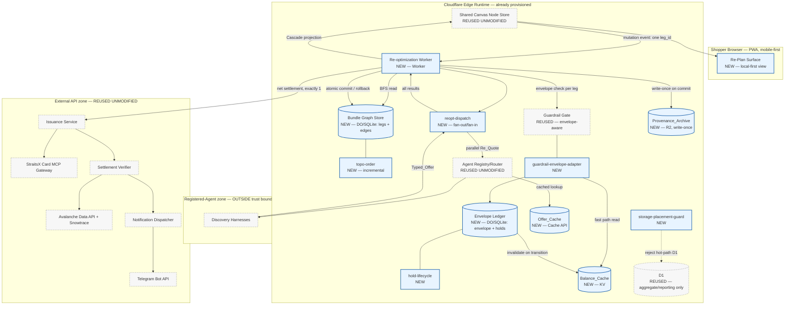
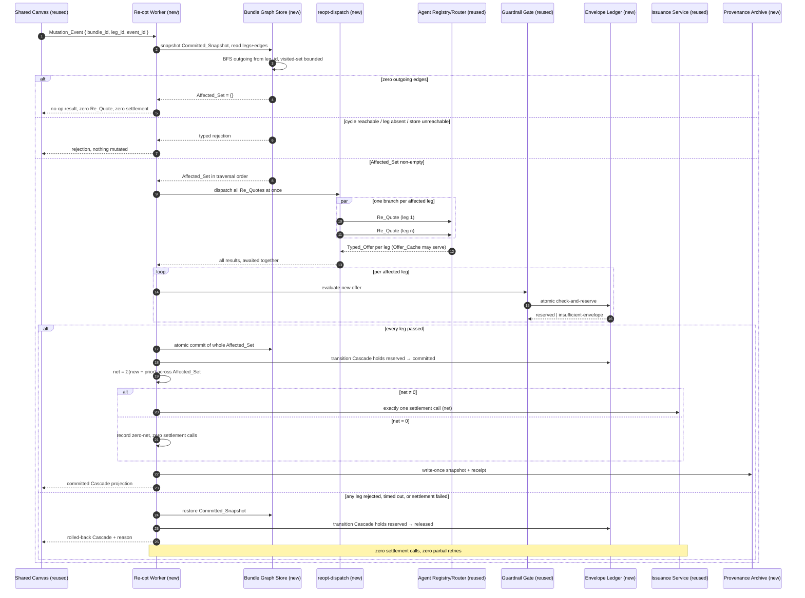

# Design Document

## Overview

This design realizes the consolidation increment: make a trip's leg-dependency structure a first-class object the platform reasons over, make the principal's spend guardrail a real concurrent ledger rather than a single number checked once, and layer three purpose-fit caches around both. Everything else — Shared Canvas Node Store, Agent Registry/Router, Discovery Harnesses, Issuance Service, Settlement Verifier, Notification Dispatcher, Marketplace Registry Canvas — is consumed at its existing interface and not modified. Guardrail Gate gains one data dependency and no interface change.

Three new components, exactly as the PRD Topology names them, plus the three cache layers and the inference consolidation:

| Unit | Responsibility (single) | Runtime | Authored-line ceiling |
|---|---|---|---|
| `bundle-graph-store.ts` | Persist `legs`/`edges` for one `bundle_id`; expose downstream BFS, atomic commit, rollback | Durable Object + SQLite | ≤ 600 |
| `envelope-ledger.ts` | Persist `envelope`/`holds` for one `principal_id`; expose atomic check-and-reserve | Durable Object + SQLite | ≤ 600 |
| `reopt-worker.ts` | Orchestrate one Cascade: BFS → fan-out → gate → commit → one settlement → archive | Worker | ≤ 600 |

Supporting units, separated so no unit carries two responsibilities and no unit approaches the ceiling:

| Unit | Responsibility (single) |
|---|---|
| `bundle-types.ts` | Type declarations only, zero runtime value |
| `topo-order.ts` | Incremental topological order maintenance and cycle rejection |
| `reopt-dispatch.ts` | Concurrent Re_Quote fan-out / fan-in against Agent Registry/Router |
| `hold-lifecycle.ts` | Hold state machine: legal transitions and conservation invariant |
| `balance-cache.ts` | KV read-through cache for Available_Balance, non-authoritative by construction |
| `offer-cache.ts` | Cache API wrapper: TTL 30–60s, stale-while-revalidate, full-request keying |
| `provenance-archive.ts` | R2 write-once snapshot and receipt writer |
| `guardrail-envelope-adapter.ts` | Supply Available_Balance to the reused Guardrail Gate without touching its interface |
| `storage-placement-guard.ts` | Reject a D1 call from a hot path; reject a new storage system |
| `inference-router.ts` | Workers AI primary / Containers overflow selection |
| `model-license-filter.ts` | Permitted_Model_Set derivation from externalized license config |
| `cost-log.ts` | Per-Cascade cost entry emission |
| `deploy-boundary.ts` | Evidence-derived Deploy_Boundary state, fail-closed |
| `replan-surface.ts` | Mobile-first, local-first Cascade projection and render |

### Design Goals, Framed By Operating Priorities

- **Minimum-viable-maximum-value** — two Durable Objects and one Worker turn "detect and suggest one alternative" into "re-plan the causally affected set and settle it once". Every other component is reused unchanged.
- **Time-to-value** — zero new vendor, zero new credential, zero new storage category. First runnable slice is a 2-leg bundle: one flight, one downstream experience, one upstream change, one net settlement.
- **ROI / TCO** — marginal infrastructure cost is $0 at MVP scale: Durable Objects, KV, Cache API, and R2 are all Cloudflare-native and within already-budgeted free tiers. The only new recurring cost is authored code to maintain, bounded by the 17-file decomposition above.
- **Token economics** — BFS, commit, rollback, netting, and ledger arithmetic are deterministic. Both new pipelines carry a $0.00/call token budget (Requirement 10). Only the reused Discovery Harnesses spend tokens, and Offer_Cache cuts how often they do.
- **FOSS-first** — no new library for graph walking, netting, or ledger arithmetic. ADR-3's model licensing is enforced as an executable filter (`model-license-filter.ts`), not an assumption.
- **Zero-infra** — Cloudflare-primary throughout; ADR-3 removes the last VM/SSH surface from the critical path.
- **Browser-based, mobile-first** — the re-plan surface renders at 320 CSS px with 44×44 px targets (Requirement 14).
- **Local-first, offline-first** — the re-plan surface reads its local replica first and treats the edge as a convergence peer; hibernatable WebSockets let idle Durable Objects release memory without losing state.

### What Makes This L4 Rather Than L3

Three claims, each with one mechanism and one property behind it:

| Claim | Mechanism | Property |
|---|---|---|
| Re-plans **only** the causally downstream legs | BFS over outgoing edges from the changed leg, visited-set bounded | CP-1 |
| Re-plans the whole affected set or **none of it** | one Durable Object storage transaction spanning the affected set | CP-3, CP-4 |
| Settles the whole cascade in **one** call | net signed delta computed before a single Issuance_Service call | CP-5 |

Drop the third and this is L3 dressed up. The PRD says so directly, and the design keeps the settlement-call count a counted, surfaced number rather than a described intention.

## Architecture



Boundary reading: the only edges Knowgrph adds are `SCN → ROW`, `ROW ↔ BGS`, `ROW → RD → AR`, `GG → EL`, `ROW → ISS`, `ROW → R2`, and `ROW → SCN → RS`. `ISS → SV → ND` is carried over untouched. The Registered-Agent zone still touches nothing but the Router, in both directions — a Re_Quote is an ordinary Discovery dispatch, not a new privileged path.

### Two Reads, Two Different Jobs

The `edges` table is the *structure*; the `legs` table is the *authorization*. BFS derives the Affected_Set from edges, but a Leg is only re-quoted if it is still present in `legs` at the moment of the dispatch decision. This mirrors the commerce increment's "membership is re-read at dispatch time, not trusted from a warm index" rule and removes the class of bug where a removed Leg keeps drawing payment-adjacent traffic from a stale adjacency snapshot held in the isolate heap.

The in-memory adjacency list (Requirement 8.5) is a *performance* cache of edge structure only. It never caches leg membership, offer identity, or committed amounts.

### Sequence — Commit, Rollback, And No-Op



Two deliberate refusals in that diagram. There is no per-leg retry branch — a single rejection aborts the set, because partial retry is exactly how a mixed state gets created. And there is no recursive trigger from the commit back into `SCN → ROW`; one Mutation_Event is one pass (Requirement 6.1), so a cascade cannot chase its own tail.

## Components and Interfaces

All types live in `bundle-types.ts`, which emits zero runtime value. Illegal states are made unrepresentable where the type system can carry the weight, so a mistake is a compile error rather than a review comment.

```ts
// ---- Branded identities: a bundle_id can never be passed where a leg_id is expected ----
type BundleId = string & { readonly __brand: 'BundleId' };
type LegId = string & { readonly __brand: 'LegId' };
type OfferId = string & { readonly __brand: 'OfferId' };
type PrincipalId = string & { readonly __brand: 'PrincipalId' };
type HoldId = string & { readonly __brand: 'HoldId' };
type CascadeId = string & { readonly __brand: 'CascadeId' };
type EventId = string & { readonly __brand: 'EventId' };
type SnapshotId = string & { readonly __brand: 'SnapshotId' };
type ModelId = string & { readonly __brand: 'ModelId' };
type MinorUnits = number & { readonly __brand: 'MinorUnits' }; // integer minor units, never float

// ---- Flat adjacency: two tables, no graph engine (ADR-4) ----
interface LegRow {
  readonly bundleId: BundleId;
  readonly legId: LegId;
  readonly principalId: PrincipalId;
  readonly committedOfferId: OfferId | null;
  readonly committedAmount: MinorUnits | null;
  readonly category: string;
}
interface EdgeRow {
  readonly bundleId: BundleId;
  readonly fromLegId: LegId;   // upstream: changing this may invalidate `toLegId`
  readonly toLegId: LegId;     // downstream
}

// ---- Cascade outcome: a discriminated union, so "committed with a rollback reason" is unrepresentable ----
type CascadeOutcome =
  | { readonly kind: 'no-op'; readonly cascadeId: CascadeId; readonly reason: 'no-outgoing-edges' }
  | { readonly kind: 'committed'; readonly cascadeId: CascadeId; readonly affected: readonly LegId[];
      readonly netAmount: MinorUnits; readonly settlementCalls: 0 | 1; readonly snapshotId: SnapshotId }
  | { readonly kind: 'rolled-back'; readonly cascadeId: CascadeId; readonly affected: readonly LegId[];
      readonly reason: RollbackReason; readonly restoredSnapshotId: SnapshotId }
  | { readonly kind: 'rejected'; readonly cascadeId: CascadeId; readonly reason: RejectReason };

type RejectReason =
  | 'unknown-leg' | 'cyclic-dependency' | 'store-unavailable' | 'cross-principal-bundle'
  | 'scale-boundary-legs' | 'scale-boundary-edges';
type RollbackReason =
  | 'requote-rejected' | 'requote-missing' | 'requote-malformed' | 'insufficient-envelope'
  | 'cascade-timeout' | 'settlement-failed' | 'stale-offer-cache-entry';

// ---- Hold lifecycle: terminal states carry no transition target ----
type HoldState = 'reserved' | 'committed' | 'released';
interface Hold {
  readonly holdId: HoldId;
  readonly principalId: PrincipalId;
  readonly offerId: OfferId;
  readonly cascadeId: CascadeId | null;
  readonly amount: MinorUnits;
  readonly state: HoldState;
}
type ReserveResult =
  | { readonly kind: 'reserved'; readonly hold: Hold; readonly availableAfter: MinorUnits }
  | { readonly kind: 'rejected'; readonly reason: 'insufficient-envelope' | 'envelope-unavailable'
      | 'illegal-transition'; readonly availableAtCheck: MinorUnits | null };
```

### Bundle Graph Store — `bundle-graph-store.ts`

One Durable Object per `bundle_id` (Requirement 7.6). Owns two SQLite tables and nothing else.

```ts
interface BundleGraphStore {
  // Structure mutation — each rejects rather than truncating (Requirements 7.3–7.5)
  insertLeg(row: LegRow): { kind: 'ok' } | { kind: 'rejected'; reason: RejectReason; observedCount: number };
  insertEdge(row: EdgeRow): { kind: 'ok' } | { kind: 'rejected'; reason: RejectReason; observedCount: number };

  // Structure read — the Affected_Set walk (Requirement 1)
  affectedSet(changed: LegId): { kind: 'ok'; order: readonly LegId[] } | { kind: 'rejected'; reason: RejectReason };

  // Authorization read, deliberately separate from the structure read
  isPresent(leg: LegId): boolean;

  // Atomic commit / rollback (Requirement 2)
  snapshot(): SnapshotId;
  commitAffectedSet(cascadeId: CascadeId, commits: readonly { legId: LegId; offerId: OfferId; amount: MinorUnits }[]):
    { kind: 'committed'; snapshotId: SnapshotId } | { kind: 'rejected'; reason: RollbackReason };
  restore(snapshotId: SnapshotId): { kind: 'restored'; snapshotId: SnapshotId };

  // Declared limits as readable constants, so a check asserts against the declaration (Requirement 7.8)
  readonly limits: { readonly maxLegs: 20; readonly maxEdges: 20 };
}
```

`affectedSet` is a queue-based BFS over the in-memory adjacency list with a visited set. It never revisits a Leg (Requirement 1.4), which is what bounds it at O(affected) rather than O(V+E) and what makes the 50 ms budget for ≤8 legs unremarkable rather than optimistic.

Cycle handling is deliberately split. `insertEdge` rejects a cycle at write time (Requirement 7.5) — that is the real defense. `affectedSet` also rejects a reachable cycle at read time (Requirement 1.8) — that is the belt to the write-time braces, because a cycle that somehow exists must fail the walk rather than loop it.

### Incremental Topological Order — `topo-order.ts`

Maintained on Edge insertion rather than recomputed per Mutation_Event (Requirement 7.9, Computation recommendation "Topological order"). Tie-break is deterministic and stated: ascending `legId` among Legs of equal depth. Without a stated tie-break, "identical to a full recompute" (Requirement 7.10) would not be a testable claim.

### Envelope Ledger — `envelope-ledger.ts`

One Durable Object per `principal_id` (Requirement 4.4). The atomicity comes from the actor model, not from a lock (Requirement 8.4).

```ts
interface EnvelopeLedger {
  // One indivisible operation: compute, compare, reserve (Requirement 4.2)
  checkAndReserve(offerId: OfferId, amount: MinorUnits, cascadeId: CascadeId | null): ReserveResult;

  // Lifecycle (Requirement 5.1–5.2), idempotent at terminal states
  commitHold(holdId: HoldId): { kind: 'committed' | 'noop' } | { kind: 'rejected'; reason: 'illegal-transition' };
  releaseHold(holdId: HoldId): { kind: 'released' | 'noop' } | { kind: 'rejected'; reason: 'illegal-transition' };
  releaseCascade(cascadeId: CascadeId): { kind: 'released'; count: number };

  // Server-side only — no client-facing scope exists (Requirement 5.10, stated gap)
  availableBalance(): MinorUnits;
}
```

The conservation invariant `total_budget = available + Σreserved + Σcommitted` (Requirement 5.4) is asserted after every transition, in the same operation, not by a background reconciler. A reconciler would turn a correctness invariant into an eventually-detected discrepancy.

Amounts are integer minor units throughout. Floating-point money in a ledger whose whole purpose is "two agents can never jointly overspend" would be an odd place to accept representation error.

### Guardrail Envelope Adapter — `guardrail-envelope-adapter.ts`

The reused Guardrail Gate keeps its interface exactly (Requirement 4.9, 12.2). The adapter supplies Available_Balance to it: Balance_Cache first, Envelope_Ledger on miss, Envelope_Ledger wins on divergence (Requirement 5.5–5.6). The adapter exists so the envelope dependency lives in one file that can be deleted without touching the gate — the smallest possible blast radius for the one reused component this increment extends.

### Re-optimization Worker — `reopt-worker.ts`

Orchestration only. It holds no storage client of its own, no model client (Requirement 10.1), and no payment client (Requirement 3.8).

```ts
interface ReoptWorker {
  handleMutation(event: { bundleId: BundleId; legId: LegId; eventId: EventId }): Promise<CascadeOutcome>;
}
```

Idempotence (Requirement 2.6) is keyed on `(bundleId, legId, eventId)`. A repeat returns the recorded outcome for that key rather than re-running the Cascade, so a duplicated Shared Canvas notification cannot double-settle.

### Concurrent Dispatch — `reopt-dispatch.ts`

Fan-out/fan-in with a wall-clock cap (Requirement 6.2, 6.4). All Re_Quotes are issued before any is awaited, and all are awaited together, so wall-clock time is the slowest single leg. Every settled result is inspected; a rejection anywhere aborts the set (Requirement 6.3) after all branches settle, so no in-flight Re_Quote is orphaned mid-cascade.

### Cache Layers

| Unit | Store | Key | Bound | Authority |
|---|---|---|---|---|
| `balance-cache.ts` | KV | `envelope_balance:{principalId}` | invalidated on every Hold transition, before the transition returns | **never authoritative** — DO wins on divergence |
| `offer-cache.ts` | Cache API | full Re_Quote request identity, hashed | TTL 30–60 s, stale-while-revalidate | advisory; a commit against an expired entry with no completed revalidation is refused |
| `provenance-archive.ts` | R2 | `provenance/{bundleId}/{cascadeId}` | write-once; overwrite rejected | archival only, off the hot path |

Two invariants make these safe rather than merely fast. Balance_Cache is *structurally* non-authoritative: `balance-cache.ts` exposes a read that returns `{ value, mustConfirm: true }`, so a caller cannot use it for a commit decision without also calling the ledger — the confirmation is in the type, not in a code review. Offer_Cache entries carry their fetch timestamp and TTL, and `reopt-worker.ts` refuses a commit against an entry past TTL whose revalidation has not completed (Requirement 9.4), which is the one place a stale cache could otherwise buy something with the wrong price.

### Storage Placement Guard — `storage-placement-guard.ts`

Wraps the D1 client. A call arriving with a hot-path caller tag is rejected with the calling component named (Requirement 8.3). This is the executable form of ADR-1's "explicit split rule" — the ADR's own mitigation for its stated negative consequence of running two storage systems.

### Inference Consolidation — `inference-router.ts`, `model-license-filter.ts`

`model-license-filter.ts` reads license declarations from externalized configuration (Requirement 11.5) and derives the Permitted_Model_Set. It fails closed: unreadable config permits zero model (Requirement 11.7), because a license filter that degrades to "allow everything" on error is not a filter.

`inference-router.ts` selects Workers AI for a model in the Permitted_Model_Set, Containers-with-Ollama for a model outside the hosted catalog, and rejects a model whose declared license is neither Apache-2.0 nor MIT. Every call records path, model, declared license, and cost (Requirement 11.6), and neither path is recorded as free (Requirement 11.8).

### Re-Plan Surface — `replan-surface.ts`

Projects Cascade outcomes through the reused Shared Canvas Node Store. Local replica first, edge as convergence peer (Requirement 14.4). Semantic list and description elements, 320 CSS px without horizontal scroll, 44×44 px targets, accessible name per Leg row (Requirement 14.1–14.3, 14.8). A rolled-back Cascade renders as rolled back with its reason — the `CascadeOutcome` union makes rendering it as committed unrepresentable rather than merely discouraged (Requirement 14.7).

## Data Models

### Durable Object SQLite — Bundle Graph Store

```sql
CREATE TABLE legs (
  leg_id              TEXT PRIMARY KEY,
  principal_id        TEXT NOT NULL,
  committed_offer_id  TEXT,
  committed_amount    INTEGER,          -- minor units, never REAL
  category            TEXT NOT NULL
);
CREATE TABLE edges (
  from_leg_id TEXT NOT NULL REFERENCES legs(leg_id),
  to_leg_id   TEXT NOT NULL REFERENCES legs(leg_id),
  PRIMARY KEY (from_leg_id, to_leg_id)
);
CREATE INDEX edges_from ON edges(from_leg_id);   -- the only index BFS needs
CREATE TABLE snapshots (
  snapshot_id TEXT PRIMARY KEY,
  taken_at    TEXT NOT NULL,
  payload     BLOB NOT NULL              -- serialized legs+edges, the sole rollback target
);
```

`bundle_id` is the Durable Object's own identity, so it is deliberately absent from every row. Storing it would invite a cross-bundle query this design does not want to be possible.

### Durable Object SQLite — Envelope Ledger

```sql
CREATE TABLE envelope (
  principal_id TEXT PRIMARY KEY,
  total_budget INTEGER NOT NULL          -- minor units
);
CREATE TABLE holds (
  hold_id     TEXT PRIMARY KEY,
  offer_id    TEXT NOT NULL,
  cascade_id  TEXT,                      -- null for a non-cascade offer
  amount      INTEGER NOT NULL,
  state       TEXT NOT NULL CHECK (state IN ('reserved','committed','released'))
);
CREATE INDEX holds_active ON holds(state) WHERE state IN ('reserved','committed');
CREATE INDEX holds_cascade ON holds(cascade_id);
```

Available_Balance is computed, never stored. A stored balance is a second source of truth for the one number this component exists to be authoritative about.

### D1 — Aggregate Only

D1 holds cross-key rollups for the operator dashboard and platform audit: cascade counts, settlement-call ratios, rollback rates, envelope utilization distributions. No Cascade or check-and-reserve path reads or writes it (Requirement 8.1–8.3).

## Correctness Properties

Sixteen properties, each with its class named so coverage gaps are visible by class rather than by count. Every one runs with shrinking enabled and its seed recorded.

| # | Property | Class | Validates |
|---|---|---|---|
| CP-1 | Affected_Set equals exactly the downstream-reachable set, excluding the changed leg | Invariant | Req 1.1–1.3 |
| CP-2 | BFS visits each leg at most once and terminates on every acyclic graph within the scale boundary | Invariant | Req 1.4, 1.6 |
| CP-3 | No observable state has some affected legs on new offers and others on stale offers | Invariant | Req 2.1–2.3 |
| CP-4 | Rollback restores state byte-identical to the preceding Committed_Snapshot | Round Trip | Req 2.4 |
| CP-5 | Settlement-call count is 1 for any non-zero net and any affected-set size; 0 for zero net or rollback | Metamorphic | Req 3.1, 3.3, 3.4 |
| CP-6 | No accepted offer exceeds Available_Balance at accept-time under arbitrary concurrent interleaving | Invariant | Req 4.1, 4.3, 4.5, 4.6 |
| CP-7 | `total_budget = available + Σreserved + Σcommitted` after every transition | Invariant | Req 5.4 |
| CP-8 | Repeated commit or release of the same hold is a no-op returning the current state | Idempotence | Req 5.2 |
| CP-9 | A repeated Mutation_Event with the same event key produces at most one commit and one settlement call | Idempotence | Req 2.6 |
| CP-10 | Bundle serialize → deserialize yields an identical leg and edge set | Round Trip | Req 2.4, 8.6 |
| CP-11 | A divergent Balance_Cache value never changes a commit decision; the ledger value wins and the entry is invalidated | Metamorphic | Req 5.6, 9.2 |
| CP-12 | No commit occurs against an Offer_Cache entry past TTL whose revalidation has not completed | Invariant | Req 9.3, 9.4 |
| CP-13 | Insertions past 20 legs or 20 edges, cycles, and cross-principal legs are rejected with the correct typed reason and mutate nothing | Error Condition | Req 7.3–7.5, 7.7 |
| CP-14 | Every Cascade emits exactly one Cost_Log entry, and orchestration token counts are zero | Invariant | Req 10.1, 10.2, 10.7 |
| CP-15 | Incremental topological order converges to the full-recompute order for any insertion interleaving of the same edge set | Confluence | Req 7.9, 7.10 |
| CP-16 | A Provenance_Archive write for an existing key is rejected; archive state after N identical writes equals state after 1 | Idempotence | Req 2.7, 9.7 |

Class coverage: 6 invariant, 2 round trip, 3 metamorphic, 3 idempotence, 1 error condition, 1 confluence. CP-6 and CP-3 carry the highest run counts because they are the two hard invariants the PRD states as `0` rather than as targets to approach.

## Error Handling

Fail-closed throughout, inherited from the travel document's posture. Every failure resolves to a typed reason, never to a permissive default.

| Failure | Detected by | Resolution | Observable result |
|---|---|---|---|
| Changed leg absent | `affectedSet` | reject, mutate nothing | `rejected: unknown-leg` |
| Cycle reachable from changed leg | `affectedSet` | reject, mutate nothing | `rejected: cyclic-dependency` |
| Bundle Graph Store unreachable | `reopt-worker` preflight | reject before any Re_Quote | `rejected: store-unavailable` |
| One Re_Quote rejected / missing / malformed | `reopt-dispatch` fan-in | abort whole set, restore snapshot, release holds | `rolled-back: requote-*` |
| Cascade wall-clock cap exceeded | `reopt-dispatch` | abort, restore, release | `rolled-back: cascade-timeout` |
| Envelope insufficient for any leg | `envelope-ledger` | abort, restore, release | `rolled-back: insufficient-envelope` |
| Envelope unreachable | `guardrail-envelope-adapter` | gate rejects offer, zero holds, zero downstream | `rejected: envelope-unavailable` |
| Offer_Cache entry past TTL, revalidation incomplete | `reopt-worker` pre-commit check | refuse commit, restore, release | `rolled-back: stale-offer-cache-entry` |
| Issuance_Service settlement call fails | `reopt-worker` | restore snapshot, release holds | `rolled-back: settlement-failed` |
| Provenance_Archive write fails after commit | `provenance-archive` | **retain the commit**, record archive-deferred | committed + `archive-deferred` record |
| Archive key already exists | `provenance-archive` | reject the overwrite | `archive-immutable` |
| Hot-path D1 call | `storage-placement-guard` | reject, name the caller | `storage-placement` violation |
| Model license neither Apache-2.0 nor MIT | `model-license-filter` | reject primary route | `license-excluded` + model + license |
| License config unreadable | `model-license-filter` | permit zero model | `license-configuration-unavailable` |
| Prod mirror or Cloudflare mutation attempted | `deploy-boundary` | reject before the request | boundary violation + component + target |

One asymmetry is deliberate: an archive failure after a successful commit does **not** roll back (Requirement 2.8). The commit is the principal's real booking state; the archive is provenance. Rolling back a correct booking because a write-behind archival call failed would trade a real outcome for a bookkeeping convenience.

## Testing Strategy

Property tests use `fast-check` (MIT) as the only new dependency, dev-only, pinned exact. Every payment-path test runs against mocked StraitsX and Avalanche clients; zero test issues a real payment call.

### Generators

| Generator | Produces | Used by |
|---|---|---|
| `arbBundle` | acyclic `legs`/`edges` within the scale boundary, single principal, 1–20 legs | CP-1, CP-2, CP-3, CP-4, CP-10, CP-15 |
| `arbBundleWithCycle` | edge sets containing at least one cycle | CP-13 |
| `arbOversizeBundle` | insertion sequences crossing 20 legs or 20 edges | CP-13 |
| `arbMutationSequence` | mutation events including repeats with identical event keys | CP-9 |
| `arbRequoteResults` | per-leg pass / reject / missing / malformed / timeout outcomes | CP-3, CP-5, CP-12 |
| `arbConcurrentOffers` | 2–16 offers for one principal with interleaved arrival orders | CP-6, CP-7, CP-8 |
| `arbHoldTransitions` | legal and illegal transition sequences, including repeats at terminal states | CP-7, CP-8 |
| `arbCacheDivergence` | Balance_Cache / ledger value pairs, agreeing and diverging | CP-11 |
| `arbOfferCacheAges` | entry ages spanning under-TTL, at-TTL, past-TTL, with and without completed revalidation | CP-12 |
| `arbEdgeInsertionOrders` | permutations of one edge set's insertion order | CP-15 |
| `arbArchiveWrites` | repeated writes to identical and distinct keys | CP-16 |

### Run Counts

| Property | numRuns | Why |
|---|---|---|
| CP-6 | 600 | hard invariant: over-envelope commits must be 0; concurrency is where it breaks |
| CP-3 | 500 | hard invariant: partial-commit incidents must be 0 |
| CP-5 | 400 | the literal L4 claim |
| CP-13 | 400 | error-condition totality across four distinct rejection causes |
| CP-1, CP-7, CP-15 | 300 each | precision, conservation, confluence |
| CP-2, CP-4, CP-9, CP-11, CP-12 | 200 each | |
| CP-8, CP-10, CP-14, CP-16 | 200 each | |

Shrinking matters most for CP-3, CP-6, and CP-15, where the useful failure report is the minimal interleaving or insertion order that breaks the invariant, not the first random one found.

### Integration And Example Checks

| Criterion | Check | Kind |
|---|---|---|
| Req 1.6 — walk under 50 ms for ≤8 legs, in-DO | `check:affected-set` | measurement, recorded |
| Req 1.9 — one Session_Log entry per Cascade including no-ops | `check:affected-set` | integration |
| Req 2.7, 2.8 — archive exactly once; commit retained on archive failure | `check:atomic-commit` | integration, fault-injected |
| Req 3.2 — net amount equals signed sum across the affected set | `check:net-settlement` | example, tabulated |
| Req 3.6 — affected-set size and settlement-call count both recorded | `check:net-settlement` | integration |
| Req 3.8 — every payment request carries the Issuance_Service identifier | `check:net-settlement` | static scan + boundary assertion |
| Req 4.7 — check-and-reserve under 10 ms, no D1 hop | `check:envelope-atomicity` | measurement, recorded |
| Req 5.3 — no observable staleness window beyond DO write-then-read | `check:hold-lifecycle` | integration |
| Req 5.7 — cache invalidated before the transition returns | `check:hold-lifecycle` | integration, ordering assertion |
| Req 6.2 — cascade wall-clock equals slowest leg, not the sum | `check:cascade-bounds` | measurement, recorded |
| Req 6.7 — re-quote count, reject count, abort reason, elapsed recorded | `check:cascade-bounds` | integration |
| Req 7.1, 7.2 — zero graph engine reachable; zero graph traversal call | `check:scale-boundary` | static scan |
| Req 7.8 — declared limits readable as named constants | `check:scale-boundary` | static scan |
| Req 8.1–8.3 — zero hot-path D1 query; guard rejects with caller named | `check:storage-placement` | static scan + integration |
| Req 8.5–8.7 — adjacency built once per wake; state survives hibernation; hibernatable WebSockets in use | `check:storage-placement` | integration |
| Req 8.8 — zero new storage system beyond the declared set | `check:storage-placement` | static scan |
| Req 9.3, 9.5 — TTL within 30–60 s; full-request keying | `check:edge-cache` | integration |
| Req 9.6 — dispatch counts with and without cache recorded | `check:edge-cache` | measurement, recorded |
| Req 9.8 — zero archived-only snapshot retained in DO or D1 | `check:edge-cache` | integration |
| Req 9.10 — registry lookups invalidated only on (de)registration | `check:edge-cache` | integration |
| Req 10.6 — no model client reachable from the three new modules | `check:cost-observability` | static scan |
| Req 11.1, 11.9 — zero Oracle endpoint, credential key name, or SSH config | `check:inference-license` | static scan |
| Req 11.6 — path, model, license, cost recorded per call | `check:inference-license` | integration |
| Req 11.8 — neither path recorded as free | `check:inference-license` | integration |
| Req 12.1–12.4 — reused interface snapshot unchanged | `check:reused-interfaces` | snapshot comparison |
| Req 12.5, 12.6 — component inventory rungs recorded and inherited, not re-claimed | `check:reused-interfaces` | document assertion |
| Req 13.1–13.4 — three boundaries `closed`; mirror and route untouched | `check:deploy-boundary` | process assertion |
| Req 13.7 — zero developer path, credential, or account identifier in source | `check:deploy-boundary` | static scan |
| Req 14.1–14.3 — 320 px no horizontal scroll; semantic list; 44×44 px targets | `check:replan-surface` | browser assertion |
| Req 14.5, 14.6 — offline retention with elapsed indicator; convergence on reconnect | `check:replan-surface` | browser assertion |
| Req 14.7 — rolled-back Cascade never renders as committed | `check:replan-surface` | browser assertion |
| Req 14.8 — media and icon wrappers keep an accessible name | `check:replan-surface` | accessibility assertion |

### Named Invocable Check Per Requirement

| Requirement | Named check |
|---|---|
| 1 — Downstream-Only Affected-Set Precision | `npm run check:affected-set` |
| 2 — Atomic All-Or-Nothing Commit | `npm run check:atomic-commit` |
| 3 — One Net Settlement Call Per Cascade | `npm run check:net-settlement` |
| 4 — Atomic Check-And-Reserve | `npm run check:envelope-atomicity` |
| 5 — Hold Lifecycle And Release Visibility | `npm run check:hold-lifecycle` |
| 6 — Bounded Cascade Orchestration | `npm run check:cascade-bounds` |
| 7 — Flat Adjacency And Scale Boundary | `npm run check:scale-boundary` |
| 8 — Hot-Path Storage Placement | `npm run check:storage-placement` |
| 9 — Three-Layer Edge Cache Correctness | `npm run check:edge-cache` |
| 10 — Model-Free Determinism And Cost | `npm run check:cost-observability` |
| 11 — Inference Consolidation And License Filter | `npm run check:inference-license` |
| 12 — Reused-Interface Preservation | `npm run check:reused-interfaces` |
| 13 — Dev-Only Deploy Boundary | `npm run check:deploy-boundary` |
| 14 — Mobile-First Local-First Re-Plan Surface | `npm run check:replan-surface` |

## Token Economics And Cost

| Path | Prompt | Completion | Cost per call |
|---|---|---|---|
| Affected_Set BFS | 0 | 0 | $0.00 |
| Atomic commit / rollback | 0 | 0 | $0.00 |
| Net-amount computation | 0 | 0 | $0.00 |
| Envelope check-and-reserve | 0 | 0 | $0.00 |
| Hold lifecycle transitions | 0 | 0 | $0.00 |
| Topological order maintenance | 0 | 0 | $0.00 |
| Re_Quote via Discovery Harness | unchanged from travel doc | unchanged | unchanged, and reduced in frequency by Offer_Cache |

Marginal infrastructure: Durable Objects and D1 already provisioned; KV, Cache API, and R2 within free tiers at MVP scale; R2 has no egress fee to Workers. Inference is the one honest non-zero: Workers AI is metered beyond its free neuron allocation and Containers overflow is metered compute (Requirement 11.8). The design records that rather than describing the stack as free.

One-line version: **the cascade itself is arithmetic, so the L4 claim costs storage reads, not tokens.**

## Deploy Boundary

| Boundary | From | To | Evidence Reference | Rollback | State |
|---|---|---|---|---|---|
| Bundle commit: affected-set → committed | Authoring | Mirror | none yet — Re-optimization Worker not built | restore the last Committed_Snapshot | `closed` |
| Envelope mutation: offer → hold | Authoring | Mirror | none yet — Envelope Ledger not built | transition the hold to `released` | `closed` |
| Prod mirror → Cloudflare delivery | Mirror | Delivery | none — no authorized candidate | not applicable; nothing published | `closed` |

All three read `closed` and are derived from absent Evidence References rather than authored by hand (Requirement 13.2).

## Design Decisions And Rationale

- **Two tables, not a graph engine.** ADR-4, made executable: `check:scale-boundary` statically asserts zero graph engine is reachable. At single-digit-to-20-leg bundles, BFS over an indexed `edges` table is not a compromise — a graph engine would be a second data-access paradigm bought for nothing.
- **Structure read and authorization read are separate calls.** `affectedSet` answers "what could be affected"; `isPresent` answers "may this leg be dispatched now". Fusing them would let a warm adjacency snapshot authorize a removed leg.
- **Commit spans the affected set, not the bundle.** Legs outside the Affected_Set are untouched by construction, which is what makes Requirement 1.2's "no unaffected sibling is touched" a property rather than a promise.
- **Balance_Cache is non-authoritative in its type signature.** `{ value, mustConfirm: true }` makes the confirmation step structural. A comment saying "don't trust this" would be a convention; a required second call is a mechanism.
- **Integer minor units everywhere.** A ledger whose stated invariant is zero over-envelope commits should not carry float representation error.
- **Archive failure does not roll back a commit.** Provenance is bookkeeping; the commit is the principal's booking. The asymmetry is deliberate and recorded (Requirement 2.8).
- **License filtering fails closed.** ADR-3's FOSS-hard-gate flag becomes `model-license-filter.ts`. Unreadable config permits zero model, because a filter that opens under error is decoration.
- **One pass per event, no recursion.** A Cascade cannot trigger a Cascade. This bounds the whole feature to something testable and keeps a delay storm from becoming an unbounded re-planning loop.

## Open Design Questions

Carried from the PRD, not resolved here. Each is a blocked task in `tasks.md`, not a defaulted value.

1. **Materiality threshold** (Requirement 1.10) — what counts as a change worth triggering a Cascade? Today every Mutation_Event triggers one, and the design records that no threshold is configured. Our reading is that the threshold belongs in the trigger, not in the walk, so adding it later touches `reopt-worker.ts` only. Pending one operator decision.
2. **Rollback notification path** (Requirement 6.9) — synchronous to the principal, or queued through the reused Notification Dispatcher? The design records the rollback in the Session_Log and emits nothing, so either answer is additive. Pending one operator decision.
3. **Client-facing `available_balance`** (Requirement 5.10) — transparency for the Shopper Client, or server-side only? The design exposes it server-side only and introduces no client auth scope, so choosing transparency later adds a scope rather than reworking one. Pending one operator decision.

One design question of our own, stated rather than silently answered: the deterministic tie-break for topological order is ascending `legId`. Any total order works; it is stated so that CP-15's "identical to full recompute" is a claim a check can evaluate rather than an aspiration.
