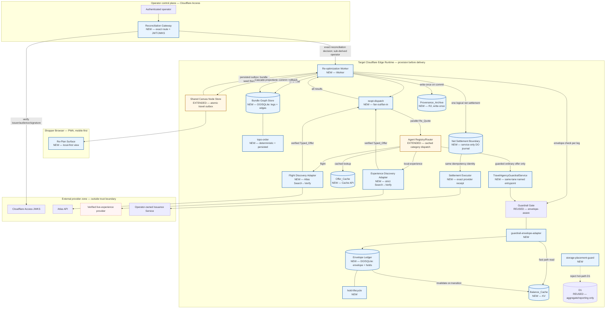

# Design Document

## Overview

This design realizes the consolidation increment: make a trip's leg-dependency structure a first-class object the platform reasons over, make the principal's spend guardrail a real concurrent ledger rather than a single number checked once, and layer three purpose-fit caches around both. The inherited public contracts remain stable, but their owning Workers are extended internally where production-safe wiring requires it: Shared Canvas adds an atomic travel outbox and cold seed, Agent Registry/Router adds cached travel routing, payment adds an isolated provider-effect journal boundary, and service-only provider adapters implement live Discovery and settlement effects. Guardrail Gate gains one data dependency and no interface change.

**Implementation status (2026-08-20):** `dev-proven` in the authoring lane. Protected travel integration PR #814 is merged; clean-install demo, deadline hardening, and nested-lock supply-chain closure are review-ready in PR #818. The local matrices exercise the Durable Object runtime, Shared Canvas atomic trigger/cold initialization, strict Search→Verify identity, provider-backed settlement, reconciliation custody, bounded readiness chains, executable browser/presenter demo, storage authorization, bounded keyset paging/streaming, signed media ownership, publication ACLs, both committed dependency graphs, and Worker packaging. The source is not yet a verified deployment: protected provider configuration, bootstrap receipt v2, provider UAT, deployed-state, live effect/latency/capacity telemetry, and rollback receipts remain absent; `delivered_rung` remains `undocumented`.

Three new components, exactly as the PRD Topology names them, plus the three cache layers and the inference consolidation:

| Unit | Responsibility (single) | Runtime | Authored-line ceiling |
|---|---|---|---|
| `bundle-graph-store.ts` | Coordinate one bundle DO; expose mutation planning, staged commit/finalization, rollback, alarms, and hibernatable WebSockets | Durable Object + SQLite | ≤ 600 |
| `envelope-ledger.ts` | Persist `envelope`/`holds` for one `principal_id`; expose atomic check-and-reserve | Durable Object + SQLite | ≤ 600 |
| `reopt-worker.ts` | Orchestrate one Cascade: plan → fan-out → reserve → prepare → recover/finalize | Worker | ≤ 600 |

Supporting units, separated so no unit carries two responsibilities and no unit approaches the ceiling:

| Unit | Responsibility (single) |
|---|---|
| `bundle-types.ts` | Type-only closed contracts and branded identities; runtime constants/decoders live in `bundle-runtime.ts` |
| `bundle-graph-schema.ts` | Bundle DO SQLite schema and bounded migration helpers |
| `bundle-graph-records.ts` | SQLite row types and immutable domain-record mapping |
| `bundle-graph-storage.ts` | Bundle/cascade/topology persistence operations and alarm scheduling |
| `bundle-graph-validation.ts` | Seed, leg, scale, and committed-position validation |
| `bundle-graph-observability.ts` | Session/cost log persistence and hibernatable WebSocket broadcast |
| `topo-order.ts` | Deterministic topological ordering, cycle rejection, and downstream affected-set calculation |
| `reopt-dispatch.ts` | Concurrent Re_Quote fan-out / fan-in against Agent Registry/Router |
| `cascade-recovery.ts` | Idempotent settlement, finalize, rollback, archive-deferred retry, and recovery disposition |
| `bundle-reconciliation.ts`, `reconciliation-operator.ts` | Durable operator decision audit and graph/ledger convergence after ambiguous settlement |
| `reconciliation-custody.ts` | Non-expiring quarantined Holds and idempotent commit/release custody transitions |
| `envelope-ledger-schema.ts` | Envelope DO SQLite schema, indexes, and bounded additive migrations |
| `envelope-ledger-records.ts` | Ledger row mapping, money validation, and shared deterministic reservation helpers |
| `envelope-ledger-state.ts`, `envelope-ledger-alarms.ts` | O(1) authoritative active-total/revision reads plus repairable expiry scheduling and alarm transitions |
| `ordinary-offer-holds.ts` | Idempotent ordinary-offer reservation and commit/release transitions in the shared principal ledger |
| `hold-lifecycle.ts` | Hold state machine: legal transitions and conservation invariant |
| `balance-cache.ts` | KV read-through cache for Available_Balance, non-authoritative by construction |
| `offer-cache.ts` | Cache API wrapper: TTL 30–60s, stale-while-revalidate, full-request keying |
| `provenance-archive.ts` | R2 write-once snapshot and receipt writer |
| `guardrail-envelope-adapter.ts` | Supply Available_Balance to the reused Guardrail Gate without touching its interface |
| `travel-agency-guardrail-service.ts` | Same-lane named Worker entrypoint joining the inherited Guardrail Gate to ordinary-offer atomic reservation/lifecycle |
| `src/runtime/bounded-json.ts`, `cloudflare/workers/knowgrph-mcp/bounded-json.mjs`, `cloudflare/workers/knowgrph-payment/travelAgency/boundedJson.ts` | Incrementally enforce request/response byte ceilings before full buffering at each exposed travel boundary |
| `cloudflare/workers/knowgrph-mcp/travel-commerce-router.mjs`, `travel-commerce-ingress.mjs`, and Agent Definition cache | Preserve inherited `routeIntent`, authenticate the public registered-offer ingress, expose the separately guarded ordinary-offer route, dispatch category-specific adapters, and own memory/KV definition caching |
| `storage-placement-guard.ts` | Reject a D1 call from a hot path; reject a new storage system |
| `inference-router.ts` | Direct Workers AI primary / authenticated Workers AI Worker overflow selection |
| `model-license-filter.ts` | Permitted_Model_Set derivation from externalized license config |
| `cost-log.ts` | Per-Cascade cost entry emission |
| `deploy-boundary.ts` | Evidence-derived Deploy_Boundary state, fail-closed |
| `readiness.ts` | Bounded configuration, binding, and dependency readiness probes |
| `replan-surface.ts` | Mobile-first, local-first Cascade projection and render |
| `travelMutationOutbox.ts`, `travelMutationReadiness.ts` | Atomic Shared Canvas accepted-event delivery, cold bundle seed, retry, and downstream readiness |
| `storagePublicRouteSecurity.ts`, `storageSync{Security,Cursor,PageRows,ReadRows,ReadRuntime}.ts`, `storageDocument{RouteSecurity,ReadBounds,Stream}.ts`, `storageCrawlerCursor.ts`, `storageMediaCapability.ts`, `storagePublication.ts`, `chatRelayBodyBounds.ts`, and `cloudflare/workers/shared/publishedDoc.ts` | Authenticate inherited routes before body reads; bind active workspace roles; keyset-page sync/export/crawlers; stream documents; sign workspace/object/operation media access and verify R2 ownership; pin anonymous publication to the exact current revision/hash |
| `knowgrph-travel-operator-gateway` | Cloudflare Access JWT verification, subject-derived operator identity, exact reconciliation proxy, and downstream capability readiness |
| `knowgrph-travel-net-settlement-*` | Isolated service-only idempotency journal; exposes no unrelated payment or Strytree route |
| `knowgrph-travel-settlement-executor` | Service-only provider-effect adapter and exact receipt/capability validation |
| `knowgrph-travel-discovery` | Service-only Atlas Search→Verify adapter with strict itinerary identity |
| `knowgrph-travel-experience-discovery` | Service-only live-experience Search→Verify adapter with strict identity, currency, integer-money, body, and deadline validation |
| `knowgrph-travel-ollama-overflow` | Legacy-named, token-authenticated Workers AI Free overflow Worker with remote AI binding, readiness contract, and request/response bounds; it declares no Container binding |
| `scripts/travel-commerce/demo-evidence.mjs`, `scripts/travel-commerce/run-demo.mjs`, `scripts/travel-commerce/verify-demo-browser.mjs`, `canvas/src/features/testing/TravelCommerceDemoPage.tsx` | Bounded deterministic evidence loading, CLI/headless verification, distinct headed presenter lifecycle, and mobile evidence rendering |
| `scripts/travel-mesh-release-{plan,inventory,bindings,probes}.mjs`, `scripts/travel-mesh-release.mjs`, `scripts/install-production-release-dependencies.sh`, and protected release/runtime-gate workflows | Validate the dependency graph and complete protected configuration before any remote call; serialize exact resource/binding inventory and stop systemic access failures; install locked release dependencies, upgrade an authorized nine-Worker baseline, probe it, and restore exact prior versions or preserve ambiguous state |

The release controller is upgrade-only: it refuses an absent Worker or a baseline without exactly one 100%-active version. It validates the complete protected configuration before remote inventory, runs that inventory with maximum concurrency one, and stops after the first systemic Cloudflare authentication/rate-limit failure. A separate human-authorized bootstrap/provisioning process must first create the exact nine Workers, namespaces, storage resources, routes/domains, and serving baselines, then issue `knowgrph-travel-mesh-bootstrap-receipt/v2` through protected `TRAVEL_MESH_BOOTSTRAP_RECEIPT_JSON`. Receipt v2 binds the exact Workers AI Free model/daily-neuron policy plus resource, probe, route, and disabled-subdomain digests; no image or Container entitlement is required. That bootstrap receipt is distinct from the ten delivery receipts. The release-controller row is a delivery-control source owner, not a delivery receipt; its presence, local validation, or dry run cannot close the protected receipt ledger or change `delivered_rung: undocumented`.

### Design Goals, Framed By Operating Priorities

- **Minimum-viable-maximum-value** — two Durable Objects and one Worker turn "detect and suggest one alternative" into "re-plan the causally affected set and settle one logical operation". Inherited public contracts remain stable while their internal delivery adapters are extended where the executable topology requires it.
- **Time-to-value** — zero new vendor and zero new storage category. The deterministic 2-leg slice needs no remote credential; a Production deployment requires separately provisioned Atlas, provider-executor, Shared Canvas, reconciliation-operator, and operator-edge credentials before readiness can pass.
- **ROI / TCO** — the MVP introduces no storage vendor/category; Durable Objects, KV, Cache API, and R2 are Cloudflare-native. A $0 marginal-infrastructure figure is only a pre-deployment free-tier estimate, never a readiness claim. Authored code is split by single responsibility so every owner stays below 600 lines.
- **Token economics** — BFS, commit, rollback, netting, and ledger arithmetic are deterministic. Both new pipelines carry a $0.00/call token budget (Requirement 10). Only the reused Discovery Harnesses spend tokens, and Offer_Cache cuts how often they do.
- **FOSS-first** — no new library for graph walking, netting, or ledger arithmetic. ADR-3's model licensing is enforced as an executable filter (`model-license-filter.ts`), not an assumption.
- **Zero-infra** — Cloudflare-primary throughout; ADR-3 removes the last VM/SSH surface from the critical path.
- **Browser-based, mobile-first** — the re-plan surface renders at 320 CSS px with 44×44 px targets (Requirement 14).
- **Local-first, offline-first** — the re-plan surface reads its local replica first and treats the edge as a convergence peer; hibernatable WebSockets let idle Durable Objects release memory without losing state.

### What Makes This L4 Rather Than L3

Three claims, each with one mechanism and one property behind it:

| Claim | Mechanism | Property |
|---|---|---|
| Re-plans **only** the causally downstream legs | BFS over outgoing edges from the changed leg, visited-set bounded | CP-1 |
| Re-plans the whole affected set or **none of it** | one Durable Object storage transaction spanning the affected set | CP-3, CP-4 |
| Settles the whole cascade as **one logical operation** | net signed delta computed once and sent under one stable idempotency key; the first definitive path uses one transport call and ambiguous retries repeat identical identity/payload | CP-5 |

Drop the third and this is L3 dressed up. The PRD says so directly, and the design surfaces both durable settlement-attempt count and the single logical identity instead of hiding recovery retries behind prose.

## Architecture



Boundary reading: Shared Canvas reaches the service-only Worker only through its durable outbox; providers remain behind category-specific Router bindings; payment success requires an exact executor receipt rather than a journal row; and irreversible reconciliation is reachable only through the Access-authenticated exact-route gateway. The experience adapter is implemented and lane-bound, but its committed sentinel provider configuration deliberately keeps Production readiness at 503 until an operator supplies a verified live origin, catalogue, credential, and Search→Verify receipt. Existing public component operations remain compatible; the added edges use separately named travel contracts.

### Two Reads, Two Different Jobs

The `edges` table is the *structure*; the `legs` table is the *authorization*. BFS derives the Affected_Set from edges, but a Leg is only re-quoted if it is still present in `legs` at the moment of the dispatch decision. This mirrors the commerce increment's "membership is re-read at dispatch time, not trusted from a warm index" rule and removes the class of bug where a removed Leg keeps drawing payment-adjacent traffic from a stale adjacency snapshot held in the isolate heap.

The in-memory adjacency list (Requirement 8.5) is a *performance* cache of edge structure only. It never caches leg membership, offer identity, or committed amounts.

### Sequence — Commit, Rollback, And No-Op

```mermaid
sequenceDiagram
  autonumber
  participant SCN as Shared Canvas + outbox (extended)
  participant ROW as Re-opt Worker (new)
  participant BGS as Bundle Graph Store (new)
  participant RD as reopt-dispatch (new)
  participant AR as Agent Registry/Router (extended)
  participant GG as Guardrail Gate (reused)
  participant EL as Envelope Ledger (new)
  participant PAY as Isolated net-settlement boundary (new)
  participant EXE as Provider-effect executor (new)
  participant R2 as Provenance Archive (new)

  SCN->>SCN: operator map → bundle_id; transactionId → event_id
  SCN->>ROW: Mutation_Event { bundle_id, leg_id, event_id }
  ROW->>BGS: begin Cascade, capture prior legs, read legs+edges
  BGS->>BGS: BFS outgoing from leg_id, visited-set bounded

  alt zero outgoing edges
    BGS-->>ROW: Affected_Set = {}
    ROW-->>SCN: no-op result, zero Re_Quote, zero settlement
  else cycle reachable / leg absent / store unreachable
    BGS-->>ROW: typed rejection
    ROW-->>SCN: rejection, nothing mutated
  else Affected_Set non-empty
    BGS-->>ROW: Affected_Set in traversal order
    ROW->>RD: dispatch all Re_Quotes at once
    par one branch per affected leg
      RD->>AR: Re_Quote (leg 1)
      RD->>AR: Re_Quote (leg n)
    end
    AR-->>RD: Typed_Offer per leg (Offer_Cache may serve)
    RD-->>ROW: all results, awaited together
    loop per affected leg
      ROW->>GG: evaluate new offer
      GG->>EL: atomic check-and-reserve
      EL-->>GG: reserved | insufficient-envelope
    end
    alt every leg passed
      ROW->>BGS: durably prepare the complete Affected_Set
      ROW->>ROW: net = Σ(new − prior) across Affected_Set
      alt net ≠ 0
        ROW->>PAY: one logical net-settlement identity
        PAY->>EXE: exact same key + signed amount/currency
        alt definitive pre-effect rejection
          EXE-->>PAY: proof-bearing no-effect rejection
          PAY-->>ROW: definitive non-retryable rejection
          ROW->>BGS: roll back prepared Cascade
          ROW->>EL: release Cascade holds
          ROW-->>SCN: rolled-back outcome
        else retryable or ambiguous response
          EXE-->>PAY: retryable / outcome unknown
          PAY-->>ROW: bounded ambiguous result
          ROW->>BGS: persist pending recovery
          ROW-->>SCN: pending outcome; prior projection remains visible
        else settled
          EXE-->>PAY: exact provider-backed effect receipt
          PAY-->>ROW: matching settlement/provider ids + idempotency key
          ROW->>EL: commit Cascade holds
          ROW->>BGS: atomically finalize the complete Affected_Set
        end
      else net = 0
        ROW->>ROW: record zero-net, zero settlement calls
        ROW->>EL: commit Cascade holds
        ROW->>BGS: atomically finalize the complete Affected_Set
      end
      ROW->>R2: write-once snapshot + receipt
      ROW-->>SCN: committed Cascade projection
    else any Re_Quote / guardrail decision rejected or timed out
      ROW->>BGS: roll back to captured prior legs
      ROW->>EL: transition Cascade holds reserved → released
      ROW-->>SCN: rolled-back Cascade + reason
      Note over ROW,PAY: zero settlement attempts, zero partial retries
    end
  end
```

Three deliberate refusals in that diagram. There is no per-leg retry branch — a single Re_Quote or guardrail rejection aborts the set, because partial retry is exactly how a mixed state gets created. There is no rollback on an ambiguous settlement attempt: the prior graph projection remains visible, the protected holds remain durable, and recovery retries the same idempotency key and request identity. And there is no recursive trigger from finalization back into `SCN → ROW`; one Mutation_Event is one pass (Requirement 6.1), so a cascade cannot chase its own tail.

## Components and Interfaces

`bundle-types.ts` is the type-only shared contract owner. It exports closed readonly rows, branded identities, Cascade/Hold/Reserve unions, and operational DTOs, while `bundle-runtime.ts` owns runtime bounds, strict identifier/minor-unit decoders, collision-free event-scoped Cascade identity, and stable validation. Every operational `*Minor` field is now a branded `MinorUnits` value, boundary decoders validate raw JSON/SQL/provider values before branding, the module emits zero runtime values, and recursive type assertions reject any future raw-number money field.

### Bundle Graph Store — `bundle-graph-store.ts`

One Durable Object is addressed per `bundle_id` (Requirement 7.6). `bundle-graph-store.ts` coordinates schema, persistence, validation, record mapping, observability, and recovery helpers without absorbing those responsibilities into the main class. Its current public operations are `initBundle`, `insertLeg`, `insertEdge`, `beginCascade`, `prepareCommit`, settlement-claim/finalization operations, `rollbackCascade`, `getSnapshot`, cascade/session/cost reads, alarm recovery, and the authenticated hibernatable WebSocket event route.

`beginCascade` re-reads the current `legs` and `edges`, computes the affected set, captures the exact prior legs, records a Session Log start entry, and returns either a terminal no-op/rejection, a resumable existing record, or a new plan. One bundle admits at most one non-terminal Cascade: a distinct event returns `bundle-busy`, and `insertLeg`/`insertEdge` return `bundle-busy` for the same interval. This structural freeze is the version fence for rollback: the Edge set and unaffected Legs cannot change while the Cascade is active, so restoring the captured affected Legs recreates the complete pre-Cascade `legs`/`edges` projection byte-for-byte. A newly inserted Leg may not arrive already committed (`committed-leg-insertion-unsupported`); commitments enter through initialization or atomic finalization only.

`prepareCommit` accepts only a quote set exactly equal to the recorded affected set. The graph projection remains on the prior snapshot while the durable prepared record moves through settlement and finalization; `commitPreparedCascade` applies the complete set transactionally, while `rollbackCascade` restores the prior projection.

`affectedSet` is a queue-based BFS with a visited set. It never revisits a Leg (Requirement 1.4), which bounds it and makes the 50 ms budget for ≤8 legs unremarkable rather than optimistic.

Cycle handling is deliberately split. `insertEdge` rejects a cycle at write time (Requirement 7.5) — that is the real defense. `affectedSet` also rejects a reachable cycle at read time (Requirement 1.8) — that is the belt to the write-time braces, because a cycle that somehow exists must fail the walk rather than loop it.

### Deterministic Topological Order — `topo-order.ts`

Computed and persisted on bundle initialization and structure insertion, and read without a full sort per Mutation_Event (Requirement 7.9). The ready-set tie-break is ascending `legId`, so the output is deterministic. CP-15 now generates non-empty DAG edge sets and proves forward/reverse insertion orders converge with full recomputation over 300 shrinking runs.

### Envelope Ledger — `envelope-ledger.ts`

One Durable Object per `principal_id` (Requirement 4.4). The atomicity comes from the actor model, not from a lock (Requirement 8.4).

The ledger owns both reservation kinds in the same principal-scoped actor. `init` seeds prior committed positions idempotently; `checkAndReserveCascade` atomically replaces each affected leg's prior commitment with the proposed amount when the envelope permits it; `checkAndReserveOffer` creates one idempotent ordinary-offer Hold, returns an exact replay while it remains reserved or committed, and rejects a replay after release so an old operation identity cannot resurrect value; `commitOffer`/`releaseOffer` close that Hold; `commitCascade`/`releaseCascade` close a Cascade set; `quarantineCascade` removes attempted ambiguous settlement Holds from TTL expiry without returning their balance; `resolveReconciliation` applies an audited idempotent commit/release; `getAvailableBalance` and `getHolds` are server-side-only Durable Object RPCs. Ordinary and Cascade reservations contend against the same `Available_Balance` synchronously before either method yields, so mixed traffic cannot overspend. No Worker HTTP route exposes Available_Balance to a client.

The conservation invariant `total_budget = available + Σreserved + Σquarantined + Σcommitted` (Requirement 5.4) is asserted after every transition, in the same operation, not by a background reconciler. A reconciler would turn a correctness invariant into an eventually-detected discrepancy.

Amounts are non-negative safe-integer minor units throughout, and each quote currency must equal the ledger's uppercase three-letter settlement currency. Production accepts only provider-`verified` prices; `deterministic-demo` is restricted to non-production lanes. The typed fences are `quote-currency-mismatch`, `envelope-currency-conflict`, and `quote-unverified`.

### Guardrail Envelope Adapter — `guardrail-envelope-adapter.ts`

The reused Guardrail Gate keeps its interface exactly (Requirement 4.9, 12.2). The adapter supplies Available_Balance to it: Balance_Cache first, Envelope_Ledger on miss, Envelope_Ledger wins on divergence (Requirement 5.5–5.6), then the ordinary-offer path performs the authoritative atomic reservation in that same ledger before returning success. `TravelAgencyGuardrailService` is a same-lane named Worker entrypoint bound into Agent Registry/Router; the Router's Edge_Orchestrator operation cannot return a quote without this hop, while the inherited internal Reopt_Worker `routeIntent` contract remains separately authorized and Reopt performs its mandatory batch `checkAndReserveCascade`. Commit/release bind the original principal, operation identity, and registered agent. The adapter exists so the envelope dependency lives in one narrow integration seam without altering the inherited Gate signature.

### Re-optimization Worker — `reopt-worker.ts`

Orchestration only. It holds no storage client of its own, no model client (Requirement 10.1), and no payment client (Requirement 3.8).

```ts
interface ReoptWorker {
  handleMutation(event: { bundleId: BundleId; legId: LegId; eventId: EventId }): Promise<CascadeOutcome>;
}
```

Idempotence (Requirement 2.6) is keyed on `(bundleId, legId, eventId)`. A repeat returns the recorded outcome for that key rather than re-running the Cascade, so a duplicated Shared Canvas notification cannot double-settle.

### Shared Canvas Trigger, Discovery, and Settlement Boundaries

The Shared Canvas room persists the accepted node state and its travel outbox record in one Durable Object transaction. Its immutable operator map resolves `(workspaceId, roomId, nodeId)` to an exact `bundle_id` plus initialization seed; the outbox copies the accepted node's single `leg_id`, derives `event_id` only from its inherited `transactionId`, idempotently `PUT`s the cold bundle/envelope before `POST`ing the internal `{leg_id,event_id}` mutation beneath the bundle URL, and retries transient/busy responses. No caller supplies a new `bundle_id` or `event_id` field. Storage readiness requires the map, distinct shared token, service binding, downstream `/readyz`, and authenticated `/v1/runtime` response, with a bound large enough for the travel Worker's documented cold dependency probe rather than a shorter false-negative timeout.

MCP routes a registered flight intent to the service-only Atlas adapter and an `experience` intent (the local-experience leg) only to the separately bound first-party experience adapter. Production and staging register both categories and probe each exact binding concurrently; absence, sentinel configuration, or a malformed capability is a 503, never a deterministic fallback. Atlas readiness performs both Search and Verify against the same selected routing identity, retaining exact segment origin, destination, dates, direction, chain, permitted carrier, and seats. Experience readiness likewise performs authenticated Search→Verify and locks catalogue, location, date, local time, provider, product, party, currency, and safe-integer minor price. Price/currency checks alone cannot produce `verified`. Each discovery phase has one 5.5-second child bound and the 10-second Cascade reserves 2.5 seconds for ledger, settlement, and persistence.

Each lane binds a dedicated service-only `knowgrph-travel-net-settlement-*` Worker with its own SQLite Durable Object and lane-matched executor; unrelated public payment and Strytree routes are absent from that entrypoint. Success requires an exact provider-backed charged/refunded receipt; a journal-only `200`, malformed receipt, timeout, or outage remains unavailable. `/readyz` requires the SQLite store and the executor's bounded authenticated `settleNet` capability probe. Ambiguous attempted effects enter non-expiring custody. A dedicated Cloudflare Access gateway validates signature, issuer, audience, expiry, and subject, derives the audit `operator_id` from that verified subject, and forwards only the exact reconciliation operation through a server-held distinct token; its readiness calls a non-mutating operator-auth capability on travel before it can turn green.

### Concurrent Dispatch — `reopt-dispatch.ts`

Fan-out/fan-in with a wall-clock cap (Requirement 6.2, 6.4). All Re_Quotes are issued before any is awaited, and all are awaited together, so wall-clock time is the slowest single leg. Every settled result is inspected; a rejection anywhere aborts the set (Requirement 6.3) after all branches settle, so no in-flight Re_Quote is orphaned mid-cascade.

### Cache Layers

| Unit | Store | Key | Bound | Authority |
|---|---|---|---|---|
| `balance-cache.ts` | KV | `available-balance:{principalId}` | 60-second entry, invalidated on Hold mutation and refreshed from the ledger | **never authoritative** — the adapter always confirms with the DO |
| `offer-cache.ts` | Cache API | SHA-256 of stable full Re_Quote identity | soft TTL 30 s, hard TTL 60 s; advisory reads may use SWR | commit-path `requote` waits for a fresh result after soft TTL |
| `provenance-archive.ts` | R2 | `provenance/{encodedBundleId}/{encodedCascadeId}.json` | conditional write-once; identical replay is idempotent, digest conflict rejected | archival only, off the hot path |

Two invariants make these safe rather than merely fast. Balance_Cache is operationally non-authoritative: `confirmAvailableBalance` reads the cache but always calls `EnvelopeLedger.getAvailableBalance`; divergence invalidates the entry and the authoritative revision is written back. Offer_Cache entries carry their fetch timestamp and request digest; the commit-path `requote` returns a soft-fresh entry or awaits refresh, while the separate advisory operation is the only path allowed to serve a stale-within-hard-TTL value.

### Storage Placement Guard — `storage-placement-guard.ts`

Wraps the D1 client. A call arriving with a hot-path caller tag is rejected with the calling component named (Requirement 8.3). This is the executable form of ADR-1's "explicit split rule" — the ADR's own mitigation for its stated negative consequence of running two storage systems.

### Inference Consolidation — `inference-router.ts`, `model-license-filter.ts`

`model-license-filter.ts` reads license declarations from externalized configuration (Requirement 11.5) and derives the Permitted_Model_Set. It fails closed: unreadable config permits zero model (Requirement 11.7), because a license filter that degrades to "allow everything" on error is not a filter.

`inference-router.ts` selects the direct Workers AI binding for the primary permitted model and the separately token-authenticated overflow Worker for the overflow declaration of that same permitted provider model. The overflow Worker uses a remote Workers AI binding, declares no Container, and rejects any other provider-model identity. Every call records path, model, declared license, and metering metadata (Requirement 11.6); the 10,000-daily-neuron free policy is an explicit bounded allowance, not an unlimited zero-cost claim (Requirement 11.8).

### Re-Plan Surface — `replan-surface.ts`

Projects Cascade outcomes through the reused Shared Canvas Node Store. Local replica first, edge as convergence peer (Requirement 14.4). Semantic list and description elements, 320 CSS px without horizontal scroll, 44×44 px targets, accessible name per Leg row (Requirement 14.1–14.3, 14.8). A rolled-back Cascade renders as rolled back with its reason — the `CascadeOutcome` union makes rendering it as committed unrepresentable rather than merely discouraged (Requirement 14.7).

## Responsibility Shards

- [`design-data-correctness.md`](./design-data-correctness.md) owns executable data models, correctness properties, and error disposition.
- [`design-verification.md`](./design-verification.md) owns testing strategy, cost/TCO evidence, deploy boundaries, implementation evidence, and operator decisions.

Together these three v1.4.0 files form the complete design baseline. The split changes no requirement, owner, or readiness claim.
