# Task Dependencies and Dispatch

## Notes

- Sub-tasks marked `*` are **optional for a working slice**: property tests, integration and browser checks, measurements, static scans, process assertions. Sub-tasks without `*` are **required**. Top-level tasks carry no marking.
- Tasks 18.1–18.3 record the three explicit v1 Operator decisions. They remain visible in the plan so the chosen conservative behavior is reviewable and cannot be mistaken for an inferred default.
- Order follows the source specification's Next Steps: envelope before graph, hot path before caches, Oracle retirement as an independent workstream with no dependency edge into the cascade path.
- Every recorded property arm runs with shrinking enabled and its seed recorded. Shrinking matters most for CP-3, CP-6, and the full non-empty CP-15 generator, where the useful report is the minimal interleaving or insertion order rather than the first failure found.
- Every payment-path test runs against deterministic local Issuance/Settlement doubles. Zero task issues a real payment call.
- The cascade stays **model-free**: `reopt-worker.ts`, `bundle-graph-store.ts`, and `envelope-ledger.ts` import no model client, enforced by static scan in task 12.4. This increment adds zero orchestration token cost.
- No task adds a storage system, an infrastructure service, or a runtime vendor dependency. `fast-check` is the only new dependency and it is dev-only and pinned.
- All money is integer minor units. No task introduces a floating-point monetary value.

## Task Dependency Graph

```mermaid
flowchart TD
  T11["1.1 fast-check + DO double"]
  T12["1.2 bundle-types.ts"]
  T13["1.3* type assertions"]
  T21["2.1 envelope-ledger.ts"]
  T22["2.2* CP-6 non-overdraft"]
  T23["2.3 hold-lifecycle.ts"]
  T24["2.4* CP-7 conservation"]
  T25["2.5* CP-8 hold idempotence"]
  T26["2.6* envelope latency"]
  T27["2.7* ordinary-offer Guardrail integration"]
  T41["4.1 bundle-graph-store: structure"]
  T42["4.2 topo-order.ts"]
  T43["4.3* CP-13 scale boundary"]
  T44["4.4* CP-15 topo confluence"]
  T45["4.5* no-graph-engine scan"]
  T51["5.1 affectedSet + isPresent"]
  T52["5.2* CP-1 precision"]
  T53["5.3* CP-2 termination"]
  T54["5.4* walk latency"]
  T71["7.1 commit / rollback"]
  T72["7.2* CP-3 atomicity"]
  T73["7.3* CP-4 rollback fidelity"]
  T74["7.4* CP-10 round trip"]
  T81["8.1 guardrail-envelope-adapter.ts"]
  T82["8.2* reused-interface snapshot"]
  T91["9.1 reopt-dispatch.ts"]
  T92["9.2 reopt-worker.ts"]
  T93["9.3 net settlement"]
  T94["9.4* CP-5 net settlement"]
  T95["9.5* CP-9 cascade idempotence"]
  T96["9.6* cascade bounds"]
  T97["9.7* provider receipt + custody"]
  T111["11.1 balance-cache.ts"]
  T112["11.2* CP-11 cache non-authority"]
  T113["11.3 offer-cache.ts"]
  T114["11.4* CP-12 stale refusal"]
  T115["11.5 provenance-archive.ts"]
  T116["11.6* CP-16 write-once"]
  T117["11.7* cache integration"]
  T121["12.1 storage-placement-guard.ts"]
  T122["12.2 cost-log.ts"]
  T123["12.3* CP-14 cost log"]
  T124["12.4* scans + hibernation"]
  T131["13.1 model-license-filter.ts"]
  T132["13.2 inference-router.ts"]
  T133["13.3* license + oracle scans"]
  T141["14.1 deploy-boundary.ts"]
  T142["14.2* boundary + no-hardcode"]
  T151["15.1 replan-surface: render"]
  T152["15.2 replan-surface: offline"]
  T153["15.3* browser + a11y"]
  T161["16.1 wiring + 2-leg fixture"]
  T162["16.2* end-to-end"]
  T171["17.1 fourteen check:* scripts"]
  T181["18.1* decision: every unique mutation"]
  T182["18.2* decision: caller + log/WebSocket"]
  T183["18.3* decision: server-only balance"]

  T11 --> T13
  T12 --> T13
  T12 --> T21
  T12 --> T41
  T12 --> T131
  T12 --> T141
  T21 --> T23
  T21 --> T22
  T11 --> T22
  T23 --> T24
  T23 --> T25
  T21 --> T26
  T23 --> T26
  T21 --> T27
  T81 --> T27
  T41 --> T42
  T41 --> T43
  T42 --> T44
  T41 --> T45
  T41 --> T51
  T42 --> T51
  T51 --> T52
  T51 --> T53
  T51 --> T54
  T51 --> T71
  T71 --> T72
  T71 --> T73
  T71 --> T74
  T21 --> T81
  T81 --> T82
  T51 --> T91
  T71 --> T92
  T91 --> T92
  T81 --> T92
  T92 --> T93
  T93 --> T94
  T92 --> T95
  T92 --> T96
  T93 --> T96
  T93 --> T97
  T23 --> T97
  T23 --> T111
  T111 --> T112
  T81 --> T112
  T92 --> T113
  T113 --> T114
  T92 --> T115
  T115 --> T116
  T113 --> T117
  T115 --> T117
  T111 --> T117
  T21 --> T121
  T92 --> T122
  T122 --> T123
  T121 --> T124
  T122 --> T124
  T131 --> T132
  T132 --> T133
  T141 --> T142
  T92 --> T151
  T151 --> T152
  T152 --> T153
  T93 --> T161
  T115 --> T161
  T151 --> T161
  T161 --> T162
  T162 --> T171
  T142 --> T171
  T124 --> T171
  T133 --> T171
  T117 --> T171
  T27 --> T171
  T97 --> T171
  T171 --> T181
  T171 --> T182
  T171 --> T183
```



### Dispatch Waves

Tasks within a wave are independent and dispatchable in parallel. Wave N executes only after every task in waves 0..N−1 completes. **No two tasks in the same wave write the same file** — the three tasks writing `bundle-graph-store.ts` (4.1, 5.1, 7.1), the two writing `reopt-worker.ts` (9.2, 9.3), the two writing `replan-surface.ts` (15.1, 15.2), and the two writing `package.json` (1.1, 17.1) are each separated across waves by construction.

| Wave | Tasks | Files written (no intra-wave collision) |
|---|---|---|
| 0 | 1.1, 1.2 | `package.json` (devDeps) + harness support; `bundle-types.ts` |
| 1 | 1.3, 2.1, 4.1, 13.1, 14.1 | type tests; `envelope-ledger.ts`; `bundle-graph-store.ts` (1st); `model-license-filter.ts`; `deploy-boundary.ts` |
| 2 | 2.2, 2.3, 4.2, 4.3, 4.5, 8.1, 12.1, 13.2, 14.2 | prop/scan tests; `hold-lifecycle.ts`; `topo-order.ts`; `guardrail-envelope-adapter.ts`; `storage-placement-guard.ts`; `inference-router.ts` |
| 3 | 2.4, 2.5, 2.6, 2.7, 4.4, 5.1, 8.2, 11.1, 13.3 | lifecycle/Guardrail/ordinary-offer integration; `bundle-graph-store.ts` (2nd); `balance-cache.ts` |
| 4 | 5.2, 5.3, 5.4, 7.1, 9.1, 11.2 | prop/measurement tests; `bundle-graph-store.ts` (3rd); `reopt-dispatch.ts` |
| 5 | 7.2, 7.3, 7.4, 9.2 | prop tests; `reopt-worker.ts` (1st) |
| 6 | 9.3, 9.5, 11.3, 11.5, 12.2, 15.1 | `reopt-worker.ts` (2nd); `offer-cache.ts`; `provenance-archive.ts`; `cost-log.ts`; `replan-surface.ts` (1st) |
| 7 | 9.4, 9.6, 11.4, 11.6, 12.3, 15.2, 16.1 | prop/measurement tests; `replan-surface.ts` (2nd); `wiring.ts` + fixture |
| 8 | 9.7, 11.7, 12.4, 15.3, 16.2 | provider-receipt/custody, cache, scan, browser, and end-to-end tests |
| 9 | 17.1 | `package.json` (`scripts`) + `scripts/checks/*` |
| 10 | 18.1, 18.2, 18.3 | verified Operator decision records (documentation/status only) |

```json
{
  "waves": [
    { "id": 0, "tasks": ["1.1", "1.2"] },
    { "id": 1, "tasks": ["1.3", "2.1", "4.1", "13.1", "14.1"] },
    { "id": 2, "tasks": ["2.2", "2.3", "4.2", "4.3", "4.5", "8.1", "12.1", "13.2", "14.2"] },
    { "id": 3, "tasks": ["2.4", "2.5", "2.6", "2.7", "4.4", "5.1", "8.2", "11.1", "13.3"] },
    { "id": 4, "tasks": ["5.2", "5.3", "5.4", "7.1", "9.1", "11.2"] },
    { "id": 5, "tasks": ["7.2", "7.3", "7.4", "9.2"] },
    { "id": 6, "tasks": ["9.3", "9.5", "11.3", "11.5", "12.2", "15.1"] },
    { "id": 7, "tasks": ["9.4", "9.6", "11.4", "11.6", "12.3", "15.2", "16.1"] },
    { "id": 8, "tasks": ["9.7", "11.7", "12.4", "15.3", "16.2"] },
    { "id": 9, "tasks": ["17.1"] },
    { "id": 10, "tasks": ["18.1", "18.2", "18.3"] }
  ]
}
```

Checkpoints 3, 6, 10, and 19 are gates between waves rather than wave members: checkpoint 3 after wave 3, checkpoint 6 after wave 4, checkpoint 10 after wave 5, and checkpoint 19 after wave 10. Checkpoint 10 is the one the source specification names explicitly — no cache task dispatches before the hot path is dev-proven.

## Bridge Coverage

**Requirement coverage: 14 / 14 requirements (100%) covered by at least one task.**

| Requirement | Covering tasks | Base named check / supplemental criterion evidence |
|---|---|---|
| 1 — Downstream-Only Affected-Set Precision | 4.1, 5.1, 5.2, 5.3, 5.4, 9.2, 16.2, 18.1 (resolved decision) | `npm run check:affected-set` |
| 2 — Atomic All-Or-Nothing Commit | 4.1, 7.1, 7.2, 7.3, 7.4, 9.2, 11.5, 11.7, 16.2 | `npm run check:atomic-commit`, including its emitted 2.10–2.12 structural-fence record |
| 3 — One Logical Net Settlement Per Cascade | 9.3, 9.4, 9.6, 9.7, 16.1, 16.2 | Base `npm run check:net-settlement`; 3.9–3.11 use the provider-service, pre-attempt custody, alarm-ordering, and reconciliation checks named in Task 9.7 |
| 4 — Atomic Check-And-Reserve | 2.1, 2.2, 2.6, 2.7, 8.1 | `npm run check:envelope-atomicity`, including its emitted 4.10–4.14 public-ingress reservation record; focused ordinary-offer evidence plus `npm run mcp:worker:test` remain supplemental |
| 5 — Hold Lifecycle And Release Visibility | 2.1, 2.3, 2.4, 2.5, 2.6, 2.7, 8.1, 9.7, 11.1, 14.1, 18.3 (resolved decision) | `npm run check:hold-lifecycle` |
| 6 — Bounded Cascade Orchestration | 9.1, 9.2, 9.5, 9.6, 16.1, 18.2 (resolved decision) | `npm run check:cascade-bounds` |
| 7 — Flat Adjacency And Scale Boundary | 4.1, 4.2, 4.3, 4.4, 4.5 | `npm run check:scale-boundary` |
| 8 — Hot-Path Storage Placement | 2.1, 4.1, 5.1, 12.1, 12.4 | `npm run check:storage-placement` |
| 9 — Three-Layer Edge Cache Correctness | 11.1, 11.2, 11.3, 11.4, 11.5, 11.6, 11.7 | `npm run check:edge-cache`; its emitted array and independent-instance metrics include 9.11 |
| 10 — Model-Free Determinism And Cost | 9.2, 12.2, 12.3, 12.4 | `npm run check:cost-observability` |
| 11 — Inference Consolidation And License Filter | 13.1, 13.2, 13.3 | `npm run check:inference-license` |
| 12 — Reused-Interface Preservation | 8.1, 8.2, 15.1, 16.1 | `npm run check:reused-interfaces` for inherited interface/rung evidence; 12.5 current-increment completeness is the PRD/design/task authoring-document review |
| 13 — Dev-Only Deploy Boundary | 14.1, 14.2 | `npm run check:deploy-boundary` |
| 14 — Mobile-First Local-First Re-Plan Surface | 15.1, 15.2, 15.3 | `npm run check:replan-surface` |

**Property evidence: 16 / 16 correctness properties closed locally.** CP-2 instruments the implementation observer over 200 shrinking runs; CP-15 generates non-empty DAG edge sets and proves two insertion orders converge with full recomputation over 300 shrinking runs.

| Property | Class | Test task | numRuns |
|---|---|---|---|
| CP-1 — Affected-set precision | Invariant | 5.2 | 300 |
| CP-2 — Walk termination and single visit | Invariant | 5.3 | 200 |
| CP-3 — Commit atomicity | Invariant | 7.2 | 500 |
| CP-4 — Rollback fidelity | Round Trip | 7.3 | 200 |
| CP-5 — One net settlement per cascade | Metamorphic | 9.4 | 400 |
| CP-6 — Envelope non-overdraft | Invariant | 2.2 | 600 |
| CP-7 — Envelope conservation | Invariant | 2.4 | 300 |
| CP-8 — Hold transition idempotence | Idempotence | 2.5 | 200 |
| CP-9 — Cascade idempotence | Idempotence | 9.5 | 200 |
| CP-10 — Bundle round trip | Round Trip | 7.4 | 200 |
| CP-11 — Cache non-authority | Metamorphic | 11.2 | 200 |
| CP-12 — Stale-offer commit refusal | Invariant | 11.4 | 200 |
| CP-13 — Structural error conditions | Error Condition | 4.3 | 400 |
| CP-14 — Cost-log emission | Invariant | 12.3 | 200 |
| CP-15 — Topological order confluence | Confluence | 4.4 | 300 |
| CP-16 — Archive write-once | Idempotence | 11.6 | 200 |

Target class distribution remains 6 invariant, 2 round trip, 3 metamorphic, 3 idempotence, 1 error condition, and 1 confluence. All property arms are locally evidenced.

**Implementation-owner coverage is complete for the local source contract.** The reconciled owner map is in `design.md` and includes the split graph schema/storage/validation/observability/reconciliation/recovery units. Task 1.2 is closed: `bundle-types.ts` is type-only, every operational `*Minor` money field is branded `MinorUnits`, runtime boundaries validate before branding, and recursive type assertions reject raw-number money fields.

**Integration/example task coverage is locally complete.** Exact tasks 4.5, 5.4, 8.2, 11.7, 12.4, 13.3, and 14.2 now have their own reachable-source, Durable Object, cache/invalidation, inherited-interface, process, and boundary evidence. Protected and delivered receipts remain separate and open above.

**Named check coverage: 14 / 14 base named invocable checks (100%) wired by task 17.1.** Exact emitted requirement arrays and the supplemental criterion checks above govern criterion-level evidence; the base mapping is never a blanket claim for later additive criteria.

**V1 Operator-decision coverage: 3 / 3.** Tasks 18.1, 18.2, and 18.3 record, respectively: every validated unique mutation triggers; rollback outcome is caller + Session Log/WebSocket only; Available_Balance is server-side only. No task remains blocked on those decisions.

**Non-Goal enforcement:** Non-Goal 1 (cross-principal bundles) enforced by task 4.1 and CP-13. Non-Goal 2 (scale boundary) by 4.1 and CP-13. Non-Goal 3 (no graph engine) by 4.5. Non-Goals 4–5 (trigger source) by 9.2. Non-Goal 8 (no recursion) by 9.2 and 9.6. Non-Goal 9 (reused interfaces) by 8.2. Non-Goal 10 (no Oracle path) by 13.3. Non-Goal 11 (no mirror or Cloudflare mutation) by 14.1, 14.2, and the Dev-only capability constraint on every task in this list. Non-Goal 12 (no zero-cost inference claim) by 13.3.
