# Implementation Plan

## Deploy Boundary Statement — Read Before Dispatching Any Task

Every task in this list executes entirely within `Dev_Lane` (`GitHub/knowgrph`, `npm run dev:apex`, `npm run dev`).

- **No task in this list may mutate the Prod mirror** (`GitHub/huijoohwee/content/knowgrph`).
- **No task in this list may mutate a Cloudflare route** (`airvio.co`, `airvio.co/knowgrph`).
- Every task's capability class is one of `read`, `local write`, or `local execute`. **Zero tasks carry `environment mutate` or any boundary-crossing capability**, with one stated exception: task 1.1 adds a pinned dev-only dependency, which is recorded here in advance rather than escalated mid-task.
- All three Deploy Boundary Register rows report `closed` at the start and at the end of this increment (Requirement 13.1).
- No task issues a real payment call. Every payment-path test runs against mocked StraitsX and Avalanche clients.

## Order Discipline

Task order follows the source specification's own Next Steps, not convenience:

1. **Envelope Ledger first** — it is the smaller self-contained primitive, and the cascade's real-time settlement claim is only true because the envelope check underneath it is genuinely atomic (PRD Next Step 1).
2. **Bundle Graph Store and Re-optimization Worker next**, against a 2-leg MVP bundle (PRD Next Step 2).
3. **Cache layers after the core hot path is dev-proven**, not before — caching a component that does not exist yet is premature optimization against the source document's own discipline (PRD Next Step 3).
4. **Oracle retirement as an independent workstream** — task group 13 has no dependency edge into the cascade path (PRD Next Step 4, ADR-3).

## Overview

Seventeen authored units, each one file, each one declared responsibility, each ≤600 authored lines.

| Unit | Path | Declared responsibility |
|---|---|---|
| Bundle Types | `src/bundle/bundle-types.ts` | Type declarations only, zero runtime value |
| Envelope Ledger | `src/ledger/envelope-ledger.ts` | `envelope`/`holds` DO storage and atomic check-and-reserve |
| Hold Lifecycle | `src/ledger/hold-lifecycle.ts` | Hold state machine and conservation invariant |
| Bundle Graph Store | `src/bundle/bundle-graph-store.ts` | `legs`/`edges` DO storage, BFS, atomic commit and rollback |
| Topological Order | `src/bundle/topo-order.ts` | Incremental topological order and cycle rejection |
| Re-opt Dispatch | `src/bundle/reopt-dispatch.ts` | Concurrent Re_Quote fan-out / fan-in |
| Re-opt Worker | `src/bundle/reopt-worker.ts` | One-pass Cascade orchestration and net settlement |
| Guardrail Envelope Adapter | `src/gate/guardrail-envelope-adapter.ts` | Supply Available_Balance to the reused gate, interface untouched |
| Balance Cache | `src/cache/balance-cache.ts` | KV read-through cache, non-authoritative by construction |
| Offer Cache | `src/cache/offer-cache.ts` | Cache API TTL + stale-while-revalidate wrapper |
| Provenance Archive | `src/archive/provenance-archive.ts` | R2 write-once snapshot and receipt writer |
| Storage Placement Guard | `src/runtime/storage-placement-guard.ts` | Reject a hot-path D1 call; reject a new storage system |
| Cost Log | `src/runtime/cost-log.ts` | Per-Cascade cost entry emission |
| Model License Filter | `src/runtime/model-license-filter.ts` | Permitted_Model_Set derivation, fail-closed |
| Inference Router | `src/runtime/inference-router.ts` | Workers AI primary / Containers overflow selection |
| Deploy Boundary | `src/runtime/deploy-boundary.ts` | Evidence-derived boundary state, fail-closed |
| Re-Plan Surface | `src/ui/replan-surface.ts` | Mobile-first, local-first Cascade projection and render |

Plus `src/bundle/wiring.ts`, kept separate for the same reason the design separates its supporting units: folding wiring into a named component would give that file a second responsibility.

**Task marking convention.** Sub-tasks postfixed with `*` are **not required for a working slice** — they are property tests, integration checks, measurements, browser assertions, static scans, and process assertions. Sub-tasks without `*` are **required for a working slice**. Top-level tasks are never postfixed.

**Bounds convention.** Per the governing guidelines' Per-Task Budgets rule, every task states four bounds plus a circuit breaker on one `_Bounds:_` line: token budget · iteration cap · wall-clock cap · peak working-context cap · breaker. The default breaker is: two consecutive iterations with no change in the named check's recorded result → stop retrying, transition the task to `failed`, record the last observed result and a terminal reason. Raising a bound to rescue a failing task is forbidden; re-decompose instead.

---

## Tasks

- [ ] 1. Foundation — property-test harness and closed typed contracts

  - [ ] 1.1 Configure the fast-check property-test harness
    - Add `fast-check` (MIT) as a dev dependency at a pinned exact version; add zero runtime dependency
    - Author `tests/support/pbt.ts` exporting the shared runner config: shrinking enabled, per-run seed generated and **recorded to run output** for reproduction, `numRuns` supplied per property and never below 200
    - Export a `tag(feature, propertyNumber, propertyText)` helper so every property test carries the comment `Feature: knowgrph-agentic-travel-commerce-platform, Property {n}: {property text}`
    - Author `tests/support/mocks/payment-clients.ts` exposing mocked StraitsX and Avalanche clients so zero property test issues a real payment call
    - Author `tests/support/mocks/do-storage.ts` exposing an in-memory Durable Object SQLite double with single-threaded-per-key semantics, so concurrency properties are exercised without a deployed runtime
    - _Requirements: 10.2, 13.7_
    - _Properties: harness for CP-1..CP-16_
    - _Check: `npm test -- --run`_
    - _Scope: `package.json` (devDependencies + `test` script only), `vitest.config.ts`, `tests/support/pbt.ts`, `tests/support/mocks/payment-clients.ts`, `tests/support/mocks/do-storage.ts`_
    - _Capability: local write, local execute, environment mutate (one pinned dev dependency, declared in advance)_
    - _Bounds: 25k tokens · 3 iterations · 30 min · 35% context · breaker: default_

  - [ ] 1.2 Author `bundle-types.ts` — type declarations only, zero logic
    - Declare branded identities: `BundleId`, `LegId`, `OfferId`, `PrincipalId`, `HoldId`, `CascadeId`, `EventId`, `SnapshotId`, `ModelId`, `MinorUnits`
    - Declare `LegRow` and `EdgeRow` as closed readonly interfaces with no index signature, so an excess field is a compile error rather than a lint warning
    - Declare `CascadeOutcome` as a discriminated union over `no-op | committed | rolled-back | rejected`, so "committed carrying a rollback reason" is unrepresentable
    - Declare `RejectReason` and `RollbackReason` as closed string unions covering every cause in the design's Error Handling table
    - Declare `HoldState`, `Hold`, and `ReserveResult` such that a terminal hold state carries no transition target and a rejected reserve carries no hold
    - Represent every monetary value as `MinorUnits` integer; declare zero `number` money field
    - Emit zero runtime value from this module
    - _Requirements: 1.7, 1.8, 2.3, 5.1, 7.3, 7.4, 7.5, 7.7_
    - _Properties: foundation for CP-3, CP-8, CP-13_
    - _Check: `npx tsc --noEmit`_
    - _Scope: `src/bundle/bundle-types.ts`_
    - _Capability: local write_
    - _Bounds: 30k tokens · 3 iterations · 35 min · 40% context · breaker: default_

  - [ ]* 1.3 Write type-level assertions for the closed contract types
    - Assert an excess field on `LegRow` or `EdgeRow` fails type-checking (expect-error assertions)
    - Assert a `committed` `CascadeOutcome` cannot carry a `RollbackReason`, and a `rolled-back` outcome cannot carry `settlementCalls: 1`
    - Assert a float cannot be assigned to `MinorUnits`
    - Assert `BundleId` is not assignable to `LegId`
    - _Requirements: 2.3, 3.4_
    - _Properties: CP-3 (structural arm)_
    - _Check: `npm run check:atomic-commit`_
    - _Scope: `tests/unit/bundle-types.types.test.ts`_
    - _Capability: local write, local execute_
    - _Bounds: 15k tokens · 2 iterations · 20 min · 30% context · breaker: default_

- [ ] 2. Envelope Ledger — the primitive the L4 claim rests on (PRD Next Step 1)

  - [ ] 2.1 Implement `envelope-ledger.ts` — one DO per principal, atomic check-and-reserve
    - Create the `envelope` and `holds` SQLite tables exactly as the design's Data Models section specifies, including the `state` CHECK constraint and both indexes
    - Compute Available_Balance rather than storing it; expose zero stored-balance column
    - Implement `checkAndReserve` as one indivisible operation: compute Available_Balance, compare, insert the `reserved` hold, return `ReserveResult`
    - Key exactly one Durable Object instance per `principal_id`; hold two principals in zero shared instance
    - Implement `releaseCascade(cascadeId)` returning the released count, for the rollback path
    - Expose `availableBalance()` to server-side callers only; expose zero client-facing read scope
    - Issue zero D1 query from any method in this file
    - _Requirements: 4.1, 4.2, 4.3, 4.4, 4.5, 4.6, 5.10, 8.2_
    - _Properties: CP-6, CP-7_
    - _Check: `npm run check:envelope-atomicity`_
    - _Scope: `src/ledger/envelope-ledger.ts`_
    - _Capability: local write_
    - _Bounds: 40k tokens · 4 iterations · 50 min · 45% context · breaker: default_

  - [ ]* 2.2 Write property test for envelope non-overdraft under concurrency
    - **Property CP-6: No accepted offer exceeds Available_Balance at accept-time under arbitrary concurrent interleaving (Invariant)**
    - Generator: `arbConcurrentOffers` — 2..16 offers for one principal across interleaved arrival orders, including amounts that individually pass but jointly overspend
    - `numRuns: 600` — highest count in the set: the PRD states over-envelope commits as `0`, a hard invariant, not a target
    - Assert every accepted offer satisfies `amount ≤ available_at_check`, and no committed hold set sums above `total_budget`
    - Shrinking enabled — the useful report is the minimal interleaving that overspends
    - **Validates: Requirements 4.1, 4.3, 4.5, 4.6**
    - _Check: `npm run check:envelope-atomicity`_
    - _Scope: `tests/props/cp-06-envelope-non-overdraft.test.ts`_
    - _Capability: local write, local execute_
    - _Bounds: 35k tokens · 4 iterations · 45 min · 50% context · breaker: default_

  - [ ] 2.3 Implement `hold-lifecycle.ts` — legal transitions and conservation
    - Permit only `reserved → committed` and `reserved → released`; reject every other transition with `illegal-transition`
    - Treat a repeated transition to a hold's current terminal state as a no-op returning that state, mutating nothing
    - Assert `total_budget = available + Σreserved + Σcommitted` after every transition, in the same operation, not in a background reconciler
    - Invalidate the Balance_Cache entry for the principal **before** returning the transition result
    - _Requirements: 5.1, 5.2, 5.3, 5.4, 5.7, 5.8_
    - _Properties: CP-7, CP-8_
    - _Check: `npm run check:hold-lifecycle`_
    - _Scope: `src/ledger/hold-lifecycle.ts`_
    - _Capability: local write_
    - _Bounds: 30k tokens · 3 iterations · 35 min · 40% context · breaker: default_

  - [ ]* 2.4 Write property test for envelope conservation
    - **Property CP-7: `total_budget = available + Σreserved + Σcommitted` after every transition (Invariant)**
    - Generator: `arbHoldTransitions` — legal and illegal transition sequences interleaved across multiple holds
    - `numRuns: 300`
    - Assert the identity holds after every single transition, not only at sequence end
    - **Validates: Requirements 5.4**
    - _Check: `npm run check:hold-lifecycle`_
    - _Scope: `tests/props/cp-07-envelope-conservation.test.ts`_
    - _Capability: local write, local execute_
    - _Bounds: 25k tokens · 3 iterations · 30 min · 35% context · breaker: default_

  - [ ]* 2.5 Write property test for hold transition idempotence
    - **Property CP-8: Repeated commit or release of the same hold is a no-op returning the current state (Idempotence)**
    - Generator: `arbHoldTransitions` with duplicate-terminal arms
    - `numRuns: 200`
    - Assert ledger state after N identical terminal transitions equals state after 1
    - **Validates: Requirements 5.2**
    - _Check: `npm run check:hold-lifecycle`_
    - _Scope: `tests/props/cp-08-hold-idempotence.test.ts`_
    - _Capability: local write, local execute_
    - _Bounds: 20k tokens · 3 iterations · 25 min · 35% context · breaker: default_

  - [ ]* 2.6 Measure and record check-and-reserve latency and release visibility
    - Measure `checkAndReserve` inside the Durable Object double and assert under 10 ms with zero D1 hop; record the measured value, not a pass/fail alone
    - Assert a released hold's amount reappears in the next computed Available_Balance with no staleness window beyond write-then-read consistency
    - Assert the Balance_Cache invalidation is ordered before the transition return
    - _Requirements: 4.7, 5.3, 5.7, 8.2_
    - _Check: `npm run check:envelope-atomicity`_
    - _Scope: `tests/integration/envelope-latency.test.ts`_
    - _Capability: local write, local execute_
    - _Bounds: 25k tokens · 3 iterations · 30 min · 35% context · breaker: default_

- [ ] 3. Checkpoint — foundation and envelope primitive
  - Ensure all tests pass; ask the user if questions arise
  - Confirm `npx tsc --noEmit` is clean, each authored file is ≤600 authored lines with one declared responsibility, and CP-6/CP-7/CP-8 all report recorded seeds
  - _Requirements: 4.6, 5.4_
  - _Check: `npm test -- --run && npm run check:envelope-atomicity && npm run check:hold-lifecycle`_
  - _Scope: none (read only)_
  - _Capability: read, local execute_
  - _Bounds: 10k tokens · 2 iterations · 15 min · 25% context · breaker: default_

- [ ] 4. Bundle structure — flat adjacency tables and the declared scale boundary

  - [ ] 4.1 Implement `bundle-graph-store.ts` structure half — schema, insertion, limits
    - Create the `legs`, `edges`, and `snapshots` tables exactly as the design specifies, including the `edges_from` index; omit `bundle_id` from every row since it is the DO's own identity
    - Implement `insertLeg` and `insertEdge`, each rejecting rather than truncating: over 20 legs, over 20 edges, cycle-introducing edge, cross-principal leg — each with its typed reason plus the observed count, mutating nothing on rejection
    - Expose `limits` as readable named constants `{ maxLegs: 20, maxEdges: 20 }` so a check asserts against the declaration rather than a value it hardcoded
    - Scope exactly one DO instance per `bundle_id`
    - Introduce zero graph engine, graph query language, or graph-specific storage; issue zero D1 query
    - _Requirements: 7.1, 7.2, 7.3, 7.4, 7.5, 7.6, 7.7, 7.8, 8.1_
    - _Properties: CP-13_
    - _Check: `npm run check:scale-boundary`_
    - _Scope: `src/bundle/bundle-graph-store.ts`_
    - _Capability: local write_
    - _Bounds: 40k tokens · 4 iterations · 50 min · 45% context · breaker: default_

  - [ ] 4.2 Implement `topo-order.ts` — incremental order, deterministic tie-break
    - Maintain topological order on edge insertion; recompute a full sort zero times per Mutation_Event
    - Use the stated deterministic tie-break: ascending `legId` among legs of equal depth
    - Reject a cycle-introducing insertion, returning the typed reason the store surfaces
    - _Requirements: 7.5, 7.9, 7.10_
    - _Properties: CP-15_
    - _Check: `npm run check:scale-boundary`_
    - _Scope: `src/bundle/topo-order.ts`_
    - _Capability: local write_
    - _Bounds: 30k tokens · 3 iterations · 40 min · 40% context · breaker: default_

  - [ ]* 4.3 Write property test for scale-boundary and structural error conditions
    - **Property CP-13: Insertions past 20 legs or 20 edges, cycles, and cross-principal legs are rejected with the correct typed reason and mutate nothing (Error Condition)**
    - Generators: `arbOversizeBundle`, `arbBundleWithCycle`, plus a cross-principal arm
    - `numRuns: 400` — four distinct rejection causes, totality matters more than depth here
    - Assert each rejection carries the correct reason and the observed count, and that store state is byte-identical before and after every rejected insertion
    - **Validates: Requirements 7.3, 7.4, 7.5, 7.7**
    - _Check: `npm run check:scale-boundary`_
    - _Scope: `tests/props/cp-13-scale-boundary.test.ts`_
    - _Capability: local write, local execute_
    - _Bounds: 30k tokens · 4 iterations · 40 min · 45% context · breaker: default_

  - [ ]* 4.4 Write property test for topological order confluence
    - **Property CP-15: Incremental topological order converges to the full-recompute order for any insertion interleaving of the same edge set (Confluence)**
    - Generator: `arbEdgeInsertionOrders` — permutations of one edge set's insertion order
    - `numRuns: 300`. Shrinking enabled — the useful report is the minimal insertion order that diverges
    - Assert the incrementally maintained order equals the full-recompute order under the same tie-break, for every permutation
    - **Validates: Requirements 7.9, 7.10**
    - _Check: `npm run check:scale-boundary`_
    - _Scope: `tests/props/cp-15-topo-confluence.test.ts`_
    - _Capability: local write, local execute_
    - _Bounds: 30k tokens · 4 iterations · 40 min · 45% context · breaker: default_

  - [ ]* 4.5 Static scan — zero graph engine, declared limits readable
    - Scan the module graph reachable from `bundle-graph-store.ts` and assert zero graph database client, graph query language driver, or graph-native traversal library is reachable
    - Assert `limits` is exported as named constants and that no test hardcodes 20 independently of it
    - _Requirements: 7.1, 7.2, 7.8_
    - _Check: `npm run check:scale-boundary`_
    - _Scope: `tests/scans/no-graph-engine.test.ts`_
    - _Capability: read, local execute_
    - _Bounds: 15k tokens · 2 iterations · 20 min · 30% context · breaker: default_

- [ ] 5. Affected-set walk — downstream-only precision

  - [ ] 5.1 Implement `affectedSet` and `isPresent` in `bundle-graph-store.ts`
    - Implement queue-based BFS over outgoing edges from the changed leg with a visited set; visit each leg at most once; terminate when no unvisited outgoing edge remains
    - Exclude the changed leg from the returned set; return traversal order, not an unordered set
    - Return `no-op` for a changed leg with zero outgoing edges; reject an absent leg with `unknown-leg`; reject a reachable cycle with `cyclic-dependency`
    - Implement `isPresent` as a separate authorization read; do not fuse it into `affectedSet`
    - Build the in-memory adjacency list once per DO wake and hold it for the instance's active lifetime; cache edge structure only, never leg membership, offer identity, or committed amount
    - _Requirements: 1.1, 1.2, 1.3, 1.4, 1.5, 1.7, 1.8, 8.5_
    - _Properties: CP-1, CP-2_
    - _Check: `npm run check:affected-set`_
    - _Scope: `src/bundle/bundle-graph-store.ts`_
    - _Capability: local write_
    - _Bounds: 35k tokens · 4 iterations · 45 min · 45% context · breaker: default_

  - [ ]* 5.2 Write property test for affected-set precision
    - **Property CP-1: Affected_Set equals exactly the downstream-reachable set, excluding the changed leg (Invariant)**
    - Generator: `arbBundle` — acyclic single-principal bundles of 1..20 legs with arbitrary edge density
    - `numRuns: 300`
    - Assert set equality against an independently computed reachability closure, so the test does not re-implement the BFS under test; assert no unaffected sibling appears and no downstream leg is missing
    - **Validates: Requirements 1.1, 1.2, 1.3**
    - _Check: `npm run check:affected-set`_
    - _Scope: `tests/props/cp-01-affected-set-precision.test.ts`_
    - _Capability: local write, local execute_
    - _Bounds: 30k tokens · 4 iterations · 40 min · 45% context · breaker: default_

  - [ ]* 5.3 Write property test for walk termination and single visit
    - **Property CP-2: BFS visits each leg at most once and terminates on every acyclic graph within the scale boundary (Invariant)**
    - Generator: `arbBundle`, including diamond and wide fan-out shapes where a naive walk revisits
    - `numRuns: 200`
    - Assert visit count per leg ≤ 1 and that the walk terminates for every generated case
    - **Validates: Requirements 1.4**
    - _Check: `npm run check:affected-set`_
    - _Scope: `tests/props/cp-02-walk-termination.test.ts`_
    - _Capability: local write, local execute_
    - _Bounds: 20k tokens · 3 iterations · 25 min · 35% context · breaker: default_

  - [ ]* 5.4 Measure walk latency and assert per-Cascade logging
    - Measure the walk for bundles of ≤8 legs inside the DO double and assert under 50 ms; record the measured value
    - Assert exactly one Session_Log entry per Cascade including no-op and rejected ones, carrying `bundle_id`, changed leg, affected identifiers in traversal order, and outcome
    - _Requirements: 1.6, 1.9_
    - _Check: `npm run check:affected-set`_
    - _Scope: `tests/integration/affected-set-latency.test.ts`_
    - _Capability: local write, local execute_
    - _Bounds: 25k tokens · 3 iterations · 30 min · 35% context · breaker: default_

- [ ] 6. Checkpoint — graph structure and walk
  - Ensure all tests pass; ask the user if questions arise
  - Confirm CP-1, CP-2, CP-13, CP-15 report recorded seeds and that `check:scale-boundary` and `check:affected-set` both exit zero
  - _Requirements: 1.2, 7.10_
  - _Check: `npm test -- --run && npm run check:affected-set && npm run check:scale-boundary`_
  - _Scope: none (read only)_
  - _Capability: read, local execute_
  - _Bounds: 10k tokens · 2 iterations · 15 min · 25% context · breaker: default_

- [ ] 7. Atomic commit and rollback

  - [ ] 7.1 Implement `snapshot`, `commitAffectedSet`, and `restore` in `bundle-graph-store.ts`
    - Take a Committed_Snapshot before mutation and persist it as the sole rollback target
    - Commit every leg of the affected set in one storage transaction; expose zero partially committed state
    - Implement `restore` such that every leg and edge row returns byte-identical to the preceding snapshot
    - Reject a commit whose leg set is not exactly the affected set for that Cascade
    - Commit only through this transactional path; expose zero direct row-write operation outside it
    - _Requirements: 2.1, 2.2, 2.3, 2.4, 2.9_
    - _Properties: CP-3, CP-4, CP-10_
    - _Check: `npm run check:atomic-commit`_
    - _Scope: `src/bundle/bundle-graph-store.ts`_
    - _Capability: local write_
    - _Bounds: 40k tokens · 4 iterations · 50 min · 45% context · breaker: default_

  - [ ]* 7.2 Write property test for commit atomicity
    - **Property CP-3: No observable state has some affected legs on new offers and others on stale offers (Invariant)**
    - Generators: `arbBundle` × `arbRequoteResults` — per-leg pass / reject / missing / malformed / timeout arms
    - `numRuns: 500` — the PRD states partial-commit incidents as `0`, a hard invariant
    - Assert, at every observation point including mid-transaction, that the affected set is wholly new or wholly stale
    - Shrinking enabled — the useful report is the minimal result vector that produces a mixed state
    - **Validates: Requirements 2.1, 2.2, 2.3**
    - _Check: `npm run check:atomic-commit`_
    - _Scope: `tests/props/cp-03-commit-atomicity.test.ts`_
    - _Capability: local write, local execute_
    - _Bounds: 35k tokens · 4 iterations · 45 min · 50% context · breaker: default_

  - [ ]* 7.3 Write property test for rollback fidelity
    - **Property CP-4: Rollback restores state byte-identical to the preceding Committed_Snapshot (Round Trip)**
    - Generators: `arbBundle` × `arbRequoteResults` with at least one rejecting leg
    - `numRuns: 200`
    - Assert byte-identical restoration of every leg and edge row, and that zero Cascade hold remains `reserved`
    - **Validates: Requirements 2.4, 2.5**
    - _Check: `npm run check:atomic-commit`_
    - _Scope: `tests/props/cp-04-rollback-fidelity.test.ts`_
    - _Capability: local write, local execute_
    - _Bounds: 25k tokens · 3 iterations · 30 min · 35% context · breaker: default_

  - [ ]* 7.4 Write property test for bundle serialization round trip
    - **Property CP-10: Bundle serialize → deserialize yields an identical leg and edge set (Round Trip)**
    - Generator: `arbBundle`
    - `numRuns: 200`
    - Assert round-trip identity by property, not by example, including empty-edge and maximum-size arms; assert state survives a simulated hibernation cycle
    - **Validates: Requirements 2.4, 8.6**
    - _Check: `npm run check:atomic-commit`_
    - _Scope: `tests/props/cp-10-bundle-round-trip.test.ts`_
    - _Capability: local write, local execute_
    - _Bounds: 20k tokens · 3 iterations · 25 min · 35% context · breaker: default_

- [ ] 8. Guardrail envelope adapter — one data dependency, zero interface change

  - [ ] 8.1 Implement `guardrail-envelope-adapter.ts`
    - Supply Available_Balance to the reused Guardrail Gate without altering any gate operation, parameter, or return value
    - Read Balance_Cache on the fast path; fall back to the Envelope Ledger on miss
    - On divergence between cache and ledger, use the ledger value and invalidate the cached entry
    - Reject the offer with `envelope-unavailable` when the ledger cannot be read; reserve zero holds; make the offer available to zero downstream component
    - Pass zero agent-specific gate parameter, preserving the commerce increment's per-agent parity guarantee
    - _Requirements: 4.8, 4.9, 5.5, 5.6, 12.2_
    - _Properties: CP-11_
    - _Check: `npm run check:reused-interfaces`_
    - _Scope: `src/gate/guardrail-envelope-adapter.ts`_
    - _Capability: local write_
    - _Bounds: 30k tokens · 3 iterations · 40 min · 40% context · breaker: default_

  - [ ]* 8.2 Snapshot the reused interfaces and assert they are unchanged
    - Capture the public surface of Shared Canvas Node Store, Agent Registry/Router, Discovery Harnesses, Issuance Service, Settlement Verifier, Notification Dispatcher, Marketplace Registry Canvas, and Guardrail Gate
    - Assert zero operation, parameter, or return value changed; report a typed `reused-interface-changed` finding naming the interface and element on any difference
    - Assert the Component Inventory records a local and delivered rung per component with its inheriting document, and re-claims a rung for zero inherited component
    - _Requirements: 12.1, 12.2, 12.3, 12.4, 12.5, 12.6_
    - _Check: `npm run check:reused-interfaces`_
    - _Scope: `tests/snapshots/reused-interfaces.test.ts`_
    - _Capability: read, local execute_
    - _Bounds: 25k tokens · 3 iterations · 30 min · 35% context · breaker: default_

- [ ] 9. Cascade orchestration and net settlement

  - [ ] 9.1 Implement `reopt-dispatch.ts` — concurrent fan-out / fan-in with a wall-clock cap
    - Issue every Re_Quote for one affected set before awaiting any, and await them all together, so Cascade wall-clock is the slowest single leg rather than their sum
    - Issue every Re_Quote through the reused Agent Registry/Router interface; hold zero per-vertical harness identifier in source
    - Enforce a stated wall-clock cap; abort with `cascade-timeout` on exceeding it
    - Inspect every settled result after all branches settle; issue zero per-leg retry
    - Resolve every ambiguous or unrepresentable result as a rejection
    - _Requirements: 6.2, 6.3, 6.4, 6.5, 6.6_
    - _Properties: CP-3 (dispatch arm)_
    - _Check: `npm run check:cascade-bounds`_
    - _Scope: `src/bundle/reopt-dispatch.ts`_
    - _Capability: local write_
    - _Bounds: 35k tokens · 4 iterations · 45 min · 45% context · breaker: default_

  - [ ] 9.2 Implement `reopt-worker.ts` — one pass per event, all outcome branches
    - Handle one Mutation_Event as exactly one pass; trigger zero further Cascade from within it, including from legs its own commit changed
    - Preflight: reject `store-unavailable` before any Re_Quote when the store is unreachable; propagate `unknown-leg` and `cyclic-dependency` unchanged
    - Return the `no-op` outcome for a changed leg with zero outgoing edges, issuing zero Re_Quote and zero settlement call
    - Key idempotence on `(bundleId, legId, eventId)`; return the recorded outcome for a repeat rather than re-running
    - On any rejection, timeout, or settlement failure: restore the snapshot and release the Cascade's holds
    - Import zero model client; hold zero payment client and zero storage client of its own
    - Record per Cascade: Re_Quote count, reject count, abort reason where present, elapsed wall-clock
    - _Requirements: 2.5, 2.6, 6.1, 6.7, 6.8, 10.1_
    - _Properties: CP-9, CP-14_
    - _Check: `npm run check:cascade-bounds`_
    - _Scope: `src/bundle/reopt-worker.ts`_
    - _Capability: local write_
    - _Bounds: 45k tokens · 4 iterations · 55 min · 50% context · breaker: default_

  - [ ] 9.3 Implement net settlement in `reopt-worker.ts`
    - Compute the net amount as the signed sum of new minus prior committed amount across the whole affected set, in integer minor units
    - Issue exactly one Issuance Service settlement call per committed Cascade with non-zero net, regardless of affected-set size
    - Issue zero settlement call for a zero net, recording a zero-net entry; issue zero settlement call for a rolled-back Cascade
    - Roll back and release holds on settlement failure, recording `settlement-failed`
    - Record affected-set size and settlement-call count per Cascade so the 1-per-cascade ratio is retrievable rather than inferred
    - Issue the call through the reused Issuance Service interface unchanged; hold zero StraitsX or Avalanche client
    - _Requirements: 3.1, 3.2, 3.3, 3.4, 3.5, 3.6, 3.7, 3.8_
    - _Properties: CP-5_
    - _Check: `npm run check:net-settlement`_
    - _Scope: `src/bundle/reopt-worker.ts`_
    - _Capability: local write_
    - _Bounds: 35k tokens · 4 iterations · 45 min · 45% context · breaker: default_

  - [ ]* 9.4 Write property test for the single-net-settlement claim
    - **Property CP-5: Settlement-call count is 1 for any non-zero net and any affected-set size; 0 for zero net or rollback (Metamorphic)**
    - Generators: `arbBundle` × `arbRequoteResults`, varying affected-set size from 1 to 19 while holding the pass/reject pattern fixed
    - `numRuns: 400` — this is the literal L4 claim
    - Assert call count is invariant to affected-set size, and that the net equals the independently computed signed sum
    - **Validates: Requirements 3.1, 3.2, 3.3, 3.4**
    - _Check: `npm run check:net-settlement`_
    - _Scope: `tests/props/cp-05-net-settlement.test.ts`_
    - _Capability: local write, local execute_
    - _Bounds: 30k tokens · 4 iterations · 40 min · 45% context · breaker: default_

  - [ ]* 9.5 Write property test for cascade idempotence
    - **Property CP-9: A repeated Mutation_Event with the same event key produces at most one commit and one settlement call (Idempotence)**
    - Generator: `arbMutationSequence` — event sequences including exact repeats and near-repeats differing in one key field
    - `numRuns: 200`
    - Assert commit count ≤ 1 and settlement-call count ≤ 1 per event key, and that a near-repeat is treated as a distinct event
    - **Validates: Requirements 2.6**
    - _Check: `npm run check:cascade-bounds`_
    - _Scope: `tests/props/cp-09-cascade-idempotence.test.ts`_
    - _Capability: local write, local execute_
    - _Bounds: 25k tokens · 3 iterations · 30 min · 35% context · breaker: default_

  - [ ]* 9.6 Measure cascade bounds and assert recorded orchestration evidence
    - Assert Cascade wall-clock approximates the slowest single Re_Quote rather than their sum, with both values recorded
    - Assert the per-Cascade record carries Re_Quote count, reject count, abort reason where present, and elapsed time
    - Assert one pass per event: zero recursive Cascade is triggered by a commit
    - Assert every payment-path request carries the Issuance Service component identifier at the mocked gateway boundary
    - _Requirements: 3.8, 6.1, 6.2, 6.7_
    - _Check: `npm run check:cascade-bounds`, `npm run check:net-settlement`_
    - _Scope: `tests/integration/cascade-bounds.test.ts`_
    - _Capability: local write, local execute_
    - _Bounds: 30k tokens · 3 iterations · 35 min · 40% context · breaker: default_

- [ ] 10. Checkpoint — cascade hot path dev-proven before any cache lands
  - Ensure all tests pass; ask the user if questions arise
  - Confirm CP-3, CP-4, CP-5, CP-9, CP-10 report recorded seeds, and that the 2-leg cascade commits and rolls back correctly against the DO double
  - This checkpoint is the gate the source specification names: caches land only after the core hot path is dev-proven
  - _Requirements: 2.3, 3.1_
  - _Check: `npm test -- --run && npm run check:atomic-commit && npm run check:net-settlement`_
  - _Scope: none (read only)_
  - _Capability: read, local execute_
  - _Bounds: 10k tokens · 2 iterations · 15 min · 25% context · breaker: default_

- [ ] 11. Cache layers — after the hot path, not before (PRD Next Step 3)

  - [ ] 11.1 Implement `balance-cache.ts` — non-authoritative by construction
    - Store only Available_Balance keyed `envelope_balance:{principalId}`; expose the read only to the Guardrail Gate fast path
    - Return `{ value, mustConfirm: true }` so a caller cannot reach a commit decision without also calling the ledger — make the confirmation structural, not a comment
    - Expose invalidation used by `hold-lifecycle.ts` before a transition returns
    - _Requirements: 5.5, 5.6, 9.1, 9.2_
    - _Properties: CP-11_
    - _Check: `npm run check:edge-cache`_
    - _Scope: `src/cache/balance-cache.ts`_
    - _Capability: local write_
    - _Bounds: 25k tokens · 3 iterations · 30 min · 35% context · breaker: default_

  - [ ]* 11.2 Write property test for cache non-authority
    - **Property CP-11: A divergent Balance_Cache value never changes a commit decision; the ledger value wins and the entry is invalidated (Metamorphic)**
    - Generator: `arbCacheDivergence` — agreeing and diverging cache/ledger pairs, including a stale cache that would wrongly permit an over-envelope commit
    - `numRuns: 200`
    - Assert the accept/reject outcome is identical whether the cache agrees, diverges high, diverges low, or misses entirely
    - **Validates: Requirements 5.6, 9.2**
    - _Check: `npm run check:edge-cache`_
    - _Scope: `tests/props/cp-11-cache-non-authority.test.ts`_
    - _Capability: local write, local execute_
    - _Bounds: 25k tokens · 3 iterations · 30 min · 35% context · breaker: default_

  - [ ] 11.3 Implement `offer-cache.ts` — TTL, stale-while-revalidate, full-request keying
    - Cache Discovery Harness offers with a TTL between 30 and 60 seconds inclusive
    - Serve a stale entry only while a revalidation is in flight
    - Key entries on the full Re_Quote request identity, so any request-field difference resolves to a different entry
    - Carry each entry's fetch timestamp and TTL so a caller can evaluate staleness rather than assume freshness
    - _Requirements: 9.3, 9.5_
    - _Properties: CP-12_
    - _Check: `npm run check:edge-cache`_
    - _Scope: `src/cache/offer-cache.ts`_
    - _Capability: local write_
    - _Bounds: 30k tokens · 3 iterations · 40 min · 40% context · breaker: default_

  - [ ]* 11.4 Write property test for stale-offer commit refusal
    - **Property CP-12: No commit occurs against an Offer_Cache entry past TTL whose revalidation has not completed (Invariant)**
    - Generator: `arbOfferCacheAges` — ages spanning under-TTL, at-TTL, past-TTL, with and without completed revalidation
    - `numRuns: 200`
    - Assert a past-TTL entry with incomplete revalidation produces `rolled-back: stale-offer-cache-entry` and zero commit
    - **Validates: Requirements 9.3, 9.4**
    - _Check: `npm run check:edge-cache`_
    - _Scope: `tests/props/cp-12-stale-offer-refusal.test.ts`_
    - _Capability: local write, local execute_
    - _Bounds: 25k tokens · 3 iterations · 30 min · 35% context · breaker: default_

  - [ ] 11.5 Implement `provenance-archive.ts` — R2 write-once
    - Write each committed snapshot and provenance receipt exactly once under `provenance/{bundleId}/{cascadeId}`
    - Reject an overwrite of an existing key with `archive-immutable`
    - On write failure after a successful commit: retain the commit and record a typed `archive-deferred` entry naming the Cascade; do not roll back
    - Retain zero archived-only snapshot in Durable Object or D1 storage
    - _Requirements: 2.7, 2.8, 9.7, 9.8_
    - _Properties: CP-16_
    - _Check: `npm run check:edge-cache`_
    - _Scope: `src/archive/provenance-archive.ts`_
    - _Capability: local write_
    - _Bounds: 30k tokens · 3 iterations · 40 min · 40% context · breaker: default_

  - [ ]* 11.6 Write property test for archive write-once idempotence
    - **Property CP-16: A write for an existing key is rejected; archive state after N identical writes equals state after 1 (Idempotence)**
    - Generator: `arbArchiveWrites` — repeated writes to identical and distinct keys, interleaved
    - `numRuns: 200`
    - Assert rejection carries `archive-immutable` and that no existing object's bytes change
    - **Validates: Requirements 2.7, 9.7**
    - _Check: `npm run check:edge-cache`_
    - _Scope: `tests/props/cp-16-archive-write-once.test.ts`_
    - _Capability: local write, local execute_
    - _Bounds: 20k tokens · 3 iterations · 25 min · 35% context · breaker: default_

  - [ ]* 11.7 Integration — cache effectiveness, registry invalidation, archive-deferred fault
    - Record Discovery dispatch counts with and without Offer_Cache for repeated identical Re_Quotes inside the TTL window; surface both numbers
    - Assert Agent Definition lookups are cached in Worker memory and KV and invalidated only on registration or de-registration
    - Fault-inject an archive failure after a successful commit; assert the commit is retained and `archive-deferred` is recorded
    - Assert zero archived-only snapshot remains in DO or D1 storage after archival
    - _Requirements: 2.8, 9.6, 9.8, 9.9, 9.10_
    - _Check: `npm run check:edge-cache`, `npm run check:atomic-commit`_
    - _Scope: `tests/integration/edge-cache.test.ts`_
    - _Capability: local write, local execute_
    - _Bounds: 30k tokens · 3 iterations · 40 min · 40% context · breaker: default_

- [ ] 12. Storage placement and cost observability

  - [ ] 12.1 Implement `storage-placement-guard.ts`
    - Wrap the D1 client; reject a call carrying a hot-path caller tag with a typed `storage-placement` reason naming the calling component
    - Permit only cross-key aggregate and reporting queries
    - Reject introduction of a storage system outside the declared set: DO SQLite, KV, Cache API, R2, D1, Yjs store
    - Rely on the DO's single-threaded per-key execution for hot-path atomicity; introduce zero external lock, lease, or advisory-locking mechanism
    - _Requirements: 8.3, 8.4, 8.8_
    - _Properties: none (enforced by scan)_
    - _Check: `npm run check:storage-placement`_
    - _Scope: `src/runtime/storage-placement-guard.ts`_
    - _Capability: local write_
    - _Bounds: 25k tokens · 3 iterations · 30 min · 35% context · breaker: default_

  - [ ] 12.2 Implement `cost-log.ts`
    - Emit exactly one Cost_Log entry per Cascade recording prompt tokens, completion tokens, and dollar cost attributable to the Cascade's own orchestration
    - Record `0`, `0`, `0.00` for a Cascade whose Re_Quotes returned from cache or a deterministic harness path
    - Attribute Discovery Harness token cost to the harness that incurred it; attribute zero harness cost to the Worker
    - Emit the entry for rejected and rolled-back Cascades too, so a failed Cascade's cost is not invisible
    - _Requirements: 10.2, 10.3, 10.7_
    - _Properties: CP-14_
    - _Check: `npm run check:cost-observability`_
    - _Scope: `src/runtime/cost-log.ts`_
    - _Capability: local write_
    - _Bounds: 25k tokens · 3 iterations · 30 min · 35% context · breaker: default_

  - [ ]* 12.3 Write property test for cost-log emission and zero-model discipline
    - **Property CP-14: Every Cascade emits exactly one Cost_Log entry, and orchestration token counts are zero (Invariant)**
    - Generators: `arbBundle` × `arbRequoteResults` covering committed, rolled-back, rejected, and no-op outcomes
    - `numRuns: 200`
    - Assert one entry per Cascade across all four outcome kinds, with orchestration prompt and completion counts of zero
    - **Validates: Requirements 10.2, 10.7**
    - _Check: `npm run check:cost-observability`_
    - _Scope: `tests/props/cp-14-cost-log.test.ts`_
    - _Capability: local write, local execute_
    - _Bounds: 25k tokens · 3 iterations · 30 min · 35% context · breaker: default_

  - [ ]* 12.4 Static scans and hibernation integration
    - Scan the module graphs reachable from `reopt-worker.ts`, `bundle-graph-store.ts`, and `envelope-ledger.ts`; assert no model client is reachable, naming the importing module on failure
    - Assert zero hot-path D1 query is issued during a Cascade or a check-and-reserve, and that the guard rejects one with the caller named
    - Assert the adjacency list is built once per DO wake and zero times per Mutation_Event within that wake
    - Assert both DOs restore correct state after a simulated hibernation cycle with zero caller-side cold-rebuild logic
    - Assert Shared Canvas Node client push uses hibernatable WebSockets
    - Assert determinism: identical inputs produce identical affected set, commit decision, net amount, and envelope outcome
    - _Requirements: 8.1, 8.2, 8.3, 8.5, 8.6, 8.7, 8.8, 10.1, 10.4, 10.5, 10.6_
    - _Check: `npm run check:storage-placement`, `npm run check:cost-observability`_
    - _Scope: `tests/scans/model-free.test.ts`, `tests/integration/storage-placement.test.ts`_
    - _Capability: read, local write, local execute_
    - _Bounds: 30k tokens · 3 iterations · 40 min · 40% context · breaker: default_

- [ ] 13. Oracle retirement — independent workstream (ADR-3, PRD Next Step 4)

  - [ ] 13.1 Implement `model-license-filter.ts` — fail-closed Permitted_Model_Set
    - Read model license declarations from externalized configuration; hold zero model identifier or license string in source
    - Derive the Permitted_Model_Set as entries licensed Apache-2.0 or MIT
    - Reject a model whose declared license is neither, with `license-excluded` naming the model identifier and its declared license
    - On unreadable configuration, permit zero model with `license-configuration-unavailable`; do not degrade to allow-all
    - _Requirements: 11.3, 11.4, 11.5, 11.7_
    - _Properties: none (enforced by scan and integration)_
    - _Check: `npm run check:inference-license`_
    - _Scope: `src/runtime/model-license-filter.ts`_
    - _Capability: local write_
    - _Bounds: 25k tokens · 3 iterations · 30 min · 35% context · breaker: default_

  - [ ] 13.2 Implement `inference-router.ts` — Workers AI primary, Containers overflow
    - Route probe-tree L1 inference to Cloudflare Workers AI as primary, restricted to the Permitted_Model_Set
    - Route to Cloudflare Containers running self-hosted Ollama only as overflow, and only for a model absent from the hosted catalog
    - Issue zero call to an Oracle-hosted inference endpoint
    - Record per call: selected path, model identifier, declared license, recorded cost
    - Record that Workers AI is metered beyond its free allocation and Containers overflow is metered compute; claim zero-cost inference for neither path
    - _Requirements: 11.1, 11.2, 11.6, 11.8_
    - _Properties: none (enforced by scan and integration)_
    - _Check: `npm run check:inference-license`_
    - _Scope: `src/runtime/inference-router.ts`_
    - _Capability: local write_
    - _Bounds: 30k tokens · 3 iterations · 40 min · 40% context · breaker: default_

  - [ ]* 13.3 Static scan and integration for license filtering and Oracle absence
    - Scan the repository and assert zero Oracle endpoint, credential key name, or SSH configuration exists on an inference path
    - Assert a non-Apache-2.0/MIT model is rejected with the model and license named
    - Assert unreadable license configuration permits zero model
    - Assert path, model, license, and cost are recorded per call, and neither path is recorded as free
    - _Requirements: 11.1, 11.4, 11.6, 11.7, 11.8, 11.9_
    - _Check: `npm run check:inference-license`_
    - _Scope: `tests/scans/no-oracle-path.test.ts`, `tests/integration/inference-license.test.ts`_
    - _Capability: read, local write, local execute_
    - _Bounds: 25k tokens · 3 iterations · 30 min · 35% context · breaker: default_

- [ ] 14. Deploy boundary discipline

  - [ ] 14.1 Implement `deploy-boundary.ts`
    - Derive each of the three boundary states from a recorded Evidence Reference; report `closed` when the reference is absent
    - Reject a Prod mirror write or Cloudflare delivery-route mutation before the request is issued, recording the requesting component identifier and target boundary
    - State the rollback statement per row: restore the last Committed_Snapshot for bundle commit; transition the hold to `released` for envelope mutation
    - Require a recorded exact-candidate human authorization before the mirror-to-delivery boundary may report anything other than `closed`; infer, default, schedule, or simulate that authorization zero times
    - _Requirements: 2.9, 5.9, 13.1, 13.2, 13.3, 13.4, 13.5, 13.6_
    - _Properties: none (enforced by process assertion)_
    - _Check: `npm run check:deploy-boundary`_
    - _Scope: `src/runtime/deploy-boundary.ts`_
    - _Capability: local write_
    - _Bounds: 30k tokens · 3 iterations · 40 min · 40% context · breaker: default_

  - [ ]* 14.2 Process assertion and no-hardcode scan
    - Assert all three boundaries report `closed` before and after the full check sweep
    - Assert the Prod mirror path is byte-identical before and after, and zero Cloudflare route request was issued
    - Scan source, fixtures, tests, and generated assets for a developer-specific absolute path, credential value, account identifier, provider catalog, or environment-specific default; assert zero occurrence
    - Assert every authored file is ≤600 lines with one declared responsibility
    - _Requirements: 13.1, 13.3, 13.4, 13.7_
    - _Check: `npm run check:deploy-boundary`_
    - _Scope: `tests/scans/no-hardcode.test.ts`, `tests/integration/deploy-boundary.test.ts`_
    - _Capability: read, local write, local execute_
    - _Bounds: 25k tokens · 3 iterations · 30 min · 35% context · breaker: default_

- [ ] 15. Re-plan surface — mobile-first, local-first

  - [ ] 15.1 Implement `replan-surface.ts` projection and render
    - Project Cascade outcomes through the reused Shared Canvas Node Store; require zero new field from the mutation event beyond `leg_id`
    - Render changed leg, affected set, per-leg prior and new amount, net amount, and outcome using semantic list and description elements, one list item per leg, each with a non-empty accessible name containing the leg identifier
    - Render without horizontal scrolling at 320 CSS px; present every interactive control at ≥44×44 CSS px
    - Render a rolled-back Cascade as rolled back with its recorded reason; render it as committed zero times
    - Keep media and icon wrappers visible to selection tooling with an accessible name at the owning semantic element
    - _Requirements: 12.4, 14.1, 14.2, 14.3, 14.7, 14.8_
    - _Properties: none (enforced by browser assertion)_
    - _Check: `npm run check:replan-surface`_
    - _Scope: `src/ui/replan-surface.ts`_
    - _Capability: local write_
    - _Bounds: 35k tokens · 4 iterations · 45 min · 45% context · breaker: default_

  - [ ] 15.2 Implement local-first read and offline retention in `replan-surface.ts`
    - Read the local replica first; treat the edge as a convergence peer, requiring zero network round trip to render the last known Cascade state
    - While offline: retain and render the last projected state, present a not-current indicator carrying elapsed time since last synchronization, discard zero previously projected Cascade
    - On reconnect: converge with the edge replica, remove the indicator, lose zero locally recorded observation
    - _Requirements: 14.4, 14.5, 14.6_
    - _Properties: none (enforced by browser assertion)_
    - _Check: `npm run check:replan-surface`_
    - _Scope: `src/ui/replan-surface.ts`_
    - _Capability: local write_
    - _Bounds: 30k tokens · 3 iterations · 40 min · 40% context · breaker: default_

  - [ ]* 15.3 Browser and accessibility assertions
    - Assert no horizontal overflow at 320 CSS px and ≥44×44 px touch targets
    - Assert semantic list and description elements with a non-empty accessible name per leg row
    - Assert offline retention, elapsed-since-sync indicator, and post-reconnect convergence with zero lost observation
    - Assert a rolled-back Cascade never renders as committed
    - Assert media and icon wrappers retain an accessible name and are not marked decorative
    - _Requirements: 14.1, 14.2, 14.3, 14.5, 14.6, 14.7, 14.8_
    - _Check: `npm run check:replan-surface`_
    - _Scope: `tests/browser/replan-surface.test.ts`_
    - _Capability: local write, local execute_
    - _Bounds: 30k tokens · 3 iterations · 40 min · 40% context · breaker: default_

- [ ] 16. End-to-end wiring — the 2-leg MVP bundle the PRD names

  - [ ] 16.1 Implement `wiring.ts` and the minimum-viable fixture
    - Wire Shared Canvas Node → Re-opt Worker → Bundle Graph Store → dispatch → Agent Registry/Router → Guardrail Gate → Envelope Ledger → Issuance Service → Provenance Archive → re-plan surface
    - Seed the min-viable scope from the source specification: one flight leg plus one downstream local-experience leg whose start time depends on arrival, one edge between them, one principal, one envelope
    - Trigger one upstream change producing one downstream re-plan and one net settlement call
    - Introduce zero external vendor integration beyond those already spec'd
    - _Requirements: 3.1, 6.6, 12.1, 12.4_
    - _Properties: end-to-end arm for CP-1, CP-3, CP-5_
    - _Check: `npm test -- --run`_
    - _Scope: `src/bundle/wiring.ts`, `tests/fixtures/two-leg-bundle.ts`_
    - _Capability: local write_
    - _Bounds: 35k tokens · 4 iterations · 45 min · 45% context · breaker: default_

  - [ ]* 16.2 End-to-end test over the 2-leg bundle
    - Assert the full chain: upstream change → affected set of exactly one downstream leg → one Re_Quote → gate pass with a reserved hold → atomic commit → exactly one settlement call → one archive write → committed projection on the surface
    - Assert the rollback path end to end: a rejected downstream Re_Quote leaves both legs on their prior offers, zero holds reserved, zero settlement calls, and a rolled-back projection
    - Assert the no-op path: a change to the downstream leg, which has no outgoing edges, produces zero Re_Quote and zero settlement call
    - _Requirements: 1.5, 2.2, 2.5, 3.1, 3.4_
    - _Check: `npm test -- --run`_
    - _Scope: `tests/e2e/two-leg-cascade.test.ts`_
    - _Capability: local write, local execute_
    - _Bounds: 35k tokens · 4 iterations · 45 min · 50% context · breaker: default_

- [ ] 17. Named invocable checks

  - [ ] 17.1 Wire the fourteen `check:*` scripts
    - Add one script per requirement, exactly as the design's Named Invocable Check table names them: `check:affected-set`, `check:atomic-commit`, `check:net-settlement`, `check:envelope-atomicity`, `check:hold-lifecycle`, `check:cascade-bounds`, `check:scale-boundary`, `check:storage-placement`, `check:edge-cache`, `check:cost-observability`, `check:inference-license`, `check:reused-interfaces`, `check:deploy-boundary`, `check:replan-surface`
    - Each exits non-zero on failure and prints its recorded counts, measured values, and property run seeds, so a failure is reproducible from printed output alone
    - Each names the requirement identifiers it evaluates, so a check's coverage is readable without reading its source
    - _Requirements: 1.6, 3.6, 4.7, 6.7, 9.6, 10.2, 11.6_
    - _Check: `npm run check:affected-set && npm run check:atomic-commit && npm run check:net-settlement && npm run check:envelope-atomicity && npm run check:hold-lifecycle && npm run check:cascade-bounds && npm run check:scale-boundary && npm run check:storage-placement && npm run check:edge-cache && npm run check:cost-observability && npm run check:inference-license && npm run check:reused-interfaces && npm run check:deploy-boundary && npm run check:replan-surface`_
    - _Scope: `package.json` (`scripts` only), `scripts/checks/*`_
    - _Capability: local write, local execute_
    - _Bounds: 35k tokens · 3 iterations · 45 min · 40% context · breaker: default_

- [ ] 18. Blocked — pending operator decisions, not skipped

  - [ ]* 18.1 BLOCKED — materiality threshold for cascade triggering (Requirement 1.10)
    - **State: `blocked`. Reason: awaiting one Operator decision.**
    - The source specification asks openly what counts as a change worth triggering re-optimization, and warns that an overly sensitive trigger could cascade on noise
    - A check written today could only assert against a threshold it had itself invented, which is a test asserting against itself
    - Until the decision is recorded, `reopt-worker.ts` triggers on every Mutation_Event and records that no threshold is configured
    - _Requirements: 1.10_
    - _Check: `npm run check:affected-set` reports Requirement 1.10 as not runtime-ready, cause "operator decision absent"_
    - _Scope: none until unblocked_
    - _Capability: none until unblocked_
    - _Bounds: not dispatchable while blocked_

  - [ ]* 18.2 BLOCKED — rollback notification path (Requirement 6.9)
    - **State: `blocked`. Reason: awaiting one Operator decision.**
    - The source specification asks whether a rejected re-plan notifies the principal synchronously or queues through the reused Notification Dispatcher
    - Until the decision is recorded, a rollback is written to the Session_Log and emits zero notification. Our reading is that either answer is purely additive, since the rollback record already exists
    - _Requirements: 6.9_
    - _Check: `npm run check:cascade-bounds` reports Requirement 6.9 as not runtime-ready, cause "operator decision absent"_
    - _Scope: none until unblocked_
    - _Capability: none until unblocked_
    - _Bounds: not dispatchable while blocked_

  - [ ]* 18.3 BLOCKED — client-facing `available_balance` exposure (Requirement 5.10)
    - **State: `blocked`. Reason: awaiting one Operator decision.**
    - The source specification asks whether Available_Balance is exposed to the Shopper Client for transparency or consumed server-side only, and notes this determines whether KV-cached reads need any client-facing auth scope at all
    - Until the decision is recorded, the ledger exposes it server-side only and introduces zero client-facing auth scope. Choosing transparency later adds a scope rather than reworking one
    - _Requirements: 5.10_
    - _Check: `npm run check:envelope-atomicity` reports Requirement 5.10 as not runtime-ready, cause "operator decision absent"_
    - _Scope: none until unblocked_
    - _Capability: none until unblocked_
    - _Bounds: not dispatchable while blocked_

- [ ] 19. Final checkpoint — full sweep
  - Ensure all tests pass; ask the user if questions arise
  - Run every named check; confirm all fourteen exit zero and print recorded counts, measurements, and seeds
  - Confirm every task is in a terminal state, every `failed` / `blocked` / `abandoned` task carries a reason, and the three blocked tasks are reported as blocked rather than closed
  - Confirm all three Deploy Boundary rows still read `closed` and `delivered_rung` remains `undocumented`
  - Compare per-run token consumption against the source specification's stated $0.00 orchestration budget and record the comparison
  - _Requirements: 10.2, 12.6, 13.1_
  - _Check: `npm test -- --run && npm run check:deploy-boundary && npm run check:reused-interfaces`_
  - _Scope: none (read only)_
  - _Capability: read, local execute_
  - _Bounds: 15k tokens · 2 iterations · 25 min · 30% context · breaker: default_

## Notes

- Sub-tasks marked `*` are **optional for a working slice**: property tests, integration and browser checks, measurements, static scans, process assertions. Sub-tasks without `*` are **required**. Top-level tasks carry no marking.
- Tasks 18.1–18.3 are **blocked**, not optional-by-choice. They stay in the plan so the three source-specification Open Questions remain visible rather than silently closed with invented values.
- Order follows the source specification's Next Steps: envelope before graph, hot path before caches, Oracle retirement as an independent workstream with no dependency edge into the cascade path.
- Every property test runs with shrinking enabled and its seed recorded. Shrinking matters most for CP-3, CP-6, and CP-15, where the useful report is the minimal interleaving or insertion order rather than the first failure found.
- Every payment-path test runs against mocked StraitsX and Avalanche clients. Zero task issues a real payment call.
- The cascade stays **model-free**: `reopt-worker.ts`, `bundle-graph-store.ts`, and `envelope-ledger.ts` import no model client, enforced by static scan in task 12.4. This increment adds zero orchestration token cost.
- No task adds a storage system, an infrastructure service, or a runtime vendor dependency. `fast-check` is the only new dependency and it is dev-only and pinned.
- All money is integer minor units. No task introduces a floating-point monetary value.

## Task Dependency Graph

```mermaid
flowchart TD
  T11["1.1 fast-check + DO double"]
  T12["1.2 bundle-types.ts"]
  T13["1.3* type assertions"]
  T21["2.1 envelope-ledger.ts"]
  T22["2.2* CP-6 non-overdraft"]
  T23["2.3 hold-lifecycle.ts"]
  T24["2.4* CP-7 conservation"]
  T25["2.5* CP-8 hold idempotence"]
  T26["2.6* envelope latency"]
  T41["4.1 bundle-graph-store: structure"]
  T42["4.2 topo-order.ts"]
  T43["4.3* CP-13 scale boundary"]
  T44["4.4* CP-15 topo confluence"]
  T45["4.5* no-graph-engine scan"]
  T51["5.1 affectedSet + isPresent"]
  T52["5.2* CP-1 precision"]
  T53["5.3* CP-2 termination"]
  T54["5.4* walk latency"]
  T71["7.1 commit / rollback"]
  T72["7.2* CP-3 atomicity"]
  T73["7.3* CP-4 rollback fidelity"]
  T74["7.4* CP-10 round trip"]
  T81["8.1 guardrail-envelope-adapter.ts"]
  T82["8.2* reused-interface snapshot"]
  T91["9.1 reopt-dispatch.ts"]
  T92["9.2 reopt-worker.ts"]
  T93["9.3 net settlement"]
  T94["9.4* CP-5 net settlement"]
  T95["9.5* CP-9 cascade idempotence"]
  T96["9.6* cascade bounds"]
  T111["11.1 balance-cache.ts"]
  T112["11.2* CP-11 cache non-authority"]
  T113["11.3 offer-cache.ts"]
  T114["11.4* CP-12 stale refusal"]
  T115["11.5 provenance-archive.ts"]
  T116["11.6* CP-16 write-once"]
  T117["11.7* cache integration"]
  T121["12.1 storage-placement-guard.ts"]
  T122["12.2 cost-log.ts"]
  T123["12.3* CP-14 cost log"]
  T124["12.4* scans + hibernation"]
  T131["13.1 model-license-filter.ts"]
  T132["13.2 inference-router.ts"]
  T133["13.3* license + oracle scans"]
  T141["14.1 deploy-boundary.ts"]
  T142["14.2* boundary + no-hardcode"]
  T151["15.1 replan-surface: render"]
  T152["15.2 replan-surface: offline"]
  T153["15.3* browser + a11y"]
  T161["16.1 wiring + 2-leg fixture"]
  T162["16.2* end-to-end"]
  T171["17.1 fourteen check:* scripts"]
  T181["18.1* BLOCKED 1.10"]
  T182["18.2* BLOCKED 6.9"]
  T183["18.3* BLOCKED 5.10"]

  T11 --> T13
  T12 --> T13
  T12 --> T21
  T12 --> T41
  T12 --> T131
  T12 --> T141
  T21 --> T23
  T21 --> T22
  T11 --> T22
  T23 --> T24
  T23 --> T25
  T21 --> T26
  T23 --> T26
  T41 --> T42
  T41 --> T43
  T42 --> T44
  T41 --> T45
  T41 --> T51
  T42 --> T51
  T51 --> T52
  T51 --> T53
  T51 --> T54
  T51 --> T71
  T71 --> T72
  T71 --> T73
  T71 --> T74
  T21 --> T81
  T81 --> T82
  T51 --> T91
  T71 --> T92
  T91 --> T92
  T81 --> T92
  T92 --> T93
  T93 --> T94
  T92 --> T95
  T92 --> T96
  T93 --> T96
  T23 --> T111
  T111 --> T112
  T81 --> T112
  T92 --> T113
  T113 --> T114
  T92 --> T115
  T115 --> T116
  T113 --> T117
  T115 --> T117
  T111 --> T117
  T21 --> T121
  T92 --> T122
  T122 --> T123
  T121 --> T124
  T122 --> T124
  T131 --> T132
  T132 --> T133
  T141 --> T142
  T92 --> T151
  T151 --> T152
  T152 --> T153
  T93 --> T161
  T115 --> T161
  T151 --> T161
  T161 --> T162
  T162 --> T171
  T142 --> T171
  T124 --> T171
  T133 --> T171
  T117 --> T171
  T171 --> T181
  T171 --> T182
  T171 --> T183
```



### Dispatch Waves

Tasks within a wave are independent and dispatchable in parallel. Wave N executes only after every task in waves 0..N−1 completes. **No two tasks in the same wave write the same file** — the three tasks writing `bundle-graph-store.ts` (4.1, 5.1, 7.1), the two writing `reopt-worker.ts` (9.2, 9.3), the two writing `replan-surface.ts` (15.1, 15.2), and the two writing `package.json` (1.1, 17.1) are each separated across waves by construction.

| Wave | Tasks | Files written (no intra-wave collision) |
|---|---|---|
| 0 | 1.1, 1.2 | `package.json` (devDeps) + harness support; `bundle-types.ts` |
| 1 | 1.3, 2.1, 4.1, 13.1, 14.1 | type tests; `envelope-ledger.ts`; `bundle-graph-store.ts` (1st); `model-license-filter.ts`; `deploy-boundary.ts` |
| 2 | 2.2, 2.3, 4.2, 4.3, 4.5, 8.1, 12.1, 13.2, 14.2 | prop/scan tests; `hold-lifecycle.ts`; `topo-order.ts`; `guardrail-envelope-adapter.ts`; `storage-placement-guard.ts`; `inference-router.ts` |
| 3 | 2.4, 2.5, 2.6, 4.4, 5.1, 8.2, 11.1, 13.3 | prop/integration tests; `bundle-graph-store.ts` (2nd); `balance-cache.ts` |
| 4 | 5.2, 5.3, 5.4, 7.1, 9.1, 11.2 | prop/measurement tests; `bundle-graph-store.ts` (3rd); `reopt-dispatch.ts` |
| 5 | 7.2, 7.3, 7.4, 9.2 | prop tests; `reopt-worker.ts` (1st) |
| 6 | 9.3, 9.5, 11.3, 11.5, 12.2, 15.1 | `reopt-worker.ts` (2nd); `offer-cache.ts`; `provenance-archive.ts`; `cost-log.ts`; `replan-surface.ts` (1st) |
| 7 | 9.4, 9.6, 11.4, 11.6, 12.3, 15.2, 16.1 | prop/measurement tests; `replan-surface.ts` (2nd); `wiring.ts` + fixture |
| 8 | 11.7, 12.4, 15.3, 16.2 | integration, scan, browser, end-to-end tests |
| 9 | 17.1 | `package.json` (`scripts`) + `scripts/checks/*` |
| 10 | 18.1, 18.2, 18.3 | blocked task records |

```json
{
  "waves": [
    { "id": 0, "tasks": ["1.1", "1.2"] },
    { "id": 1, "tasks": ["1.3", "2.1", "4.1", "13.1", "14.1"] },
    { "id": 2, "tasks": ["2.2", "2.3", "4.2", "4.3", "4.5", "8.1", "12.1", "13.2", "14.2"] },
    { "id": 3, "tasks": ["2.4", "2.5", "2.6", "4.4", "5.1", "8.2", "11.1", "13.3"] },
    { "id": 4, "tasks": ["5.2", "5.3", "5.4", "7.1", "9.1", "11.2"] },
    { "id": 5, "tasks": ["7.2", "7.3", "7.4", "9.2"] },
    { "id": 6, "tasks": ["9.3", "9.5", "11.3", "11.5", "12.2", "15.1"] },
    { "id": 7, "tasks": ["9.4", "9.6", "11.4", "11.6", "12.3", "15.2", "16.1"] },
    { "id": 8, "tasks": ["11.7", "12.4", "15.3", "16.2"] },
    { "id": 9, "tasks": ["17.1"] },
    { "id": 10, "tasks": ["18.1", "18.2", "18.3"] }
  ]
}
```

Checkpoints 3, 6, 10, and 19 are gates between waves rather than wave members: checkpoint 3 after wave 3, checkpoint 6 after wave 4, checkpoint 10 after wave 5, and checkpoint 19 after wave 10. Checkpoint 10 is the one the source specification names explicitly — no cache task dispatches before the hot path is dev-proven.

## Bridge Coverage

**Requirement coverage: 14 / 14 requirements (100%) covered by at least one task.**

| Requirement | Covering tasks | Named check |
|---|---|---|
| 1 — Downstream-Only Affected-Set Precision | 4.1, 5.1, 5.2, 5.3, 5.4, 9.2, 16.2, 18.1 (blocked) | `npm run check:affected-set` |
| 2 — Atomic All-Or-Nothing Commit | 7.1, 7.2, 7.3, 7.4, 9.2, 11.5, 11.7, 16.2 | `npm run check:atomic-commit` |
| 3 — One Net Settlement Call Per Cascade | 9.3, 9.4, 9.6, 16.1, 16.2 | `npm run check:net-settlement` |
| 4 — Atomic Check-And-Reserve | 2.1, 2.2, 2.6, 8.1 | `npm run check:envelope-atomicity` |
| 5 — Hold Lifecycle And Release Visibility | 2.1, 2.3, 2.4, 2.5, 2.6, 8.1, 11.1, 14.1, 18.3 (blocked) | `npm run check:hold-lifecycle` |
| 6 — Bounded Cascade Orchestration | 9.1, 9.2, 9.5, 9.6, 16.1, 18.2 (blocked) | `npm run check:cascade-bounds` |
| 7 — Flat Adjacency And Scale Boundary | 4.1, 4.2, 4.3, 4.4, 4.5 | `npm run check:scale-boundary` |
| 8 — Hot-Path Storage Placement | 2.1, 4.1, 5.1, 12.1, 12.4 | `npm run check:storage-placement` |
| 9 — Three-Layer Edge Cache Correctness | 11.1, 11.2, 11.3, 11.4, 11.5, 11.6, 11.7 | `npm run check:edge-cache` |
| 10 — Model-Free Determinism And Cost | 9.2, 12.2, 12.3, 12.4 | `npm run check:cost-observability` |
| 11 — Inference Consolidation And License Filter | 13.1, 13.2, 13.3 | `npm run check:inference-license` |
| 12 — Reused-Interface Preservation | 8.1, 8.2, 15.1, 16.1 | `npm run check:reused-interfaces` |
| 13 — Dev-Only Deploy Boundary | 14.1, 14.2 | `npm run check:deploy-boundary` |
| 14 — Mobile-First Local-First Re-Plan Surface | 15.1, 15.2, 15.3 | `npm run check:replan-surface` |

**Property coverage: 16 / 16 correctness properties (100%) covered by exactly one dedicated test task.**

| Property | Class | Test task | numRuns |
|---|---|---|---|
| CP-1 — Affected-set precision | Invariant | 5.2 | 300 |
| CP-2 — Walk termination and single visit | Invariant | 5.3 | 200 |
| CP-3 — Commit atomicity | Invariant | 7.2 | 500 |
| CP-4 — Rollback fidelity | Round Trip | 7.3 | 200 |
| CP-5 — One net settlement per cascade | Metamorphic | 9.4 | 400 |
| CP-6 — Envelope non-overdraft | Invariant | 2.2 | 600 |
| CP-7 — Envelope conservation | Invariant | 2.4 | 300 |
| CP-8 — Hold transition idempotence | Idempotence | 2.5 | 200 |
| CP-9 — Cascade idempotence | Idempotence | 9.5 | 200 |
| CP-10 — Bundle round trip | Round Trip | 7.4 | 200 |
| CP-11 — Cache non-authority | Metamorphic | 11.2 | 200 |
| CP-12 — Stale-offer commit refusal | Invariant | 11.4 | 200 |
| CP-13 — Structural error conditions | Error Condition | 4.3 | 400 |
| CP-14 — Cost-log emission | Invariant | 12.3 | 200 |
| CP-15 — Topological order confluence | Confluence | 4.4 | 300 |
| CP-16 — Archive write-once | Idempotence | 11.6 | 200 |

Class distribution: 6 invariant, 2 round trip, 3 metamorphic, 3 idempotence, 1 error condition, 1 confluence. No class is unrepresented.

**Authored-unit coverage: 17 / 17 design units (100%) have an implementing task.** `bundle-types.ts` → 1.2; `envelope-ledger.ts` → 2.1; `hold-lifecycle.ts` → 2.3; `bundle-graph-store.ts` → 4.1, 5.1, 7.1; `topo-order.ts` → 4.2; `guardrail-envelope-adapter.ts` → 8.1; `reopt-dispatch.ts` → 9.1; `reopt-worker.ts` → 9.2, 9.3; `balance-cache.ts` → 11.1; `offer-cache.ts` → 11.3; `provenance-archive.ts` → 11.5; `storage-placement-guard.ts` → 12.1; `cost-log.ts` → 12.2; `model-license-filter.ts` → 13.1; `inference-router.ts` → 13.2; `deploy-boundary.ts` → 14.1; `replan-surface.ts` → 15.1, 15.2. Plus `wiring.ts` → 16.1.

**Integration and example check coverage: 32 / 32 criteria** from the design's Integration And Example Checks table are carried by tasks 2.6, 4.5, 5.4, 8.2, 9.6, 11.7, 12.4, 13.3, 14.2, 15.3, and 16.2.

**Named check coverage: 14 / 14 named invocable checks (100%) wired by task 17.1.**

**Stated-gap coverage: 3 / 3** source-specification Open Questions carried as blocked tasks 18.1, 18.2, 18.3 rather than closed with invented values. Each is reported by its owning check as not runtime-ready with cause "operator decision absent".

**Non-Goal enforcement:** Non-Goal 1 (cross-principal bundles) enforced by task 4.1 and CP-13. Non-Goal 2 (scale boundary) by 4.1 and CP-13. Non-Goal 3 (no graph engine) by 4.5. Non-Goals 4–5 (trigger source) by 9.2. Non-Goal 8 (no recursion) by 9.2 and 9.6. Non-Goal 9 (reused interfaces) by 8.2. Non-Goal 10 (no Oracle path) by 13.3. Non-Goal 11 (no mirror or Cloudflare mutation) by 14.1, 14.2, and the Dev-only capability constraint on every task in this list. Non-Goal 12 (no zero-cost inference claim) by 13.3.
