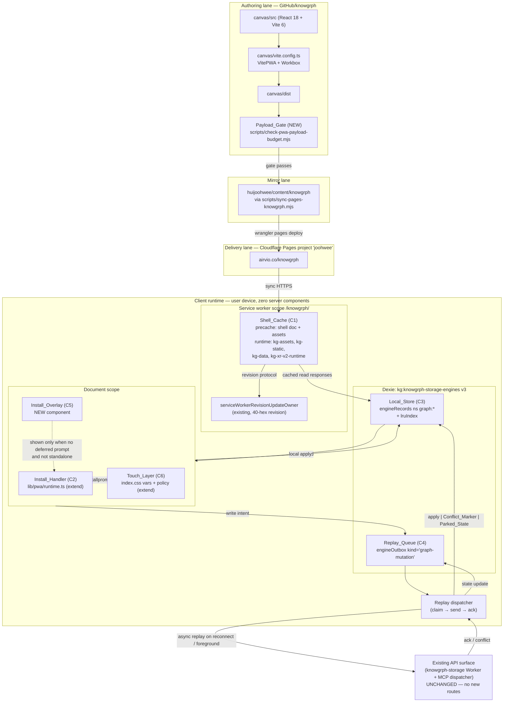
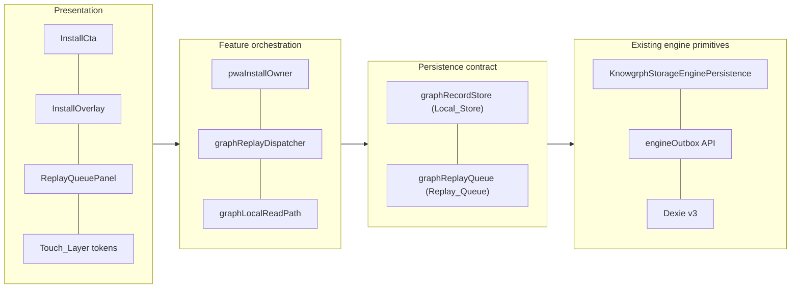
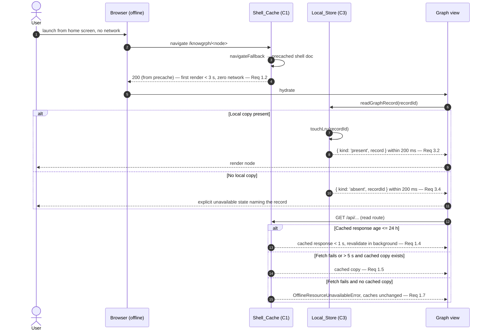
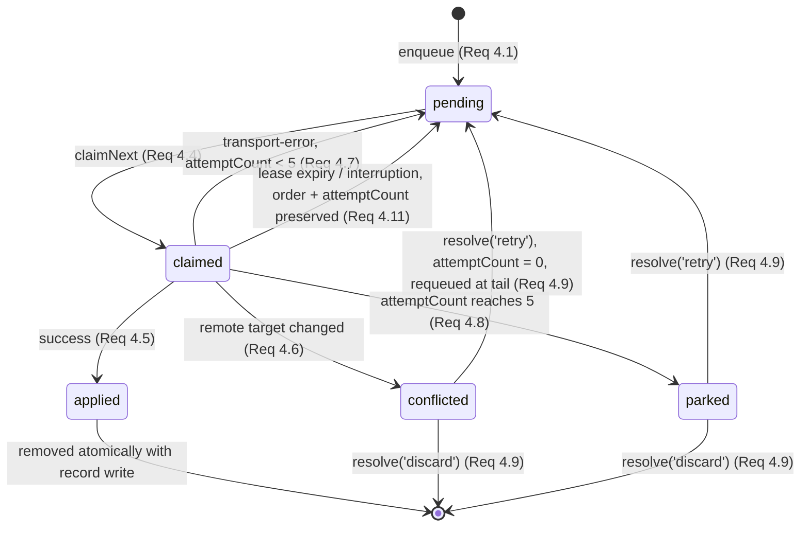

# Design Document

## Overview

This design implements Requirements 1–10 of `requirements.md@1.1.0` **as a set of bounded
extensions to PWA machinery that already exists in the `knowgrph` monorepo**, not as a greenfield
client runtime. The codebase survey below is the single most important input to this design: five of
the seven named components have substantial prior art, one has partial prior art, and one
(`Payload_Gate`) does not exist.

The design therefore optimises for **build-hour economy through reuse** (consistent with the source
ADR-1/ADR-2 rationale, where FOSS-vs-FOSS choices were decided on build hours rather than cost) and
for **not regressing existing invariants**. Two requirement criteria conflict with deliberate
existing behaviour; both are called out as explicit design decisions rather than silently resolved.

### Codebase Survey — Verified Findings

Every row below was read directly from the working tree. Paths are relative to `GitHub/knowgrph`.

| Concern | Verified state | File(s) |
|---|---|---|
| Framework | React 18.3 + TypeScript 5.8, `zustand` 5 stores, `react-router-dom` 7 | `canvas/package.json` |
| Build tool | Vite 6.3, npm workspaces monorepo; app workspace is `@knowgrph/canvas` | `canvas/package.json`, root `package.json` |
| PWA plugin | **`vite-plugin-pwa@0.21.1` already configured** (Workbox under the hood) | `canvas/vite.config.ts` L7075–7196 |
| Manifest | Already declares `display: standalone`, `theme_color`/`background_color` `#0b1220`, `start_url: '.'`, `scope: '.'`, `id` derived from `VITE_BASE_PATH` | `canvas/vite.config.ts` L7079–7137 |
| Manifest icons | **Only** `favicon.svg` (`sizes: 'any'`, `purpose: 'any maskable'`) and `apple-touch-icon.png` (180×180, `purpose: 'any'`). **No 192×192 or 512×512 raster maskable icon.** | `canvas/vite.config.ts` L7118–7131 |
| Workbox precache | `globPatterns: ['manifest.webmanifest','favicon.svg','apple-touch-icon.png','assets/**/*.{js,css,woff,woff2,ttf}']`, `navigateFallback: null`. **The shell document is not precached.** | `canvas/vite.config.ts` L7140–7145 |
| Runtime caches | `kg-xr-v2-runtime` (CacheFirst), `kg-assets` (StaleWhileRevalidate), `kg-static` (CacheFirst), `kg-data` (StaleWhileRevalidate, 7-day max age, `.json`/`.jsonld`/`.webmanifest`) | `canvas/vite.config.ts` L7146–7192 |
| HTML cache policy | `nonHtmlRuntimeCachePlugin` **actively refuses to store or serve `text/html`** in every runtime cache | `canvas/vitePwaRuntimeCachePolicy.ts` |
| SW registration | Canonical registration owner, scope `/knowgrph/`, 40-hex source-revision binding | `canvas/src/lib/pwa/serviceWorkerRegistrationOwner.ts` |
| SW update/revision | Update min interval 5 min, convergence retries `[1s, 5s, 15s, 30s]`, revision request/response postMessage protocol with 2 s timeout | `canvas/src/lib/pwa/serviceWorkerRevisionUpdateOwner.ts` |
| Install prompt | **`beforeinstallprompt` already deferred and retained**; `getDeferredInstallPrompt()`, `promptPwaInstall()`, display-mode detection incl. `navigator.standalone` | `canvas/src/lib/pwa/runtime.ts` |
| Install CTA / iOS overlay | **No component found.** No `AddToHomeScreen`-style surface exists. | — |
| Local store | Dexie 4.4.4; `KnowgrphStorageEngineDexie` at schema **version 2**, tables `engineRecords`, `engineOutbox`, `binaryManifests`, `binaryChunks`; IndexedDB mode with in-memory `degrade()` fallback | `canvas/src/lib/storage/knowgrphStorageEnginePersistence.ts` |
| Offline queue | **A full outbox exists**: `enqueue(record, capacity)` with dedupe-by-id, monotonic per-`(kind, workspaceId)` sequence assignment, FIFO ordering by `sequence → createdAtMs → id`, `claimNext` with `claimToken`/`claimOwner`/`claimExpiresAtMs` lease and `partitionKey` single-flight, `updateClaimed`, atomic `acknowledgeClaimed` | `canvas/src/lib/storage/knowgrphStorageEngineOutboxPersistence.ts` |
| Outbox kinds | `'git-operation' \| 'file-transfer'` — **no graph-mutation kind** | `canvas/src/lib/storage/knowgrphStorageEnginePersistenceContract.ts` L7 |
| Client outbox record | `attemptCount`, `lastAckStatus: 'applied'\|'conflict'\|'rejected'\|'deferred'\|''`, `baseRevision`, `payloadHash` | `canvas/src/lib/storage/knowgrphStorageSyncContract.ts` L128–141 |
| Retry bounds | `KNOWGRPH_STORAGE_SYNC_BOUNDS`: `backoffBaseMs 1000`, `backoffFactor 2`, `backoffCapMs 30000`, **`maxRetryAttempts: 3`** | `canvas/src/lib/storage/knowgrphStorageBounds.ts` |
| Conflict handling | Conflict candidate store, overlap detection, accept-remote / keep-local action ids, conflict UX module | `knowgrphStorageConflictStore.ts`, `...ConflictActions.ts`, `...ConflictUx.ts` |
| Safe-area | `--kg-safe-top/right/bottom/left: env(safe-area-inset-*, 0px)` already declared | `canvas/src/index.css` L109–112 |
| Payload budget | `check-hygiene-compliance.mjs --chunks` enforces **per-chunk raw byte budgets** and a 500 KiB/file source budget. **No total critical-path brotli measurement exists.** | `scripts/check-hygiene-compliance.mjs`, `scripts/hygiene-built-chunk-budget.mjs` |
| Test runner | Node built-in `node --test`, TypeScript via `tsx`; canvas suites dispatched through `npm -C canvas run test:ci:unit -- <filter>` (`canvas/src/tests/ci.ts`) | root + canvas `package.json` |
| PBT library | **`fast-check@3.23.2` already pinned** in root `devDependencies`; `fake-indexeddb@^6.2.5` also present | root `package.json` |
| PBT convention | Root packages use `__pbt__/*.pbt.test.mjs`; canvas uses `src/__tests__/*Properties*.test.ts` with `const PROPERTY_RUNS = 100` and `import fc from 'fast-check'` | `canvas/src/__tests__/knowgrphStorageEnhancementPropertiesSync.test.ts` |
| Browser smoke | Playwright 1.60 with per-feature runners `canvas/scripts/run_*_browser_smoke.mjs`, including `test:smoke:mobile-keyboard:browser` | `canvas/package.json` |
| Delivery lane | `pages:build` (`VITE_BASE_PATH=/knowgrph/`) → `pwa:build-authority:check` → `pages:sync` into `../huijoohwee` → `wrangler pages deploy ../huijoohwee --project-name=joohwee` | root `package.json` |
| Mirror path | `START-WORKFLOW.md` declares `prod_mirror: $GITHUB_ROOT/huijoohwee/content/knowgrph`; production routes `https://airvio.co`, `https://airvio.co/knowgrph` | `agentic-canvas-os/docs/START-WORKFLOW.md` |
| SW upgrade proof | `production:sw-upgrade:prewarm` / `:verify`, `scripts/service-worker-upgrade-cache-proof.mjs` | root `package.json`, `scripts/` |
| Lighthouse | **Not a dependency anywhere in the repo.** | root + canvas `package.json` |

### Explicitly Unverified

State these as gaps rather than assumptions:

- **Live behaviour of `airvio.co/knowgrph`** — no network request was made during this survey. All Delivery-surface claims are design intent, not observed fact.
- **Current critical-path brotli size** — no measurement tool exists yet, so it is unknown whether Requirement 7's 180 KB budget is currently met, nearly met, or badly exceeded. Task 7 must measure before it can be sized.
- **Whether `kg-data` StaleWhileRevalidate actually covers the graph read routes** named in Requirement 1.4 — the existing pattern matches by `.json`/`.jsonld` suffix and same-origin, and the read API route shapes were not enumerated in this survey.
- **Current tap-target conformance** — no audit exists, so the Requirement 6.1 violation count is unknown.
- **Whether `KNOWGRPH_STORAGE_ENGINE_MAX_BYTES` (10 MB)** interacts with Requirement 3.8's 50 MB local-record ceiling; the constant appears to bound a single value/binary rather than the store, but that was not traced to every call site.
- **Whether the existing `engineOutbox` `partitionKey` is populated by the graph write path** — `claimNext` filters on it, and the graph write path does not yet exist, so this is a design obligation rather than an observation.

### Two Requirement/Codebase Conflicts

**Conflict A — offline shell render vs. the no-HTML-in-cache invariant.**
Requirement 1.2 demands the shell render offline. The codebase deliberately prevents HTML from
entering any cache (`nonHtmlRuntimeCachePlugin` returns `null` for `text/html` on both
`cacheWillUpdate` and `cachedResponseWillBeUsed`), sets `navigateFallback: null`, and omits
`index.html` from `globPatterns`. That invariant is almost certainly protecting against a real
failure mode: a stale cached HTML document referencing content-hashed asset URLs that a later
deploy has purged produces a hard-broken app rather than a stale one.

**Decision**: satisfy Requirement 1.2 through the **precache manifest**, not through a runtime
cache. Workbox precache entries are revisioned in lockstep with the build's asset hashes and are
atomically replaced on activation, so a precached shell document can never outlive the assets it
references. `nonHtmlRuntimeCachePlugin` stays byte-for-byte unchanged and continues to govern all
four runtime caches. Concretely: add the built shell document to the precache set and point
`navigateFallback` at that precached entry. This satisfies 1.2 and 1.3 while preserving the
invariant that motivated the existing policy. Rejected alternative: relaxing
`nonHtmlRuntimeCachePlugin` to permit HTML in `kg-assets` — that reintroduces exactly the
stale-HTML/purged-asset failure the plugin exists to prevent.

**Conflict B — retry bound arity.**
Requirement 4.7 specifies delays of 1, 2, 4, 8 s and **a maximum of 5 attempts**.
`KNOWGRPH_STORAGE_SYNC_BOUNDS.maxRetryAttempts` is **3**, with `backoffCapMs 30000`, and governs the
existing cloud sync path.

**Decision**: introduce a feature-scoped `KNOWGRPH_PWA_REPLAY_BOUNDS` constant rather than editing
the shared bound. Raising a shared bound to satisfy one requirement would silently change retry
economics for the existing git and file-transfer sync paths, which no requirement in this document
authorises. The two bounds coexist; `KNOWGRPH_PWA_REPLAY_BOUNDS` reuses
`buildKnowgrphStorageBackoffDelayMs`'s shape (base × factor^attempt) because `1, 2, 4, 8` is
exactly `1000 × 2^n` for `n ∈ {0,1,2,3}`, so the existing helper produces the required schedule
with a feature-scoped cap.

### Component Reuse Posture

| Requirement component | Posture | Rationale |
|---|---|---|
| `Shell_Cache` | **Extend** existing `VitePWA`/Workbox config | Precache + versioned cleanup already exist; add shell precache, auth-scoped purge, quota policy |
| `Install_Handler` | **Extend** `canvas/src/lib/pwa/runtime.ts` | Deferred-prompt capture already exists; add manifest icons, CTA surface, outcome recording |
| `Local_Store` | **Extend** `KnowgrphStorageEngineDexie` to version 3 | Dexie store, degrade-to-memory, typed record validation already exist; add graph-record namespace, LRU eviction, bounds |
| `Replay_Queue` | **Extend** `knowgrphStorageEngineOutboxPersistence` | FIFO sequencing, lease claim, per-partition single-flight, atomic ack already exist; add `graph-mutation` kind, `Conflict_Marker`, `Parked_State`, feature-scoped retry bound |
| `Install_Overlay` | **New** | No prior art found |
| `Touch_Layer` | **Extend** | Safe-area CSS custom properties exist; tap-target and gesture policy do not |
| `Payload_Gate` | **New** | Existing hygiene check measures per-chunk raw bytes, not total critical-path brotli |

## Architecture

### Client Runtime + Build Gate + Delivery Lane



Boundaries worth naming explicitly on the diagram: `Payload_Gate` is the only new node in the
Authoring lane and it is a **build-time gate, not a runtime component**; `ExistingAPI` is drawn to
show the replay target but is **outside this feature's scope and unchanged**; and no node exists
between `MirrorRepo` and `CF` other than the existing wrangler deploy, satisfying Requirement 8.1's
zero-server-runtime constraint.

### Layering



`L2` is the seam this design introduces. It exists so `L3` never touches Dexie or the raw outbox
API directly, which is what makes the correctness properties in this document testable against a
narrow surface with `fake-indexeddb` rather than against the whole engine.

## Sequence Diagrams

### First online visit + install (Requirements 1.1, 2.1–2.4, 5.1)

```mermaid
sequenceDiagram
  autonumber
  actor U as User (mobile browser)
  participant B as Browser
  participant CF as airvio.co/knowgrph
  participant SW as Shell_Cache (C1)
  participant IH as Install_Handler (C2)
  participant IO as Install_Overlay (C5)

  U->>B: open airvio.co/knowgrph
  B->>CF: GET /knowgrph/ (shell document)
  CF-->>B: 200 shell + manifest.webmanifest link
  B->>CF: GET assets/*.js, *.css
  CF-->>B: 200 assets
  B->>SW: register('/knowgrph/sw.js', scope '/knowgrph/')
  Note over SW: registerCanonicalServiceWorker<br/>binds 40-hex source revision (existing)
  SW->>CF: precache manifest fetch<br/>(shell doc + globPatterns entries)
  CF-->>SW: 200 responses
  SW->>SW: write precache (versioned) — Req 1.1
  SW-->>IH: activated, entryCount > 0

  alt Browser fires deferred install prompt (Chromium)
    B-->>IH: beforeinstallprompt
    IH->>IH: preventDefault(); retain event — existing behaviour
    IH-->>U: render InstallCta within 1 s — Req 2.2
    U->>IH: activate InstallCta
    IH->>B: prompt() exactly once — Req 2.3
    B-->>U: native install sheet
    U-->>B: accept
    B-->>IH: userChoice { outcome: 'accepted' }
    IH->>IH: record outcome, discard event, hide CTA
  else No deferred prompt within 5 s (iOS Safari, others)
    IH->>IH: leave CTA hidden, block nothing — Req 2.5
    Note over IO: 3 s after interactive AND not standalone
    IO-->>U: show manual A2HS steps (2–6 ordered) — Req 5.1
    U->>IO: dismiss (tap or Escape)
    IO->>IO: hide, suppress for session, restore focus — Req 5.2, 5.5, 5.6
  end

  U->>B: relaunch from home screen
  B->>IH: launch in standalone
  IH-->>U: report Standalone_Mode within 2 s — Req 2.4
  IH->>IH: keep CTA hidden — Req 2.8
  IO->>IO: never show in standalone — Req 5.3
```

### Offline read (Requirements 1.2, 1.5, 1.7, 3.2, 3.4)



### Offline write → reconnect replay, incl. conflict and parked paths (Requirement 4)

```mermaid
sequenceDiagram
  autonumber
  actor U as User
  participant UI as Graph view
  participant LS as Local_Store (C3)
  participant RQ as Replay_Queue (C4)
  participant D as graphReplayDispatcher
  participant API as Existing API surface

  Note over U,RQ: Offline_Mode active
  U->>UI: commit edit
  UI->>RQ: enqueue(intent)
  alt pending count < 500
    RQ->>RQ: assign monotonic sequence, persist Replay_Record < 1 s — Req 4.1
    RQ->>LS: apply edit locally
    LS-->>UI: readable by next read — Req 4.1
  else pending count == 500
    RQ-->>UI: ReplayQueueFullError; pending set unchanged — Req 4.3
    UI-->>U: "offline queue full"
  end

  Note over D: connectivity returns (online event)<br/>or, where background sync is absent,<br/>next foreground event — Req 4.10
  D->>D: start within 5 s — Req 4.4

  loop until no claimable record
    D->>RQ: claimNext({ partitionKey: target, leaseMs })
    RQ-->>D: { record, claimToken } — one in flight per target — Req 4.4
    D->>API: send(record.payload)

    alt success
      API-->>D: 200 applied
      D->>RQ: acknowledgeClaimed(id, claimToken, recordWrites)
      RQ->>LS: atomic: write record + delete queue entry
      Note over RQ: result + completedAtMs recorded — Req 4.5
    else target changed since local edit
      API-->>D: 409 conflict (baseRevision stale)
      D->>RQ: updateClaimed(record + Conflict_Marker, releaseClaim)
      Note over LS: local edit retained,<br/>remote state unchanged — Req 4.6
      D->>D: continue with next record
    else transport / server failure
      API-->>D: 5xx or network error
      D->>RQ: updateClaimed(attemptCount + 1, nextAttemptAtMs)
      Note over D: delays 1, 2, 4, 8 s; max 5 attempts — Req 4.7
      alt attemptCount reaches 5
        D->>RQ: updateClaimed(record + Parked_State)
        RQ-->>UI: surface as needing attention — Req 4.8
        D->>D: continue with next record
      end
    end
  end

  Note over RQ: drain complete → only Conflict_Marker<br/>and Parked_State records remain — Req 4.14

  U->>UI: select flagged record
  alt retry
    UI->>RQ: resolve(id, 'retry')
    RQ->>RQ: attemptCount = 0, clear marker, requeue at tail — Req 4.9
  else discard
    UI->>RQ: resolve(id, 'discard')
    RQ->>RQ: remove from pending set — Req 4.9
  end

  Note over D,RQ: interruption path — Req 4.11
  D-xAPI: connectivity lost mid-drain
  Note over RQ: unacked records retain persisted order<br/>and attemptCount; resume from earliest
```

## Components and Interfaces

All interfaces are TypeScript. Paths follow the existing convention (`canvas/src/lib/...`,
`canvas/src/features/...`, PascalCase components, camelCase modules named after their owner role —
matching `serviceWorkerRegistrationOwner.ts`, `knowgrphStorageEngineOutboxPersistence.ts`).

### C1 — Shell_Cache

Extends the existing `VitePWA` block in `canvas/vite.config.ts` plus one new authoring-side module.
The service worker itself remains Workbox-generated; no hand-written `sw.js`.

`canvas/src/lib/pwa/shellCacheContract.ts` (new)

```ts
export const SHELL_CACHE_BOUNDS = {
  /** Req 1.1 — precache completion window after first visit completes. */
  precacheCompletionMs: 10_000,
  /** Req 1.2 — offline shell first-render ceiling. */
  offlineFirstRenderMs: 3_000,
  /** Req 1.3 — superseded-entry deletion window after activation. */
  supersededPurgeMs: 5_000,
  /** Req 1.4 — read-API cached-response freshness window. */
  readApiMaxAgeMs: 24 * 60 * 60 * 1_000,
  /** Req 1.4 — cached read-API serve ceiling. */
  readApiServeMs: 1_000,
  /** Req 1.5 — network timeout before falling back to cache. */
  networkFallbackTimeoutMs: 5_000,
  /** Req 1.6 — authorization-scoped purge window on sign-out. */
  authScopePurgeMs: 5_000,
} as const

/** Cache names owned by this feature, in eviction priority order (Req 1.8). */
export const SHELL_CACHE_EVICTION_ORDER = ['kg-data', 'kg-static', 'kg-assets'] as const

/** Never evicted under storage pressure (Req 1.8). */
export const SHELL_CACHE_PROTECTED_PRECACHE = true as const

export type ShellCacheEntryClass =
  | 'shell-document'
  | 'route-chunk'
  | 'static-asset'
  | 'read-api'

export type ShellCacheInventory = {
  readonly activeRevision: string          // 40-hex, matches existing SW revision contract
  readonly entryCount: number              // Req 1.1: > 0 after first visit
  readonly supersededEntryCount: number    // Req 1.3: 0 after activation
  readonly authScopedEntryCount: number    // Req 1.6: 0 after sign-out
  readonly byClass: Readonly<Record<ShellCacheEntryClass, number>>
}

/** Req 1.1, 1.3 — read-only inventory for assertions; performs no mutation. */
export declare function readShellCacheInventory(
  args: { caches: CacheStorage; activeRevision: string },
): Promise<ShellCacheInventory>

/** Req 1.3 — delete every entry belonging to a superseded revision. */
export declare function purgeSupersededShellCacheEntries(
  args: { caches: CacheStorage; activeRevision: string; nowMs: number },
): Promise<{ deletedEntryCount: number; remainingSupersededCount: 0 }>

/** Req 1.6 — sign-out purge; retains unscoped shell and static entries. */
export declare function purgeAuthorizationScopedShellCacheEntries(
  args: { caches: CacheStorage; authorizationScope: string },
): Promise<{ deletedEntryCount: number; retainedUnscopedCount: number }>

/** Req 1.8 — oldest-first read-API eviction until the write succeeds. */
export declare function evictShellCacheForStoragePressure(
  args: { caches: CacheStorage; requiredBytes: number },
): Promise<
  | { outcome: 'freed'; evictedEntryCount: number }
  | { outcome: 'storage-limit'; evictedEntryCount: number }
>
```

Workbox configuration delta (in `canvas/vite.config.ts`):

- add the built shell document to the precache set and set `navigateFallback` to that precached
  entry (Conflict A decision) — Requirements 1.1, 1.2
- add a `NetworkFirst`-with-timeout runtime route for read API paths with
  `networkTimeoutSeconds: 5` and a 24 h `expiration.maxAgeSeconds` — Requirements 1.4, 1.5, 1.7
- keep `nonHtmlRuntimeCachePlugin` on every runtime route, unchanged
- keep `cleanupOutdatedCaches` behaviour (Workbox default under `registerType: 'autoUpdate'`) and
  assert it via `purgeSupersededShellCacheEntries` — Requirement 1.3

### C2 — Install_Handler

Extends `canvas/src/lib/pwa/runtime.ts` (which already owns `deferredInstallPrompt`,
`getDeferredInstallPrompt`, `promptPwaInstall`, and display-mode detection).

`canvas/src/lib/pwa/installHandlerContract.ts` (new)

```ts
export const INSTALL_HANDLER_BOUNDS = {
  ctaVisibleWithinMs: 1_000,        // Req 2.2
  standaloneReportWithinMs: 2_000,  // Req 2.4
  promptWaitMs: 5_000,              // Req 2.5
} as const

export type InstallAffordanceState =
  | { readonly kind: 'hidden'; readonly reason:
        'no-deferred-prompt' | 'standalone' | 'dismissed-this-session'
        | 'consumed' | 'prompt-unavailable' }
  | { readonly kind: 'visible'; readonly capturedAtMs: number }

export type InstallOutcome = 'accepted' | 'dismissed'

export type InstallPromptResult =
  | { readonly kind: 'recorded'; readonly outcome: InstallOutcome; readonly atMs: number }
  | { readonly kind: 'unavailable'; readonly reason: 'no-retained-event' | 'prompt-failed' }

export type PwaDisplayMode = 'browser' | 'standalone' | 'fullscreen' | 'minimal-ui'

/** Req 2.4 — existing runtime.ts detection, re-exported through the contract. */
export declare function readPwaDisplayMode(): PwaDisplayMode
export declare function isStandaloneMode(): boolean

/** Req 2.2, 2.5, 2.6, 2.8 — pure state reducer, no DOM access, so it is unit-testable. */
export declare function reduceInstallAffordanceState(
  current: InstallAffordanceState,
  event:
    | { readonly type: 'deferred-prompt-captured'; readonly atMs: number }
    | { readonly type: 'prompt-window-elapsed' }
    | { readonly type: 'prompt-resolved'; readonly outcome: InstallOutcome }
    | { readonly type: 'prompt-failed' }
    | { readonly type: 'display-mode-changed'; readonly mode: PwaDisplayMode },
): InstallAffordanceState

/** Req 2.3, 2.7 — invokes the retained prompt exactly once, then discards it. */
export declare function invokeRetainedInstallPrompt(): Promise<InstallPromptResult>
```

Manifest delta (in `canvas/vite.config.ts`): add `192x192` and `512x512` PNG icons with
`purpose: 'maskable'`, plus matching source assets under `canvas/public/`. Requirement 2.1 demands
*exactly* those two sizes present; the existing `favicon.svg` (`sizes: 'any'`) does not satisfy a
size-specific assertion, and `apple-touch-icon.png` is 180×180 with `purpose: 'any'`.

`canvas/src/components/pwa/InstallCta.tsx` (new) — presentational only; consumes
`InstallAffordanceState`, renders nothing when `kind === 'hidden'`.

### C3 — Local_Store

Extends `KnowgrphStorageEngineDexie` from schema version 2 to **version 3**, adding a `graphRecords`
table and an LRU index. Reusing the existing engine keeps the degrade-to-memory fallback, credential
assertions, and clone-safety helpers rather than re-implementing them.

`canvas/src/lib/storage/graphRecordStoreContract.ts` (new)

```ts
export const LOCAL_STORE_BOUNDS = {
  persistWithinMs: 500,        // Req 3.1
  readWithinMs: 200,           // Req 3.2, 3.4
  maxRecordBytes: 1_048_576,   // Req 3.1, 3.3 — 1 MB per record
  maxRecordCount: 5_000,       // Req 3.8
  maxTotalBytes: 52_428_800,   // Req 3.8 — 50 MB
} as const

export type GraphRecordId = string

export type TypedGraphRecord = {
  readonly recordId: GraphRecordId
  readonly workspaceId: string
  readonly entity: 'document' | 'documentChunk' | 'graph'
  readonly schemaVersion: number
  readonly revision: number | null      // server revision; null when never synced
  readonly payload: Readonly<Record<string, unknown>>
  readonly payloadBytes: number
  readonly contentHash: string
  readonly syncedAtMs: number
  readonly lastReadAtMs: number         // LRU key (Req 3.7, 3.8)
}

export type GraphReadResult =
  | { readonly kind: 'present'; readonly record: TypedGraphRecord }
  | { readonly kind: 'absent'; readonly recordId: GraphRecordId }

export type GraphPersistResult =
  | { readonly kind: 'persisted'; readonly recordId: GraphRecordId; readonly atMs: number }
  | { readonly kind: 'validation-error'; readonly error: LocalStoreValidationError }
  | { readonly kind: 'storage-exhausted'; readonly evictedRecordIds: readonly GraphRecordId[] }

export type LocalStoreValidationError =
  | { readonly code: 'schema-field-invalid'; readonly field: string; readonly detail: string }
  | { readonly code: 'record-too-large'; readonly bytes: number; readonly limitBytes: number }

export type MigrationOutcome =
  | { readonly kind: 'migrated'; readonly fromVersion: number; readonly toVersion: number }
  | { readonly kind: 'not-required'; readonly version: number }
  | { readonly kind: 'migration-error'
      readonly fromVersion: number
      readonly restoredVersion: number
      readonly detail: string }

export type GraphRecordStore = {
  /** Req 3.1, 3.3, 3.7 — validate, size-check, persist; evict-and-retry once on quota failure. */
  persist(record: TypedGraphRecord, nowMs: number): Promise<GraphPersistResult>
  /** Req 3.2, 3.4, 3.8 — never returns an evicted record as present; touches LRU on hit. */
  read(recordId: GraphRecordId, nowMs: number): Promise<GraphReadResult>
  /** Req 3.8 — enforce both ceilings, least-recently-read first. */
  enforceBounds(nowMs: number): Promise<{ evictedRecordIds: readonly GraphRecordId[] }>
  /** Req 3.5, 3.6 — must complete before any read is served. */
  ensureMigrated(): Promise<MigrationOutcome>
  inventory(): Promise<{ recordCount: number; totalBytes: number; schemaVersion: number }>
}

export declare function createGraphRecordStore(
  args: {
    persistence: KnowgrphStorageEnginePersistence  // existing engine
    bounds?: Partial<typeof LOCAL_STORE_BOUNDS>
  },
): Promise<GraphRecordStore>
```

### C4 — Replay_Queue

Extends `knowgrphStorageEngineOutboxPersistence` with a third outbox kind. The existing
`claimNext({ kind, workspaceId, partitionKey, claimOwner, claimToken, nowMs, leaseMs })` already
delivers per-target single-flight and FIFO-by-sequence ordering, which is precisely what
Requirement 4.4 asks for; setting `partitionKey = replayTargetKey(record)` is what makes
order-preservation-per-target fall out of the existing implementation rather than needing new code.

Contract delta: `KnowgrphStorageEngineOutboxKind` gains `'graph-mutation'`.

`canvas/src/lib/storage/graphReplayQueueContract.ts` (new)

```ts
export const KNOWGRPH_PWA_REPLAY_BOUNDS = {
  /** Req 4.2, 4.3 — pending ceiling, counting flagged records. */
  maxPendingRecords: 500,
  /** Req 4.7 — 1, 2, 4, 8 s == 1000 * 2^n for n in 0..3. */
  backoffBaseMs: 1_000,
  backoffFactor: 2,
  backoffCapMs: 8_000,
  /** Req 4.7, 4.8 — total attempts per record before parking. */
  maxAttempts: 5,
  /** Req 4.1 — persistence window for a committed offline edit. */
  persistWithinMs: 1_000,
  /** Req 4.4 — replay start window after connectivity returns. */
  replayStartWithinMs: 5_000,
  /** Req 8.5 — MCP-routed forward window after dequeue. */
  mcpForwardWithinMs: 1_000,
  /** Lease for a claimed record; bounded so a killed tab cannot wedge a target. */
  claimLeaseMs: 30_000,
} as const

/** Req 4.7 — reuses the existing helper's shape with a feature-scoped cap. */
export declare function buildPwaReplayBackoffDelayMs(attemptIndex: number): number

export type ReplayTargetKey = string  // used as engineOutbox partitionKey (Req 4.4)

export type ReplayIntent = {
  readonly mutationId: string
  readonly workspaceId: string
  readonly entity: 'document' | 'documentChunk' | 'graph'
  readonly op: 'upsert' | 'delete'
  readonly recordId: string
  readonly baseRevision: number | null
  readonly route: { readonly kind: 'api' } | { readonly kind: 'mcp'; readonly command: string }
  readonly payload: Readonly<Record<string, unknown>>
}

export type ConflictMarker = {
  readonly kind: 'conflict'
  readonly detectedAtMs: number
  readonly localBaseRevision: number | null
  readonly remoteRevision: number | null
}

export type ParkedState = {
  readonly kind: 'parked'
  readonly parkedAtMs: number
  readonly attemptCount: number       // always === maxAttempts (Req 4.8)
  readonly lastErrorCode: string
}

export type ReplayFlag = ConflictMarker | ParkedState | null

export type ReplayRecord = {
  readonly id: string                 // === intent.mutationId; dedupe key (Req 4.12)
  readonly kind: 'graph-mutation'
  readonly workspaceId: string
  readonly partitionKey: ReplayTargetKey
  readonly sequence: number           // monotonic per (kind, workspaceId) (Req 4.4, 4.11)
  readonly intent: ReplayIntent
  readonly payloadHash: string
  readonly attemptCount: number       // Req 4.7
  readonly nextAttemptAtMs: number | null
  readonly flag: ReplayFlag           // Req 4.6, 4.8
  readonly createdAtMs: number
  readonly updatedAtMs: number
  readonly completedAtMs: number | null
  readonly lastResult:
    | { readonly kind: 'applied'; readonly remoteRevision: number | null }
    | { readonly kind: 'conflict' }
    | { readonly kind: 'transport-error'; readonly code: string }
    | null
}

export type EnqueueResult =
  | { readonly kind: 'enqueued'; readonly record: ReplayRecord }
  | { readonly kind: 'duplicate'; readonly record: ReplayRecord }   // Req 4.12
  | { readonly kind: 'queue-full'; readonly pendingCount: 500 }     // Req 4.3

export type ReplayAttemptOutcome =
  | { readonly kind: 'applied'; readonly remoteRevision: number | null }
  | { readonly kind: 'conflict'; readonly remoteRevision: number | null }
  | { readonly kind: 'transport-error'; readonly code: string }

export type DrainSummary = {
  readonly startedAtMs: number
  readonly appliedCount: number
  readonly conflictCount: number
  readonly parkedCount: number
  readonly remainingPendingCount: number   // Req 4.14: === conflictCount + parkedCount
  readonly modelInvocationCount: 0         // Req 8.4
}

export type ReplayResolution = 'retry' | 'discard'

export type GraphReplayQueue = {
  /** Req 4.1, 4.3, 4.12 — id-keyed dedupe; capacity counts flagged records (Req 4.2). */
  enqueue(intent: ReplayIntent, nowMs: number): Promise<EnqueueResult>
  /** Req 4.4 — one in-flight record per partitionKey, FIFO by sequence. */
  claimNext(args: { workspaceId: string; nowMs: number }): Promise<
    { readonly record: ReplayRecord; readonly claimToken: string } | null
  >
  /** Req 4.5, 4.6, 4.7, 4.8 — single transition point; sets flags and attempt counts. */
  settleClaimed(args: {
    readonly record: ReplayRecord
    readonly claimToken: string
    readonly outcome: ReplayAttemptOutcome
    readonly nowMs: number
  }): Promise<{ readonly record: ReplayRecord | null; readonly removed: boolean }>
  /** Req 4.9 — user resolution of a flagged record. */
  resolve(args: {
    readonly id: string
    readonly resolution: ReplayResolution
    readonly nowMs: number
  }): Promise<{ readonly record: ReplayRecord | null }>
  /** Req 4.2, 4.14 — pending set in persisted order. */
  listPending(workspaceId: string): Promise<readonly ReplayRecord[]>
  countPending(workspaceId: string): Promise<number>
}

/** Req 4.13 — the round-trip pair the property test exercises. */
export declare function serializeReplayRecord(record: ReplayRecord): string
export declare function deserializeReplayRecord(serialized: string): ReplayRecord

export declare function replayTargetKey(intent: ReplayIntent): ReplayTargetKey

/** Req 4.4, 4.10, 4.11 — dispatcher; owns the drain loop and trigger sources. */
export type GraphReplayDispatcher = {
  start(args: { workspaceId: string; trigger: 'online' | 'foreground' | 'manual' }): Promise<DrainSummary>
  readonly capabilities: { readonly backgroundSync: boolean }  // Req 4.10
}
```

### C5 — Install_Overlay

`canvas/src/components/pwa/InstallOverlay.tsx` + `canvas/src/lib/pwa/installOverlayContract.ts`
(both new).

```ts
export const INSTALL_OVERLAY_BOUNDS = {
  showAfterInteractiveMs: 3_000,  // Req 5.1
  showWithinMs: 500,              // Req 5.1
  hideWithinMs: 300,              // Req 5.2
  minSteps: 2,                    // Req 5.1, 5.7
  maxSteps: 6,
  maxFocusMovesToDismiss: 3,      // Req 5.4
} as const

export type A2hsBrowserProfile = 'ios-safari' | 'android-firefox' | 'generic'

export type A2hsStep = { readonly ordinal: number; readonly text: string }

export type A2hsGuidance = {
  readonly profile: A2hsBrowserProfile
  readonly isGeneric: boolean          // Req 5.7
  readonly steps: readonly A2hsStep[]  // length within [minSteps, maxSteps]
}

/** Req 5.1, 5.7 — never returns fewer than minSteps; falls back to generic. */
export declare function resolveA2hsGuidance(userAgent: string): A2hsGuidance

export type OverlayVisibility =
  | { readonly kind: 'hidden'; readonly reason:
        'not-yet-elapsed' | 'standalone' | 'dismissed-this-session' | 'native-prompt-available' }
  | { readonly kind: 'visible'; readonly shownAtMs: number
      readonly returnFocusTo: string | null }  // Req 5.5

/** Req 5.1, 5.2, 5.3, 5.6 — pure reducer; session suppression is caller-persisted. */
export declare function reduceOverlayVisibility(
  current: OverlayVisibility,
  event:
    | { readonly type: 'interactive-elapsed'; readonly atMs: number
        readonly hasDeferredPrompt: boolean; readonly isStandalone: boolean }
    | { readonly type: 'dismissed'; readonly via: 'control' | 'escape' }
    | { readonly type: 'display-mode-changed'; readonly isStandalone: boolean },
): OverlayVisibility
```

Session suppression (Requirement 5.2 — "remainder of that browser session, including across
in-session navigations and reloads … eligible again in a new browser session") uses
`sessionStorage`, which is precisely session-scoped and survives reload. Not `localStorage` (would
suppress forever) and not in-memory state (would not survive reload).

### C6 — Touch_Layer

Extends `canvas/src/index.css` (which already declares the four `--kg-safe-*` variables) plus a new
audit-facing contract module.

`canvas/src/lib/ui/touchLayerContract.ts` (new)

```ts
export const TOUCH_LAYER_BOUNDS = {
  minHitAreaCssPx: 44,          // Req 6.1
  minSeparationCssPx: 8,        // Req 6.1
  viewportMinCssPx: 320,        // Req 6.1
  viewportMaxCssPx: 430,
  homeIndicatorReserveCssPx: 34, // Req 6.2
  tapDispatchWithinMs: 100,      // Req 6.3
  orientationReflowWithinMs: 500, // Req 6.5
  minScrollFps: 50,              // Req 6.6
  maxTextScalePercent: 200,      // Req 6.7
  accessibleNameMinChars: 1,     // Req 6.4
  accessibleNameMaxChars: 100,
} as const

export type TapTargetViolation = {
  readonly selector: string
  readonly widthCssPx: number
  readonly heightCssPx: number
  readonly nearestNeighbourGapCssPx: number | null
  readonly accessibleName: string | null
}

export type TouchAuditReport = {
  readonly viewportCssPx: { readonly width: number; readonly height: number }
  readonly interactiveElementCount: number
  readonly undersizedTargets: readonly TapTargetViolation[]      // Req 6.1 → must be empty
  readonly unnamedControls: readonly TapTargetViolation[]        // Req 6.4 → must be empty
  readonly safeAreaVariablesResolved: readonly ('top'|'right'|'bottom'|'left')[]  // Req 6.2
}

/** Runs inside the Playwright page context against live computed styles. */
export declare function collectTouchAuditReport(): TouchAuditReport
```

CSS/policy delta: apply `--kg-safe-*` to root layout containers with a bottom reserve of
`max(var(--kg-safe-bottom), 34px)` (Requirement 6.2); ensure `touch-action: manipulation` on
interactive controls to remove double-tap-to-zoom delay (Requirement 6.3);
`overscroll-behavior: contain` on scrollable regions (Requirement 6.6); honour
`prefers-reduced-motion` (Requirement 6.7).

### C7 — Payload_Gate

`scripts/check-pwa-payload-budget.mjs` (new). This is the one component with no reusable prior art:
the existing `check-hygiene-compliance.mjs --chunks` measures **per-chunk raw bytes** against
per-path budgets, whereas Requirement 7 needs **total critical-path brotli-compressed bytes**.
Brotli comes from Node's built-in `node:zlib`, so this adds **zero dependencies** — which matters
directly for Requirement 8.2.

```ts
export const PAYLOAD_GATE_BOUNDS = {
  criticalPathBudgetBytes: 184_320,  // Req 7.2 — 180 KB brotli
  measurementWithinMs: 60_000,       // Req 7.1
} as const

export type CriticalPathAsset = {
  readonly path: string
  readonly rawBytes: number
  readonly brotliBytes: number
}

export type PayloadGateOutcome =
  | { readonly kind: 'pass'
      readonly brotliBytes: number
      readonly budgetBytes: number
      readonly assets: readonly CriticalPathAsset[]
      readonly onDemandRouteChunk: string }                       // Req 7.3
  | { readonly kind: 'over-budget'; readonly brotliBytes: number; readonly budgetBytes: number }
  | { readonly kind: 'no-on-demand-chunk' }                        // Req 7.3
  | { readonly kind: 'unmeasurable'; readonly assets: readonly string[] }  // Req 7.5
  | { readonly kind: 'skipped'; readonly lane: string }             // Req 7.6

export type PayloadGateEvidence = {
  readonly recordedBrotliBytes: number | null
  readonly budgetBytes: number
  readonly outcome: PayloadGateOutcome['kind']
  readonly onDemandRouteChunk: string | null
  readonly lane: 'authoring' | string
  readonly measuredAtMs: number
}

/** Req 7.1–7.6. Critical path = JS assets referenced by the built shell document
 *  transitively via static imports; on-demand chunks are those reachable only
 *  through dynamic import. */
export declare function runPayloadGate(
  args: { distDir: string; lane: string; nowMs: number },
): Promise<{ outcome: PayloadGateOutcome; evidence: PayloadGateEvidence }>
```

Wiring: invoked from the existing `pages:build` chain alongside `pwa:build-authority:check`, so the
gate runs in the Authoring lane only (Requirement 7.6).

## Data Models

### Dexie schema version 3

Extends `KnowgrphStorageEngineDexie` (currently at version 2). Existing version 1 and 2 blocks stay
byte-for-byte unchanged — Dexie requires prior version declarations to persist for upgrade paths.

```ts
// canvas/src/lib/storage/knowgrphStorageEnginePersistence.ts (delta)
this.version(3).stores({
  engineRecords: '&key, namespace, id, [namespace+id], updatedAtMs',
  engineOutbox:
    '&id, kind, workspaceId, partitionKey, sequence, createdAtMs, [kind+workspaceId+createdAtMs]',
  binaryManifests: '&key, namespace, objectKey, contentHash, [namespace+objectKey], updatedAtMs',
  binaryChunks: '&key, manifestKey, chunkIndex, [manifestKey+chunkIndex]',
  // NEW — Local_Store (Req 3)
  graphRecords:
    '&recordId, workspaceId, entity, schemaVersion, lastReadAtMs, syncedAtMs, [workspaceId+entity]',
})
```

`lastReadAtMs` is indexed because Requirement 3.7/3.8 eviction is least-recently-**read**; an
unindexed LRU scan would not hold the 200 ms read ceiling of Requirement 3.2 at 5 000 records.

`engineOutbox` needs no index change — `partitionKey` and `sequence` are already indexed at
version 2, which is what makes the Requirement 4.4 ordering guarantee reusable as-is.

### Typed local record

| Field | Type | Constraint | Requirement |
|---|---|---|---|
| `recordId` | `string` | non-empty, primary key | 3.1 |
| `workspaceId` | `string` | non-empty | 3.1 |
| `entity` | `'document' \| 'documentChunk' \| 'graph'` | enum | 3.3 |
| `schemaVersion` | `number` | positive integer | 3.5 |
| `revision` | `number \| null` | `null` when never synced | 4.6 |
| `payload` | `Record<string, unknown>` | credential-free (existing `assertStorageCredentialFree`) | 8.6 |
| `payloadBytes` | `number` | `<= 1_048_576` | 3.1, 3.3 |
| `contentHash` | `string` | existing `hashKnowgrphStorageContent` | 3.3 |
| `syncedAtMs` | `number` | epoch ms | 3.1 |
| `lastReadAtMs` | `number` | epoch ms, LRU key | 3.7, 3.8 |

Store-level invariants: `recordCount <= 5_000` **and** `sum(payloadBytes) <= 52_428_800`, whichever
binds first (Requirement 3.8).

### Replay_Record

Persisted as an `engineOutbox` row with `kind: 'graph-mutation'`, with the feature-specific fields
carried inside the row. Mapping to the existing engine record shape:

| `ReplayRecord` field | `engineOutbox` field | Notes |
|---|---|---|
| `id` | `id` (`&id` unique) | dedupe key; Requirement 4.12 idempotence rests on this |
| `kind` | `kind` | new enum member `'graph-mutation'` |
| `workspaceId` | `workspaceId` | indexed |
| `partitionKey` | `partitionKey` | `replayTargetKey(intent)`; drives per-target single-flight |
| `sequence` | `sequence` | assigned by existing `withAssignedSequence`; monotonic per `(kind, workspaceId)` |
| `intent` | `payload.intent` | typed write intent |
| `attemptCount` | `payload.attemptCount` | 0…5 |
| `nextAttemptAtMs` | `payload.nextAttemptAtMs` | backoff schedule |
| `flag` | `payload.flag` | `ConflictMarker \| ParkedState \| null` |
| `lastResult` | `payload.lastResult` | recorded per Requirement 4.5 |
| `completedAtMs` | `payload.completedAtMs` | set on applied, immediately before removal |
| — | `claimToken`, `claimOwner`, `claimExpiresAtMs` | existing lease fields, unchanged |
| — | `lastErrorCode` | existing; `claimNext` already skips non-null, which is how parked records are excluded from the drain loop without new filtering code |

State machine:



`conflicted` and `parked` are the only states that survive a completed drain (Requirement 4.14), and
both count toward the 500 ceiling (Requirement 4.2).

### Backoff schedule

| `attemptCount` before attempt | Delay before next attempt | Requirement |
|---|---|---|
| 0 → 1 | 1 000 ms | 4.7 |
| 1 → 2 | 2 000 ms | 4.7 |
| 2 → 3 | 4 000 ms | 4.7 |
| 3 → 4 | 8 000 ms | 4.7 |
| 4 → 5 | 8 000 ms (capped) | 4.7 |
| 5 | none — `Parked_State` | 4.8 |

`buildPwaReplayBackoffDelayMs(n) = min(1000 * 2^n, 8000)`, matching the shape of the existing
`buildKnowgrphStorageBackoffDelayMs` with a feature-scoped cap.

### Schema version + migration registry

```ts
// canvas/src/lib/storage/graphRecordMigrationRegistry.ts (new)
export type GraphRecordSchemaVersion = number

export type GraphRecordMigration = {
  readonly from: GraphRecordSchemaVersion
  readonly to: GraphRecordSchemaVersion
  readonly describe: string
  /** Pure per-record transform. Throwing rejects the whole migration (Req 3.6). */
  readonly migrateRecord: (record: Readonly<Record<string, unknown>>) => Readonly<Record<string, unknown>>
}

export const GRAPH_RECORD_SCHEMA_VERSION: GraphRecordSchemaVersion = 1

/** Ordered, contiguous, no gaps — asserted by a unit test, not by convention. */
export const GRAPH_RECORD_MIGRATIONS: readonly GraphRecordMigration[] = []

export declare function resolveMigrationPath(
  from: GraphRecordSchemaVersion,
  to: GraphRecordSchemaVersion,
): readonly GraphRecordMigration[] | { readonly error: 'no-declared-path' }
```

Two distinct version axes, deliberately kept separate:

- **Dexie store version** (1 → 2 → 3) governs table and index structure; Dexie owns the upgrade.
- **`schemaVersion` on each record** governs payload shape; `GRAPH_RECORD_MIGRATIONS` owns it, and
  Requirement 3.5/3.6 (migrate-before-serving, restore-on-failure) applies to this axis.

Requirement 3.6 restore-on-failure is implemented by running the whole migration inside a single
Dexie `rw` transaction, so a throw aborts it and leaves the pre-migration state intact. Reads then
continue at the pre-migration `schemaVersion`.

### Evidence_Reference

Per the governing guidelines, every VCC produces one Evidence_Reference. Shape:

```ts
export type EvidenceSurface = 'Authoring_Surface' | 'Mirror_Surface' | 'Delivery_Surface'

export type EvidenceReference = {
  readonly vccId: string          // e.g. 'VCC-REQ-4'
  readonly namedCheck: string     // exactly invocable, e.g. 'npm run pwa:replay:pbt'
  readonly recordedResult: string // exit code + counts; never "a result exists"
  readonly surface: EvidenceSurface
  readonly deliveryVerified: boolean  // false whenever surface === 'Authoring_Surface' (Req 9.8)
}
```

## Correctness Properties

*A property is a characteristic or behavior that should hold true across all valid executions of a
system — essentially, a formal statement about what the system should do. Properties serve as the
bridge between human-readable specifications and machine-verifiable correctness guarantees.*

Each property below survived a redundancy reflection pass over the full acceptance-criteria set.
Criteria classified as integration, smoke, or edge-case assertions are covered in the Testing
Strategy instead of here; property-based testing is deliberately **not** applied to the Workbox
service-worker runtime, the touch/layout audit, the delivery-lane receipt chain, or the demo
document, because none of those is a function whose behaviour varies meaningfully with generated
input.

### Property 1: Version activation leaves zero superseded cache entries

*For any* set of cache entries tagged with arbitrary revision identifiers and *any* transition from
one active revision to another — in either the forward-deploy or the rollback direction — purging
superseded entries leaves zero entries belonging to a non-active revision, and leaves every entry
belonging to the new active revision intact.

**Validates: Requirements 1.3, 9.6**

### Property 2: Sign-out purge partitions cache entries exactly

*For any* cache inventory mixing authorization-scoped entries across arbitrary scopes with unscoped
shell and static entries, purging one authorization scope leaves zero entries carrying that scope
and leaves the set of unscoped entries unchanged.

**Validates: Requirements 1.6**

### Property 3: Storage-pressure eviction never sacrifices the shell

*For any* cache inventory and *any* required byte demand, eviction removes only read-API entries, in
non-decreasing age order, and the shell document and initial route chunks are always still present
afterwards regardless of whether the demand was satisfied.

**Validates: Requirements 1.8**

### Property 4: The install affordance is never visible without a live retained prompt

*For any* sequence of install-lifecycle events, the affordance state is `visible` only if a deferred
prompt was captured earlier in that sequence with no intervening prompt resolution, prompt failure,
dismissal, or transition into standalone display mode.

**Validates: Requirements 2.2, 2.5, 2.6, 2.8**

### Property 5: The retained install prompt is invoked exactly once

*For any* number of affordance activations greater than or equal to one, the retained browser prompt
is invoked exactly once, exactly one outcome is recorded, and the terminal affordance state is
hidden.

**Validates: Requirements 2.3**

### Property 6: Local record persist/read round trip

*For any* valid typed graph record, persisting it and then reading it back returns a `present`
result whose record is equivalent to the one persisted, with zero network requests issued; and *for
any* record identifier never persisted, reading it returns an `absent` result naming that
identifier.

**Validates: Requirements 3.1, 3.2, 3.4**

### Property 7: Invalid payloads are rejected without collateral damage

*For any* payload that violates the typed local record schema or exceeds the 1 MB per-record limit,
persisting it returns a typed validation error naming the failed field or the exceeded limit, and any
previously persisted copy of that record is left byte-identical.

**Validates: Requirements 3.3**

### Property 8: No read is served before migration completes

*For any* declared schema version transition, no read returns a result until the migration for that
transition has reported success.

**Validates: Requirements 3.5**

### Property 9: Failed migration restores the exact pre-migration state

*For any* persisted store state and *any* migration step that fails, the post-failure store state is
byte-identical to the pre-migration state, a typed migration error is returned, and subsequent reads
are served at the pre-migration schema version.

**Validates: Requirements 3.6**

### Property 10: Eviction never returns a stale record as present

*For any* sequence of record persists that exceeds either the 5 000-record or the 50 MB ceiling —
including sequences against a quota-failing backend — both ceilings hold after bounds enforcement,
every evicted record identifier subsequently reads as `absent`, and no record that was not evicted is
lost.

**Validates: Requirements 3.7, 3.8**

### Property 11: An offline edit is immediately readable locally

*For any* write intent committed while offline, the edit is readable by the next local read of its
target, and exactly one pending replay record exists for that intent.

**Validates: Requirements 4.1**

### Property 12: The pending ceiling holds and rejection is non-mutating

*For any* sequence of enqueue operations, including sequences interleaving records that carry a
conflict marker or a parked state, the pending record count never exceeds 500, and every rejected
enqueue leaves the pending set byte-identical.

**Validates: Requirements 4.2, 4.3**

### Property 13: Replay preserves persisted order per target

*For any* interleaving of write intents across an arbitrary set of targets, draining the queue
replays the records for each individual target in exactly their persisted sequence order, and at no
point are two records sharing a target in flight simultaneously.

**Validates: Requirements 4.4**

### Property 14: Conflict leaves remote state untouched and local state retained

*For any* write intent whose target changed since the local edit, replay attaches a conflict marker
to that record, leaves the remote state byte-identical, retains the local edit in the local store,
and continues with the next record.

**Validates: Requirements 4.6**

### Property 15: The backoff schedule is monotonic and capped

*For any* attempt index, the computed retry delay is non-decreasing in the index and never exceeds
8 000 ms, and the delays for the first four indices are exactly 1 000, 2 000, 4 000, and 8 000 ms.

**Validates: Requirements 4.7**

### Property 16: Parking occurs at exactly the fifth attempt

*For any* sequence of replay failures against a record, the record carries a parked state if and only
if its attempt count has reached 5, it is never parked earlier, and the drain continues past every
parked record.

**Validates: Requirements 4.8**

### Property 17: Flag resolution yields exactly the requested post-state

*For any* record carrying a conflict marker or a parked state, resolving it as retry yields a record
with attempt count 0, no flag, and a position at the tail of the pending set; and resolving it as
discard yields the absence of that record from the pending set.

**Validates: Requirements 4.9**

### Property 18: Interruption preserves order and attempt counts

*For any* point at which a drain is interrupted, every record that has not received a success
response survives with its persisted order and attempt count unchanged, and the next drain resumes
from the earliest such record.

**Validates: Requirements 4.11**

### Property 19: Replay is idempotent

*For any* replay record and *any* repeat count greater than or equal to one, replaying that record
that many times produces the same resulting remote state as replaying it exactly once.

**Validates: Requirements 4.12**

### Property 20: Replay record serialization round trip

*For any* replay record, including records carrying a conflict marker, a parked state, or no flag,
deserializing its serialization yields an equivalent record, and re-serializing that result yields an
equivalent serialization.

**Validates: Requirements 4.13**

### Property 21: A completed drain leaves only flagged records, at zero model cost

*For any* pending set and *any* scripted sequence of replay outcomes over it, once the drain
completes: every remaining record carries either a conflict marker or a parked state, the remaining
count equals the sum of conflicted and parked counts, every applied record has been removed with a
recorded result and completion time, and the drain's attributable model invocation count is exactly
zero.

**Validates: Requirements 4.5, 4.14, 8.4**

### Property 22: Add-to-Home-Screen guidance is total

*For any* user-agent string, including unrecognised, empty, and malformed strings, the resolved
guidance contains between 2 and 6 steps with contiguous ordinals starting at 1, and is marked generic
exactly when the user agent could not be matched to a known profile.

**Validates: Requirements 5.1, 5.7**

### Property 23: The overlay never reappears after dismissal or in standalone mode

*For any* sequence of overlay events following a dismissal — whether by the dismiss control or by the
Escape key — the overlay visibility state never returns to visible within that session; and *for any*
event sequence in which the display mode is standalone, the overlay is never visible.

**Validates: Requirements 5.2, 5.3, 5.6**

### Property 24: Critical-path and on-demand chunk sets are disjoint

*For any* synthetic module import graph, the payload gate's classification partitions chunks such
that no chunk appears in both the critical-path set and the on-demand set, and an on-demand route
chunk is reported exactly when the graph contains a chunk reachable only through a dynamic import.

**Validates: Requirements 7.3**

### Property 25: Unmeasurable assets never yield a partial size

*For any* asset set containing an arbitrary unreadable subset, the payload gate reports an
unmeasurable outcome, names every unreadable asset, and records a null size rather than the sum of
the measurable assets.

**Validates: Requirements 7.5**

### Property 26: License classification is total and fails closed

*For any* license identifier string, including empty, malformed, and unknown values, classification
returns a decision rather than throwing, and every value that is not an OSI-approved identifier
produces a build failure naming the offending dependency and excludes it from the dependency
manifest.

**Validates: Requirements 8.3**

### Property 27: Local writes transmit nothing absent an explicit replay

*For any* sequence of local write operations, zero network requests are issued until a replay is
initiated by user action or by the reconnection trigger.

**Validates: Requirements 8.6**

### Property 28: Authoring-surface evidence never counts as delivery-verified

*For any* set of evidence references, every reference naming the authoring surface has
`deliveryVerified` false, and any delivery verification claim counts only references naming the
delivery surface.

**Validates: Requirements 9.8**

## Error Handling

Every error below is a **typed value returned to the caller**, not a thrown exception, except where
the existing engine already throws (noted). This matches the prevailing convention in
`canvas/src/lib/storage/`, where `assertStorageOutboxRecord` and friends throw on contract violation
while the persistence API returns typed results.

| Typed error / result | Origin component | Trigger | Behaviour | Requirement |
|---|---|---|---|---|
| `OfflineResourceUnavailableError` | Shell_Cache | Fetch fails and no cached copy exists | Return failure indicating offline unavailability; leave all cache entries unchanged | 1.7 |
| `{ outcome: 'storage-limit' }` | Shell_Cache | Eviction cannot free the required bytes | Report storage-limit condition; precache entries retained | 1.8 |
| `InstallPromptResult { kind: 'unavailable', reason: 'no-retained-event' }` | Install_Handler | Activation with no retained event | Hide affordance; no reload or reset | 2.7 |
| `InstallPromptResult { kind: 'unavailable', reason: 'prompt-failed' }` | Install_Handler | `prompt()` throws or the event is stale | Hide affordance; present "installation unavailable"; no reload or reset | 2.7 |
| `LocalStoreValidationError { code: 'schema-field-invalid' }` | Local_Store | Payload violates the typed record schema | Reject; previously persisted copy unchanged; error names the failed field | 3.3 |
| `LocalStoreValidationError { code: 'record-too-large' }` | Local_Store | `payloadBytes > 1_048_576` | Reject; error names the exceeded limit | 3.1, 3.3 |
| `GraphReadResult { kind: 'absent' }` | Local_Store | No local copy for the requested id | Return within 200 ms; UI renders an explicit unavailable state naming the record | 3.4, 3.8 |
| `MigrationOutcome { kind: 'migration-error' }` | Local_Store | A declared migration step throws | Transaction aborts; pre-migration state restored; reads continue at the prior version | 3.6 |
| `GraphPersistResult { kind: 'storage-exhausted' }` | Local_Store | Quota failure persists after LRU eviction and one retry | Return typed error; existing records intact | 3.7 |
| `resolveMigrationPath → { error: 'no-declared-path' }` | Migration registry | Version transition with no declared migration | Treated as a migration error; no read is served | 3.5, 3.6 |
| `EnqueueResult { kind: 'queue-full' }` | Replay_Queue | Enqueue at 500 pending records | Reject; pending set unchanged; surface "offline queue full" | 4.3 |
| `EnqueueResult { kind: 'duplicate' }` | Replay_Queue | Enqueue of an already-persisted `mutationId` | Return the existing record; enqueue is idempotent | 4.12 |
| `ConflictMarker` | Replay_Queue | Replay target changed since the local edit (409-equivalent) | Attach marker; remote unchanged; local edit retained; drain continues | 4.6 |
| `ParkedState` | Replay_Queue | Fifth consecutive failed attempt | Attach state; surface as needing attention; drain continues | 4.8 |
| `{ kind: 'transport-error', code }` | Replay_Queue | Transport or 5xx server failure below the attempt bound | Increment `attemptCount`; schedule via `buildPwaReplayBackoffDelayMs` | 4.7 |
| Lease expiry (existing `claimExpiresAtMs`) | Replay_Queue | Tab terminated mid-attempt | Record becomes claimable again with order and attempt count preserved | 4.11 |
| `A2hsGuidance { isGeneric: true }` | Install_Overlay | User agent unmatched to a known profile | Present generic 2–6 step guidance marked generic; never empty or hidden | 5.7 |
| `PayloadGateOutcome { kind: 'over-budget' }` | Payload_Gate | Brotli size exceeds 184 320 bytes | Fail the build check; report measured size and budget | 7.2 |
| `PayloadGateOutcome { kind: 'no-on-demand-chunk' }` | Payload_Gate | No dynamically-imported route chunk found | Fail the build check | 7.3 |
| `PayloadGateOutcome { kind: 'unmeasurable' }` | Payload_Gate | One or more critical-path assets unreadable | Fail; name the assets; record size as null, never a partial sum | 7.5 |
| `PayloadGateOutcome { kind: 'skipped' }` | Payload_Gate | Active lane is not Authoring | Skip the check; record a skipped outcome in the evidence | 7.6 |
| Non-OSI license failure | Dependency_Manifest check | Added dependency lacks a determinable OSI license | Fail the build naming the dependency and its license status; exclude it from the manifest | 8.3 |
| Absent operator decision | Delivery_Lane gate | Boundary crossing requested with no recorded decision | Block the crossing; target unchanged; report the absent decision | 9.4 |

Deliberately **not** wrapped in typed results, because throwing is correct and matches existing
behaviour: `assertStorageOutboxRecord` / `assertStorageCredentialFree` contract violations (a
credential reaching the local store is a programming defect, not a runtime condition to recover
from), and `persistence-unavailable` from the engine's `degrade()` path (already handled by the
existing in-memory fallback).

## Testing Strategy

### Toolchain decision

**Property-based testing library: `fast-check`, pinned at `3.23.2`.**

This is not a fresh choice — it is the library the repository already uses. Justification against the
existing toolchain, all verified in the working tree:

- **Already a pinned root devDependency** at an exact version (`"fast-check": "3.23.2"`, no caret),
  which satisfies Requirement 8.2's pinned-exact-version obligation with **zero new dependencies**.
  Requirement 8.2 and 8.3 make adding a generator library actively costly; reusing the pinned one
  costs nothing.
- **MIT licensed**, an OSI-approved identifier, satisfying Requirement 8.2.
- **Established convention across the repo**: root packages use `__pbt__/*.pbt.test.mjs` (`ecs`,
  `mcp`, `contracts`, `web`, `docs`, `scripts/surface`); the canvas workspace uses
  `src/__tests__/*Properties*.test.ts` with `import fc from 'fast-check'` and
  `const PROPERTY_RUNS = 100`. The `PROPERTY_RUNS = 100` convention already satisfies the governing
  guidelines' minimum-100-iteration rule, so this design inherits it verbatim rather than inventing
  a new number.
- **Shrinking is on by default** in fast-check, which the governing guidelines require.
- **`fake-indexeddb@^6.2.5` is already a root devDependency**, and the existing storage property
  suites already drive Dexie through it. Properties 6–12, 17, 18, 20 and 21 need a real IndexedDB
  surface in Node; that capability already exists and needs no new dependency.

Rejected: adding `jsverify`, `@fast-check/vitest`, or a hand-rolled generator. The first two are new
dependencies for no capability gain; the third is explicitly forbidden by the governing guidelines
("NOT implement property-based testing from scratch").

**Test runner: Node's built-in `node --test` with the `tsx` loader.** Again, existing convention —
the repo has no Jest or Vitest anywhere. Canvas suites are dispatched through
`npm -C canvas run test:ci:unit -- <filter>` (`canvas/src/tests/ci.ts`); root suites run as
`node --test` or `node --import tsx --test`.

**Browser tests: Playwright 1.60**, already a canvas devDependency, following the existing
`canvas/scripts/run_*_browser_smoke.mjs` runner pattern. `test:smoke:mobile-keyboard:browser` is the
closest existing precedent for a mobile-viewport smoke.

**Installability audit — open decision.** Requirement 2's VCC says "automated installability audit".
Lighthouse is **not a dependency anywhere in this repo** (verified). Two options:

1. Assert installability directly with Playwright: manifest fetched and parsed, all Requirement 2.1
   fields present, both maskable icon sizes reachable, service worker controlling the scope, and a
   launch reporting `display-mode: standalone`. Zero new dependencies.
2. Add `lighthouse` (Apache-2.0, OSI-approved) as a devDependency for its PWA category.

**This design chooses option 1** for the Must-tier gate, because it adds no dependency (Requirement
8.2), asserts the specific named fields Requirement 2.1 enumerates rather than a composite score,
and produces a deterministic pass/fail rather than a score that can drift with Lighthouse versions.
Option 2 remains available as a Should-tier addition. Flagging this as a deviation from the source
PRD, which named `npx lighthouse --preset=pwa` as the evidence command.

### Test layers

**Unit tests** — specific examples, boundaries, and error paths. Deliberately kept few, since the
properties cover input breadth.

| Suite | Covers | Named check |
|---|---|---|
| `shellCacheFallbackDecision.test.ts` | Network-fallback matrix incl. timeout exactly at 5 s and failure with no cache (1.5, 1.7); read-API freshness at the 24 h boundary (1.4) | `npm -C canvas run test:ci:unit -- pwa.shellCache.fallback` |
| `installDisplayModeMatrix.test.ts` | Display-mode detection incl. iOS `navigator.standalone` (2.4); prompt-failure path (2.7) | `npm -C canvas run test:ci:unit -- pwa.install.displayMode` |
| `installOverlayAccessibility.test.ts` | Focus containment and restoration (5.5), dismiss reachability within 3 moves, accessible name, Enter and Space activation (5.4), Escape (5.6) | `npm -C canvas run test:ci:unit -- pwa.overlay.a11y` |
| `graphRecordMigrationRegistry.test.ts` | Migration list is ordered, contiguous, gap-free; `resolveMigrationPath` returns the declared error for undeclared transitions (3.5) | `npm -C canvas run test:ci:unit -- pwa.localStore.migrationRegistry` |
| `graphReplayDispatcherTriggers.test.ts` | Background-sync-present vs. absent trigger branches (4.10) | `npm -C canvas run test:ci:unit -- pwa.replay.triggers` |
| `payload-budget-boundary.test.mjs` | Budget comparison at `budget−1`, `budget`, `budget+1` (7.2); lane branch for authoring and two non-authoring values (7.6) | `node --test scripts/__tests__/payload-budget-boundary.test.mjs` |
| `pwa-manifest-contract.test.mjs` | Built `manifest.webmanifest` declares every Requirement 2.1 field and both maskable icon sizes (2.1) | `node --test scripts/__tests__/pwa-manifest-contract.test.mjs` |
| `pwa-dependency-manifest.test.mjs` | Dependency_Manifest cross-checked against `package.json` pinned versions and an OSI allowlist (8.2); no new worker/wrangler config or scheduled trigger introduced (8.1); no invocation route declared (8.5) | `node --test scripts/__tests__/pwa-dependency-manifest.test.mjs` |
| `pwa-evidence-completeness.test.mjs` | One evidence reference per stated VCC with a valid surface enum (9.7); boundary register rows carry revision, source, target (9.3); gate blocks on an absent decision (9.4) | `node --test scripts/__tests__/pwa-evidence-completeness.test.mjs` |
| `pwa-demo-guide-contract.test.mjs` | `demo.md` shape: ≤4 ordered steps with outcomes (10.1, 10.2), reset preconditions naming all three stores (10.3), measurements present (10.4), throttling profile in downlink/RTT terms (10.5), offline-write sequence in order (10.6), one invocable check per demonstrated requirement (10.7), representable failing-run and unverified markers (10.8, 10.9, 10.10) | `node --test scripts/__tests__/pwa-demo-guide-contract.test.mjs` |

**Property-based tests** — one property, one test, minimum 100 iterations, shrinking enabled. Each
test carries the tag comment format the governing guidelines require:

```ts
// Feature: knowgrph-mobile-first-pwa, Property 20: For any replay record, including records
// carrying a conflict marker, a parked state, or no flag, deserializing its serialization yields
// an equivalent record, and re-serializing that result yields an equivalent serialization.
```

| Suite | Properties | Named check |
|---|---|---|
| `pwaShellCachePropertiesLifecycle.test.ts` | 1, 2, 3 | `npm -C canvas run test:ci:unit -- pwa.shellCache.properties` |
| `pwaInstallPropertiesAffordance.test.ts` | 4, 5 | `npm -C canvas run test:ci:unit -- pwa.install.properties` |
| `pwaLocalStorePropertiesPersistence.test.ts` | 6, 7, 10 | `npm -C canvas run test:ci:unit -- pwa.localStore.properties` |
| `pwaLocalStorePropertiesMigration.test.ts` | 8, 9 | `npm -C canvas run test:ci:unit -- pwa.localStore.migrationProperties` |
| `pwaReplayQueuePropertiesOrdering.test.ts` | 11, 12, 13, 18 | `npm -C canvas run test:ci:unit -- pwa.replay.orderingProperties` |
| `pwaReplayQueuePropertiesOutcomes.test.ts` | 14, 15, 16, 17, 19, 21 | `npm -C canvas run test:ci:unit -- pwa.replay.outcomeProperties` |
| `pwaReplayRecordPropertiesRoundTrip.test.ts` | 20 | `npm -C canvas run test:ci:unit -- pwa.replay.roundTrip` |
| `pwaOverlayPropertiesVisibility.test.ts` | 22, 23 | `npm -C canvas run test:ci:unit -- pwa.overlay.properties` |
| `pwaPrivacyPropertiesLocalFirst.test.ts` | 27 | `npm -C canvas run test:ci:unit -- pwa.privacy.properties` |
| `payload-gate.pbt.test.mjs` | 24, 25 | `node --test scripts/__pbt__/payload-gate.pbt.test.mjs` |
| `pwa-license-classification.pbt.test.mjs` | 26 | `node --test scripts/__pbt__/pwa-license-classification.pbt.test.mjs` |
| `pwa-evidence-derivation.pbt.test.mjs` | 28 | `node --test scripts/__pbt__/pwa-evidence-derivation.pbt.test.mjs` |

Property classes present, stated explicitly per the governing guidelines: **round trip** (6, 20),
**invariant** (1, 2, 3, 4, 8, 10, 12, 13, 18, 21, 22, 23, 24, 27, 28), **idempotence** (5, 19),
**metamorphic** (11, 15), **error condition** (7, 9, 25, 26), **confluence** (13 — per-target order
independence across interleavings), **model-based** (19 — replay outcomes checked against a modelled
remote state).

Generators needing explicit design (the ones where lazy generation would hollow out the property):

- `arbReplayRecord` must produce all three flag variants (`ConflictMarker`, `ParkedState`, `null`),
  `attemptCount` across `0..5`, `nextAttemptAtMs` both null and set, `baseRevision` both null and
  numeric, and Unicode payload keys and values. A generator that only emits `flag: null` would make
  Property 20 vacuous.
- `arbMultiTargetIntentInterleaving` must produce target sets small enough that collisions are
  frequent (2–4 targets over 5–30 intents), otherwise Property 13 never exercises the per-target
  ordering path it exists to test.
- `arbInvalidGraphRecordPayload` must be derived by mutating valid records (drop a required field,
  wrong-type a field, oversize the payload) rather than generating arbitrary junk, so the validator
  is tested near the boundary rather than far from it.
- `arbCacheInventory` must mix revision tags, entry classes, and authorization scopes in one
  inventory; single-scope inventories make Property 2's retention half vacuous.

**Integration and browser tests** — Playwright, following the existing runner pattern. These carry
the criteria that property testing is the wrong tool for.

| Runner | Covers | Named check |
|---|---|---|
| `run_pwa_offline_shell_browser_smoke.mjs` | Precache populated on first visit (1.1); offline shell renders < 3 s with zero network responses (1.2); cached read-API serve < 1 s (1.4) | `npm -C canvas run test:smoke:pwa-offline-shell:browser` |
| `run_pwa_installability_browser_smoke.mjs` | Manifest parsed with all named fields, both maskable icons reachable, SW controlling scope, standalone launch reported < 2 s (2.1, 2.4); overlay timing 3 s + 500 ms and session persistence across reload (5.1, 5.2) | `npm -C canvas run test:smoke:pwa-installability:browser` |
| `run_pwa_replay_browser_smoke.mjs` | Offline edit → record visible → network restored → record leaves the queue, against the real API surface (4.1, 4.4, 4.5); MCP-routed forward within 1 s (8.5) | `npm -C canvas run test:smoke:pwa-replay:browser` |
| `run_pwa_touch_audit_browser_smoke.mjs` | Tap targets ≥ 44×44 with ≥ 8 px separation at 320/375/430 px (6.1); safe-area variables resolved and no element in reserved regions (6.2); tap dispatch < 100 ms (6.3); accessible names present (6.4); orientation reflow < 500 ms with state retained (6.5); scroll ≥ 50 fps with containment (6.6); reduced-motion and 200 % text scale (6.7) | `npm -C canvas run test:smoke:pwa-touch-audit:browser` |
| `run_pwa_network_allowlist_smoke.mjs` | Every request origin in the allowlist; zero third-party telemetry/analytics/ads/crash endpoints (8.7) | `npm -C canvas run test:smoke:pwa-network-allowlist:browser` |
| Existing `production:sw-upgrade:verify` | Version activation and superseded purge against the Delivery surface (1.3, 9.6) | `npm run production:sw-upgrade:verify` |
| Existing `pages:check-sync` + tree digests | Authoring checks leave Mirror and Delivery byte-identical (9.2) | `npm run pages:check-sync` |
| Existing `release:lifecycle:receipts` | Lane order Authoring → Mirror → Delivery with a recorded Mirror crossing (9.1) | `npm run release:lifecycle:receipts` |
| Existing `runtime:pages:rollback` | Prior revision restored within 15 min with the restored id recorded (9.5) | `npm run runtime:pages:rollback` |

**Manual demo path** — `.kiro/specs/knowgrph-mobile-first-pwa/demo.md`, authored to satisfy
Requirement 10. Not a test suite; a scripted, timed walkthrough whose shape is machine-checked by
`pwa-demo-guide-contract.test.mjs` while its measurements are recorded by a human on a physical
device. Structure:

1. **Reset preconditions** — uninstall any home-screen instance; clear Shell_Cache, Local_Store, and
   Replay_Queue for the `airvio.co` origin (10.3).
2. **Throttling profile** — stated in downlink throughput and RTT, applied identically to every timed
   run (10.5).
3. **Timed first-run** — ≤ 4 numbered steps from first request to standalone reopen with the network
   disabled, each with a screen-visible outcome; measured step count and elapsed time recorded
   against the 4-step / 3-minute ceilings (10.1, 10.2, 10.4).
4. **Offline write sequence** — write offline, show the replay record, restore the network, show the
   record leaving the queue (10.6).
5. **Evidence mapping** — one named invocable check per demonstrated requirement; anything without
   one marked unverified with the manual observation stated (10.7, 10.10).
6. **Failing runs retained**, never overwritten by a later passing run (10.8); missing device
   capabilities named with their degraded path (10.9).

**Aggregate check.** One composite script, following the existing `*:runtime-ready` convention:

```
npm run pwa:mobile-first:check
  = npm -C canvas run check
 && npm -C canvas run test:ci:unit -- pwa.
 && node --test scripts/__tests__/pwa-*.test.mjs scripts/__pbt__/pwa-*.pbt.test.mjs scripts/__pbt__/payload-gate.pbt.test.mjs
 && npm run pages:build
 && node ./scripts/check-pwa-payload-budget.mjs
 && npm -C canvas run test:smoke:pwa-offline-shell:browser
 && npm -C canvas run test:smoke:pwa-installability:browser
 && npm -C canvas run test:smoke:pwa-replay:browser
 && npm -C canvas run test:smoke:pwa-touch-audit:browser
 && npm -C canvas run test:smoke:pwa-network-allowlist:browser
```

## Requirements Traceability

Every criterion group maps to owning components and to the named check that produces its
Evidence_Reference. Per Requirement 9.8, every check listed here runs on the **Authoring_Surface**
unless marked otherwise, and therefore yields `deliveryVerified: false` — no row below constitutes a
Delivery verification claim.

| Req | Criteria | Component(s) | Design artifact | Named check → Evidence_Reference | Surface |
|---|---|---|---|---|---|
| 1 | 1.1, 1.2, 1.4 | Shell_Cache | Workbox precache + `navigateFallback` delta; `SHELL_CACHE_BOUNDS` | `npm -C canvas run test:smoke:pwa-offline-shell:browser` | Authoring |
| 1 | 1.3 | Shell_Cache | `purgeSupersededShellCacheEntries`; Property 1 | `npm -C canvas run test:ci:unit -- pwa.shellCache.properties` | Authoring |
| 1 | 1.3 | Shell_Cache | same, against live Delivery | `npm run production:sw-upgrade:verify` | **Delivery** |
| 1 | 1.5, 1.7 | Shell_Cache | `NetworkFirst` + 5 s timeout route; `OfflineResourceUnavailableError` | `npm -C canvas run test:ci:unit -- pwa.shellCache.fallback` | Authoring |
| 1 | 1.6 | Shell_Cache | `purgeAuthorizationScopedShellCacheEntries`; Property 2 | `npm -C canvas run test:ci:unit -- pwa.shellCache.properties` | Authoring |
| 1 | 1.8 | Shell_Cache | `evictShellCacheForStoragePressure`; Property 3 | `npm -C canvas run test:ci:unit -- pwa.shellCache.properties` | Authoring |
| 2 | 2.1 | Install_Handler | Manifest icon delta (192/512 maskable) | `node --test scripts/__tests__/pwa-manifest-contract.test.mjs` | Authoring |
| 2 | 2.2, 2.5, 2.6, 2.8 | Install_Handler | `reduceInstallAffordanceState`; Property 4 | `npm -C canvas run test:ci:unit -- pwa.install.properties` | Authoring |
| 2 | 2.3 | Install_Handler | `invokeRetainedInstallPrompt`; Property 5 | `npm -C canvas run test:ci:unit -- pwa.install.properties` | Authoring |
| 2 | 2.4, 2.7 | Install_Handler | `readPwaDisplayMode`; `InstallPromptResult` | `npm -C canvas run test:ci:unit -- pwa.install.displayMode` | Authoring |
| 2 | 2.1, 2.4 | Install_Handler | installability audit (Playwright, not Lighthouse) | `npm -C canvas run test:smoke:pwa-installability:browser` | Authoring |
| 3 | 3.1, 3.2, 3.4 | Local_Store | `GraphRecordStore.persist/read`; Property 6 | `npm -C canvas run test:ci:unit -- pwa.localStore.properties` | Authoring |
| 3 | 3.3 | Local_Store | `LocalStoreValidationError`; Property 7 | `npm -C canvas run test:ci:unit -- pwa.localStore.properties` | Authoring |
| 3 | 3.5 | Local_Store | `ensureMigrated`; migration registry; Property 8 | `npm -C canvas run test:ci:unit -- pwa.localStore.migrationProperties` | Authoring |
| 3 | 3.6 | Local_Store | transactional migration; Property 9 | `npm -C canvas run test:ci:unit -- pwa.localStore.migrationProperties` | Authoring |
| 3 | 3.5 | Migration registry | ordered/contiguous registry assertion | `npm -C canvas run test:ci:unit -- pwa.localStore.migrationRegistry` | Authoring |
| 3 | 3.7, 3.8 | Local_Store | `enforceBounds`, `lastReadAtMs` LRU index; Property 10 | `npm -C canvas run test:ci:unit -- pwa.localStore.properties` | Authoring |
| 4 | 4.1 | Replay_Queue + Local_Store | `enqueue` + local apply; Property 11 | `npm -C canvas run test:ci:unit -- pwa.replay.orderingProperties` | Authoring |
| 4 | 4.2, 4.3 | Replay_Queue | capacity via existing `enqueue(record, capacity)`; Property 12 | `npm -C canvas run test:ci:unit -- pwa.replay.orderingProperties` | Authoring |
| 4 | 4.4 | Replay_Queue | `partitionKey` single-flight + `sequence` FIFO; Property 13 | `npm -C canvas run test:ci:unit -- pwa.replay.orderingProperties` | Authoring |
| 4 | 4.11 | Replay_Queue | claim lease + unacked retention; Property 18 | `npm -C canvas run test:ci:unit -- pwa.replay.orderingProperties` | Authoring |
| 4 | 4.6 | Replay_Queue | `ConflictMarker`; Property 14 | `npm -C canvas run test:ci:unit -- pwa.replay.outcomeProperties` | Authoring |
| 4 | 4.7 | Replay_Queue | `buildPwaReplayBackoffDelayMs`; Property 15 | `npm -C canvas run test:ci:unit -- pwa.replay.outcomeProperties` | Authoring |
| 4 | 4.8 | Replay_Queue | `ParkedState`; Property 16 | `npm -C canvas run test:ci:unit -- pwa.replay.outcomeProperties` | Authoring |
| 4 | 4.9 | Replay_Queue | `resolve`; Property 17 | `npm -C canvas run test:ci:unit -- pwa.replay.outcomeProperties` | Authoring |
| 4 | 4.12 | Replay_Queue | id-keyed dedupe; Property 19 | `npm -C canvas run test:ci:unit -- pwa.replay.outcomeProperties` | Authoring |
| 4 | 4.5, 4.14 | Replay_Queue | `DrainSummary`, atomic `acknowledgeClaimed`; Property 21 | `npm -C canvas run test:ci:unit -- pwa.replay.outcomeProperties` | Authoring |
| 4 | 4.13 | Replay_Queue | `serializeReplayRecord`/`deserializeReplayRecord`; Property 20 | `npm -C canvas run test:ci:unit -- pwa.replay.roundTrip` | Authoring |
| 4 | 4.10 | Replay dispatcher | capability branch | `npm -C canvas run test:ci:unit -- pwa.replay.triggers` | Authoring |
| 4 | 4.1, 4.4, 4.5 | Replay_Queue | end-to-end against the real API surface | `npm -C canvas run test:smoke:pwa-replay:browser` | Authoring |
| 5 | 5.1, 5.7 | Install_Overlay | `resolveA2hsGuidance`; Property 22 | `npm -C canvas run test:ci:unit -- pwa.overlay.properties` | Authoring |
| 5 | 5.2, 5.3, 5.6 | Install_Overlay | `reduceOverlayVisibility` + `sessionStorage`; Property 23 | `npm -C canvas run test:ci:unit -- pwa.overlay.properties` | Authoring |
| 5 | 5.4, 5.5, 5.6 | Install_Overlay | focus trap, dismiss control | `npm -C canvas run test:ci:unit -- pwa.overlay.a11y` | Authoring |
| 5 | 5.1, 5.2 | Install_Overlay | timing + reload persistence | `npm -C canvas run test:smoke:pwa-installability:browser` | Authoring |
| 6 | 6.1–6.7 | Touch_Layer | `TOUCH_LAYER_BOUNDS`, `collectTouchAuditReport`, CSS delta | `npm -C canvas run test:smoke:pwa-touch-audit:browser` | Authoring |
| 7 | 7.1, 7.4 | Payload_Gate | `runPayloadGate`, `PayloadGateEvidence` | `node ./scripts/check-pwa-payload-budget.mjs` | Authoring |
| 7 | 7.2, 7.6 | Payload_Gate | budget comparison, lane branch | `node --test scripts/__tests__/payload-budget-boundary.test.mjs` | Authoring |
| 7 | 7.3 | Payload_Gate | import-graph classifier; Property 24 | `node --test scripts/__pbt__/payload-gate.pbt.test.mjs` | Authoring |
| 7 | 7.5 | Payload_Gate | unmeasurable outcome; Property 25 | `node --test scripts/__pbt__/payload-gate.pbt.test.mjs` | Authoring |
| 8 | 8.1, 8.2, 8.5 | Constraints | Dependency_Manifest, no-new-runtime audit, no-new-route audit | `node --test scripts/__tests__/pwa-dependency-manifest.test.mjs` | Authoring |
| 8 | 8.3 | Constraints | license classifier; Property 26 | `node --test scripts/__pbt__/pwa-license-classification.pbt.test.mjs` | Authoring |
| 8 | 8.4 | Replay_Queue | `DrainSummary.modelInvocationCount`; Property 21 | `npm -C canvas run test:ci:unit -- pwa.replay.outcomeProperties` | Authoring |
| 8 | 8.6 | Local_Store | no-transmit invariant; Property 27 | `npm -C canvas run test:ci:unit -- pwa.privacy.properties` | Authoring |
| 8 | 8.5, 8.7 | Constraints | MCP forward timing; origin allowlist | `npm -C canvas run test:smoke:pwa-network-allowlist:browser` | Authoring |
| 8 | 8.8 | Constraints | monthly cost audit (manual; derived from 8.1 + 8.2) | manual audit recorded in `demo.md` | Authoring |
| 9 | 9.1 | Delivery_Lane | existing lifecycle receipts | `npm run release:lifecycle:receipts` | **Mirror → Delivery** |
| 9 | 9.2 | Delivery_Lane | surface digest comparison | `npm run pages:check-sync` | Authoring |
| 9 | 9.3, 9.4, 9.7 | Delivery_Lane | boundary register, evidence completeness | `node --test scripts/__tests__/pwa-evidence-completeness.test.mjs` | Authoring |
| 9 | 9.5 | Delivery_Lane | existing rollback controller | `npm run runtime:pages:rollback` | **Delivery** |
| 9 | 9.6 | Shell_Cache | rollback-direction purge; Property 1 | `npm -C canvas run test:ci:unit -- pwa.shellCache.properties` | Authoring |
| 9 | 9.8 | Evidence model | derivation rule; Property 28 | `node --test scripts/__pbt__/pwa-evidence-derivation.pbt.test.mjs` | Authoring |
| 10 | 10.1–10.10 | Demo_Guide | `demo.md` structure | `node --test scripts/__tests__/pwa-demo-guide-contract.test.mjs` | Authoring |

**Coverage**: 10 of 10 requirements traced; every criterion group maps to at least one component and
one named check. Three checks run on non-Authoring surfaces and are marked as such; per Requirement
9.8, the remainder cannot support a Delivery verification claim.

## Constraints

Restated explicitly, since each one constrains the design above rather than merely describing it.

**Zero infrastructure.** No server-side runtime component is added: no Cloudflare Worker, no
serverless function, no container, no scheduled job, no managed service (Requirement 8.1). The
existing `knowgrph-storage` and `knowgrph-payment` Workers are the **replay target**, not part of
this feature; they are unchanged. `Payload_Gate` is a build-time Node script in the Authoring lane
and executes on no server. The Could-tier Push Relay Worker from the source PRD is explicitly out of
scope here.

**Browser-only runtime.** Every runtime component in the architecture diagram executes on the user's
device: the Workbox-generated service worker, the document-scope install and overlay modules, the
Dexie-backed local store, and the replay queue. Nothing in this feature runs anywhere else.

**FOSS-only, and preferably zero-new-dependency.** Every dependency this design relies on is already
in the tree at a pinned or ranged version: `vite-plugin-pwa@0.21.1` (Workbox), `dexie@^4.4.4`,
`fast-check@3.23.2` (exact), `fake-indexeddb@^6.2.5`, `playwright@^1.60.0`. Brotli measurement uses
Node's built-in `node:zlib`. **The only new artifacts are two raster icon files** (192×192, 512×512),
which are assets, not dependencies. If any dependency is later added it must be recorded in the
Dependency_Manifest with name, pinned exact version, and OSI-approved license identifier, and a
non-OSI or undeterminable license must fail the build (Requirements 8.2, 8.3).

**No new invocation routes.** This feature declares zero `/`, `#`, or `@` routes and adds zero
Invocation_Register entries. The Replay_Queue **consumes** existing MCP-routed commands by forwarding
to the existing dispatcher within 1 s of dequeue; the harness contract for any such command remains
owned by `agentic-canvas-os/docs` (Requirement 8.5). `ReplayIntent.route` carries
`{ kind: 'mcp'; command }` as an opaque pass-through precisely so this design neither re-declares nor
re-validates those routes.

**Local-first data residency.** Every persisted user record stays in the on-device Local_Store.
Transmission occurs only as part of an explicit replay initiated by user action or by the
reconnection trigger (Requirement 8.6). Zero requests to third-party telemetry, analytics,
advertising, or crash-reporting endpoints; outbound requests are permitted only to the existing
Delivery surface and the existing API surface (Requirement 8.7).

**Zero marginal cost.** The feature adds 0.00 USD to monthly recurring cost (Requirement 8.8), and
the replay pipeline performs zero model invocations attributable to itself (Requirement 8.4).

**Delivery path — Dev → Prod mirror → Cloudflare.** Verified from the repository scripts and
`START-WORKFLOW.md`:

```
Authoring   GitHub/knowgrph                       npm run dev | npm run dev:apex
              ↓  npm run pages:build  (VITE_BASE_PATH=/knowgrph/)
              ↓  npm run pwa:build-authority:check
              ↓  node ./scripts/check-pwa-payload-budget.mjs   ← new gate
Mirror      huijoohwee/content/knowgrph            npm run pages:sync
              ↓  wrangler pages deploy ../huijoohwee --project-name=joohwee --branch=main
Delivery    https://airvio.co/knowgrph            service worker scope /knowgrph/
```

Lane discipline (Requirement 9): Delivery is reachable only in that order, and arrival without a
recorded Mirror crossing is a lane violation. Authoring checks must leave the Mirror and Delivery
surfaces byte-identical. Every boundary crossing requires a recorded operator decision naming the
exact candidate revision, source surface, and target surface; an absent decision blocks the crossing
rather than defaulting to yes. All Authoring-surface evidence is labelled unverified on Delivery and
cannot support a Delivery verification claim.

**Invariants inherited from the existing codebase that this design must not break:**

- `nonHtmlRuntimeCachePlugin` stays byte-for-byte unchanged; Requirement 1.2 is satisfied through the
  precache manifest instead (Conflict A).
- `KNOWGRPH_STORAGE_SYNC_BOUNDS.maxRetryAttempts` stays at 3; this feature uses a separate
  `KNOWGRPH_PWA_REPLAY_BOUNDS.maxAttempts = 5` (Conflict B).
- Dexie version 1 and 2 declarations stay unchanged; version 3 is additive.
- The 40-hex service-worker source-revision binding and `/knowgrph/` scope contract in
  `serviceWorkerRegistrationOwner.ts` stay unchanged.
- `assertStorageCredentialFree` continues to guard every local write path.

## Open Design Questions

Carried forward rather than resolved by assumption:

1. **Read-API route patterns.** Requirement 1.4's 24 h cached-read window needs the graph read routes
   enumerated. The existing `kg-data` cache matches by `.json`/`.jsonld` suffix, which may or may not
   cover them. Blocks the exact `urlPattern` for the new `NetworkFirst` route.
2. **Current critical-path brotli size.** Unknown until `Payload_Gate` runs once. If the app is
   already far above 180 KB, Requirement 7.2 becomes a substantial code-splitting effort rather than a
   gate, which would change task sizing materially. **Measure before estimating.**
3. **Installability audit tool.** This design chose Playwright over Lighthouse (justified above), which
   deviates from the source PRD's stated `npx lighthouse --preset=pwa` evidence command. Confirm the
   deviation or add the Lighthouse devDependency.
4. **Conflict resolution UX.** The source PRD lists this as an open question (optimistic rollback vs.
   flag-and-defer). Requirement 4.6/4.9 specifies flag-and-defer, which this design implements; the
   rollback variant remains unspecified and out of scope.
5. **Device/browser matrix** for the Requirement 6 tap-target audit and the Requirement 10
   demonstration — carried forward unchanged from `requirements.md`.
6. **`KNOWGRPH_STORAGE_ENGINE_MAX_BYTES` interaction.** Whether the existing 10 MB engine constant
   constrains the Requirement 3.8 50 MB local-record ceiling was not traced to every call site.
