# Implementation Plan: knowgrph Mobile-First PWA

## Overview

Every task below extends existing `GitHub/knowgrph` machinery per the design's reuse posture. Only
`Install_Overlay` (C5) and `Payload_Gate` (C7) are net-new. `Payload_Gate` is sequenced first because
design Open Question 2 blocks sizing of any code-splitting work until the current critical-path
brotli size is measured.

Toolchain is fixed by the design and adds zero dependencies: `fast-check@3.23.2` (already pinned
exact), `fake-indexeddb@^6.2.5`, `node --test` with the `tsx` loader, canvas suites dispatched via
`npm -C canvas run test:ci:unit -- <filter>`, Playwright 1.60 runners under
`canvas/scripts/run_*_browser_smoke.mjs`, brotli via built-in `node:zlib`. Property suites use
`const PROPERTY_RUNS = 100`.

No task deploys to Mirror or Delivery. Boundary crossings remain operator-gated per Requirement 9.

## Tasks

- [ ] 1. Payload_Gate and critical-path baseline measurement (must run before any splitting work)
  - [ ] 1.1 Implement critical-path measurement and chunk classification
    - Create `scripts/check-pwa-payload-budget.mjs` with `runPayloadGate({ distDir, lane, nowMs })`
    - Parse the built shell document in `canvas/dist`, walk static imports transitively for the
      critical-path set, classify dynamic-import-only chunks as on-demand
    - Compress each critical-path JS asset with `node:zlib` brotli; sum bytes; never emit a partial
      sum when an asset is unreadable — return `{ kind: 'unmeasurable', assets }`
    - Export `PAYLOAD_GATE_BOUNDS` with `criticalPathBudgetBytes: 184_320`, `measurementWithinMs: 60_000`
    - _Requirements: 7.1, 7.3, 7.5_

  - [ ] 1.2 Implement budget verdict, lane branch, and evidence emission
    - Extend `scripts/check-pwa-payload-budget.mjs` with the `over-budget` / `no-on-demand-chunk` /
      `skipped` outcomes and the `PayloadGateEvidence` writer
    - Skip with a recorded `skipped` outcome when the active lane is not `authoring`
    - Register `pwa:payload-budget:check` in the root `package.json` scripts and chain it into
      `pages:build` alongside `pwa:build-authority:check`
    - _Requirements: 7.2, 7.4, 7.6_

  - [ ] 1.3 Record the baseline measurement against the current build
    - Run `npm run pages:build` then `node ./scripts/check-pwa-payload-budget.mjs`
    - Commit the emitted evidence record as the baseline critical-path brotli size and note whether
      the 180 KB budget currently passes, so downstream splitting work can be sized
    - Resolves design Open Question 2
    - _Requirements: 7.1, 7.4_

  - [ ]* 1.4 Write unit tests for the budget boundary and lane branch
    - Create `scripts/__tests__/payload-budget-boundary.test.mjs`
    - Assert verdicts at `budget-1`, `budget`, `budget+1`; assert the authoring branch plus two
      non-authoring lane values
    - Named check: `node --test scripts/__tests__/payload-budget-boundary.test.mjs`
    - _Requirements: 7.2, 7.6_

  - [ ]* 1.5 Write property tests for chunk classification and unmeasurable assets
    - Create `scripts/__pbt__/payload-gate.pbt.test.mjs`
    - **Property 24: Critical-path and on-demand chunk sets are disjoint**
    - **Property 25: Unmeasurable assets never yield a partial size**
    - **Validates: Requirements 7.3, 7.5**

- [ ] 2. Shell_Cache — extend the existing vite-plugin-pwa / Workbox configuration
  - [ ] 2.1 Implement the shell cache contract and purge/eviction functions
    - Create `canvas/src/lib/pwa/shellCacheContract.ts` with `SHELL_CACHE_BOUNDS`,
      `SHELL_CACHE_EVICTION_ORDER`, `ShellCacheInventory`
    - Implement `readShellCacheInventory`, `purgeSupersededShellCacheEntries`,
      `purgeAuthorizationScopedShellCacheEntries`, `evictShellCacheForStoragePressure`
    - Eviction touches only read-API entries, oldest-first, and never precache entries
    - _Requirements: 1.1, 1.3, 1.6, 1.8_

  - [ ] 2.2 Add the shell document to the precache set and the read-API network-first route
    - Edit the `VitePWA` block in `canvas/vite.config.ts`: include the built shell document in the
      precache manifest and point `navigateFallback` at that precached entry (design Conflict A)
    - Add a `NetworkFirst` runtime route for read API paths with `networkTimeoutSeconds: 5` and
      `expiration.maxAgeSeconds` of 24 h; return an offline-unavailable failure with caches unchanged
      when no cached copy exists
    - Leave `canvas/vitePwaRuntimeCachePolicy.ts` (`nonHtmlRuntimeCachePlugin`) byte-for-byte unchanged
      and keep it attached to every runtime route
    - _Requirements: 1.1, 1.2, 1.4, 1.5, 1.7_

  - [ ]* 2.3 Write unit tests for the network-fallback and freshness matrix
    - Create `canvas/src/__tests__/shellCacheFallbackDecision.test.ts`
    - Cover timeout exactly at 5 s, failure with no cached copy, and the 24 h freshness boundary
    - Named check: `npm -C canvas run test:ci:unit -- pwa.shellCache.fallback`
    - _Requirements: 1.4, 1.5, 1.7_

  - [ ]* 2.4 Write property tests for cache lifecycle invariants
    - Create `canvas/src/__tests__/pwaShellCachePropertiesLifecycle.test.ts` with `PROPERTY_RUNS = 100`
    - `arbCacheInventory` must mix revision tags, entry classes, and multiple authorization scopes in
      one inventory
    - **Property 1: Version activation leaves zero superseded cache entries**
    - **Property 2: Sign-out purge partitions cache entries exactly**
    - **Property 3: Storage-pressure eviction never sacrifices the shell**
    - **Validates: Requirements 1.3, 1.6, 1.8, 9.6**

- [ ] 3. Checkpoint — Ensure all tests pass
  - Ensure all tests pass, ask the user if questions arise.

- [ ] 4. Install_Handler — extend `canvas/src/lib/pwa/runtime.ts`
  - [ ] 4.1 Implement the install affordance contract and pure reducer
    - Create `canvas/src/lib/pwa/installHandlerContract.ts` with `INSTALL_HANDLER_BOUNDS`,
      `InstallAffordanceState`, `InstallPromptResult`, `reduceInstallAffordanceState`
    - Extend `canvas/src/lib/pwa/runtime.ts` to expose `invokeRetainedInstallPrompt` over the existing
      `deferredInstallPrompt` / `promptPwaInstall` machinery: invoke once, record the outcome, discard
      the event, hide the affordance; on failure or stale event report `unavailable` without reload
    - Re-export `readPwaDisplayMode` / `isStandaloneMode` through the contract
    - _Requirements: 2.2, 2.3, 2.4, 2.5, 2.6, 2.7, 2.8_

  - [ ] 4.2 Add the required maskable manifest icons
    - Add `canvas/public/pwa-icon-192.png` (192x192) and `canvas/public/pwa-icon-512.png` (512x512)
    - Edit the manifest block in `canvas/vite.config.ts` to declare both with `purpose: 'maskable'`,
      keeping the existing `display`, `theme_color`, `background_color`, and base-path-scoped launch URL
    - _Requirements: 2.1_

  - [ ] 4.3 Implement the first-party install affordance component
    - Create `canvas/src/components/pwa/InstallCta.tsx`, presentational only, driven by
      `InstallAffordanceState`, rendering nothing when `kind === 'hidden'`
    - Mount it in the existing app shell so it becomes activatable within 1 s of prompt capture
    - _Requirements: 2.2, 2.3, 2.8_

  - [ ]* 4.4 Write unit tests for display-mode detection and prompt failure
    - Create `canvas/src/__tests__/installDisplayModeMatrix.test.ts`
    - Cover iOS `navigator.standalone`, browser chrome, and the prompt-failure path
    - Named check: `npm -C canvas run test:ci:unit -- pwa.install.displayMode`
    - _Requirements: 2.4, 2.7_

  - [ ]* 4.5 Write property tests for the install affordance
    - Create `canvas/src/__tests__/pwaInstallPropertiesAffordance.test.ts` with `PROPERTY_RUNS = 100`
    - **Property 4: The install affordance is never visible without a live retained prompt**
    - **Property 5: The retained install prompt is invoked exactly once**
    - **Validates: Requirements 2.2, 2.3, 2.5, 2.6, 2.8**

  - [ ]* 4.6 Write the built-manifest contract test
    - Create `scripts/__tests__/pwa-manifest-contract.test.mjs` asserting every Requirement 2.1 field
      is present and non-empty in the built `manifest.webmanifest`, including both maskable sizes
    - Named check: `node --test scripts/__tests__/pwa-manifest-contract.test.mjs`
    - _Requirements: 2.1_

- [ ] 5. Install_Overlay — net-new manual Add-to-Home-Screen guidance (Should-tier)
  - [ ]* 5.1 Implement the overlay contract, guidance resolver, and visibility reducer
    - Create `canvas/src/lib/pwa/installOverlayContract.ts` with `INSTALL_OVERLAY_BOUNDS`,
      `resolveA2hsGuidance(userAgent)` (2–6 contiguous steps, generic fallback), and
      `reduceOverlayVisibility`
    - _Requirements: 5.1, 5.2, 5.3, 5.6, 5.7_

  - [ ]* 5.2 Implement the overlay component with focus management and session suppression
    - Create `canvas/src/components/pwa/InstallOverlay.tsx`
    - Show 3 s after interactive only when no deferred prompt exists and not standalone; move focus in,
      confine sequential focus while visible, restore focus on hide; dismiss control named and
      activatable by Enter and Space; Escape dismisses; suppression persisted in `sessionStorage`
    - _Requirements: 5.1, 5.2, 5.3, 5.4, 5.5, 5.6_

  - [ ]* 5.3 Write unit tests for overlay accessibility
    - Create `canvas/src/__tests__/installOverlayAccessibility.test.ts`
    - Assert dismiss reachable within 3 focus moves, non-empty accessible name, Enter and Space
      activation, focus containment and restoration, Escape behaviour
    - Named check: `npm -C canvas run test:ci:unit -- pwa.overlay.a11y`
    - _Requirements: 5.4, 5.5, 5.6_

  - [ ]* 5.4 Write property tests for overlay guidance and visibility
    - Create `canvas/src/__tests__/pwaOverlayPropertiesVisibility.test.ts` with `PROPERTY_RUNS = 100`
    - **Property 22: Add-to-Home-Screen guidance is total**
    - **Property 23: The overlay never reappears after dismissal or in standalone mode**
    - **Validates: Requirements 5.1, 5.2, 5.3, 5.6, 5.7**

- [ ] 6. Local_Store — extend `KnowgrphStorageEngineDexie` from v2 to v3
  - [ ] 6.1 Add the Dexie v3 schema with the `graphRecords` table
    - Edit `canvas/src/lib/storage/knowgrphStorageEnginePersistence.ts`: add a `this.version(3)` block
      declaring `graphRecords: '&recordId, workspaceId, entity, schemaVersion, lastReadAtMs, syncedAtMs, [workspaceId+entity]'`
    - Leave the version 1 and 2 declarations byte-for-byte unchanged; keep the `degrade()` in-memory
      fallback path intact
    - _Requirements: 3.1, 3.8_

  - [ ] 6.2 Implement the graph record store
    - Create `canvas/src/lib/storage/graphRecordStoreContract.ts` with `LOCAL_STORE_BOUNDS`,
      `TypedGraphRecord`, `GraphReadResult`, `GraphPersistResult`, `LocalStoreValidationError`
    - Implement `createGraphRecordStore` over the existing persistence engine: validate schema and the
      1 MB per-record limit before write, reuse `assertStorageCredentialFree` and
      `hashKnowgrphStorageContent`, touch `lastReadAtMs` on read hits, return typed `absent` results
    - Implement `enforceBounds` (least-recently-read eviction to 5,000 records / 50 MB) and the
      quota-failure path: evict, retry once, then return `storage-exhausted` leaving records intact
    - _Requirements: 3.1, 3.2, 3.3, 3.4, 3.7, 3.8_

  - [ ] 6.3 Implement the record migration registry and migrate-before-read gate
    - Create `canvas/src/lib/storage/graphRecordMigrationRegistry.ts` with
      `GRAPH_RECORD_SCHEMA_VERSION`, `GRAPH_RECORD_MIGRATIONS`, `resolveMigrationPath`
    - Implement `ensureMigrated` in the store so no read is served until migration reports success;
      run the whole migration in one Dexie `rw` transaction so a throw restores pre-migration state and
      reads continue at the prior `schemaVersion`
    - _Requirements: 3.5, 3.6_

  - [ ]* 6.4 Write property tests for persistence, validation, and eviction
    - Create `canvas/src/__tests__/pwaLocalStorePropertiesPersistence.test.ts` with
      `PROPERTY_RUNS = 100`, driving Dexie through `fake-indexeddb`
    - `arbInvalidGraphRecordPayload` must mutate valid records (drop field, wrong type, oversize)
      rather than generate arbitrary junk
    - **Property 6: Local record persist/read round trip**
    - **Property 7: Invalid payloads are rejected without collateral damage**
    - **Property 10: Eviction never returns a stale record as present**
    - **Validates: Requirements 3.1, 3.2, 3.3, 3.4, 3.7, 3.8**

  - [ ]* 6.5 Write property tests for migration ordering and failure restore
    - Create `canvas/src/__tests__/pwaLocalStorePropertiesMigration.test.ts` with `PROPERTY_RUNS = 100`
    - **Property 8: No read is served before migration completes**
    - **Property 9: Failed migration restores the exact pre-migration state**
    - **Validates: Requirements 3.5, 3.6**

  - [ ]* 6.6 Write unit tests for the migration registry shape
    - Create `canvas/src/__tests__/graphRecordMigrationRegistry.test.ts`
    - Assert the registry is ordered, contiguous, and gap-free, and that `resolveMigrationPath`
      returns `{ error: 'no-declared-path' }` for undeclared transitions
    - Named check: `npm -C canvas run test:ci:unit -- pwa.localStore.migrationRegistry`
    - _Requirements: 3.5_

- [ ] 7. Checkpoint — Ensure all tests pass
  - Ensure all tests pass, ask the user if questions arise.

- [ ] 8. Replay_Queue — extend `knowgrphStorageEngineOutboxPersistence`
  - [ ] 8.1 Add the `graph-mutation` outbox kind and the replay contract
    - Add `'graph-mutation'` to `KnowgrphStorageEngineOutboxKind` in
      `canvas/src/lib/storage/knowgrphStorageEnginePersistenceContract.ts`
    - Create `canvas/src/lib/storage/graphReplayQueueContract.ts` with `KNOWGRPH_PWA_REPLAY_BOUNDS`
      (maxPending 500, base 1000, factor 2, cap 8000, maxAttempts 5, claim lease 30 s), `ReplayIntent`,
      `ReplayRecord`, `ConflictMarker`, `ParkedState`, `EnqueueResult`, `DrainSummary`
    - Leave `KNOWGRPH_STORAGE_SYNC_BOUNDS.maxRetryAttempts` at 3 (design Conflict B)
    - _Requirements: 4.2, 4.7, 4.8_

  - [ ] 8.2 Implement the queue operations over the existing outbox persistence
    - Implement `enqueue` (id-keyed dedupe, capacity counting flagged records, `queue-full` rejection
      leaving the pending set unchanged), `claimNext` (existing `partitionKey` single-flight and
      sequence FIFO), `settleClaimed` (applied removal with recorded result and completion time,
      `ConflictMarker` on changed target, attempt increment with backoff, `ParkedState` at attempt 5),
      `resolve`, `listPending`, `countPending`
    - Apply the edit to the Local_Store on enqueue so it is readable by the next local read
    - _Requirements: 4.1, 4.2, 4.3, 4.4, 4.5, 4.6, 4.7, 4.8, 4.9, 4.14_

  - [ ] 8.3 Implement replay record serialization and target keying
    - Add `serializeReplayRecord`, `deserializeReplayRecord`, `replayTargetKey`, and
      `buildPwaReplayBackoffDelayMs` to `canvas/src/lib/storage/graphReplayQueueContract.ts`
    - _Requirements: 4.4, 4.7, 4.13_

  - [ ] 8.4 Implement the replay dispatcher and its triggers
    - Create `canvas/src/lib/storage/graphReplayDispatcher.ts` owning the drain loop
      (claim → send → settle), started within 5 s of the `online` event, or on the next foreground
      event where background sync is absent
    - Forward `{ kind: 'mcp' }` intents to the existing MCP dispatcher within 1 s of dequeue, declaring
      zero new invocation routes; report `modelInvocationCount: 0` in `DrainSummary`
    - Preserve persisted order and attempt counts across interruption via the existing claim lease
    - _Requirements: 4.4, 4.10, 4.11, 8.4, 8.5_

  - [ ] 8.5 Implement the conflict and parked resolution surface
    - Create `canvas/src/components/pwa/ReplayQueuePanel.tsx` listing pending records in persisted
      order, surfacing conflicted and parked records as needing attention, and wiring the retry
      (attempts reset to 0, requeued at the tail) and discard actions
    - _Requirements: 4.3, 4.8, 4.9_

  - [ ]* 8.6 Write property tests for queue ordering and capacity
    - Create `canvas/src/__tests__/pwaReplayQueuePropertiesOrdering.test.ts` with `PROPERTY_RUNS = 100`
      over `fake-indexeddb`
    - `arbMultiTargetIntentInterleaving` must use 2–4 targets over 5–30 intents so collisions are frequent
    - **Property 11: An offline edit is immediately readable locally**
    - **Property 12: The pending ceiling holds and rejection is non-mutating**
    - **Property 13: Replay preserves persisted order per target**
    - **Property 18: Interruption preserves order and attempt counts**
    - **Validates: Requirements 4.1, 4.2, 4.3, 4.4, 4.11**

  - [ ]* 8.7 Write property tests for replay outcomes
    - Create `canvas/src/__tests__/pwaReplayQueuePropertiesOutcomes.test.ts` with `PROPERTY_RUNS = 100`
    - **Property 14: Conflict leaves remote state untouched and local state retained**
    - **Property 15: The backoff schedule is monotonic and capped**
    - **Property 16: Parking occurs at exactly the fifth attempt**
    - **Property 17: Flag resolution yields exactly the requested post-state**
    - **Property 19: Replay is idempotent**
    - **Property 21: A completed drain leaves only flagged records, at zero model cost**
    - **Validates: Requirements 4.5, 4.6, 4.7, 4.8, 4.9, 4.12, 4.14, 8.4**

  - [ ]* 8.8 Write the replay record round-trip property test
    - Create `canvas/src/__tests__/pwaReplayRecordPropertiesRoundTrip.test.ts` with `PROPERTY_RUNS = 100`
    - `arbReplayRecord` must emit all three flag variants, `attemptCount` across 0..5, null and set
      `nextAttemptAtMs`, null and numeric `baseRevision`, and Unicode payload keys and values
    - **Property 20: Replay record serialization round trip**
    - **Validates: Requirements 4.13**

  - [ ]* 8.9 Write unit tests for dispatcher trigger branches
    - Create `canvas/src/__tests__/graphReplayDispatcherTriggers.test.ts`
    - Cover the background-sync-present and background-sync-absent branches
    - Named check: `npm -C canvas run test:ci:unit -- pwa.replay.triggers`
    - _Requirements: 4.10_

- [ ] 9. Local-first read path wiring
  - [ ] 9.1 Wire the graph view to the local read path
    - Create `canvas/src/lib/storage/graphLocalReadPath.ts` reading through `GraphRecordStore` with no
      network request on a local hit, and render an explicit unavailable state naming the record on
      `absent`
    - Route committed edits through the replay queue, transmitting nothing until an explicit replay
    - _Requirements: 3.2, 3.4, 4.1, 8.6_

  - [ ]* 9.2 Write property tests for the local-first no-transmit invariant
    - Create `canvas/src/__tests__/pwaPrivacyPropertiesLocalFirst.test.ts` with `PROPERTY_RUNS = 100`
    - **Property 27: Local writes transmit nothing absent an explicit replay**
    - **Validates: Requirements 8.6**

- [ ] 10. Checkpoint — Ensure all tests pass
  - Ensure all tests pass, ask the user if questions arise.

- [ ] 11. Touch_Layer — extend the existing safe-area tokens (Should-tier)
  - [ ]* 11.1 Implement the touch audit contract
    - Create `canvas/src/lib/ui/touchLayerContract.ts` with `TOUCH_LAYER_BOUNDS` and
      `collectTouchAuditReport()` returning undersized targets, unnamed controls, and resolved
      safe-area variables from live computed styles
    - _Requirements: 6.1, 6.2, 6.4_

  - [ ]* 11.2 Apply the tap-target, safe-area, and motion policy
    - Edit `canvas/src/index.css`: apply the existing `--kg-safe-*` variables to root layout containers
      with a bottom reserve of `max(var(--kg-safe-bottom), 34px)`; enforce a 44x44 CSS px minimum hit
      area with 8 px separation; `touch-action: manipulation` on interactive controls;
      `overscroll-behavior: contain` on scrollable regions; honour `prefers-reduced-motion`
    - _Requirements: 6.1, 6.2, 6.3, 6.6, 6.7_

  - [ ]* 11.3 Handle orientation change and semantic control naming
    - Update the root layout components under `canvas/src/components/` to re-apply insets and target
      sizing on orientation change without losing scroll position or entered input, and to express
      interactive controls as native semantic elements with non-empty accessible names
    - _Requirements: 6.4, 6.5, 6.7_

- [ ] 12. Cost, dependency, and evidence constraints
  - [ ] 12.1 Implement the Dependency_Manifest and license classifier
    - Create `scripts/pwa-dependency-manifest.json` and `scripts/pwa-license-classification.mjs`
    - Record name, pinned exact version, and OSI-approved license identifier per added dependency;
      classify any identifier total (never throw) and fail the build naming a non-OSI or
      undeterminable dependency while excluding it from the manifest
    - _Requirements: 8.2, 8.3_

  - [ ] 12.2 Implement the Evidence_Reference model and derivation
    - Create `canvas/src/lib/pwa/evidenceReference.ts` with `EvidenceReference` and the derivation rule
      setting `deliveryVerified: false` whenever the surface is `Authoring_Surface`
    - _Requirements: 9.7, 9.8_

  - [ ]* 12.3 Write property tests for license classification and evidence derivation
    - Create `scripts/__pbt__/pwa-license-classification.pbt.test.mjs` and
      `scripts/__pbt__/pwa-evidence-derivation.pbt.test.mjs`
    - **Property 26: License classification is total and fails closed**
    - **Property 28: Authoring-surface evidence never counts as delivery-verified**
    - **Validates: Requirements 8.3, 9.8**

  - [ ]* 12.4 Write the zero-infrastructure and no-new-route audit test
    - Create `scripts/__tests__/pwa-dependency-manifest.test.mjs`
    - Cross-check the manifest against `package.json` pinned versions and an OSI allowlist; assert no
      new worker or wrangler config, no scheduled trigger, and zero added Invocation_Register entries
    - _Requirements: 8.1, 8.2, 8.5_

  - [ ]* 12.5 Write the evidence completeness test
    - Create `scripts/__tests__/pwa-evidence-completeness.test.mjs`
    - Assert one Evidence_Reference per stated VCC with a valid surface enum, boundary register rows
      carrying revision plus source and target surface, and a blocked crossing on an absent decision
    - _Requirements: 9.3, 9.4, 9.7_

- [ ] 13. Playwright browser smoke runners
  - [ ]* 13.1 Register the smoke scripts and shared runner harness
    - Add `test:smoke:pwa-offline-shell:browser`, `test:smoke:pwa-installability:browser`,
      `test:smoke:pwa-replay:browser`, `test:smoke:pwa-touch-audit:browser`, and
      `test:smoke:pwa-network-allowlist:browser` to `canvas/package.json`
    - Add the shared mobile-viewport/offline-toggle helper next to the existing
      `canvas/scripts/run_*_browser_smoke.mjs` runners
    - _Requirements: 1.1, 2.1, 4.1, 6.1, 8.7_

  - [ ]* 13.2 Write the offline shell smoke runner
    - Create `canvas/scripts/run_pwa_offline_shell_browser_smoke.mjs`
    - Assert precache populated with entry count > 0 on first visit, offline shell first render under
      3 s with zero network responses, and cached read-API serve under 1 s
    - _Requirements: 1.1, 1.2, 1.4_

  - [ ]* 13.3 Write the installability smoke runner
    - Create `canvas/scripts/run_pwa_installability_browser_smoke.mjs`
    - Assert manifest parsed with every Requirement 2.1 field, both maskable icons reachable, service
      worker controlling `/knowgrph/`, standalone launch reported within 2 s, overlay timing of 3 s plus
      500 ms, and dismissal persistence across reload. Playwright, not Lighthouse (design Open Question 3)
    - _Requirements: 2.1, 2.4, 5.1, 5.2_

  - [ ]* 13.4 Write the replay smoke runner
    - Create `canvas/scripts/run_pwa_replay_browser_smoke.mjs`
    - Offline edit becomes a visible replay record, network restored, record leaves the queue against
      the existing API surface; MCP forward within 1 s of dequeue
    - _Requirements: 4.1, 4.4, 4.5, 8.5_

  - [ ]* 13.5 Write the touch audit smoke runner
    - Create `canvas/scripts/run_pwa_touch_audit_browser_smoke.mjs`
    - Run `collectTouchAuditReport` at 320, 375, and 430 CSS px; assert zero undersized targets, zero
      unnamed controls, resolved safe-area variables with nothing in reserved regions, tap dispatch under
      100 ms, orientation reflow under 500 ms with state retained, drag scrolling at or above 50 fps with
      containment, and reduced-motion plus 200 % text scale behaviour
    - _Requirements: 6.1, 6.2, 6.3, 6.4, 6.5, 6.6, 6.7_

  - [ ]* 13.6 Write the network allowlist smoke runner
    - Create `canvas/scripts/run_pwa_network_allowlist_smoke.mjs`
    - Assert every request origin is in the allowlist and zero requests reach third-party telemetry,
      analytics, advertising, or crash-reporting endpoints
    - _Requirements: 8.7_

- [ ] 14. Demonstration walkthrough artifact
  - [ ] 14.1 Author the demo guide
    - Create `.kiro/specs/knowgrph-mobile-first-pwa/demo.md`
    - State reset preconditions covering uninstall plus clearing Shell_Cache, Local_Store, and
      Replay_Queue for the Delivery surface origin; the throttling profile in downlink throughput and
      RTT terms applied to every timed run; at most 4 numbered steps from first request to standalone
      reopen with the network disabled, each with a screen-visible observable outcome; the measured step
      count and elapsed time against the 4-step and 3-minute ceilings; the ordered offline
      write-and-replay sequence; one named invocable check per demonstrated requirement; degraded paths
      with their observable outcomes for missing device capabilities; unverified markers where no
      invocable check exists; and retained failing measurements never replaced by a later passing run
    - Include the manual monthly-cost audit note derived from the zero-infrastructure and dependency checks
    - _Requirements: 10.1, 10.2, 10.3, 10.4, 10.5, 10.6, 10.7, 10.8, 10.9, 10.10, 8.8_

  - [ ]* 14.2 Write the demo guide contract test
    - Create `scripts/__tests__/pwa-demo-guide-contract.test.mjs` machine-checking the shape of
      `demo.md`: ordered steps with outcomes, reset preconditions naming all three stores, measurements
      present, throttling profile in downlink and RTT terms, offline write sequence in order, one
      invocable check per demonstrated requirement, and representable failing-run and unverified markers
    - _Requirements: 10.1, 10.2, 10.3, 10.4, 10.5, 10.6, 10.7, 10.8, 10.9, 10.10_

- [ ] 15. Aggregate composite check
  - [ ] 15.1 Wire `pwa:mobile-first:check`
    - Add the composite script to the root `package.json`, chaining `npm -C canvas run check`,
      `npm -C canvas run test:ci:unit -- pwa.`, the `scripts/__tests__/pwa-*` and
      `scripts/__pbt__/pwa-*` plus `scripts/__pbt__/payload-gate.pbt.test.mjs` node test runs,
      `npm run pages:build`, `node ./scripts/check-pwa-payload-budget.mjs`, and the five Playwright
      smoke runners, in the order stated in the design's Testing Strategy
    - _Requirements: 7.4, 9.7_

- [ ] 16. Final checkpoint — Ensure all tests pass
  - Ensure all tests pass, ask the user if questions arise.

## Notes

- Tasks marked with `*` are optional. They cover test-related sub-tasks and the Should-tier scope
  named in `requirements.md` (Requirement 5 manual install guidance, Requirement 6 touch ergonomics).
  Requirement 7 implementation is deliberately **not** optional despite its Should-tier framing,
  because task 1.3's measurement unblocks sizing for every other task (design Open Question 2).
- Zero new dependencies are introduced. `fast-check@3.23.2`, `fake-indexeddb`, `playwright`, `dexie`,
  and `vite-plugin-pwa` are already in the tree; brotli comes from `node:zlib`.
- `canvas/vitePwaRuntimeCachePolicy.ts`, `KNOWGRPH_STORAGE_SYNC_BOUNDS`, the Dexie v1/v2
  declarations, and the 40-hex service-worker revision binding stay unchanged.
- No task publishes to Mirror or Delivery. Every check in this plan runs on the Authoring_Surface and
  therefore yields `deliveryVerified: false` per Requirement 9.8.
- Design Open Questions 1, 3, 4, 5, and 6 remain open; task 1.3 resolves Open Question 2.

## Task Dependency Graph

```mermaid
flowchart LR
  W0["Wave 0<br/>1.1 · 6.1 · 12.1"] --> W1["Wave 1<br/>1.2 · 2.1 · 6.2 · 12.2"]
  W1 --> W2["Wave 2<br/>1.3 · 1.4* · 1.5* · 6.3 · 8.1 · 12.3* · 12.4* · 12.5*"]
  W2 --> W3["Wave 3<br/>2.2 · 4.1 · 8.2 · 6.4* · 6.6*"]
  W3 --> W4["Wave 4<br/>4.2 · 8.3 · 2.3* · 2.4* · 6.5*"]
  W4 --> W5["Wave 5<br/>4.3 · 5.1* · 8.4 · 4.4* · 4.5* · 4.6*"]
  W5 --> W6["Wave 6<br/>5.2* · 8.5 · 9.1 · 8.6* · 8.8* · 8.9* · 11.1*"]
  W6 --> W7["Wave 7<br/>11.2* · 11.3* · 8.7* · 9.2* · 5.3* · 5.4*"]
  W7 --> W8["Wave 8<br/>13.1*"]
  W8 --> W9["Wave 9<br/>13.2* · 13.3* · 13.4* · 13.5* · 13.6*"]
  W9 --> W10["Wave 10<br/>14.1"]
  W10 --> W11["Wave 11<br/>14.2* · 15.1"]
```



```json
{
  "waves": [
    { "id": 0, "tasks": ["1.1", "6.1", "12.1"] },
    { "id": 1, "tasks": ["1.2", "2.1", "6.2", "12.2"] },
    { "id": 2, "tasks": ["1.3", "1.4", "1.5", "6.3", "8.1", "12.3", "12.4", "12.5"] },
    { "id": 3, "tasks": ["2.2", "4.1", "8.2", "6.4", "6.6"] },
    { "id": 4, "tasks": ["4.2", "8.3", "2.3", "2.4", "6.5"] },
    { "id": 5, "tasks": ["4.3", "5.1", "8.4", "4.4", "4.5", "4.6"] },
    { "id": 6, "tasks": ["5.2", "8.5", "9.1", "8.6", "8.8", "8.9", "11.1"] },
    { "id": 7, "tasks": ["11.2", "11.3", "8.7", "9.2", "5.3", "5.4"] },
    { "id": 8, "tasks": ["13.1"] },
    { "id": 9, "tasks": ["13.2", "13.3", "13.4", "13.5", "13.6"] },
    { "id": 10, "tasks": ["14.1"] },
    { "id": 11, "tasks": ["14.2", "15.1"] }
  ]
}
```
