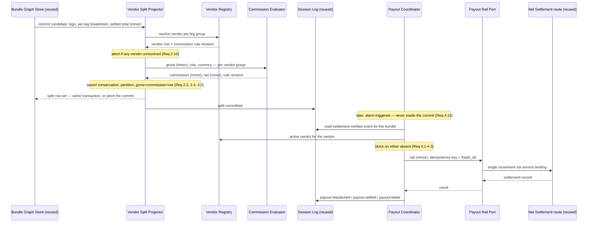

# Design Document

## Overview

This design realises the supply side of the agentic commerce marketplace: a vendor entity with a lifecycle, a commission rule evaluated at split time, a per-`(bundle, vendor)` settlement split written atomically with the bundle commit, an alarm-driven payout dispatcher, and an operator audit surface.

Six new modules-of-responsibility. Zero new dependencies. Zero new infrastructure categories. Zero new external vendors. Four of the six are pure functions or small stores over data this repository already commits; only the dispatcher performs an outward call, and it performs it through a route this repository already owns.

The load-bearing structural decision is ADR-6's: **a vendor split is a projection, not a ledger.** There is exactly one authoritative record of money movement in this platform — the envelope ledger — and this design adds a grouping and an obligation over it rather than a competing copy. Everything else in this document follows from that choice, including why a commission-rule defect can abort a bundle commit (Requirement 2.2) and why the conservation invariant is always-true rather than eventually-true (Requirement 2.3).

## Design Corrections to the Source Addendum

The source addendum was written before this repository's runtime was inspected. Four of its concrete suggestions do not survive contact with the codebase. Each correction is recorded here rather than silently applied, because each changes what "reuse an existing primitive" means.

| Addendum suggested | This design does | Why |
|---|---|---|
| `commission_rules` evaluated by **json-rules-engine** | Hand-rolled deterministic evaluator | The library is not a dependency of this repository, in either workspace. Commission here is a rate over one integer; importing a general evaluator with its own numeric-coercion semantics onto the money path is a poor trade. The repository already has predicate-filter modules in exactly this shape. *(ADR-5, Requirement 7.7)* |
| `vendor` lifecycle enforced by **XState** | Hand-rolled frozen transition table | Not a dependency either. The lifecycle is four states and a handful of edges, and the repository already contains three hand-rolled machines of comparable complexity. A fourth in a different idiom fragments the pattern. *(ADR-5)* |
| `payout_dispatch` triggered from a row insert via a **Cloudflare Queues consumer** | Durable Object alarm plus service-binding dispatch | **No Queues binding exists in any wrangler configuration in this repository.** Deferred and retried work is currently alarm-driven. Adding a Queues binding would be a new infra category across three environments, alongside an async idiom that already works. *(ADR-6, Requirement 4.12)* |
| `payout_dispatch` calls **Stripe Connect Transfers** over `fetch` | Calls the existing in-repo net-settlement route via service binding | This repository already owns a settlement rail on the already-adopted StraitsX / Avalanche path, with a net-settlement store, a route constant, and safe-integer sign-encoded movement validation. A second payout provider is exactly the dependency surface ADR-4 declines. *(ADR-6, Requirement 4.12)* |

One further correction of fact, since it affects where the dispatcher runs: `npm run dev` and `npm run dev:apex` start the Vite dev server only. The worker that answers on port 8787 is the storage worker under `wrangler dev`, whose default port that is — it is not a repository-declared constant, and nothing in this design may hardcode it.

## Architecture

### Module Layout

Placement follows the repository's existing concern-sliced layout under `knowgrph/src/`, and the observed convention of splitting one concern across `-schema` / `-records` / `-state` suffixed files rather than growing a single module.

| Unit | Path | Declared responsibility |
|---|---|---|
| Marketplace contracts | `src/registry/typed-contracts.ts` *(extended)* | Add `VendorId`, `CommissionRuleId`, `SplitId`, `PayoutId`, `CommissionRuleRevisionId` branded primitives and the split/payout interfaces. Type declarations only, no logic *(Req 10.4)* |
| Scope keys | `src/registry/scope-keys.mjs` *(extended)* | Add `vendorKey`, `commissionRuleKey`, `vendorSplitKey`, `payoutKey`, `vendorSettlementCanvasOperatorKey`. Key construction only *(Req 10.5)* |
| Vendor lifecycle | `src/marketplace/vendor-lifecycle-state.mjs` | Frozen transition table; one pure decision per call. No storage, no clock |
| Vendor schema | `src/marketplace/vendor-schema.mjs` | Required-field set, closed enums, violation reason codes |
| Vendor registry | `src/marketplace/vendor-registry.mjs` | One row per supplier; validate-then-write; `active` verdict for dispatch |
| Vendor records | `src/marketplace/vendor-records.mjs` | Row ↔ domain mapping, content hashing |
| Commission schema | `src/commission/commission-rule-schema.mjs` | Flat and tiered rule shapes, tier-boundary validity, revision identity |
| Commission evaluator | `src/commission/commission-evaluator.mjs` | Pure `(grossMinor, rule, currency) → { commissionMinor, netMinor, ruleRevision }` |
| Minor-unit allocation | `src/commission/minor-unit-allocation.mjs` | Largest-remainder integer allocation; no floating point anywhere |
| Split projector | `src/ledger/vendor-split-projector.mjs` | Group per-leg breakdown by vendor; enforce invariants; emit or abort |
| Split records | `src/ledger/vendor-split-records.mjs` | Split row shape, covered-leg encoding, deterministic ordering |
| Payout state | `src/payout/payout-state.mjs` | Frozen payout transition table; terminal-state predicates |
| Payout coordinator | `src/payout/payout-dispatch-coordinator.mjs` | Precondition gate, idempotency key, bounded attempt loop, terminal recording |
| Payout rail port | `src/payout/payout-rail-port.mjs` | Typed port over the in-repo net-settlement route; the only outward-call seam |
| Settlement canvas | `src/marketplace/vendor-settlement-canvas.mjs` | Operator-scoped projection, render, deterministic merge |
| Session log | `src/registry/session-log.mjs` *(extended)* | Add the four new event types and `payoutOrderingVerdict` |
| Marketplace barrel | `src/travel-commerce/marketplace.mjs` | Bounded public surface for tests and workers, matching the existing barrel pattern |
| Migration | `cloudflare/d1/migrations/0016_native_marketplace_settlement.sql` | Vendor, commission rule, split, and payout tables |
| Clean-room scan | `tests/scans/no-foreign-commerce-dependency.test.mjs` | Fail on any Forbidden_Specifier in any manifest or import *(Req 7.8)* |

Every file is one responsibility and stays under 600 lines *(Req 10.1)*. `-schema` / `-records` / `-state` splits exist so that a growing concern splits by owner rather than by line count.

### Component Flow



The vertical position of the `Note over PDC` marker is the whole of ADR-6's second half: everything above it is inside one transaction and is always-true; everything below it is asynchronous, idempotent, and retried under bounds.

## Data Design

### Persistence Split

Three storage layers already exist. This design assigns deliberately rather than defaulting.

| Data | Layer | Reason |
|---|---|---|
| Vendor rows, commission rule rows | **D1** | Low-cardinality, operator-managed, queried across bundles. Migration-versioned schema is the right authority for reference data |
| Split rows | **SQLite Durable Object, same object as the bundle commit** | Requirement 2.1 demands same-transaction write. A D1 write cannot be transactional with a Durable Object commit; putting splits anywhere else makes 2.1 unsatisfiable by construction |
| Payout attempt and terminal state | **SQLite Durable Object with alarm** | Requirement 4.12's alarm trigger and 4.7's per-split idempotency key both want per-split locality |
| Operator canvas projection | **CRDT projection, operator-scoped** | Reuses the existing operator canvas pattern; Requirement 5.4 needs deterministic merge |
| Ordered events | **Existing Session_Log** | Requirement 4.11 forbids a second log |

The split rows living in the Durable Object rather than in D1 is the one place where this design departs from the source addendum's "D1 table, written in the same transaction as the Bundle Graph Store's commit". That phrase is not satisfiable as written — the Bundle Graph Store *is* a SQLite Durable Object, and its transaction is not a D1 transaction. Splits are projected into the D1 marketplace schema asynchronously for reporting, but the **authority** is the Durable Object row, and the reporting projection is explicitly non-authoritative.

### Migration Sketch

`cloudflare/d1/migrations/0016_native_marketplace_settlement.sql`, following the conventions observed in the existing migrations — snake_case, TEXT primary keys, ISO TEXT timestamps, inline CHECK enums, explicit composite UNIQUE, prefixed index names *(Req 10.6)*.

```sql
-- Native marketplace settlement layer.
-- design pattern: per-order settlement split, independently derived against this
-- repository's own bundle-leg and envelope-ledger primitives.

CREATE TABLE IF NOT EXISTS marketplace_vendor (
  vendor_id TEXT PRIMARY KEY,
  display_name TEXT NOT NULL,
  lifecycle_state TEXT NOT NULL
    CHECK (lifecycle_state IN ('pending_review','approved','active','suspended')),
  commission_rule_id TEXT NOT NULL,
  commission_rule_revision TEXT NOT NULL,
  settlement_currency TEXT NOT NULL,
  content_hash TEXT NOT NULL,
  created_at TEXT NOT NULL,
  updated_at TEXT NOT NULL,
  FOREIGN KEY (commission_rule_id) REFERENCES marketplace_commission_rule(commission_rule_id)
);

CREATE TABLE IF NOT EXISTS marketplace_commission_rule (
  commission_rule_id TEXT NOT NULL,
  revision TEXT NOT NULL,
  rule_kind TEXT NOT NULL CHECK (rule_kind IN ('flat','tiered')),
  rule_body TEXT NOT NULL,          -- canonical key-sorted JSON; evaluated, never eval'd
  content_hash TEXT NOT NULL,
  created_at TEXT NOT NULL,
  PRIMARY KEY (commission_rule_id, revision)
);

-- Non-authoritative reporting projection of the Durable Object split rows.
-- The Durable Object row committed with the bundle is the authority (Req 2.1).
CREATE TABLE IF NOT EXISTS marketplace_vendor_split_projection (
  split_id TEXT PRIMARY KEY,
  bundle_id TEXT NOT NULL,
  vendor_id TEXT NOT NULL REFERENCES marketplace_vendor(vendor_id),
  leg_ids TEXT NOT NULL,            -- canonical ascending JSON array of leg identifiers
  settlement_currency TEXT NOT NULL,
  gross_amount_minor INTEGER NOT NULL CHECK (gross_amount_minor > 0),
  commission_amount_minor INTEGER NOT NULL CHECK (commission_amount_minor >= 0),
  net_payout_amount_minor INTEGER NOT NULL CHECK (net_payout_amount_minor >= 0),
  commission_rule_id TEXT NOT NULL,
  commission_rule_revision TEXT NOT NULL,
  projected_at TEXT NOT NULL,
  UNIQUE (bundle_id, vendor_id)
);

CREATE TABLE IF NOT EXISTS marketplace_payout (
  payout_id TEXT PRIMARY KEY,
  split_id TEXT NOT NULL,
  idempotency_key TEXT NOT NULL UNIQUE,
  payout_state TEXT NOT NULL
    CHECK (payout_state IN ('pending','blocked','dispatched','settled','failed')),
  attempt_count INTEGER NOT NULL DEFAULT 0,
  terminal_reason TEXT,
  first_attempt_at TEXT,
  terminal_at TEXT,
  UNIQUE (split_id, payout_state)   -- at most one terminal row per split per state (Req 4.6)
);

CREATE INDEX IF NOT EXISTS idx_marketplace_vendor_lifecycle_state
  ON marketplace_vendor(lifecycle_state);
CREATE INDEX IF NOT EXISTS idx_marketplace_vendor_split_projection_bundle
  ON marketplace_vendor_split_projection(bundle_id);
CREATE INDEX IF NOT EXISTS idx_marketplace_vendor_split_projection_vendor
  ON marketplace_vendor_split_projection(vendor_id);
CREATE INDEX IF NOT EXISTS idx_marketplace_payout_split
  ON marketplace_payout(split_id);
CREATE INDEX IF NOT EXISTS idx_marketplace_payout_state
  ON marketplace_payout(payout_state);
```

Two notes on the CHECK constraints. `gross_amount_minor > 0` mirrors the repository's existing rule that a zero movement is rejected outright rather than treated as a no-op. `net_payout_amount_minor >= 0` allows a fully-commissioned split (net zero) but forbids a negative payout, which is Requirement 3.3 expressed at the storage layer as well as in the evaluator — the constraint is a backstop, not the enforcement point.

The rule body is stored as canonical key-sorted JSON and is **evaluated by the hand-rolled evaluator, never passed to any dynamic code path**. There is no expression language and no `eval` anywhere in this design.

### Scope Keys

Added to the existing `src/registry/scope-keys.mjs`, following its existing shape — `assertNonEmptyString` for internal invariants, `{ ok, value }` results for caller-supplied input *(Req 10.5)*.

```
vendor:<vendor_id>
commission_rule:<commission_rule_id>:<revision>
vendor_split:<bundle_id>:<vendor_id>
payout:<split_id>
vendor_settlement_canvas:operator          -- requires Operator_Scope, else { ok:false, reason:"operator-scope-required" }
```

The canvas key reuses the existing `OPERATOR_SCOPE` guard rather than introducing a second scope check *(Req 5.3)*.

### Session Log Extension

The existing store's closed event set is extended, not replaced *(Req 4.11, 6.5)*.

```
existing: routing · registration-rejected · gate-pass · gate-fail · human-confirm · issuance · fail-closed
added:    vendor-activated · split-committed · payout-dispatched · payout-settled · payout-failed
```

`payout-dispatched`, `payout-settled`, and `payout-failed` join the existing agent-required-identifier rule with a vendor-required-identifier rule: appending one without a non-empty vendor identifier is rejected *(Req 6.5)*. A new `payoutOrderingVerdict(entries, splitId)` sits alongside the existing `paymentOrderingVerdict`, with the same shape — a set of named booleans plus one derived permission flag — returning:

```
{ settlementVerifiedBeforeFirstDispatch, atMostOneSettledPayout, dispatchAllowed }
```

## Component Design

### Vendor Lifecycle State — `src/marketplace/vendor-lifecycle-state.mjs`

A frozen transition table and one pure decision function. First in the build order precisely because it has zero dependencies and is exhaustively testable *(Req 1.4, 1.5)*.

```
pending_review --submit_for_approval--> pending_review    (idempotent no-op, explicit)
pending_review --approve-------------> approved
pending_review --suspend-------------> suspended
approved       --activate------------> active
approved       --suspend-------------> suspended
active         --suspend-------------> suspended
suspended      --reinstate----------> approved            (never straight to active)
```

Everything absent from that table is rejected with `{ ok: false, reason, currentState, requestedTransition }` and leaves stored state unchanged *(Req 1.5)*. Two deliberate shapes: `suspended → approved` rather than `suspended → active`, so reinstating a vendor always passes back through an explicit activation decision *(Req 9.7)*; and no transition out of any state to `pending_review`, so the initial state cannot be re-entered and re-approval is not silently equivalent to first approval.

The table is exhaustive over `states × transitions`, which is what makes Requirement 8.8's error-condition property test total rather than sampled.

### Vendor Registry — `src/marketplace/vendor-registry.mjs`

Validate-then-write, in the repository's violation-collecting idiom *(Req 10.3)*. Three responsibilities and no more: write a validated row, apply a lifecycle-authorised state change, and answer the dispatch verdict.

```
register(candidate)            → { status:"registered", vendorId, contentHash }
                               | { status:"reject", violations:[{ fieldId, reason }] }
transition(vendorId, t, actor) → { status:"transitioned", from, to } | { status:"reject", reason }
dispatchVerdict(vendorId)      → { allowed:true } | { allowed:false, reason }
```

`register` forces `lifecycle_state = 'pending_review'` and ignores any caller-supplied state *(Req 1.3)*. It rejects a candidate whose commission rule reference does not resolve *(Req 1.10)*. `transition` delegates the decision entirely to Vendor Lifecycle State and writes only what that module returned *(Req 1.4)*; it requires an actor reference, so an activation is attributable *(Req 9.7)*. `dispatchVerdict` returns `allowed:true` only for exactly `active`, and returns a distinct reason for each of the other three states so that a blocked payout says *why* *(Req 1.6)*.

`suspended` never deletes or alters existing splits — the freeze in Requirement 1.7 is implemented as the absence of a dispatch permission, not as a mutation.

### Commission Evaluator — `src/commission/commission-evaluator.mjs`

Pure, no storage, no clock, no network *(Req 3.9)*, which is what lets its property tests run with no fixture at all.

```
evaluate({ grossMinor, rule, currency }) →
    { ok:true,  commissionMinor, netMinor, ruleRevision }
  | { ok:false, reason }
```

Arithmetic contract, all integer:

- `grossMinor` must be a safe integer greater than zero; anything else is a typed rejection, never a coercion *(Req 2.8, 3.6)*.
- Flat rate: commission is expressed in basis points, so `commission = floor(gross × bps / 10000)`. Basis points keep the rate itself an integer, which removes the last place a float could enter.
- Tiered rate: tiers are `[{ upToMinor, bps }]` in ascending order with the final tier open-ended. Boundaries are **inclusive of `upToMinor`**, and the schema validator rejects a rule whose tiers overlap or leave a gap, so two adjacent tiers can never both match one gross *(Req 3.7)*.
- `net = gross − commission`. This is the definition, not a second computation, so `gross = commission + net` holds by construction rather than by assertion *(Req 3.2)*. The property test still asserts it, because construction can be refactored and the invariant must survive.
- `0 ≤ commission ≤ gross` and `net ≥ 0` follow from `floor` over a bps rate validated into `[0, 10000]` *(Req 3.3)*.
- An unresolvable, malformed, or out-of-range rule returns a rejection. It never returns zero commission *(Req 3.6)* — a silent zero is a revenue defect that looks like a successful settlement.
- No rate, boundary, or default lives in this module *(Req 3.8)*.

### Minor-Unit Allocation — `src/commission/minor-unit-allocation.mjs`

Split out from the evaluator because it has a different reason to change: the evaluator owns *what the commission is*, this owns *how an integer total divides without leaking a unit*.

```
allocate({ totalMinor, weights }) → { ok:true, shares:[minor] } | { ok:false, reason }
```

Largest-remainder, exactly as Requirement 2.7 defines: floor every proportional share, then hand the remaining units one each to the largest fractional remainders, breaking ties by ascending vendor identifier. Two consequences worth stating:

- `sum(shares) === totalMinor` is guaranteed by construction, which is the mechanism behind Requirement 2.3's zero Residual. Conservation is not checked and corrected; it cannot fail.
- Tie-breaking by identifier rather than by input position is what makes Requirement 8.7's metamorphic property hold — permuting the vendor order cannot change the allocated integers.

Remainders are compared as exact integer cross-products, never as decimals. There is no floating-point operation in this module *(Req 2.8)*.

### Vendor Split Projector — `src/ledger/vendor-split-projector.mjs`

The one genuinely new piece of business logic, and the only module that can abort a bundle commit.

```
project({ bundleId, legBreakdown, settledTotalMinor, currency, vendorLookup, evaluate })
  → { ok:true, splits:[SplitRow] } | { ok:false, reason, violated }
```

Sequence: group legs by vendor → resolve each vendor → allocate gross per group → evaluate commission per group → assemble rows → assert every invariant → return or abort.

Invariants asserted before returning, each one an abort rather than a repair *(Req 2.2)*:

| Invariant | Requirement |
|---|---|
| `sum(gross) === settledTotalMinor`, Residual exactly zero | 2.3 |
| Every bundle leg appears in exactly one split's covered-leg set | 2.4 |
| Exactly one row per `(bundle, vendor)` pair | 2.5 |
| Every amount a safe integer in minor units | 2.8 |
| Every split carries one identical settlement currency | 2.11 |
| Every vendor resolves in the registry | 2.10 |
| `gross = commission + net` per row | 3.2 |

Determinism, which is what Requirement 2.6's idempotence property rests on: vendor groups are ordered by ascending vendor identifier, covered-leg identifiers are stored in ascending order, and allocation ties break by identifier. Given identical inputs, the output is byte-identical including field order.

It emits one `split-committed` event per bundle carrying the bundle identity and split count *(Req 2.9)* — one event per bundle, not per split, because the atomic unit is the Split_Set.

Injecting `vendorLookup` and `evaluate` rather than importing them keeps this module a pure function of its inputs, which is the only reason its invariants can be property-tested without a database.

### Payout State — `src/payout/payout-state.mjs`

A second frozen transition table, same idiom as the vendor lifecycle, separate module because payout state and vendor state have unrelated reasons to change.

```
pending    --block-----> blocked      (precondition absent)
pending    --dispatch--> dispatched
blocked    --dispatch--> dispatched   (precondition later satisfied)
dispatched --settle----> settled      (terminal)
dispatched --fail------> failed       (terminal)
pending    --fail------> failed       (terminal, circuit-breaker tripped)
```

`settled` and `failed` are terminal: no transition leaves either *(Req 4.10)*. `blocked` is deliberately non-terminal, because a blocked payout is waiting on a precondition that may still arrive, whereas a failed one is waiting on an operator.

### Payout Dispatch Coordinator — `src/payout/payout-dispatch-coordinator.mjs`

Precondition gate, idempotency key, bounded attempt loop, terminal recording. Alarm-triggered, never inside the bundle commit *(Req 4.13)*.

```
attempt({ splitId, sessionLog, vendorRegistry, railPort, clock })
  → { state, attemptCount, reason? }
```

Gate order, and it matters — both preconditions are checked before any outward call is prepared:

1. Read the settlement-verified event for the split's bundle from the Session_Log. Absent → `blocked`, reason recorded *(Req 4.1, 4.3)*.
2. Read the vendor dispatch verdict. Not `active` → `blocked`, reason recorded *(Req 4.2, 4.3)*.
3. Read the existing payout row. Already `settled` → return the prior recorded result without an outward call *(Req 4.5)*.
4. Derive the idempotency key deterministically from `split_id` and pass it to the rail port, identically on every retry *(Req 4.7)*.
5. On retryable failure, retry under the bounds already defined for the existing pending queue — five attempts, thirty-second maximum interval — imported from that module rather than re-declared *(Req 4.8)*.
6. Two consecutive attempts with an unchanged recorded result → stop, transition to terminal `failed`, record last observed result and terminal reason, no further automatic attempts *(Req 4.9, 4.10)*.
7. Append the corresponding event to the existing Session_Log at every state change *(Req 4.11)*.

Neither precondition is ever defaulted, inferred, or assumed *(Req 4.3)*. `clock` is injected so the retry-interval and circuit-breaker properties are testable without waiting.

### Payout Rail Port — `src/payout/payout-rail-port.mjs`

The only outward-call seam in this design, isolated into its own module for two reasons: it is the only place a real money movement can originate, and it is the seam a future rail change would touch.

```
dispatch({ netMinor, currency, vendorRef, idempotencyKey })
  → { ok:true, settlementRef } | { ok:false, retryable, reason }
```

Backed by a service binding to the existing in-repo net-settlement route. It performs no arithmetic — the amount arrives already computed and validated. It introduces no external provider *(Req 4.12)*, and it is the module a stub replaces so that no task in this increment issues a real movement *(Req 9.4)*.

### Vendor Settlement Canvas — `src/marketplace/vendor-settlement-canvas.mjs`

Directly parallel to the existing registry canvas: a project function, a render function, and a deterministic merge.

```
projectVendorSettlementCanvas(vendors, payoutPositions, options) → CanvasState
renderVendorSettlementCanvas(state, options)                     → CanvasNode
mergeVendorSettlementStates(left, right)                          → CanvasState
```

Refuses any scope other than `Operator_Scope`, through the existing key guard *(Req 5.3)*. Merge is last-write-wins on content hash with a total ordering, so it is order-independent and idempotent *(Req 5.4)*. Rendering uses the shared Key-Type-Value row contract and semantic elements, at mobile width, without horizontal scrolling *(Req 5.6, 5.7)*. Offline queueing reuses the existing pending queue *(Req 5.5)*.

## Property Obligations

One executable property per stated correctness property, class named, minimum iteration count set, shrinking enabled, using the property-based library already pinned in this repository *(Req 8.3, 8.4)*. Numbering continues the existing `cp-NN` sequence, which currently ends at `cp-13`.

| ID | Property | Class | Requirement |
|---|---|---|---|
| `cp-14-split-conservation` | Sum of split gross equals settled total; Residual exactly zero | invariant | 2.3, 8.5 |
| `cp-15-leg-partition` | Every bundle leg in exactly one split; none duplicated, none dropped | invariant | 2.4, 8.5 |
| `cp-16-commission-decomposition` | `gross = commission + net`; `0 ≤ commission ≤ gross`; `net ≥ 0` | invariant | 3.2, 3.3, 8.5 |
| `cp-17-integer-only-amounts` | No amount is non-integer, unsafe-integer, or float at any boundary | invariant | 2.8, 8.5 |
| `cp-18-split-reprojection-idempotence` | Re-projecting a committed bundle yields a byte-identical Split_Set | idempotence | 2.6, 8.6 |
| `cp-19-payout-dispatch-idempotence` | Repeated dispatch for one `split_id` yields one settled movement and the prior result thereafter | idempotence | 4.5, 4.6, 8.6 |
| `cp-20-allocation-order-invariance` | Permuting vendor input order does not change allocated integers | metamorphic | 2.7, 8.7 |
| `cp-21-vendor-lifecycle-totality` | Every transition absent from the frozen table is rejected and leaves state unchanged | error condition | 1.5, 8.8 |
| `cp-22-settlement-canvas-confluence` | Canvas merge converges identically for any interleaving | confluence | 5.4, 8.9 |
| `cp-23-payout-ordering` | No dispatch attempt precedes the settlement-verified event; no dispatch to a non-`active` vendor | invariant | 4.1, 4.2, 4.4, 1.8 |
| `cp-24-commission-rule-round-trip` | A stored rule revision re-evaluated against a stored gross reproduces the stored commission | round trip | 3.5 |

`cp-14` and `cp-16` deserve a note on why they are still worth writing. Both hold *by construction* in this design — conservation from largest-remainder allocation, decomposition from `net = gross − commission`. A property test over an invariant that cannot currently fail is not redundant: it is the thing that fails when a future refactor replaces the construction with something subtly different. That is the entire argument for property tests on the money path.

## Verification Design

### New Focused Sub-Gate

One new sub-gate, appended to the existing aggregate commerce gate rather than standing up a parallel pipeline *(Req 8.12)*.

```
check:marketplace-settlement
  → node --test
      tests/unit/vendor-lifecycle-state.test.mjs
      tests/unit/vendor-registry.test.mjs
      tests/unit/commission-evaluator.test.mjs
      tests/unit/minor-unit-allocation.test.mjs
      tests/unit/vendor-split-projector.test.mjs
      tests/unit/payout-state.test.mjs
      tests/unit/payout-dispatch-coordinator.test.mjs
      tests/unit/vendor-settlement-canvas.test.mjs
      tests/scans/no-foreign-commerce-dependency.test.mjs
      tests/props/cp-14 … cp-24
      tests/integration/marketplace-wiring.test.mjs
```

`check:agentic-commerce-platform` gains `&& npm run check:marketplace-settlement` as its final clause. Test layout mirrors source one-to-one, as the existing suite does.

### Clean-Room Scan

`tests/scans/no-foreign-commerce-dependency.test.mjs`, in the same shape as the existing `no-schema-retention` scan — a test that asserts the *absence* of a pattern in source.

Fails on: any `@medusajs/` or `@mercurjs/` specifier in any manifest in the repository, including workspace manifests and lockfiles; any import of those namespaces anywhere in source; any dependency named `json-rules-engine` or `xstate`; any hosted Mercur or Medusa hostname in source or configuration *(Req 7.1, 7.4, 7.7, 7.8)*.

This lands **first**, before any component *(Req 7.9)*. The reasoning is in ADR-4's consequences: until a check can fail on a forbidden specifier, the clean-room boundary is a stated intention, and describing it as enforced would be a claim beyond its evidence.

### Deploy Boundary Enforcement

Extends the existing deploy-boundary process test rather than adding a second one. It asserts that no module in this increment references a Prod mirror path or a Cloudflare route, that the payout rail port is the only outward-call site, and that all four new Deploy Boundary rows read `closed` *(Req 9.1, 9.5)*. The rail port being the sole outward seam is what makes that assertion a single-point check rather than a repository-wide grep.

## Requirements Traceability

| Requirement | Design element |
|---|---|
| 1.1–1.3, 1.10 | Vendor Registry `register`; Vendor Schema |
| 1.4, 1.5 | Vendor Lifecycle State frozen table; `cp-21` |
| 1.6–1.8 | `dispatchVerdict`; Coordinator gate step 2; `cp-23` |
| 1.9 | No attestation field in the schema; no compliance vocabulary in canvas rendering |
| 2.1, 2.2 | Split rows in the bundle-commit Durable Object transaction; abort-on-violation |
| 2.3, 2.4 | Projector invariants; `cp-14`, `cp-15` |
| 2.5, 2.6 | Vendor grouping; deterministic ordering; `cp-18` |
| 2.7 | Minor-Unit Allocation largest-remainder; `cp-20` |
| 2.8 | Safe-integer guards; `cp-17` |
| 2.9 | `split-committed` event, one per bundle |
| 2.10, 2.11 | Projector vendor-resolution and single-currency invariants |
| 3.1–3.4, 3.6–3.9 | Commission Evaluator; Commission Rule Schema; `cp-16` |
| 3.5 | `cp-24` round trip; stored rule revision on every split row |
| 4.1–4.4 | Coordinator gate steps 1–2; `payoutOrderingVerdict`; `cp-23` |
| 4.5–4.7 | Coordinator step 3–4; idempotency key; `cp-19` |
| 4.8–4.10 | Bounds imported from the existing pending queue; circuit-breaker; Payout State terminals |
| 4.11 | Session Log extension |
| 4.12, 4.13 | Payout Rail Port over the in-repo net-settlement route; alarm trigger outside the commit |
| 5.1–5.7 | Vendor Settlement Canvas; existing scope guard; existing offline queue; `cp-22` |
| 6.1–6.3 | Split row and payout row field sets; attempt count and terminal reason columns |
| 6.4, 6.5 | Session Log sequence assignment; extended closed event set with vendor-identifier rule |
| 7.1–7.9 | Clean-room scan; hand-rolled evaluator and lifecycle; native vocabulary throughout |
| 8.1–8.13 | Named checks per task; property table; new focused sub-gate |
| 9.1–9.8 | Deploy boundary process test; stubbed rail port; local-only migration |
| 10.1–10.10 | Module layout; branded types in the existing contracts module; keys in the existing scope-key module; migration conventions; hygiene gate |

**Coverage**: every requirement maps to at least one design element; every design element traces to at least one requirement. Zero undesigned criteria, zero ungrounded design elements.
