# Design Document

## Overview

This design hardens and extends the KnowGrph storage and sync layer for a solo-developer, AI-native, zero-infrastructure, browser-based, mobile-first product built on local-first and offline-first principles. It is derived directly from the approved requirements (`requirements.md`) and is grounded in the shipped storage/sync documentation family: the combined Storage & Sync PRD/TAD and its companion, the storage sync ADRs, the storage schemas and their deferred extensions, the spreadsheet storage surface, and the source-files import workflow.

The enhancement is deliberately **non-expansive at the infrastructure layer**. It introduces no new database, no new sync loop, no new conflict UX, and no new deployment target. Every acceptance criterion is satisfiable within local and Dev runtime scope, and the design keeps the shipped D1 baseline (six tables) frozen while treating all authenticated-collaboration, chat-relay, and PostgreSQL material as deferred and gated.

The design covers five hardened areas plus their cross-cutting economics and deployment boundary:

1. **Local-first / offline-first persistence** — durable-write-before-transport, offline retention, bounded reload restore, resilient degradation to the in-memory FS.
2. **Bounded, token-economical sync** — 120s polling, 30s request timeout, bounded exponential backoff, cursor-based delta pull, chunk reuse by content hash, no-op write skipping.
3. **Single-path conflict handling** — stale-base-revision rejection, shared toast/log UX (`ToastHost.tsx`, `HistoryView.tsx`), Keep Local / Accept Remote / Review Log actions, auto-clear of stale outbox entries, and CRDT-backed JSON collaboration.
4. **Path-scoped write authority + save bridge** — `knowgrph-docs` vs `workspace-docs` selection, rejection of `agentic-canvas-os/**` and duplicate seed roots, GitHub-first then D1 then read-back cloud-upload sequencing, credentials confined to the Worker.
5. **Storage schemas + deferred extensions** — composite-key document identity, content-hash dedupe, frozen six-table baseline, browser-local field mapping, 24h `sync_events` TTL, R2-bytes/D1-manifest split for generated artifacts.

Plus **spreadsheet storage over the shared contract**, **source-file import with round-trip parsing**, **token performance/economics**, and the **zero-TCO local/Dev-only deployment boundary**.

This revision adds two KnowGrph-owned engines that extend the same layer without adding infrastructure or cost:

6. **Git-Remote read/write engine (R11)** — a `Git_Engine` that materializes a `Local_Git_Repository` inside the Persisted_Cache and fetches/pushes a `Git_Remote` through the Storage_Worker. It is an **original, KnowGrph-owned implementation inspired by isomorphic-git but sharing no source and adding no external git library as a runtime dependency**. It does not own a new write path: every commit routes through the existing path-scoped Document Write Authority and Save Bridge (R4), conflicts surface through the shared Conflict_UX (R3), offline operations queue in the existing Outbox and drain FIFO, fetched objects reuse the existing Content_Hash dedupe (R9), remote credentials stay Worker-confined, and the whole engine stays inside the zero-TCO local/Dev deployment boundary (R10).
7. **Multi-provider file sync engine (R12)** — a `File_Sync_Engine` that performs bidirectional file/directory synchronization through pluggable `File_Sync_Provider` instances implementing a shared `Provider_Interface`. It is an **original, KnowGrph-owned implementation inspired by rclone but sharing no source and adding no rclone binary or external file-sync library/binary as a runtime dependency**. It reuses the same building blocks: transfers land in the Persisted_Cache under the shared contract, Content_Hash decides transfer-vs-skip (R9), offline transfers queue in the Outbox (capped) and drain FIFO, provider credentials stay Worker-confined, and it never mutates a Cloudflare or Production resource (R10).

Both engines are **inspiration-only additions**: they reuse the save bridge (R4), Conflict_UX (R3), Outbox, Content_Hash dedupe (R9), and deployment boundary (R10) rather than introducing any parallel write path, conflict surface, database, or cost.

### Design Principles

- **Local authority first**: the Persisted_Cache (`knowgrphStorageDb.ts`) is the working store; a durable local write always precedes any remote transport attempt.
- **Bounded everything**: fetch sizes, timeouts, retries, poll intervals, revision retention, and snapshot retention all carry explicit finite limits.
- **One contract, many surfaces**: spreadsheets, imports, and generated artifacts all reuse `knowgrphStorageSyncContract.ts`; no surface owns a private database or sync loop.
- **Path-scoped authority**: repository target is a pure function of the document path, re-derived by the Worker and never trusted blindly from the client.
- **Zero token spend on the sync path**: sync never invokes an LLM; savings come from hash-based dedupe, delta application, and read-first write skipping.
- **Fail closed at the cost boundary**: any operation that would mutate a Cloudflare resource or a Production mirror is rejected; the production default origin cannot be used for a mutating Source_Files action without an explicitly configured local Worker origin.

## Architecture

The enhancement operates entirely within the existing three-layer runtime: the browser client (Persisted_Cache + Client_Sync_Engine + Conflict_UX + Source_Files), the shared contract, and the (locally verifiable) Storage_Worker route surface. No layer is added.

```mermaid
flowchart TB
    subgraph Browser["Browser (any device, mobile-first)"]
        subgraph SF["Source Files + Import"]
            sfIngest["Import_Pipeline<br/>(bounded fetch, round-trip parse)"]
            sfSheet["Spreadsheet_Surface<br/>(graph-row projection)"]
            sfCompose["applyComposedGraphFromSourceFiles()"]
        end
        subgraph Cache["Persisted_Cache — knowgrphStorageDb.ts"]
            docs["documents (documentRevision, isDeleted)"]
            chunks["documentChunks (contentHash)"]
            snaps["graphSnapshots"]
            outbox["syncOutbox (Outbox)"]
            cursor["syncCursor"]
            collabOutbox["collaboration update outbox"]
            gitrepo["Local_Git_Repository<br/>(git objects + refs, Content_Hash)"]
        end
        subgraph GitE["Git_Engine (KnowGrph-owned; no isomorphic-git)"]
            gitClone["clone / fetch (materialize objects)"]
            gitCommit["commit (routes through R4 save bridge)"]
            gitPush["push (via Worker, 30s / 10 MiB, backoff x3)"]
            gitQueue["Outbox enqueue + FIFO drain (Offline only)"]
        end
        subgraph FSyncE["File_Sync_Engine (KnowGrph-owned; no rclone)"]
            provIface["Provider_Interface (list/read/write/delete)"]
            provA["File_Sync_Provider A"]
            provB["File_Sync_Provider B"]
            xfer["Sync_Transfer (bi-directional, hash skip/transfer)"]
            fsQueue["Outbox enqueue (cap 10,000) + FIFO drain"]
        end
        subgraph Engine["Client_Sync_Engine — knowgrphStorageClientSync.ts"]
            enqueue["queue mutation"]
            push["push (30s timeout, backoff x3)"]
            pull["pull (cursor delta, hash reuse)"]
            poll["poll loop (120s, Online only)"]
            autoclear["autoClearStaleOutboxConflicts()"]
        end
        subgraph UX["Conflict_UX (shared)"]
            toast["ToastHost.tsx"]
            log["HistoryView.tsx"]
            actions["Keep Local / Accept Remote / Review Log"]
        end
        subgraph Fallback["Resilience"]
            memfs["in-memory FS degrade"]
        end
    end

    subgraph Contract["Shared contract — knowgrphStorageSyncContract.ts"]
        routes["push / pull / export / doc / collabSave / blob"]
        shapes["KgDocumentRecord / Chunk / GraphSnapshot / Outbox"]
    end

    subgraph Worker["Storage_Worker (contract shape; local/Dev only)"]
        wpush["POST /api/storage/push (base-revision guard)"]
        wpull["POST /api/storage/pull (read-first, no-op skip)"]
        wcollab["POST /api/storage/collab/save (path authority, CAS SHA)"]
        wdoc["GET /api/storage/doc/:ws/:path* (read-back)"]
        wgit["git fetch/push relay (Worker-confined git creds)"]
        wprov["provider relay (Worker-confined provider creds)"]
        subgraph D1["D1 baseline (6 tables, frozen)"]
            t1["workspaces"]
            t2["documents"]
            t3["document_chunks"]
            t4["graph_snapshots"]
            t5["sync_devices"]
            t6["sync_events (24h TTL)"]
        end
        r2["R2 (generated artifact bytes)"]
    end

    sfIngest --> sfCompose --> docs
    sfSheet --> sfCompose
    docs --> enqueue --> outbox
    outbox --> push --> wpush --> t2
    poll --> pull --> wpull
    wpull --> chunks
    pull --> cursor
    wpush -->|conflict ack| toast --> log --> actions
    actions --> autoclear
    push -->|write fail| memfs
    push -->|explicit cloud upload| wcollab --> wdoc
    wcollab -->|artifact| r2

    gitClone --> gitrepo
    gitClone --> wgit
    gitCommit --> wcollab
    gitPush --> wgit
    gitPush -->|remote advanced| toast
    gitQueue --> outbox
    provA --> provIface
    provB --> provIface
    provIface --> xfer
    xfer --> wprov
    xfer --> docs
    fsQueue --> outbox
```



### Git_Engine flow

The `Git_Engine` reads from and writes to a `Local_Git_Repository` (a git object store plus reference set) that it materializes inside the Persisted_Cache. A clone/fetch pulls objects and references through the Storage_Worker's git relay and writes them into the Local_Git_Repository **before** reporting completion; fetched objects whose Content_Hash already exists locally are reused rather than re-fetched. A commit does not write documents directly — it hands each resulting document write to the existing R4 Document Write Authority and Save Bridge (path resolution, `agentic-canvas-os/**` / duplicate-seed rejection, GitHub-first→D1→read-back). A push is relayed through the Storage_Worker, which supplies the `Git_Remote` credentials so no git token ever reaches the browser. All clone/fetch/push operations carry the shared 30s / 10 MiB bounds and, when `Offline only`, queue as `Git_Operation` entries in the Outbox that drain FIFO on transition to `Online`. Remote-advanced push rejections and retry exhaustion surface through the shared Conflict_UX; no git-only conflict surface exists.

### File_Sync_Engine flow

The `File_Sync_Engine` accesses every backend exclusively through a `File_Sync_Provider` implementing the `Provider_Interface` (`list`/`read`/`write`/`delete`). Registering a new provider with a unique id makes it available without touching the engine core. A pull transfer moves provider files into the Persisted_Cache under the shared contract; a push transfer moves cache files to the provider. Each `Sync_Transfer` compares Content_Hash against the destination for the same file key: equal hashes skip the byte transfer and record already-synchronized, differing hashes transfer the bytes. Transfers carry the 30s / 10 MiB bounds; a per-file failure records an isolated error and continues with the remaining files. Offline transfers queue in the Outbox up to a 10,000-entry cap (further requests rejected with a queue-capacity indication) and drain FIFO on `Online`, with bounded backoff x3 on drain failure. Provider credentials stay confined to the Storage_Worker relay, and no transfer mutates a Cloudflare or Production resource.

### As-Is Anchors (already shipped in Dev)

This enhancement builds on capabilities the doc family marks **Resolved / Built in Dev**, and hardens their contracts against the acceptance criteria:

| Capability | Runtime owner | Enhancement focus |
|---|---|---|
| Persisted client working store | `knowgrphStorageDb.ts` | Reload restore ≤3s, per-record-type isolation, revision retention ≥10 |
| Push/pull + 120s polling | `knowgrphStorageClientSync.ts` | 30s timeout, bounded backoff x3, no-op skip, delta apply |
| Auto-clear stale conflicts | `knowgrphStorageClientSync.ts` | Formalized stale rule `serverRevision >= localRevision` |
| Conflict toast + log | `ToastHost.tsx`, `HistoryView.tsx` | Single-path guarantee; no second modal/drawer |
| Path-scoped authority | `documentRepositoryAuthority.ts` | Pure resolver + Worker re-derivation |
| Save bridge | `POST /api/storage/collab/save` | GitHub-first → D1 → read-back sequencing |
| Round-trip import | `sourceFilesIngestIntegration.ts` | Structural round-trip property per format |

### Cross-Cutting Constraints Mapped to Architecture

- **Offline-first (R1, R7)**: `Offline only` mode pauses D1 + PocketBase transport in the Client_Sync_Engine while `knowgrphStorageDb.ts` persistence and the Outbox stay active.
- **Token economics (R9)**: dedupe and no-op skipping live at the contract boundary (chunk-key + content-hash comparison) and in the Worker's read-first `ensure*` guards; the sync path issues zero LLM calls.
- **Deployment boundary (R10)**: a cost-boundary guard in the mutating Source_Files path rejects production-default-origin mutations unless an explicitly configured local Worker origin is present; the same guard applies to every Git_Engine and File_Sync_Engine operation (R11, R12).
- **KnowGrph-owned engines (R11, R12)**: the Git_Engine and File_Sync_Engine are original, inspiration-only implementations (isomorphic-git and rclone respectively) that add no external git/file-sync runtime dependency or binary; they reuse the save bridge (R4), Conflict_UX (R3), Outbox, and Content_Hash dedupe (R9) rather than introducing any parallel write path, conflict surface, database, or cost.

## Components and Interfaces

### 1. Persisted_Cache (`canvas/src/lib/storage/knowgrphStorageDb.ts`)

The bounded browser-local IndexedDB/Dexie store. Owns five collections: `documents`, `documentChunks`, `graphSnapshots`, `syncOutbox`, `syncCursor`, plus the separate collaboration update outbox.

Key responsibilities and interface (conceptual):

```ts
interface PersistedCache {
  // Durable write confirmed before any transport (R1.1)
  putDocument(record: KgDocumentLocalRecord): Promise<DurableWriteResult>
  putChunk(record: KgDocumentChunkLocalRecord): Promise<DurableWriteResult>
  putGraphSnapshot(record: KgGraphSnapshotLocalRecord): Promise<DurableWriteResult>

  // Reload restore, per-record-type isolation (R1.4, R1.9)
  restoreAll(workspaceId: string): Promise<RestoreReport>

  // Bounded revision retention >= 10 per document (R1.6)
  pruneRevisions(documentId: string, keep: number): Promise<void>

  // Outbox durability (R1.2, R2.6)
  enqueueOutbox(entry: KnowgrphStorageOutboxRecord): Promise<void>
  listOutbox(workspaceId: string): Promise<KnowgrphStorageOutboxRecord[]>
  removeOutbox(id: string): Promise<void>

  // Cursor cache (R2.3, R2.6)
  getCursor(workspaceId: string): Promise<string | null>
  setCursor(workspaceId: string, cursor: string): Promise<void>
}

type DurableWriteResult =
  | { status: 'committed' }
  | { status: 'retried-committed' }
  | { status: 'degraded-memory'; reason: 'write-conflict' | 'quota' | 'init-failure' }

type RestoreReport = {
  restored: Array<'documents' | 'documentChunks' | 'graphSnapshots' | 'syncOutbox' | 'syncCursor'>
  failed: Array<{ recordType: string; reason: string }>
}
```

Behavioral contract:
- **R1.1** durable write confirmed before transport: `put*` resolves only after the Dexie transaction commits; the Client_Sync_Engine subscribes to that resolution before enqueueing transport.
- **R1.5** concurrent write conflict: retry once (`isRxConflictError`-style detection) then degrade to memory FS with an observable error indication.
- **R1.6** retain ≥10 most recent revisions per document; store one raw markdown copy per revision; chunks and snapshots as separate records.
- **R1.8** IndexedDB init failure / quota exhaustion → degrade to memory FS, surface error, preserve in-session edits.
- **R1.9** restore isolates failures per record type; unaffected types still restore.
- **R5.5** map `documentRevision`↔`revision` and `isDeleted`↔`deleted` on every read/write across the contract boundary.

### 2. Client_Sync_Engine (`canvas/src/lib/storage/knowgrphStorageClientSync.ts`)

The browser-side sync loop. Bounded harness pattern: max 3 push retries per mutation, 120s poll interval, explicit Online-mode gate.

```ts
interface ClientSyncEngine {
  enqueueAndMaybePush(mutation: KnowgrphStorageMutation, mode: StorageMode): Promise<void>
  pushOutbox(workspaceId: string): Promise<PushCycleResult>   // 30s timeout, backoff x3
  pull(workspaceId: string): Promise<PullResult>              // cursor delta, hash reuse
  startPollLoop(workspaceId: string, mode: StorageMode): PollHandle // 120s, Online only
  autoClearStaleOutboxConflicts(pull: PullResult): Promise<number>
}

type StorageMode = 'online' | 'offline-only'

type PushCycleResult = {
  pushed: number
  conflicts: ConflictSummary[]
  retained: string[]          // outbox ids kept after failure/exhaustion
}

type PullResult = {
  applied: number
  reusedChunks: number        // chunks matched by content hash, zero bytes transferred (R9.2)
  nextCursor: string
  wroteCache: boolean         // false on empty pull (R2.9, R9.6)
}

type BackoffPolicy = {
  baseMs: 1000
  factor: 2
  capMs: 30000
  maxAttempts: 3
}
```

Behavioral contract:
- **R2.1** on autosave boundary in `Online`: enqueue then push within a 30s request timeout.
- **R2.2** remove Outbox entry within the same sync cycle on push success.
- **R2.3 / R2.8** pull requests only records newer than the cursor and applies deltas (not full reload).
- **R2.4** poll loop at exactly 120s while `Online`.
- **R2.5 / R2.10** 5xx and non-5xx transport failures both retry with bounded exponential backoff (base 1s, ×2, cap 30s, max 3 attempts); the Outbox entry is retained.
- **R2.6** pull failure keeps the last cursor and discards no Outbox mutation.
- **R2.7 / R9.2** content-hash chunk reuse: cached chunks are reused, and matching chunks transmit only chunk key + hash reference (zero content bytes).
- **R2.9 / R9.6** empty pull completes with no Persisted_Cache write.
- **R2.11** on retry exhaustion, retain the Outbox entry, surface a failure indication through Conflict_UX, discard nothing.
- **R9.1** no LLM/model-inference call originates from any push/pull operation.

### 3. Conflict_UX (`ToastHost.tsx`, `HistoryView.tsx`, `uiActionRuntime.ts`)

The single shared conflict surface. No storage-only modal/drawer/panel is introduced.

```ts
interface ConflictUx {
  notifyConflict(summary: ConflictSummary): void            // toast within 1s (R3.2)
  runConflictAction(action: ConflictAction, entryId: string): Promise<ConflictActionResult>
}

type ConflictAction = 'keep-local' | 'accept-remote' | 'review-log'

type ConflictSummary = {
  recordId: string
  canonicalPath: string       // conflicts identified by Canonical_Path (R3.2)
  localRevision: number
  serverRevision: number
}
```

Behavioral contract:
- **R3.1** stale-base-revision push is rejected by the Worker; stored server revision preserved; ack identifies record + current server revision.
- **R3.2** conflict surfaced through shared toast + history log within 1s, identified by Canonical_Path, exposing Keep Local / Accept Remote / Review Log.
- **R3.3** pull with `serverRevision >= localOutboxRevision` auto-removes the stale entry without user action.
- **R3.4** non-stale entries retained until user resolution or later successful retry.
- **R3.5** `Keep Local` re-reads the Outbox entry, increments its revision, retries the push.
- **R3.6 / R3.11** `Accept Remote` applies the remote record, aligns local revision, and clears the Outbox entry **only after** the Persisted_Cache write succeeds; if that write fails, the entry is retained unchanged and an error surfaced.
- **R3.7** actions dispatched through the shared action-descriptor runtime; no separate storage UX system.
- **R3.10** a `Keep Local` retry that again returns a conflict retains the entry, re-surfaces the conflict, and does **not** auto-retry without a new user action.

### 4. Document Write Authority + Save Bridge (`documentRepositoryAuthority.ts`, `POST /api/storage/collab/save`)

Pure path→target resolver plus the server-side save bridge.

```ts
type RepositoryTarget = 'knowgrph-docs' | 'workspace-docs'

// Pure function; total over all paths (R4.1–R4.3)
function resolveRepositoryTarget(path: string):
  | { ok: true; target: RepositoryTarget }
  | { ok: false; reason: 'unsupported-path'; path: string }

interface SaveBridge {
  // Explicit Source Files cloud upload sequencing (R4.5–R4.7)
  cloudUpload(req: CloudUploadRequest): Promise<CloudUploadResult>
}

type CloudUploadResult =
  | { status: 'cloud-synced'; commitSha: string; readBackAttempts: number }
  | { status: 'retryable-failure'; stage: 'github' | 'd1' | 'read-back'; attempts: number; retainedText: string }
```

Behavioral contract:
- **R4.1** `knowgrph/docs/**` and `/docs/workspace-seeds/**` → `knowgrph-docs`.
- **R4.2** collaborative workspace paths → `workspace-docs`.
- **R4.3** `agentic-canvas-os/**` and duplicate `huijoohwee/docs/workspace-seeds/**` → reject with unsupported-path response and **no** partial GitHub/D1 write.
- **R4.4** client includes the resolved target; the Worker re-derives the target from the path before selecting repository config.
- **R4.5** cloud upload writes GitHub first, pushes identical text to D1 only after GitHub succeeds, marks cloud-synced only after byte-identical public read-back within ≤3 attempts.
- **R4.6** GitHub write failure → skip D1, keep row in retryable failure state (retain text, surface failure, ≤3 attempts).
- **R4.7** non-byte-identical read-back → stay retryable, never mark cloud-synced.
- **R4.8 / R10.5** repository credentials confined to the Worker; never in browser settings or Persisted_Cache.

### 5. Storage_Schema (contract types + `knowgrphStorageDb.ts` + D1 baseline)

Owns record shapes, the frozen six-table D1 baseline, and browser-local field mapping.

Behavioral contract:
- **R5.1** document identity = composite `(workspaceId, canonicalPath)`; Canonical_Path is non-empty, ≤1024 chars.
- **R5.2** write against an existing `(workspaceId, canonicalPath)` upserts in-place, preserving row identity (no duplicate row).
- **R5.3** content-hash recorded per document revision and per chunk; recomputed when content changes.
- **R5.4** shipped D1 baseline = exactly `{workspaces, documents, document_chunks, graph_snapshots, sync_devices, sync_events}`; no additional tables.
- **R5.6** push prune deletes `sync_events` older than 24h and retains all within the window.
- **R5.7 / R5.10** generated artifact bytes → R2 object; sibling markdown manifest → normal D1 document; if the R2 write fails, the manifest is not persisted (retryable failure).
- **R5.8** missing derivable Content_Hash → reject write, leave existing row unchanged, return missing-hash error.
- **R5.9** write to a table outside the baseline set → reject, return unsupported-table error.

### 6. Schema_Extension (deferred; `knowgrph-storage-schemas-extensions-document.md`)

Gated, spec-complete extension surface. Not runtime-ready.

Behavioral contract:
- **R6.1** authenticated-collaboration, chat-relay, and PostgreSQL material excluded from the shipped D1 baseline.
- **R6.2** an extension missing any of {named Worker owner, applied migration, passing focused test} is neither exposed via an active runtime route nor reported runtime-ready.
- **R6.3** extension D1 tables exclude repository credentials, local mirror paths, and online/offline preferences.
- **R6.4** `serverManaged` relay requested without an explicit allow policy → reject, do not establish, return not-permitted error, retain prior config.
- **R6.5** BYOK key is per-request browser input; never persisted to D1 or Persisted_Cache; discarded after the request.
- **R6.6** PostgreSQL presented as a deferred migration path gated by concurrent multi-user editing, retrieval scale, vector-search need, or tenancy/audit requirements.

### 7. Spreadsheet_Surface (`grph-shared/src/spreadsheet/types.ts`, `graphDataTable.ts`)

Spreadsheet editing over the shared contract; no private database/route/loop.

Behavioral contract:
- **R7.1 / R7.2** persists authored source through the same Source_Files + Storage_Sync contracts; projects shared Graph Data Table rows; no spreadsheet-specific database/route/sync loop.
- **R7.3** `Offline only` retains IndexedDB state + queued mutations under the shared contract; restored after reload.
- **R7.4** spreadsheet domain types stay source-owned in the shared types module.
- **R7.5** never requests repository credentials.
- **R7.6** persist failure → retry once, then degrade to memory FS with an observable error (consistent with R1).

### 8. Import_Pipeline (`sourceFilesIngestIntegration.ts`, `fetchRemoteTextDetailed`, `documentVersioning.ts`)

Bounded, local-first import that composes into the graph with round-trip parsing.

```ts
interface ImportPipeline {
  importLocalFile(file: File): Promise<ImportOutcome>          // <= 10 MiB (R8.3)
  importUrl(url: string): Promise<ImportOutcome>               // 30s + <= 10 MiB (R8.2, R8.11)
  recomposeGraph(): void                                      // applyComposedGraphFromSourceFiles (R8.5, R8.6)
  parseRoundTrip(source: SupportedSource): ParsedResult        // structural identity (R8.8)
  recordVersionSnapshot(documentId: string): void             // <= 50 per doc (R8.10)
}

type ImportOutcome =
  | { status: 'imported'; documentId: string }
  | { status: 'error'; source: string; reason: 'malformed' | 'limit-exceeded' | 'fetch-failure' }

const IMPORT_LIMITS = { urlTimeoutMs: 30000, maxBytes: 10_485_760 }
```

Behavioral contract:
- **R8.1** Source_Files is the canonical ingest surface for text/document/URL sources.
- **R8.2 / R8.3 / R8.11** URL fetch bounded by 30s + 10,485,760 bytes; local import bounded by the same byte max; limit-exceeded records a per-source error and continues.
- **R8.4** `Offline only` preserves previously imported content.
- **R8.5 / R8.6** any Source_Files change (add/remove/clear/toggle/parsed-hash) triggers graph recomposition; empty Source_Files → empty composed graph, no stale rows.
- **R8.7** local file import that changes an existing same-name document upserts the canonical same-name document (no duplicate replacement file).
- **R8.8** parse→print→re-parse is structurally identical (round-trip): preserves every field, value, and element ordering.
- **R8.9 / R8.12** malformed source and unreachable/failed fetch each record a per-source error identifying the source and reason, leave prior imports unchanged, and continue.
- **R8.10** editor save / writeback / GitGraph change records a bounded version snapshot; retain at most the 50 most recent per document, discarding the oldest beyond that.

### 9. Cost-Boundary Guard (mutating Source_Files path; deployment boundary)

Enforces the zero-TCO, local/Dev-only boundary.

Behavioral contract:
- **R10.1 / R10.6** all criteria satisfied in local/Dev scope; any operation that would create/update/delete a Cloudflare resource or write a Production mirror is rejected with no remote modification.
- **R10.2** mutating Source_Files action targeting the production default origin with no configured local Worker origin → reject, preserve local state, surface "configured local Worker origin required".
- **R10.3** with an explicitly configured local Worker origin present, route the mutation to that local origin instead of the production default.
- **R10.4** monthly TCO stays at 0.00 (D1 free tier, FOSS PocketBase + Yjs, Worker free tier); no paid/metered resource beyond free tiers.
- **R10.5** no credentials of any kind stored in browser settings, browser local/session storage, or the Persisted_Cache.

### 10. Git_Engine (KnowGrph-owned git read/write; `Local_Git_Repository` in Persisted_Cache)

An original, KnowGrph-owned git engine inspired by isomorphic-git but sharing no source and adding **no external git library as a runtime dependency**. It maintains a `Local_Git_Repository` (git object store + refs) inside the Persisted_Cache and fetches/pushes a `Git_Remote` through the Storage_Worker. It reuses — never replaces — the R4 save bridge, R3 Conflict_UX, the Outbox, R9 Content_Hash dedupe, and the R10 boundary.

```ts
type GitOperationKind = 'clone' | 'fetch' | 'commit' | 'push'

const GIT_BOUNDS = {
  timeoutMs: 30000,        // R11.9
  maxTransferBytes: 10_485_760, // R11.9
  backoff: { baseMs: 1000, factor: 2, capMs: 30000, maxAttempts: 3 }, // R11.12
}

interface GitEngine {
  // clone/fetch materialize objects+refs into Local_Git_Repository before completion (R11.2, R11.13)
  cloneOrFetch(remote: GitRemoteRef, mode: StorageMode): Promise<GitOperationResult>
  // commit routes every document write through the R4 save bridge; never bypasses it (R11.3, R11.4)
  commit(changes: GitCommitRequest): Promise<GitOperationResult>
  // push relayed through the Worker so the Worker supplies credentials (R11.6, R11.9)
  push(remote: GitRemoteRef, mode: StorageMode): Promise<GitOperationResult>
}

type GitRemoteRef = {
  remoteId: string
  canonicalPathScope: string   // resolved via R4 authority; agentic-canvas-os/** & dup seed rejected (R11.4)
  baseRef: string              // local base reference for fast-forward detection (R11.11)
}

type GitOperationResult =
  | { status: 'complete'; kind: GitOperationKind; objectsReused: number }   // R11.13
  | { status: 'queued'; kind: GitOperationKind; outboxId: string }          // R11.7
  | { status: 'unsupported-path'; path: string }                            // R11.4
  | { status: 'limit-exceeded'; kind: GitOperationKind; outboxId: string }  // R11.10
  | { status: 'conflict'; kind: 'push'; remoteRef: string }                 // R11.11 (via Conflict_UX)
  | { status: 'auth-failure'; kind: GitOperationKind; outboxId: string }    // R11.15 (no credential value)
  | { status: 'retry-exhausted'; kind: GitOperationKind; outboxId: string } // R11.14
```

Behavioral contract:
- **R11.1** KnowGrph-owned; no isomorphic-git or other external git library as a runtime dependency (verified by dependency-audit smoke test).
- **R11.2** clone/fetch materialize fetched objects and references into the Local_Git_Repository within the Persisted_Cache **before** reporting complete.
- **R11.3 / R11.4** commit routes every document write through the R4 Document Write Authority and Save Bridge; a `Git_Operation` targeting `agentic-canvas-os/**` or the duplicate `huijoohwee/docs/workspace-seeds/**` root is rejected with an unsupported-path response and **no** partial write.
- **R11.5 / R11.6** git credentials confined to the Storage_Worker; push is relayed through the Worker which supplies the `Git_Remote` credentials; no git token/key/secret in browser settings, local/session storage, or the Persisted_Cache.
- **R11.7 / R11.8** while `Offline only`, each requested `Git_Operation` enqueues in the Outbox and is retained; on transition to `Online` the queued operations drain FIFO.
- **R11.9 / R11.10** clone/fetch/push bounded by 30s and 10,485,760 bytes; on exceeding a bound the engine aborts, retains the Outbox entry, and surfaces a limit-exceeded indication identifying the `Git_Operation`.
- **R11.11** a push rejected because the remote reference advanced beyond the local base surfaces through the shared Conflict_UX; no separate git-only conflict surface.
- **R11.12 / R11.14** a Worker 5xx or network transport failure retains the Outbox entry and retries with bounded backoff (base 1s, ×2, cap 30s, max 3); on retry exhaustion the entry is retained, a failure surfaces through the shared Conflict_UX, and no `Git_Operation` is discarded.
- **R11.13** a fetched git object whose Content_Hash matches an object already in the Local_Git_Repository is reused; its bytes are not re-fetched.
- **R11.15** if the Worker cannot supply valid credentials or the remote rejects authentication, the operation aborts, the Outbox entry is retained, and an authentication-failure indication surfaces that exposes no credential value.

### 11. File_Sync_Engine / Provider_Interface (KnowGrph-owned multi-provider file sync)

An original, KnowGrph-owned file-sync engine inspired by rclone but sharing no source and adding **no rclone binary or other external file-sync library/binary as a runtime dependency**. It performs bidirectional `Sync_Transfer`s through pluggable `File_Sync_Provider` instances implementing a shared `Provider_Interface`, reusing the Persisted_Cache, Outbox, Content_Hash dedupe (R9), and R10 boundary.

```ts
const SYNC_TRANSFER_BOUNDS = {
  timeoutMs: 30000,             // R12.8
  maxTransferBytes: 10_485_760, // R12.8
  outboxCap: 10_000,            // R12.10, R12.11
  backoff: { baseMs: 1000, factor: 2, capMs: 30000, maxAttempts: 3 }, // R12.12
}

// KnowGrph-owned standard contract every provider implements (R12.2)
interface ProviderInterface {
  readonly providerId: string   // unique registration id (R12.3)
  list(prefix: string): Promise<FileKey[]>
  read(key: FileKey): Promise<{ bytes: Uint8Array; contentHash: string }>
  write(key: FileKey, bytes: Uint8Array, contentHash: string): Promise<void>
  delete(key: FileKey): Promise<void>
}

interface FileSyncEngine {
  registerProvider(provider: ProviderInterface): RegisterResult          // no core change (R12.3)
  pull(providerId: string): Promise<SyncBatchResult>                     // provider -> cache (R12.4)
  push(providerId: string, mode: StorageMode): Promise<SyncBatchResult>  // cache -> provider (R12.5)
}

type RegisterResult =
  | { status: 'registered'; providerId: string }
  | { status: 'duplicate-id'; providerId: string }   // ids must stay unique (R12.3)

type SyncTransferOutcome =
  | { status: 'transferred'; fileKey: string }        // hashes differ (R12.7)
  | { status: 'already-synced'; fileKey: string }      // hashes equal, zero bytes (R12.6)
  | { status: 'queued'; fileKey: string; outboxId: string }  // Offline only (R12.10)
  | { status: 'queue-capacity'; fileKey: string }      // Outbox at 10,000 (R12.11)
  | { status: 'error'; fileKey: string; reason: 'failed' | 'timeout' | 'limit-exceeded' } // R12.9, R12.12

type SyncBatchResult = {
  transferred: number
  skipped: number
  errors: Array<{ fileKey: string; reason: string }>   // per-file isolation, continue (R12.9)
}
```

Behavioral contract:
- **R12.1** KnowGrph-owned; no rclone binary or other external file-sync library/binary as a runtime dependency (verified by dependency-audit smoke test).
- **R12.2 / R12.3** every backend is accessed only through a `File_Sync_Provider` implementing the `Provider_Interface`; registering a provider with a unique id makes it available without modifying the engine core; a duplicate id is rejected.
- **R12.4 / R12.5** pull transfers provider files/directories into the Persisted_Cache under the shared contract; push transfers cache files/directories to the provider.
- **R12.6 / R12.7** a `Sync_Transfer` whose Content_Hash equals the destination's hash for the same file key skips the byte transfer and records already-synchronized; a differing hash transfers the bytes.
- **R12.8** each transfer is bounded by 30s and 10,485,760 bytes.
- **R12.9 / R12.12** a single transfer that fails, times out, or exceeds the byte max records a per-file error identifying the file and reason, leaves already-transferred files unchanged, and continues; a failed drain retries with bounded backoff (base 1s, ×2, cap 30s, max 3) and records a per-file error on final failure.
- **R12.10 / R12.11 / R12.13** while `Offline only`, transfers enqueue in the Outbox up to 10,000 entries and are retained; a request that would exceed 10,000 is rejected with a queue-capacity indication identifying the rejected transfer; on transition to `Online` queued transfers drain FIFO.
- **R12.14** provider credentials confined to the Storage_Worker; no provider token/key/secret in browser settings, local/session storage, or the Persisted_Cache.
- **R12.15 / R12.16** operates within local/Dev scope only; any operation that would create/update/delete a Cloudflare resource or write a Production mirror is rejected with no remote modification.

## Data Models

The enhancement reuses the shipped contract shapes verbatim. They are restated here as the authoritative model surface for this design; no field is added to the D1 baseline.

### Remote Contract Shapes (`knowgrphStorageSyncContract.ts`)

```ts
type KgDocumentRecord = {
  id: string
  workspaceId: string
  canonicalPath: string          // non-empty, <= 1024 chars (R5.1)
  title: string | null
  docType: string | null
  lang: string | null
  graphId: string | null
  sourceKind: 'markdown'
  contentMd: string
  contentHash: string            // required; missing => reject (R5.8)
  parserVersion: string
  revision: number               // maps to local documentRevision (R5.5)
  updatedAtMs: number
  deleted: boolean               // maps to local isDeleted (R5.5)
}

type KgDocumentChunkRecord = {
  id: string
  documentId: string
  workspaceId: string
  chunkKey: string               // semantic key, not byte offset (R9.3)
  chunkOrder: number
  heading: string | null
  markdown: string
  tokenEstimate: number
  contentHash: string            // dedupe/reuse key (R9.2)
  updatedAtMs: number
}

type KgGraphSnapshotRecord = {
  id: string
  documentId: string
  workspaceId: string
  graphRevision: number
  graphHash: string
  graphJson: Record<string, unknown>
  layoutJson: Record<string, unknown> | null
  derivedFromDocumentRevision: number
  updatedAtMs: number
}
```

### Outbox Shapes

```ts
type KnowgrphStorageOutboxRecord = {
  id: string
  workspaceId: string
  deviceId: string
  entity: 'document' | 'documentChunk' | 'graphSnapshot'
  op: 'upsert' | 'delete'
  recordId: string
  baseRevision: number | null    // stale-base-revision conflict check (R3.1)
  payload: Record<string, unknown>
  payloadHash: string
  attemptCount: number           // bounded backoff x3 (R2.5, R2.10)
  lastAckStatus: 'applied' | 'conflict' | 'rejected' | 'deferred' | ''
  lastAckMessage: string | null
  createdAtMs: number
  updatedAtMs: number
}

// Browser-local, separate from D1 sync outbox; durable across reload (R1.2)
type CollaborationUpdateOutboxRecord = {
  updateId: string               // idempotent replay key
  workspaceId: string
  documentKey: string
  provider: 'pocketbase' | 'durable-object'
  clientSeq: number
  updateBase64: string
  attemptCount: number
  acknowledgedAtMs: number | null
  createdAtMs: number
  updatedAtMs: number
}
```

### Git and File-Sync Outbox Shapes (R11, R12)

Both new engines reuse the existing Outbox rather than introducing a new queue; their operations are additional Outbox record variants. The git object store lives entirely inside the Persisted_Cache (`Local_Git_Repository`), and **no new D1 baseline table is added — the six-table baseline (R5.4) stays frozen.**

```ts
// Git_Operation Outbox record: queued while Offline only, drained FIFO on Online (R11.7, R11.8)
type GitOperationOutboxRecord = {
  id: string
  workspaceId: string
  deviceId: string
  entity: 'gitOperation'
  kind: 'clone' | 'fetch' | 'commit' | 'push'
  remoteId: string
  canonicalPathScope: string     // R4-resolved scope; unsupported paths never enqueue (R11.4)
  baseRef: string                // local base reference for remote-advanced detection (R11.11)
  objectHashes: string[]         // Content_Hash set for object reuse on fetch (R11.13)
  attemptCount: number           // bounded backoff x3 (R11.12, R11.14)
  lastStatus: 'queued' | 'complete' | 'limit-exceeded' | 'conflict' | 'auth-failure' | 'retry-exhausted' | ''
  lastMessage: string | null     // never contains a credential value (R11.15)
  enqueuedSeq: number            // FIFO ordering key (R11.8)
  createdAtMs: number
  updatedAtMs: number
}

// Sync_Transfer Outbox record: queued up to 10,000, drained FIFO on Online (R12.10, R12.11, R12.13)
type SyncTransferOutboxRecord = {
  id: string
  workspaceId: string
  deviceId: string
  entity: 'syncTransfer'
  providerId: string             // unique registered provider id (R12.3)
  direction: 'pull' | 'push'     // provider->cache or cache->provider (R12.4, R12.5)
  fileKey: string                // stable file key for hash comparison (R12.6, R12.7)
  contentHash: string            // transfer-skip vs transfer decision (R12.6, R12.7)
  attemptCount: number           // bounded backoff x3 on drain failure (R12.12)
  lastStatus: 'queued' | 'transferred' | 'already-synced' | 'queue-capacity' | 'error' | ''
  lastReason: 'failed' | 'timeout' | 'limit-exceeded' | null  // per-file error reason (R12.9)
  enqueuedSeq: number            // FIFO ordering key (R12.13)
  createdAtMs: number
  updatedAtMs: number
}

// Local_Git_Repository object record: lives in Persisted_Cache, not in D1 (R11.2, R11.13)
type LocalGitObjectRecord = {
  workspaceId: string
  objectId: string               // git object id
  objectType: 'blob' | 'tree' | 'commit' | 'tag'
  contentHash: string            // reuse key: matching hash is not re-fetched (R11.13)
  bytes: Uint8Array
  updatedAtMs: number
}
```

The `Provider_Interface` contract shape (the KnowGrph-owned standard every `File_Sync_Provider` implements) is defined in Component 11 above: `{ providerId, list, read, write, delete }`, with `read`/`write` carrying a `contentHash` so the engine can decide transfer-vs-skip without provider-specific logic.

### Browser-Local Cache Shapes (`knowgrphStorageDb.ts`)

Local field names differ to preserve the existing browser-local contract; the mapping is applied on every contract-boundary crossing (R5.5).

```ts
type KgDocumentLocalRecord = {
  id: string
  workspaceId: string
  canonicalPath: string
  title: string | null
  docType: string | null
  lang: string | null
  graphId: string | null
  sourceKind: 'markdown'
  contentMd: string
  contentHash: string
  parserVersion: string
  documentRevision: number       // remote: revision (R5.5)
  updatedAtMs: number
  isDeleted: boolean             // remote: deleted (R5.5)
}
```

Collections: `documents`, `documentChunks`, `graphSnapshots`, `syncOutbox`, `syncCursor` (+ collaboration update outbox).

### D1 Baseline (frozen — exactly six tables, R5.4)

`workspaces`, `documents`, `document_chunks`, `graph_snapshots`, `sync_devices`, `sync_events`. Composite unique keys: `documents(workspace_id, canonical_path)`, `document_chunks(document_id, chunk_key)`, `graph_snapshots(document_id, graph_revision)`. `sync_events` carries a 24h TTL pruned on push (R5.6).

### Repository Authority Model

```ts
type SourceFilesOwnershipProjection = {
  knowgrphDocs: 'GitHub/knowgrph/docs'
  workspaceDocs: 'GitHub/huijoohwee/docs'
  workspaceSeeds: 'GitHub/knowgrph/docs/workspace-seeds'
  offlineFallback: 'IndexedDB'
}
```

Resolver decision table:

| Path pattern | Target | Result |
|---|---|---|
| `knowgrph/docs/**` | `knowgrph-docs` | accept |
| `/docs/workspace-seeds/**` | `knowgrph-docs` | accept |
| collaborative workspace path | `workspace-docs` | accept |
| `agentic-canvas-os/**` | — | reject (unsupported-path) |
| `huijoohwee/docs/workspace-seeds/**` | — | reject (unsupported-path) |

### Storage Mode + Bounds Constants

```ts
const SYNC_BOUNDS = {
  pushRequestTimeoutMs: 30000,   // R2.1
  pollIntervalMs: 120000,        // R2.4
  backoff: { baseMs: 1000, factor: 2, capMs: 30000, maxAttempts: 3 }, // R2.5, R2.10
  reloadRestoreBudgetMs: 3000,   // R1.4
  minRevisionsRetained: 10,      // R1.6
  maxVersionSnapshots: 50,       // R8.10
  cloudReadBackMaxAttempts: 3,   // R4.5
  syncEventsTtlMs: 24 * 60 * 60 * 1000, // R5.6
}

const IMPORT_LIMITS = {
  urlTimeoutMs: 30000,           // R8.2, R8.11
  maxBytes: 10_485_760,          // R8.2, R8.3, R8.11
}

const WORKSPACE_DEFAULT_ID = 'kgws:canonical-docs' // R1.7
```

## Correctness Properties

*A property is a characteristic or behavior that should hold true across all valid executions of a system — essentially, a formal statement about what the system should do. Properties serve as the bridge between human-readable specifications and machine-verifiable correctness guarantees.*

The properties below were derived from the prework classification of every acceptance criterion, then consolidated to eliminate redundancy (see the reflection notes at the end of each cluster). Each property is universally quantified and traces to the requirement clauses it validates. Properties are grouped by domain for readability; numbering is sequential across the whole document.

### Persistence and Reload

### Property 1: Durable write precedes transport

*For any* sequence of Source_Files changes in `Online` mode, no remote transport call is issued for a change until that change's Persisted_Cache write has durably committed.

**Validates: Requirements 1.1**

### Property 2: Offline retention preserves all local work

*For any* set of local edits and queued mutations, while the Storage_Mode is `Offline only`, the Persisted_Cache and Outbox retain every edit and mutation (nothing is discarded) and zero D1/PocketBase transport calls are made while IndexedDB writes still commit.

**Validates: Requirements 1.2, 1.3, 7.3, 8.4**

### Property 3: Reload restore round-trip

*For any* committed workspace state (documents, chunks, graph snapshots, Outbox, cursor), simulating a browser reload restores each record type to a value equal to its last committed pre-reload value.

**Validates: Requirements 1.4, 7.3**

### Property 4: Restore isolates per-record-type failure

*For any* single record type whose restore fails on reload, all unaffected record types are still restored and the restore report identifies exactly the failed record type.

**Validates: Requirements 1.9**

### Property 5: Revision retention keeps the most recent ten

*For any* sequence of N document revisions, the Persisted_Cache retains exactly the most-recent min(N, 10) revisions, storing one raw markdown copy per revision and chunks and graph snapshots as separate records.

**Validates: Requirements 1.6**

### Sync Behavior and Economics

### Property 6: Enqueue precedes push on autosave

*For any* document mutation at an autosave boundary in `Online` mode, an Outbox entry for that mutation exists before the push is attempted, and the push is issued under a 30-second request timeout.

**Validates: Requirements 2.1**

### Property 7: Successful push clears its Outbox entry in-cycle

*For any* set of Outbox entries whose push is acknowledged as applied, each acknowledged entry is removed within the same sync cycle and no unacknowledged entry is removed.

**Validates: Requirements 2.2**

### Property 8: Cursor-based delta pull

*For any* stored cursor and set of server changes, the pull requests only records newer than the cursor and applies exactly the returned delta records to the Persisted_Cache without reloading a full workspace snapshot.

**Validates: Requirements 2.3, 2.8**

### Property 9: Bounded push backoff and retention

*For any* push failure sequence (Worker 5xx or non-5xx transport failure), retries follow the delay schedule min(1000 × 2^attempt, 30000) ms for at most 3 attempts, the Outbox entry is retained across every retry, and on retry exhaustion the entry is retained, a failure is surfaced through the Conflict_UX, and no mutation is discarded.

**Validates: Requirements 2.5, 2.10, 2.11**

### Property 10: Pull failure preserves cursor and Outbox

*For any* pre-failure state, when a pull request fails the stored cursor is unchanged and no Outbox mutation is discarded.

**Validates: Requirements 2.6**

### Property 11: Empty pull performs no cache write

*For any* stored cursor, when a pull returns no records newer than the cursor the pull completes without issuing any Persisted_Cache or D1 write.

**Validates: Requirements 2.9, 9.6**

### Property 12: Content-hash chunk dedupe

*For any* set of chunks whose Content_Hash matches the hash already held for the same semantic chunk key, the matching chunks are reused from cache and transmit only the chunk key and Content_Hash reference (zero content bytes), while only chunks with differing hashes carry content.

**Validates: Requirements 2.7, 9.2**

### Property 13: Sync path issues no LLM calls

*For any* sequence of push and pull operations, the count of LLM/model-inference calls originating from the sync path is zero.

**Validates: Requirements 9.1**

### Property 14: Chunks are addressed by semantic keys

*For any* set of chunk references produced by the sync path, every reference uses a semantic chunk key and never a byte offset.

**Validates: Requirements 9.3**

### Property 15: Equal document hash reuses stored artifacts

*For any* document revision whose Content_Hash equals the stored revision's hash for the same `(workspaceId, canonicalPath)` pair, the stored raw markdown and graph snapshot are reused without regenerating either artifact.

**Validates: Requirements 9.4**

### Property 16: No-op write skipping

*For any* `documents`, `document_chunks`, or `graph_snapshots` record, writing a record whose every persisted field equals the stored record issues zero D1 writes, and writing a record that differs in at least one field issues exactly one D1 write.

**Validates: Requirements 9.5**

### Conflict Handling

### Property 17: Stale base revision rejected and preserved

*For any* push mutation whose base revision is older than the stored server revision, the Storage_Worker rejects the mutation, leaves the stored server revision unchanged, and returns a conflict acknowledgement identifying the affected record and the current server revision.

**Validates: Requirements 3.1**

### Property 18: Conflicts surface through the single shared path

*For any* conflict acknowledgement, the Conflict_UX surfaces the conflict through the shared toast and history log identified by Canonical_Path and presents the Keep Local, Accept Remote, and Review Log actions.

**Validates: Requirements 3.2**

### Property 19: Stale-conflict auto-clear partition

*For any* Outbox conflict entry, after a pull the entry is automatically removed when the pulled server revision is greater than or equal to the local Outbox revision, and retained otherwise until user resolution or a later successful retry.

**Validates: Requirements 3.3, 3.4**

### Property 20: Keep Local increments and retries, without silent re-retry

*For any* conflicting Outbox entry, selecting Keep Local re-reads the entry, increments its revision by one, and retries the push; if that retry again returns a conflict, the entry is retained and re-surfaced and no further push is attempted without a new user resolution action.

**Validates: Requirements 3.5, 3.10**

### Property 21: Accept Remote converges atomically

*For any* remote record, selecting Accept Remote applies the remote record to the Persisted_Cache, aligns the local revision to the remote server revision, and clears the corresponding Outbox entry only after the Persisted_Cache write succeeds; if that write fails, the Outbox entry is retained unchanged and an error is surfaced.

**Validates: Requirements 3.6, 3.11**

### Property 22: Concurrent JSON requires CRDT state

*For any* JSON document with two or more active collaborators in `Online` mode, edits are routed through CRDT-backed structured controls with the raw JSON editor read-only, and any concurrent JSON save submitted without accompanying CRDT state is rejected with a conflict response.

**Validates: Requirements 3.8, 3.9**

### Write Authority and Save Bridge

### Property 23: Repository authority is a total, re-derived resolver

*For any* document path, the resolver maps `knowgrph/docs/**` and `/docs/workspace-seeds/**` to `knowgrph-docs`, maps collaborative workspace paths to `workspace-docs`, and rejects `agentic-canvas-os/**` and `huijoohwee/docs/workspace-seeds/**` with an unsupported-path response and no partial GitHub or D1 write; the Worker re-derives the target from the path so any mismatched client-supplied target cannot change the outcome.

**Validates: Requirements 4.1, 4.2, 4.3, 4.4**

### Property 24: Cloud upload ordered round-trip

*For any* document text, an explicit Source_Files cloud upload writes GitHub before pushing to D1, pushes to D1 only after GitHub succeeds, and marks the row cloud-synced only after the public document read-back returns byte-identical text within at most 3 read-back attempts.

**Validates: Requirements 4.5**

### Property 25: Credentials never persist in the browser

*For any* browser settings, browser local or session storage, or Persisted_Cache state, no credential of any kind (repository token, provider key, or secret) is present; BYOK keys are per-request browser inputs discarded after the request and the spreadsheet surface never requests repository credentials.

**Validates: Requirements 4.8, 6.5, 7.5, 10.5**

### Storage Schema

### Property 26: Same-key upsert preserves identity

*For any* pair of writes to the same `(workspaceId, canonicalPath)` — including a local same-name file re-import — the write upserts the existing row in place, preserves that row's identity, and never inserts a duplicate row.

**Validates: Requirements 5.2, 8.7**

### Property 27: Content hash is correct and change-sensitive

*For any* document revision or chunk record written with derivable content, the recorded Content_Hash equals the hash of that record's content, and whenever the content changes the Content_Hash is recomputed to a different value.

**Validates: Requirements 5.3**

### Property 28: Browser-local field mapping round-trip

*For any* browser-local record, mapping `documentRevision`/`isDeleted` to the remote `revision`/`deleted` and back reproduces the original local values exactly.

**Validates: Requirements 5.5**

### Property 29: sync_events TTL partition

*For any* set of `sync_events` with varying ages, a push-time prune deletes exactly the entries older than 24 hours and retains exactly the entries within the 24-hour window.

**Validates: Requirements 5.6**

### Property 30: Generated artifacts split bytes and manifest

*For any* generated binary artifact, the artifact bytes are stored as an R2 object and the sibling markdown manifest is stored as a normal D1 document referencing that object; the manifest bytes are never stored in a D1 document's markdown content.

**Validates: Requirements 5.7**

### Schema Extension Gating

### Property 31: Extensions gated on complete readiness

*For any* Schema_Extension, it is exposed through an active runtime route and reported runtime-ready only when it has all of a named Worker owner, an applied migration, and a passing focused test; missing any one leaves it unexposed and not runtime-ready.

**Validates: Requirements 6.2**

### Property 32: Server-managed relay fails closed

*For any* `serverManaged` relay request whose workspace provider policy does not explicitly allow server-managed relay, the request is rejected, the relay is not established, an error indicating server-managed relay is not permitted is returned, and the prior configuration is retained unchanged.

**Validates: Requirements 6.4**

### Import Pipeline

### Property 33: Bounded ingest

*For any* URL source or local file, the ingest is bounded by a maximum of 10,485,760 bytes (and URL fetches additionally by a 30-second timeout); sources exceeding a bound are aborted rather than fully read.

**Validates: Requirements 8.2, 8.3**

### Property 34: Recomposition consistency

*For any* change to Source_Files (add, remove, clear, toggle, or parsed-hash update), a graph recomposition is triggered; and when Source_Files is empty the composed graph is empty with no stale rows retained.

**Validates: Requirements 8.5, 8.6**

### Property 35: Parse round-trip preserves structure

*For any* valid source in a supported format, parsing then printing back to that format and re-parsing produces a result structurally identical to the original parsed result, preserving every field, value, and element ordering.

**Validates: Requirements 8.8**

### Property 36: Per-source error isolation with continuation

*For any* batch of import sources containing malformed, oversize/slow, or unreachable/failed sources, each failing source records a per-source error identifying the source and its failure reason, every prior import is left unchanged, and processing continues with the remaining sources.

**Validates: Requirements 8.9, 8.11, 8.12**

### Property 37: Version snapshot retention keeps the most recent fifty

*For any* sequence of N version-snapshot triggers (editor save, Source_Files writeback, or GitGraph change) for a document, the pipeline retains exactly the most-recent min(N, 50) snapshots, discarding the oldest beyond that limit.

**Validates: Requirements 8.10**

### Deployment and Cost Boundary

### Property 38: Cost boundary rejects remote mutation

*For any* enhancement operation that would create, update, or delete a Cloudflare resource or write to a Production mirror, the operation is rejected and no remote resource is modified.

**Validates: Requirements 10.1, 10.6**

### Property 39: Origin guard for mutating actions

*For any* mutating Source_Files action, when it would target the production default origin and no explicitly configured local Worker origin is present the action is rejected with the local Worker state preserved and an error indicating a configured local Worker origin is required; and when a local Worker origin is configured the mutation is routed to that local origin instead of the production default.

**Validates: Requirements 10.2, 10.3**

### Git-Remote Read/Write Engine

### Property 40: Fetch/clone materializes before completion

*For any* set of git objects and references returned by a Git_Remote, when the Git_Engine clones or fetches, every returned object and reference is present in the Local_Git_Repository within the Persisted_Cache at the moment the operation is reported complete (materialization precedes completion).

**Validates: Requirements 11.2**

### Property 41: Commit routes through the save-bridge authority

*For any* commit change set, every resulting document write is dispatched through the Requirement 4 Document Write Authority and Save Bridge, and no write bypasses or replaces that authority.

**Validates: Requirements 11.3**

### Property 42: Git path-authority rejection

*For any* Git_Operation whose target path is an `agentic-canvas-os/**` path or the duplicate `huijoohwee/docs/workspace-seeds/**` root, the operation is rejected with an unsupported-path response and no partial GitHub, D1, or Local_Git_Repository write occurs.

**Validates: Requirements 11.4**

### Property 43: Git offline queue and FIFO drain durability

*For any* sequence of Git_Operations issued while the Storage_Mode is `Offline only`, every operation is enqueued in the Outbox and retained (nothing discarded), and on transition to `Online` the queued operations drain in exactly first-in-first-out order.

**Validates: Requirements 11.7, 11.8**

### Property 44: Git bounded transfer and limit-exceeded abort

*For any* clone, fetch, or push, an operation within the 30-second and 10,485,760-byte bounds proceeds, and an operation exceeding either bound is aborted with its Outbox entry retained and a limit-exceeded indication that identifies the affected Git_Operation.

**Validates: Requirements 11.9, 11.10**

### Property 45: Git push conflict surfaces through the shared path

*For any* push whose remote reference advanced beyond the local base reference, the conflict is surfaced through the shared Conflict_UX and no separate git-only conflict surface is introduced.

**Validates: Requirements 11.11**

### Property 46: Git bounded backoff and retry-exhaustion retention

*For any* git transport failure sequence (Worker 5xx or network failure), retries follow the delay schedule min(1000 × 2^attempt, 30000) ms for at most 3 attempts with the Outbox entry retained across every retry, and on retry exhaustion the entry is retained, a failure is surfaced through the shared Conflict_UX, and no Git_Operation is discarded.

**Validates: Requirements 11.12, 11.14**

### Property 47: Git object Content_Hash reuse

*For any* fetched git object whose Content_Hash matches an object already held in the Local_Git_Repository, the cached object is reused and its bytes are not re-fetched.

**Validates: Requirements 11.13**

### Property 48: Git auth-failure without credential exposure

*For any* Git_Operation for which the Storage_Worker cannot supply valid credentials or the Git_Remote rejects authentication, the operation is aborted, the Outbox entry is retained, and the surfaced authentication-failure indication contains no credential value.

**Validates: Requirements 11.15**

### Multi-Provider File Sync

### Property 49: Provider registration extensibility with unique ids

*For any* set of File_Sync_Providers registered with unique provider identifiers, each provider becomes available for synchronization without modifying the File_Sync_Engine core, and a registration reusing an existing identifier is rejected.

**Validates: Requirements 12.3**

### Property 50: Bidirectional transfer under the shared contract

*For any* file set, a pull synchronization transfers the provider's files and directories into the Persisted_Cache under the shared Storage_Sync_System contract, and a push synchronization transfers the Persisted_Cache's files and directories to the provider.

**Validates: Requirements 12.4, 12.5**

### Property 51: Content_Hash decides transfer versus skip

*For any* Sync_Transfer, when its Content_Hash equals the destination's Content_Hash for the same file key zero content bytes are transferred and the file is recorded as already-synchronized, and when the hashes differ the file's content bytes are transferred.

**Validates: Requirements 12.6, 12.7**

### Property 52: Bounded transfer with per-file error isolation and continuation

*For any* batch of Sync_Transfers, each transfer is bounded by 30 seconds and 10,485,760 bytes, and any single transfer that fails or exceeds a bound records a per-file error identifying the file and reason, leaves already-transferred files unchanged, and lets processing continue with the remaining files.

**Validates: Requirements 12.8, 12.9**

### Property 53: File-sync offline queue cap and at-capacity rejection

*For any* sequence of Sync_Transfers issued while the Storage_Mode is `Offline only`, entries are enqueued in the Outbox and retained up to a maximum of 10,000, and any request made while the Outbox already holds 10,000 entries is rejected with the existing entries retained and a queue-capacity indication that identifies the rejected transfer.

**Validates: Requirements 12.10, 12.11**

### Property 54: File-sync FIFO drain with drain-failure backoff

*For any* queued Sync_Transfer sequence, on transition to `Online` the transfers drain in exactly first-in-first-out order, and any drain that fails retries following the delay schedule min(1000 × 2^attempt, 30000) ms for at most 3 attempts, recording a per-file error identifying the transfer when the final attempt fails.

**Validates: Requirements 12.12, 12.13**

### Engine Credential Confinement and Cost Boundary

### Property 55: Engine credentials never persist in the browser

*For any* Git_Engine or File_Sync_Engine state, no git or provider credential (token, key, or secret) is present in browser settings, browser local or session storage, or the Persisted_Cache; git pushes and provider transfers are relayed through the Storage_Worker so the Worker alone supplies the credentials.

**Validates: Requirements 11.5, 11.6, 12.14**

### Property 56: Engine operations honor the cost boundary

*For any* Git_Engine or File_Sync_Engine operation that would create, update, or delete a Cloudflare resource or write to a Production mirror, the operation is rejected and no remote resource is modified.

**Validates: Requirements 12.15, 12.16**

### Non-Property Criteria (covered by other test types)

The following criteria are intentionally not property tests. They are covered by example, edge-case, smoke, or configuration-audit tests as noted in the Testing Strategy:

- **Examples**: 1.7 (canonical workspace default), 2.4 (120s poll interval), 3.7 (shared action runtime, no separate surface), 7.2 (Graph Data Table projection, no private store), 8.1 (Source_Files canonical ingest), 10.4 (free-tier TCO audit), 11.6 (git push relayed through the Worker), 12.2 (all backend access flows through a Provider_Interface).
- **Edge cases**: 1.5 (write-conflict retry-then-degrade), 1.8 (init/quota degrade), 3.11 (Accept Remote write-failure arm — also the failure arm of Property 21), 4.6 (GitHub-write-failure arm of upload), 4.7 (non-byte-identical read-back arm), 5.8 (missing hash reject), 5.9 (unsupported-table reject), 5.10 (R2-failure manifest atomicity), 7.6 (spreadsheet persist retry-then-degrade).
- **Smoke / structural**: 5.4 and 6.1 (frozen six-table baseline), 6.3 (extension column exclusions), 6.6 (PostgreSQL deferred gates), 7.4 (source-owned spreadsheet types), 11.1 (no isomorphic-git or other external git library runtime dependency — dependency audit), 12.1 (no rclone binary or other external file-sync library/binary runtime dependency — dependency audit).
- **Validation edge within a property**: 5.1 path non-empty/≤1024 is exercised as the input-domain boundary of Property 26/Property 27 generators plus a dedicated edge-case test.

## Error Handling

Error handling follows the local-first, fail-closed philosophy: local work is never lost, remote failures never corrupt local state, and the cost boundary never leaks.

### Persistence Faults

- **Concurrent write conflict (R1.5)**: detect the conflict class, retry the write exactly once; if the retry fails, degrade to the in-memory file system and surface an observable error indication. This retry-once guard prevents false "persistence unavailable" toasts from transient write races.
- **IndexedDB init failure / quota exhaustion (R1.8)**: degrade to the in-memory file system, surface an observable error, and preserve all in-session edits so the user loses no work in the active session.
- **Partial restore failure (R1.9)**: restore proceeds per record type; a failure in one type never blocks the others, and the restore report names the failed type so the UI can indicate exactly what did not restore.
- **Spreadsheet persist failure (R7.6)**: identical policy to R1.5 — retry once, then degrade to memory FS with an observable error, reusing the shared resilient wrapper rather than a spreadsheet-specific handler.

### Sync and Transport Faults

- **Worker 5xx and non-5xx transport failures (R2.5, R2.10)**: retain the Outbox entry and retry with bounded exponential backoff (base 1s, ×2, cap 30s, max 3 attempts).
- **Retry exhaustion (R2.11)**: retain the entry, surface a failure indication through the Conflict_UX, and discard nothing.
- **Pull failure (R2.6)**: keep the last stored cursor and discard no Outbox mutation, so the next pull resumes cleanly from the same position.

### Conflict Faults

- **Stale base revision (R3.1)**: the Worker rejects, preserves the stored server revision, and returns an informative conflict acknowledgement.
- **Repeated Keep Local conflict (R3.10)**: retain and re-surface; never auto-retry without a fresh user action, preventing infinite conflict loops.
- **Accept Remote write failure (R3.11)**: keep the Outbox entry unchanged and surface an error stating the remote record was not applied, guaranteeing atomicity of the accept-remote transition.
- **Concurrent JSON without CRDT (R3.9)**: the save bridge rejects with a 409 conflict; raw minified JSON is never committed from two clients.

### Save Bridge and Upload Faults

- **GitHub write failure (R4.6)**: skip the D1 push entirely and keep the Source_Files row in a retryable failure state that retains the row text and surfaces a failure indication (≤3 attempts).
- **Non-byte-identical read-back (R4.7)**: keep the row retryable and never mark it cloud-synced.
- **Path authority mismatch (R4.3, R4.4)**: reject with an unsupported-path response and perform no partial GitHub or D1 write.

### Schema and Artifact Faults

- **Missing derivable Content_Hash (R5.8)**: reject the write, leave any existing row unchanged, and return a missing-hash error.
- **Write to a non-baseline table (R5.9)**: reject with an unsupported-table error.
- **R2 artifact write failure (R5.10)**: do not persist the sibling markdown manifest; leave the artifact in a retryable failure state so bytes and manifest never diverge.

### Cost-Boundary Faults

- **Production-default-origin mutation without local Worker origin (R10.2)**: reject, preserve local Source_Files state unmodified, and surface an error requiring a configured local Worker origin.
- **Any Cloudflare-mutation / Prod-mirror-write operation (R10.6, R12.15, R12.16)**: reject with zero remote modification — this applies equally to Git_Engine and File_Sync_Engine operations.

### Git_Engine Faults

- **Transfer limit exceeded (R11.10)**: abort the clone/fetch/push, retain the Outbox entry, and surface a limit-exceeded indication naming the affected Git_Operation; never leave a partially materialized Local_Git_Repository state reported as complete.
- **Push conflict — remote ref advanced (R11.11)**: surface through the shared Conflict_UX (`ToastHost.tsx`, `HistoryView.tsx`); no git-only conflict surface is introduced. The queued Git_Operation is retained until the user resolves.
- **Transport failure and retry exhaustion (R11.12, R11.14)**: retain the Outbox entry, retry with bounded backoff (base 1s, ×2, cap 30s, max 3); on exhaustion retain the entry, surface a failure through the shared Conflict_UX, and discard no Git_Operation.
- **Authentication failure (R11.15)**: abort the operation, retain the Outbox entry, and surface an authentication-failure indication that exposes no credential value (the Worker holds the credential; the browser never sees it).

### File_Sync_Engine Faults

- **Per-file transfer failure / bound exceeded (R12.9)**: record a per-file error identifying the file and reason (`failed` / `timeout` / `limit-exceeded`), leave already-transferred files unchanged, and continue processing the remaining files — the batch is never aborted wholesale for a single file.
- **Outbox at capacity (R12.11)**: reject the new Sync_Transfer, retain the existing 10,000 queued entries unchanged, and surface a queue-capacity indication identifying the rejected transfer.
- **Drain failure (R12.12)**: retry the queued transfer with bounded backoff (base 1s, ×2, cap 30s, max 3), and record a per-file error identifying the transfer when the final attempt fails.

All error indications route through the existing `ToastHost.tsx` and `HistoryView.tsx` surfaces; no error introduces a new UX surface.

## Testing Strategy

The strategy pairs property-based tests (universal invariants across generated inputs) with example, edge-case, and smoke tests (specific scenarios, fault branches, and structural checks). This dual approach is complementary: property tests find general correctness bugs across the input space, while example and edge tests pin concrete behavior and fault handling.

### Property-Based Testing

PBT is appropriate for this feature because its core is pure logic and data transformation: the sync engine's mutation/backoff/dedupe logic, the conflict resolution state machine, the path-authority resolver, the schema field mapping and hashing, and the import round-trip parsing all have clear input/output behavior with large input spaces.

- **Library**: use `fast-check` with the existing Vitest runner (the canvas package is TypeScript/Vitest; `fast-check` is the FOSS standard for property testing there). Do not implement property testing from scratch.
- **Iterations**: configure a minimum of 100 iterations per property test (`{ numRuns: 100 }` or higher).
- **Isolation with mocks**: the Storage_Worker, GitHub, D1, R2, PocketBase, `Git_Remote`, and `File_Sync_Provider` boundaries are all mocked so properties test our logic cheaply and deterministically; no property test performs a real network, Cloudflare, Git_Remote, provider, or Production call (honoring R10). This keeps 100+ iterations cost-free.
- **Tagging**: tag each property test with a comment referencing its design property, using the format:
  `// Feature: knowgrph-storage-sync-enhancement, Property {number}: {property_text}`
- **One test per property**: implement each of Properties 1–56 with a single property-based test.

Generators to build:
- Document/chunk/graph-snapshot record generators (valid `(workspaceId, canonicalPath)` pairs, content strings including non-ASCII and whitespace, content hashes derived from content).
- Canonical_Path generator spanning `knowgrph/docs/**`, `/docs/workspace-seeds/**`, collaborative workspace paths, `agentic-canvas-os/**`, and `huijoohwee/docs/workspace-seeds/**`, plus empty and >1024-char paths for boundary coverage (reused for git path-authority rejection, Property 42).
- Outbox/conflict generators (base vs server revision pairs across the stale/non-stale boundary; extended with git base-ref vs remote-ref pairs across the fast-forward/advanced boundary for Property 45).
- Failure-sequence generators (5xx, network error, timeout) for the backoff properties (reused for git transport failures, Property 46, and file-sync drain failures, Property 54).
- Supported-format source generators (`.md`, `.json`, `.jsonld`, `.csv`, `.yaml/.yml`, `.html`) for the round-trip property, including attributes, nesting, ordering, and special characters.
- Revision/snapshot count generators spanning below and above the retention limits (10 and 50).
- **Git operation sequence generators**: ordered sequences of `Git_Operation`s (clone/fetch/commit/push) with mixed Offline/Online transitions, for the offline-queue + FIFO-drain durability property (Property 43) and the bounded-transfer/limit-exceeded property (Property 44, spanning transfers below and above the 30s / 10,485,760-byte bounds).
- **Git object generators with content hashes**: sets of git objects (blob/tree/commit/tag) with overlapping and distinct Content_Hash values, for the materialization property (Property 40) and the object-reuse property (Property 47).
- **Provider registration generators**: sets of `File_Sync_Provider` registrations with unique and colliding ids, for the registration-extensibility property (Property 49).
- **Transfer batch generators**: batches of `Sync_Transfer`s (pull/push directions, file keys with matching and differing destination Content_Hashes, sizes below and above the byte bound, and injected per-file failures) for the bidirectional-transfer (Property 50), hash-decides-transfer (Property 51), bounded-transfer + per-file-error-isolation (Property 52), offline-queue-cap + at-capacity-rejection (Property 53, spanning below/at/above the 10,000-entry cap), and FIFO-drain (Property 54) properties.
- **Commit change-set generators**: commit change sets whose document writes are observed at the R4 save-bridge boundary, for the commit-authority property (Property 41).

### Example and Edge-Case Testing

- **Examples**: canonical workspace default `kgws:canonical-docs` (1.7), 120s poll interval (2.4), shared-action-runtime dispatch with no separate storage surface (3.7), Graph Data Table projection with no private store/route/loop (7.2), Source_Files as canonical ingest (8.1).
- **Edge cases**: write-conflict retry-then-degrade (1.5), IndexedDB init/quota degrade (1.8), Accept Remote cache-write-failure arm (3.11), GitHub-write-failure upload arm (4.6), non-byte-identical read-back arm (4.7), missing-hash reject (5.8), unsupported-table reject (5.9), R2-failure manifest atomicity (5.10), spreadsheet persist retry-then-degrade (7.6), Canonical_Path empty/over-length rejection (5.1).

### Smoke and Configuration-Audit Testing

- **Schema baseline (5.4, 6.1)**: assert the shipped D1 migration defines exactly `workspaces`, `documents`, `document_chunks`, `graph_snapshots`, `sync_devices`, `sync_events` and no extension tables.
- **Extension column exclusions (6.3)**: assert extension tables carry no credential, mirror-path, or online/offline-preference columns.
- **PostgreSQL deferral (6.6)**: assert the extension doc presents PostgreSQL as deferred behind the four adoption gates.
- **Spreadsheet type ownership (7.4)**: assert spreadsheet domain types are imported from `grph-shared/src/spreadsheet/types.ts`.
- **Free-tier TCO audit (10.4)**: assert configuration provisions only free-tier D1, FOSS PocketBase/Yjs, and free-tier Worker resources.
- **Dependency audit — no external git/file-sync runtime dependency (11.1, 12.1)**: a single smoke/audit test asserts the runtime dependency manifest and module graph contain no `isomorphic-git` (or any other external git library) and no `rclone` binary or other external file-sync library/binary; the `Git_Engine` and `File_Sync_Engine` are KnowGrph-owned with no such runtime dependency.
- **Git push relayed through the Worker (11.6)**: assert a push is dispatched through the Storage_Worker git relay and the browser never holds the git credential.
- **Provider_Interface access boundary (12.2)**: assert the File_Sync_Engine core reaches every backend only through a `Provider_Interface` implementation, with no direct backend call in the engine core.

### Integration Testing (bounded, local/Dev only)

A small set of integration tests (1–3 examples each) exercise the wired push→D1→pull parity path, the collab save bridge, the Git_Engine fetch/commit/push relay, and a File_Sync_Engine pull/push through a mocked provider — all against a **local** Wrangler origin and mocked `Git_Remote`/provider boundaries only, never the production default origin. These verify wiring, not input-varying logic, and stay within the R10 deployment boundary.

### Verification Gate

Before presenting the implementation, run the canvas package's Vitest suite (single-run, e.g. `vitest --run`) and confirm all property, example, edge, and smoke tests pass. Property tests run at ≥100 iterations. No test in this suite performs a Production or Cloudflare-mutating call.
