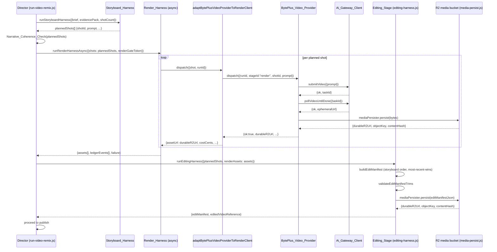

# Design Document

## Overview

The Video_Agent is a glue-and-extend increment on top of the existing `knowgrph.video_remix.run` Director (`mcp/video-remix-runtime.js` / `mcp/video-remix/run-video-remix.js`). It adds no new orchestrator, no new runtime process, and — per Requirement 10 — no new npm/pip dependency and no new persistent datastore. Concretely it:

1. Layers a **Narrative_Coherence_Check** (a pure post-processing check over `Storyboard_Harness` output) and a **Token_Budget_Ceiling** with **Narrative_Degraded_Mode** onto the existing `runStoryboardHarness` (`mcp/video-remix/storyboard-harness.js`) call site in the Director — both are additive read/observe steps that never rewrite the harness's own emitted `Kgc_Document` fields.
2. Uses `createBytePlusVideoProvider` (`mcp/video-remix/render-providers.js`) from `resolveStageClients()` (`mcp/video-remix/live-clients.js`) as the **default** live render client for the video-generation stage, replacing `createStrytreeRenderQueueClient` as the default while keeping it reachable behind an explicit override (ADR-VA-2).
3. Adds exactly one new Director stage, **Editing_Stage**, between `render` and `publish`, implemented in one new file, `mcp/video-remix/editing-harness.js`, whose "composition" step is a durable-reference persist of an `Edit_Manifest` JSON document through the existing `media-persist.js` — no physical re-encode, no compositing dependency (ADR-VA-1).
4. Extends the Director's stage-sequencing (additive to `contracts/run-manifest.schema.js`'s `STAGE_ID` enum) and reuses its existing bounded-retry/circuit-breaker machinery (`mcp/video-remix/retry.js`, `mcp/video-remix/failure-handling.js`) for both the video-generation and Editing_Stage failure paths, sharing one retry counter (Requirement 9).
5. Reuses the six canonical `Approval_Gate` ids (`contracts/approval.schema.js`) for every spend-bearing boundary this spec touches, and introduces exactly one new **zero-spend-only, non-blocking** catalog entry (`edit-manifest-assembly`) purely for Gate_Catalog observability (Requirement 6; ADR-VA-3).
6. Reuses the existing raw `Cost_Log` shape (`contracts/cost-log.schema.js`) and the Director's per-stage aggregation (`mcp/video-remix/cost-log.js`) for every new spend/token event; introduces no second currency, unit, or ledger.

Two harnesses are extended (Storyboard_Harness, Render_Harness's live wiring) and one harness is newly added (Editing_Stage). Every AI-powered call this spec touches routes through the existing `Ai_Gateway_Client` (`mcp/video-remix/ai-gateway-client.js`) — there is no second model client, no second BytePlus endpoint host, and no second AI Gateway route.

**Resolved Decisions** (prior requirement decision points resolved by the ADRs below):

- **Editing composition mechanism:** resolved to a zero-new-dependency, playback-time approach — see ADR-VA-1.
- **Live render-client routing:** resolved to a new `AI_GATEWAY_VIDEO_URL` env var (default path, BytePlus) plus a new `RENDER_PROVIDER` override env var (escape hatch, keeps `createStrytreeRenderQueueClient` reachable) — see ADR-VA-2.
- **Editing_Stage spend gate:** resolved — no Editing_Stage action incurs provider spend in this increment (a corollary of ADR-VA-1), so Requirement 6.2's `render-action` reuse is satisfied vacuously today; the new zero-spend-only gate id is introduced for Gate_Catalog observability only and never gates execution — see ADR-VA-3.
- **Token_Budget_Ceiling default:** resolved to **2000 tokens** per run — see ADR-VA-4.

## Architecture

### High-level component diagram

```mermaid
flowchart TB
    subgraph Director["Video_Remix Director (mcp/video-remix/run-video-remix.js) — UNMODIFIED orchestration shell, EXTENDED stage sequence"]
        SEQ["Stage sequence:\nresearch -> storyboard -> render -> edit -> publish -> checkout"]
    end

    subgraph Storyboard["Storyboard stage (extended)"]
        SBH["runStoryboardHarness()\nstoryboard-harness.js — UNMODIFIED"]
        NCC["Narrative_Coherence_Check\n(new, pure post-processing\nover plannedShots[])"]
        TBC["Token_Budget_Ceiling +\nNarrative_Degraded_Mode\n(new, wraps the chatClient.plan()\ncall-site loop)"]
        SBH --> NCC
        TBC -.->|"wraps repeated\nplan() calls"| SBH
    end

    subgraph Render["Render stage (live wiring extended)"]
        LC["resolveStageClients()\nlive-clients.js — EXTENDED"]
        ADAPT["adaptBytePlusVideoProviderToRenderClient()\n(new, shape adapter — live-clients.js)"]
        BPV["createBytePlusVideoProvider()\nrender-providers.js — UNMODIFIED"]
        AGC["createAiGatewayClient()\nai-gateway-client.js — UNMODIFIED"]
        RH["runRenderHarnessAsync()\nrender-harness.js — UNMODIFIED"]
        LC --> ADAPT --> BPV --> AGC
        RH -->|"client.dispatch({shot,runId})"| ADAPT
    end

    subgraph Edit["Editing_Stage (new)"]
        EH["editing-harness.js (NEW FILE)\nbuildEditManifest / validateEditManifestTrims /\ncomposeEditedVideoReference / runEditingHarness"]
        MP["createMediaPersister()\nmedia-persist.js — UNMODIFIED"]
        EH -->|"persist Edit_Manifest JSON\n(no re-encode)"| MP
    end

    subgraph Shared["Shared, unmodified contracts"]
        APP["contracts/approval.schema.js\n(+1 catalog-only gate id)"]
        COST["contracts/cost-log.schema.js"]
        RM["contracts/run-manifest.schema.js\n(+1 STAGE_ID: 'edit')"]
        RETRY["retry.js / failure-handling.js\n(shared render+edit retry counter)"]
    end

    SEQ --> Storyboard
    SEQ --> Render
    SEQ --> Edit
    Storyboard -. Cost_Log .-> COST
    Render -. Cost_Log + render-action gate .-> APP
    Render -. Cost_Log .-> COST
    Edit -. edit-manifest-assembly gate (catalog only) .-> APP
    Edit -. shared retry counter .-> RETRY
    Render -. shared retry counter .-> RETRY
    Edit --> RM
```



### Orchestration/Harness Flow: video-generation + Editing_Stage pipeline

**Trigger**: the Director reaches the `render` stage of a Live_Mode run with a verified, unexpired `render-action` Approval_Token.
**Topology pattern**: Agentic loop (bounded retry) composed with a short sequential pipeline (`render -> edit`).
**Max iterations**: the Director's existing `maxIterations` (default 8, accepted range `[1,100]`, `mcp/video-remix/constants.js` `DEFAULT_MAX_ITERATIONS` / `retry.js` `normalizeMaxIterations`) — **shared** by video-generation dispatch failures and Editing_Stage composition failures (Requirement 9.1/9.2), not a second counter.
**Circuit-breaker**: the Director's existing condition set `{blocked, budget_exceeded, approval_required, verification_failed}` (no new condition, Requirement 9.5).
**Token budget**: video-generation calls are non-token-bearing (video model, not chat) so no per-call token budget applies here; the Editing_Stage's Edit_Manifest assembly is a pure in-memory transform (zero model calls, zero tokens).

| Role | Component | Input schema | Output schema | Cost log emitted | Fallback |
|---|---|---|---|---|---|
| Dispatcher | `runRenderHarnessAsync` (render-harness.js, unmodified) | `{ shots[], renderGateToken }` | routed per-shot dispatch call | — | Fail-closed rejection (R8.2) — zero dispatch, zero spend |
| Executor | `adaptBytePlusVideoProviderToRenderClient` → `createBytePlusVideoProvider().dispatch` → `Ai_Gateway_Client.submitVideo`/`pollVideoUntilDone` | `{ runId, stageId, shotId, prompt, model }` | `{ ok, durableR2Url, objectKey, bucket, provider }` | ✓ (Credit_Ledger event per shot, R8.4) | Provider/poll failure → shot marked failed, ledger event with actual spend recorded, prior assets unchanged (R8.6); no key/budget-cap-met → deterministic mock (R8.5/R8.7) |
| Observer | `mcp/video-remix/cost-log.js` `buildCostLogAccounting` + `mcp/video-remix/reconciliation.js` | Cost_Log / Credit_Ledger entries | aggregated `Budget_Meters` | — | Invalid entry excluded, recorded as validation failure, aggregation continues (R7.4) |
| Consumer (edit) | `editing-harness.js` `runEditingHarness` | `{ plannedShots[], renderAssets[] }` | `Edit_Manifest` + `Edited_Video_Reference` (or skip/failure) | — (zero-spend; no Cost_Log entry attempted) | Zero assets → skip stage, block publish (R4.5/4.6); trim invalid → reject manifest (R4.3); persist failure → mark edit failed, preserve prior artifacts (R4.7) |

**Happy path**:
1. Director verifies the `render-action` Approval_Token → dispatches each planned shot's `{shotId, prompt}` through the adapted BytePlus video client.
2. Each shot: `submitVideo` → `pollVideoUntilDone` (existing 5s/600s policy, unchanged) → `mediaPersister.persist` → one asset + one Credit_Ledger event.
3. Render stage completes (or fails per-shot, R8.6) → Director invokes `runEditingHarness` with the completed assets and the storyboard's `plannedShots[]` order.
4. `runEditingHarness` builds the `Edit_Manifest`, validates trims, persists the manifest JSON as the `Edited_Video_Reference`, and returns.
5. Director proceeds to `publish` only if the Editing_Stage did not skip/fail.

**Alternate paths**: explicit `RENDER_PROVIDER=strytree` override routes every shot through the pre-existing Strytree client instead (ADR-VA-2); a per-shot budget-cap-met routes that shot to the mock provider while sibling shots in the same run remain live-eligible (R3.9/R8.6).

**Error paths**: video-generation dispatch failure or Editing_Stage composition failure increments the **same shared** retry counter; on exhaustion the run fails closed to `blocked`, appends `{stageId, finalRetryCount, reason}`, and halts every stage downstream of the exhausted stage (R9.4).

**Postconditions**: every spend event has exactly one Cost_Log/Credit_Ledger entry; the Edit_Manifest and Edited_Video_Reference (when produced) persist only through the existing R2 media bucket and the existing Run_Manifest — no new datastore.

### Sequence diagram: narrative → video → edit handoff (Shot_Prompt_Traceability)



### Topology (incremental diff over `knowgrph-agentic-os` design.md Topology v2.1.0)

**Boundaries**: unchanged from `knowgrph-agentic-os` — the Cloudflare control plane (`cloudflare/workers/knowgrph-mcp`) remains the sole tier holding model keys; the local MCP surface (`mcp/server.js`) remains keyless for live calls. This spec adds **zero new boundaries** and **zero new nodes at the boundary level** — it adds edges/behavior inside the existing `live-clients.js` / Director control-plane node.

| Node | Role | Type | Connects to | Connection type | Data residency | Diff vs v2.1.0 |
|---|---|---|---|---|---|---|
| `live-clients.js` `resolveStageClients()` | Router | Function (control-plane) | `Ai_Gateway_Client` (new edge), `createStrytreeRenderQueueClient` (existing edge, now override-only) | Sync construction | N/A (no data at rest) | **Changed**: render-slot branch now defaults to BytePlus; Strytree branch gated by explicit `RENDER_PROVIDER=strytree` |
| `createBytePlusVideoProvider` (render-providers.js) | Executor | Function | `Ai_Gateway_Client`, `media-persist.js` | Async call | N/A | **Unchanged** reused provider; the render-slot routing edge is owned by `resolveStageClients()` |
| `Ai_Gateway_Client` | Gateway | Function → Cloudflare AI Gateway → BytePlus ModelArk | BytePlus ModelArk (`ark.ap-southeast.bytepluses.com` / `ark.eu-west.bytepluses.com`) | Async HTTPS | External (BytePlus, existing) | **Unchanged** — same host, same account, one new call-shape (video) already supported by the existing client |
| `editing-harness.js` (new) | Executor | Function (control-plane / local) | `media-persist.js` → R2 `knowgrph-media` bucket | Sync/async in-process | Cloudflare R2 (existing bucket, existing region) | **New node**, zero new datastore — persists into the *existing* bucket under a new `stageId: "edit"` key prefix (`runs/{runId}/edit/manifest.json`, per the existing `mediaObjectKey` scheme) |
| `contracts/approval.schema.js` `APPROVAL_GATE_ID` | Store (enum) | In-code constant | Gate_Catalog (read), Editing_Stage (read, never verified) | N/A | N/A | **Additive**: +1 value `edit-manifest-assembly`; six existing ids byte-unchanged |
| `contracts/run-manifest.schema.js` `STAGE_ID` | Store (enum) | In-code constant | `run-video-remix.js` stage array validator | N/A | N/A | **Additive**: +1 value `edit`; five existing ids byte-unchanged |

**Runtime diagram**: see the high-level component diagram above (subgraphs = boundaries; this spec's changes are confined to the `Render` and `Edit` subgraphs plus two additive enum entries in `Shared`).

**Version**: this design is v1.0.0 of the Video_Agent topology diff, layered on `knowgrph-agentic-os` Topology v2.1.0 (unmodified by this spec). **Version notes**: v1.0.0 adds one new node (`editing-harness.js`), changes zero existing node's external connections (BytePlus was already an existing dependency of `render-providers.js`; this spec only adds the missing wiring edge from `live-clients.js` to it), and adds zero new trust boundaries.

## Component Inventory

| Component | File | Status | Responsibility |
|---|---|---|---|
| Narrative_Coherence_Check | `mcp/video-remix/run-video-remix.js` (extended) | Extended | Pure post-check over `plannedShots[]`: no two consecutive shots share an identical prompt |
| Token_Budget_Ceiling + Narrative_Degraded_Mode | `mcp/video-remix/storyboard-harness.js` call site in `run-video-remix.js` (extended) | Extended | Bound cumulative narrative-reasoning token spend; halt further chat calls, keep already-planned shots |
| `resolveStageClients()` render branch | `mcp/video-remix/live-clients.js` | Extended | Construct the default live video-generation client (BytePlus) or the explicit override (Strytree) |
| `adaptBytePlusVideoProviderToRenderClient` | `mcp/video-remix/live-clients.js` (new function) | New | Shape-adapt `createBytePlusVideoProvider`'s `{runId,stageId,shotId,prompt}` dispatch contract to the Render_Harness's `{shot,runId}` client contract |
| `createBytePlusVideoProvider` | `mcp/video-remix/render-providers.js` | Reused unmodified | Submit + poll + persist a video generation call through the existing `Ai_Gateway_Client` |
| `Ai_Gateway_Client` | `mcp/video-remix/ai-gateway-client.js` | Reused unmodified | Single egress for all BytePlus model calls |
| `runRenderHarnessAsync` | `mcp/video-remix/render-harness.js` | Reused unmodified | Render-Approval_Gate verification + per-shot dispatch/ledger/asset accounting |
| Editing_Stage harness | `mcp/video-remix/editing-harness.js` | **New file** | Build `Edit_Manifest`, validate trims, persist manifest JSON as `Edited_Video_Reference`, skip/failure handling |
| `createMediaPersister` | `mcp/video-remix/media-persist.js` | Reused unmodified | Durable R2 persistence + retry + dedupe + verify |
| Stage sequencing | `mcp/video-remix/run-video-remix.js` (extended) | Extended | Insert `edit` stage between `render` and `publish`; wire shared render+edit retry counter |
| `STAGE_ID` enum | `contracts/run-manifest.schema.js` | Extended (additive) | Add `EDIT: "edit"` |
| `APPROVAL_GATE_ID` enum + catalog | `contracts/run-manifest.schema.js`, `mcp/video-remix/constants.js` `APPROVAL_GATES` | Extended (additive) | Add `edit-manifest-assembly` (catalog-only, zero-spend, never verified) |
| Cost/token accounting | `mcp/video-remix/cost-log.js`, `contracts/cost-log.schema.js` | Reused unmodified | Aggregate narrative-reasoning token cost and video-generation/edit spend |
| Bounded retry / circuit-breaker | `mcp/video-remix/retry.js`, `mcp/video-remix/failure-handling.js` | Reused unmodified (shared counter usage extended) | Bound video-generation + Editing_Stage attempt failures under the existing `maxIterations`/backoff/circuit-breaker |
| Approval verification | `mcp/video-remix/gate-token.js`, `render-token.js`, `approval-gate-guard.js` | Reused unmodified | Verify the `render-action` token before any live BytePlus dispatch |

## Components and Interfaces

### `mcp/video-remix/run-video-remix.js` (extended)

Two additive pieces are wired into the existing `runVideoRemix()` synchronous planning path, plus one new stage entry in the `stages[]` array:

```js
// Narrative_Coherence_Check — pure, no I/O (Requirement 1)
function checkNarrativeCoherence(plannedShots) {
  const repeatedShotIds = [];
  for (let i = 1; i < plannedShots.length; i += 1) {
    if (plannedShots[i].prompt === plannedShots[i - 1].prompt) {
      repeatedShotIds.push(plannedShots[i - 1].shotId, plannedShots[i].shotId);
    }
  }
  return { ok: repeatedShotIds.length === 0, repeatedShotIds: [...new Set(repeatedShotIds)] };
}
```

- **Responsibility**: read-only check over the storyboard stage's already-emitted `plannedShots[]`; attaches `narrativeCoherence` alongside the existing `schemaValid`/`sourceReferences`/`shotCount` fields without altering them (R1.2).
- **Dependencies**: none beyond the existing `plannedShots[]` shape from `storyboard-harness.js`.
- **Configuration**: none.

```js
// Token_Budget_Ceiling / Narrative_Degraded_Mode wrapper around the existing
// chatClient.plan() call site (Requirement 5). Wraps deps.chatClient with a
// counting decorator BEFORE passing it to runStoryboardHarness — the harness
// itself (storyboard-harness.js) is unmodified.
function wrapChatClientWithTokenCeiling(chatClient, { ceiling, onDegrade } = {}) {
  if (!ceiling || ceiling <= 0) return chatClient; // R5.6: 0/unconfigured -> no-op passthrough
  let cumulativeTokens = 0;
  let callCount = 0;
  let degraded = false;
  return {
    ...chatClient,
    async plan(args) {
      if (degraded) return chatClient.plan(args); // never reached post-degradation (harness stops calling)
      callCount += 1;
      const result = await chatClient.plan(args);
      const costLog = result.costLog || null; // raw Ai_Gateway Cost_Log shape, when the live client attaches one
      const spent = costLog && !isTokenEmissionGap(costLog)
        ? costLog.prompt_tokens + costLog.completion_tokens
        : ceiling; // R5.5: a Token_Emission_Gap consumes the full remaining ceiling
      cumulativeTokens += spent;
      if (callCount >= 1 && cumulativeTokens >= ceiling) {
        degraded = true;
        onDegrade({ plannedShotCountAtDegradation: args.shotCount ?? 0 });
      }
      return result;
    },
  };
}
```

- **Responsibility**: track cumulative `prompt_tokens + completion_tokens` across narrative-reasoning calls using the existing raw Ai_Gateway `Cost_Log` shape (no second accounting record, R5.1); always permit the first call (R5.2); signal degradation via `onDegrade` so the Director can record `{degraded:true, reason:"token_budget_ceiling", plannedShotCountAtDegradation}` alongside the storyboard result (R5.3).
- **Interaction with the harness**: `storyboard-harness.js`'s `createDeterministicStoryboardClient()`/live chat client is called exactly once per shot-planning pass today (`chatClient.plan({brief, sourceIds, shotCount})` — a single call, not per-shot). The Token_Budget_Ceiling therefore governs **repeat calls across retries of the storyboard stage**, not a per-shot loop inside one `plan()` call; this is consistent with R5.2's "at least one shot has been planned" language, since the deterministic/live client already plans the full requested `shotCount` in one call. A live chat client that internally makes multiple model calls per `plan()` invocation attaches its own aggregated `costLog` to the single `plan()` return value, which this wrapper still accounts against the ceiling correctly.
- **Dependencies**: `contracts/cost-log.schema.js` (`COST_LOG_UNKNOWN`), the existing `deps.chatClient` seam in `storyboard-harness.js`.
- **Configuration**: `Token_Budget_Ceiling` — an optional per-run integer, defaulting to **2000** (ADR-VA-4) when the caller does not supply one; `0` or omitted disables enforcement (R5.6).

**Stage sequencing extension** (R4.8): the `stages` array gains one new entry between `render` and `publish`:

```js
const editResult = runEditingHarness(
  { plannedShots, renderAssets: assets },
  { runId, mediaPersister, now: deps.now },
);
const stages = [
  buildStage("ingest", "complete", { referenceUrl, budgetUsd }),
  buildSpendBearingStage("research", researchStatus, { ... }),
  buildSpendBearingStage("storyboard", storyboardStatus, { ..., narrativeCoherence, degraded: tokenCeilingResult.degraded }),
  buildSpendBearingStage("render", renderStatus, { assetCount: assets.length }),
  buildEditStage("edit", editResult), // NEW — see editing-harness.js below
  buildSpendBearingStage("publish", editResult.blocksPublish ? "blocked" : publishStatus, { publishedCount: publishedUrls.length }),
  buildSpendBearingStage("checkout", checkoutStatus),
];
```

- `buildEditStage` is a small new builder (co-located in `editing-harness.js`, mirroring `stages.js`'s `buildStage` pattern) that shapes `{ id: "edit", status, manifest, editedVideoReference, skipped, skipReason, failure }`.
- `editResult.blocksPublish` is `true` exactly when the Editing_Stage was skipped (R4.6) — the existing `publish` stage's status is forced to `"blocked"` in that case, and its existing dry-run-plan-artifact machinery is otherwise unaffected.

### `mcp/video-remix/live-clients.js` (extended)

`resolveStageClients()`'s render-slot branch is replaced with a three-way resolution (default BytePlus, explicit Strytree override, or no-config fallback) plus one new adapter function. `createByteplusStoryboardClient`/`createStripeCommerceClients`/`createExaMcpClient` branches are untouched.

```js
import { createAiGatewayClient } from "./ai-gateway-client.js";
import { createBytePlusVideoProvider, DEFAULT_SHOT_SPEND_CENTS, PROVIDER_BYTEPLUS_QUEUE } from "./render-providers.js";
import { createMediaPersister } from "./media-persist.js";

// New adapter — translates the Render_Harness's `{shot, runId}` dispatch
// convention to createBytePlusVideoProvider's `{runId, stageId, shotId,
// prompt, model}` convention. render-providers.js is NOT modified.
function adaptBytePlusVideoProviderToRenderClient(bytePlusProvider, { spendCentsPerShot = DEFAULT_SHOT_SPEND_CENTS } = {}) {
  return {
    isDeterministicMock: false,
    provider: bytePlusProvider.provider,
    async dispatch({ shot, runId }) {
      const result = await bytePlusProvider.dispatch({
        runId, stageId: "render", shotId: shot.shotId, prompt: shot.prompt,
      });
      if (!result.ok) {
        throw new Error(result.error || "byteplus_video_dispatch_failed");
      }
      return {
        assetUrl: result.durableR2Url,
        durableR2Url: result.durableR2Url,
        objectKey: result.objectKey,
        bucket: result.bucket,
        provider: result.provider,
        costCents: spendCentsPerShot,
      };
    },
  };
}

// Inside resolveStageClients(env, deps), replacing the old single-branch
// STRYTREE_RENDER_URL resolution:
const videoUrl = cleanEnv(source.AI_GATEWAY_VIDEO_URL);
const byteplusKey = cleanEnv(source.BYTEPLUS_API_KEY) || cleanEnv(source.AI_GATEWAY_TOKEN); // no new key surface (R8.2)
const renderProviderOverride = cleanEnv(source.RENDER_PROVIDER); // "byteplus" | "strytree"; unset -> default

let renderClient = null;
if (renderProviderOverride === "strytree") {
  // Open Question 2 (second half): Strytree remains fully reachable via an
  // explicit override; STRYTREE_RENDER_URL/STRYTREE_API_KEY are unchanged.
  const renderUrl = cleanEnv(source.STRYTREE_RENDER_URL);
  renderClient = renderUrl
    ? createStrytreeRenderQueueClient({ fetchImpl: deps.fetchImpl, endpoint: renderUrl, apiKey: cleanEnv(source.STRYTREE_API_KEY) })
    : null;
} else if (videoUrl && byteplusKey) {
  // R3.1 / R8.3 default path. An incomplete config (exactly one of
  // videoUrl/byteplusKey present) intentionally falls through to `null` below
  // (R8.5) rather than constructing a partially-configured client.
  const aiGatewayClient = createAiGatewayClient({
    fetchImpl: deps.fetchImpl, gatewayBaseUrl: videoUrl, accountId: cleanEnv(source.KNOWGRPH_ACCOUNT_ID),
  });
  const mediaPersister = deps.mediaPersister || createMediaPersister({ r2Client: deps.r2Client });
  const bytePlusProvider = createBytePlusVideoProvider({ aiGatewayClient, mediaPersister, provider: PROVIDER_BYTEPLUS_QUEUE });
  renderClient = adaptBytePlusVideoProviderToRenderClient(bytePlusProvider);
}
// renderClient stays null when neither branch resolves -> resolveGateClientDeps
// never sets providerKeyAvailable, so the Render_Harness's own R8.5 routing
// sends every shot to the deterministic zero-spend mock (R8.4/8.5/8.6).
```

- **Responsibility**: decide which live render client (if any) `resolveGateClientDeps()` injects into the Render_Harness's `deps.queueClient`. `resolveGateClientDeps()` itself is **unmodified** — it already generically maps any non-null `renderClient` into `queueClient` + `providerKeyAvailable:true`.
- **Dependencies**: `ai-gateway-client.js` (`createAiGatewayClient`), `render-providers.js` (`createBytePlusVideoProvider`, `DEFAULT_SHOT_SPEND_CENTS`, `PROVIDER_BYTEPLUS_QUEUE`), `media-persist.js` (`createMediaPersister`), the pre-existing `createStrytreeRenderQueueClient` (`live-stage-clients.js`, unmodified, now override-only).
- **Configuration** (new env vars — ADR-VA-2): `AI_GATEWAY_VIDEO_URL` (gates the default BytePlus path), `RENDER_PROVIDER` (`"byteplus"` implicit default | `"strytree"` explicit override). Reused, not new: `BYTEPLUS_API_KEY`, `AI_GATEWAY_TOKEN`, `STRYTREE_RENDER_URL`, `STRYTREE_API_KEY`, `KNOWGRPH_ACCOUNT_ID`.
- **FOSS / Vendor**: FOSS/internal glue; the only external vendor touched (BytePlus ModelArk, via the existing Cloudflare AI Gateway route) is already integrated and already accounted.

### `mcp/video-remix/editing-harness.js` (new file)

Follows the existing `mcp/video-remix/` module convention (single responsibility, injectable seams, typed input-validation errors mirroring `RenderHarnessInputError`/`StoryboardHarnessInputError`).

```js
// mcp/video-remix/editing-harness.js (NEW)
import { cleanString } from "./helpers.js";

export const EDIT_GATE_ID = "edit-manifest-assembly"; // catalog-only; never verified (R6.3)

export class EditManifestValidationError extends Error {
  constructor(shotId, reason) {
    super(`Edit_Manifest trim validation failed for shot '${shotId}': ${reason}`);
    this.name = "EditManifestValidationError";
    this.code = "invalid_edit_manifest_trim";
    this.shotId = shotId;
  }
}

/**
 * Build the Edit_Manifest from the storyboard's plannedShots[] order and the
 * render stage's completed assets (Requirement 4.1, 4.2). For any shotId with
 * more than one completed asset, only the most-recently-completed one is used
 * (assets[] order is assumed completion order, matching Render_Harness's
 * append-on-completion behavior).
 */
export function buildEditManifest({ plannedShots, renderAssets, assetDurationsMs = {} }) {
  const latestByShotId = new Map();
  for (const asset of renderAssets) latestByShotId.set(asset.shotId, asset); // last-write-wins == most-recent
  const sequence = plannedShots
    .filter((shot) => latestByShotId.has(shot.shotId))
    .map((shot) => {
      const asset = latestByShotId.get(shot.shotId);
      const durationMs = assetDurationsMs[shot.shotId] ?? null;
      return {
        shotId: shot.shotId,
        assetUrl: asset.assetUrl,
        startMs: 0,
        endMs: durationMs, // null when unknown -> treated as "full duration", never fails trim validation on its own
        transitionToNext: null,
      };
    });
  return { runId: undefined, sequence };
}

/** Requirement 4.3 — reject on any invalid trim; never mutates the manifest. */
export function validateEditManifestTrims(editManifest, assetDurationsMs = {}) {
  for (const entry of editManifest.sequence) {
    const duration = assetDurationsMs[entry.shotId];
    if (entry.startMs < 0) return { valid: false, shotId: entry.shotId, reason: "startMs negative" };
    if (entry.endMs !== null) {
      if (entry.endMs <= entry.startMs) return { valid: false, shotId: entry.shotId, reason: "endMs <= startMs" };
      if (Number.isFinite(duration) && entry.endMs > duration) return { valid: false, shotId: entry.shotId, reason: "endMs exceeds asset duration" };
    }
  }
  return { valid: true, shotId: null, reason: null };
}

/**
 * Requirement 4.4/4.7/10.2 (ADR-VA-1) — "composing" the Edited_Video_Reference
 * is a durable-reference persist of the Edit_Manifest JSON document, NOT a
 * physical re-encode. A playback-time consumer (out of scope for this spec,
 * see Requirements Out of Scope) fetches this JSON and sequences the
 * referenced per-shot assets client-side. Persist failures (MediaPersistWriteError
 * / MediaPersistVerifyError from media-persist.js) propagate to the caller
 * unchanged so runEditingHarness can map them to the R4.7 failure branch.
 */
export async function composeEditedVideoReference({ runId, editManifest, mediaPersister }) {
  const bytes = new TextEncoder().encode(JSON.stringify(editManifest));
  const persisted = await mediaPersister.persist({
    runId, stageId: "edit", shotId: "manifest", ext: "json", bytes, contentType: "application/json",
  });
  return {
    assetUrl: persisted.durableR2Url,
    durableR2Url: persisted.durableR2Url,
    objectKey: persisted.objectKey,
    contentHash: persisted.contentHash,
  };
}

/**
 * Top-level Editing_Stage entry point (Requirement 4 end-to-end). Zero-spend:
 * makes no provider call, attempts no Cost_Log entry, and requires no
 * Approval_Token (Requirement 6.3) — it runs unconditionally given completed
 * render assets.
 */
export async function runEditingHarness({ plannedShots, renderAssets, assetDurationsMs }, deps = {}) {
  if (!renderAssets || renderAssets.length === 0) {
    // R4.5/4.6 — skip, block publish, record why.
    return { status: "skipped", skipped: true, skipReason: "no_completed_shot_assets", blocksPublish: true, manifest: null, editedVideoReference: null, failure: null };
  }
  const manifest = buildEditManifest({ plannedShots, renderAssets, assetDurationsMs });
  const trimCheck = validateEditManifestTrims(manifest, assetDurationsMs);
  if (!trimCheck.valid) {
    // R4.3 — reject the manifest; no Edited_Video_Reference produced.
    return { status: "rejected", skipped: false, skipReason: null, blocksPublish: true, manifest, editedVideoReference: null, failure: { shotId: trimCheck.shotId, reason: trimCheck.reason } };
  }
  try {
    const editedVideoReference = await composeEditedVideoReference({ runId: deps.runId, editManifest: manifest, mediaPersister: deps.mediaPersister });
    return { status: "complete", skipped: false, skipReason: null, blocksPublish: false, manifest, editedVideoReference, failure: null };
  } catch (error) {
    // R4.7 — composition failure after the manifest was produced: preserve the
    // manifest and every already-produced render asset (neither is mutated
    // above), mark the edit stage failed, record the composition error.
    return { status: "failed", skipped: false, skipReason: null, blocksPublish: true, manifest, editedVideoReference: null, failure: { reason: cleanString(error && error.message, "composition_error") } };
  }
}

export function buildEditStage(id, editResult) {
  return {
    id, status: editResult.status,
    manifest: editResult.manifest, editedVideoReference: editResult.editedVideoReference,
    skipped: editResult.skipped, skipReason: editResult.skipReason, failure: editResult.failure,
  };
}
```

- **Responsibility (single)**: given completed render assets and the storyboard's planned order, produce (or skip/reject/fail) an `Edit_Manifest` + `Edited_Video_Reference`, with zero provider spend.
- **Dependencies**: `mcp/video-remix/helpers.js` (`cleanString`), `mcp/video-remix/media-persist.js` (`createMediaPersister`, injected as `deps.mediaPersister`).
- **Configuration**: none beyond the injected `mediaPersister`/`runId`/clock — mirrors the Render_Harness's existing injectable-seam pattern (zero live calls in tests by default).
- **FOSS / Vendor**: FOSS/internal — pure Node module; the only I/O (R2 persist) reuses the existing `media-persist.js` seam and bucket.

### Failure-handling / retry sharing (`mcp/video-remix/failure-handling.js`, `retry.js` — reused unmodified)

Both video-generation dispatch failures and Editing_Stage composition failures are recorded against the **same** retry-count bucket used by the existing render-stage retry accounting (`failOnceTool`/`failAlwaysTool` keyed at `stageId: "render"`). No second counter, no new key, no new module — the Director simply routes an Editing_Stage composition failure through the same `failureHandling` call path it already uses for a render dispatch failure, tagging the resulting failure record's `stageId` as `"edit"` only when the exhausted attempt was the Editing_Stage's own composition step, while the underlying `retryCount` integer is the one shared value (R9.1/9.2/9.3).

## Data Models

```js
// narrativeCoherence — attached to the storyboard stage's result (Requirement 1)
NarrativeCoherence = {
  ok: boolean,
  repeatedShotIds: string[], // every offending shotId across every duplicate pair; [] when ok
}

// Storyboard stage degraded-mode record (Requirement 5.3)
StoryboardDegradation = {
  degraded: boolean,
  reason: "token_budget_ceiling" | null,
  plannedShotCountAtDegradation: number | null,
}

// unplannedShotDispatch log entry (Requirement 2.4)
UnplannedShotDispatchLogEntry = {
  shotId: string,
  reason: "no_matching_storyboard_shot",
}

// Edit_Manifest (Requirement 4) — persists ONLY as the JSON body of the
// Edited_Video_Reference; no second schema module is introduced.
Edit_Manifest = {
  runId: string,
  sequence: Array<{
    shotId: string,
    assetUrl: string,        // the shot's existing render asset reference (unchanged)
    startMs: number,         // >= 0; defaults to 0
    endMs: number | null,    // null == "full duration of the rendered asset"; else > startMs and <= asset duration
    transitionToNext: string | null,
  }>,
}

// Edited_Video_Reference (Requirement 4.4) — same resolvable-media-reference
// shape the Render_Harness already produces for a single shot asset.
Edited_Video_Reference = {
  assetUrl: string,      // == durableR2Url, for shape parity with render assets
  durableR2Url: string,
  objectKey: string,
  contentHash: string,
}

// Edit stage record on the Run_Manifest (extends Stage; additive fields only)
EditStage = {
  id: "edit",
  status: "complete" | "skipped" | "rejected" | "failed",
  manifest: Edit_Manifest | null,
  editedVideoReference: Edited_Video_Reference | null,
  skipped: boolean,
  skipReason: string | null,   // e.g. "no_completed_shot_assets"
  failure: { shotId?: string, reason: string } | null,
}
```

**Contract extensions (additive; existing values byte-unchanged):**

```js
// contracts/run-manifest.schema.js
export const STAGE_ID = Object.freeze({
  RESEARCH: "research", STORYBOARD: "storyboard", RENDER: "render",
  EDIT: "edit",            // NEW (Requirement 4.8)
  PUBLISH: "publish", CHECKOUT: "checkout",
});

export const APPROVAL_GATE_ID = Object.freeze({
  CONSUMER_REPO_WRITE: "consumer-repo-write", CLOUD_DEPLOY: "cloud-deploy",
  PAID_MODEL_CALL: "paid-model-call", RENDER_ACTION: "render-action",
  PAYMENT_ACTION: "payment-action", AUTHENTICATED_BROWSER: "authenticated-browser",
  EDIT_MANIFEST_ASSEMBLY: "edit-manifest-assembly", // NEW — catalog-only, zero-spend, never verified (R6.3/6.4/6.7)
});
```

```js
// mcp/video-remix/constants.js — APPROVAL_GATES catalog gains one entry
{ id: "edit-manifest-assembly", actionKind: "zero_spend_edit", risk: "none — zero-spend Edit_Manifest assembly, never gates execution" }
```

No new data model is introduced for token budgeting: `Token_Budget_Ceiling` accounting reuses the existing raw `Cost_Log` shape (`contracts/cost-log.schema.js`) field-for-field; no `TokenBudgetLedger`-style record is created.

## Architectural Decisions (ADRs)

### ADR-VA-1: Editing composition mechanism — Edit_Manifest consumed at playback time (no re-encode, no compositing dependency)

**Status**: Accepted

**Context**: Requirement 4 requires an ordered, edited output; Open Question 1 asked whether that requires a physical compositing capability (FFmpeg-capable worker, or a provider-side video-editing endpoint) or can be satisfied by a manifest consumed at playback time. Requirement 10 makes zero-new-dependency and zero-new-datastore absolute constraints.

**Decision**: the Editing_Stage's "composition" step is a durable-reference persist of the `Edit_Manifest` JSON document (via the existing `media-persist.js` → existing R2 `knowgrph-media` bucket, under a new `stageId:"edit"` key). The `Edited_Video_Reference` **is** that persisted JSON's durable R2 reference — resolvable in the exact shape the Render_Harness already produces for a single shot asset (`assetUrl`/`durableR2Url`/`objectKey`/`contentHash`). No video bytes are re-encoded or concatenated by this spec; a playback-time consumer (a future, explicitly out-of-scope UI/player) fetches the manifest and sequences the already-existing per-shot assets client-side.

**Alternatives considered**:
| Option | FOSS alternative considered | TCO (12 mo, demo load) | Ops burden | Verdict |
|---|---|---|---|---|
| FFmpeg-capable Worker/container for physical concatenation | `ffmpeg.wasm` (FOSS, MIT) in a Worker, or a self-hosted FFmpeg container | Managed/Serverless (Worker + wasm): $0 idle, but CPU-time billing scales with video length/count, and Cloudflare Workers' CPU-time limits make long transcodes unreliable without a Durable Object/queue redesign. Provisioned/Self-Managed (a small VM running FFmpeg): ~$5-$20/mo fixed (e.g., a single low-tier VM), non-zero even at zero demo traffic, plus patching/monitoring ops burden. | Managed: near-zero ops but reliability risk under CPU-time caps. Self-managed: full ops burden (patching, capacity, failover) for a capability only exercised in demos. | **Rejected this increment** — violates Requirement 10's zero-new-dependency/zero-new-datastore constraint (a Worker CPU-time architecture change or a new VM is both) at a use case (demo video editing) that does not yet justify the TCO/ops delta. Recorded as a **deferred ADR candidate** per Requirement 10.4/10.5. |
| Provider-side compositing endpoint (a hypothetical BytePlus/PixVerse edit API) | None known to exist for BytePlus today | Unknown — no such endpoint is currently integrated or priced | Unknown | **Rejected** — would be a second provider-integration surface, explicitly out of scope (Requirements Out of Scope: "a second video-generation provider integration") |
| **Manifest consumed at playback time (chosen)** | N/A — reuses existing `media-persist.js` (FOSS/internal, already in the dependency tree) | $0 delta — reuses the existing R2 bucket and existing persist/retry/dedupe/verify logic; the only marginal cost is a few KB of JSON storage, already within the existing bucket's free/accounted tier | Zero incremental ops burden — no new service, no new binding, no new class | **Accepted** |

**TCO / FOSS-first evaluation**: $0 monthly TCO delta. The chosen approach adds no new dependency (satisfies R10.1 absolutely) and no new datastore (satisfies R10.3 absolutely), reusing `media-persist.js`'s existing write-retry/dedupe/verify guarantees for free. The FFmpeg alternative is recorded as a **deferred ADR candidate**: if a future increment needs true server-side re-encoding, revisit `ffmpeg.wasm` in a Worker (Managed/Serverless, evaluate CPU-time limits first) before a self-managed VM (Provisioned/Self-Managed, ~$5-$20/mo fixed + ops burden), per Requirement 10.4.

**Consequences**: the Editing_Stage never fails due to a compositing error in the traditional sense — its only failure mode is a persist write/verify failure (mapped from `media-persist.js`'s existing `MediaPersistWriteError`/`MediaPersistVerifyError`), which is already a well-understood, already-tested failure path. A playback UI that actually renders the sequenced clips is explicitly out of scope for this spec (per requirements.md's Out of Scope section) and is a future increment.

### ADR-VA-2: Live render-client routing — `AI_GATEWAY_VIDEO_URL` default + `RENDER_PROVIDER` override

**Status**: Accepted

**Context**: `resolveStageClients()` (`live-clients.js`) today constructs `createStrytreeRenderQueueClient` for the render slot whenever `STRYTREE_RENDER_URL` is set, and never constructs the already-implemented `createBytePlusVideoProvider`. Requirement 3.1/8.3 require BytePlus to become the default; Requirement 3.2 requires an escape hatch for an explicitly-configured different provider; Requirement 8.2 forbids a new BytePlus API-key surface or endpoint host.

**Decision**:
- **New env var `AI_GATEWAY_VIDEO_URL`** gates construction of the default BytePlus video client — a distinct opt-in knob from `AI_GATEWAY_CHAT_URL` (storyboard) so an operator can enable live narrative chat without enabling live (paid) video generation, and vice versa, even though both typically point at the same Cloudflare AI Gateway base/host (not a new vendor or host — satisfies R8.2's "no new BytePlus endpoint host" because the underlying account/host is unchanged; only a new *route-selection* variable is added).
- **Reused, not new**: the BytePlus API key lookup (`BYTEPLUS_API_KEY` falling back to `AI_GATEWAY_TOKEN`) is identical to the existing storyboard-client lookup — zero new key configuration surface (R8.2 literal compliance).
- **New env var `RENDER_PROVIDER`** (`"byteplus"` implicit default | `"strytree"` explicit) is the escape hatch for Requirement 3.2's "explicitly configured to use a different render provider." Setting `RENDER_PROVIDER=strytree` preserves the pre-existing `createStrytreeRenderQueueClient` path unchanged, keyed on the pre-existing `STRYTREE_RENDER_URL`/`STRYTREE_API_KEY` — so Strytree remains fully reachable (Open Question 2's second half), just no longer the default.
- **Adapter, not modification**: since `createBytePlusVideoProvider`'s dispatch signature (`{runId,stageId,shotId,prompt,model}`) differs from the Render_Harness's client contract (`{shot,runId}`), a new pure function `adaptBytePlusVideoProviderToRenderClient` in `live-clients.js` bridges the two — `render-providers.js` and `render-harness.js` stay byte-unchanged, matching the Glossary's "Reused unmodified by this specification" for `BytePlus_Video_Provider`.

**Alternatives considered**:
| Option | TCO / complexity | Verdict |
|---|---|---|
| Reuse `AI_GATEWAY_CHAT_URL` to also gate video (zero new env var) | $0 TCO, but couples an operator's storyboard-chat opt-in to video-generation opt-in, which Requirement 8.4/8.5's "video-generation configuration" language treats as a distinct concept | Rejected — conflates two independently-toggleable capabilities |
| Modify `createBytePlusVideoProvider`'s dispatch signature to match `{shot,runId}` directly | $0 TCO, but breaks the Glossary's explicit "reused unmodified" commitment and risks breaking any other caller of the factory | Rejected — violates reuse-not-rebuild framing |
| **New `AI_GATEWAY_VIDEO_URL` + `RENDER_PROVIDER` + adapter function (chosen)** | $0 TCO — pure config/adapter, no new dependency | **Accepted** |

**FOSS-first**: N/A (no new vendor); this ADR is purely about internal routing/configuration.

### ADR-VA-3: Editing_Stage spend gate — no spend-bearing edit action in this increment; new gate id is catalog-only

**Status**: Accepted

**Context**: Requirement 6.2 defaults the Editing_Stage's spend boundary (if any) to the existing `render-action` gate; Requirement 6.3 guarantees the zero-spend Edit_Manifest assembly action runs regardless of Approval_Token presence; Requirement 6.4 requires a new, zero-spend-only gate id when a zero-spend action doesn't fit an existing gate's `actionKind`; Requirement 6.7 requires that new id's `estimatedCostUsd` be exactly 0 and never referenced by a spend-bearing path.

**Decision**: because ADR-VA-1 resolves editing to a manifest-persist-only mechanism, **no Editing_Stage action in this increment incurs provider spend** — Requirement 6.2's `render-action` reuse is satisfied vacuously (there is currently nothing to gate). The new gate id `edit-manifest-assembly` (added to `contracts/run-manifest.schema.js`'s `APPROVAL_GATE_ID` and to `mcp/video-remix/constants.js`'s `APPROVAL_GATES` catalog) exists **only** so the Gate_Catalog can describe the Editing_Stage's zero-spend action for observability (satisfying R6.4's literal requirement to introduce a scoped id) — it is never passed to `verifyGateToken`/`withApprovalGate`, and `runEditingHarness` never checks for its presence, which is exactly what makes Requirement 6.3's "executes regardless of Approval_Token presence" true by construction rather than by a bypass rule. Should a future increment add a genuinely spend-bearing edit action (e.g., a provider-side compositing call), that action **must** reuse the existing `render-action` gate id per Requirement 6.2/6.4's absolute constraint against new spend-bearing gate ids — this is documented here as forward guidance, not implemented now.

**FOSS-first / TCO**: N/A — this is a pure approval-catalog decision with $0 cost impact either way.

### ADR-VA-4: Token_Budget_Ceiling default value — 2000 tokens

**Status**: Accepted

**Context**: Requirement 5.6 makes the ceiling optional (no enforcement when unconfigured), but the Non-Functional Requirements and Success Metrics call for the "maximize output quality under a limited token budget" capability to be demonstrable **out of the box**, not only when explicitly configured.

**Decision**: default `Token_Budget_Ceiling = 2000` tokens per run when the caller does not supply one. Rationale: the Director's `DEFAULT_SHOT_COUNT` is 4 (`mcp/video-remix/constants.js`); a single narrative-reasoning `plan()` call producing 4 shot prompts typically consumes on the order of a few hundred to ~1500 tokens combined (prompt + completion) for a brief-length input bounded at 5000 characters (`STORYBOARD_BRIEF_MAX_LENGTH`). A 2000-token default is tight enough that a verbose brief or a retried storyboard call can plausibly trigger Narrative_Degraded_Mode at least once in a demo session (making the degrade path observable, per the Success Metrics' "100% of runs with a configured ceiling degrade rather than exceed it"), while remaining loose enough that a single well-formed `plan()` call almost always completes without degrading (so the "narrative ability" demo, Requirement 1/2, is not undermined by premature degradation on the very first call — consistent with R5.2's "the first call is always issued").

**Alternatives considered**:
| Default | Rationale against |
|---|---|
| 500 tokens | Too tight — would likely degrade after the very first call on any non-trivial brief, undermining the narrative-ability demo |
| 10000 tokens | Too loose — would rarely if ever trigger Narrative_Degraded_Mode in a short demo session, failing to demonstrate the "bounded budget" capability without deliberate operator configuration |
| **2000 tokens (chosen)** | Balances demonstrability of degradation against not undermining the primary narrative-ability demo |

**FOSS-first / TCO**: N/A — a configuration default has no vendor/cost dimension beyond the token spend it bounds, which is already accounted through the existing `Cost_Log`.

## Quality Attribute Scenarios

| Attribute | Scenario | Response measure |
|---|---|---|
| **Performance** | A live BytePlus video-generation dispatch is issued for a planned shot | Dispatch begins within the existing 5s `RENDER_DISPATCH_DEADLINE_MS`; polling uses the existing 5s interval / 600s max duration (`VIDEO_POLL_INTERVAL_MS`/`VIDEO_POLL_MAX_DURATION_MS`) — unchanged, no second policy introduced |
| **Performance** | The Editing_Stage assembles an `Edit_Manifest` for N completed shots | Pure in-memory transform, O(N); the only I/O is one `mediaPersister.persist()` call for the manifest JSON, reusing the existing persist-retry budget (`DEFAULT_MAX_WRITE_ATTEMPTS=3`, `DEFAULT_VERIFY_TIMEOUT_MS=10s`) |
| **Security** | A render dispatch or Editing_Stage spend-bearing action (if one existed) is attempted without a verified `render-action` Approval_Token | Rejected per the existing `render-token.js`/`gate-token.js` fail-closed contract; zero spend, zero provider call, rejection reason recorded (R6.1/6.2/6.6) |
| **Security** | The new `edit-manifest-assembly` gate id is ever passed to a spend-bearing code path | Never — by construction (ADR-VA-3), no code path references it for spend; a static/property check (Property 20) enforces this |
| **Token cost** | A run configures a Token_Budget_Ceiling > 0 | Cumulative `prompt_tokens+completion_tokens` across narrative-reasoning calls never exceeds the ceiling except vacuously (fallback path already under ceiling); the first call is always issued (R5.2) |
| **Token cost** | A run configures no ceiling or a ceiling of 0 | Behavior is byte-identical to the pre-existing Storyboard_Harness (no degraded-mode entry attributable to token accounting) (R5.6) |
| **TCO** | This increment ships | $0 monthly TCO delta beyond BytePlus's already-accounted per-call spend (R10); zero new npm/pip dependency (production or dev, direct or transitive) in `mcp/`, `contracts/`, or `cloudflare/workers/knowgrph-mcp`; zero new D1 table / R2 bucket / KV namespace / Durable Object class |
| **TCO** | A future increment needs true video re-encoding (deferred ADR candidate, ADR-VA-1) | Evaluate `ffmpeg.wasm` in a Cloudflare Worker (Managed/Serverless) against a self-hosted FFmpeg VM (Provisioned/Self-Managed, ~$5-$20/mo fixed) before adding either; this increment does not add either |

## Correctness Properties

*A property is a characteristic or behavior that should hold true across all valid executions of a system-essentially, a formal statement about what the system should do. Properties serve as the bridge between human-readable specifications and machine-verifiable correctness guarantees.*

**Property reflection** (redundancy elimination performed before finalizing the list below): 1.2/1.3/1.4 fold into 1.1's generator as shape/edge-case assertions of the same computation; 2.2/2.5 are subsumed by 2.1 (byte-identical implies unaltered, and the recorded log entry is an observable corollary of the same dispatch call); 2.3/2.4/2.6 combine into one "unplanned-shot handling" property (Property 4) since they are three assertions over the same generator; 3.1/3.2/8.1/8.3 combine into one routing-default-vs-override property (Property 5); 3.7/3.8/3.9/8.4/8.5/8.6 combine into one routing-continuity property (Property 6) since they all sweep the same {key, cap, mid-run-change} configuration space; 4.5/4.6 fold into the zero-asset edge case of Property 7/9 rather than a standalone property; 5.2/5.3/5.4/5.5 combine into one Token_Budget_Ceiling enforcement property (Property 11) with 5.1/5.6 as its converse-branch property (Property 10); 6.1/6.2/6.6 combine into one spend-boundary property (Property 13); 6.4/6.7 combine into one gate-catalog-integrity property (Property 14); 7.2/7.4/7.5 combine into one validation-gated-aggregation property (Property 16); 9.1/9.2/9.3 combine into one shared-retry-accounting property (Property 18).

### Property 1: Narrative_Coherence_Check correctness (including sub-two-shot edge case)

*For any* sequence of planned shots (zero, one, or more, each carrying a `prompt` string of arbitrary content including empty/unicode/whitespace-heavy strings), `narrativeCoherence.ok` is `true` with `repeatedShotIds` empty if and only if no two consecutive shots share an identical (exact, case-sensitive) `prompt` string; when one or more consecutive-duplicate pairs exist, `repeatedShotIds` names every shot id across every offending pair (not merely the first pair); and in every case the existing `schemaValid`, `sourceReferences`, and `shotCount` fields of the storyboard result are left unchanged by the check.

**Validates: Requirements 1.1, 1.2, 1.3, 1.4**

### Property 2: Shot_Prompt_Traceability is byte-identical

*For any* set of planned shots with prompt strings of arbitrary content (including unicode, leading/trailing whitespace, and empty strings), dispatching each shot through the render stage records a per-shot dispatch prompt that is byte-for-byte identical to that shot's storyboard-planned prompt, and the per-shot inspection record (`shotId` + exact prompt) is available after the run completes.

**Validates: Requirements 2.1, 2.2, 2.5**

### Property 3: BytePlus_Video_Provider dispatch call correctness (submit/poll/persist)

*For any* planned shot dispatched through the render stage with a mocked `Ai_Gateway_Client`, the adapted BytePlus video client calls `submitVideo` exactly once and, on a successful submit, `pollVideoUntilDone` exactly once per shot before any persist attempt, and the resulting asset's `assetUrl`/`durableR2Url` equals the value returned by `mediaPersister.persist()` for that shot — never the discarded ephemeral URL.

**Validates: Requirements 3.1, 8.1**

### Property 4: Unplanned-shot dispatch handling

*For any* shot id dispatched to the render stage that has no corresponding entry in the run's storyboard `plannedShots[]`, the dispatch proceeds using the caller-supplied prompt (never a fabricated one) when the underlying dispatch mechanism itself does not reject it, an `unplannedShotDispatch` log entry naming that `shotId` is recorded, and when the underlying dispatch mechanism itself rejects the shot, that rejection is respected and never overridden to force the dispatch to proceed.

**Validates: Requirements 2.3, 2.4, 2.6**

### Property 5: Default BytePlus routing vs. explicit-override routing

*For any* Live_Mode run with a verified, unexpired `render-action` Approval_Token, when no explicit different render provider is configured, `resolveStageClients()` constructs a render client that routes every planned shot's dispatch through the mocked `Ai_Gateway_Client`'s `submitVideo`/`pollVideoUntilDone` (never constructing `createStrytreeRenderQueueClient`); and when the run explicitly configures `RENDER_PROVIDER=strytree`, every planned shot instead dispatches through the Strytree render-queue client and zero `Ai_Gateway_Client.submitVideo` calls occur for that run.

**Validates: Requirements 3.1, 3.2, 8.1, 8.3**

### Property 6: Live-configuration routing continuity across a run

*For any* combination of {BytePlus endpoint present/absent} × {BytePlus key present/absent} × {per-shot cumulative spend below/at-or-above the configured budget cap} × {a live BytePlus dispatch failing with an authentication-shaped error partway through a run with one or more shots already dispatched live}, exactly the shots for which the per-shot mock-routing rule (no key, or cumulative spend at/above cap) applies are routed to the deterministic zero-spend mock; every other shot in that same run remains eligible for live dispatch regardless of a sibling shot's mock routing or a sibling shot's later authentication failure; and when the run-level configuration is absent (endpoint and key both absent) or incomplete (exactly one present), every shot in the run routes to the mock and zero `Ai_Gateway_Client` video-method invocations occur for that run.

**Validates: Requirements 3.7, 3.8, 3.9, 8.4, 8.5, 8.6**

### Property 7: Render dispatch failure isolates prior assets and records ledger spend

*For any* run with a mix of successful and failing per-shot video-generation dispatches (submit error, poll error, or a poll that does not complete within the 600-second maximum), a failing shot is marked failed, its actual spend is recorded as a Credit_Ledger event via the existing Render_Harness ledger contract even though it produces no asset reference, and every shot asset already completed earlier in the same run remains byte-unchanged after the failure.

**Validates: Requirements 3.4**

### Property 8: Successful render dispatch produces exactly one asset and one ledger event

*For any* planned shot whose video-generation dispatch completes successfully, exactly one resolvable asset reference is persisted under the existing R2 media bucket and exactly one Credit_Ledger event is recorded for that shot, per the existing Render_Harness contract.

**Validates: Requirements 3.5**

### Property 9: Edit_Manifest sequencing, most-recent-wins, and per-entry trim defaults

*For any* storyboard `plannedShots[]` order and any set of completed render assets (including zero, one, or more completed assets per distinct `shotId` with distinct completion order), the assembled `Edit_Manifest.sequence[]` contains exactly one entry per distinct `shotId` present in the completed assets, ordered identically to the storyboard's `plannedShots[]` order, using — for any `shotId` with more than one completed asset — only the most-recently-completed one; and for any entry with no explicit trim, `startMs`/`endMs` default to the full duration of that shot's rendered asset. When there are zero completed shot assets, the Editing_Stage is skipped, a skip reason is recorded, no `Edit_Manifest`/`Edited_Video_Reference` is produced, and the publish stage is blocked with that skip reason as the blocking cause.

**Validates: Requirements 4.1, 4.2, 4.5, 4.6**

### Property 10: Edit_Manifest trim validation rejects invalid entries

*For any* `Edit_Manifest.sequence[]` entry whose `startMs` is negative, whose `endMs` is less than or equal to its `startMs`, or whose `startMs`/`endMs` exceeds the duration of that shot's rendered asset, the Edit_Manifest is rejected, the trim validation error identifies the offending `shotId`, and no `Edited_Video_Reference` is produced for that run; and for any `Edit_Manifest` whose every entry passes trim validation, exactly one `Edited_Video_Reference` is produced, resolvable under the existing R2 media bucket in the same reference shape the Render_Harness already produces for a single shot asset.

**Validates: Requirements 4.3, 4.4**

### Property 11: Editing_Stage composition failure preserves prior artifacts

*For any* run where `Edit_Manifest` assembly and trim validation succeed but the subsequent persist (composition) attempt fails, the edit stage is marked failed, the composition error is recorded, every already-produced per-shot render asset remains unchanged, and the already-produced `Edit_Manifest` is retained unchanged for diagnostics.

**Validates: Requirements 4.7**

### Property 12: Fixed stage order is preserved

*For any* run reaching any terminal or non-terminal state, the `stages[]` array's stage ids, when present, appear in the fixed relative order `research, storyboard, render, edit, publish, checkout` (a subset may be absent, but present ids never appear out of this relative order).

**Validates: Requirements 4.8**

### Property 13: Token_Budget_Ceiling of zero/unconfigured behaves as no ceiling

*For any* run configured with a Token_Budget_Ceiling of exactly `0` or left unconfigured, cumulative narrative-reasoning token tracking applies no enforcement, a Token_Emission_Gap on any narrative-reasoning call never triggers the full-remaining-budget protective assumption, and the storyboard stage's observable result is behaviorally identical to the existing (pre-Video_Agent) Storyboard_Harness output for the same inputs.

**Validates: Requirements 5.1, 5.6**

### Property 14: Token_Budget_Ceiling enforcement, degraded-mode entry, and never-exceed guarantee

*For any* Token_Budget_Ceiling `C > 0` and any sequence of per-call narrative-reasoning token costs (including a Token_Emission_Gap on any call, which is treated as consuming the full remaining budget), the first narrative-reasoning call of the run is always issued regardless of `C`; Narrative_Degraded_Mode is entered starting immediately after the first call whose post-call cumulative `prompt_tokens + completion_tokens` is greater than or equal to `C`, recording `{degraded:true, reason:"token_budget_ceiling", plannedShotCountAtDegradation}` and still emitting a `Kgc_Document` that passes the existing `kgc-computing-flow/v1` validation over the shots planned before degradation; and the cumulative tracked token count never exceeds `C` under any reasoning path including the single-node fallback, except vacuously when that path's token cost is already at or under `C`.

**Validates: Requirements 5.2, 5.3, 5.4, 5.5**

### Property 15: Approval-token spend boundary for the video-generation and Editing_Stage spend paths

*For any* attempted live BytePlus video-generation dispatch or attempted spend-bearing Editing_Stage action (should one exist), and any presented token drawn from the space {absent, expired, malformed, gate-mismatched, consumed, valid-and-unexpired-and-gate-matched-and-unconsumed}, the action proceeds if and only if the token is valid-and-unexpired-and-gate-matched-and-unconsumed against the `render-action` gate; on every other token state the action performs zero provider spend and returns the existing rejection contract naming the failed check; and the Editing_Stage's zero-spend Edit_Manifest-assembly action proceeds regardless of token presence or a co-occurring spend-bearing sub-action's rejection under this same generator.

**Validates: Requirements 6.1, 6.2, 6.3, 6.6**

### Property 16: New zero-spend gate id is never referenced by a spend-bearing path and always carries zero cost

*For any* set of ApprovalGate instances produced across a run's lifecycle, every spend-bearing boundary this specification adds resolves to a gate id already present in the existing six canonical `APPROVAL_GATE_ID_VALUES`; the newly introduced `edit-manifest-assembly` gate id, wherever it appears, is never referenced by a spend-bearing code path and every ApprovalGate instance carrying it has `estimatedCostUsd` exactly `0`.

**Validates: Requirements 6.4, 6.7**

### Property 17: Cost_Log field-domain validity for video-generation and edit spend events

*For any* Cost_Log entry emitted by the video-generation or Editing_Stage code paths, the entry's fields match the canonical raw Ai_Gateway `Cost_Log` domain (`model` non-empty string, `prompt_tokens`/`completion_tokens` a non-negative integer or the `"unknown"` indicator, `cache_hits` a non-negative integer, `estimated_cost_usd` a number `>= 0`, `incomplete` a boolean consistent with the token-field unknown rule) and passes `validateCostLog()`.

**Validates: Requirements 7.1**

### Property 18: Validation-gated Budget_Meters aggregation with continuation on failure

*For any* batch of attempted Cost_Log emissions from the video-generation/Editing_Stage code paths, mixed with zero or more `Budget_Meters` updates that attempt no new Cost_Log entry at all: `validateCostLog()` is called exactly once for every attempted Cost_Log entry (including a zero-spend entry) and not called at all for an update attempting no entry; every entry that fails `validateCostLog()` is excluded from the run's aggregated `Budget_Meters`, is recorded as a validation failure, and aggregation of the batch's remaining valid entries completes without halting.

**Validates: Requirements 7.2, 7.4, 7.5**

### Property 19: Credit_Ledger recording for every spend-bearing event

*For any* spend-bearing video-generation dispatch or spend-bearing Editing_Stage action (should one exist), exactly one Credit_Ledger event is recorded via the existing Render_Harness ledger contract, and no second ledger mechanism is used.

**Validates: Requirements 7.3**

### Property 20: Shared retry-counter accounting across video-generation and Editing_Stage failures

*For any* sequence of video-generation dispatch failures and Editing_Stage composition failures within a single run, every failure increments one shared stage retry count by exactly 1 (never a separate per-shot or per-stage-type counter), each retry's backoff delay matches the Director's existing exponential-backoff schedule (base 1s, doubling per attempt, capped at 30s), and the shared count is bounded by the run's configured `maxIterations`.

**Validates: Requirements 9.1, 9.2, 9.3**

### Property 21: Retry exhaustion fails closed and halts every downstream stage

*For any* run whose shared video-generation/Editing_Stage retry count reaches the configured `maxIterations` without success, the Run_State becomes `blocked`, a failure record `{stageId, finalRetryCount, reason}` with `finalRetryCount` equal to `maxIterations` is appended, every stage downstream of the exhausted stage remains unexecuted with no new spend recorded for it, and every already-completed upstream stage's status and recorded spend remain unchanged; and the Director's circuit-breaker fires only on its existing condition set `{blocked, budget_exceeded, approval_required, verification_failed}` with no new condition introduced.

**Validates: Requirements 9.4, 9.5**

## Error Handling

- **Consecutive-duplicate storyboard prompts** (Requirement 1): `checkNarrativeCoherence` never throws; it always returns a well-formed `{ok, repeatedShotIds}` object, including for a zero/one-shot storyboard (`ok:true, repeatedShotIds:[]`, R1.4). It never mutates `schemaValid`/`sourceReferences`/`shotCount`.
- **Unplanned shot dispatch** (Requirement 2): a dispatch for a `shotId` absent from the storyboard is *not* an error — it proceeds with the caller-supplied prompt and is logged (`unplannedShotDispatch`), unless the underlying provider/dispatch mechanism itself throws/rejects, in which case that rejection propagates unchanged (Requirement 2.6) rather than being caught and retried with a fabricated prompt.
- **BytePlus video-generation dispatch failure** (Requirement 3.4/8): `adaptBytePlusVideoProviderToRenderClient`'s `dispatch()` throws a plain `Error` on `{ok:false}` from `createBytePlusVideoProvider`, which `runRenderHarnessAsync`'s existing `try/catch` around `client.dispatch()` already handles per the existing R8.6 contract (ledger event with zero recorded spend for that shot, `RENDER_FAILURE_DISPATCH_ERROR`, loop break, prior assets unchanged) — no new error-handling code is added to `render-harness.js`.
- **Incomplete or absent live BytePlus configuration** (Requirement 8.4/8.5): `resolveStageClients()`'s render branch resolves to `renderClient: null` whenever `AI_GATEWAY_VIDEO_URL` or the BytePlus key is missing (or when `RENDER_PROVIDER=strytree` is set but `STRYTREE_RENDER_URL` is absent) — `resolveGateClientDeps()` then never sets `providerKeyAvailable`, so the existing `selectRenderProvider()` R8.5 routing sends every shot to the deterministic mock. No exception is thrown for this case; it is the designed fail-safe default.
- **Editing_Stage: zero completed shot assets** (Requirement 4.5/4.6): `runEditingHarness` returns `{status:"skipped", skipReason:"no_completed_shot_assets", blocksPublish:true}` — not an exception. The Director maps `blocksPublish:true` to forcing the `publish` stage's status to `"blocked"` with the skip reason as the recorded blocking cause.
- **Editing_Stage: invalid trim** (Requirement 4.3): `validateEditManifestTrims` returns a structured `{valid:false, shotId, reason}` rather than throwing; `runEditingHarness` maps this to `{status:"rejected", failure:{shotId, reason}}` and produces no `Edited_Video_Reference`. The already-built (invalid) manifest is still returned for diagnostics but is never persisted.
- **Editing_Stage: composition (persist) failure** (Requirement 4.7): `composeEditedVideoReference`'s `mediaPersister.persist()` call may throw the existing `MediaPersistWriteError`/`MediaPersistVerifyError` (`media-persist.js`, unmodified); `runEditingHarness`'s `try/catch` maps this to `{status:"failed", failure:{reason}}`, preserving the already-built `manifest` and every prior render asset (neither is touched by the failed persist attempt).
- **Token_Emission_Gap during active budget enforcement** (Requirement 5.5): when `Token_Budget_Ceiling > 0` is configured and a narrative-reasoning call's Cost_Log entry carries the `"unknown"` token indicator, `wrapChatClientWithTokenCeiling` treats that call as having consumed the *entire remaining* ceiling for the Requirement 5.2 check — a token-accounting gap never silently permits unbounded spend while enforcement is active. When no ceiling is configured (or it is `0`), this protective assumption is never applied (Requirement 5.6) and the harness behaves exactly as it does today.
- **Retry exhaustion on video-generation or Editing_Stage failures** (Requirement 9.4): reuses the Director's existing `buildExhaustionFailureRecord`/`exhaustionRunState` (`retry.js`, unmodified) — no new exhaustion code path. The Director's existing rule (fail closed to `blocked`, halt every downstream stage, preserve upstream state) already generalizes correctly once the Editing_Stage's composition failure is routed through the same shared counter; no new Error Handling logic is required beyond that routing.
- **Approval-gate rejection at the video-generation spend boundary** (Requirement 6.1/6.6): reuses the existing `buildApprovalRejectionError`/`verifyRenderToken` contract (`approval-rejection.js`, `render-token.js`, unmodified) — the same rejection shape `{code, gateId, reason, reasonDescription, message}` already returned by the Render_Harness today for a missing/expired/malformed/gate-mismatched/consumed token.
- **Invalid Cost_Log entry from a video-generation/edit spend event** (Requirement 7.4): excluded from `Budget_Meters` via the existing `validateCostLog()` gate; recorded as a validation failure; aggregation of the remaining batch continues — reuses the existing Director aggregation contract (`cost-log.js`) unmodified.
- **New `edit-manifest-assembly` gate id misuse** (Requirement 6.4/6.7): this is a static/architectural invariant (Property 16) rather than a runtime error path — the design deliberately provides no code path that could reference this id for spend, so there is no runtime rejection branch to design for it.

## Testing Strategy

**Dual testing approach**: property tests (Properties 1-21 above) validate universal behavior across generated storyboard/render/edit/retry fixtures; unit/integration tests cover the fixed-shape wiring points and architectural non-introduction claims that do not vary meaningfully with input.

- **Property tests**: implemented with `fast-check` (the repo's existing PBT convention — see `mcp/__pbt__/arbitraries.mjs`, `mcp/__pbt__/gates-director.pbt.test.mjs`), minimum 100 iterations each, one test per property above, added to a new `mcp/__pbt__/video-agent.pbt.test.mjs`. Each test is tagged `Feature: knowgrph-video-agent, Property {N}: {property title}`. Generators reuse/extend the existing `mcp/__pbt__/arbitraries.mjs` seams (`gateTokenAgeAroundWindowArb`, `tokenStateArb`, `authTokenShapedArb`, `maxIterationsBoundaryArb`) for the approval/retry-boundary properties (13-21), and add new arbitraries for: planned-shot sequences with controllable consecutive-duplicate density (Properties 1, 2), render-asset sets with controllable duplicate-shotId/completion-order density (Property 9), and per-call token-cost sequences with controllable Token_Emission_Gap injection (Properties 13, 14). All video-generation properties (3, 5, 6, 7, 8) mock the `Ai_Gateway_Client` (fake `submitVideo`/`pollVideoUntilDone`/`fetchImpl`) and the `mediaPersister` — zero live network calls, consistent with every existing `mcp/__pbt__/*.pbt.test.mjs` file in this repo.
- **Unit/example tests** (added to `mcp/__tests__/`):
  - Requirement 3.3: one example test asserting `pollVideoUntilDone` is invoked with no `intervalMs`/`maxDurationMs` override from the video-generation path (i.e., it defaults to the existing `VIDEO_POLL_INTERVAL_MS`/`VIDEO_POLL_MAX_DURATION_MS`), confirming no second polling policy is introduced.
  - Requirement 3.6/8.1 (architectural half)/8.2: one smoke test asserting `mcp/video-remix/live-clients.js`'s import graph references exactly one `Ai_Gateway_Client` construction site for the render/video path (`createAiGatewayClient`, already imported for storyboard) and introduces no second client module or endpoint constant.
  - Requirement 6.5: one example test asserting `contracts/approval.schema.js`'s six pre-existing `APPROVAL_GATE_ID` values are byte-unchanged, and that `APPROVAL_TOKEN_TTL_MS` remains `15 * 60 * 1000`.
  - Requirement 7.6: one example test asserting no new field name (a second currency/unit) is introduced anywhere in the video-generation/Editing_Stage Cost_Log emission path beyond `estimated_cost_usd`/`providerSpendCents`.
  - Requirement 10.1/10.3: one smoke/manifest-diff test asserting `mcp/package.json`, `contracts/` (no `package.json` — dependency-free by design), and `cloudflare/workers/knowgrph-mcp/package.json` (where present) show zero added dependencies attributable to this increment, and that no new D1 migration file, R2 bucket binding, KV namespace binding, or Durable Object class declaration is introduced.
  - ADR-VA-1 resolution: one example test asserting `runEditingHarness` never imports or references any compositing/transcoding library, and that `composeEditedVideoReference`'s only I/O call is `mediaPersister.persist()`.
- **Not property-tested (and why)**:
  - Requirement 3.3 (fixed constant reuse — a single deterministic assertion, not a varying-input property).
  - Requirement 3.6, 8.1 (architectural half), 8.2, 7.6, 10.1, 10.2, 10.3, 10.4, 10.5 (all are non-introduction / documentation / dependency-manifest claims — deterministic per-commit checks, not behaviors that vary with generated input).
  - Requirement 6.5 (fixed-value non-modification check against an existing, unmodified contract file).
  - Requirement 4.8 partially overlaps Property 12's generator but the *fixed* five/six-stage-id enum membership itself (no seventh id ever appearing) is additionally covered by the existing `contracts/run-manifest.schema.js` `validateRunManifest` test suite, unmodified and re-run as-is against manifests that now include the `edit` stage.
