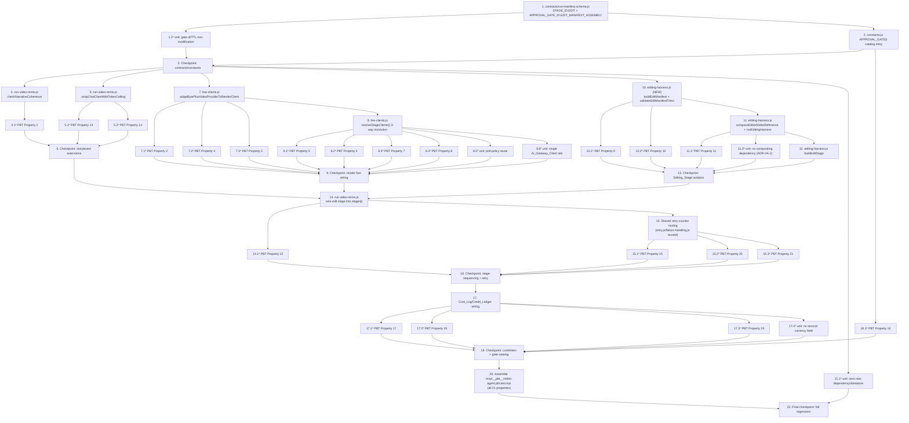

# Implementation Plan: Video_Agent

## Overview

This completed plan implements the Video_Agent as a glue-and-extend increment on the existing `knowgrph.video_remix.run` Director. All file paths below are the exact, already-named files from design.md's Component Inventory plus focused runtime/test files needed to keep live execution source-owned and validated. Work proceeded bottom-up: additive contract/enum extensions first (everything else reads them), then the extended existing modules, then the editing harness, then stage-sequencing wiring that ties the new stage into the Director, then property tests grouped by the component they validate (Properties 1-21 from design.md), then the fixed-constant/architectural non-introduction unit checks called out in the Testing Strategy, and finally regression validation.

## Tasks

- [x] 1. Extend `contracts/run-manifest.schema.js` with additive `STAGE_ID.EDIT` and `APPROVAL_GATE_ID.EDIT_MANIFEST_ASSEMBLY`
  - Add `EDIT: "edit"` to the `STAGE_ID` enum (keep `RESEARCH`/`STORYBOARD`/`RENDER`/`PUBLISH`/`CHECKOUT` byte-unchanged) so `STAGE_ID_VALUES` gains exactly one new value
  - Add `EDIT_MANIFEST_ASSEMBLY: "edit-manifest-assembly"` to the `APPROVAL_GATE_ID` enum (keep the six existing ids byte-unchanged) so `APPROVAL_GATE_ID_VALUES` gains exactly one new value
  - _Requirements: 4.8, 6.4, 6.5, 6.7_

  - [x]* 1.1 Write unit test asserting the six pre-existing `APPROVAL_GATE_ID` values and `APPROVAL_TOKEN_TTL_MS` are byte-unchanged
    - Add to `mcp/__tests__/` (e.g. `contract-enum-non-modification.test.mjs`): assert each of the six original gate id string values still equals its pre-increment literal, and `APPROVAL_TOKEN_TTL_MS === 15 * 60 * 1000`
    - _Requirements: 6.5_

- [x] 2. Add the `edit-manifest-assembly` catalog-only entry to `mcp/video-remix/constants.js`'s `APPROVAL_GATES`
  - Append `{ id: "edit-manifest-assembly", actionKind: "zero_spend_edit", risk: "none — zero-spend Edit_Manifest assembly, never gates execution" }` to the `APPROVAL_GATES` array, leaving every existing entry (including `render-action`) unchanged
  - Ensure this catalog entry is never added to `SPEND_BEARING_STAGE_GATES`/`DIRECTOR_STAGE_GATES` (it must remain catalog-only, never verified)
  - _Requirements: 6.4, 6.7_

- [x] 3. Checkpoint - Ensure contract/constants changes pass existing schema tests
  - Run the existing `contracts/__tests__/` and `contracts/__pbt__/` suites plus `mcp/__tests__/` to confirm the additive enum entries do not break any existing `validateRunManifest`/`validateApprovalGate` fixture. Ensure all tests pass, ask the user if questions arise.

- [x] 4. Extend `mcp/video-remix/run-video-remix.js`: add `checkNarrativeCoherence` (Narrative_Coherence_Check)
  - Implement `checkNarrativeCoherence(plannedShots)` exactly as specified in design.md: pure function, no I/O, returns `{ ok: boolean, repeatedShotIds: string[] }`, names every offending shotId across every duplicate pair, and treats fewer than two planned shots as `{ ok: true, repeatedShotIds: [] }`
  - Wire its result into the storyboard stage's observable result as a `narrativeCoherence` field, additive alongside the existing `schemaValid`/`sourceReferences`/`shotCount` fields (must not alter them)
  - _Requirements: 1.1, 1.2, 1.3, 1.4_

  - [x]* 4.1 Write property test for Narrative_Coherence_Check
    - **Property 1: Narrative_Coherence_Check correctness (including sub-two-shot edge case)**
    - **Validates: Requirements 1.1, 1.2, 1.3, 1.4**

- [x] 5. Extend `mcp/video-remix/run-video-remix.js`: add `wrapChatClientWithTokenCeiling` (Token_Budget_Ceiling + Narrative_Degraded_Mode)
  - Implement `wrapChatClientWithTokenCeiling(chatClient, { ceiling, onDegrade })` exactly as specified in design.md: no-op passthrough when `ceiling` is falsy or `<= 0`; always permits the first `plan()` call; tracks cumulative `prompt_tokens + completion_tokens` from each call's raw `Cost_Log`; treats a Token_Emission_Gap (`"unknown"` token field) as consuming the full remaining ceiling while enforcement is active; calls `onDegrade({ plannedShotCountAtDegradation })` once cumulative tokens reach the ceiling
  - Wrap `deps.chatClient` with this decorator before passing it to `runStoryboardHarness` (from `mcp/video-remix/storyboard-harness.js`, unmodified), defaulting the ceiling to **2000** tokens (ADR-VA-4) when the caller supplies none
  - Record `{ degraded: true, reason: "token_budget_ceiling", plannedShotCountAtDegradation }` on the storyboard stage's result when `onDegrade` fires, ensuring the emitted `Kgc_Document` remains schema-valid over the shots already planned
  - _Requirements: 5.1, 5.2, 5.3, 5.4, 5.5, 5.6_

  - [x]* 5.1 Write property test for Token_Budget_Ceiling no-op behavior at zero/unconfigured
    - **Property 13: Token_Budget_Ceiling of zero/unconfigured behaves as no ceiling**
    - **Validates: Requirements 5.1, 5.6**

  - [x]* 5.2 Write property test for Token_Budget_Ceiling enforcement and degraded-mode entry
    - **Property 14: Token_Budget_Ceiling enforcement, degraded-mode entry, and never-exceed guarantee**
    - **Validates: Requirements 5.2, 5.3, 5.4, 5.5**

- [x] 6. Checkpoint - Ensure storyboard-stage extensions pass all tests
  - Run `mcp/__tests__/storyboard-harness*.test.mjs` and the new property tests from Tasks 4-5 to confirm the additive `narrativeCoherence`/degraded-mode fields do not alter `storyboard-harness.js`'s own unmodified output shape. Ensure all tests pass, ask the user if questions arise.

- [x] 7. Extend `mcp/video-remix/live-clients.js`: add `adaptBytePlusVideoProviderToRenderClient`
  - Implement the adapter exactly as specified in design.md: translates `createBytePlusVideoProvider`'s `{runId,stageId,shotId,prompt,model}` dispatch contract into the Render_Harness's `{shot,runId}` client contract; on `!result.ok`, throws a plain `Error` (never fabricates a prompt, never overrides an underlying rejection); on success, returns `{ assetUrl: result.durableR2Url, durableR2Url, objectKey, bucket, provider, costCents: spendCentsPerShot }`
  - Import `createAiGatewayClient` (`ai-gateway-client.js`), `createBytePlusVideoProvider`/`DEFAULT_SHOT_SPEND_CENTS`/`PROVIDER_BYTEPLUS_QUEUE` (`render-providers.js`), and `createMediaPersister` (`media-persist.js`) — all reused unmodified
  - _Requirements: 2.1, 2.2, 2.5, 2.3, 2.4, 2.6, 3.6, 8.1, 8.2_

  - [x]* 7.1 Write property test for Shot_Prompt_Traceability
    - **Property 2: Shot_Prompt_Traceability is byte-identical**
    - **Validates: Requirements 2.1, 2.2, 2.5**

  - [x]* 7.2 Write property test for unplanned-shot dispatch handling
    - **Property 4: Unplanned-shot dispatch handling**
    - **Validates: Requirements 2.3, 2.4, 2.6**

  - [x]* 7.3 Write property test for BytePlus_Video_Provider dispatch call correctness
    - **Property 3: BytePlus_Video_Provider dispatch call correctness (submit/poll/persist)**
    - **Validates: Requirements 3.1, 8.1**

- [x] 8. Extend `mcp/video-remix/live-clients.js`: replace `resolveStageClients()`'s render-slot branch with three-way resolution
  - Implement the `AI_GATEWAY_VIDEO_URL` / `RENDER_PROVIDER` / `BYTEPLUS_API_KEY` (falling back to `AI_GATEWAY_TOKEN`) resolution exactly as specified in design.md (ADR-VA-2): `RENDER_PROVIDER=strytree` routes to the pre-existing `createStrytreeRenderQueueClient` (`live-stage-clients.js`, unmodified) keyed on `STRYTREE_RENDER_URL`/`STRYTREE_API_KEY`; otherwise, when both `AI_GATEWAY_VIDEO_URL` and the BytePlus key are present, construct `createAiGatewayClient` → `createBytePlusVideoProvider` → wrap with `adaptBytePlusVideoProviderToRenderClient` (Task 7) as the default
  - Ensure an incomplete configuration (exactly one of `AI_GATEWAY_VIDEO_URL`/key present) falls through to `renderClient: null` rather than constructing a partially-configured client, so `resolveGateClientDeps()` (unmodified) never sets `providerKeyAvailable` and every shot routes to the existing deterministic mock
  - _Requirements: 3.1, 3.2, 3.3, 3.7, 3.8, 3.9, 8.3, 8.4, 8.5, 8.6_

  - [x]* 8.1 Write property test for default BytePlus routing vs. explicit-override routing
    - **Property 5: Default BytePlus routing vs. explicit-override routing**
    - **Validates: Requirements 3.1, 3.2, 8.1, 8.3**

  - [x]* 8.2 Write property test for live-configuration routing continuity across a run
    - **Property 6: Live-configuration routing continuity across a run**
    - **Validates: Requirements 3.7, 3.8, 3.9, 8.4, 8.5, 8.6**

  - [x]* 8.3 Write property test for render dispatch failure isolating prior assets
    - **Property 7: Render dispatch failure isolates prior assets and records ledger spend**
    - **Validates: Requirements 3.4**

  - [x]* 8.4 Write property test for successful render dispatch producing exactly one asset and ledger event
    - **Property 8: Successful render dispatch produces exactly one asset and one ledger event**
    - **Validates: Requirements 3.5**

  - [x]* 8.5 Write unit test asserting no second polling policy is introduced
    - Add to `mcp/__tests__/` (e.g. `render-video-poll-policy-reuse.test.mjs`): assert the video-generation dispatch path invokes `pollVideoUntilDone` with no `intervalMs`/`maxDurationMs` override, defaulting to the existing `VIDEO_POLL_INTERVAL_MS`/`VIDEO_POLL_MAX_DURATION_MS`
    - _Requirements: 3.3_

  - [x]* 8.6 Write unit test asserting a single `Ai_Gateway_Client` construction site for the render/video path
    - Add to `mcp/__tests__/` (e.g. `live-clients-single-gateway-construction.test.mjs`): assert `mcp/video-remix/live-clients.js`'s import graph references exactly one `createAiGatewayClient` construction site for the render/video path and introduces no second client module or endpoint constant
    - _Requirements: 3.6, 8.1, 8.2_

- [x] 9. Checkpoint - Ensure render-stage live-wiring extensions pass all tests
  - Run `mcp/__tests__/live-clients.test.mjs`, `mcp/__tests__/render-harness*.test.mjs`, and the new property/unit tests from Tasks 7-8 to confirm `resolveGateClientDeps()` and `runRenderHarnessAsync` (both unmodified) continue to route correctly against the extended `resolveStageClients()`. Ensure all tests pass, ask the user if questions arise.

- [x] 10. Create `mcp/video-remix/editing-harness.js` (new file): manifest assembly and trim validation
  - Implement `EDIT_GATE_ID` constant, `EditManifestValidationError`, `buildEditManifest({ plannedShots, renderAssets, assetDurationsMs })` (storyboard-order sequencing, most-recent-wins per duplicate `shotId`, default full-duration trim), and `validateEditManifestTrims(editManifest, assetDurationsMs)` (rejects negative `startMs`, `endMs <= startMs`, or either value exceeding asset duration) exactly as specified in design.md
  - Import `cleanString` from `mcp/video-remix/helpers.js` (unmodified)
  - _Requirements: 4.1, 4.2, 4.3_

  - [x]* 10.1 Write property test for Edit_Manifest sequencing, most-recent-wins, and trim defaults
    - **Property 9: Edit_Manifest sequencing, most-recent-wins, and per-entry trim defaults**
    - **Validates: Requirements 4.1, 4.2, 4.5, 4.6**

  - [x]* 10.2 Write property test for Edit_Manifest trim validation
    - **Property 10: Edit_Manifest trim validation rejects invalid entries**
    - **Validates: Requirements 4.3, 4.4**

- [x] 11. Extend `mcp/video-remix/editing-harness.js`: add `composeEditedVideoReference` and `runEditingHarness`
  - Implement `composeEditedVideoReference({ runId, editManifest, mediaPersister })` exactly as specified in design.md: serializes the `Edit_Manifest` to JSON and persists it via `mediaPersister.persist({ runId, stageId: "edit", shotId: "manifest", ext: "json", bytes, contentType: "application/json" })` (`media-persist.js`, unmodified) — no re-encode, no compositing dependency; lets `MediaPersistWriteError`/`MediaPersistVerifyError` propagate unchanged
  - Implement `runEditingHarness({ plannedShots, renderAssets, assetDurationsMs }, deps)` exactly as specified in design.md: zero-asset input returns `{status:"skipped", skipReason:"no_completed_shot_assets", blocksPublish:true}`; failed trim validation returns `{status:"rejected", blocksPublish:true, failure:{shotId, reason}}`; successful composition returns `{status:"complete", blocksPublish:false, manifest, editedVideoReference}`; a composition-persist failure returns `{status:"failed", blocksPublish:true, manifest, failure:{reason}}` while preserving the already-built manifest and leaving every prior render asset untouched
  - _Requirements: 4.4, 4.5, 4.6, 4.7_

  - [x]* 11.1 Write property test for Editing_Stage composition failure preserving prior artifacts
    - **Property 11: Editing_Stage composition failure preserves prior artifacts**
    - **Validates: Requirements 4.7**

  - [x]* 11.2 Write unit test asserting no compositing/transcoding library reference (ADR-VA-1)
    - Add to `mcp/__tests__/` (e.g. `editing-harness-no-compositing-dependency.test.mjs`): assert `runEditingHarness` never imports or references any compositing/transcoding library, and that `composeEditedVideoReference`'s only I/O call is `mediaPersister.persist()`
    - _Requirements: 10.2_ (ADR-VA-1 resolution)

- [x] 12. Add `buildEditStage` to `mcp/video-remix/editing-harness.js`
  - Implement `buildEditStage(id, editResult)` exactly as specified in design.md, mirroring `stages.js`'s `buildStage` pattern: shapes `{ id, status, manifest, editedVideoReference, skipped, skipReason, failure }`
  - _Requirements: 4.8_

- [x] 13. Checkpoint - Ensure the new Editing_Stage harness passes all tests in isolation
  - Run the property/unit tests from Tasks 10-12 against `mcp/video-remix/editing-harness.js` in isolation (mocked `mediaPersister`, no live R2 calls). Ensure all tests pass, ask the user if questions arise.

- [x] 14. Wire the `edit` stage into `mcp/video-remix/run-video-remix.js`'s stage sequence
  - Insert the `runEditingHarness` call and the new `edit` stage entry (built via `buildEditStage`) between the existing `render` and `publish` stage entries in the `stages[]` array, exactly as specified in design.md, extending the Director's stage order to `research → storyboard → render → edit → publish → checkout`
  - Force the `publish` stage's status to `"blocked"` (using `editResult.blocksPublish`) whenever the Editing_Stage was skipped, rejected, or failed, recording the skip/failure reason as the blocking cause, while leaving the existing dry-run-plan-artifact machinery otherwise unaffected
  - _Requirements: 4.5, 4.6, 4.8_

  - [x]* 14.1 Write property test for fixed stage order preservation
    - **Property 12: Fixed stage order is preserved**
    - **Validates: Requirements 4.8**

- [x] 15. Route Editing_Stage composition failures through the Director's shared retry counter (`retry.js`/`failure-handling.js`, unmodified)
  - Wire an Editing_Stage composition failure (Task 11's `{status:"failed"}` outcome) through the same `failureHandling` call path already used for a render dispatch failure, tagging the resulting failure record's `stageId` as `"edit"` only when the exhausted attempt was the Editing_Stage's own composition step, while incrementing the one shared `retryCount` integer used by both video-generation dispatch failures and Editing_Stage composition failures
  - Ensure retries apply the Director's existing exponential backoff (1s base, doubling, capped at 30s) and that exhaustion of the shared counter fails the entire run closed to `blocked`, halting every stage downstream of the exhausted stage, leaving upstream stage status/spend unchanged, and appending `{ stageId, finalRetryCount, reason }`
  - _Requirements: 6.1, 6.2, 6.3, 6.6, 9.1, 9.2, 9.3, 9.4, 9.5_

  - [x]* 15.1 Write property test for approval-token spend boundary correctness
    - **Property 15: Approval-token spend boundary for the video-generation and Editing_Stage spend paths**
    - **Validates: Requirements 6.1, 6.2, 6.3, 6.6**

  - [x]* 15.2 Write property test for shared retry-counter accounting
    - **Property 20: Shared retry-counter accounting across video-generation and Editing_Stage failures**
    - **Validates: Requirements 9.1, 9.2, 9.3**

  - [x]* 15.3 Write property test for retry exhaustion fail-closed behavior
    - **Property 21: Retry exhaustion fails closed and halts every downstream stage**
    - **Validates: Requirements 9.4, 9.5**

- [x] 16. Checkpoint - Ensure full stage-sequencing and retry-sharing wiring passes all tests
  - Run `mcp/__tests__/director-live-run.test.mjs`, `mcp/__tests__/bounded-retry-failure-handling.test.mjs`, `mcp/__tests__/director-gates-*.test.mjs`, and the new property tests from Tasks 14-15 to confirm the Director's existing exhaustion/circuit-breaker contracts (`retry.js`, unmodified) generalize correctly once the Editing_Stage is wired in. Ensure all tests pass, ask the user if questions arise.

- [x] 17. Wire Cost_Log/Credit_Ledger accounting for video-generation and Editing_Stage spend events
  - Ensure every video-generation `Cost_Log` entry emitted along the render-dispatch path (Tasks 7-8) matches the canonical raw Ai_Gateway `Cost_Log` shape and is validated via the existing `validateCostLog()` (`contracts/cost-log.schema.js`, unmodified) before inclusion in `Budget_Meters`; ensure a `Budget_Meters` update that attempts no new `Cost_Log` entry (e.g., the zero-spend Edit_Manifest assembly step) calls `validateCostLog()` zero times
  - Ensure every spend-bearing video-generation dispatch records exactly one Credit_Ledger event via the existing Render_Harness ledger contract (`render-harness.js`, unmodified), with no second ledger mechanism
  - _Requirements: 7.1, 7.2, 7.3, 7.4, 7.5_

  - [x]* 17.1 Write property test for Cost_Log field-domain validity
    - **Property 17: Cost_Log field-domain validity for video-generation and edit spend events**
    - **Validates: Requirements 7.1**

  - [x]* 17.2 Write property test for validation-gated Budget_Meters aggregation
    - **Property 18: Validation-gated Budget_Meters aggregation with continuation on failure**
    - **Validates: Requirements 7.2, 7.4, 7.5**

  - [x]* 17.3 Write property test for Credit_Ledger recording of every spend-bearing event
    - **Property 19: Credit_Ledger recording for every spend-bearing event**
    - **Validates: Requirements 7.3**

  - [x]* 17.4 Write unit test asserting no second currency/unit field is introduced
    - Add to `mcp/__tests__/` (e.g. `cost-log-no-second-currency.test.mjs`): assert no new field name (a second currency/unit) is introduced anywhere in the video-generation/Editing_Stage Cost_Log emission path beyond `estimated_cost_usd`/`providerSpendCents`
    - _Requirements: 7.6_

- [x] 18. Write property test for new zero-spend gate id catalog integrity
  - [x]* 18.1 Write property test for the `edit-manifest-assembly` gate id's zero-spend, never-referenced-by-spend-path guarantee
    - **Property 16: New zero-spend gate id is never referenced by a spend-bearing path and always carries zero cost**
    - **Validates: Requirements 6.4, 6.7**

- [x] 19. Checkpoint - Ensure cost/token accounting and gate-catalog wiring passes all tests
  - Run `mcp/__tests__/cost-log-aggregation.test.mjs`, `mcp/__tests__/reconciliation-ledger-vs-meters.test.mjs`, `mcp/__tests__/budget-*.test.mjs`, and the new property/unit tests from Tasks 17-18. Ensure all tests pass, ask the user if questions arise.

- [x] 20. Assemble `mcp/__pbt__/video-agent.pbt.test.mjs`: wire all 21 property tests together
  - Create the new PBT file per the repo's existing `fast-check` convention (mirroring `mcp/__pbt__/gates-director.pbt.test.mjs`), importing/extending the existing `mcp/__pbt__/arbitraries.mjs` seams (`gateTokenAgeAroundWindowArb`, `tokenStateArb`, `authTokenShapedArb`, `maxIterationsBoundaryArb`) for Properties 13-21
  - Add new arbitraries local to this file for: planned-shot sequences with controllable consecutive-duplicate density (Properties 1, 2), render-asset sets with controllable duplicate-shotId/completion-order density (Property 9), and per-call token-cost sequences with controllable Token_Emission_Gap injection (Properties 13, 14)
  - Consolidate the 21 individual property-test bodies authored in Tasks 4.1, 5.1-5.2, 7.1-7.3, 8.1-8.4, 10.1-10.2, 11.1, 14.1, 15.1-15.3, 17.1-17.3, 18.1 into this single file, each configured for a minimum of 100 iterations and tagged `Feature: knowgrph-video-agent, Property {N}: {property title}`; mock the `Ai_Gateway_Client` (fake `submitVideo`/`pollVideoUntilDone`/`fetchImpl`) and the `mediaPersister` for every video-generation property (3, 5, 6, 7, 8) so zero live network calls occur
  - _Requirements: 1.1-1.4, 2.1-2.6, 3.1, 3.2, 3.4, 3.5, 3.7-3.9, 4.1-4.8, 5.1-5.6, 6.1-6.4, 6.6, 6.7, 7.1-7.5, 8.1, 8.3-8.6, 9.1-9.5_

- [x] 21. Write unit test asserting zero new dependency and zero new persistent datastore
  - [x]* 21.1 Write dependency-manifest diff test
    - Add to `mcp/__tests__/` (e.g. `zero-new-dependency-datastore.test.mjs`): assert `mcp/package.json` and `cloudflare/workers/knowgrph-mcp/package.json` show zero added dependencies (production or dev) attributable to this increment relative to the pre-increment manifest state, and that `contracts/` introduces no `package.json` of its own; assert no new D1 migration file, R2 bucket binding, KV namespace binding, or Durable Object class declaration is introduced anywhere in the diff
    - _Requirements: 10.1, 10.3, 10.4, 10.5_

- [x] 22. Final checkpoint - Full regression: new Video_Agent suite plus existing `mcp/video-remix` suite
  - Run the complete new test surface added by this plan (`mcp/__pbt__/video-agent.pbt.test.mjs` and every new `mcp/__tests__/*.test.mjs` file added in Tasks 1.1, 8.5, 8.6, 11.2, 17.4, 21.1) together with the full pre-existing `mcp/video-remix`/`mcp/__tests__`/`mcp/__pbt__` test suite (including `contracts/run-manifest.schema.js`'s existing `validateRunManifest` fixtures, unmodified and re-run as-is against manifests that now include the `edit` stage) to confirm zero regression. Ensure all tests pass, ask the user if questions arise.

## Task Dependency Graph

```json
{
  "waves": [
    {
      "wave": 1,
      "tasks": ["1"],
      "dependsOn": [],
      "description": "Additive STAGE_ID.EDIT + APPROVAL_GATE_ID.EDIT_MANIFEST_ASSEMBLY enum entries in contracts/run-manifest.schema.js — everything else reads these."
    },
    {
      "wave": 2,
      "tasks": ["1.1", "2"],
      "dependsOn": ["1"],
      "description": "Gate/TTL non-modification unit test, and the catalog-only APPROVAL_GATES entry in constants.js (reads the new enum value from wave 1)."
    },
    {
      "wave": 3,
      "tasks": ["3", "18.1"],
      "dependsOn": ["1.1", "2"],
      "description": "Contracts/constants checkpoint. Property 16 (gate-catalog integrity) can also start here since it only depends on the catalog entry from task 2."
    },
    {
      "wave": 4,
      "tasks": ["4", "5", "7", "10", "21.1"],
      "dependsOn": ["3"],
      "description": "Three parallel tracks fan out from the checkpoint: Track A (storyboard, task 4/5), Track B (render live-wiring, task 7), Track C (editing-harness manifest/trim, task 10). The zero-new-dependency/datastore diff check (21.1) is independent and can run any time after the checkpoint."
    },
    {
      "wave": 5,
      "tasks": ["4.1", "5.1", "5.2", "7.1", "7.2", "7.3", "10.1", "10.2"],
      "dependsOn": ["4", "5", "7", "10"],
      "description": "Property tests authored directly against each wave-4 implementation task."
    },
    {
      "wave": 6,
      "tasks": ["6", "8", "11"],
      "dependsOn": ["4.1", "5.1", "5.2", "7.1", "7.2", "7.3", "10.1", "10.2"],
      "description": "Track A checkpoint (6); Track B's resolveStageClients() three-way resolution (8, depends on adapter task 7); Track C's compose/runEditingHarness (11, depends on buildEditManifest/validateEditManifestTrims task 10)."
    },
    {
      "wave": 7,
      "tasks": ["8.1", "8.2", "8.3", "8.4", "8.5", "8.6", "11.1", "11.2", "12"],
      "dependsOn": ["6", "8", "11"],
      "description": "Property/unit tests for the render-routing extension; property/unit tests for composition-failure handling; buildEditStage builder."
    },
    {
      "wave": 8,
      "tasks": ["9", "13"],
      "dependsOn": ["8.1", "8.2", "8.3", "8.4", "8.5", "8.6", "11.1", "11.2", "12"],
      "description": "Track B checkpoint (render live-wiring); Track C checkpoint (Editing_Stage harness in isolation)."
    },
    {
      "wave": 9,
      "tasks": ["14"],
      "dependsOn": ["6", "9", "13"],
      "description": "Stage-sequencing wiring requires all three tracks (A, B, C) complete — it wires the storyboard degraded-mode flag, render assets, and the new edit stage together."
    },
    {
      "wave": 10,
      "tasks": ["14.1", "15"],
      "dependsOn": ["14"],
      "description": "Fixed-stage-order property test; shared retry-counter routing for video-generation + Editing_Stage failures."
    },
    {
      "wave": 11,
      "tasks": ["15.1", "15.2", "15.3"],
      "dependsOn": ["15"],
      "description": "Approval-boundary, shared-retry-accounting, and retry-exhaustion property tests."
    },
    {
      "wave": 12,
      "tasks": ["16"],
      "dependsOn": ["14.1", "15.1", "15.2", "15.3"],
      "description": "Checkpoint: stage-sequencing + retry-sharing wiring."
    },
    {
      "wave": 13,
      "tasks": ["17"],
      "dependsOn": ["16"],
      "description": "Cost_Log/Credit_Ledger wiring for video-generation and Editing_Stage spend events."
    },
    {
      "wave": 14,
      "tasks": ["17.1", "17.2", "17.3", "17.4"],
      "dependsOn": ["17"],
      "description": "Cost_Log field-domain, Budget_Meters aggregation, Credit_Ledger recording property tests, and the no-second-currency unit test."
    },
    {
      "wave": 15,
      "tasks": ["19"],
      "dependsOn": ["17.1", "17.2", "17.3", "17.4", "18.1"],
      "description": "Checkpoint: cost/token accounting and gate-catalog wiring, including Property 16 authored back in wave 3."
    },
    {
      "wave": 16,
      "tasks": ["20"],
      "dependsOn": ["19"],
      "description": "Consolidate all 21 authored property tests into mcp/__pbt__/video-agent.pbt.test.mjs."
    },
    {
      "wave": 17,
      "tasks": ["22"],
      "dependsOn": ["20", "21.1"],
      "description": "Final full-regression checkpoint: new Video_Agent suite plus the existing mcp/video-remix suite."
    }
  ]
}
```



**Parallelizable work**: after Task 3 (contracts/constants checkpoint) completes, three independent tracks can proceed in parallel:
- **Track A** (storyboard): Tasks 4-6
- **Track B** (render live-wiring): Tasks 7-9
- **Track C** (Editing_Stage harness, isolated): Tasks 10-13

Task 14 (stage-sequencing wiring) requires Tracks A, B, and C to have completed (it wires the storyboard degraded-mode flag, the render assets, and the new edit stage together). Task 18.1 (Property 16, gate-catalog integrity) depends only on Task 2 and can run any time after the contracts/constants checkpoint, in parallel with Tracks A/B/C. Task 21.1 (dependency/datastore diff) also depends only on Task 3 and can run at any point after the checkpoint. Task 20 (assembling the single PBT file) requires every individual property-test task (4.1 through 18.1) to be authored first, since it consolidates all 21 into one file. Task 22 is the final gate.

## Notes

- Tasks marked with `*` are optional (property/unit tests) and can be skipped for a faster path through the checklist; core implementation tasks (1, 2, 4, 5, 7, 8, 10, 11, 12, 14, 15, 17, 20) are never optional.
- Every property test task (Tasks 4.1, 5.1-5.2, 7.1-7.3, 8.1-8.4, 10.1-10.2, 11.1, 14.1, 15.1-15.3, 17.1-17.3, 18.1) authors its property-test body against the property it references; Task 20 is the single consolidation point that assembles all 21 into `mcp/__pbt__/video-agent.pbt.test.mjs` using the repo's existing `fast-check` convention (100+ iterations, `Feature: knowgrph-video-agent, Property {N}: {property title}` tag per test).
- No task updates `knowgrph/docs/documents/knowgrph-agentic-os-prd-tad.md` or its companion `knowgrph-agentic-os-video-agent-prd-tad.companion.md` — those are out of scope per requirements.md's Out of Scope section and were already updated by the user directly.
- All file paths reference already-named files from design.md's Component Inventory; `mcp/video-remix/editing-harness.js` and `mcp/__pbt__/video-agent.pbt.test.mjs` are the only two new files this plan creates.
