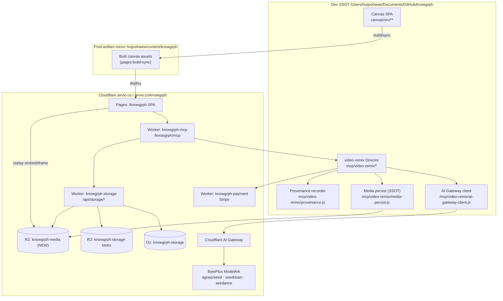
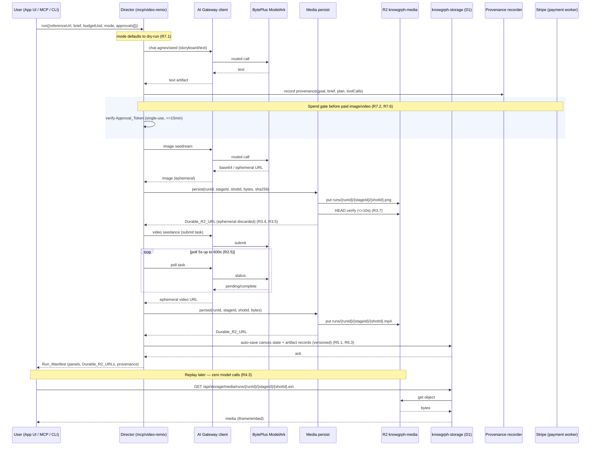

# Design Document

## Overview

This design enhances the knowgrph repository (Dev SSOT `/Users/huijoohwee/Documents/GitHub/knowgrph`) into an agentic widget canvas with end-to-end rich media generation, durable persistence, and cross-environment sync, deployed exclusively on Cloudflare. It builds on the existing video-remix Director runtime (`mcp/video-remix/*`), the `knowgrph-storage` worker (D1 + R2 blob), the `knowgrph-payment` worker (Stripe), and the `knowgrph-mcp` worker (MCP Streamable HTTP), and on the canvas SPA (`@knowgrph/canvas`).

The feature adds four capabilities on top of what exists:

1. **BytePlus media generation through the Cloudflare AI Gateway** — chat `agnes/seed`, image `seedream`, video `seedance` (async submit → poll → retrieve), behind one provider contract with a deterministic offline mock.
2. **Persist-on-generate to a durable R2 media surface** — a new `knowgrph-media` bucket and the key scheme `runs/{runId}/{stageId}/{shotId}.{ext}`. The system stores only the `Durable_R2_URL`, never the ephemeral provider URL, verifies retrievability before marking persisted, and deduplicates by content hash.
3. **Distinct Image and Video Rich Media Panels with replay** — separate widget/panel types that replay artifacts from R2 through an embed/iframe with zero model, gateway, or provider calls.
4. **Auto-save, retrieval, and provenance-linked sync** — canvas state and artifact records auto-save to D1, sync across Dev → Prod → Cloudflare with latest-result ownership and conflict guards, and carry a `Provenance_Chain`.

This is a planning artifact only; it changes no code. The platform target is Cloudflare exclusively — Vercel and AWS are excluded from every generation, routing, storage, and deployment path for this feature, including the infrastructure used to reach the gateway and provider.

### Design Principles

- **Reuse before adding.** Extend the existing `mcp/video-remix/*` Director modules, the `knowgrph-storage` D1/R2 layer, and the canvas storage sync contract rather than introducing parallel stacks.
- **Pure core, injected effects.** Persistence, gateway, and provider logic are pure modules that accept injected R2/gateway/clock clients, so the same code runs under the Cloudflare Worker and under offline `node --test` with deterministic mocks.
- **Durable-only references.** Ephemeral provider URLs never leave the generation boundary; only `Durable_R2_URL` values are persisted, synced, or rendered.
- **Single-responsibility files under 600 lines.** New behavior is split at stable ownership boundaries to satisfy the repo hygiene gates.

## Architecture

### Component Topology (Dev → Prod → Cloudflare)



Key topology decisions:

- **AI Gateway is the only model egress.** All BytePlus calls route through the Cloudflare AI Gateway binding; no module calls a provider endpoint directly (R2.1, R2.11, R7).
- **`knowgrph-media` is a new, distinct R2 bucket** bound into the `knowgrph-storage` worker (rather than a separate worker) to reuse its routing, auth, and CORS surface while keeping media isolated from the document blob bucket. The media read/replay routes live in a new `media.ts` so `blob.ts` stays under 600 lines.
- **Replay reads R2 directly** through the storage worker media route; it never touches the Director, AI Gateway, or BytePlus (R4.3).
- **Dev owns the source; Prod is a built mirror; Cloudflare serves it.** No route-specific overrides; all environments resolve to identical D1 records (R5.4, R5.8).

### End-to-End Run Sequence (brief → text → image → video → persist → canvas → replay)



## Components and Interfaces

### 1. AI Gateway client — `mcp/video-remix/ai-gateway-client.js` (NEW)

Single egress for all model calls. Wraps the Cloudflare AI Gateway, which forwards to BytePlus ModelArk. Exposes a provider-neutral contract so the Director never names a vendor endpoint.

```text
createAiGatewayClient({ fetchImpl, gatewayBaseUrl, accountId, now }) -> {
  chat({ prompt, model = "agnes/seed", ... })        -> { text, costLog }
  image({ prompt, model = "seedream", ... })          -> { bytesOrB64, ephemeralUrl?, mediaType, costLog }
  submitVideo({ prompt, model = "seedance", ... })     -> { taskId }
  pollVideo({ taskId })                                -> { status, ephemeralUrl?, mediaType }
}
```

- Routes every call through the gateway base URL (R2.1). Chat→`agnes/seed`, image→`seedream`, video→`seedance` (R2.2–R2.4).
- Video is async: `submitVideo` then `pollVideo` every 5s, max 600s; on timeout the caller marks the step failed (R2.5, R2.6).
- On a gateway/provider error, returns a structured error so the Director marks the step failed without rendering a partial artifact (R2.7).
- Honors a node-local model override passed by the Director, replacing the group default for that node (R2.10).
- Mock counterpart `createMockAiGatewayClient` returns deterministic bytes/text keyed by input hash for offline runs (R8.1, R8.8).

### 2. Media persistence (SSOT) — `mcp/video-remix/media-persist.js` (NEW)

The single owner of persist-on-generate. Pure logic with an injected R2 client and clock.

```text
createMediaPersister({ r2Client, bucket = "knowgrph-media", now, verifyTimeoutMs = 10000 }) -> {
  persist({ runId, stageId, shotId, ext, bytes, contentType }) -> {
    durableR2Url, objectKey, contentHash, deduped: boolean
  }
}
```

- Computes `sha256` of bytes; if an object with that hash already exists, references the existing object (dedupe, R3.9).
- Object key from the shared scheme `runs/{runId}/{stageId}/{shotId}.{ext}` in bucket `knowgrph-media` (R3.3). Reuses/extends `mediaObjectKey`/`DEFAULT_MEDIA_BUCKET` already in `render-providers.js`, re-pointed from the placeholder bucket to `knowgrph-media`.
- After `put`, performs a HEAD/GET verify within 10s before returning; on verify failure throws a verification error and the step is marked not-persisted (R3.7, R3.8).
- Returns only the `Durable_R2_URL`; the caller discards the ephemeral provider URL (R3.4, R3.5). On any persistence failure after the configured max write attempts, returns a descriptive error identifying `runId/stageId/shotId` and records no partial artifact and no ephemeral URL (R3.6).

### 3. Render providers — `mcp/video-remix/render-providers.js` (EXTEND)

Already defines `MEDIA_BUCKET_PREFIX`, `DEFAULT_MEDIA_BUCKET`, `mediaObjectKey`, `buildMediaAssetReference`, `PROVIDER_BYTEPLUS_QUEUE`, `PROVIDER_MOCK`, `selectRenderProvider`.

- Re-point `DEFAULT_MEDIA_BUCKET` to `knowgrph-media` and align `mediaObjectKey` to `runs/{runId}/{stageId}/{shotId}.{ext}`.
- Wire the BytePlus image/video providers to call through the AI Gateway client (item 1) and then through the media persister (item 2), so a render returns a `Durable_R2_URL` asset reference plus a Credit_Ledger event (existing behavior preserved).
- `selectRenderProvider` continues to route to `PROVIDER_MOCK` when no key is available or budget is exhausted (R7.8, R8) — the mock also persists deterministic bytes to a mock R2 so offline runs produce stable `Durable_R2_URL` references (R8.8).

### 4. Provenance recorder — `mcp/video-remix/provenance.js` (NEW)

```text
buildProvenanceChain({ goal, brief, plan, toolCalls[], verificationChecks[] }) -> ProvenanceChain
assertComplete(chain) -> void | throws MissingProvenanceComponentError
```

- Produces the complete `Provenance_Chain` recorded before an artifact is marked persisted (R6.1). Missing component → step fails, artifact not persisted (R6.6).
- Serialized into the artifact record alongside `Durable_R2_URL` (R6.3) and preserved field-for-field through sync (R6.5).

### 5. Media R2 surface — `cloudflare/workers/knowgrph-storage/media.ts` (NEW) + `wrangler.toml` (EXTEND)

- Add a second R2 binding to `knowgrph-storage/wrangler.toml`:

```toml
[[r2_buckets]]
binding = "KNOWGRPH_MEDIA_BUCKET"
bucket_name = "knowgrph-media"
```

- `media.ts` exposes:
  - `PUT/POST /api/storage/media/runs/{runId}/{stageId}/{shotId}.{ext}` — write (used by the Director persist path).
  - `GET|HEAD /api/storage/media/runs/{runId}/{stageId}/{shotId}.{ext}` — read/replay (used by the canvas iframe/embed). Reads R2 directly, no model call (R4.1–R4.3).
- The `Durable_R2_URL` is `https://airvio.co/api/storage/media/runs/{runId}/{stageId}/{shotId}.{ext}`.
- Reuses the existing blob CORS/error helpers; mirrors `blob.ts` patterns. Read returns an explicit 404/unavailable so the canvas can show a fallback state (R4.4).
- Enforces run-scoped entitlement on read/write (authn + authz), returning access-control errors for unauthenticated or unauthorized callers (R4.5, R4.6, R9.3–R9.5).

### 6. Canvas panels — `canvas/src/lib/canvas/widgets/imagePanel.ts` and `videoPanel.ts` (NEW), shared base `richMediaPanel.ts`

- **Distinct** `Image_Panel` and `Video_Panel` widget/panel types (R2.8). Both extend a shared `richMediaPanel` base for layout/port/provenance affordances.
- Render the artifact in its matching panel within 1s of creation (R2.9).
- Replay loads from `Durable_R2_URL` via ``/`<iframe>` (image) and `<video>`/`<iframe>` (video) with no LLM/gateway/provider call; on unreachable URL shows a fallback state (R4).
- Layout is driven by shared responsive layout metadata (item 8), not per-viewport hardcoded coordinates (R1.2). Edge routing reuses the canvas edge router with the center-content avoidance rule (R1.6, R1.7).

### 7. Auto-save / retrieval / sync — extend `canvas/src/lib/storage/knowgrphStorageSyncContract` + `knowgrph-storage` D1

- Auto-save canvas state + artifact references to D1 on node-edit (500ms debounce), run-completion, approval, and artifact-ready events; D1 write completes within 2s (R5.1). Retrieval on open within 3s (R5.2).
- **Latest-result ownership** via a monotonically increasing `version` per canvas, derived from the most-recent originating event; a lower-version write never overwrites newer state (R5.7). Reuses the existing `sync_events` + revision machinery and `collaborationBridge` (Yjs).
- Conflict handling preserves the existing edit and surfaces a conflict requiring explicit replace/merge/discard (R5.6). D1 write failure → retry up to 3× then preserve unsaved local state and report (R5.9); retrieval failure → report and do not treat partial/empty state as authoritative (R5.10).
- All environments resolve to identical D1 records with no route-specific overrides (R5.4, R5.8).

### 8. Surfaces — MCP / CLI / App UI

- **MCP** (`knowgrph-mcp` worker): the existing `knowgrph.video_remix.run` tool gains the media-persist + provenance + panel outputs. Inspectable Run state/stages/gates/budget/artifacts (R9.1, R9.5).
- **CLI** (`knowgrph_parser`): `python3 -m knowgrph_parser run-goal ...` drives the same Director path headlessly (R9.1).
- **App UI** (`@knowgrph/canvas`): MainPanel Integrations → FloatingPanel Chat UI → Editor Workspace → Canvas → 16:9 widget layout (R1.8).
- Identical inputs produce equivalent results across surfaces (same status, per-stage outcomes, identical `Durable_R2_URL`s and provenance, differing only in surface/run ids and timestamps) (R9.2).

## Data Models

### Run and Artifact Record

```text
Run {
  runId: string                      // unique
  mode: "dry-run" | "live"           // default dry-run
  budgetCapUsd: number               // 0.00 .. 999,999,999.99
  state: running | blocked | budget_exceeded | approval_required | completed
  stages: Stage[]
  approvalGates: ApprovalGate[]
  artifacts: ArtifactRecord[]
}

ArtifactRecord {
  runId, stageId, shotId: string
  kind: "text" | "image" | "video"
  durableR2Url: string               // ONLY durable URL; never ephemeral (R3.4/R3.5)
  contentHash: string                // sha256, dedupe key (R3.9)
  mediaType: string
  provenance: ProvenanceChain        // (R6.3)
  layout: ResponsiveLayoutMetadata   // (R1.7/R1.9)
  version: number                    // monotonic, latest-result ownership (R5.7)
  createdAtMs: number
}

ProvenanceChain {                    // (R6.1)
  goalRef, briefRef, planRef: string
  toolCalls: { tool, inputHash, outputRef }[]
  verificationChecks: { checkId, status }[]
}

ResponsiveLayoutMetadata {           // shared across the 5 proof classes (R1.2/R1.9)
  frame: { w: 1920, h: 1080 }
  widgets: { id, kind, x, y, z, wPct, hPct }[]
  edges: { id, from, to }[]
}
```

### D1 schema additions — `cloudflare/d1/migrations/<next>_media_artifacts.sql` (NEW)

A new table keeps media artifacts queryable and synced without overloading `documents`. Layout reuses the existing `graph_snapshots.layout_json` convention.

```sql
CREATE TABLE IF NOT EXISTS media_artifacts (
  id            TEXT PRIMARY KEY,            -- runId:stageId:shotId
  workspace_id  TEXT NOT NULL,
  run_id        TEXT NOT NULL,
  stage_id      TEXT NOT NULL,
  shot_id       TEXT NOT NULL,
  kind          TEXT NOT NULL,              -- text | image | video
  durable_r2_url TEXT NOT NULL,             -- never ephemeral
  content_hash  TEXT NOT NULL,
  media_type    TEXT,
  provenance_json TEXT NOT NULL,
  layout_json   TEXT,
  version       INTEGER NOT NULL,           -- monotonic ownership
  created_at    TEXT NOT NULL,
  updated_at    TEXT NOT NULL
);
CREATE INDEX IF NOT EXISTS idx_media_artifacts_run ON media_artifacts(workspace_id, run_id);
CREATE UNIQUE INDEX IF NOT EXISTS uq_media_artifacts_hash ON media_artifacts(workspace_id, content_hash);
```

### R2 key scheme

`runs/{runId}/{stageId}/{shotId}.{ext}` in bucket `knowgrph-media` under account `170e89fdb8679ff2fcc2900e25ed04f4` (R3.3). One object per unique content hash (R3.9).

## Error Handling

| Failure | Behavior | Requirement |
|---|---|---|
| Video task exceeds 600s polling | Stop polling, mark step failed, timeout error, no media reference | R2.6 |
| Gateway/provider model error | Mark step failed, descriptive error, no partial/placeholder artifact | R2.7 |
| R2 write fails after max attempts | Step failed, error identifies runId/stageId/shotId, no partial record, no ephemeral URL retained | R3.6 |
| R2 verify not retrievable in 10s | Treat as not persisted, mark step failed, verification error | R3.8 |
| Replay URL unreachable (10s, 2 retries) | Explicit fallback state, no regeneration, reference unchanged | R4.4 |
| Unauthorized replay | Deny, access-denied indication, do not load object | R4.6 |
| D1 auto-save write fails | Retry up to 3×, then preserve unsaved local state + report | R5.9 |
| D1 retrieval fails | Report; do not treat partial/empty state as authoritative | R5.10 |
| Auto-save conflict | Preserve existing edit, surface conflict, require explicit resolution | R5.6 |
| Provenance incomplete | Step failed, descriptive error, artifact not persisted | R6.6 |
| Spend gate without valid token | Halt at gate, preserve state, no partial spend, record blocked reason | R7.2 |
| Budget cap would be exceeded | Halt paid action independent of any token, record breach, no partial spend | R7.9 |
| Recovery exhausted | Stop deterministically, preserve persisted artifacts, record blocker | R8.7 |
| Resume restore fails | Report restore-failure, do not regenerate persisted artifacts | R8.10 |

## Testing Strategy

All tests run offline under the existing `npm run runtime:test` gate (`node --test`, network-free), with no hardcoded absolute paths or demo-specific content, and must be working-directory independent (R8.1–R8.3).

- **Media persist (`mcp/__tests__/media-persist.test.mjs`)**: persist-on-generate writes the correct R2 key; only `Durable_R2_URL` is returned; ephemeral URL never appears in the record; verify-before-persist; content-hash dedupe; failure paths (R3).
- **AI Gateway client (mock)**: routing through gateway, model selection (`agnes/seed`/`seedream`/`seedance`), async video poll loop with 600s timeout, error→failed-step, node-local override (R2).
- **Determinism (`__pbt__`)**: identical mock inputs → byte-for-byte identical `Durable_R2_URL`s and content hashes across separate runs (R8.8).
- **Replay-without-LLM**: assert a replay path issues zero outbound model/gateway/provider calls and reads only from the R2 media route (R4.3); unreachable → fallback (R4.4).
- **Auto-save/sync (canvas unit tests)**: debounce/timing, monotonic version ownership, conflict preservation, D1 write/retrieval failure paths (R5).
- **Provenance**: complete chain recorded before persist; missing component fails; field-for-field identity after sync (R6).
- **Spend gates**: dry-run default, single-use token, 15-min validity, budget-cap independent halt (R7).
- **Responsive proof classes (layout metadata tests)**: layouts for 320x640, 390x844, 768x1024, 1366x768, 1920x1080 derived from shared metadata; zero widget overlap; edge center-avoidance (R1).
- **Surfaces**: equivalent results from MCP/CLI/App UI for identical inputs; authn/authz denial paths on the media routes (R9).

## Correctness Properties

These invariants must hold across all runs and are the basis for the property-based and unit tests above.

### Property 1: Durable-only persistence
For every persisted artifact record, the stored reference is a `Durable_R2_URL` and no `Ephemeral_Provider_URL` appears in any artifact record, canvas state, or synced document.
**Validates: Requirements 3.4, 3.5**

### Property 2: Persist-before-complete
No generation step is marked complete until its bytes are stored in `knowgrph-media` and verified retrievable within 10s, and its complete `Provenance_Chain` is recorded.
**Validates: Requirements 3.1, 3.2, 3.7, 6.1**

### Property 3: Content-hash dedupe
Two outputs with identical content resolve to exactly one R2 object; the unique index `uq_media_artifacts_hash` is never violated.
**Validates: Requirements 3.9**

### Property 4: Replay purity
A replay of any stored artifact issues zero outbound requests to the Media_Provider or AI_Gateway and zero model calls, regardless of replay count.
**Validates: Requirements 4.3**

### Property 5: Single model egress
Every model call traverses the AI_Gateway; no module reaches a provider endpoint directly, and no Vercel/AWS path participates.
**Validates: Requirements 2.1, 2.11**

### Property 6: Latest-result ownership
A write with a lower monotonic `version` never overwrites canvas/artifact state written with a higher `version`.
**Validates: Requirements 5.7**

### Property 7: Cross-environment identity
For a given workspace/document, Dev, Prod, and Cloudflare resolve to field-for-field identical D1 records, including provenance, with no route-specific overrides.
**Validates: Requirements 5.4, 5.8, 6.5**

### Property 8: No spend without approval
No paid or external action executes unless a single-use, unexpired (<=15min) `Approval_Token` matching its `Spend_Gate` is verified; default mode performs zero paid actions.
**Validates: Requirements 7.1, 7.2, 7.3, 7.4, 7.5, 7.6, 7.7**

### Property 9: Budget cap is independent
A pending paid action that would push cumulative spend above the budget cap is halted even when a valid `Approval_Token` is present, with no partial spend.
**Validates: Requirements 7.9**

### Property 10: Offline determinism
Under `npm run runtime:test`, identical Mock_Provider inputs produce byte-for-byte identical artifact references and content hashes, with zero network requests and zero paid actions.
**Validates: Requirements 8.1, 8.8**

## Requirements Traceability

- **R1 Canvas + mobile-first** → items 6, 8; ResponsiveLayoutMetadata; responsive-proof tests.
- **R2 BytePlus via AI Gateway** → items 1, 3, 6.
- **R3 Persist-on-generate to R2** → items 2, 3, 5; media_artifacts; persist tests.
- **R4 Replay without LLM** → items 5, 6; replay-without-LLM tests.
- **R5 Auto-save/retrieval/sync** → item 7; D1 layer; sync tests.
- **R6 Provenance** → item 4; media_artifacts.provenance_json.
- **R7 Stripe-gated spend / HITL** → Director gates (`mcp/video-remix/*-gate*`), `knowgrph-payment` worker.
- **R8 Failure handling + offline testability** → `runtime:test`, mock providers, determinism + recovery tests.
- **R9 Multi-surface + access control** → item 8; media route authn/authz tests.

## Out of Scope / Excluded

- Vercel and AWS are excluded for this feature, including any AWS Agent-API/AgentCore lane present in the repo (`aws/**`) and any Vercel deployment path. The media pipeline adds no dependency on them (R2.11).
- Exa and the `agentic-canvas-os` repo are not part of this feature.
