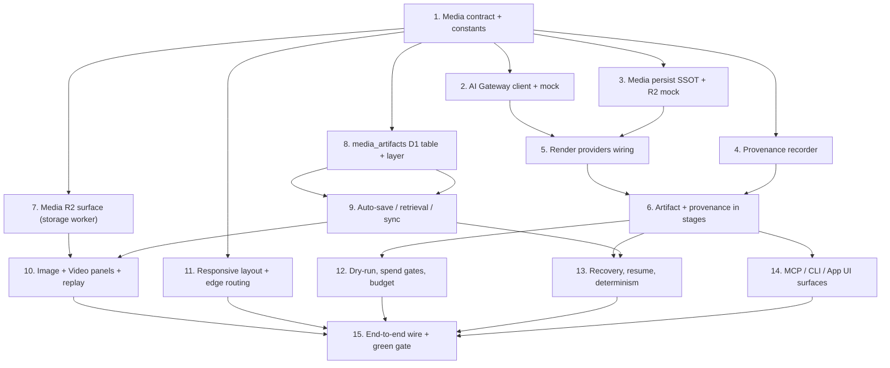

# Implementation Plan

## Overview

All work originates in the Dev SSOT `/Users/huijoohwee/Documents/GitHub/knowgrph`. Every coding task keeps source files under 600 lines, reuses shared storage/semantic-key helpers, and is validated offline through `npm run runtime:test` (network-free, no paid services). The platform target is Cloudflare only; no task introduces a Vercel or AWS dependency. Deploy/sync to Prod and Cloudflare is operator-gated and is not part of these coding tasks.

## Task Dependency Graph



```json
{
  "waves": [
    { "wave": 1, "tasks": ["1"] },
    { "wave": 2, "tasks": ["2", "3", "4", "7", "8"] },
    { "wave": 3, "tasks": ["5"] },
    { "wave": 4, "tasks": ["6", "9", "11"] },
    { "wave": 5, "tasks": ["10", "12", "13", "14"] },
    { "wave": 6, "tasks": ["15"] }
  ]
}
```

## Tasks

- [x] 1. Establish the media contract and shared constants
  - Create `contracts/media-artifact-contract.mjs` defining the `ArtifactRecord`, `ProvenanceChain`, and `ResponsiveLayoutMetadata` shapes plus the canonical bucket name `knowgrph-media`, account id `170e89fdb8679ff2fcc2900e25ed04f4`, and the R2 key scheme `runs/{runId}/{stageId}/{shotId}.{ext}` as exported constants (single source of truth).
  - Add a `sha256Hex(bytes)` helper and a `buildDurableR2Url({ runId, stageId, shotId, ext })` helper that returns `https://airvio.co/api/storage/media/runs/{runId}/{stageId}/{shotId}.{ext}`.
  - Add `contracts/__tests__/media-artifact-contract.test.mjs` asserting key-scheme formatting, durable-URL formatting, and that the contract never emits an ephemeral-URL field.
  - _Requirements: 3.3, 3.4, 3.5, 6.1_

- [x] 2. Implement the AI Gateway client with a deterministic mock
- [x] 2.1 Implement the live gateway client
  - Create `mcp/video-remix/ai-gateway-client.js` exporting `createAiGatewayClient({ fetchImpl, gatewayBaseUrl, accountId, now })` with `chat`, `image`, `submitVideo`, and `pollVideo` methods that route every call through the gateway base URL and select models `agnes/seed`, `seedream`, and `seedance`.
  - Implement async video as `submitVideo` then `pollVideo` at a fixed 5s interval up to 600s total; return a structured timeout result when the cap is reached; return a structured error (no partial artifact) on gateway/provider errors.
  - Support a per-call `model` override that replaces the group default.
  - _Requirements: 2.1, 2.2, 2.3, 2.4, 2.5, 2.6, 2.7, 2.10_
- [x] 2.2 Implement the deterministic mock gateway client
  - Add `createMockAiGatewayClient()` in the same module (or `ai-gateway-mock.js` if the file would exceed 600 lines) returning deterministic text/bytes keyed by an input hash, with a controllable fake clock so the video poll loop is testable without real time.
  - _Requirements: 8.1, 8.6, 8.8_
- [x] 2.3 Add gateway client tests
  - Add `mcp/__tests__/ai-gateway-client.test.mjs` covering model routing, the 600s poll-timeout failure path, the gateway-error failure path, the model override, and deterministic mock output.
  - _Requirements: 2.1, 2.2, 2.3, 2.4, 2.5, 2.6, 2.7, 2.10, 8.6_

- [x] 3. Implement persist-on-generate to durable R2 (SSOT)
- [x] 3.1 Implement the media persister
  - Create `mcp/video-remix/media-persist.js` exporting `createMediaPersister({ r2Client, bucket, now, verifyTimeoutMs, maxWriteAttempts })` with a `persist({ runId, stageId, shotId, ext, bytes, contentType })` method.
  - Compute the content hash; if an object with that hash already exists, return the existing object reference (dedupe). Otherwise `put` at the canonical key scheme, then HEAD/GET-verify retrievability within 10s before returning.
  - Return only `{ durableR2Url, objectKey, contentHash, deduped }`; never return or retain the ephemeral provider URL. On write failure after `maxWriteAttempts`, throw an error identifying `runId/stageId/shotId` and record no partial state; on verify failure within 10s, throw a verification error and mark not-persisted.
  - _Requirements: 3.1, 3.2, 3.3, 3.4, 3.5, 3.6, 3.7, 3.8, 3.9_
- [x] 3.2 Add an in-memory R2 client mock and persist tests
  - Add a deterministic in-memory R2 client mock (supports `put`, `get`, `head`, with injectable failures/latency).
  - Add `mcp/__tests__/media-persist.test.mjs` asserting correct key, durable-URL-only output, ephemeral-URL absence, verify-before-persist, content-hash dedupe (one object for identical content), write-failure path, and verify-failure path.
  - _Requirements: 3.1, 3.3, 3.4, 3.5, 3.6, 3.7, 3.8, 3.9_

- [x] 4. Implement the provenance recorder
  - Create `mcp/video-remix/provenance.js` exporting `buildProvenanceChain({ goal, brief, plan, toolCalls, verificationChecks })` and `assertComplete(chain)` that throws a `MissingProvenanceComponentError` when any component is absent.
  - Add `mcp/__tests__/provenance.test.mjs` asserting a complete chain is built, that a missing component throws, and that serialize then deserialize is field-for-field identical.
  - _Requirements: 6.1, 6.6_

- [x] 5. Wire BytePlus generation through the gateway and persister in render providers
  - Extend `mcp/video-remix/render-providers.js`: re-point `DEFAULT_MEDIA_BUCKET` to `knowgrph-media` and align `mediaObjectKey`/`buildMediaAssetReference` to the canonical key scheme and `Durable_R2_URL`.
  - Route the BytePlus image/video providers through `createAiGatewayClient` (Task 2) and then through `createMediaPersister` (Task 3) so a successful render returns a `Durable_R2_URL` asset reference plus the existing Credit_Ledger event.
  - Keep `selectRenderProvider` routing to `PROVIDER_MOCK` when no key is available or budget is exhausted; have the mock provider persist deterministic bytes so offline runs yield stable `Durable_R2_URL`s.
  - Update the existing render-provider tests (and add cases) for durable-URL output, ephemeral-URL absence, and mock determinism.
  - _Requirements: 2.8, 2.9, 2.11, 3.1, 3.2, 7.8, 8.8_

- [x] 6. Record artifacts and provenance in the render/stage path
  - In the render harness/stage modules (`mcp/video-remix/render-harness.js` and the stage assembler), attach the `ProvenanceChain` and the `Durable_R2_URL` to each `ArtifactRecord` before the step is marked complete; fail the step if provenance is incomplete or persistence failed.
  - Ensure no step is marked complete until its bytes are persisted and verified and its provenance recorded.
  - Add focused tests for persist-before-complete and provenance-before-complete ordering.
  - _Requirements: 3.1, 3.2, 3.7, 6.1, 6.3, 6.6_

- [x] 7. Add the media R2 surface to the storage worker
- [x] 7.1 Bind the media bucket and add the media route module
  - Add a second R2 binding to `cloudflare/workers/knowgrph-storage/wrangler.toml` (`binding = "KNOWGRPH_MEDIA_BUCKET"`, `bucket_name = "knowgrph-media"`).
  - Create `cloudflare/workers/knowgrph-storage/media.ts` exposing write (`PUT/POST`) and read/replay (`GET|HEAD`) at `/api/storage/media/runs/{runId}/{stageId}/{shotId}.{ext}`, reusing the blob CORS/error helpers; return an explicit 404/unavailable for missing objects. Register the route in `index.ts`.
  - _Requirements: 3.3, 4.1, 4.2, 4.4_
- [x] 7.2 Enforce run-scoped authentication and authorization on media routes
  - Require a verified auth credential and a run-scoped authorization check before serving read or write; deny unauthenticated requests with an auth-required error and authenticated-but-unauthorized requests with a distinct access-control error, disclosing no object data.
  - Add a media route test (worker test dir) covering write, read, 404 fallback, unauthenticated denial, and unauthorized denial.
  - _Requirements: 4.5, 4.6, 9.3, 9.4, 9.5_

- [x] 8. Add the media_artifacts D1 table and persistence layer
- [x] 8.1 Create the migration
  - Add `cloudflare/d1/migrations/<next>_media_artifacts.sql` creating the `media_artifacts` table and the `idx_media_artifacts_run` index and the `uq_media_artifacts_hash` unique index per the design data model.
  - _Requirements: 3.9, 5.1, 6.3_
- [x] 8.2 Add the artifact row read/write layer
  - Extend `cloudflare/workers/knowgrph-storage/db.ts` (or a new `mediaArtifacts.ts` if `db.ts` would exceed 600 lines) with drizzle insert/update/read for `media_artifacts`, including a monotonically increasing `version` and an upsert that rejects a lower-version write.
  - Add tests for insert, version-monotonic upsert (stale write rejected), content-hash uniqueness, and run-scoped read.
  - _Requirements: 3.9, 5.7, 6.3_

- [x] 9. Implement auto-save, retrieval, and conflict-safe sync
  - Extend the canvas storage sync layer (`canvas/src/lib/storage/knowgrphStorageSyncContract` and its callers) to auto-save Widget_Canvas state and artifact references to D1 on node-edit (500ms debounce), run-completion, approval, and artifact-ready events, completing the D1 write within 2s; retrieve on open within 3s.
  - Apply latest-result ownership via the monotonic `version`; on conflict preserve the existing edit, surface the conflict, and require explicit replace/merge/discard; on write failure retry up to 3 times then preserve unsaved local state and report; on retrieval failure report and do not treat partial/empty state as authoritative.
  - Add focused canvas tests for debounce/timing, version ownership (stale write does not overwrite), conflict preservation, and the write/retrieval failure paths.
  - _Requirements: 5.1, 5.2, 5.3, 5.5, 5.6, 5.7, 5.9, 5.10, 6.5_

- [x] 10. Implement distinct Image and Video Rich Media Panels with replay
- [x] 10.1 Add the shared base and the two panel types
  - Create `canvas/src/lib/canvas/widgets/richMediaPanel.ts` (shared base) and distinct `imagePanel.ts` and `videoPanel.ts` widget/panel types; register them with the canvas renderer and widget config (centralized renderer ids).
  - Render the artifact in its matching panel within 1s of creation, driven by shared responsive layout metadata.
  - _Requirements: 1.4, 2.8, 2.9_
- [x] 10.2 Implement replay-without-LLM and fallback
  - Load image/video from the `Durable_R2_URL` through an image/video/iframe embed with zero model/gateway/provider calls; on unreachable URL (10s, 2 retries) show an explicit fallback state without regeneration; restrict replay to entitled users.
  - Add canvas tests asserting zero outbound model/gateway/provider calls on replay, the fallback state, and the unauthorized-replay denial.
  - _Requirements: 4.1, 4.2, 4.3, 4.4, 4.5, 4.6_

- [x] 11. Implement shared responsive layout metadata and edge routing
  - Add a shared layout-metadata module that derives widget placement for the five Responsive_Proof_Class sizes (320x640, 390x844, 768x1024, 1366x768, 1920x1080) from one 1920x1080 logical frame, with explicit x/y/z, zero widget overlap, and proportional sizing within plus or minus 2 percent.
  - Apply the single-primary-surface rule below the 768px threshold; route edges to avoid the center 50 percent of widget content, with a shortest-route fallback and an unavoidable-crossing indication; on missing/invalid layout metadata retain the last valid layout and indicate the load failure.
  - Add tests for each proof class (overlap-free, proportional sizing), the mobile single-surface rule, edge center-avoidance and fallback, and the invalid-metadata path.
  - _Requirements: 1.1, 1.2, 1.3, 1.5, 1.6, 1.7, 1.9, 1.10_

- [x] 12. Enforce dry-run default, spend gates, and budget cap
  - Verify the Director defaults a Run to dry-run; before any paid model call/render/payment/deploy/consumer-repo-write/authenticated-browser action, require a single-use, unexpired (<=15min) `Approval_Token` matching the `Spend_Gate`; mark the token consumed on completion.
  - On a missing/expired/malformed token, deny and record the reason; on a budget-cap breach, halt the paid action independent of any token with no partial spend; ensure checkout/payment uses the Stripe payment worker.
  - Reconcile and extend existing gate, token, and budget tests (`mcp/video-remix/*-gate*`, `*-token*`, `budget*`) to cover token single-use, the 15-min window, and budget-cap-independent halt.
  - _Requirements: 7.1, 7.2, 7.3, 7.4, 7.5, 7.6, 7.7, 7.8, 7.9_

- [x] 13. Implement recovery, resume, and offline-determinism guarantees
  - Add configured recovery actions (retry/degrade/skip-with-evidence/resume) bounded to a 0-10 max attempt count; apply non-retry recovery when max is 0; on exhaustion stop deterministically, preserve persisted artifacts, and record a blocker.
  - On resume, restore prior state from D1 and continue without regenerating already-persisted artifacts; on restore failure report and do not regenerate.
  - Add property-based tests (`mcp/__pbt__/`) proving byte-for-byte identical artifact references and content hashes for identical mock inputs, and tests for recovery exhaustion and resume restore-failure.
  - _Requirements: 8.3, 8.4, 8.5, 8.6, 8.7, 8.8, 8.9, 8.10_

- [x] 14. Expose the pipeline across MCP, CLI, and App UI with inspection
  - Extend the `knowgrph.video_remix.run` MCP tool surface (`cloudflare/workers/knowgrph-mcp`) and the `knowgrph_parser run-goal` CLI path to emit the media-persist, provenance, and panel outputs and to expose Run state, per-stage status, approval-gate states, budget meters, and artifact references.
  - Add an equivalence test asserting identical inputs produce the same status, per-stage outcomes, and identical `Durable_R2_URL`s/provenance across surfaces (differing only by surface/run ids and timestamps).
  - _Requirements: 9.1, 9.2, 9.5_

- [x] 15. Wire the full run end-to-end and assert the offline green gate
  - Assemble the Director path so a single run executes brief, text, image, video, persist, canvas record, and provenance, producing a Run_Manifest with distinct image/video panels and durable references.
  - Add an integration-style offline test (mock providers, mock R2/D1) exercising the full path, and confirm the complete suite passes via `npm run runtime:test` with zero network requests and zero paid actions.
  - _Requirements: 2.9, 3.1, 3.2, 4.1, 4.2, 5.1, 6.1, 8.1, 8.2_

## Notes

- Tasks are ordered so the pure, offline-testable core (contract, gateway client, media persist, provenance) lands before the Cloudflare worker surfaces and canvas UI that depend on it.
- Each task is coding-only and self-validates with focused offline tests; the suite is gated by `npm run runtime:test`. The existing `runtime:test` globs include legacy `aws/**` test dirs; this feature adds no AWS dependency and its tests live under `mcp/`, `cloudflare/workers/knowgrph-mcp/`, `web/`, and `contracts/`. Pruning the AWS globs is a separate cleanup, not part of this plan.
- Keep all new source files under 600 lines; split at the noted boundaries (e.g. `ai-gateway-mock.js`, `mediaArtifacts.ts`) if a file would exceed the limit.
- Operator-gated steps (live BytePlus keys, Stripe live mode, R2 bucket creation, D1 remote migration, Cloudflare deploy/sync) are intentionally excluded from these coding tasks.
